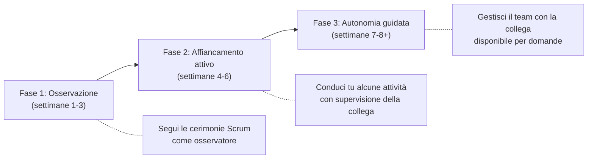
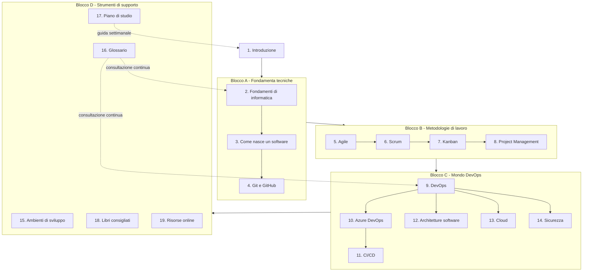

# 1. Introduzione

## Benvenuto/a a bordo! 👋

Ciao, e benvenuto/a in azienda!

Se stai leggendo questa pagina, probabilmente ti sei appena seduto/a alla tua scrivania (fisica o virtuale) con un mucchio di acronimi nuovi in testa — Scrum, Sprint, DevOps, CI/CD, board, backlog — e la sensazione di dover imparare un'intera lingua straniera in poche settimane.

Respira: è normale, ed è esattamente per questo che esiste questo corso.

Sei stato/a assunto/a come **Junior Project Manager** e, nell'arco dei prossimi 2-3 mesi, affiancherai (e poi gradualmente sostituirai) una collega che oggi lavora come **Scrum Master / Project Manager** su un team che si occupa di una **piattaforma DevOps a supporto dello sviluppo software**. Non sai cosa significhi tutto questo? Perfetto, è il punto di partenza giusto: questo corso è pensato apposta per chi, come te, arriva da un percorso di studi gestionale (Ingegneria Gestionale) e parte da zero dal punto di vista tecnico e informatico.

Non ti verrà chiesto di scrivere codice o di diventare uno sviluppatore. Ti verrà chiesto di **capire come funziona il mondo in cui il tuo team lavora**, per poterlo organizzare, facilitare e rappresentare al meglio — verso il team stesso, verso i responsabili e verso il cliente.

---

## Come è organizzato questo corso

Il corso è diviso in **19 sezioni numerate**, pensate per essere seguite **in ordine progressivo**: ogni sezione si appoggia sui concetti spiegati in quella precedente, un po' come i mattoncini di un Lego — non puoi costruire il tetto se non hai ancora messo le fondamenta.

Le sezioni si possono raggruppare in quattro grandi blocchi:

1. **Fondamenta tecniche** (sezioni 2-4): cosa è un computer, come "nasce" un software, cos'è Git/GitHub. Ti servono per capire il linguaggio di base che sviluppatori e tecnici usano ogni giorno.
2. **Metodologie di lavoro** (sezioni 5-8): Agile, Scrum, Kanban e Project Management. Sono i "metodi di organizzazione del lavoro" — qui il tuo background gestionale ti aiuterà moltissimo, perché sono concetti di organizzazione applicati al software.
3. **Mondo DevOps** (sezioni 9-14): DevOps, Azure DevOps, CI/CD, architetture software, cloud e sicurezza. È il cuore tecnico del corso, quello più legato al ruolo che andrai a occupare.
4. **Strumenti di supporto e consultazione** (sezioni 15-19): ambienti di sviluppo, glossario, piano di studio, libri e risorse online. Non sono da "studiare" una volta e basta: sono pensate per essere consultate spesso, come un dizionario o un'agenda.

Oltre alle 19 sezioni, trovi due strumenti trasversali che ti accompagneranno per tutto il percorso:

- **Il [Glossario](../16-glossario/README.md)** (sezione 16): ogni volta che incontri un termine che non ricordi — sia in questo corso, sia durante una riunione di lavoro — puoi cercarlo lì. Non c'è nulla di male nel non ricordare a memoria cosa significa "backlog" la terza volta che lo senti: è normale, ci vuole ripetizione.
- **Il [Piano di studio](../17-piano-di-studio/README.md)** (sezione 17): un programma settimanale su **8 settimane** che ti dice, settimana per settimana, cosa leggere, quanto tempo dedicarci, e con quali attività pratiche verificare di aver capito (ad esempio: "questa settimana osserva una Daily Scrum del team e prendi nota di cosa succede").

> 💡 **Consiglio pratico**: la prima volta che apri il corso, dai una scorsa veloce a tutti i titoli delle 19 sezioni (li trovi anche nel menu laterale). Non devi capire tutto subito: ti basta avere una mappa mentale di "cosa troverò più avanti", così quando in una sezione si accenna a un concetto che verrà spiegato dopo, saprai che è normale e che arriverà il suo momento.

---

## Il contesto di lavoro: cosa fa il tuo team, in parole semplici

Prima di addentrarci nei dettagli tecnici (che vedremo dalla sezione 2 in poi), proviamo a capire **a grandi linee** cosa significa lavorare su "una piattaforma DevOps a supporto dello sviluppo software". Niente gergo tecnico per ora: solo un'analogia.

Immagina una grande cucina di un ristorante che deve servire centinaia di piatti ogni giorno, in modo veloce, corretto e senza errori. In quella cucina:

- ci sono **cuochi** che preparano i piatti (gli **sviluppatori**, che scrivono il codice del software);
- ci sono **linee di produzione** che passano il piatto da una stazione all'altra — dalla preparazione, alla cottura, all'impiattamento, al controllo qualità, fino al tavolo del cliente (questo, nel mondo software, si chiama **pipeline**, e lo vedremo nella sezione 11 sul CI/CD);
- ci sono **strumenti e attrezzature** condivise da tutta la cucina — i forni, i frigoriferi, i banchi di lavoro (nel mondo software, sono i **server, gli ambienti di test, gli strumenti di collaborazione**: lo vedremo nelle sezioni su DevOps, Azure DevOps e Cloud);
- e c'è un **responsabile di sala/cucina** che si assicura che gli ordini arrivino in tempo, che i cuochi non siano sovraccarichi, che eventuali problemi (un piatto tornato indietro, un ingrediente finito) vengano gestiti e comunicati al cliente. Questo è, in sostanza, il ruolo di **Project Manager / Scrum Master**: non cucini tu, ma fai in modo che la cucina funzioni, che il team lavori bene insieme, e che il cliente sia informato e soddisfatto.

Una **piattaforma DevOps** è l'insieme di strumenti e processi che permettono a questa "cucina" di funzionare in modo automatico, veloce e sicuro: dal momento in cui un cuoco scrive una nuova ricetta (scrive codice), al momento in cui quel piatto arriva davanti al cliente (il software è "in produzione", cioè realmente usato dagli utenti finali), passando per tutti i controlli di qualità intermedi.

Non preoccuparti se questa descrizione ti sembra ancora vaga: è voluto. Da qui in avanti, sezione dopo sezione, ogni singolo "ingrediente" di questa cucina (Git, Scrum, Kanban, CI/CD, Cloud, Sicurezza...) verrà spiegato nel dettaglio, con esempi concreti tratti dal lavoro quotidiano del team.

---

## Il tuo percorso: da Junior Project Manager a Scrum Master

Il tuo percorso di crescita in questi 2-3 mesi seguirà tre fasi, che si sovrappongono gradualmente:

- **Fase 1 - Osservazione**: parteciperai alle riunioni del team (le vedremo nella sezione 6 su Scrum: si chiamano "cerimonie" o "eventi", come la Daily Scrum o lo Sprint Planning) semplicemente osservando. In questa fase il tuo compito principale è studiare le sezioni di questo corso e collegare quello che leggi a quello che vedi succedere dal vivo.
- **Fase 2 - Affiancamento attivo**: comincerai a condurre tu stesso/a alcune attività — ad esempio facilitare una Daily Scrum, aggiornare la board del progetto, preparare un report per il cliente — mentre la tua collega osserva e ti dà feedback.
- **Fase 3 - Autonomia guidata**: gestirai in autonomia le attività di routine del ruolo, con la tua collega disponibile per domande su casi più complessi, finché il passaggio di consegne non sarà completo.

Questo non è un percorso "accademico" fine a se stesso: è un percorso pensato per portarti, passo dopo passo, a **sostituire operativamente** una persona con un ruolo di responsabilità. Per questo è fondamentale che, oltre a leggere le sezioni, tu **osservi il lavoro reale del team** e faccia domande — tante domande — alla tua collega e al resto del team.

---

## Come affrontare lo studio: qualche consiglio pratico

Prima di iniziare, qualche indicazione su come vivere questo percorso senza scoraggiarti:

1. **Non devi capire tutto la prima volta.** Concetti come "pipeline CI/CD" o "architettura a microservizi" richiedono più di una lettura per sedimentare. È previsto che tu debba tornare indietro e rileggere: non è un tuo limite, è la normalità quando si impara qualcosa di completamente nuovo.
2. **Fai domande, sempre.** Non esiste una domanda "troppo banale" in questo percorso. Chi lavora ogni giorno con questi strumenti a volte dà per scontati concetti che per te sono nuovi: chiedere è il modo più veloce per colmare quel divario, molto più veloce che aspettare di capire tutto da solo/a leggendo.
3. **Collega la teoria a quello che vedi sul campo.** Ogni volta che in una riunione o in una chat di lavoro senti un termine nuovo, provalo a ricercare nel [Glossario](../16-glossario/README.md) o pensa a quale sezione del corso lo tratta. Questo doppio binario (teoria + osservazione pratica) è il modo più efficace per imparare in questo contesto.
4. **Prova gli esempi, non limitarti a leggerli.** Dove il corso propone un esempio pratico (una board Kanban, un comando Git, un diagramma di pipeline), se possibile provalo tu stesso/a in un ambiente di prova. Capire leggendo è utile, ma capire "con le mani" resta molto più solido.
5. **Usa il piano di studio come bussola, non come gabbia.** Il [Piano di studio](../17-piano-di-studio/README.md) a 8 settimane è una guida, non un obbligo rigido: se una settimana hai bisogno di più tempo su un argomento (capita spessissimo con i fondamenti di informatica, sezione 2), prenditelo. È molto meglio capire bene una sezione in più tempo che correre e arrivare in fondo con basi fragili.
6. **A fine settimana, fai un check-in con la tua collega o il tuo mentor.** Un breve confronto settimanale ti permette di validare cosa hai capito, chiarire dubbi rimasti in sospeso e ricevere indicazioni su cosa osservare la settimana successiva nel lavoro reale del team.

---

## La mappa del corso

Il diagramma seguente mostra come le 19 sezioni si collegano tra loro a grandi linee. Non è necessario memorizzarlo: serve solo per farti un'idea di dove ti troverai, sezione dopo sezione.

In sintesi: prima impari **il linguaggio di base** del software (Blocco A), poi **il modo in cui i team si organizzano** per costruirlo (Blocco B), poi **gli strumenti e i processi specifici** della piattaforma DevOps che gestirai (Blocco C), e infine hai a disposizione un **kit di strumenti di consultazione** (Blocco D) da usare per tutta la durata del percorso e anche dopo.

---

## Pronto/a per iniziare?

Nella prossima sezione, [2. Fondamenti di informatica](../02-fondamenti-informatica/README.md), partiremo dalle basi più elementari: cosa è un computer, come funziona una rete, cosa sono un server e un database. Sono i mattoncini su cui si costruirà tutto il resto del corso, quindi prenditi il tempo che serve.

Buon percorso!

## 🔗 Collegamenti

- [2. Fondamenti di informatica](../02-fondamenti-informatica/README.md) — le basi tecniche da cui parte tutto il resto del corso
- [16. Glossario](../16-glossario/README.md) — da consultare ogni volta che incontri un termine nuovo
- [17. Piano di studio](../17-piano-di-studio/README.md) — il programma dettagliato delle 8 settimane
- [19. Risorse online](../19-risorse-online/README.md) — materiali extra se vuoi approfondire fin da subito

## 📚 Risorse

- [Atlassian – Agile Coach: cos'è un team Agile](https://www.atlassian.com/agile) — introduzione generale al mindset Agile, utile come primo assaggio prima delle sezioni 5-7
- [GitHub Docs – Introduzione a Git e GitHub](https://docs.github.com/it/get-started/quickstart) — guida ufficiale per chi non ha mai usato Git, utile in anticipo sulla sezione 4
- [Microsoft Learn – Cos'è DevOps](https://learn.microsoft.com/it-it/devops/what-is-devops) — panoramica ufficiale Microsoft sul concetto di DevOps, come anteprima della sezione 9
- [Project Management Institute – What is Project Management](https://www.pmi.org/about/learn-about-pmi/what-is-project-management) — visione generale del ruolo di Project Manager, come richiamo al tuo percorso di studi
