# 2. Fondamenti di informatica


> 📄 **[Scarica questa sezione in PDF](https://darioschioppi.github.io/corso-onboarding-devops/pdf/02-fondamenti-informatica.pdf)** — utile per la stampa o la lettura offline.


Questa è una delle sezioni più importanti di tutto il corso. Non preoccuparti
se non hai mai scritto una riga di codice o non sai cosa sia un server: qui
costruiamo insieme, da zero, tutto il vocabolario tecnico che ti servirà per
capire il resto del percorso (Git, Agile, DevOps, Cloud...).

Non serve leggere tutto in una sola sessione. Prendi questa sezione a piccoli
pezzi, prova a rileggere gli esempi con i tuoi tempi e, se un concetto non è
chiaro, chiedi al tuo mentor. È normale che alcuni termini richiedano più di
una lettura per "entrare" davvero.

## 🎯 Obiettivi della sezione

Al termine di questa sezione saprai:

- distinguere hardware e software, e conoscere i componenti principali di un
  computer (CPU, RAM, disco);
- spiegare cosa fa un sistema operativo e cosa sono processi e thread;
- capire come sono organizzati i file su un computer;
- spiegare in modo semplice come funziona una rete, internet, e i protocolli
  TCP/IP, HTTP/HTTPS, DNS;
- capire cos'è un'API, cosa significa REST, riconoscere le quattro
  operazioni **CRUD** e leggere un semplice JSON, e capire a cosa servono
  **Swagger/OpenAPI** come contratto tra due team;
- capire la differenza tra database relazionali e NoSQL, cosa sono
  **chiave primaria**, **chiave esterna** e **JOIN**, e perché la
  **normalizzazione** evita di scrivere la stessa informazione più volte;
- capire cosa sono Virtual Machine, Container, Docker, Kubernetes e
  **OpenShift** — i mattoncini su cui si basa gran parte del mondo DevOps
  che incontrerai nel team;
- distinguere **Markdown** e **HTML**, i due linguaggi con cui è scritto
  anche questo stesso corso.

---

## 2.1 Cos'è un computer: hardware e software

Partiamo dalla domanda più semplice possibile: **cos'è un computer?**

Un computer è una macchina che esegue istruzioni. Punto. Tutto quello che fa
— mostrarti una pagina web, farti scrivere un documento, farti guardare un
video — è il risultato di miliardi di piccole istruzioni eseguite a
altissima velocità.

Per capire come funziona, dobbiamo separare due concetti fondamentali:

- **Hardware**: sono i componenti fisici, quelli che puoi toccare. Lo schermo,
  la tastiera, il "cervello" interno (CPU), la memoria, il disco.
- **Software**: sono le istruzioni, i programmi. Non li puoi toccare, ma
  "dicono" all'hardware cosa fare. Windows, Excel, Chrome, WhatsApp sono tutti
  software.

### Analogia: il corpo e la mente

Pensa al computer come a una persona:

- l'**hardware** è il **corpo**: braccia, gambe, occhi, cervello (come organo
  fisico). Serve per agire nel mondo fisico.
- il **software** è la **mente**: i pensieri, le conoscenze, le decisioni. È
  ciò che dice al corpo cosa fare e come farlo.

Un corpo senza una mente che lo guidi non farebbe nulla di utile: sta lì,
fermo. Una mente senza un corpo non potrebbe agire nel mondo. Hardware e
software funzionano allo stesso modo: uno senza l'altro non serve a niente.

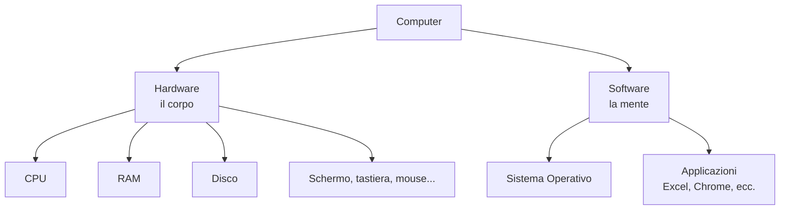

Nelle prossime sezioni vediamo nel dettaglio i pezzi principali dell'hardware
(CPU, RAM, disco) e poi il software che li coordina (il sistema operativo).

> **💡 Esempio pratico**
>
> Il laptop di lavoro di Marco è hardware (schermo, tastiera, CPU, RAM). Su
> di esso girano software come il sistema operativo, il browser e il client
> per collegarsi in VPN al progetto. Allo stesso modo, un server che ospita
> **ShopFacile**, la piattaforma e-commerce su cui lavora il team, è
> hardware (fisico o virtuale, in cloud) su cui girano software come il
> sistema operativo Linux, il motore container e l'applicazione stessa.

---

## 2.2 La CPU: il cervello che calcola

Abbiamo detto che l'hardware è il "corpo" del computer: cominciamo a
sezionarlo, partendo dal componente che fa più "pensare" tra tutti, la CPU.

La **CPU** (Central Processing Unit, "unità centrale di elaborazione") è il
componente che esegue le istruzioni. È lei che fa i calcoli, prende le
decisioni logiche ("se questo è vero, fai questo, altrimenti fai quello") e
coordina il lavoro di tutti gli altri componenti.

### Analogia: la persona che fa i calcoli

Immagina un ufficio dove arrivano richieste continue: "calcola questo",
"confronta questi due numeri", "copia questo dato qui". La CPU è la persona
seduta alla scrivania che esegue materialmente queste operazioni, una dopo
l'altra, a una velocità incredibile: miliardi di operazioni al secondo.

Alcuni concetti utili da conoscere (non servono i dettagli tecnici, solo il
significato generale, perché li sentirai nominare):

- **Core (nucleo)**: una CPU moderna ha più "core", cioè più unità di calcolo
  indipendenti nello stesso chip. È come avere più persone alla scrivania
  invece di una sola: possono lavorare su cose diverse in parallelo.
- **Frequenza (GHz)**: quante operazioni al secondo può fare, in miliardi di
  cicli. Più alta è la frequenza, più velocemente lavora (semplificando molto).

Perché ti interessa? Perché quando in futuro sentirai parlare di "server con
8 core" o "la CPU è sotto stress", saprai che si parla della capacità di
calcolo della macchina.

> **💡 Esempio pratico**
>
> Durante un picco di traffico sulla piattaforma, il team nota su una
> dashboard di monitoring che la CPU di un server è al 95% di utilizzo per
> diversi minuti. Questo è un segnale che la macchina fa fatica a gestire
> tutte le richieste in arrivo, e il team decide di aggiungere un altro
> container (ne parleremo più avanti) per distribuire il carico su più
> "persone alla scrivania".

---

## 2.3 La RAM: la memoria di lavoro temporanea

La CPU, però, non calcola nel vuoto: ha bisogno di un posto dove tenere a
portata di mano i dati su cui sta lavorando in questo preciso istante. Quel
posto è la RAM.

La **RAM** (Random Access Memory) è la memoria che il computer usa mentre
sta lavorando. È velocissima, ma ha due caratteristiche importanti:

1. è **temporanea**: quando spegni il computer, tutto quello che c'era in RAM
   viene perso;
2. è **limitata**: ha uno spazio finito (es. 8 GB, 16 GB, 32 GB).

### Analogia: la scrivania

Pensa alla RAM come alla tua **scrivania** mentre lavori. Ci metti sopra i
fogli, i libri, gli oggetti che ti servono in questo momento, perché
prenderli dallo scaffale ogni volta sarebbe troppo lento. La scrivania è
comoda e veloce da usare, ma ha spazio limitato: se hai troppi documenti,
devi rimetterne alcuni nell'armadio per farne spazio ad altri. E quando vai
via alla fine della giornata (spegni il PC), la scrivania viene "sgomberata".

Quando apri un programma (es. il browser), il computer copia le istruzioni e
i dati necessari dal disco (l'armadio, vedi sotto) alla RAM (la scrivania),
perché lavorarci da lì è molto più rapido.

Se hai "troppe cose aperte" e il computer diventa lento, spesso è perché la
RAM è piena: non c'è più spazio sulla scrivania.

> **💡 Esempio pratico**
>
> Un'applicazione del progetto va in errore con un messaggio del tipo "out
> of memory" (memoria esaurita) perché il container in cui gira ha un
> limite di RAM troppo basso per il carico di lavoro reale. Il team
> operativo interviene aumentando il limite di memoria assegnato al
> container nella configurazione, e il problema si risolve.

---

## 2.4 Il disco: la memoria permanente

Abbiamo visto che la RAM si svuota allo spegnimento: ma allora dove restano
salvati i dati di ShopFacile (ordini, prodotti, clienti) anche quando i
server vengono riavviati? Serve una memoria che non "dimentichi" nulla.

Il **disco** (hard disk o, oggi più spesso, SSD - Solid State Drive) è la
memoria dove i dati restano salvati **anche quando spegni il computer**. È
più lento della RAM, ma ha molto più spazio ed è permanente.

### Analogia: l'armadio

Il disco è come l'**armadio** di casa tua: ci conservi tutto quello che ti
serve nel lungo periodo (documenti, vestiti, ricordi). Non è comodo come la
scrivania per lavorare (aprire l'armadio, cercare la cosa giusta, richiuderlo
richiede più tempo), ma è lì che le cose restano anche quando esci di casa o
vai a dormire.

| | RAM (scrivania) | Disco (armadio) |
|---|---|---|
| Velocità | Molto veloce | Più lenta (SSD comunque abbastanza rapido) |
| Persistenza | Si perde tutto allo spegnimento | Resta salvato |
| Spazio tipico | Pochi GB (es. 16 GB) | Centinaia di GB / TB |
| Uso | Lavoro "in corso" | Archiviazione permanente |

Questa distinzione RAM/disco tornerà utile più avanti nel corso, ad esempio
quando parleremo di database (dati salvati su disco) o di **cache**: una
copia dei dati usati più di frequente, tenuta in RAM apposta per non dover
andare a recuperarli ogni volta dal disco più lento, risparmiando tempo.

> **💡 Esempio pratico**
>
> Il team riceve un alert automatico perché il disco del server che ospita
> il database è occupato all'85%. Se non si interviene (ad esempio
> archiviando o cancellando log vecchi, oppure aumentando lo spazio
> disponibile), il database rischia di non poter più scrivere nuovi dati
> quando il disco si riempie completamente.

### CPU, RAM e Disco insieme

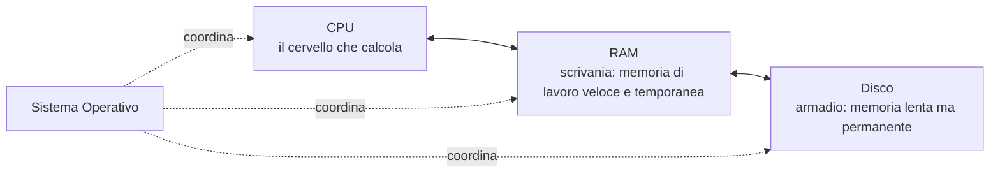

La CPU lavora sui dati che trova in RAM (velocissima ma volatile); la RAM, a
sua volta, recupera dal disco (lento ma permanente) ciò che serve quando
serve. Il Sistema Operativo, che vediamo ora, è il "direttore" che organizza
tutto questo traffico.

---

## 2.5 Il Sistema Operativo: chi coordina tutto

Il **Sistema Operativo** (Operating System, OS) è il software che gestisce
tutte le risorse hardware del computer (CPU, RAM, disco, schermo...) e
permette agli altri programmi (Excel, Chrome, ecc.) di funzionare senza dover
"parlare" direttamente con l'hardware. Perché esiste questo intermediario?
Senza di lui, ogni sviluppatore dovrebbe riscrivere il proprio software per
ogni modello di computer, e due programmi in esecuzione insieme potrebbero
rovinarsi a vicenda memoria o file, senza nessuno che arbitri.

I sistemi operativi più diffusi sono:

- **Windows** (Microsoft) — il più usato sui PC aziendali e privati;
- **macOS** (Apple) — sui computer Apple;
- **Linux** — molto usato sui **server** (i computer che erogano servizi via
  internet) e nel mondo DevOps che vedrai più avanti nel corso.

### Analogia: il direttore d'albergo

Immagina un albergo con tanti ospiti (i programmi) che hanno bisogno di
risorse condivise: le camere (memoria), il personale (CPU), la cucina
(disco). Il direttore dell'albergo (il sistema operativo) decide chi occupa
cosa, per quanto tempo, evita che due ospiti litighino per la stessa risorsa,
e fa in modo che tutto funzioni in armonia, senza che gli ospiti debbano
parlarsi direttamente tra loro per organizzarsi.

Il sistema operativo si occupa, tra le altre cose, di:

- decidere quale programma può usare la CPU in un dato istante;
- gestire quale programma può usare quanta RAM;
- organizzare i file sul disco (vedi il "File System" più sotto);
- gestire la comunicazione con periferiche (stampanti, rete, mouse...);
- fornire un'interfaccia con cui l'utente interagisce (le finestre, le icone,
  o — su Linux — anche solo una riga di comando testuale, il "terminale").

Nel mondo di cui ti occuperai come Project Manager su una piattaforma
DevOps, sentirai parlare spesso di server **Linux**, perché è il sistema
operativo più usato per far funzionare applicazioni web e infrastrutture.

> **💡 Esempio pratico**
>
> Il team pianifica una finestra di manutenzione notturna per applicare un
> aggiornamento di sicurezza al sistema operativo Linux dei server di
> produzione, perché l'aggiornamento richiede il riavvio delle macchine: si
> sceglie un orario a basso traffico per minimizzare l'impatto sugli
> utenti.

---

## 2.6 Processi e Thread

Abbiamo detto che il sistema operativo decide chi usa la CPU e quanta RAM
assegnare: ma a "chi", concretamente? La risposta è: ai processi e ai
thread, le unità di lavoro che il sistema operativo gestisce ogni istante.

Quando apri un programma (ad esempio il browser), il sistema operativo crea
un **processo**: un'istanza del programma in esecuzione, con la sua porzione
di memoria RAM dedicata, isolata dagli altri programmi.

Un processo può, a sua volta, dividersi in più **thread**: filoni di
esecuzione più piccoli che lavorano sullo stesso processo, condividendone la
memoria, ma potendo procedere in parti diverse del lavoro (anche in
parallelo, se la CPU ha più core).

### Analogia: un'azienda (processo) e i suoi dipendenti (thread)

Pensa a un **processo** come a un **reparto aziendale**: ha un proprio
budget, un proprio spazio (l'ufficio), delle proprie risorse, separate da
quelle degli altri reparti. Se un reparto va in crisi, in genere non manda in
crisi automaticamente gli altri reparti (isolamento).

I **thread** sono i **dipendenti di quel reparto**: lavorano nello stesso
spazio, condividono le stesse risorse (scrivanie, documenti, strumenti), e
possono lavorare contemporaneamente su compiti diversi dello stesso progetto
per essere più veloci. Se un dipendente combina un disastro con un documento
condiviso, però, può creare problemi anche ai colleghi dello stesso reparto,
perché condividono lo stesso spazio.

Esempio concreto: quando apri il browser (processo) e navighi su più schede,
ogni scheda può essere gestita con thread (o addirittura processi) diversi,
in modo che se una pagina web "va in crash" non blocchi necessariamente tutte
le altre schede aperte.

| Concetto | Cos'è | Analogia |
|---|---|---|
| Processo | Programma in esecuzione, con memoria propria isolata | Un reparto aziendale con il proprio ufficio |
| Thread | Filone di lavoro dentro un processo, condivide memoria con gli altri thread dello stesso processo | I dipendenti dello stesso reparto |

Questo concetto tornerà utile quando, più avanti, parlerai di applicazioni
che devono gestire **tante richieste contemporaneamente** (es. un sito web
con migliaia di visitatori): il modo in cui un software gestisce processi e
thread incide molto sulle sue performance.

Gestire tante richieste insieme apre però un problema delicato: cosa succede
se due thread (o due processi) modificano lo **stesso dato** nello stesso
istante? Se su ShopFacile è disponibile un solo pezzo di un prodotto e due
clienti cliccano "Acquista" nello stesso millisecondo, senza una gestione
corretta della contemporaneità entrambi gli ordini potrebbero essere
accettati. Questo tipo di problema, legato al "chi arriva prima" tra
operazioni simultanee, è anche la ragione per cui alcuni bug sono
**intermittenti**: si manifestano solo in rare combinazioni di tempismo, e
per questo sono tra i più difficili da riprodurre e correggere.

---

## 2.7 Il File System: come sono organizzati i file

Processi e thread lavorano sui dati in RAM, ma quei dati — codice, immagini,
configurazioni — devono comunque "vivere" da qualche parte sul disco quando
non sono in uso: è qui che entra in gioco il file system.

Il **file system** è il modo in cui il sistema operativo organizza e
memorizza i file sul disco. Praticamente ogni informazione che il computer
salva in modo permanente (documenti, foto, programmi, configurazioni) è un
**file**, e i file sono organizzati in **cartelle** (chiamate anche
"directory"), che possono contenere altre cartelle, in una struttura ad
albero.

### Analogia: l'archivio con cartelline

Pensa a un grande archivio fisico con tanti raccoglitori (cartelle), che
possono contenere altri raccoglitori più piccoli, che a loro volta
contengono i documenti (file). Per trovare un documento specifico, segui un
percorso: "vai nell'armadio Contabilità, poi nel raccoglitore 2024, poi nella
cartellina Gennaio, prendi il foglio Fattura_012".

In informatica, questo percorso si chiama **path** (percorso), e si scrive
così:

```
/contabilità/2024/gennaio/fattura_012.pdf
```

oppure, su Windows:

```
C:\Contabilità\2024\Gennaio\fattura_012.pdf
```

Ogni file ha tipicamente un **nome** e un'**estensione** che indica il suo
tipo: `.pdf`, `.docx`, `.jpg`, `.txt`, `.py` (codice Python), `.json` (vedi
più avanti), ecc.

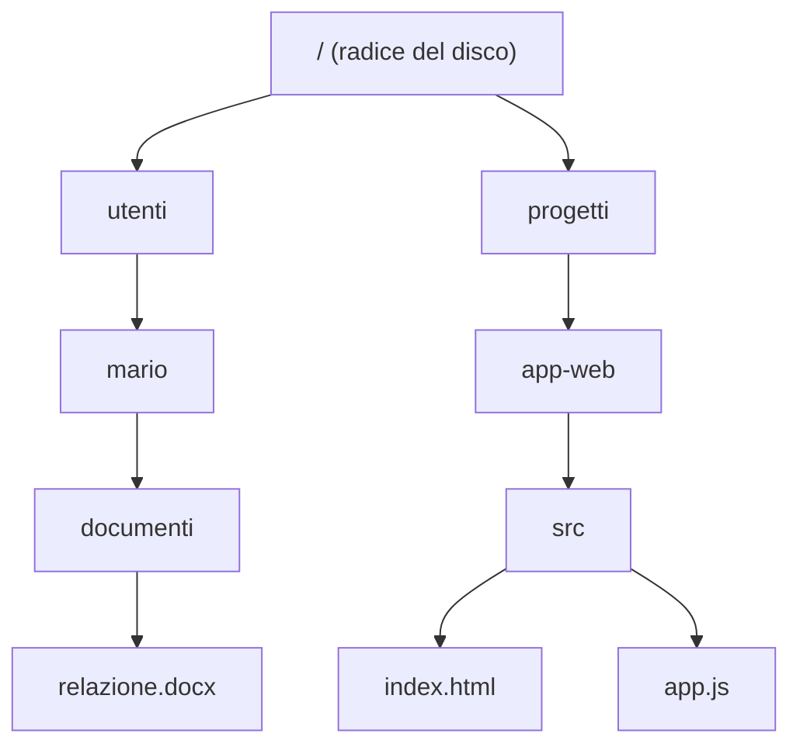

Capire i path ti servirà moltissimo più avanti, ad esempio quando vedremo
**Git** (sezione 4): i progetti software sono organizzati esattamente come
cartelle e file su un file system.

> **💡 Esempio pratico**
>
> Marco ti scrive in chat: "il file di configurazione di ShopFacile è in
> `/app/config/produzione.json`". Grazie a quello che hai appena imparato,
> sai leggere quel percorso: parti dalla radice (`/`), entri nella cartella
> `app`, poi in `config`, e lì trovi il file `produzione.json`. Non serve
> saperlo modificare, ma saperlo "leggere" ti permette di seguire la
> conversazione senza sentirti perso.

---

## 2.8 La rete: cos'è una rete di computer

Finora abbiamo parlato di un singolo computer — CPU, RAM, disco, sistema
operativo, file. Ma un server con ShopFacile installato sopra, da solo e
isolato, non servirebbe a nessuno: deve poter essere raggiunto dai clienti
che navigano da casa loro. Il valore vero della
tecnologia moderna nasce quando i computer **si parlano tra loro**: questo è
possibile grazie alle **reti**.

Una **rete di computer** è semplicemente un insieme di dispositivi collegati
tra loro, capaci di scambiarsi informazioni. Può essere piccola (la rete
Wi-Fi di casa tua, con il tuo PC, telefono, smart TV) o enorme: **internet**
è la rete di reti più grande del mondo, che collega miliardi di dispositivi.

### Analogia: il sistema postale

Pensa a una rete come al **sistema postale**: ogni casa ha un indirizzo
univoco, le lettere vengono instradate attraverso uffici postali intermedi
fino a raggiungere il destinatario giusto, indipendentemente da dove si
trovi. Anche i computer hanno un "indirizzo" (si chiama **indirizzo IP**) e
le informazioni viaggiano in "pacchetti" (come lettere) attraverso una serie
di dispositivi intermedi (router) finché non arrivano a destinazione.

> **💡 Esempio pratico**
>
> I clienti segnalano che ShopFacile "non si carica più". Marco, che si
> occupa spesso di infrastruttura, scopre che il problema non è
> nell'applicazione stessa, ma in un guasto di rete tra due data center che
> impedisce ai server di raggiungersi: un classico problema "di rete", da
> distinguere da un bug nel codice.

---

## 2.9 TCP/IP: come i computer si "spediscono lettere"

Abbiamo detto che una rete permette a dispositivi diversi di scambiarsi
informazioni: ma con quali regole precise avviene questo scambio? Le
definisce un protocollo di base che sta sotto (quasi) tutto il resto,
TCP/IP.

**TCP/IP** è l'insieme di regole (un "protocollo", cioè un linguaggio comune
condiviso) che permette a due computer di scambiarsi dati su una rete,
compreso internet. È, in un certo senso, l'alfabeto di base su cui si basa
tutta la comunicazione online.

Semplificando molto:

- **IP** (Internet Protocol) si occupa dell'**indirizzamento**: assegna a
  ogni dispositivo un indirizzo univoco (l'**indirizzo IP**, es.
  `192.168.1.10`) e si occupa di far viaggiare i dati verso l'indirizzo
  giusto, passando per i router intermedi — proprio come il sistema postale
  smista le lettere in base all'indirizzo.
- **TCP** (Transmission Control Protocol) si occupa di **spezzare i dati in
  pacchetti**, spedirli, e assicurarsi che arrivino tutti, nell'ordine
  giusto, e — se qualcosa si perde per strada — di rispedirlo. È come
  spedire un libro intero per posta spezzandolo in tante lettere numerate: il
  destinatario le riceve, le rimette in ordine con i numeri, e se manca la
  lettera 5 chiede di rispedirla.

### Analogia riassuntiva

Immagina di dover spedire un grosso pacco a un amico in un'altra città:

1. lo dividi in scatole più piccole numerate (TCP: divisione in pacchetti e
   controllo dell'ordine/integrità);
2. scrivi l'indirizzo del destinatario su ogni scatola (IP: indirizzamento);
3. le scatole passano per vari centri di smistamento (i router) prima di
   arrivare a destinazione;
4. il destinatario le riceve, controlla che siano tutte arrivate e le
   ricompone nell'ordine giusto.

Per il tuo lavoro da PM è utile soprattutto sapere che TCP/IP **è il livello
base** su cui si costruiscono protocolli più "di alto livello" che userai
spesso a parole, come HTTP.

> **💡 Esempio pratico**
>
> Un ticket segnala: "il server non risponde sulla porta 443". Se quella
> porta TCP (usata per HTTPS) è chiusa o bloccata sul firewall, nessuna
> richiesta arriva a destinazione, anche se il server è acceso e
> funzionante.

---

## 2.10 HTTP e HTTPS: il protocollo del web

TCP/IP garantisce che i dati arrivino a destinazione, ma non dice nulla su
**come** un browser deve chiedere una pagina web a un server: per quello
serve un protocollo di livello più alto, costruito sopra TCP/IP, che è
HTTP.

**HTTP** (HyperText Transfer Protocol) è il protocollo usato per
trasferire pagine web e dati tra un **client** (es. il tuo browser) e un
**server** (il computer che "ospita" il sito). È costruito sopra TCP/IP: se
TCP/IP è "come spedire un pacco", HTTP è "il modulo che compili per chiedere
qualcosa e come è strutturata la risposta".

Il funzionamento di base è semplice: **richiesta e risposta**.

1. Il client manda una **richiesta** ("dammi la pagina della home");
2. il server elabora la richiesta e manda una **risposta** (il contenuto
   della pagina, oppure un errore come il famoso "404 - pagina non trovata").

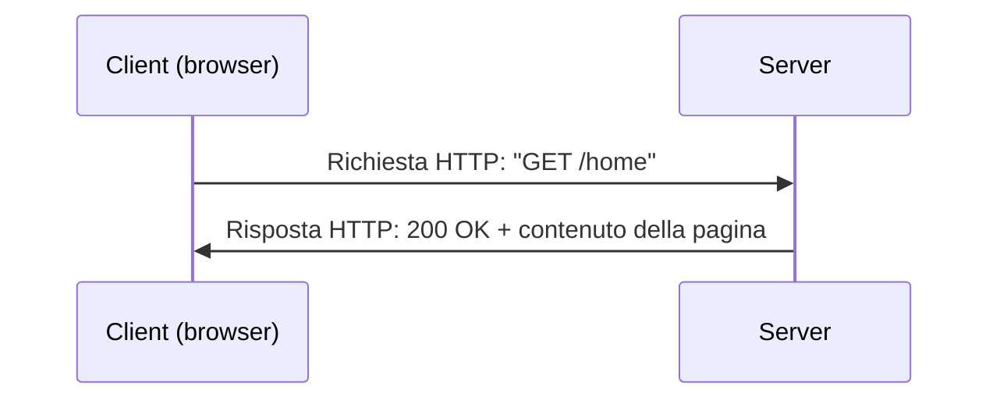

### La "S" di sicurezza: HTTPS

**HTTPS** è la versione **sicura** di HTTP: la "S" sta per "Secure". La
differenza è che i dati scambiati vengono **cifrati** (criptati), cioè
trasformati in un codice illeggibile per chiunque li intercetti lungo il
tragitto, e solo il client e il server legittimi possono "decifrarli" e
leggerli.

### Analogia: cartolina vs busta sigillata

- **HTTP** è come spedire una **cartolina postale**: chiunque la maneggi
  lungo il percorso (postini, magazzinieri) può leggerne il contenuto.
- **HTTPS** è come spedire una **lettera in una busta sigillata e cifrata**,
  che solo il destinatario ha la "chiave" per aprire e leggere.

Per questo, oggi, praticamente tutti i siti seri usano HTTPS: quando navighi
e vedi il lucchetto 🔒 nella barra degli indirizzi del browser, significa che
la connessione è protetta con HTTPS.

> **💡 Esempio pratico**
>
> Durante un test di sicurezza su ShopFacile, viene segnalato che una
> vecchia pagina interna è ancora raggiungibile in HTTP (senza cifratura).
> Giulia, sempre attenta alla qualità, la corregge configurando un
> redirect automatico verso la versione HTTPS, così chi provasse ad
> accedere alla versione non sicura viene reindirizzato automaticamente a
> quella protetta.

---

## 2.11 DNS: la rubrica telefonica di internet

Nella sezione precedente abbiamo visto che HTTP fa viaggiare richiesta e
risposta tra client e server, ma un server, come ogni computer su internet,
è identificato da un **indirizzo IP** (es. `142.250.180.4`). Ma un cliente,
per visitare il sito, digita nel browser un nome facile da ricordare come
`www.shopfacile.it`, non una sequenza di numeri. Chi fa la traduzione da
nome a indirizzo IP?

Il **DNS** (Domain Name System)!

### Analogia: la rubrica telefonica

Il DNS funziona come una **rubrica telefonica**: tu vuoi chiamare "Luca",
non ricordi il suo numero di telefono a memoria, quindi consulti la rubrica,
trovi il nome "Luca" e la rubrica ti restituisce il numero corretto da
chiamare. Il DNS fa esattamente questo per internet: un cliente chiede
`www.shopfacile.it`, il DNS gli risponde con l'indirizzo IP del server
giusto, e solo dopo il suo browser può effettivamente contattarlo.

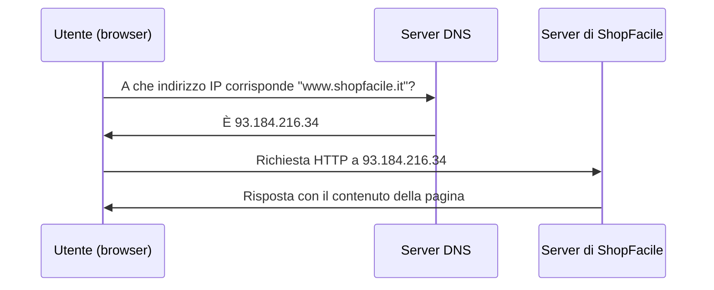

Senza il DNS dovremmo ricordare a memoria stringhe di numeri per ogni sito
che vogliamo visitare: praticamente impossibile.

> **💡 Esempio pratico**
>
> Dopo aver spostato ShopFacile su un nuovo server, il team aggiorna il
> record DNS. Per alcune ore, però, alcuni clienti continuano a raggiungere
> il vecchio server: è un fenomeno normale, chiamato "propagazione DNS",
> perché la modifica impiega un po' di tempo a diffondersi su tutti i
> server DNS del mondo.

---

## 2.12 API: come i software si parlano tra loro

Finora abbiamo visto come un client raggiunge un server (DNS, HTTP). Ma una
volta raggiunto, come chiede esattamente "dammi la lista prodotti" o
"registra questo ordine" in un linguaggio che il server capisca? Con le API.

**API** sta per **Application Programming Interface** ("interfaccia di
programmazione delle applicazioni"). È il modo in cui un software espone
delle "funzionalità" che altri software possono usare, senza dover conoscere
i dettagli interni di come funziona.

### Analogia: il cameriere al ristorante

Pensa a un ristorante: tu (il **cliente/client**) non entri in cucina a
prepararti da mangiare da solo. Ordini un piatto al **cameriere**, che porta
la tua richiesta in **cucina** (il **server**), aspetta che il piatto sia
pronto, e te lo riporta al tavolo.

Il cameriere è l'**API**: è l'intermediario con **regole precise** (il menù:
puoi ordinare solo quello che è scritto lì, in un formato preciso) che
permette a te (client) di ottenere qualcosa dalla cucina (server) senza
sapere come funzionano i fornelli o le pentole.

In termini informatici:

- un'app di meteo sul tuo telefono non "misura" la temperatura da sola: fa
  una **richiesta API** a un servizio esterno che gestisce i dati
  meteorologici, e riceve una **risposta** con i dati richiesti;
- ShopFacile, al momento del pagamento, usa le API di un servizio di
  pagamento esterno per gestire il pagamento con carta, senza dover
  costruire da zero un intero sistema di pagamenti.

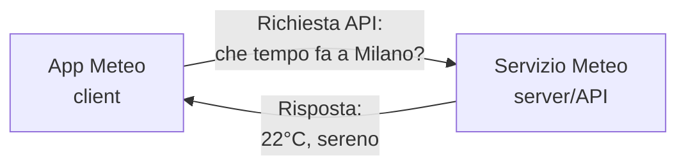

Le API sono uno dei concetti più importanti che incontrerai lavorando su una
piattaforma software: praticamente tutte le applicazioni moderne sono fatte
di tanti "pezzi" (servizi) che comunicano tra loro tramite API.

> **💡 Esempio pratico**
>
> Sara chiede al team di aggiungere l'invio di notifiche via SMS ai clienti
> di ShopFacile quando un ordine viene spedito. Invece di costruire da zero
> un intero sistema per inviare SMS (server, connessioni con gli operatori
> telefonici, ecc.), Marco integra le API REST di un servizio esterno
> specializzato: basta inviare una richiesta con numero e testo del
> messaggio, e il servizio esterno si occupa di tutto il resto.

---

## 2.13 REST: uno stile comune per costruire API

Le API, come abbiamo appena visto, permettono a due software di parlarsi.
Ma perché tutti riescano a capirsi senza reinventare ogni volta le regole
del "dialogo", serve un modo condiviso di costruirle: lo stile REST.

**REST** (REpresentational State Transfer) non è una tecnologia specifica,
ma uno **stile**, un insieme di convenzioni condivise su come costruire le
API in modo semplice, standard e prevedibile, sfruttando proprio HTTP che
abbiamo visto sopra.

Le API costruite seguendo lo stile REST si chiamano **API REST** (o
"RESTful"), e sono lo standard più diffuso oggi per far comunicare
applicazioni web.

L'idea di base: si usano gli indirizzi web (URL) per identificare le
**risorse** (es. "un cliente", "un ordine"), e si usano dei **verbi HTTP**
standard per indicare l'azione da compiere su quella risorsa:

| Verbo HTTP | Significato | Analogia |
|---|---|---|
| `GET` | Leggi/recupera dati | "Fammi vedere l'ordine numero 42" |
| `POST` | Crea un nuovo elemento | "Crea un nuovo ordine" |
| `PUT` / `PATCH` | Modifica un elemento esistente | "Aggiorna l'indirizzo di spedizione dell'ordine 42" |
| `DELETE` | Elimina un elemento | "Cancella l'ordine 42" |

Esempio pratico: l'API REST che ShopFacile usa per gestire gli ordini
potrebbe avere un indirizzo come:

```
GET https://api.shopfacile.it/ordini/42
```

per "recuperare i dettagli dell'ordine con id 42".

Sentirai questo termine costantemente parlando con gli sviluppatori del
team, quindi è importante che il concetto ti sia chiaro.

### CRUD: le quattro operazioni fondamentali

Guarda di nuovo la tabella dei verbi HTTP appena vista: leggere, creare,
modificare, eliminare. Non è un caso che si ripresentino quasi identiche in
ogni sistema che gestisce dati — hanno un nome tecnico che sentirai usare in
continuazione dagli sviluppatori: **CRUD**, l'acronimo di **Create, Read,
Update, Delete** (Crea, Leggi, Aggiorna, Elimina).

Sono le quattro operazioni fondamentali che si possono fare su un qualsiasi
dato salvato da qualche parte — un ordine, un cliente, una polizza — e si
ritrovano a ogni livello che hai incontrato finora:

| Operazione | Verbo HTTP | Comando SQL (sezione 2.15) |
|---|---|---|
| Create (crea) | `POST` | `INSERT` |
| Read (leggi) | `GET` | `SELECT` |
| Update (aggiorna) | `PUT` / `PATCH` | `UPDATE` |
| Delete (elimina) | `DELETE` | `DELETE` |

Perché ti interessa da PM? Perché quando un tecnico dice "è solo un CRUD"
sta dicendo qualcosa di preciso sulla stima: che la funzionalità richiesta
si limita a creare, leggere, aggiornare ed eliminare un dato, senza logica
di business particolare dietro — un lavoro relativamente standard e
prevedibile. Quando invece dice "non è un CRUD" (o "c'è più logica sotto"),
ti sta avvisando che dentro quell'operazione ci sono regole, calcoli,
verifiche, integrazioni con altri sistemi: la stima va rivista al rialzo, ed
è un segnale che vale la pena approfondire prima di fissare una scadenza.

### Swagger e OpenAPI: il contratto tra due team

Immagina che Ahmed debba esporre un'API REST per gli ordini di ShopFacile, e
che un partner esterno (un servizio di logistica) debba integrarsi con
quell'API per ricevere gli ordini da spedire. Il modo "artigianale" di
gestire questo accordo è un documento Word con l'elenco delle chiamate
possibili, i campi richiesti, un paio di esempi. Funziona per una settimana:
poi il documento invecchia, qualcuno cambia un campo nel codice senza
aggiornarlo, e il team esterno scopre — in fase di test, non prima — che la
specifica dice `codiceCliente` mentre l'API restituisce davvero
`customerCode`. L'integrazione si rompe, e nessuno dei due team ha
"sbagliato": si stavano semplicemente fidando di un documento che nessuno
aveva l'obbligo di mantenere sincronizzato con la realtà.

Da questo problema nasce **OpenAPI**: uno standard per descrivere un'API
REST — le sue risorse, i verbi disponibili, i campi di ogni richiesta e
risposta — in un formato leggibile sia da una persona che da una macchina
(tipicamente JSON o YAML, il formato JSON lo hai visto in §2.14). **Swagger**
è il nome della famiglia di strumenti storicamente associata a OpenAPI: a
partire dalla stessa descrizione, genera automaticamente documentazione
navigabile nel browser — che permette di "provare" le chiamate senza
scrivere una riga di codice — oltre a codice di base (client e stub) per chi
deve integrarsi.

Il punto per un PM non è lo strumento, ma il cambio di natura del
documento: una specifica OpenAPI non è più "un documento di cui ci fidiamo",
è un **contratto** verificabile. Questo permette a due team di lavorare **in
parallelo**: chi fornisce l'API e chi deve consumarla possono partire nello
stesso momento, il secondo costruendo la propria integrazione contro la
specifica anche prima che il servizio esista davvero.

> 💡 **Trade-off**: il contratto va comunque mantenuto a mano — se Ahmed
> cambia l'API e non aggiorna la specifica OpenAPI, il problema del
> documento Word invecchiato torna identico, solo con un formato più
> elegante. E una specifica formalmente corretta ma concettualmente
> sbagliata (es. descrive un campo come opzionale quando il servizio in
> realtà lo richiede sempre) dà a entrambi i team una falsa sicurezza:
> tutti si fidano di un contratto che non corrisponde al comportamento
> reale.

---

## 2.14 JSON e XML: i formati per scambiarsi dati

Abbiamo visto come un'API REST identifica una risorsa come "l'ordine 42" e
come intervenirci (GET, POST...). Ma in che formato viaggiano concretamente
i dati di quell'ordine dentro la richiesta e la risposta? Qui entrano in
gioco JSON e XML.

Immagina cosa succederebbe senza un formato comune: ogni sistema
inventerebbe il proprio modo di scrivere "l'ordine 42, cliente Mario Rossi,
totale 129,90", e ogni coppia di sistemi che deve parlarsi (il catalogo, i
pagamenti, le spedizioni...) richiederebbe un "traduttore" dedicato, con il
numero che esplode rapidamente al crescere dei sistemi coinvolti. Per
questo due software che si scambiano dati (ad esempio tramite un'API)
usano un **formato comune**, condiviso, che entrambi sappiano "leggere"
senza bisogno di un intermediario su misura. I due formati più diffusi
sono **JSON** e **XML**.

### JSON

**JSON** (JavaScript Object Notation) è oggi il formato più usato per
scambiare dati tra applicazioni web, perché è semplice da leggere sia per un
umano che per un computer. Organizza i dati in coppie **chiave: valore**,
proprio come una piccola scheda informativa.

Esempio: i dati di un ordine in formato JSON potrebbero essere così:

```json
{
  "id_ordine": 42,
  "cliente": "Mario Rossi",
  "totale": 129.90,
  "spedito": false,
  "prodotti": [
    "Tastiera",
    "Mouse"
  ]
}
```

Si legge in modo abbastanza naturale: "l'ordine numero 42, del cliente Mario
Rossi, con un totale di 129,90, non ancora spedito, contiene una tastiera e
un mouse". Le parentesi graffe `{ }` delimitano un "oggetto" (una scheda di
dati), le parentesi quadre `[ ]` delimitano una lista di valori.

### XML

**XML** (eXtensible Markup Language) è un formato più "vecchio" ma ancora
molto usato in certi contesti aziendali (soprattutto in sistemi legacy o in
alcuni settori come banking e pubblica amministrazione). Usa dei **tag** che
racchiudono i dati, un po' come l'HTML delle pagine web:

```xml
<ordine>
  <id>42</id>
  <cliente>Mario Rossi</cliente>
  <totale>129.90</totale>
  <spedito>false</spedito>
</ordine>
```

### Quale scegliere?

Nella maggior parte dei progetti moderni con cui avrai a che fare, il formato
predefinito sarà **JSON**: è più compatto, più leggibile, e più facile da
usare nella programmazione moderna. XML lo incontrerai più raramente, magari
in integrazioni con sistemi più datati.

Questo non significa che XML sia "superato": resta preferibile quando serve
una **validazione rigorosa** con uno schema formale (settori come banking o
pubblica amministrazione) o quando servono i cosiddetti **namespace** —
un modo di "etichettare" i tag con un prefisso, per evitare che due
sistemi diversi usino per errore lo stesso nome di campo con significati
diversi — capacità che JSON non offre allo stesso livello.

---

## 2.15 Database relazionali e SQL

Prima che ShopFacile avesse un database vero e proprio per gli ordini, il
team operativo teneva l'elenco su un foglio Excel condiviso. Un giorno, due
operatori aprono lo stesso ordine nello stesso minuto: uno aggiorna
l'indirizzo, l'altro lo segna come "spedito". Excel salva l'ultima modifica
sopra l'altra senza avvisare nessuno, e non c'è cronologia da consultare per
capire chi ha scritto cosa. È il problema della copia condivisa senza
tracciamento: lo ritroverai identico, applicato al codice invece che a un
foglio Excel, quando arriverai a Git nella sezione 4 — è lo stesso schema
di fondo, con un file diverso.

Il JSON dell'ordine visto poco fa va quindi salvato in un modo che eviti il
problema appena descritto, non basta scambiarlo in una risposta API. È qui
che entrano in gioco i database.

Un **database** (base di dati) è un sistema organizzato per **salvare,
organizzare e recuperare grandi quantità di dati** in modo efficiente e
strutturato, gestendo correttamente gli accessi simultanei e mantenendo una
cronologia delle modifiche — molto più potente e affidabile di un semplice
file Excel per gestire dati che crescono in volume e complessità.

I **database relazionali** organizzano i dati in **tabelle**, esattamente
come un foglio Excel: righe e colonne.

### Analogia: il foglio Excel evoluto

Pensa a un database relazionale come a un insieme di fogli Excel collegati
tra loro:

- ogni **tabella** è un foglio (es. "Clienti", "Ordini", "Prodotti");
- ogni **riga** è un singolo elemento (es. un cliente specifico);
- ogni **colonna** è un attributo di quell'elemento (es. nome, cognome,
  email).

Le tabelle possono essere **collegate** tra loro: ad esempio, la tabella
"Ordini" può avere una colonna che indica "a quale cliente appartiene questo
ordine" — questa è la "relazione" da cui prende il nome "database
relazionale".

Esempio, tabella `Clienti` del database di ShopFacile:

| id | nome | email |
|----|------|-------|
| 1  | Mario Rossi | mario.rossi@email.com |
| 2  | Anna Bianchi | anna.bianchi@email.com |

### Chiave primaria: come distinguere due righe che si somigliano

Guarda di nuovo quella colonna `id`: perché esiste, se la tabella ha già
`nome` ed `email`? Il problema che risolve è concreto: prova a immaginare due
clienti che si chiamano entrambi "Mario Rossi" (capita più spesso di quanto
si pensi). Se il database cercasse gli ordini di "Mario Rossi" per nome,
potrebbe restituire — o modificare — gli ordini della persona sbagliata.

Per questo ogni tabella ha una **chiave primaria**: una colonna (o un
piccolo gruppo di colonne) che identifica **in modo univoco e stabile** ogni
riga, e che il database stesso si impegna a non far duplicare mai. Perché
funzioni, una chiave primaria deve essere:

- **unica**: nessuna altra riga può averne lo stesso valore;
- **mai vuota**: ogni riga deve averne una;
- **stabile nel tempo**: non deve cambiare durante la vita della riga.

È tentante usare come chiave primaria qualcosa che sembra già unico, come il
codice fiscale o l'indirizzo e-mail di un cliente — ma sono scelte
rischiose: un'e-mail può cambiare (il cliente cambia provider), un codice
fiscale può essere inserito con un errore di digitazione e va corretto, e in
entrambi i casi "correggere la chiave primaria" è un'operazione delicata che
rischia di rompere ogni collegamento con le altre tabelle. Per questo, nella
grande maggioranza dei casi, si preferisce un numero generato apposta dal
database (come l'`id` della tabella `Clienti`), che non ha alcun significato
nel mondo reale e quindi non ha motivo di dover cambiare mai.

Esempio, tabella `Ordini`:

| id | id_cliente | totale |
|----|------------|--------|
| 101 | 1 | 129.90 |
| 102 | 2 | 59.00 |

### Chiave esterna: il collegamento che il database fa rispettare

Nota la colonna `id_cliente` nella tabella `Ordini`: contiene lo stesso
valore della chiave primaria della tabella `Clienti`. Questo collegamento si
chiama **chiave esterna** (foreign key), ed è ciò che rende possibile la
"relazione" da cui il database relazionale prende il nome.

Non è solo una convenzione di comodo: è una regola che il database **fa
rispettare attivamente**. Se qualcuno provasse a creare un ordine con
`id_cliente = 999` e nella tabella `Clienti` non esistesse nessun cliente con
quell'id, il database **rifiuta l'operazione**. Questo si chiama vincolo di
**integrità referenziale**, ed è un tassello dell'integrità dei dati di cui
hai già sentito parlare in questa sezione: garantisce che non possano
esistere in giro ordini "orfani", intestati a un cliente inesistente.

Perché interessa a un PM: se un giorno senti che una funzionalità è stata
bloccata perché "violerebbe un vincolo di integrità referenziale", non è un
capriccio tecnico — è il database che sta impedendo attivamente che i dati
diventino incoerenti.

### Relazioni: uno-a-molti e molti-a-molti

La relazione tra `Clienti` e `Ordini` è di tipo **uno-a-molti**: un cliente
può avere molti ordini, ma ogni ordine appartiene a un solo cliente. È il
caso più comune, e si riconosce così: la chiave esterna vive nella tabella
"dalla parte dei molti" (`Ordini`).

Esiste anche il caso in cui **entrambi i lati possono avere molti elementi
collegati** — le **relazioni molti-a-molti**. Pensa al dominio assicurativo
che frequenterai: un cliente può avere più polizze, ma soprattutto ogni
**polizza** può includere più **garanzie** (furto, incendio, responsabilità
civile...), e la stessa garanzia (es. "furto") può comparire in tante
polizze diverse. Non puoi risolverlo con una singola chiave esterna da un
lato o dall'altro, perché nessuna delle due tabelle "contiene" davvero
l'altra. La soluzione è una terza tabella, chiamata **tabella ponte** (o
tabella di associazione), che contiene solo coppie di chiavi esterne:

| id_polizza | id_garanzia |
|---|---|
| 1 | Furto |
| 1 | Incendio |
| 2 | Furto |
| 2 | Responsabilità civile |

Questa tabella dice, riga per riga, "questa polizza include questa
garanzia": la polizza 1 ha furto e incendio, la polizza 2 ha furto e
responsabilità civile, e "furto" compare in entrambe senza essere duplicato
come informazione.

### SQL: il linguaggio per "interrogare" il database

**SQL** (Structured Query Language) è il linguaggio standard usato per
"interrogare" (query) un database relazionale: chiedere dati, inserirne di
nuovi, modificarli o eliminarli.

Esempio semplicissimo: per chiedere "dammi il nome e l'email di tutti i
clienti", in SQL scriveresti:

```sql
SELECT nome, email FROM Clienti;
```

Per chiedere "dammi solo gli ordini con un totale superiore a 100 euro":

```sql
SELECT * FROM Ordini WHERE totale > 100;
```

Non ti verrà chiesto di scrivere SQL nel tuo ruolo di PM, ma capire questa
logica di base ti aiuterà a seguire discussioni tecniche sul team riguardo
"performance del database", "query lente", "migrazione dati", ecc.

### JOIN: perché i dati sono divisi in tabelle diverse

Torniamo alle due tabelle `Clienti` e `Ordini`. Un giorno Sara chiede: "mi
serve l'elenco degli ordini con il nome del cliente accanto, per mandarlo al
servizio spedizioni". Le due informazioni, però, vivono in due tabelle
diverse. La risposta è la **JOIN**: un'istruzione SQL che "unisce"
temporaneamente le righe di due tabelle collegate tra loro tramite la chiave
esterna vista sopra.

```sql
SELECT Ordini.id, Clienti.nome, Ordini.totale
FROM Ordini
JOIN Clienti ON Ordini.id_cliente = Clienti.id;
```

Il risultato è una nuova tabella "virtuale" che mette insieme i dati delle
due:

| id | nome | totale |
|----|------|--------|
| 101 | Mario Rossi | 129.90 |
| 102 | Anna Bianchi | 59.00 |

Ma perché non scrivere semplicemente il nome del cliente **dentro** ogni riga
della tabella `Ordini`, evitando del tutto la JOIN? Perché il nome di Mario
Rossi, se ha fatto 300 ordini, finirebbe scritto 300 volte, in 300 posti
diversi. Se un giorno Mario Rossi corregge il proprio nome, bisognerebbe
aggiornarlo in 300 righe — e se anche una sola venisse dimenticata, il
database conterrebbe due versioni diverse della stessa verità. Il principio
che evita questo problema si chiama **normalizzazione**: ogni informazione
viene scritta **una volta sola**, nel posto giusto, e recuperata altrove
tramite relazioni e JOIN quando serve.

Esistono due tipi principali di JOIN, e la differenza tra loro è una delle
fonti più comuni di report "sbagliati" che un PM incontra:

- una **INNER JOIN** (quella vista sopra) restituisce solo le righe che
  hanno una corrispondenza in entrambe le tabelle: se un cliente non ha mai
  fatto un ordine, non compare affatto nel risultato;
- una **LEFT JOIN** restituisce **tutte** le righe della prima tabella, anche
  quelle senza corrispondenza nella seconda (con dei "vuoti" al posto dei
  dati mancanti).

Caso concreto: se Sara vuole "l'elenco di tutti i clienti, con il totale
ordinato se ne hanno fatto uno", e chi scrive la query usa una INNER JOIN
invece di una LEFT JOIN, i clienti che non hanno mai ordinato **spariscono
silenziosamente** dal report — non per un bug evidente, ma per la scelta di
JOIN sbagliata rispetto alla domanda di business. È esattamente il tipo di
errore che produce un numero "pulito" ma scorretto in una presentazione.

### Vista (VIEW): dare un nome a una query complessa

Se la query con la JOIN qui sopra viene usata ogni settimana per il report
delle spedizioni, ha senso salvarla con un nome, così chi si occupa di
reporting non deve riscriverla — e non deve nemmeno sapere come sono
strutturate le tabelle sottostanti. Questo si chiama **vista** (VIEW): una
query salvata, che si comporta come se fosse essa stessa una tabella.

```sql
CREATE VIEW OrdiniConCliente AS
SELECT Ordini.id, Clienti.nome, Ordini.totale
FROM Ordini
JOIN Clienti ON Ordini.id_cliente = Clienti.id;
```

Da quel momento, chiunque può scrivere semplicemente
`SELECT * FROM OrdiniConCliente` senza conoscere la JOIN che c'è dietro.

> 💡 **Trade-off**: la vista nasconde la complessità, ma non la elimina — la
> query dietro le quinte viene comunque eseguita ogni volta. Se qualcuno
> crea una vista che si appoggia su un'altra vista, che a sua volta si
> appoggia su un'altra ancora, il database finisce a eseguire in cascata
> query via via più pesanti a ogni chiamata: è un problema di performance
> che nessuno vede arrivare, perché ogni singola vista, presa da sola,
> sembra innocua.

### Modellare i dati prima di scrivere codice

Tutto quello che hai visto in questa sottosezione — quali tabelle creare,
quali colonne, quali relazioni, dove metterle — è il risultato di una fase
che si chiama **modellazione dei dati**: decidere, prima ancora di scrivere
una riga di codice, come rappresentare la realtà del progetto (clienti,
ordini, polizze, garanzie) in tabelle e relazioni coerenti.

Non è un dettaglio tecnico da poco: un errore nel modello (una relazione
uno-a-molti dove in realtà serviva molti-a-molti, una chiave primaria scelta
male) scoperto quando il sistema è già in produzione, con migliaia di righe
già scritte, costa ordini di grandezza in più da correggere rispetto a un
errore scoperto sul tavolo da disegno, prima che una sola riga di dati sia
mai stata salvata. È uno dei motivi per cui gli sviluppatori insistono a
volte per "fermarsi a discutere il modello" prima di partire a costruire una
nuova funzionalità, anche quando sembra di poter "iniziare subito a
programmare".

Esempi di database relazionali diffusi: **Microsoft SQL Server**,
**PostgreSQL**, **MySQL**, **Oracle Database**.

---

## 2.16 Database NoSQL

Le tabelle rigide di SQL funzionano benissimo per dati regolari come clienti
e ordini. Ma cosa succede quando i dati da salvare hanno una struttura molto
variabile, come il catalogo prodotti di ShopFacile? Qui SQL comincia a
scricchiolare, ed entrano in gioco i database NoSQL.

I database **NoSQL** ("Not Only SQL") sono un'alternativa ai database
relazionali, pensati per casi in cui la rigida struttura a tabelle non è la
scelta migliore.

### Perché esistono

Immagina di dover salvare dati molto **variabili** nella struttura (ad
esempio: i prodotti nel catalogo di ShopFacile, dove ogni categoria ha
attributi diversi — un libro ha "autore" e "numero pagine", uno smartphone ha
"memoria" e "colore"). Costringere questi dati in tabelle rigide e uniformi
sarebbe scomodo. I database NoSQL permettono maggiore **flessibilità**.

### Analogia: cartelle e documenti vs archivio rigido

Se il database relazionale è come un archivio con moduli standard identici
per tutti (ogni modulo ha esattamente gli stessi campi da riempire), un
database NoSQL è più come una serie di **cartelline con documenti liberi**:
ogni documento può avere una struttura leggermente diversa, senza dover
rispettare uno schema fisso e identico per tutti.

Molti database NoSQL salvano i dati proprio in formato **JSON** (quello che
abbiamo visto sopra):

```json
{
  "prodotto": "Smartphone X",
  "colore": "nero",
  "memoria_gb": 128
}
```

```json
{
  "prodotto": "Libro Y",
  "autore": "M. Verdi",
  "pagine": 320
}
```

Due prodotti, campi diversi, nello stesso database: con un database
relazionale classico sarebbe più complicato da gestire in modo pulito.

### Quando si usano

- **Relazionali (SQL)**: dati molto strutturati, con relazioni chiare tra
  entità (es. sistemi gestionali, contabilità, ordini). Garantiscono forte
  coerenza dei dati.
- **NoSQL**: dati con struttura variabile o che cambia spesso, grandi volumi
  con necessità di scalare velocemente, casi come cataloghi prodotto, log,
  dati di sessione, messaggistica.

Esempi di database NoSQL diffusi: **MongoDB**, **Cosmos DB** (Azure),
**Redis**, **Cassandra**.

Non esiste "il migliore in assoluto": la scelta dipende dal tipo di dati e
dal problema da risolvere. Sentirai il team discutere di questa scelta nelle
fasi di progettazione di un nuovo servizio.

---

## 2.17 Virtual Machine: un computer dentro un computer

Fin qui abbiamo parlato di dati (SQL, NoSQL): ora torniamo all'infrastruttura
che fa girare ShopFacile. Un modo classico per ricavare più "computer"
indipendenti da un solo server fisico è la macchina virtuale.

Una **Virtual Machine** (VM, macchina virtuale) è un software che **simula
un computer completo** dentro un altro computer fisico. Dal punto di vista di
chi la usa, si comporta esattamente come un computer vero e proprio: ha il
suo sistema operativo, le sue applicazioni, il suo spazio disco — ma "vive"
dentro un computer fisico più grande (l'**host**), condividendo con altre
eventuali VM le risorse hardware reali.

Il software che crea e gestisce le macchine virtuali si chiama
**hypervisor**.

### Analogia: un condominio con appartamenti indipendenti

Pensa a un edificio (il computer fisico, "host") diviso in **appartamenti**
indipendenti (le VM). Ogni appartamento ha la sua porta blindata, i suoi
mobili, la sua cucina — è completamente **isolato** dagli altri, anche se
condividono le stesse fondamenta, gli stessi impianti elettrici e idraulici
dell'edificio. Se un appartamento va a fuoco, in teoria gli altri restano al
sicuro (isolamento).

Perché sono utili? Perché su un solo computer fisico potente puoi far
"vivere" tante macchine virtuali diverse, ciascuna con il proprio sistema
operativo e le proprie applicazioni, risparmiando sui costi hardware e
semplificando la gestione (puoi creare, cancellare, spostare una VM molto più
facilmente di un computer fisico).

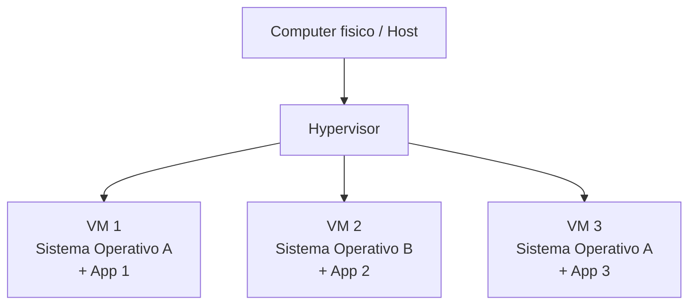

> **💡 Esempio pratico**
>
> Marco deve testare un aggiornamento importante prima di applicarlo ai
> server di produzione di ShopFacile. Crea una nuova VM di test partendo
> da un'immagine standard identica a quella di produzione, prova
> l'aggiornamento lì sopra senza alcun rischio per i clienti reali, e solo
> dopo aver verificato che tutto funziona procede con l'aggiornamento vero
> e proprio.

---

## 2.18 Container: più leggeri di una VM

Le VM funzionano, ma portare con sé un intero sistema operativo per ogni
appartamento del "condominio" ha un costo in termini di peso e velocità.
Esiste un'alternativa più leggera, molto usata oggi anche per ShopFacile: i
container.

Un **container** è un altro modo per "isolare" un'applicazione e le sue
dipendenze, ma in modo molto più **leggero** rispetto a una VM: invece di
simulare un computer intero con il suo sistema operativo, un container
condivide il sistema operativo della macchina che lo ospita, isolando solo
l'applicazione e ciò che le serve per funzionare (librerie, configurazioni,
file necessari).

### Analogia: la valigia pronta all'uso

Se la VM è un intero appartamento indipendente, il **container** è più come
una **valigia già pronta con tutto il necessario**: vestiti, spazzolino,
caricabatterie — tutto quello che serve per il viaggio, organizzato e pronto.
Puoi portare questa valigia in qualsiasi "casa" (computer/server) e sarai
subito operativo, perché hai già con te tutto ciò che ti serve, senza dover
allestire un'intera casa da zero (come faresti con una VM).

Questo risolve un problema molto concreto e comune nello sviluppo software:
*"sul mio computer funzionava, perché sul server non funziona?"*. Il
container "porta con sé" esattamente le stesse versioni di librerie,
configurazioni e dipendenze usate in fase di sviluppo, garantendo che
l'applicazione si comporti allo stesso modo ovunque venga eseguita.

### VM vs Container: il confronto visivo

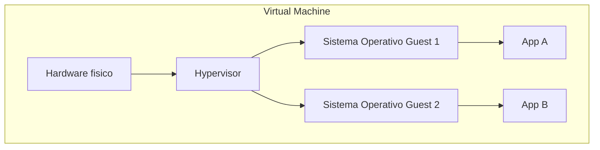

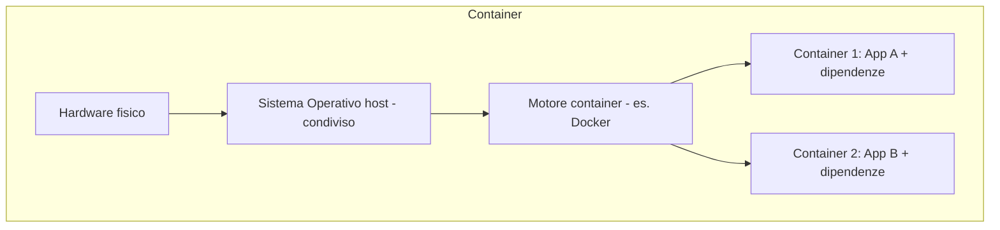

La differenza chiave: ogni VM porta con sé un **intero sistema operativo**
(pesante, lento da avviare), mentre i container **condividono** il sistema
operativo della macchina host e sono quindi molto più leggeri, veloci da
avviare (secondi, invece di minuti) e più efficienti in termini di risorse.

| | Virtual Machine | Container |
|---|---|---|
| Cosa isola | Un intero computer virtuale, con proprio OS | Solo l'applicazione e le sue dipendenze |
| Peso | Pesante (GB), OS completo | Leggero (MB), condivide l'OS host |
| Tempo di avvio | Minuti | Secondi |
| Isolamento | Molto forte (OS separato) | Buono, ma leggermente meno forte della VM |

> **💡 Esempio pratico**
>
> Un cliente segnala un bug su ShopFacile in produzione. Ahmed, invece di
> provare a indovinare cosa non funzioni, lancia in locale sul proprio
> computer lo stesso identico container usato in produzione (stesse
> librerie, stessa versione del linguaggio, stessa configurazione) e
> riesce a riprodurre il problema in pochi minuti, con la certezza di
> lavorare in un ambiente identico a quello reale.

---

## 2.19 Docker: lo strumento più diffuso per i container

Abbiamo appena descritto cosa sono i container, ma "chi" li crea e li fa
girare concretamente? Nella grande maggioranza dei casi, incluso il progetto
ShopFacile, lo strumento usato è Docker.

Come abbiamo appena visto, il problema di fondo è quello del "funziona sul
mio computer": il laptop di Marco, il server di test e quello di produzione
hanno spesso versioni leggermente diverse di librerie e configurazioni, e
Docker è nato apposta per spedire il software **insieme al suo intero
ambiente**, così che i tre coincidano sempre esattamente.

**Docker** è oggi lo strumento più popolare e diffuso per creare, distribuire
ed eseguire container. È diventato talmente centrale nel mondo dello sviluppo
software moderno che spesso "container" e "Docker" vengono usati quasi come
sinonimi (anche se Docker è solo uno degli strumenti possibili).

Concetti chiave da conoscere (senza bisogno di saperli usare tecnicamente):

- **Immagine (image)**: è il "modello" o la "ricetta" del container: contiene
  l'applicazione e tutto ciò che le serve per funzionare (un po' come la
  lista precisa del contenuto della valigia, prima ancora di farla). È come
  una fotografia di uno stato pronto all'uso.
- **Container**: è un'immagine "in esecuzione", cioè la valigia effettivamente
  in uso, attiva, con l'applicazione che sta girando.
- **Dockerfile**: è un file di testo con le istruzioni su come costruire
  un'immagine (es. "parti da questo sistema base, installa queste librerie,
  copia questi file, avvia questo comando").
- **Registry** (es. Docker Hub): è un "magazzino" online dove si salvano e si
  condividono le immagini Docker, pronte per essere scaricate e usate.

### Analogia riassuntiva

- il **Dockerfile** è la ricetta scritta;
- l'**immagine** è la valigia già fatta secondo quella ricetta, pronta ma non
  ancora "in viaggio";
- il **container** è la valigia che stai effettivamente usando durante il
  viaggio (in esecuzione).

Nel team con cui lavorerai, sentirai spesso frasi come "buildiamo
l'immagine", "il container è andato in crash", "pushiamo l'immagine sul
registry": ora sai cosa significano a grandi linee.

> **💡 Esempio pratico**
>
> Marco scrive un Dockerfile per ShopFacile che parte da un'immagine base con
> il linguaggio di programmazione già installato, copia il codice
> dell'applicazione e installa le librerie necessarie. La pipeline di
> CI/CD (ne parleremo più avanti nel corso) usa questo Dockerfile per
> costruire automaticamente una nuova immagine ogni volta che il codice
> cambia, e la pubblica su un registry privato del progetto, pronta per
> essere distribuita.

---

## 2.20 Kubernetes: l'orchestratore di container

Docker ti permette di creare e avviare un singolo container, ma ShopFacile
in produzione non ne ha uno solo: ne ha decine, distribuiti su più macchine.
Gestirli a mano diventa presto impossibile, e qui entra in gioco Kubernetes.

Quando un'applicazione è composta da tanti container (magari decine o
centinaia, distribuiti su tante macchine diverse per gestire tanti utenti
contemporaneamente), diventa molto complicato gestirli a mano: avviarli,
fermarli, sostituirli se si "rompono", distribuirli sulle macchine giuste,
farli comunicare tra loro...

**Kubernetes** (spesso abbreviato **K8s**) è lo strumento più diffuso per
**orchestrare** (coordinare automaticamente) grandi quantità di container.

### Analogia: il direttore d'orchestra

Pensa a un'orchestra con decine di musicisti (i container). Ogni musicista
suona il suo strumento (esegue la sua applicazione), ma senza un
**direttore** che coordini tempi, entrate e uscite di ciascuno, il risultato
sarebbe caos. Il **direttore d'orchestra** (Kubernetes) decide:

- quando far "entrare" un nuovo musicista se ne serve uno in più (es. più
  utenti stanno usando l'app: servono più container per gestire il traffico);
- cosa fare se un musicista si sente male e deve uscire (un container si
  blocca: Kubernetes lo rileva e ne avvia automaticamente uno nuovo al suo
  posto, senza intervento umano);
- come distribuire i musicisti sul palco (su quali macchine far girare quali
  container, in base alle risorse disponibili).

Kubernetes gestisce automaticamente compiti come:

- **Scalabilità**: aumentare o diminuire il numero di container attivi in
  base al traffico/carico di lavoro;
- **Self-healing** (auto-guarigione): se un container si blocca o si rompe,
  Kubernetes lo rileva e lo riavvia o lo sostituisce automaticamente;
- **Distribuzione del carico**: smistare le richieste in arrivo tra i vari
  container disponibili, in modo che nessuno sia sovraccaricato mentre altri
  sono inattivi;
- **Deployment controllato**: aggiornare l'applicazione a una nuova versione
  gradualmente, riducendo il rischio di interruzioni per gli utenti.

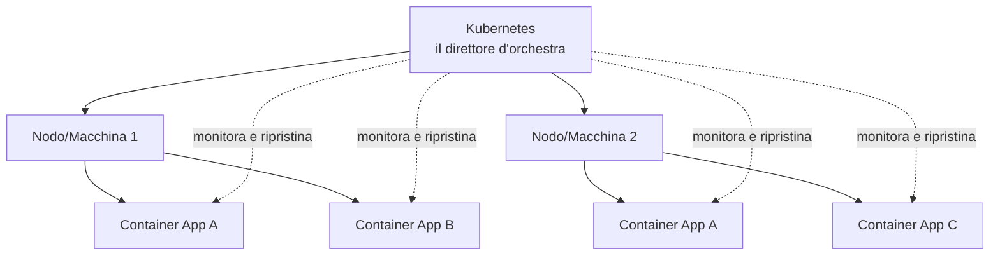

Non dovrai mai configurare Kubernetes con le tue mani come Project Manager,
ma sentirai questo nome citato molto spesso parlando dell'infrastruttura del
progetto e dei tempi di rilascio: sapere cosa fa a grandi linee ti aiuterà a
capire meglio le conversazioni tecniche del team e a stimare meglio la
complessità di certe attività.

Kubernetes, però, non serve sempre. Un'applicazione singola con traffico
modesto, gestita da un container o due su un solo server, spesso non ha
bisogno di un direttore d'orchestra: adottarlo solo "perché è quello che
usano tutti" ha un costo reale in complessità e competenze, che può superare
il beneficio ottenuto.

> **💡 Esempio pratico**
>
> Durante il Black Friday, con un picco di clienti su ShopFacile per una
> promozione con molto traffico, Kubernetes rileva l'aumento del carico e
> scala automaticamente da 3 a 10 container della stessa applicazione, per
> distribuire meglio le richieste. Passato il picco, riduce di nuovo il
> numero di container a 3, risparmiando risorse — tutto senza che nessuno
> del team debba intervenire manualmente nel cuore della notte.

### OpenShift: Kubernetes "con il cruscotto"

C'è però un problema che Kubernetes da solo non risolve: installarlo e
farlo funzionare bene non basta a renderlo utilizzabile in un'azienda. Serve
anche un posto dove salvare le immagini Docker (il registry visto in
§2.19), un sistema per autenticare chi può fare cosa, una gestione della
rete e degli indirizzi, delle pipeline che colleghino il codice al
deployment, uno strumento di monitoraggio che avvisi quando qualcosa non
va. Kubernetes "nudo" è un motore potente, ma senza cruscotto: ogni azienda
che lo adotta da zero finisce per scegliere, installare e mantenere decine
di componenti aggiuntivi, spesso diversi da quelli scelti dall'azienda
vicina — con il risultato che due aziende che dicono entrambe "usiamo
Kubernetes" possono avere due piattaforme profondamente diverse da gestire
e da cui assumere competenze.

Da questo problema nasce **OpenShift** (spesso abbreviato **OCP**,
OpenShift Container Platform), il prodotto di Red Hat che è oggi una delle
distribuzioni Kubernetes più diffuse nelle grandi aziende, incluso il
settore assicurativo. OpenShift **è** Kubernetes — non lo sostituisce, lo
racchiude — ma arriva già con registry, autenticazione, rete, pipeline e
monitoraggio integrati, con supporto commerciale (un fornitore da chiamare
quando qualcosa si rompe) e con vincoli di sicurezza più severi per
impostazione predefinita.

Questo ultimo punto è quello che arriva più spesso sotto forma di ticket:
per impostazione predefinita, OpenShift **non permette** ai container di
girare con privilegi da amministratore (root), a differenza di molte
installazioni "nude" di Kubernetes più permissive. Un'immagine Docker
costruita e testata altrove, che assumeva implicitamente di poter girare
come root, può quindi rifiutarsi di partire su OpenShift finché non viene
corretta — non è un capriccio della piattaforma, è una scelta di sicurezza
esplicita, ma è anche esattamente il tipo di attrito che arriva come
segnalazione confusa ("il deployment non parte, dicono che è un problema di
permessi") sul tavolo di un PM.

| | Kubernetes "nudo" | OpenShift (OCP) |
|---|---|---|
| Chi lo mantiene | Comunità open source | Red Hat (prodotto commerciale) |
| Componenti aggiuntivi (registry, rete, pipeline, monitoring...) | Da scegliere e integrare a parte | Già inclusi e integrati |
| Costo | Nessuna licenza (ma costo di integrazione interno) | Licenza a pagamento |
| Supporto | Community, nessun contratto | Supporto commerciale con SLA |
| Sicurezza predefinita | Configurabile, spesso più permissiva | Più restrittiva di default (es. niente root nei container) |
| Curva di adozione | Più lenta all'inizio (tutto da assemblare) | Più rapida all'inizio, con vincoli da imparare a rispettare |

> 💡 **Trade-off**: scegliere OpenShift significa pagare una licenza e
> accettare un certo grado di vincolo verso un unico fornitore (lock-in), in
> cambio di tempo di setup risparmiato, sicurezza predefinita più solida e —
> concretamente — un numero di telefono da chiamare alle tre di notte
> quando qualcosa smette di funzionare in produzione. Nessuna delle due
> strade è "quella giusta" in assoluto: dipende da quante competenze interne
> l'azienda vuole (e può permettersi di) mantenere. In ogni caso, le
> competenze Kubernetes non si buttano: sotto OpenShift resta Kubernetes, e
> chi lo sa usare non deve ripartire da zero.

Questo è il primo passo di un'idea più grande, che vedremo nella sezione
12: costruire una piattaforma interna che renda semplice la strada giusta.

---

## 2.21 Markdown e HTML: i due linguaggi per scrivere documenti e pagine

Fin qui abbiamo parlato di come i dati viaggiano (API, JSON) e di come
vengono salvati (SQL). C'è però un altro tipo di contenuto con cui avrai a
che fare quotidianamente come PM, anche solo leggendolo: i **documenti** —
questo stesso corso, un README di progetto, una pagina web. Anche questi
hanno un "linguaggio" con cui vengono scritti, e vale la pena riconoscerlo.

### Markdown: perché la documentazione di progetto raramente sta in un file Word

Immagina la documentazione di un progetto scritta in Word: vive come
allegato in una lunga catena di e-mail, ognuno ha in locale la versione che
gli è arrivata per ultima, nessuno sa con certezza qual è quella corretta e
aggiornata, e per capire cosa è cambiato tra due revisioni bisogna aprire
entrambi i file e confrontarli a occhio, riga per riga. Soprattutto, quel
documento non sta **accanto al codice** di cui parla: vive altrove, in un
altro sistema, con un altro ciclo di vita.

Da questo problema nasce **Markdown**: un modo di scrivere testo formattato
usando pochi simboli semplici, direttamente in un file di testo puro. Un
file Markdown si può salvare in Git esattamente come un file di codice
(lo vedrai nella sezione 4): ha una cronologia di modifiche, si possono
vedere le differenze esatte tra due versioni, e vive nella stessa cartella
del codice a cui si riferisce.

> 💡 **Il corso che stai leggendo in questo momento è scritto in Markdown.**
> Ogni titolo, ogni tabella, ogni blocco di testo che hai letto finora è
> testo semplice con una sintassi minima, non un documento Word o PDF fatto
> a mano.

| Sintassi | Risultato | Esempio |
|---|---|---|
| `# Titolo` | Titolo di primo livello | `# Introduzione` |
| `## Sottotitolo` | Titolo di livello inferiore | `## 2.21 Markdown` |
| `**testo**` | **grassetto** | `**importante**` |
| `*testo*` | *corsivo* | `*nota*` |
| `- voce` | Elenco puntato | `- primo punto` |
| `[testo](url)` | Link | `[vai al sito](https://...)` |
| `` `codice` `` | Testo in stile codice | `` `SELECT * FROM` `` |
| `\| a \| b \|` | Tabella | come quella che stai leggendo |

Come PM incontrerai Markdown molto più spesso di quanto pensi, senza mai
dover scrivere codice: i README dei progetti su GitHub, le pagine wiki
interne, la descrizione di una issue in Jira o GitHub (che spesso accetta
proprio questa sintassi), il testo di una pull request, un ADR (Architecture
Decision Record). Saperlo *leggere* — capire che `**questo**` era pensato per
apparire in grassetto, che una riga che inizia con `#` è un titolo — ti
basta per non sentirti perso di fronte a un file `.md` grezzo, ad esempio
aperto per errore fuori dal suo visualizzatore.

### HTML: il linguaggio che dice al browser cosa mostrare

Quando il tuo browser mostra la pagina di ShopFacile, sta interpretando un
altro linguaggio, pensato non per essere letto come testo semplice ma per
essere **visualizzato**: l'**HTML** (HyperText Markup Language). L'HTML
descrive la **struttura** di una pagina attraverso dei **tag** annidati uno
dentro l'altro — non troppo diverso dai tag XML visti in §2.14, e non è un
caso: HTML e XML condividono la stessa idea di fondo di racchiudere
contenuto tra marcatori con un nome.

```html
<html>
  <body>
    <h1>Benvenuto su ShopFacile</h1>
    <p>Il tuo carrello contiene <strong>2 articoli</strong>.</p>
  </body>
</html>
```

Si legge così: c'è un titolo di primo livello (`<h1>`) con il testo
"Benvenuto su ShopFacile", seguito da un paragrafo (`<p>`) che contiene a
sua volta del testo in grassetto (`<strong>`) per evidenziare "2 articoli".
Ogni tag apre con `<nome>` e chiude con `</nome>`, e i tag possono contenerne
altri, in una struttura ad albero — la stessa logica delle cartelle annidate
vista in §2.7, applicata al contenuto di una pagina invece che ai file su
disco.

L'HTML, da solo, descrive **solo la struttura**: cosa c'è e in che ordine.
Non dice nulla su colori, font o posizionamento (se ne occupa il **CSS**,
Cascading Style Sheets) né su cosa succede quando l'utente clicca un
bottone (se ne occupa il **JavaScript**). Questa separazione — struttura
(HTML), aspetto (CSS), comportamento (JavaScript) — è la ragione per cui,
quando un tecnico ti dice "è solo un problema di CSS", sta dicendo qualcosa
di preciso: il contenuto e il comportamento della pagina sono corretti, cambia
solo qualcosa nell'aspetto visivo (un colore sbagliato, un elemento
allineato male). Non è però sempre un problema piccolo: un CSS che nasconde
per errore un bottone di conferma pagamento è "solo CSS" nella causa
tecnica, ma ha un impatto di business enorme — vale la pena non liquidare
mai un ticket solo perché la causa dichiarata è "solo CSS".

### Il ponte tra i due: entrambi sono linguaggi di marcatura

Markdown e HTML non sono in competizione: sono due linguaggi di
**marcatura** (proprio come XML, §2.14) pensati per scopi diversi.
Markdown è più semplice e leggibile anche "grezzo", pensato per essere
scritto rapidamente da una persona; HTML è più potente e dettagliato, pensato
per essere interpretato da un browser. Non è un caso che siano collegati
direttamente: quando un file Markdown viene mostrato in un browser (ad
esempio proprio le pagine di questo corso), viene prima **tradotto** in
HTML, perché è l'unico dei due linguaggi che il browser sa davvero
interpretare e disegnare a schermo.

> 💡 **Trade-off**: Markdown è deliberatamente povero di proprietà. Non
> permette impaginazioni fini (margini precisi, numeri di pagina,
> intestazioni ripetute), non ha un vero sistema di commenti "in revisione"
> come quello di Word, e non è pensato per documenti destinati alla stampa
> formale (un contratto, una relazione ufficiale per un cliente esterno).
> Per quei casi, Word resta spesso la scelta giusta: la scelta tra i due non
> è "Markdown ha vinto", è "quale documento sto scrivendo e chi lo deve
> leggere". La documentazione tecnica che vive vicino al codice, sì,
> Markdown quasi sempre; un documento contrattuale per un cliente, quasi
> mai.

Non ti verrà mai chiesto di scrivere HTML o CSS in questo ruolo: l'obiettivo
di questa sottosezione è che tu sappia **riconoscerli** quando li vedi
citati in una conversazione tecnica, non produrli.

---

## 2.22 Riepilogo: come si incastrano tutti questi pezzi

Facciamo un ultimo passaggio per vedere come i concetti di questa sezione si
incastrano in uno scenario reale — ad esempio, quando un utente usa un sito
web che il tuo team ha costruito:

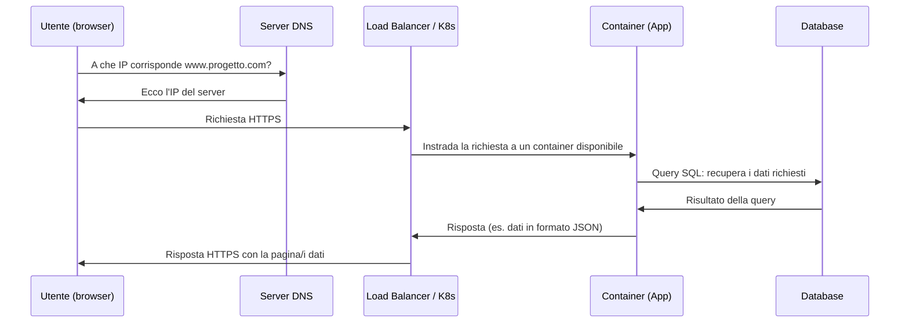

In questo singolo scenario compaiono quasi tutti i concetti visti in questa
sezione: DNS, HTTPS, container orchestrati (Kubernetes), database e SQL,
formato dati JSON scambiato via API. Non è un caso: questi sono davvero i
"mattoncini" fondamentali di praticamente ogni sistema software moderno, e li
ritroverai continuamente nel resto del corso.

---

## ✅ Checklist di autoverifica

Prima di passare alla sezione successiva, prova a rispondere (anche solo a
voce, o scrivendo due righe) a queste domande. Se qualcuna ti mette in
difficoltà, torna a rileggere il paragrafo corrispondente:

- Sapresti spiegare a un amico la differenza tra hardware e software?
- Sai spiegare la differenza tra RAM e disco con un'analogia tua?
- Sai dire a cosa serve un sistema operativo?
- Sai spiegare la differenza tra processo e thread?
- Sai spiegare, con parole tue, cosa fa il DNS?
- Sai spiegare perché HTTPS è più sicuro di HTTP?
- Sai spiegare cos'è un'API con l'analogia del ristorante?
- Sapresti leggere un piccolo blocco di dati in formato JSON?
- Sai spiegare la differenza tra database relazionale e NoSQL?
- Sai spiegare la differenza tra una VM e un container?
- Sai spiegare a cosa serve Kubernetes, a grandi linee?
- Sai spiegare cos'è il CRUD e cosa significa quando un tecnico dice "è solo
  un CRUD"?
- Sai spiegare, con parole tue, a cosa serve una specifica OpenAPI/Swagger
  tra due team che devono integrarsi?
- Sai spiegare la differenza tra chiave primaria e chiave esterna, e a cosa
  serve una JOIN?
- Sai spiegare la differenza tra OpenShift e Kubernetes "nudo"?
- Sai spiegare la differenza tra Markdown e HTML, e perché questo corso è
  scritto in Markdown?

---

## 📝 Esercizi pratici

Gli esercizi che seguono ti aiutano a trasformare il vocabolario di questa
sezione in comprensione reale. Non serve saper scrivere codice per farli:
servono soprattutto occhi curiosi e la disponibilità a fare qualche domanda
ai colleghi.

1. **Guarda "sotto il cofano" del tuo computer.** Apri il Task Manager
   (Windows) o il Monitoraggio Attività (macOS) e osserva per un paio di
   minuti quanta CPU e quanta RAM stanno usando le applicazioni aperte.
   Prova ad aprire molte schede del browser insieme e osserva come cambiano
   i numeri.
   ✅ **Come verificare**: sai indicare quale processo, in quel momento,
   sta consumando più CPU e quale più RAM, e sai spiegare la differenza tra
   le due cose usando le analogie di questa sezione (scrivania vs persona
   che calcola)?

2. **Traccia il percorso di una richiesta web.** Apri gli strumenti di
   sviluppo del browser (F12 o tasto destro → "Ispeziona"), vai sulla scheda
   "Network"/"Rete", visita un sito qualsiasi e osserva la prima richiesta
   HTTP che parte: nota il metodo (`GET`), il codice di risposta (es. `200`)
   e se il protocollo usato è HTTP o HTTPS.
   ✅ **Come verificare**: sai indicare, guardando la schermata, se la
   connessione era protetta (HTTPS) e sai spiegare cosa significa il codice
   di risposta che hai visto?

3. **Interroga un DNS a mano.** Da riga di comando (terminale su Mac/Linux,
   Prompt dei comandi o PowerShell su Windows), esegui il comando
   `nslookup www.google.com` (o `ping www.google.com`) e osserva l'indirizzo
   IP che viene restituito.
   ✅ **Come verificare**: sai spiegare a parole tue cosa ha fatto il
   comando, collegandolo all'analogia della "rubrica telefonica" vista
   in questa sezione?

4. **Leggi e "traduci" un JSON reale.** Chiedi a un developer del team di
   mostrarti un piccolo esempio di risposta JSON restituita da un'API del
   progetto (o, in alternativa, apri in un browser un endpoint pubblico
   come `https://api.github.com/users/github`). Prova a identificare le
   coppie chiave-valore principali.
   ✅ **Come verificare**: sapresti riscrivere a voce, in una frase in
   italiano, cosa dice quel JSON, come abbiamo fatto con l'esempio
   dell'ordine in questa sezione?

5. **Confronta VM e container con parole tue.** Senza guardare il testo,
   scrivi in 3-4 righe la differenza tra una macchina virtuale e un
   container, e almeno un motivo per cui un team potrebbe preferire il
   secondo per distribuire un'applicazione.
   ✅ **Come verificare**: fai leggere quello che hai scritto a un collega
   tecnico (o confrontalo con la tabella di questa sezione): la tua
   spiegazione coglie sia la differenza di "peso" che quella di isolamento?

6. **Disegna lo schema di una richiesta completa.** Su un foglio (anche a
   mano), disegna il percorso di una richiesta utente che visita una pagina
   della piattaforma: browser → DNS → server/container → database → e
   ritorno, etichettando ogni passaggio con il termine giusto (IP, HTTP/S,
   API, JSON, SQL...), ispirandoti al diagramma della sezione 2.22.
   ✅ **Come verificare**: riesci a spiegare il tuo disegno a un collega non
   tecnico in meno di 3 minuti, senza dover consultare gli appunti?

7. **Riconosci un CRUD.** Prendi una funzionalità qualsiasi già rilasciata
   sul tuo progetto (o chiedine una a un collega) e chiedi al team: "questa
   era solo un CRUD, o c'era logica di business dentro?". Ascolta la
   risposta e prova a capire, dal loro tono, se la stima era stata semplice
   o complicata da fare.
   ✅ **Come verificare**: sapresti spiegare a un collega non tecnico, con
   parole tue, la differenza tra "è solo un CRUD" e "non è un CRUD" in
   termini di stima e rischio?

8. **Trova una specifica OpenAPI/Swagger reale.** Chiedi a uno sviluppatore
   del team se esiste una documentazione Swagger per una delle API del
   progetto (spesso è raggiungibile da un browser, con un indirizzo che
   contiene `/swagger` o `/api-docs`) e fatti mostrare la pagina.
   ✅ **Come verificare**: sapresti indicare, guardando quella pagina, quali
   operazioni sono disponibili su una risorsa e distinguere GET, POST, PUT e
   DELETE tra loro?

9. **Leggi due tabelle collegate.** Chiedi a un collega tecnico di mostrarti
   (anche solo a voce, con carta e penna) due tabelle reali del progetto
   collegate da una chiave esterna, e chiedi cosa succede se provi a
   inserire una riga che punta a un id inesistente.
   ✅ **Come verificare**: sapresti spiegare cosa significa "integrità
   referenziale" con parole tue, partendo da quell'esempio?

10. **Apri il codice sorgente di una pagina.** Su un sito qualsiasi, apri gli
    strumenti di sviluppo del browser (F12 o tasto destro → "Ispeziona
    elemento") e guarda il codice HTML della pagina per un minuto, senza
    modificare nulla.
    ✅ **Come verificare**: sapresti indicare almeno un tag di apertura e la
    sua chiusura corrispondente, e distinguere a colpo d'occhio cosa è
    struttura (HTML) da cosa potrebbe essere solo aspetto (CSS)?

---

## 🔗 Collegamenti

- Prossima sezione: [3. Come nasce un software](../03-come-nasce-un-software/README.md)
- [4. Git e GitHub](../04-git-e-github/README.md) — vedrai come i concetti di file e cartelle si applicano al codice
- [9. DevOps](../09-devops/README.md) — dove Docker e Kubernetes tornano centrali
- [11. Architetture software](../11-architetture-software/README.md) — dove API e REST vengono approfonditi
- [12. Cloud](../12-cloud/README.md) — dove VM, container e OpenShift vengono usati concretamente, e dove ritroverai il tema della piattaforma interna
- [16. Glossario](../16-glossario/README.md) — per ripassare rapidamente ogni termine visto qui

## 📚 Risorse

- [MDN Web Docs – Come funziona internet](https://developer.mozilla.org/it/docs/Learn_web_development/Howto/Web_mechanics/How_does_the_Internet_work) — spiegazione approfondita di rete, DNS, HTTP
- [MDN Web Docs – Panoramica su HTTP](https://developer.mozilla.org/it/docs/Web/HTTP/Overview) — approfondimento sul protocollo HTTP/HTTPS
- [Microsoft Learn – Cos'è un container?](https://learn.microsoft.com/it-it/dotnet/architecture/microservices/container-docker-introduction/containers-vs-virtual-machines) — confronto ufficiale container vs VM
- [Documentazione ufficiale Docker – Introduzione](https://docs.docker.com/get-started/docker-overview/) — guida introduttiva ufficiale a Docker
- [Red Hat – Cos'è OpenShift?](https://www.redhat.com/it/technologies/cloud-computing/openshift) — panoramica ufficiale della piattaforma
- [Swagger – Cos'è OpenAPI?](https://swagger.io/docs/specification/about/) — introduzione ufficiale allo standard OpenAPI
- [Markdown Guide (in inglese)](https://www.markdownguide.org/) — riferimento rapido alla sintassi Markdown
- [Documentazione ufficiale Kubernetes – Concetti base](https://kubernetes.io/it/docs/concepts/overview/) — introduzione ufficiale a Kubernetes (disponibile anche in italiano)
