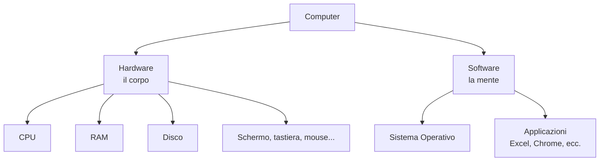
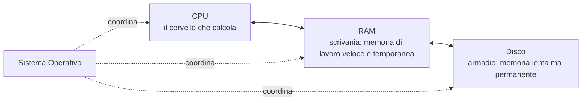
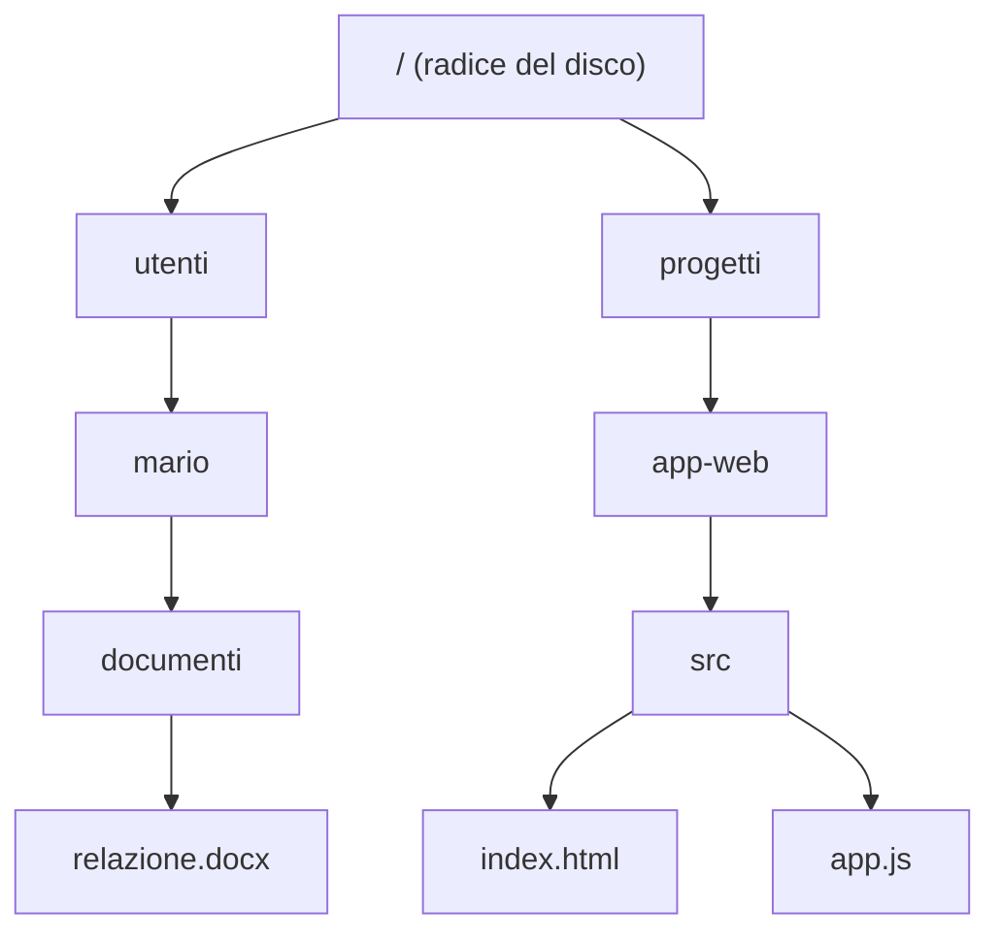
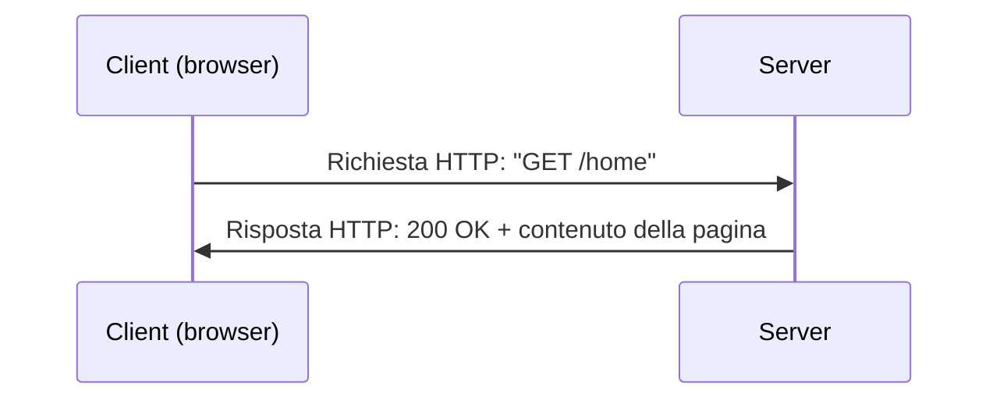
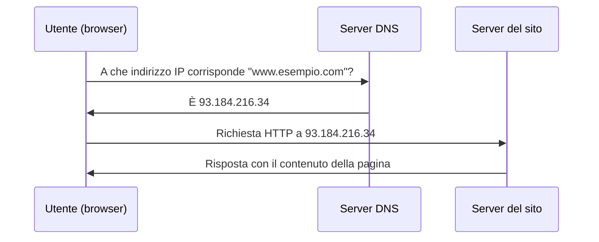
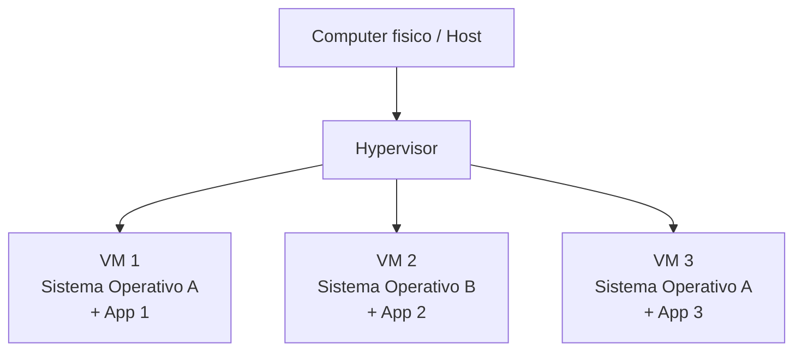
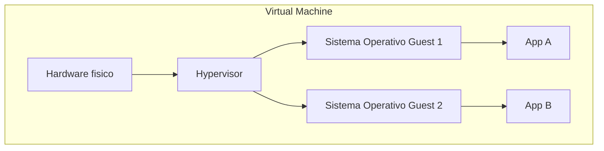
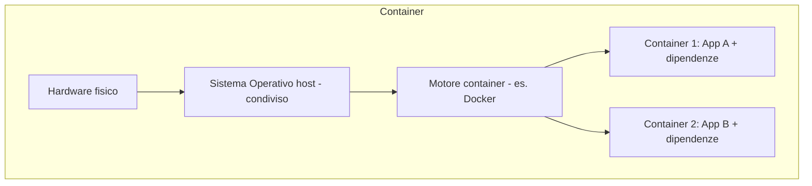
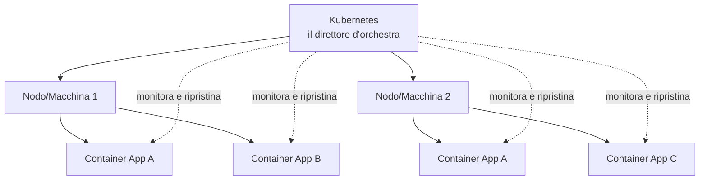
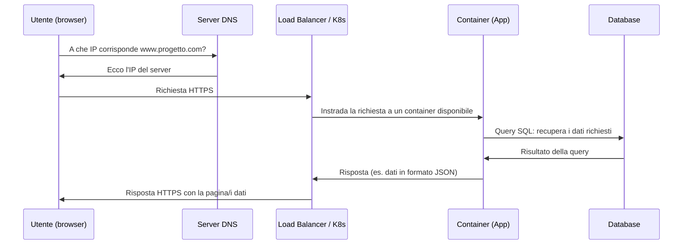

# 2. Fondamenti di informatica


> 📄 **[Scarica questa sezione in PDF](https://darioschioppi.github.io/corso-onboarding-devops/pdf/02-fondamenti-informatica.pdf)** — utile per la stampa o la lettura offline.


Questa è una delle sezioni più importanti di tutto il corso. Non preoccuparti
se non hai mai scritto una riga di codice o non sai cosa sia un server: qui
costruiamo insieme, da zero, tutto il vocabolario tecnico che ti servirà per
capire il resto del percorso (Git, Agile, DevOps, Cloud...).

Non serve leggere tutto in una sola sessione. Prendi questa sezione a piccoli
pezzi, prova a rileggere gli esempi con i tuoi tempi e, se un concetto non è
chiaro, chiedi al tuo mentor. È normale che alcuni termini richiedano più di
una lettura per "entrare" davvero.

## 🎯 Obiettivi della sezione

Al termine di questa sezione saprai:

- distinguere hardware e software, e conoscere i componenti principali di un
  computer (CPU, RAM, disco);
- spiegare cosa fa un sistema operativo e cosa sono processi e thread;
- capire come sono organizzati i file su un computer;
- spiegare in modo semplice come funziona una rete, internet, e i protocolli
  TCP/IP, HTTP/HTTPS, DNS;
- capire cos'è un'API, cosa significa REST, e leggere un semplice JSON;
- capire la differenza tra database relazionali e NoSQL;
- capire cosa sono Virtual Machine, Container, Docker e Kubernetes — i
  mattoncini su cui si basa gran parte del mondo DevOps che incontrerai nel
  team.

---

## 2.1 Cos'è un computer: hardware e software

Partiamo dalla domanda più semplice possibile: **cos'è un computer?**

Un computer è una macchina che esegue istruzioni. Punto. Tutto quello che fa
— mostrarti una pagina web, farti scrivere un documento, farti guardare un
video — è il risultato di miliardi di piccole istruzioni eseguite a
altissima velocità.

Per capire come funziona, dobbiamo separare due concetti fondamentali:

- **Hardware**: sono i componenti fisici, quelli che puoi toccare. Lo schermo,
  la tastiera, il "cervello" interno (CPU), la memoria, il disco.
- **Software**: sono le istruzioni, i programmi. Non li puoi toccare, ma
  "dicono" all'hardware cosa fare. Windows, Excel, Chrome, WhatsApp sono tutti
  software.

### Analogia: il corpo e la mente

Pensa al computer come a una persona:

- l'**hardware** è il **corpo**: braccia, gambe, occhi, cervello (come organo
  fisico). Serve per agire nel mondo fisico.
- il **software** è la **mente**: i pensieri, le conoscenze, le decisioni. È
  ciò che dice al corpo cosa fare e come farlo.

Un corpo senza una mente che lo guidi non farebbe nulla di utile: sta lì,
fermo. Una mente senza un corpo non potrebbe agire nel mondo. Hardware e
software funzionano allo stesso modo: uno senza l'altro non serve a niente.



Nelle prossime sezioni vediamo nel dettaglio i pezzi principali dell'hardware
(CPU, RAM, disco) e poi il software che li coordina (il sistema operativo).

> **💡 Esempio pratico**
>
> Il tuo laptop di lavoro è hardware (schermo, tastiera, CPU, RAM). Su di
> esso girano software come il sistema operativo, il browser e il client
> per collegarti in VPN al progetto. Allo stesso modo, un server che ospita
> l'applicazione del team è hardware (fisico o virtuale, in cloud) su cui
> girano software come il sistema operativo Linux, il motore container e
> l'applicazione stessa.

---

## 2.2 La CPU: il cervello che calcola

La **CPU** (Central Processing Unit, "unità centrale di elaborazione") è il
componente che esegue le istruzioni. È lei che fa i calcoli, prende le
decisioni logiche ("se questo è vero, fai questo, altrimenti fai quello") e
coordina il lavoro di tutti gli altri componenti.

### Analogia: la persona che fa i calcoli

Immagina un ufficio dove arrivano richieste continue: "calcola questo",
"confronta questi due numeri", "copia questo dato qui". La CPU è la persona
seduta alla scrivania che esegue materialmente queste operazioni, una dopo
l'altra, a una velocità incredibile: miliardi di operazioni al secondo.

Alcuni concetti utili da conoscere (non servono i dettagli tecnici, solo il
significato generale, perché li sentirai nominare):

- **Core (nucleo)**: una CPU moderna ha più "core", cioè più unità di calcolo
  indipendenti nello stesso chip. È come avere più persone alla scrivania
  invece di una sola: possono lavorare su cose diverse in parallelo.
- **Frequenza (GHz)**: quante operazioni al secondo può fare, in miliardi di
  cicli. Più alta è la frequenza, più velocemente lavora (semplificando molto).

Perché ti interessa? Perché quando in futuro sentirai parlare di "server con
8 core" o "la CPU è sotto stress", saprai che si parla della capacità di
calcolo della macchina.

> **💡 Esempio pratico**
>
> Durante un picco di traffico sulla piattaforma, il team nota su una
> dashboard di monitoring che la CPU di un server è al 95% di utilizzo per
> diversi minuti. Questo è un segnale che la macchina fa fatica a gestire
> tutte le richieste in arrivo, e il team decide di aggiungere un altro
> container (ne parleremo più avanti) per distribuire il carico su più
> "persone alla scrivania".

---

## 2.3 La RAM: la memoria di lavoro temporanea

La **RAM** (Random Access Memory) è la memoria che il computer usa mentre
sta lavorando. È velocissima, ma ha due caratteristiche importanti:

1. è **temporanea**: quando spegni il computer, tutto quello che c'era in RAM
   viene perso;
2. è **limitata**: ha uno spazio finito (es. 8 GB, 16 GB, 32 GB).

### Analogia: la scrivania

Pensa alla RAM come alla tua **scrivania** mentre lavori. Ci metti sopra i
fogli, i libri, gli oggetti che ti servono in questo momento, perché
prenderli dallo scaffale ogni volta sarebbe troppo lento. La scrivania è
comoda e veloce da usare, ma ha spazio limitato: se hai troppi documenti,
devi rimetterne alcuni nell'armadio per farne spazio ad altri. E quando vai
via alla fine della giornata (spegni il PC), la scrivania viene "sgomberata".

Quando apri un programma (es. il browser), il computer copia le istruzioni e
i dati necessari dal disco (l'armadio, vedi sotto) alla RAM (la scrivania),
perché lavorarci da lì è molto più rapido.

Se hai "troppe cose aperte" e il computer diventa lento, spesso è perché la
RAM è piena: non c'è più spazio sulla scrivania.

> **💡 Esempio pratico**
>
> Un'applicazione del progetto va in errore con un messaggio del tipo "out
> of memory" (memoria esaurita) perché il container in cui gira ha un
> limite di RAM troppo basso per il carico di lavoro reale. Il team
> operativo interviene aumentando il limite di memoria assegnato al
> container nella configurazione, e il problema si risolve.

---

## 2.4 Il disco: la memoria permanente

Il **disco** (hard disk o, oggi più spesso, SSD - Solid State Drive) è la
memoria dove i dati restano salvati **anche quando spegni il computer**. È
più lento della RAM, ma ha molto più spazio ed è permanente.

### Analogia: l'armadio

Il disco è come l'**armadio** di casa tua: ci conservi tutto quello che ti
serve nel lungo periodo (documenti, vestiti, ricordi). Non è comodo come la
scrivania per lavorare (aprire l'armadio, cercare la cosa giusta, richiuderlo
richiede più tempo), ma è lì che le cose restano anche quando esci di casa o
vai a dormire.

| | RAM (scrivania) | Disco (armadio) |
|---|---|---|
| Velocità | Molto veloce | Più lenta (SSD comunque abbastanza rapido) |
| Persistenza | Si perde tutto allo spegnimento | Resta salvato |
| Spazio tipico | Pochi GB (es. 16 GB) | Centinaia di GB / TB |
| Uso | Lavoro "in corso" | Archiviazione permanente |

Questa distinzione RAM/disco tornerà utile più avanti nel corso, ad esempio
quando parleremo di database (dati salvati su disco) o di cache (dati tenuti
in RAM per velocità).

> **💡 Esempio pratico**
>
> Il team riceve un alert automatico perché il disco del server che ospita
> il database è occupato all'85%. Se non si interviene (ad esempio
> archiviando o cancellando log vecchi, oppure aumentando lo spazio
> disponibile), il database rischia di non poter più scrivere nuovi dati
> quando il disco si riempie completamente.

### CPU, RAM e Disco insieme



La CPU lavora sui dati che trova in RAM (velocissima ma volatile); la RAM, a
sua volta, recupera dal disco (lento ma permanente) ciò che serve quando
serve. Il Sistema Operativo, che vediamo ora, è il "direttore" che organizza
tutto questo traffico.

---

## 2.5 Il Sistema Operativo: chi coordina tutto

Il **Sistema Operativo** (Operating System, OS) è il software che gestisce
tutte le risorse hardware del computer (CPU, RAM, disco, schermo...) e
permette agli altri programmi (Excel, Chrome, ecc.) di funzionare senza dover
"parlare" direttamente con l'hardware.

I sistemi operativi più diffusi sono:

- **Windows** (Microsoft) — il più usato sui PC aziendali e privati;
- **macOS** (Apple) — sui computer Apple;
- **Linux** — molto usato sui **server** (i computer che erogano servizi via
  internet) e nel mondo DevOps che vedrai più avanti nel corso.

### Analogia: il direttore d'albergo

Immagina un albergo con tanti ospiti (i programmi) che hanno bisogno di
risorse condivise: le camere (memoria), il personale (CPU), la cucina
(disco). Il direttore dell'albergo (il sistema operativo) decide chi occupa
cosa, per quanto tempo, evita che due ospiti litighino per la stessa risorsa,
e fa in modo che tutto funzioni in armonia, senza che gli ospiti debbano
parlarsi direttamente tra loro per organizzarsi.

Il sistema operativo si occupa, tra le altre cose, di:

- decidere quale programma può usare la CPU in un dato istante;
- gestire quale programma può usare quanta RAM;
- organizzare i file sul disco (vedi il "File System" più sotto);
- gestire la comunicazione con periferiche (stampanti, rete, mouse...);
- fornire un'interfaccia con cui l'utente interagisce (le finestre, le icone,
  o — su Linux — anche solo una riga di comando testuale, il "terminale").

Nel mondo di cui ti occuperai come Project Manager su una piattaforma
DevOps, sentirai parlare spesso di server **Linux**, perché è il sistema
operativo più usato per far funzionare applicazioni web e infrastrutture.

> **💡 Esempio pratico**
>
> Il team pianifica una finestra di manutenzione notturna per applicare un
> aggiornamento di sicurezza al sistema operativo Linux dei server di
> produzione, perché l'aggiornamento richiede il riavvio delle macchine: si
> sceglie un orario a basso traffico per minimizzare l'impatto sugli
> utenti.

---

## 2.6 Processi e Thread

Quando apri un programma (ad esempio il browser), il sistema operativo crea
un **processo**: un'istanza del programma in esecuzione, con la sua porzione
di memoria RAM dedicata, isolata dagli altri programmi.

Un processo può, a sua volta, dividersi in più **thread**: filoni di
esecuzione più piccoli che lavorano sullo stesso processo, condividendone la
memoria, ma potendo procedere in parti diverse del lavoro (anche in
parallelo, se la CPU ha più core).

### Analogia: un'azienda (processo) e i suoi dipendenti (thread)

Pensa a un **processo** come a un **reparto aziendale**: ha un proprio
budget, un proprio spazio (l'ufficio), delle proprie risorse, separate da
quelle degli altri reparti. Se un reparto va in crisi, in genere non manda in
crisi automaticamente gli altri reparti (isolamento).

I **thread** sono i **dipendenti di quel reparto**: lavorano nello stesso
spazio, condividono le stesse risorse (scrivanie, documenti, strumenti), e
possono lavorare contemporaneamente su compiti diversi dello stesso progetto
per essere più veloci. Se un dipendente combina un disastro con un documento
condiviso, però, può creare problemi anche ai colleghi dello stesso reparto,
perché condividono lo stesso spazio.

Esempio concreto: quando apri il browser (processo) e navighi su più schede,
ogni scheda può essere gestita con thread (o addirittura processi) diversi,
in modo che se una pagina web "va in crash" non blocchi necessariamente tutte
le altre schede aperte.

| Concetto | Cos'è | Analogia |
|---|---|---|
| Processo | Programma in esecuzione, con memoria propria isolata | Un reparto aziendale con il proprio ufficio |
| Thread | Filone di lavoro dentro un processo, condivide memoria con gli altri thread dello stesso processo | I dipendenti dello stesso reparto |

Questo concetto tornerà utile quando, più avanti, parlerai di applicazioni
che devono gestire **tante richieste contemporaneamente** (es. un sito web
con migliaia di visitatori): il modo in cui un software gestisce processi e
thread incide molto sulle sue performance.

---

## 2.7 Il File System: come sono organizzati i file

Il **file system** è il modo in cui il sistema operativo organizza e
memorizza i file sul disco. Praticamente ogni informazione che il computer
salva in modo permanente (documenti, foto, programmi, configurazioni) è un
**file**, e i file sono organizzati in **cartelle** (chiamate anche
"directory"), che possono contenere altre cartelle, in una struttura ad
albero.

### Analogia: l'archivio con cartelline

Pensa a un grande archivio fisico con tanti raccoglitori (cartelle), che
possono contenere altri raccoglitori più piccoli, che a loro volta
contengono i documenti (file). Per trovare un documento specifico, segui un
percorso: "vai nell'armadio Contabilità, poi nel raccoglitore 2024, poi nella
cartellina Gennaio, prendi il foglio Fattura_012".

In informatica, questo percorso si chiama **path** (percorso), e si scrive
così:

```
/contabilità/2024/gennaio/fattura_012.pdf
```

oppure, su Windows:

```
C:\Contabilità\2024\Gennaio\fattura_012.pdf
```

Ogni file ha tipicamente un **nome** e un'**estensione** che indica il suo
tipo: `.pdf`, `.docx`, `.jpg`, `.txt`, `.py` (codice Python), `.json` (vedi
più avanti), ecc.



Capire i path ti servirà moltissimo più avanti, ad esempio quando vedremo
**Git** (sezione 4): i progetti software sono organizzati esattamente come
cartelle e file su un file system.

> **💡 Esempio pratico**
>
> Un developer ti scrive in chat: "il file di configurazione è in
> `/app/config/produzione.json`". Grazie a quello che hai appena imparato,
> sai leggere quel percorso: parti dalla radice (`/`), entri nella cartella
> `app`, poi in `config`, e lì trovi il file `produzione.json`. Non serve
> saperlo modificare, ma saperlo "leggere" ti permette di seguire la
> conversazione senza sentirti perso.

---

## 2.8 La rete: cos'è una rete di computer

Finora abbiamo parlato di un singolo computer. Ma il valore vero della
tecnologia moderna nasce quando i computer **si parlano tra loro**: questo è
possibile grazie alle **reti**.

Una **rete di computer** è semplicemente un insieme di dispositivi collegati
tra loro, capaci di scambiarsi informazioni. Può essere piccola (la rete
Wi-Fi di casa tua, con il tuo PC, telefono, smart TV) o enorme: **internet**
è la rete di reti più grande del mondo, che collega miliardi di dispositivi.

### Analogia: il sistema postale

Pensa a una rete come al **sistema postale**: ogni casa ha un indirizzo
univoco, le lettere vengono instradate attraverso uffici postali intermedi
fino a raggiungere il destinatario giusto, indipendentemente da dove si
trovi. Anche i computer hanno un "indirizzo" (si chiama **indirizzo IP**) e
le informazioni viaggiano in "pacchetti" (come lettere) attraverso una serie
di dispositivi intermedi (router) finché non arrivano a destinazione.

> **💡 Esempio pratico**
>
> Gli utenti segnalano che l'applicazione del progetto "non si carica più".
> Il team di infrastruttura scopre che il problema non è nell'applicazione
> stessa, ma in un guasto di rete tra due data center che impedisce ai
> server di raggiungersi: un classico problema "di rete", da distinguere da
> un bug nel codice.

---

## 2.9 TCP/IP: come i computer si "spediscono lettere"

**TCP/IP** è l'insieme di regole (un "protocollo", cioè un linguaggio comune
condiviso) che permette a due computer di scambiarsi dati su una rete,
compreso internet. È, in un certo senso, l'alfabeto di base su cui si basa
tutta la comunicazione online.

Semplificando molto:

- **IP** (Internet Protocol) si occupa dell'**indirizzamento**: assegna a
  ogni dispositivo un indirizzo univoco (l'**indirizzo IP**, es.
  `192.168.1.10`) e si occupa di far viaggiare i dati verso l'indirizzo
  giusto, passando per i router intermedi — proprio come il sistema postale
  smista le lettere in base all'indirizzo.
- **TCP** (Transmission Control Protocol) si occupa di **spezzare i dati in
  pacchetti**, spedirli, e assicurarsi che arrivino tutti, nell'ordine
  giusto, e — se qualcosa si perde per strada — di rispedirlo. È come
  spedire un libro intero per posta spezzandolo in tante lettere numerate: il
  destinatario le riceve, le rimette in ordine con i numeri, e se manca la
  lettera 5 chiede di rispedirla.

### Analogia riassuntiva

Immagina di dover spedire un grosso pacco a un amico in un'altra città:

1. lo dividi in scatole più piccole numerate (TCP: divisione in pacchetti e
   controllo dell'ordine/integrità);
2. scrivi l'indirizzo del destinatario su ogni scatola (IP: indirizzamento);
3. le scatole passano per vari centri di smistamento (i router) prima di
   arrivare a destinazione;
4. il destinatario le riceve, controlla che siano tutte arrivate e le
   ricompone nell'ordine giusto.

Non hai bisogno di sapere i dettagli tecnici di TCP/IP per il tuo lavoro da
PM, ma è utile sapere che **è il livello base** su cui si costruiscono
protocolli più "di alto livello" che userai spesso a parole, come HTTP.

> **💡 Esempio pratico**
>
> In un ticket di supporto si legge: "il server non risponde sulla porta
> 443". Il collega di infrastruttura controlla che quella porta TCP (usata
> per HTTPS) sia effettivamente aperta sul firewall del server: se è
> chiusa o bloccata, nessuna richiesta può arrivare a destinazione, anche
> se il server è acceso e funzionante.

---

## 2.10 HTTP e HTTPS: il protocollo del web

**HTTP** (HyperText Transfer Protocol) è il protocollo usato per
trasferire pagine web e dati tra un **client** (es. il tuo browser) e un
**server** (il computer che "ospita" il sito). È costruito sopra TCP/IP: se
TCP/IP è "come spedire un pacco", HTTP è "il modulo che compili per chiedere
qualcosa e come è strutturata la risposta".

Il funzionamento di base è semplice: **richiesta e risposta**.

1. Il client manda una **richiesta** ("dammi la pagina della home");
2. il server elabora la richiesta e manda una **risposta** (il contenuto
   della pagina, oppure un errore come il famoso "404 - pagina non trovata").



### La "S" di sicurezza: HTTPS

**HTTPS** è la versione **sicura** di HTTP: la "S" sta per "Secure". La
differenza è che i dati scambiati vengono **cifrati** (criptati), cioè
trasformati in un codice illeggibile per chiunque li intercetti lungo il
tragitto, e solo il client e il server legittimi possono "decifrarli" e
leggerli.

### Analogia: cartolina vs busta sigillata

- **HTTP** è come spedire una **cartolina postale**: chiunque la maneggi
  lungo il percorso (postini, magazzinieri) può leggerne il contenuto.
- **HTTPS** è come spedire una **lettera in una busta sigillata e cifrata**,
  che solo il destinatario ha la "chiave" per aprire e leggere.

Per questo, oggi, praticamente tutti i siti seri usano HTTPS: quando navighi
e vedi il lucchetto 🔒 nella barra degli indirizzi del browser, significa che
la connessione è protetta con HTTPS.

> **💡 Esempio pratico**
>
> Durante un test di sicurezza sulla piattaforma, viene segnalato che una
> vecchia pagina interna è ancora raggiungibile in HTTP (senza cifratura).
> Il team la corregge configurando un redirect automatico verso la versione
> HTTPS, così chi provasse ad accedere alla versione non sicura viene
> reindirizzato automaticamente a quella protetta.

---

## 2.11 DNS: la rubrica telefonica di internet

Abbiamo detto che ogni computer/server su internet ha un **indirizzo IP**
(es. `142.250.180.4`). Ma tu, per visitare un sito, scrivi un nome facile da
ricordare come `www.google.com`, non una sequenza di numeri. Chi fa la
traduzione da nome a indirizzo IP?

Il **DNS** (Domain Name System)!

### Analogia: la rubrica telefonica

Il DNS funziona come una **rubrica telefonica**: tu vuoi chiamare "Mario",
non ricordi il suo numero di telefono a memoria, quindi consulti la rubrica,
trovi il nome "Mario" e la rubrica ti restituisce il numero corretto da
chiamare. Il DNS fa esattamente questo per internet: tu chiedi
`www.google.com`, il DNS ti risponde con l'indirizzo IP del server giusto, e
solo dopo il tuo browser può effettivamente contattarlo.



Senza il DNS dovremmo ricordare a memoria stringhe di numeri per ogni sito
che vogliamo visitare: praticamente impossibile.

> **💡 Esempio pratico**
>
> Dopo aver spostato l'applicazione su un nuovo server, il team aggiorna il
> record DNS del progetto perché punti al nuovo indirizzo IP. Per alcune
> ore, però, alcuni utenti continuano a raggiungere il vecchio server: è un
> fenomeno normale, chiamato "propagazione DNS", perché la modifica impiega
> un po' di tempo a diffondersi su tutti i server DNS del mondo.

---

## 2.12 API: come i software si parlano tra loro

**API** sta per **Application Programming Interface** ("interfaccia di
programmazione delle applicazioni"). È il modo in cui un software espone
delle "funzionalità" che altri software possono usare, senza dover conoscere
i dettagli interni di come funziona.

### Analogia: il cameriere al ristorante

Pensa a un ristorante: tu (il **cliente/client**) non entri in cucina a
prepararti da mangiare da solo. Ordini un piatto al **cameriere**, che porta
la tua richiesta in **cucina** (il **server**), aspetta che il piatto sia
pronto, e te lo riporta al tavolo.

Il cameriere è l'**API**: è l'intermediario con **regole precise** (il menù:
puoi ordinare solo quello che è scritto lì, in un formato preciso) che
permette a te (client) di ottenere qualcosa dalla cucina (server) senza
sapere come funzionano i fornelli o le pentole.

In termini informatici:

- un'app di meteo sul tuo telefono non "misura" la temperatura da sola: fa
  una **richiesta API** a un servizio esterno che gestisce i dati
  meteorologici, e riceve una **risposta** con i dati richiesti;
- un sito di e-commerce può usare le API di un servizio di pagamento per
  gestire il pagamento con carta, senza dover costruire da zero un intero
  sistema di pagamenti.

```mermaid
graph LR
    A[App Meteo<br/>client] -->|Richiesta API:<br/>"che tempo fa a Milano?"| B[Servizio Meteo<br/>server/API]
    B -->|Risposta:<br/>22°C, sereno| A
```

Le API sono uno dei concetti più importanti che incontrerai lavorando su una
piattaforma software: praticamente tutte le applicazioni moderne sono fatte
di tanti "pezzi" (servizi) che comunicano tra loro tramite API.

> **💡 Esempio pratico**
>
> Il team deve aggiungere l'invio di notifiche via SMS agli utenti della
> piattaforma. Invece di costruire da zero un intero sistema per inviare
> SMS (server, connessioni con gli operatori telefonici, ecc.), il team
> integra le API REST di un servizio esterno specializzato: basta inviare
> una richiesta con numero e testo del messaggio, e il servizio esterno si
> occupa di tutto il resto.

---

## 2.13 REST: uno stile comune per costruire API

**REST** (REpresentational State Transfer) non è una tecnologia specifica,
ma uno **stile**, un insieme di convenzioni condivise su come costruire le
API in modo semplice, standard e prevedibile, sfruttando proprio HTTP che
abbiamo visto sopra.

Le API costruite seguendo lo stile REST si chiamano **API REST** (o
"RESTful"), e sono lo standard più diffuso oggi per far comunicare
applicazioni web.

L'idea di base: si usano gli indirizzi web (URL) per identificare le
**risorse** (es. "un cliente", "un ordine"), e si usano dei **verbi HTTP**
standard per indicare l'azione da compiere su quella risorsa:

| Verbo HTTP | Significato | Analogia |
|---|---|---|
| `GET` | Leggi/recupera dati | "Fammi vedere l'ordine numero 42" |
| `POST` | Crea un nuovo elemento | "Crea un nuovo ordine" |
| `PUT` / `PATCH` | Modifica un elemento esistente | "Aggiorna l'indirizzo di spedizione dell'ordine 42" |
| `DELETE` | Elimina un elemento | "Cancella l'ordine 42" |

Esempio pratico: un'API REST per gestire ordini potrebbe avere un indirizzo
come:

```
GET https://api.esempio.com/ordini/42
```

per "recuperare i dettagli dell'ordine con id 42".

Non avrai bisogno di scrivere codice per costruire API REST, ma sentirai
questo termine costantemente parlando con gli sviluppatori del team, quindi è
importante che il concetto ti sia chiaro.

---

## 2.14 JSON e XML: i formati per scambiarsi dati

Quando due software si scambiano dati (ad esempio tramite un'API), devono
usare un **formato comune**, condiviso, che entrambi sappiano "leggere". I
due formati più diffusi sono **JSON** e **XML**.

### JSON

**JSON** (JavaScript Object Notation) è oggi il formato più usato per
scambiare dati tra applicazioni web, perché è semplice da leggere sia per un
umano che per un computer. Organizza i dati in coppie **chiave: valore**,
proprio come una piccola scheda informativa.

Esempio: i dati di un ordine in formato JSON potrebbero essere così:

```json
{
  "id_ordine": 42,
  "cliente": "Mario Rossi",
  "totale": 129.90,
  "spedito": false,
  "prodotti": [
    "Tastiera",
    "Mouse"
  ]
}
```

Si legge in modo abbastanza naturale: "l'ordine numero 42, del cliente Mario
Rossi, con un totale di 129,90, non ancora spedito, contiene una tastiera e
un mouse". Le parentesi graffe `{ }` delimitano un "oggetto" (una scheda di
dati), le parentesi quadre `[ ]` delimitano una lista di valori.

### XML

**XML** (eXtensible Markup Language) è un formato più "vecchio" ma ancora
molto usato in certi contesti aziendali (soprattutto in sistemi legacy o in
alcuni settori come banking e pubblica amministrazione). Usa dei **tag** che
racchiudono i dati, un po' come l'HTML delle pagine web:

```xml
<ordine>
  <id>42</id>
  <cliente>Mario Rossi</cliente>
  <totale>129.90</totale>
  <spedito>false</spedito>
</ordine>
```

### Quale scegliere?

Nella maggior parte dei progetti moderni con cui avrai a che fare, il formato
predefinito sarà **JSON**: è più compatto, più leggibile, e più facile da
usare nella programmazione moderna. XML lo incontrerai più raramente, magari
in integrazioni con sistemi più datati.

---

## 2.15 Database relazionali e SQL

Un **database** (base di dati) è un sistema organizzato per **salvare,
organizzare e recuperare grandi quantità di dati** in modo efficiente e
strutturato — molto più potente e affidabile di un semplice file Excel per
gestire dati che crescono in volume e complessità.

I **database relazionali** organizzano i dati in **tabelle**, esattamente
come un foglio Excel: righe e colonne.

### Analogia: il foglio Excel evoluto

Pensa a un database relazionale come a un insieme di fogli Excel collegati
tra loro:

- ogni **tabella** è un foglio (es. "Clienti", "Ordini", "Prodotti");
- ogni **riga** è un singolo elemento (es. un cliente specifico);
- ogni **colonna** è un attributo di quell'elemento (es. nome, cognome,
  email).

Le tabelle possono essere **collegate** tra loro: ad esempio, la tabella
"Ordini" può avere una colonna che indica "a quale cliente appartiene questo
ordine" — questa è la "relazione" da cui prende il nome "database
relazionale".

Esempio, tabella `Clienti`:

| id | nome | email |
|----|------|-------|
| 1  | Mario Rossi | mario.rossi@email.com |
| 2  | Anna Bianchi | anna.bianchi@email.com |

Esempio, tabella `Ordini`:

| id | id_cliente | totale |
|----|------------|--------|
| 101 | 1 | 129.90 |
| 102 | 2 | 59.00 |

### SQL: il linguaggio per "interrogare" il database

**SQL** (Structured Query Language) è il linguaggio standard usato per
"interrogare" (query) un database relazionale: chiedere dati, inserirne di
nuovi, modificarli o eliminarli.

Esempio semplicissimo: per chiedere "dammi il nome e l'email di tutti i
clienti", in SQL scriveresti:

```sql
SELECT nome, email FROM Clienti;
```

Per chiedere "dammi solo gli ordini con un totale superiore a 100 euro":

```sql
SELECT * FROM Ordini WHERE totale > 100;
```

Non ti verrà chiesto di scrivere SQL nel tuo ruolo di PM, ma capire questa
logica di base ti aiuterà a seguire discussioni tecniche sul team riguardo
"performance del database", "query lente", "migrazione dati", ecc.

Esempi di database relazionali diffusi: **Microsoft SQL Server**,
**PostgreSQL**, **MySQL**, **Oracle Database**.

---

## 2.16 Database NoSQL

I database **NoSQL** ("Not Only SQL") sono un'alternativa ai database
relazionali, pensati per casi in cui la rigida struttura a tabelle non è la
scelta migliore.

### Perché esistono

Immagina di dover salvare dati molto **variabili** nella struttura (ad
esempio: prodotti di un e-commerce, dove ogni categoria di prodotto ha
attributi diversi — un libro ha "autore" e "numero pagine", uno smartphone ha
"memoria" e "colore"). Costringere questi dati in tabelle rigide e uniformi
sarebbe scomodo. I database NoSQL permettono maggiore **flessibilità**.

### Analogia: cartelle e documenti vs archivio rigido

Se il database relazionale è come un archivio con moduli standard identici
per tutti (ogni modulo ha esattamente gli stessi campi da riempire), un
database NoSQL è più come una serie di **cartelline con documenti liberi**:
ogni documento può avere una struttura leggermente diversa, senza dover
rispettare uno schema fisso e identico per tutti.

Molti database NoSQL salvano i dati proprio in formato **JSON** (quello che
abbiamo visto sopra):

```json
{
  "prodotto": "Smartphone X",
  "colore": "nero",
  "memoria_gb": 128
}
```

```json
{
  "prodotto": "Libro Y",
  "autore": "M. Verdi",
  "pagine": 320
}
```

Due prodotti, campi diversi, nello stesso database: con un database
relazionale classico sarebbe più complicato da gestire in modo pulito.

### Quando si usano

- **Relazionali (SQL)**: dati molto strutturati, con relazioni chiare tra
  entità (es. sistemi gestionali, contabilità, ordini). Garantiscono forte
  coerenza dei dati.
- **NoSQL**: dati con struttura variabile o che cambia spesso, grandi volumi
  con necessità di scalare velocemente, casi come cataloghi prodotto, log,
  dati di sessione, messaggistica.

Esempi di database NoSQL diffusi: **MongoDB**, **Cosmos DB** (Azure),
**Redis**, **Cassandra**.

Non esiste "il migliore in assoluto": la scelta dipende dal tipo di dati e
dal problema da risolvere. Sentirai il team discutere di questa scelta nelle
fasi di progettazione di un nuovo servizio.

---

## 2.17 Virtual Machine: un computer dentro un computer

Una **Virtual Machine** (VM, macchina virtuale) è un software che **simula
un computer completo** dentro un altro computer fisico. Dal punto di vista di
chi la usa, si comporta esattamente come un computer vero e proprio: ha il
suo sistema operativo, le sue applicazioni, il suo spazio disco — ma "vive"
dentro un computer fisico più grande (l'**host**), condividendo con altre
eventuali VM le risorse hardware reali.

Il software che crea e gestisce le macchine virtuali si chiama
**hypervisor**.

### Analogia: un condominio con appartamenti indipendenti

Pensa a un edificio (il computer fisico, "host") diviso in **appartamenti**
indipendenti (le VM). Ogni appartamento ha la sua porta blindata, i suoi
mobili, la sua cucina — è completamente **isolato** dagli altri, anche se
condividono le stesse fondamenta, gli stessi impianti elettrici e idraulici
dell'edificio. Se un appartamento va a fuoco, in teoria gli altri restano al
sicuro (isolamento).

Perché sono utili? Perché su un solo computer fisico potente puoi far
"vivere" tante macchine virtuali diverse, ciascuna con il proprio sistema
operativo e le proprie applicazioni, risparmiando sui costi hardware e
semplificando la gestione (puoi creare, cancellare, spostare una VM molto più
facilmente di un computer fisico).



> **💡 Esempio pratico**
>
> Il team di infrastruttura deve testare un aggiornamento importante prima
> di applicarlo ai server di produzione. Crea una nuova VM di test partendo
> da un'immagine standard identica a quella di produzione, prova
> l'aggiornamento lì sopra senza alcun rischio per gli utenti reali, e solo
> dopo aver verificato che tutto funziona procede con l'aggiornamento vero
> e proprio.

---

## 2.18 Container: più leggeri di una VM

Un **container** è un altro modo per "isolare" un'applicazione e le sue
dipendenze, ma in modo molto più **leggero** rispetto a una VM: invece di
simulare un computer intero con il suo sistema operativo, un container
condivide il sistema operativo della macchina che lo ospita, isolando solo
l'applicazione e ciò che le serve per funzionare (librerie, configurazioni,
file necessari).

### Analogia: la valigia pronta all'uso

Se la VM è un intero appartamento indipendente, il **container** è più come
una **valigia già pronta con tutto il necessario**: vestiti, spazzolino,
caricabatterie — tutto quello che serve per il viaggio, organizzato e pronto.
Puoi portare questa valigia in qualsiasi "casa" (computer/server) e sarai
subito operativo, perché hai già con te tutto ciò che ti serve, senza dover
allestire un'intera casa da zero (come faresti con una VM).

Questo risolve un problema molto concreto e comune nello sviluppo software:
*"sul mio computer funzionava, perché sul server non funziona?"*. Il
container "porta con sé" esattamente le stesse versioni di librerie,
configurazioni e dipendenze usate in fase di sviluppo, garantendo che
l'applicazione si comporti allo stesso modo ovunque venga eseguita.

### VM vs Container: il confronto visivo





La differenza chiave: ogni VM porta con sé un **intero sistema operativo**
(pesante, lento da avviare), mentre i container **condividono** il sistema
operativo della macchina host e sono quindi molto più leggeri, veloci da
avviare (secondi, invece di minuti) e più efficienti in termini di risorse.

| | Virtual Machine | Container |
|---|---|---|
| Cosa isola | Un intero computer virtuale, con proprio OS | Solo l'applicazione e le sue dipendenze |
| Peso | Pesante (GB), OS completo | Leggero (MB), condivide l'OS host |
| Tempo di avvio | Minuti | Secondi |
| Isolamento | Molto forte (OS separato) | Buono, ma leggermente meno forte della VM |

> **💡 Esempio pratico**
>
> Un utente segnala un bug sull'applicazione in produzione. Lo sviluppatore,
> invece di provare a indovinare cosa non funzioni, lancia in locale sul
> proprio computer lo stesso identico container usato in produzione (stesse
> librerie, stessa versione del linguaggio, stessa configurazione) e
> riesce a riprodurre il problema in pochi minuti, con la certezza di
> lavorare in un ambiente identico a quello reale.

---

## 2.19 Docker: lo strumento più diffuso per i container

**Docker** è oggi lo strumento più popolare e diffuso per creare, distribuire
ed eseguire container. È diventato talmente centrale nel mondo dello sviluppo
software moderno che spesso "container" e "Docker" vengono usati quasi come
sinonimi (anche se Docker è solo uno degli strumenti possibili).

Concetti chiave da conoscere (senza bisogno di saperli usare tecnicamente):

- **Immagine (image)**: è il "modello" o la "ricetta" del container: contiene
  l'applicazione e tutto ciò che le serve per funzionare (un po' come la
  lista precisa del contenuto della valigia, prima ancora di farla). È come
  una fotografia di uno stato pronto all'uso.
- **Container**: è un'immagine "in esecuzione", cioè la valigia effettivamente
  in uso, attiva, con l'applicazione che sta girando.
- **Dockerfile**: è un file di testo con le istruzioni su come costruire
  un'immagine (es. "parti da questo sistema base, installa queste librerie,
  copia questi file, avvia questo comando").
- **Registry** (es. Docker Hub): è un "magazzino" online dove si salvano e si
  condividono le immagini Docker, pronte per essere scaricate e usate.

### Analogia riassuntiva

- il **Dockerfile** è la ricetta scritta;
- l'**immagine** è la valigia già fatta secondo quella ricetta, pronta ma non
  ancora "in viaggio";
- il **container** è la valigia che stai effettivamente usando durante il
  viaggio (in esecuzione).

Nel team con cui lavorerai, sentirai spesso frasi come "buildiamo
l'immagine", "il container è andato in crash", "pushiamo l'immagine sul
registry": ora sai cosa significano a grandi linee.

> **💡 Esempio pratico**
>
> Il team scrive un Dockerfile che parte da un'immagine base con il
> linguaggio di programmazione già installato, copia il codice
> dell'applicazione e installa le librerie necessarie. La pipeline di
> CI/CD (ne parleremo più avanti nel corso) usa questo Dockerfile per
> costruire automaticamente una nuova immagine ogni volta che il codice
> cambia, e la pubblica su un registry privato del progetto, pronta per
> essere distribuita.

---

## 2.20 Kubernetes: l'orchestratore di container

Quando un'applicazione è composta da tanti container (magari decine o
centinaia, distribuiti su tante macchine diverse per gestire tanti utenti
contemporaneamente), diventa molto complicato gestirli a mano: avviarli,
fermarli, sostituirli se si "rompono", distribuirli sulle macchine giuste,
farli comunicare tra loro...

**Kubernetes** (spesso abbreviato **K8s**) è lo strumento più diffuso per
**orchestrare** (coordinare automaticamente) grandi quantità di container.

### Analogia: il direttore d'orchestra

Pensa a un'orchestra con decine di musicisti (i container). Ogni musicista
suona il suo strumento (esegue la sua applicazione), ma senza un
**direttore** che coordini tempi, entrate e uscite di ciascuno, il risultato
sarebbe caos. Il **direttore d'orchestra** (Kubernetes) decide:

- quando far "entrare" un nuovo musicista se ne serve uno in più (es. più
  utenti stanno usando l'app: servono più container per gestire il traffico);
- cosa fare se un musicista si sente male e deve uscire (un container si
  blocca: Kubernetes lo rileva e ne avvia automaticamente uno nuovo al suo
  posto, senza intervento umano);
- come distribuire i musicisti sul palco (su quali macchine far girare quali
  container, in base alle risorse disponibili).

Kubernetes gestisce automaticamente compiti come:

- **Scalabilità**: aumentare o diminuire il numero di container attivi in
  base al traffico/carico di lavoro;
- **Self-healing** (auto-guarigione): se un container si blocca o si rompe,
  Kubernetes lo rileva e lo riavvia o lo sostituisce automaticamente;
- **Distribuzione del carico**: smistare le richieste in arrivo tra i vari
  container disponibili, in modo che nessuno sia sovraccaricato mentre altri
  sono inattivi;
- **Deployment controllato**: aggiornare l'applicazione a una nuova versione
  gradualmente, riducendo il rischio di interruzioni per gli utenti.



Non dovrai mai configurare Kubernetes con le tue mani come Project Manager,
ma sentirai questo nome citato molto spesso parlando dell'infrastruttura del
progetto e dei tempi di rilascio: sapere cosa fa a grandi linee ti aiuterà a
capire meglio le conversazioni tecniche del team e a stimare meglio la
complessità di certe attività.

> **💡 Esempio pratico**
>
> Durante un evento con un picco di utenti sulla piattaforma (ad esempio una
> promozione con molto traffico), Kubernetes rileva l'aumento del carico e
> scala automaticamente da 3 a 10 container della stessa applicazione, per
> distribuire meglio le richieste. Passato il picco, riduce di nuovo il
> numero di container a 3, risparmiando risorse — tutto senza che nessuno
> del team debba intervenire manualmente nel cuore della notte.

---

## 2.21 Riepilogo: come si incastrano tutti questi pezzi

Facciamo un ultimo passaggio per vedere come i concetti di questa sezione si
incastrano in uno scenario reale — ad esempio, quando un utente usa un sito
web che il tuo team ha costruito:



In questo singolo scenario compaiono quasi tutti i concetti visti in questa
sezione: DNS, HTTPS, container orchestrati (Kubernetes), database e SQL,
formato dati JSON scambiato via API. Non è un caso: questi sono davvero i
"mattoncini" fondamentali di praticamente ogni sistema software moderno, e li
ritroverai continuamente nel resto del corso.

---

## ✅ Checklist di autoverifica

Prima di passare alla sezione successiva, prova a rispondere (anche solo a
voce, o scrivendo due righe) a queste domande. Se qualcuna ti mette in
difficoltà, torna a rileggere il paragrafo corrispondente:

- Sapresti spiegare a un amico la differenza tra hardware e software?
- Sai spiegare la differenza tra RAM e disco con un'analogia tua?
- Sai dire a cosa serve un sistema operativo?
- Sai spiegare la differenza tra processo e thread?
- Sai spiegare, con parole tue, cosa fa il DNS?
- Sai spiegare perché HTTPS è più sicuro di HTTP?
- Sai spiegare cos'è un'API con l'analogia del ristorante?
- Sapresti leggere un piccolo blocco di dati in formato JSON?
- Sai spiegare la differenza tra database relazionale e NoSQL?
- Sai spiegare la differenza tra una VM e un container?
- Sai spiegare a cosa serve Kubernetes, a grandi linee?

---

## 📝 Esercizi pratici

Gli esercizi che seguono ti aiutano a trasformare il vocabolario di questa
sezione in comprensione reale. Non serve saper scrivere codice per farli:
servono soprattutto occhi curiosi e la disponibilità a fare qualche domanda
ai colleghi.

1. **Guarda "sotto il cofano" del tuo computer.** Apri il Task Manager
   (Windows) o il Monitoraggio Attività (macOS) e osserva per un paio di
   minuti quanta CPU e quanta RAM stanno usando le applicazioni aperte.
   Prova ad aprire molte schede del browser insieme e osserva come cambiano
   i numeri.
   ✅ **Come verificare**: sai indicare quale processo, in quel momento,
   sta consumando più CPU e quale più RAM, e sai spiegare la differenza tra
   le due cose usando le analogie di questa sezione (scrivania vs persona
   che calcola)?

2. **Traccia il percorso di una richiesta web.** Apri gli strumenti di
   sviluppo del browser (F12 o tasto destro → "Ispeziona"), vai sulla scheda
   "Network"/"Rete", visita un sito qualsiasi e osserva la prima richiesta
   HTTP che parte: nota il metodo (`GET`), il codice di risposta (es. `200`)
   e se il protocollo usato è HTTP o HTTPS.
   ✅ **Come verificare**: sai indicare, guardando la schermata, se la
   connessione era protetta (HTTPS) e sai spiegare cosa significa il codice
   di risposta che hai visto?

3. **Interroga un DNS a mano.** Da riga di comando (terminale su Mac/Linux,
   Prompt dei comandi o PowerShell su Windows), esegui il comando
   `nslookup www.google.com` (o `ping www.google.com`) e osserva l'indirizzo
   IP che viene restituito.
   ✅ **Come verificare**: sai spiegare a parole tue cosa ha fatto il
   comando, collegandolo all'analogia della "rubrica telefonica" vista
   in questa sezione?

4. **Leggi e "traduci" un JSON reale.** Chiedi a un developer del team di
   mostrarti un piccolo esempio di risposta JSON restituita da un'API del
   progetto (o, in alternativa, apri in un browser un endpoint pubblico
   come `https://gitlab.com/api/v4/users?username=gitlab-org`). Prova a identificare le
   coppie chiave-valore principali.
   ✅ **Come verificare**: sapresti riscrivere a voce, in una frase in
   italiano, cosa dice quel JSON, come abbiamo fatto con l'esempio
   dell'ordine in questa sezione?

5. **Confronta VM e container con parole tue.** Senza guardare il testo,
   scrivi in 3-4 righe la differenza tra una macchina virtuale e un
   container, e almeno un motivo per cui un team potrebbe preferire il
   secondo per distribuire un'applicazione.
   ✅ **Come verificare**: fai leggere quello che hai scritto a un collega
   tecnico (o confrontalo con la tabella di questa sezione): la tua
   spiegazione coglie sia la differenza di "peso" che quella di isolamento?

6. **Disegna lo schema di una richiesta completa.** Su un foglio (anche a
   mano), disegna il percorso di una richiesta utente che visita una pagina
   della piattaforma: browser → DNS → server/container → database → e
   ritorno, etichettando ogni passaggio con il termine giusto (IP, HTTP/S,
   API, JSON, SQL...), ispirandoti al diagramma della sezione 2.21.
   ✅ **Come verificare**: riesci a spiegare il tuo disegno a un collega non
   tecnico in meno di 3 minuti, senza dover consultare gli appunti?

---

## 🔗 Collegamenti

- Prossima sezione: [3. Come nasce un software](../03-come-nasce-un-software/README.md)
- [4. Git e GitLab](../04-git-e-gitlab/README.md) — vedrai come i concetti di file e cartelle si applicano al codice
- [9. DevOps](../09-devops/README.md) — dove Docker e Kubernetes tornano centrali
- [12. Architetture software](../12-architetture-software/README.md) — dove API e REST vengono approfonditi
- [13. Cloud](../13-cloud/README.md) — dove VM e container vengono usati concretamente su Azure/AWS
- [16. Glossario](../16-glossario/README.md) — per ripassare rapidamente ogni termine visto qui

## 📚 Risorse

- [MDN Web Docs – Come funziona internet](https://developer.mozilla.org/it/docs/Learn_web_development/Howto/Web_mechanics/How_does_the_Internet_work) — spiegazione approfondita di rete, DNS, HTTP
- [MDN Web Docs – Panoramica su HTTP](https://developer.mozilla.org/it/docs/Web/HTTP/Overview) — approfondimento sul protocollo HTTP/HTTPS
- [Microsoft Learn – Cos'è un container?](https://learn.microsoft.com/it-it/dotnet/architecture/microservices/container-docker-introduction/containers-vs-virtual-machines) — confronto ufficiale container vs VM
- [Documentazione ufficiale Docker – Introduzione](https://docs.docker.com/get-started/docker-overview/) — guida introduttiva ufficiale a Docker
- [Documentazione ufficiale Kubernetes – Concetti base](https://kubernetes.io/it/docs/concepts/overview/) — introduzione ufficiale a Kubernetes (disponibile anche in italiano)
