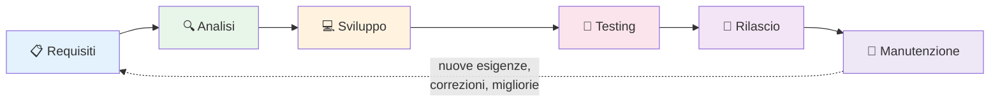
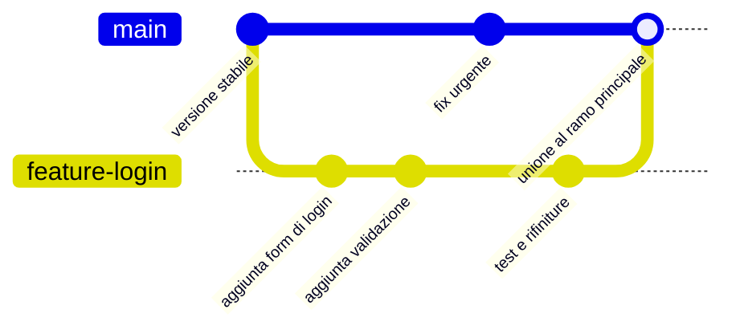
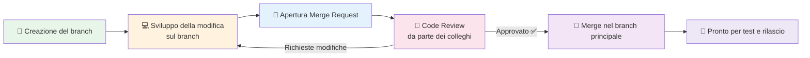

# 3. Come nasce un software

> 📄 **[Scarica questa sezione in PDF](https://darioschioppi.github.io/corso-onboarding-devops/pdf/03-come-nasce-un-software.pdf)** — utile per la stampa o la lettura offline.

Nella sezione precedente hai imparato cosa sono hardware, software, reti e altri concetti di base dell'informatica. Ora facciamo un passo avanti: come nasce, concretamente, un software? Chi lo progetta? Chi lo scrive? Chi decide quando è pronto per essere usato dalle persone?

Capire questo processo è fondamentale per te, futuro Junior Project Manager, perché il tuo lavoro consisterà proprio nel coordinare le persone e le attività che compongono questo processo. Non dovrai scrivere codice, ma dovrai capire di cosa parlano gli sviluppatori, cosa significa "abbiamo trovato un bug in produzione" o "la merge request è ancora in review", e come si inserisce ogni attività nel percorso complessivo di un progetto software.

Pensa a questa sezione come alla mappa di un territorio che esplorerai per tutta la tua carriera: oggi impari i nomi delle vie principali, poi con l'esperienza scoprirai i dettagli di ogni singolo quartiere.

Per non restare sul piano astratto, seguiremo come filo conduttore **ShopFacile**, la piattaforma e-commerce che hai già incontrato nella sezione precedente, con il suo piccolo team interno: Marco e Giulia (developer, lei molto attenta a test e qualità), Ahmed (developer junior, in crescita), Sara (Product Owner) e Luca (Scrum Master).

## 🎯 Obiettivi della sezione

Alla fine di questa sezione saprai:

- Descrivere le fasi del ciclo di vita di un software e cosa succede in ciascuna
- Distinguere un requisito funzionale da un requisito non funzionale
- Spiegare la differenza tra bug e feature
- Capire perché il software viene "numerato" con le versioni
- Comprendere, a livello concettuale, cosa sono branch, merge request, code review e merge

## 🔄 Il ciclo di vita del software

Immagina di dover costruire una casa. Non inizi comprando mattoni a caso: prima parli con la famiglia che ci vivrà per capire quante stanze servono (requisiti), poi un architetto disegna la piantina (analisi), poi gli operai costruiscono davvero la casa (sviluppo), poi un ingegnere controlla che tutto sia sicuro e a norma (testing), poi la famiglia ci si trasferisce (rilascio), e infine, anno dopo anno, la casa avrà bisogno di manutenzione: una caldaia da sostituire, un tetto da riparare (manutenzione).

Il software funziona esattamente allo stesso modo. Questo percorso si chiama **ciclo di vita del software** (in inglese *Software Development Life Cycle*, o **SDLC**), ed è composto da fasi che si ripetono in ogni progetto, grande o piccolo.

Nota la freccia tratteggiata che torna da "Manutenzione" a "Requisiti": il ciclo di vita non è quasi mai un percorso lineare che finisce una volta per tutte. È più simile a una spirale: ogni volta che il software viene usato nel mondo reale, emergono nuove esigenze, si scoprono difetti, arrivano richieste di nuove funzionalità, e il ciclo riparte. Nei prossimi capitoli (in particolare nella sezione sull'Agile) vedrai che i team moderni ripetono questo ciclo molte volte, anche ogni due settimane, invece di farlo una sola volta in anni.

Vediamo ora ogni fase nel dettaglio.

### 1. Requisiti: cosa deve fare il software

È la fase in cui si stabilisce **cosa** deve fare il software, senza ancora preoccuparsi di **come** lo farà tecnicamente. È come quando parli con un architetto e gli dici "vogliamo tre camere, una cucina abitabile e un balcone": stai descrivendo un bisogno, non stai disegnando la pianta.

In questa fase il project manager, il cliente e gli analisti si incontrano per capire cosa serve davvero. Il risultato è un documento (o una lista di elementi in uno strumento come Jira o Azure DevOps, che vedremo più avanti) che elenca i **requisiti**.

**Esempio pratico**: durante una riunione su ShopFacile, il cliente dice "vogliamo che i nostri utenti possano cercare i prodotti nel catalogo per nome o categoria". Sara, la Product Owner, trascrive questa richiesta in una card del backlog, magari titolata "Ricerca prodotti nel catalogo", senza ancora sapere se si useranno filtri, una barra di ricerca testuale o entrambe le cose: quella scelta arriverà nella fase successiva.

Approfondiamo questo concetto nella prossima sezione perché è cruciale.

### 2. Analisi: dai requisiti alla soluzione

Una volta chiaro **cosa** serve, bisogna capire **come** realizzarlo. È il lavoro dell'architetto che trasforma "vogliamo tre camere" in una piantina con misure precise, posizione dei muri portanti, degli impianti elettrici e idraulici.

Nel software, questa fase si chiama **analisi** (o analisi tecnica/progettazione). Chi si occupa di analisi — spesso un architetto software o un tech lead — decide:

- Come sarà strutturato il software (quali "pezzi" lo compongono e come comunicano tra loro — ne parleremo nella sezione sulle architetture software)
- Quali tecnologie usare (linguaggi di programmazione, database, strumenti)
- Come i dati saranno organizzati e salvati
- Quali rischi tecnici ci sono e come affrontarli

**Esempio pratico**: il requisito è "l'utente deve poter recuperare la password se la dimentica". Marco, che spesso si occupa di infrastruttura e di questo tipo di scelte tecniche, stabilisce come: si invierà un'email con un link temporaneo, quel link scadrà dopo 30 minuti, i dati della password saranno salvati in un certo modo per motivi di sicurezza. È il passaggio dall'idea al progetto tecnico.

Una volta che si sa "come" farlo, resta solo un passaggio: farlo davvero. Passiamo quindi alla fase di sviluppo.

### 3. Sviluppo: si scrive il codice

Questa è la fase che tutti immaginano quando pensano all'informatica: gli sviluppatori "scrivono codice". Ma cosa significa davvero?

**Scrivere codice** significa dare istruzioni precise e dettagliate al computer, usando un linguaggio di programmazione (Python, Java, C#, JavaScript, e tanti altri). Il computer non capisce l'italiano o l'inglese naturale: capisce solo istruzioni scritte in un modo molto rigido e specifico, un po' come una ricetta di cucina scritta per una persona che esegue esattamente e solo quello che è scritto, senza improvvisare nulla.

Un'analogia utile: se dici a un amico "fammi un caffè", lui capisce dal contesto cosa fare. Se dovessi scrivere le istruzioni per un robot che non ha mai visto un caffè, dovresti specificare ogni singolo passaggio: "apri lo sportello della macchina, prendi la capsula dal contenitore in alto a destra, inseriscila nell'apposito slot, chiudi lo sportello, premi il tasto con la scritta ESPRESSO, attendi che il led diventi verde...". Scrivere codice è simile: bisogna essere estremamente precisi, perché il computer esegue letteralmente quello che gli viene scritto, senza intuire le intenzioni.

Lo sviluppatore prende i documenti di analisi e li traduce in queste istruzioni dettagliate, organizzate in file di testo (i "file di codice") che insieme compongono il software. Il codice viene poi salvato e condiviso con il resto del team usando strumenti come Git (che vedremo nella prossima sezione).

**Esempio pratico**: l'analisi ha stabilito che serve una funzione che calcoli lo sconto finale su un carrello di ShopFacile. Marco scrive, in un linguaggio come Python o Java, una serie di istruzioni tipo "prendi il totale del carrello, verifica se esiste un codice sconto valido, se sì calcola la percentuale da sottrarre, altrimenti restituisci il totale invariato". Ogni singolo caso (carrello vuoto, codice sconto scaduto, sconto superiore al totale) deve essere previsto esplicitamente: il computer non "capisce" cosa intendevi, esegue solo quello che hai scritto.

Il codice è scritto, ma "sembra funzionare" non basta: prima di fidarsene bisogna verificarlo sistematicamente. È qui che entra in gioco il testing.

### 4. Testing: si verifica che funzioni

Immaginiamo che gli operai abbiano finito di costruire la casa. Prima di far entrare la famiglia, un ingegnere collaudatore verifica che gli impianti funzionino, che le porte si aprano bene, che non ci siano crepe nei muri. Non basta che la casa "sembri" pronta: bisogna testarla.

Nel software questa fase si chiama **testing** (o test, o collaudo). Consiste nel verificare, in modo sistematico, che il software faccia esattamente quello che deve fare, senza comportamenti indesiderati.

Esistono diversi tipi di test, con diversi livelli di dettaglio:

- **Test unitari**: verificano un singolo "pezzettino" di codice isolato, ad esempio una funzione che calcola uno sconto. È come testare una singola presa elettrica prima di collegare l'intero impianto.
- **Test di integrazione**: verificano che più pezzi di codice funzionino bene insieme, ad esempio che il sistema di pagamento comunichi correttamente con il catalogo prodotti. È come verificare che l'impianto elettrico e quello idraulico non entrino in conflitto.
- **Test manuali**: una persona (spesso chiamata tester o QA, *Quality Assurance*) usa il software come farebbe un utente reale, cliccando in giro, provando casi limite, cercando di "romperlo". È come far vivere qualcuno nella casa per un weekend di prova prima del trasferimento definitivo.

Perché si testa? Perché è molto più economico e veloce trovare un errore prima che il software arrivi agli utenti, piuttosto che scoprirlo quando migliaia di persone lo stanno già usando (e magari perdendo dati o soldi a causa di quell'errore).

**Esempio pratico**: per la nuova funzionalità di ricerca prodotti di ShopFacile, Ahmed scrive un test unitario che verifica che la funzione di ricerca restituisca risultati corretti con un solo prodotto nel catalogo; Giulia, sempre molto attenta alla qualità, scrive un test di integrazione che verifica che la ricerca funzioni correttamente insieme al filtro dei prezzi, e poi prova lei stessa a digitare caratteri strani (accenti, emoji, campo vuoto) nella barra di ricerca per vedere se qualcosa si rompe. Solo dopo che tutti e tre i livelli di test danno esito positivo, la funzionalità viene considerata pronta per il passo successivo.

I test sono tutti verdi: la funzionalità può finalmente lasciare l'ambiente del team ed essere messa nelle mani degli utenti veri.

### 5. Rilascio (Deploy): si va "in produzione"

Quando il software ha superato i test, è pronto per essere usato davvero dagli utenti finali. Questo passaggio si chiama **rilascio** o, con il termine tecnico che sentirai usare moltissimo, **deploy**.

"Mettere il software in produzione" significa renderlo disponibile e funzionante nell'ambiente reale, quello usato dai clienti veri — a differenza degli ambienti di test o sviluppo, che sono come delle "copie di prova" usate solo internamente dal team (ne parleremo nella sezione sugli ambienti di sviluppo).

Un'analogia: è il giorno del trasferimento nella casa nuova. Tutto quello che è stato progettato, costruito e verificato diventa finalmente reale e utilizzabile dalla famiglia.

Il deploy può essere un'operazione delicata: si tratta di installare la nuova versione del software sui sistemi che gli utenti usano davvero, a volte senza nemmeno interrompere il servizio (pensa a un aggiornamento di un'app che non ti fa nemmeno notare che è cambiato qualcosa). Nella sezione dedicata al DevOps e alla CI/CD scoprirai come oggi questo processo venga spesso automatizzato per essere più rapido e sicuro.

**Esempio pratico**: il team decide di rilasciare la nuova funzionalità di ricerca prodotti di ShopFacile di notte, in una fascia orario con pochissimi utenti collegati, per limitare l'impatto nel caso qualcosa vada storto. Il deploy viene fatto prima solo su una piccola parte dei server (un cosiddetto "rilascio graduale"): se dopo un'ora tutto funziona bene, la nuova versione viene estesa a tutti gli utenti; se emergono problemi, si può tornare rapidamente alla versione precedente (un'operazione chiamata *rollback*).

Il software è finalmente in produzione, ma la storia non finisce qui: da questo momento inizia una fase che dura molto più a lungo di tutte le altre messe insieme, la manutenzione.

### 6. Manutenzione: la cura continua

Una casa, una volta costruita, non resta perfetta per sempre: la caldaia si guasta, il tetto va rifatto, magari dopo qualche anno si decide di ristrutturare la cucina. Lo stesso vale per il software.

La **manutenzione** comprende tutte le attività che avvengono dopo il rilascio:

- Correggere errori che emergono durante l'uso reale (i famosi **bug**, che vedremo tra poco)
- Aggiornare il software per farlo funzionare con nuove versioni di sistemi operativi o browser
- Migliorare le prestazioni
- Aggiungere piccole modifiche richieste dagli utenti

Un progetto software di successo può restare "in manutenzione" per anni, anche decenni. È una fase spesso sottovalutata da chi è alle prime armi, ma in realtà occupa una parte enorme del tempo e del budget di un progetto informatico nel lungo periodo.

**Esempio pratico**: sei mesi dopo il rilascio, la funzionalità di ricerca prodotti di ShopFacile inizia a rispondere sempre più lentamente perché il catalogo è cresciuto da 500 a 50.000 prodotti. Nessun requisito iniziale parlava di questo scenario: è un'attività di manutenzione, in cui Marco introduce un meccanismo di **caching** (una sorta di "memoria veloce" che conserva i risultati delle ricerche più frequenti) per riportare i tempi di risposta a livelli accettabili.

Abbiamo visto le sei fasi in azione. Ma per parlarne con precisione nel lavoro quotidiano, serve anche il vocabolario giusto: cominciamo dai requisiti, distinguendo due categorie che confonderai spesso all'inizio.

## 📋 Requisiti: funzionali e non funzionali

Torniamo sui requisiti, perché è un concetto che userai costantemente nel tuo ruolo di Project Manager.

Un **requisito** è una descrizione di qualcosa che il software deve fare o di come deve comportarsi. Si dividono in due grandi categorie.

### Requisiti funzionali

Descrivono **cosa** il software deve fare, cioè le sue funzionalità concrete. Rispondono alla domanda: "quali azioni deve poter compiere l'utente (o il sistema)?"

**Esempi:**

- "L'app deve permettere all'utente di effettuare il login con email e password"
- "Il sistema deve permettere di aggiungere un prodotto al carrello"
- "L'utente deve poter scaricare la fattura in formato PDF"

Sono requisiti facili da immaginare, perché descrivono azioni concrete e visibili, un po' come l'elenco delle stanze di una casa: "vogliamo una cucina, due camere, un bagno".

### Requisiti non funzionali

Descrivono **come** il software deve comportarsi, cioè la qualità con cui svolge le sue funzioni. Non riguardano una singola azione specifica, ma una caratteristica generale del sistema. Rispondono alla domanda: "quanto bene, quanto velocemente, quanto in sicurezza deve funzionare?"

**Esempi:**

- "L'app deve rispondere in meno di 2 secondi a ogni richiesta"
- "Il sistema deve poter gestire fino a 10.000 utenti collegati contemporaneamente"
- "I dati personali degli utenti devono essere cifrati"
- "L'applicazione deve essere disponibile (funzionante) almeno il 99,9% del tempo in un anno"

Tornando all'analogia della casa: se il requisito funzionale è "vogliamo una cucina", il requisito non funzionale è "la cucina deve essere isolata acusticamente e avere abbastanza corrente per usare più elettrodomestici insieme senza far scattare il salvavita". Non è una stanza in più, è una qualità che tutte le stanze devono avere.

| Aspetto | Requisito funzionale | Requisito non funzionale |
|---|---|---|
| Domanda a cui risponde | Cosa fa? | Quanto bene lo fa? |
| Esempio | "Login con email e password" | "Login in meno di 2 secondi" |
| Facile da vedere? | Sì, si nota subito se manca | No, spesso si nota solo quando manca (es. sistema lento) |
| Chi lo richiede spesso | Cliente, utenti | Team tecnico, esigenze di business (sicurezza, scalabilità) |

Un errore comune di chi inizia in questo settore è concentrarsi solo sui requisiti funzionali, perché sono i più "visibili" e i clienti li richiedono esplicitamente. Ma un buon Project Manager sa che i requisiti non funzionali (velocità, sicurezza, affidabilità) sono altrettanto critici: un'app che fa tutto quello che deve, ma è lentissima o insicura, è comunque un fallimento.

Anche il requisito meglio scritto, però, non garantisce che il codice finale si comporti come previsto: a volte qualcosa va storto, ed è lì che entra in scena il bug.

## 🐛 Bug: quando qualcosa va storto

Un **bug** è un difetto nel software: un comportamento non corretto, non previsto o non voluto. Il termine in inglese significa letteralmente "insetto", e c'è una storia (in parte leggendaria, ma bellissima) dietro questo nome.

> **Curiosità storica**: si racconta che nel 1947, mentre lavorava su uno dei primi grandi calcolatori (il Harvard Mark II), la programmatrice e informatica Grace Hopper e il suo team trovarono una falena vera e propria incastrata tra i contatti di un relè elettromeccanico, che causava un malfunzionamento. Il team incollò l'insetto su un foglio del registro di laboratorio con la scritta "First actual case of bug being found" (primo caso reale di un bug trovato). Da allora, "bug" è diventato il termine universale per indicare un errore nel software (anche se il termine era già usato in ambito ingegneristico prima di quell'episodio).

**Esempio concreto di bug**: su ShopFacile, Giulia scopre durante un test che se metti nel carrello più di 99 pezzi dello stesso prodotto, il prezzo totale diventa negativo per un errore nel calcolo. L'utente potrebbe finire per "guadagnare" acquistando, invece di pagare! Questo è esattamente il tipo di comportamento inatteso che un bug produce: qualcosa che nessuno ha previsto o voluto, che si scopre spesso solo quando il software viene usato in modi che gli sviluppatori non avevano immaginato.

I bug possono essere piccoli e quasi invisibili (un testo scritto con il colore sbagliato) o gravissimi (un sistema bancario che addebita importi errati). Parte del lavoro di un Project Manager è proprio aiutare a **classificare** i bug per gravità e priorità, per decidere quali vanno risolti immediatamente e quali possono aspettare: il bug del prezzo negativo di ShopFacile, per esempio, è abbastanza grave da bloccare tutto il resto.

## ✨ Feature: una nuova funzionalità

Un bug corregge qualcosa che non va, ma non tutto il lavoro del team nasce da un errore da correggere: molto lavoro nasce dal desiderio di aggiungere qualcosa di nuovo e utile. Questo si chiama feature.

Una **feature** è, al contrario del bug, qualcosa di voluto: una nuova funzionalità che si aggiunge al software per offrire più valore agli utenti.

**Esempio**: aggiungere la possibilità di pagare con Apple Pay in un'app che finora accettava solo carta di credito è una feature. È una scelta, una decisione di business, non la correzione di un errore.

La differenza tra bug fix (correzione di un bug) e feature è quindi:

| | Bug fix | Feature |
|---|---|---|
| Perché si fa | Qualcosa non funziona come dovrebbe | Si vuole aggiungere qualcosa di nuovo |
| È previsto dai requisiti originali? | Sì, il comportamento corretto era già previsto ma non funzionava | No, è un'aggiunta rispetto a quanto già esisteva |
| Urgenza tipica | Spesso alta, soprattutto se blocca l'uso del software | Variabile, spesso pianificata per una versione futura |
| Esempio | "Il bottone 'Acquista' non risponde al click su alcuni telefoni" | "Aggiungere la possibilità di salvare i prodotti preferiti" |

Questa distinzione è fondamentale perché, come Project Manager, dovrai spesso gestire un elenco (detto **backlog**, termine che approfondiremo nella sezione sull'Agile) contenente sia bug da correggere che feature da sviluppare, e aiutare il team a decidere le priorità.

Ogni volta che un bug viene corretto o una feature aggiunta, il software cambia rispetto a prima: serve un modo per identificare con precisione "quale versione" stiamo usando o discutendo in un dato momento.

## 🔢 Versioning: perché numeriamo il software

Hai mai notato che le app sul telefono si aggiornano e mostrano numeri come "2.4.1" o "10.0.3"? Questo si chiama **versioning** (o numerazione delle versioni).

Perché è importante? Immagina di dover parlare con un collega di un problema e dire semplicemente "l'app fa una cosa strana". Quale app? In che momento? Con quali funzionalità presenti? Senza un numero di versione preciso, sarebbe come descrivere un'auto senza dire il modello o l'anno: informazioni troppo vaghe per essere utili.

Il numero di versione permette di:

- Sapere esattamente quale "fotografia" del software si sta usando o discutendo
- Capire se un problema è già stato risolto in una versione più recente
- Comunicare chiaramente ai clienti cosa cambia da una versione all'altra

Un sistema molto diffuso si chiama **Semantic Versioning** (versionamento semantico), che usa tre numeri nel formato **MAJOR.MINOR.PATCH** (ad esempio **1.2.3**):

- **MAJOR** (il primo numero, "1"): cambia quando si introducono modifiche importanti, che potrebbero non essere compatibili con le versioni precedenti. Ad esempio, se cambia completamente il modo in cui l'app comunica con altri sistemi.
- **MINOR** (il secondo numero, "2"): cambia quando si aggiungono nuove feature, ma tutto quello che c'era prima continua a funzionare come prima.
- **PATCH** (il terzo numero, "3"): cambia quando si correggono bug, senza aggiungere nuove funzionalità.

**Esempio pratico**: se il software è alla versione 1.2.3 e il team:

- corregge un bug → diventa 1.2.**4**
- aggiunge una nuova feature (es. il pagamento con Apple Pay) → diventa 1.**3**.0
- cambia qualcosa in modo così profondo da rompere la compatibilità con l'esterno → diventa **2**.0.0

Questo sistema è uno standard molto diffuso nel mondo dello sviluppo software, adottato da moltissime librerie e applicazioni.

Numerare le versioni presuppone però che il codice arrivi in modo ordinato a uno stato "pubblicabile" — e questo, con più persone che scrivono codice insieme, non è affatto scontato. Vediamo come si organizza concretamente il lavoro di squadra sul codice.

## 🌿 Branching: lavorare in parallelo

Immagina un team di 5 sviluppatori — pensa a Marco, Giulia, Ahmed e ai loro colleghi di ShopFacile — che lavorano tutti insieme, contemporaneamente, sullo stesso identico file di codice. Cosa potrebbe succedere? Molto probabilmente, un disastro: le modifiche di uno cancellerebbero quelle di un altro, e sarebbe impossibile capire chi ha cambiato cosa.

Per questo esiste il concetto di **branch** (in italiano "ramo"). Un branch è come una copia parallela e temporanea del progetto, su cui una persona (o un piccolo gruppo) può lavorare in isolamento, senza disturbare il lavoro degli altri, per poi ricongiungere le modifiche al progetto principale quando sono pronte.

L'analogia migliore è quella dell'albero: il tronco principale rappresenta la versione "ufficiale" e stabile del software (spesso chiamata branch `main` o `master`). Ogni volta che uno sviluppatore deve lavorare su qualcosa — una nuova feature, la correzione di un bug — crea un ramo che si distacca dal tronco, ci lavora in tranquillità, e alla fine quel ramo viene "ricongiunto" al tronco principale.

Questo concetto sarà spiegato con molti più dettagli pratici (comandi, strumenti, esempi passo-passo) nella prossima sezione dedicata a Git e GitLab. Per ora ti basta capire l'idea: il branching permette a più persone di lavorare in parallelo sullo stesso progetto senza pestarsi i piedi.

**Esempio pratico**: mentre Ahmed lavora sul branch `feature-ricerca-prodotti` per aggiungere la barra di ricerca, Giulia lavora in parallelo sul branch `fix-carrello` per correggere il bug del prezzo negativo visto prima. Nessuno dei due deve aspettare che l'altro finisca: lavorano entrambi sul proprio ramo, isolati, e uniranno le modifiche al tronco principale quando saranno pronti, ciascuno con i suoi tempi.

## 🔁 Dal branch al merge: merge request e code review

Un branch isolato, però, non può restare isolato per sempre: prima o poi il lavoro va ricongiunto al tronco principale. Ma una volta che uno sviluppatore ha finito di lavorare sul proprio ramo (ad esempio ha completato la feature "login con email"), non può semplicemente "ricongiungere" le sue modifiche al tronco principale senza controlli. Sarebbe rischioso: e se il suo codice avesse errori? E se rompesse qualcosa che già funzionava?

Per questo, prima di unire le modifiche, si passa attraverso due passaggi fondamentali: la **merge request** e la **code review**.

### Merge Request: "propongo questa modifica"

Una **merge request** (spesso abbreviata **MR** — su altre piattaforme lo stesso concetto può avere un nome diverso, ma la logica è identica) è, in parole semplici, una richiesta formale: "ho finito di lavorare su questo ramo, per favore controllate il mio lavoro e, se va bene, unitelo al progetto principale".

È come quando, dopo aver scritto una relazione di lavoro, non la invii direttamente al cliente, ma la mandi prima al tuo responsabile per un controllo. La merge request è esattamente quella richiesta di controllo, applicata al codice.

**Esempio pratico**: Ahmed, che ha finito la barra di ricerca prodotti, apre una merge request con un titolo come "Aggiunta ricerca prodotti per nome e categoria" e una descrizione che spiega cosa cambia, come è stato testato e magari uno screenshot del risultato. A quel punto la merge request compare in una lista visibile a tutto il team (su GitLab o Azure DevOps), pronta per essere revisionata.

Aprire la merge request, però, non basta: qualcuno deve davvero leggere quel codice prima che diventi parte ufficiale del progetto. È il momento della code review.

### Code Review: il controllo dei colleghi

La **code review** è il momento in cui uno o più colleghi (spesso sviluppatori più esperti, o semplicemente altri membri del team) leggono il codice scritto e verificano che:

- Faccia davvero quello che deve fare
- Sia scritto in modo chiaro e mantenibile (cioè che altre persone, in futuro, possano capirlo e modificarlo facilmente)
- Non introduca bug o problemi di sicurezza
- Segua le convenzioni e gli standard adottati dal team

Perché è importante che sia qualcun altro a controllare, e non solo chi ha scritto il codice? Per lo stesso motivo per cui è utile far leggere una mail importante a un collega prima di inviarla: chi scrive tende a non vedere i propri errori, mentre un occhio esterno nota cose che altrimenti sfuggirebbero. La code review, inoltre, aiuta a diffondere la conoscenza del progetto tra i membri del team, così che non ci sia una sola persona che "sa tutto" e nessun altro capisce quel pezzo di codice.

Se durante la code review emergono problemi, chi ha scritto il codice apporta le correzioni richieste, e il processo si ripete finché tutti sono soddisfatti.

**Esempio pratico**: Giulia, revisionando la merge request della ricerca prodotti, lascia un commento del tipo "qui la ricerca fa distinzione tra maiuscole e minuscole, un utente che scrive 'scarpe' con la S minuscola non troverebbe 'Scarpe' scritto con la maiuscola: puoi correggerlo?". Ahmed corregge il codice, aggiorna la merge request, e Giulia la approva.

### Merge: l'unione finale

La code review è stata superata: non resta che rendere ufficiale il lavoro. Quando la merge request è stata approvata dai colleghi durante la code review, si procede al **merge**: l'unione definitiva delle modifiche del ramo (branch) al progetto principale. A questo punto, quella nuova funzionalità o correzione diventa parte ufficiale del software, pronta per le fasi successive (ulteriori test, e infine il rilascio).

**Esempio pratico**: dopo l'approvazione, Ahmed (o un collega con i permessi adeguati) clicca sul bottone "Merge" nello strumento usato dal team. Da quel momento, il codice della barra di ricerca fa parte del branch principale `main` di ShopFacile, insieme al lavoro di tutti gli altri membri del team, e sarà incluso nel prossimo rilascio pianificato.

Questo flusso — branch, merge request, code review, merge — è oggi lo standard adottato dalla stragrande maggioranza dei team di sviluppo professionali nel mondo, e lo ritroverai costantemente nel tuo lavoro quotidiano come Project Manager, anche solo per monitorare lo stato di avanzamento delle attività del team.

## 🧩 Come si collegano tutti questi concetti

Abbiamo visto tanti termini uno alla volta: requisiti, bug, feature, versioning, branch, merge request, code review, merge. Facciamo un piccolo riepilogo con un esempio end-to-end sul progetto ShopFacile, per vedere come tutti i concetti di questa sezione si incastrano insieme in un caso reale (semplificato):

1. Il cliente chiede una nuova funzionalità: "vogliamo che gli utenti possano recuperare la password" → è un **requisito funzionale**, che Sara fa finire nel backlog di ShopFacile come **feature**.
2. Marco fa l'**analisi**: decide di implementarla con un'email contenente un link temporaneo.
3. Ahmed crea un **branch** dedicato e inizia lo **sviluppo**, scrivendo il codice necessario.
4. Durante lo sviluppo scopre e corregge anche un piccolo **bug** preesistente in una funzione che invia le email.
5. Finito il lavoro, apre una **merge request**.
6. Giulia esegue la **code review**, chiede una piccola modifica per rispettare un **requisito non funzionale** (il link deve scadere dopo 30 minuti per motivi di sicurezza).
7. Ahmed corregge, Giulia approva, si fa il **merge**.
8. Il team esegue il **testing** (unitario, di integrazione e manuale) sulla nuova funzionalità.
9. Tutto ok: si prepara il **rilascio** e si assegna un nuovo numero di **versione** a ShopFacile, ad esempio da 2.3.1 a 2.4.0 (è una nuova feature, quindi cambia il numero MINOR).
10. Il software va in **produzione**. Da qui in avanti, entra nella fase di **manutenzione**: se emergono nuovi bug legati a questa funzionalità, il ciclo ripartirà da capo su un nuovo branch.

Come vedi, tutti questi termini che oggi possono sembrare astratti sono in realtà i mattoni con cui è costruito il lavoro quotidiano di qualsiasi team software, ShopFacile incluso. Nelle prossime sezioni approfondirai molti di questi concetti con strumenti e pratiche concrete.

## 📝 Esercizi pratici

Questi esercizi ti aiutano a consolidare i concetti di questa sezione prima di passare a Git e GitLab. Non servono strumenti particolari: bastano carta, penna e, dove indicato, una breve chiacchierata con un collega.

1. **Mappa il ciclo di vita su un caso reale.** Pensa a una funzionalità che sai essere stata rilasciata di recente nel progetto (chiedi a un collega se non ne conosci una) e scrivi, riga per riga, come pensi si siano svolte le sei fasi del ciclo di vita (requisiti, analisi, sviluppo, testing, rilascio, manutenzione) per quel caso specifico. Non preoccuparti di essere preciso al 100%: l'obiettivo è esercitarti a "vedere" le fasi in un esempio concreto.
   ✅ **Come verificare**: mostra la tua mappa a un collega del team e chiedigli di correggere i punti in cui hai sbagliato o semplificato troppo.

2. **Classifica 5 requisiti.** Scrivi 5 frasi che potrebbero essere requisiti di un software (puoi inventarle o prenderle da una card reale del backlog del progetto) e per ciascuna indica se è un requisito funzionale o non funzionale, motivando la scelta in una riga.
   ✅ **Come verificare**: rileggi ogni frase chiedendoti "risponde a *cosa fa*?" (funzionale) o a "*quanto bene lo fa*?" (non funzionale); se la risposta non è immediata, probabilmente la frase è scritta in modo ambiguo — provala a riformulare.

3. **Distingui bug da feature su casi reali.** Chiedi a un developer o al tuo referente di mostrarti 3-4 elementi del backlog del progetto (o della board del team) e, prima che te lo dicano loro, provaci a indovinare quali sono bug e quali sono feature, spiegando il perché della tua scelta.
   ✅ **Come verificare**: confronta le tue risposte con la classificazione reale usata dal team; se hai sbagliato qualcosa, capisci perché (spesso la differenza sta nel fatto che un bug viola un comportamento già previsto, mentre la feature è un'aggiunta nuova).

4. **Simula un versioning.** Immagina che il software del progetto sia alla versione 3.4.2. Elenca 4 eventi ipotetici (2 bug fix, 1 nuova feature, 1 cambiamento che rompe la compatibilità) e scrivi, in ordine, come cambierebbe il numero di versione dopo ciascun evento.
   ✅ **Come verificare**: rileggi le regole MAJOR.MINOR.PATCH di questa sezione e verifica che ogni tuo passaggio le rispetti (ad esempio, un nuovo MAJOR deve riportare MINOR e PATCH a zero).

5. **Disegna il flusso branch → merge con un esempio del progetto.** Su un foglio (anche a mano), disegna il flowchart "branch, sviluppo, merge request, code review, merge" visto in questa sezione, ma sostituendo le etichette generiche con un esempio verosimile del progetto (es. "branch fix-notifiche-email" invece di "creazione del branch"). Poi racconta il disegno a voce alta, come se lo spiegassi a un collega nuovo arrivato.
   ✅ **Come verificare**: se riesci a raccontare il disegno senza guardare gli appunti e senza incepparti su nessun passaggio, hai interiorizzato bene il flusso.

## 🔗 Collegamenti

- [4. Git e GitLab](../04-git-e-gitlab/README.md) — per capire in pratica, con comandi ed esempi, come funzionano davvero branch, commit, merge request e merge
- [5. Agile](../05-agile/README.md) — per scoprire come i team moderni organizzano il ciclo di vita del software in iterazioni brevi e continue
- [9. DevOps](../09-devops/README.md) — per approfondire come le fasi di sviluppo, testing e rilascio vengono oggi collegate e automatizzate
- [11. CI/CD](../11-ci-cd/README.md) — per capire come build, test e deploy possono essere automatizzati end-to-end

## 📚 Risorse

- [Atlassian — What is SDLC? Software Development Life Cycle Explained](https://www.atlassian.com/agile/software-development/sdlc) — panoramica chiara sul ciclo di vita del software
- [Semantic Versioning 2.0.0](https://semver.org/) — la specifica ufficiale del versionamento semantico (in inglese, ma con esempi semplici)
- [GitLab Docs — About merge requests](https://docs.gitlab.com/user/project/merge_requests/) — documentazione ufficiale su cosa sono e come funzionano le merge request
- [Atlassian — Code Review Best Practices](https://www.atlassian.com/agile/software-development/code-reviews) — guida pratica sul perché e come si fa code review
- [Wikipedia — Software bug (storia del termine, inclusa la storia della falena di Grace Hopper)](https://en.wikipedia.org/wiki/Software_bug) — approfondimento storico e tecnico sull'origine del termine "bug"
