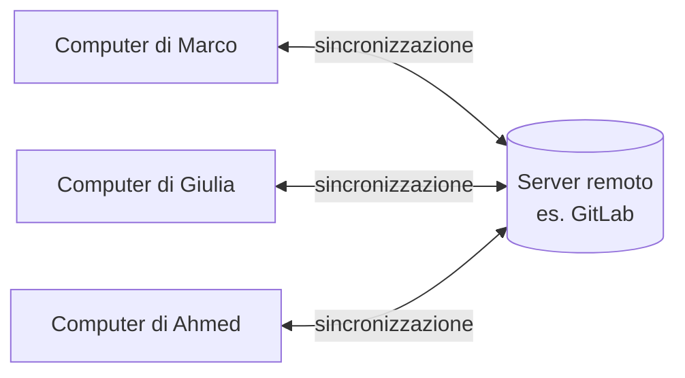
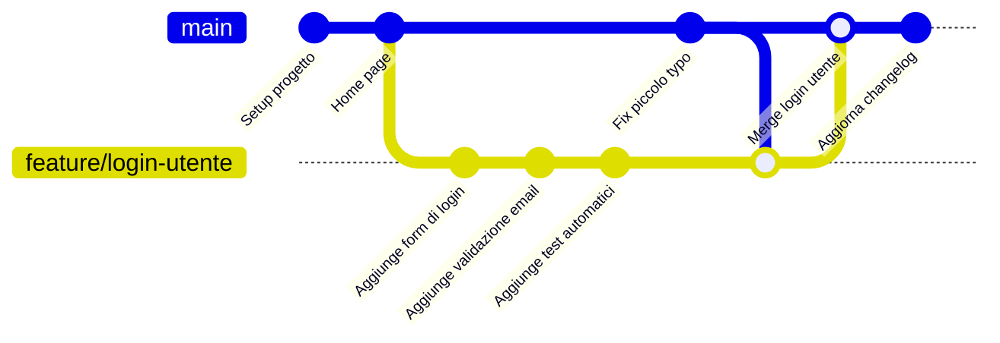
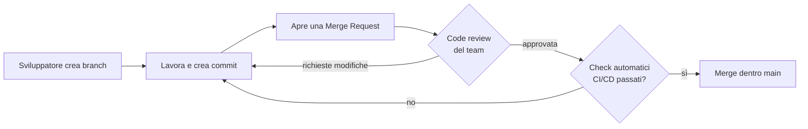
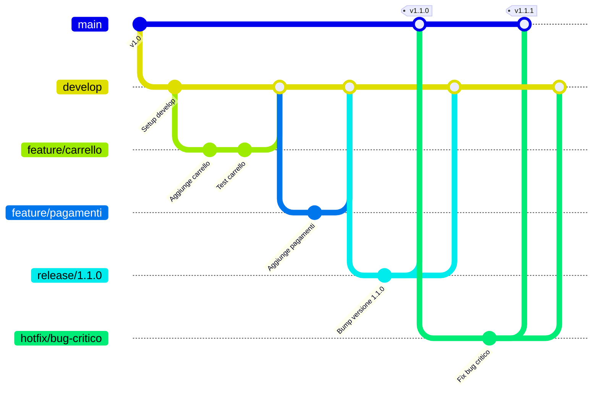
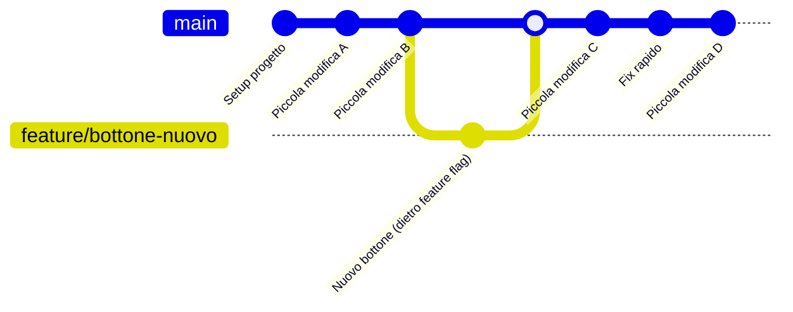

# 4. Git e GitLab


> 📄 **[Scarica questa sezione in PDF](https://darioschioppi.github.io/corso-onboarding-devops/pdf/04-git-e-gitlab.pdf)** — utile per la stampa o la lettura offline.


Se hai mai lavorato su un documento Word con altre persone, probabilmente
conosci già l'incubo dei file chiamati `Progetto_finale_v2_DEFINITIVO_uso_questo.docx`.
Qualcuno ha modificato una frase, qualcun altro ha cancellato per errore
un paragrafo importante, e nessuno ricorda più qual è la versione "buona".

Git e GitLab esistono per risolvere esattamente questo problema, ma applicato
al codice sorgente di un software: migliaia di file di testo che decine di
persone modificano ogni giorno, in parallelo, senza pestarsi i piedi a
vicenda.

Questa è probabilmente la sezione più "pratica" del corso: gli strumenti che
imparerai qui li vedrai citati in ogni standup, in ogni merge request, in
ogni pipeline di CI/CD. Non serve che tu diventi uno sviluppatore, ma è
fondamentale che tu capisca il vocabolario e la logica di fondo, perché è il
linguaggio con cui il tuo team lavora ogni giorno.

## 🎯 Obiettivi della sezione

Alla fine di questa sezione saprai:

- spiegare la differenza tra Git e GitLab;
- capire cosa sono repository, commit, branch e merge;
- capire come funziona una Merge Request e perché è il cuore della
  collaborazione su GitLab;
- distinguere Issue, Release e Tag;
- conoscere due modelli di lavoro (workflow) molto diffusi: **Git Flow** e
  **Trunk Based Development**, e capire quando si usa l'uno o l'altro.

---

## 4.1 Cos'è Git

**Git** è un **sistema di controllo di versione** (in inglese *Version
Control System*, o VCS). In parole semplici: è un programma che tiene
traccia di **ogni modifica** fatta ai file di un progetto, salvando nel
tempo tutta la "cronologia" di quelle modifiche.

> 💡 **Analogia**: pensa alla cronologia delle modifiche di Google Docs o
> alla funzione "Traccia modifiche" di Word, ma molto più potente. Con Git
> non solo puoi vedere chi ha cambiato cosa e quando, ma puoi anche:
> - tornare indietro a una versione precedente in qualsiasi momento;
> - far lavorare **più persone in parallelo** sullo stesso progetto senza
>   che si sovrascrivano il lavoro a vicenda;
> - "unire" automaticamente le modifiche fatte da persone diverse.

Git è stato creato nel 2005 da Linus Torvalds (lo stesso creatore di Linux)
per gestire lo sviluppo del kernel Linux, un progetto con migliaia di
collaboratori. Oggi è lo standard de facto per versionare codice, usato
praticamente da ogni azienda software al mondo.

Un punto fondamentale: **Git è distribuito**. Questo significa che ogni
persona che lavora su un progetto ha, sul proprio computer, una **copia
completa** di tutta la cronologia del progetto — non solo l'ultima
versione, ma *tutta la storia* fin dall'inizio. Questo è molto diverso dai
vecchi sistemi centralizzati, dove esisteva un solo "archivio" centrale e
se quello andava giù, si perdeva tutto.



Git funziona da **riga di comando** (il terminale), ma esistono anche
interfacce grafiche (come GitKraken, o l'integrazione diretta in Visual
Studio Code) che rendono tutto più visuale. In questo corso vedrai comandi
da terminale a scopo illustrativo: non devi memorizzarli a memoria,
l'obiettivo è che tu capisca **la logica**.

---

## 4.2 Cos'è GitLab (e non è la stessa cosa di Git!)

Uno degli equivoci più comuni per chi inizia è pensare che Git e GitLab
siano la stessa cosa. Non lo sono.

| | Git | GitLab |
|---|---|---|
| **Cos'è** | Uno strumento (software) | Una piattaforma online (un servizio) |
| **Dove vive** | Sul tuo computer | Su internet (cloud), o su un server aziendale (self-hosted) |
| **Cosa fa** | Gestisce la cronologia delle modifiche | Ospita i repository online e aggiunge funzionalità di collaborazione |
| **Necessario?** | Sì, è il motore | No, è un servizio che *usa* Git |

> 💡 **Analogia**: Git è come il motore di un'auto: fa il lavoro tecnico di
> spostare la macchina. GitLab è come una concessionaria con parcheggio,
> assistenza e servizi extra: ospita l'auto, la rende visibile ad altri,
> offre strumenti di manutenzione condivisa. Potresti guidare l'auto (usare
> Git) senza mai passare dalla concessionaria (senza mai usare GitLab) — ma
> se lavori in team, avere un posto centrale dove parcheggiare e collaborare
> è estremamente comodo.

GitLab, in concreto, offre:

- uno spazio online dove "ospitare" i repository (i progetti);
- strumenti di collaborazione come **Merge Request**, **Issue**, revisioni
  del codice, commenti;
- automazioni (**GitLab CI/CD**, che vedremo nella sezione CI/CD);
- gestione di permessi, team, sicurezza.

GitLab **non è l'unica piattaforma** di questo tipo. L'alternativa più
diffusa in contesti aziendali come il tuo è:

- **Azure DevOps Repos**: la componente di versionamento codice della
  suite Azure DevOps di Microsoft (che vedremo nella sezione 10) — in
  alcuni contesti aziendali è la piattaforma principale.

Il concetto di fondo è sempre lo stesso (Git sotto il cofano), cambia la
piattaforma "concessionaria" sopra. In questo corso useremo GitLab come
riferimento perché è molto diffusa sia in versione cloud sia
**self-hosted** (installata sui server dell'azienda, ad esempio su un
indirizzo come `gitlab.tuaazienda.it`), ed è una scelta molto comune nelle
realtà aziendali che vogliono mantenere il controllo completo della propria
infrastruttura.

---

## 4.3 Repository: il "progetto" versionato

Un **repository** (spesso abbreviato "repo") è semplicemente **la cartella
di un progetto**, ma tracciata da Git. Contiene tutti i file del progetto
(codice, documentazione, configurazioni) più una cartella speciale
invisibile chiamata `.git`, dove Git conserva tutta la cronologia delle
modifiche.

> 💡 **Analogia**: se il progetto è un libro, il repository è sia il libro
> stesso sia l'archivio completo di tutte le bozze precedenti, capitolo per
> capitolo, con la data e l'autore di ogni modifica.

Un repository può essere:
- **locale**: la copia che vive sul tuo computer;
- **remoto**: la copia ospitata online (su GitLab, cloud o self-hosted),
  che funge da punto di incontro condiviso tra tutti i membri del team.

```bash
# Creare un nuovo repository da zero, dentro una cartella
git init

# Oppure "clonare" (scaricare) un repository che esiste già online
git clone https://gitlab.com/nome-organizzazione/nome-progetto.git
```

Dopo un `git clone`, avrai sul tuo computer una copia completa del
progetto, compresa tutta la sua storia — pronta per essere modificata.

> 🧪 **Esempio pratico**: immagina che il team ti mandi il link a un
> repository GitLab del progetto, ad esempio
> `https://gitlab.com/nome-progetto/backend-api` (o, se l'azienda usa
> un'istanza self-hosted, qualcosa come
> `https://gitlab.tuaazienda.it/nome-progetto/backend-api`). Aprendolo nel
> browser vedrai: una lista di cartelle e file (il codice), un pulsante
> blu "Clone" per clonarlo, il numero di branch attivi, e una voce
> "Commits" con la cronologia di tutte le modifiche fatte finora. Se lo
> clonassi sul tuo computer con
> `git clone https://gitlab.com/nome-progetto/backend-api.git`, ti
> ritroveresti in una cartella `backend-api` con dentro tutti quei file,
> pronti per essere letti — anche se non li modifichi mai.

---

## 4.4 Commit: uno scatto fotografico delle modifiche

Un **commit** è un salvataggio "ufficiale" di un insieme di modifiche, con
un messaggio che spiega **cosa** e **perché** è stato cambiato.

> 💡 **Analogia**: immagina di scattare una fotografia allo stato attuale
> del progetto. Ogni commit è uno scatto: cattura esattamente come erano i
> file in quel momento, con un'etichetta (il messaggio di commit) che
> descrive cosa è successo da uno scatto all'altro. Con tante fotografie in
> sequenza, hai un album completo della storia del progetto.

Il flusso tipico per creare un commit è:

```bash
# 1. Vedo quali file ho modificato
git status

# 2. "Metto in valigia" le modifiche che voglio salvare (staging)
git add nome-file.txt
# oppure, per aggiungere tutti i file modificati:
git add .

# 3. Creo il commit con un messaggio descrittivo
git commit -m "Aggiunge la validazione del campo email nel form di registrazione"
```

Alcune buone pratiche sui messaggi di commit (le vedrai spesso menzionate
nelle Merge Request del team):

- il messaggio deve spiegare **il perché**, non solo il "cosa" (il "cosa"
  si vede già dal codice cambiato);
- meglio tanti commit piccoli e mirati che un unico commit enorme con
  scritto "fix vari";
- molti team adottano convenzioni standard, ad esempio i
  [Conventional Commits](https://www.conventionalcommits.org/) (`feat:`,
  `fix:`, `docs:`, `chore:`...).

Ogni commit ha un **identificativo univoco** (un codice esadecimale, es.
`a1b2c3d`), che permette di riferirsi esattamente a quello scatto in
qualsiasi momento futuro — utile per capire, ad esempio, "in quale commit
è stato introdotto questo bug?".

> 🧪 **Esempio pratico**: dopo tre commit, se lanci `git log --oneline`
> vedresti qualcosa così:
> ```
> a1b2c3d Aggiunge la validazione del campo email nel form di registrazione
> 9f8e7d6 Aggiunge il form di registrazione utente
> 3c4d5e6 Setup iniziale del progetto
> ```
> Ogni riga è un commit: il codice a sinistra (es. `a1b2c3d`) è
> l'identificativo univoco, il testo a destra è il messaggio. Se un giorno
> qualcuno nota un bug nella validazione email, un developer potrà usare
> `git log` per capire esattamente in quale commit — e quindi in che
> momento — è stata introdotta quella modifica.

---

## 4.5 Branch: un ramo di lavoro parallelo

Un **branch** (letteralmente "ramo") è una linea di sviluppo indipendente
che parte da un punto della storia del progetto. Permette di lavorare su
qualcosa di nuovo (una funzionalità, una correzione) **senza toccare** la
versione "stabile" del progetto, che di solito vive nel branch principale
chiamato `main` (in passato spesso chiamato `master`).

> 💡 **Analogia**: pensa alla linea principale della storia (`main`) come
> alla strada maestra di un progetto: deve restare sempre percorribile e
> affidabile. Un branch è come un cantiere laterale in cui provi cose nuove:
> se qualcosa va storto, il cantiere non blocca la strada principale.
> Quando il lavoro nel cantiere è pronto e testato, lo "colleghi" alla
> strada maestra.

```bash
# Creo un nuovo branch chiamato "feature/login-utente"
git branch feature/login-utente

# Mi sposto su quel branch per iniziare a lavorarci
git checkout feature/login-utente

# In alternativa, questi due comandi si possono unire in uno solo:
git checkout -b feature/login-utente
```

Convenzioni di naming comuni per i branch (utili da riconoscere quando le
vedi nelle Merge Request):

- `feature/...` → nuova funzionalità (es. `feature/login-utente`)
- `fix/...` o `bugfix/...` → correzione di un bug
- `hotfix/...` → correzione urgente su produzione
- `release/...` → preparazione di una nuova versione

Lavorare su branch separati è ciò che permette a più persone del team di
lavorare **in parallelo sullo stesso progetto** senza pestarsi i piedi.

> 🧪 **Esempio pratico**: il team deve sviluppare due cose in parallelo: una
> nuova pagina di login e la correzione di un bug nel checkout. Due
> developer diversi lanceranno:
> ```bash
> git checkout -b feature/login-utente        # developer A
> git checkout -b fix/checkout-prezzo-errato  # developer B
> ```
> Da questo momento lavorano su due "cantieri" separati: i commit di A non
> toccano i file su cui lavora B (a meno che non modifichino esattamente
> gli stessi file), e nessuno dei due tocca `main`, che resta stabile per
> tutti gli altri.

---

## 4.6 Merge: unire due rami

Il **merge** è l'operazione che **unisce le modifiche** fatte su un branch
dentro un altro branch (tipicamente, si uniscono le modifiche di un branch
di feature dentro `main`, una volta che il lavoro è completo e testato).

> 💡 **Analogia**: riprendendo l'immagine di prima, il merge è il momento in
> cui il cantiere laterale viene collegato alla strada principale: da quel
> momento, chi percorre la strada maestra passa anche dal nuovo tratto.

```bash
# Mi sposto sul branch che deve "ricevere" le modifiche
git checkout main

# Unisco le modifiche del branch di feature dentro main
git merge feature/login-utente
```

Git è molto bravo a unire automaticamente modifiche fatte su parti diverse
dei file. Ma se due persone hanno modificato **esattamente la stessa riga**
in modo diverso, Git non sa quale versione tenere: si genera un
**conflitto di merge**, che va risolto manualmente decidendo quale
modifica (o quale combinazione) mantenere. Non preoccuparti: è un evento
normalissimo nel lavoro quotidiano, non un errore grave.

> 🧪 **Esempio pratico**: supponiamo che il branch `feature/login-utente`
> sia pronto. Da `main` lanci:
> ```bash
> git checkout main
> git merge feature/login-utente
> ```
> Se nessuno ha toccato le stesse righe su `main` nel frattempo, Git
> risponde con qualcosa come `Fast-forward` o
> `Merge made by the 'ort' strategy` e il lavoro è unito automaticamente.
> Se invece un altro developer aveva modificato lo stesso file nello stesso
> punto, Git si ferma e restituisce un messaggio come
> `CONFLICT (content): Merge conflict in login.js` — a quel punto tocca
> aprire il file, decidere quale versione tenere (o combinarle), e
> completare il merge con `git add` + `git commit`.

Ecco un diagramma che riassume l'intero ciclo di vita di un branch di
feature, dalla creazione al merge:



Cosa racconta questo diagramma: mentre il branch `feature/login-utente`
procedeva con i suoi commit, anche `main` è avanzato con un piccolo fix.
Il branch di feature ha "assorbito" quell'aggiornamento (merge di `main`
dentro il branch), per essere sicuro di lavorare sulla versione più
recente, e infine è stato unito (merge) dentro `main`, portando tutto il
lavoro fatto nella linea principale.

---

## 4.7 Merge Request: il cuore della collaborazione su GitLab

Una **Merge Request** (spesso abbreviata **MR**) è una **richiesta
formale** di unire le modifiche di un branch dentro un altro branch (di
solito dentro `main`), passando prima per una **revisione** da parte di
altri membri del team.

Questo è probabilmente il concetto più importante di tutta la sezione,
perché è il meccanismo attraverso cui lavora quasi ogni team che usa
GitLab. (Su Azure DevOps, che vedremo nella sezione 10, lo stesso identico
concetto si chiama "Pull Request" — non farti confondere dal nome
diverso: la logica è la stessa.)

> 💡 **Analogia**: è come sottoporre una bozza di documento a un collega
> prima di renderla definitiva. Non modifichi direttamente il documento
> ufficiale: proponi le tue modifiche, il collega le legge, lascia
> commenti, magari chiede correzioni, e solo quando tutti sono d'accordo la
> bozza diventa la versione ufficiale.

Il flusso tipico di una Merge Request:

1. Uno sviluppatore crea un branch e ci lavora (con i suoi commit).
2. Quando il lavoro è pronto, apre una **Merge Request** su GitLab,
   proponendo di unire quel branch dentro `main` (o dentro un altro branch
   di destinazione).
3. Altri membri del team fanno la **code review**: leggono le modifiche,
   lasciano commenti, chiedono chiarimenti o correzioni.
4. Spesso, in parallelo, delle **pipeline automatiche** (CI/CD, che
   vedremo nella sezione 11) eseguono automaticamente test e controlli di
   qualità sul codice della MR.
5. Quando tutto è approvato ("approved") e i controlli automatici sono
   passati (i cosiddetti "check verdi"), la Merge Request viene unita
   (merge) — spesso con un semplice click sul pulsante "Merge" su GitLab.



Perché le Merge Request sono così importanti per un Project Manager?
Perché sono il punto in cui puoi **misurare visivamente lo stato di
avanzamento** del lavoro: quante MR sono aperte, quante sono in attesa di
revisione, quanto tempo restano aperte prima di essere unite (un indicatore
utile di quanto è fluido il processo del team).

> 🧪 **Esempio pratico**: un developer ha finito la feature login. I
> passaggi concreti su GitLab sarebbero:
> 1. Push del branch: `git push origin feature/login-utente`.
> 2. Su GitLab compare un banner "Create merge request": clicca, scrivi
>    un titolo (es. "Aggiunge login utente con validazione email") e una
>    descrizione di cosa cambia e perché.
> 3. Assegna uno o due colleghi come reviewer/approver.
> 4. I colleghi lasciano commenti tipo "Perché qui usiamo `==` invece di
>    `===`?" — il developer risponde o corregge con un nuovo commit sullo
>    stesso branch, che aggiorna automaticamente la MR.
> 5. Quando i commenti sono risolti e i check automatici (CI/CD) sono
>    verdi, un reviewer clicca "Approve", poi qualcuno clicca "Merge".
>
> Da Project Manager, vedresti questa MR nella sezione "Merge requests"
> del repository con un'etichetta verde "Open" che diventa viola "Merged"
> a fine processo.

---

## 4.8 Issue: tracciare bug e richieste

Una **Issue** è una "voce" che descrive un problema da risolvere o una
richiesta da realizzare: un bug da correggere, una nuova funzionalità da
sviluppare, un miglioramento da valutare.

> 💡 **Analogia**: è come un "biglietto" (ticket) di un help desk: qualcuno
> segnala un problema o una richiesta, il biglietto viene assegnato a
> qualcuno, discusso, e chiuso quando risolto.

Una Issue tipicamente contiene:
- un titolo chiaro;
- una descrizione del problema o della richiesta (spesso con passi per
  riprodurre un bug, screenshot, comportamento atteso vs. osservato);
- **etichette** (label), es. `bug`, `enhancement`, `documentazione`;
- un **assegnatario** (chi ci lavora);
- commenti di discussione.

Le Issue si possono collegare direttamente alle Merge Request: è comune
vedere in una MR la frase "Closes #42", che indica che, una volta unita
quella MR, la Issue numero 42 verrà chiusa automaticamente perché risolta.

Molti team di progetto (incluso probabilmente il tuo) usano le Issue di
GitLab — o l'equivalente "Work Item" in Azure DevOps — come base per la
gestione del backlog che vedremo nelle sezioni su Agile, Scrum e Kanban.

> 🧪 **Esempio pratico**: un utente segnala che il pulsante "Conferma
> ordine" non funziona su un certo browser. Sul repository del progetto,
> qualcuno apre una Issue così:
> - **Titolo**: "Il pulsante Conferma ordine non risponde su Safari"
> - **Descrizione**: passi per riprodurlo, screenshot, browser e versione
>   usati
> - **Label**: `bug`, `priorità-alta`
> - **Assegnatario**: il developer che se ne occuperà
>
> Il developer apre un branch `fix/conferma-ordine-safari`, risolve il
> problema, e nella descrizione della Merge Request scrive "Closes #57"
> (dove 57 è il numero della Issue): una volta unita la MR, GitLab chiude
> automaticamente la Issue numero 57.

---

## 4.9 Release: una versione pubblicata ufficialmente

Una **Release** è un punto preciso della storia del progetto che viene
"pubblicato" ufficialmente come versione consegnabile agli utenti finali
(o al cliente).

> 💡 **Analogia**: se i commit sono gli scatti fotografici quotidiani di un
> album, la release è la **foto scelta per la copertina** di un capitolo:
> un momento speciale, marcato e comunicato a tutti come "questa è la
> versione 2.3.0, disponibile da oggi".

Le release seguono spesso uno schema di numerazione chiamato
**Semantic Versioning** (`MAJOR.MINOR.PATCH`, es. `2.3.1`):
- **MAJOR**: cambiamenti grandi, potenzialmente non compatibili con le
  versioni precedenti (es. `1.x` → `2.0.0`);
- **MINOR**: nuove funzionalità compatibili con le versioni precedenti
  (es. `2.2.x` → `2.3.0`);
- **PATCH**: correzioni di bug, senza nuove funzionalità (es. `2.3.0` →
  `2.3.1`).

Su GitLab, una Release viene solitamente accompagnata da **note di
rilascio** (release notes): un elenco leggibile di cosa è cambiato,
utilissimo anche per un Project Manager che deve comunicare al cliente o
agli stakeholder cosa contiene la nuova versione.

> 🧪 **Esempio pratico**: il team rilascia la versione `2.3.0` del
> prodotto. Sulla pagina "Releases" di GitLab troveresti una voce con:
> - tag `v2.3.0`;
> - titolo "Versione 2.3.0 — Gestione utenti";
> - note di rilascio tipo: "✨ Nuove funzionalità: gestione ruoli utente.
>   🐛 Fix: corretto un bug nel checkout. ⚠️ Nota: richiede un
>   aggiornamento del database.";
> - eventuali file scaricabili (es. un installer).
>
> Un Project Manager potrebbe riprendere direttamente queste note di
> rilascio — magari semplificandole — in una comunicazione al cliente o in
> un aggiornamento agli stakeholder.

---

## 4.10 Tag: etichettare un punto preciso della storia

Un **Tag** è un'etichetta che punta a un commit specifico, per marcarlo
come "punto di interesse" — quasi sempre usato insieme alle release.

> 💡 **Analogia**: se la storia del progetto è un lungo rotolo di
> pellicola fotografica, un tag è un segnalibro adesivo attaccato a uno
> scatto preciso, con scritto sopra "v2.3.0" — così puoi ritrovarlo
> istantaneamente anche tra migliaia di altri scatti.

```bash
# Creo un tag "annotato" (con messaggio) sul commit corrente
git tag -a v2.3.0 -m "Versione 2.3.0: aggiunta gestione utenti"

# Invio il tag anche al repository remoto (altrimenti resta solo locale)
git push origin v2.3.0
```

Differenza pratica tra Tag e Release: il **tag** è un concetto di Git
(un puntatore a un commit), mentre la **Release** è un concetto di GitLab
costruito sopra un tag, con in più note descrittive, file scaricabili
(binari, installer) e visibilità nella pagina del progetto.

> 🧪 **Esempio pratico**: dopo aver taggato e pubblicato la versione
> `v2.3.0`, se sei sul repository e lanci `git tag`, vedresti l'elenco di
> tutti i tag creati nel tempo:
> ```
> v1.0.0
> v1.1.0
> v2.0.0
> v2.1.0
> v2.2.0
> v2.3.0
> ```
> Se un giorno serve tornare esattamente alla versione rilasciata qualche
> mese prima, basta fare `git checkout v2.1.0` (se quello era il tag di
> quella release) per vedere il progetto esattamente come era in quel
> momento, senza dover cercare "a occhio" nella cronologia dei commit.

---

## 4.11 Git Flow: un workflow strutturato a più branch

**Git Flow** è un modello di organizzazione dei branch molto diffuso,
pensato per progetti con **cicli di rilascio pianificati** (es. una nuova
versione ogni mese) e la necessità di gestire più cose in parallelo: nuove
funzionalità, preparazione di una release, correzioni urgenti su
produzione.

Git Flow prevede branch con ruoli specifici:

- **`main`**: contiene sempre il codice in produzione, stabile al 100%.
- **`develop`**: il branch di "integrazione", dove confluiscono le
  funzionalità completate, in attesa della prossima release.
- **`feature/...`**: branch temporanei per sviluppare singole
  funzionalità, che partono da `develop` e ci ritornano a lavoro finito.
- **`release/...`**: branch temporanei usati per finalizzare una versione
  (test, piccoli fix, aggiornamento numero di versione) prima di
  pubblicarla.
- **`hotfix/...`**: branch temporanei per correzioni urgenti direttamente
  su `main`, per problemi critici in produzione che non possono aspettare
  il prossimo ciclo di release.



**Quando usare Git Flow**: è utile quando il progetto ha rilasci
pianificati e non continui (es. release mensili), quando serve mantenere
in parallelo più versioni in produzione, o quando il processo di
approvazione/rilascio è complesso e richiede una fase di stabilizzazione
prima di ogni release. Lo svantaggio è che è un processo più pesante, con
più branch da gestire e più passaggi di merge.

> 🧪 **Esempio pratico**: il progetto rilascia una nuova versione ogni
> mese. Lo scenario tipico con Git Flow:
> - i developer lavorano tutto il mese su vari branch `feature/...` che
>   partono da `develop` e ci tornano quando pronti;
> - una settimana prima del rilascio si crea `release/1.4.0` da
>   `develop`: qui si fanno solo piccoli fix e test finali, niente nuove
>   funzionalità;
> - quando è tutto stabile, `release/1.4.0` viene unito sia in `main` (con
>   tag `v1.4.0`, che diventa la produzione) sia di nuovo in `develop`;
> - se due giorni dopo il rilascio emerge un bug critico in produzione, si
>   crea `hotfix/bug-pagamenti` direttamente da `main`, si corregge, si
>   unisce in `main` (nuovo tag `v1.4.1`) e anche in `develop`, così il fix
>   non si perde nel prossimo rilascio.

---

## 4.12 Trunk Based Development: il workflow semplificato

Il **Trunk Based Development** (TBD) è un approccio molto più semplice:
tutti i membri del team lavorano il più possibile direttamente su **un
unico branch principale** (il "trunk", cioè `main`), con **commit
frequenti e piccoli**, integrando il proprio lavoro più volte al giorno.

> 💡 **Analogia**: se Git Flow è come costruire un edificio con tanti
> cantieri separati che vengono collegati alla struttura principale solo a
> lavori ultimati, il Trunk Based Development è come aggiungere un mattone
> alla volta direttamente sulla struttura principale, controllando ogni
> singolo mattone prima di posarlo, così l'edificio resta sempre in piedi
> e visitabile.

I branch di feature, quando si usano, sono **molto brevi** (durano ore o
al massimo un paio di giorni, non settimane), e le funzionalità non ancora
pronte per gli utenti finali vengono spesso "nascoste" tramite
**feature flag** (interruttori che attivano/disattivano una funzionalità)
invece che tenute isolate su un branch a lungo termine.



**Quando usare Trunk Based Development**: funziona molto bene quando il
team ha una **suite di test automatici solida** e una pipeline di CI/CD
matura, capace di verificare rapidamente che ogni piccolo cambiamento non
rompa nulla. È il modello preferito dai team che fanno rilasci **continui**
(più volte al giorno o alla settimana), tipico della cultura DevOps che
vedremo più avanti nel corso. Lo svantaggio è che richiede molta disciplina
e automazione: senza test solidi, integrare spesso su un unico branch
diventa rischioso.

> 🧪 **Esempio pratico**: il team lavora con Trunk Based Development e una
> pipeline CI/CD solida. Una developer deve aggiungere un nuovo filtro di
> ricerca:
> - crea un branch `feature/filtro-ricerca` la mattina;
> - fa 2-3 commit piccoli nel corso della giornata, ciascuno verificato
>   automaticamente dalla pipeline;
> - il filtro non è ancora pronto per tutti gli utenti, quindi lo nasconde
>   dietro un feature flag chiamato `nuovo_filtro_ricerca_attivo`
>   (inizialmente spento);
> - entro sera apre una MR piccola e veloce da revisionare, e la unisce in
>   `main`;
> - il codice è ora in produzione ma invisibile agli utenti (flag spento);
>   quando il team è pronto, attiva il flag per tutti (o per un gruppo di
>   test) senza dover rilasciare nulla di nuovo.

### Confronto rapido

| | Git Flow | Trunk Based Development |
|---|---|---|
| **Struttura branch** | Molti branch a lungo termine (`main`, `develop`, `feature`, `release`, `hotfix`) | Un solo branch principale, branch di feature brevissimi |
| **Frequenza integrazione** | Bassa (le feature restano isolate a lungo) | Alta (più commit al giorno su `main`) |
| **Adatto a** | Rilasci pianificati, versioni multiple in produzione | Rilasci continui, cultura DevOps, forte automazione |
| **Serve** | Processo chiaro e disciplina sui merge | Test automatici solidi, feature flag |
| **Rischio principale** | Conflitti di merge grandi e complessi | Rischio di "rompere" main se manca automazione |

Non esiste un modello "migliore in assoluto": la scelta dipende dalla
maturità del team, dal tipo di prodotto e dalla frequenza di rilascio
desiderata. Molti team reali usano versioni semplificate o ibride di
questi due modelli, adattandole al proprio contesto.

---

## 4.13 Riepilogo dei comandi visti in questa sezione

```bash
git init                              # crea un nuovo repository
git clone <url>                       # scarica un repository esistente
git status                            # mostra i file modificati
git add <file>                        # prepara le modifiche per il commit
git commit -m "messaggio"             # salva uno "scatto" delle modifiche
git branch <nome>                     # crea un nuovo branch
git checkout <nome>                   # mi sposto su un branch
git checkout -b <nome>                # crea e mi sposto su un nuovo branch
git merge <branch>                    # unisce un branch in quello corrente
git tag -a <nome> -m "messaggio"      # crea un tag annotato
git push origin <branch|tag>          # invia branch/tag al repository remoto
```

Ricorda: non serve che tu memorizzi tutti questi comandi a memoria. Ciò
che conta, nel tuo ruolo, è capire **cosa rappresentano concettualmente**
(uno scatto, un ramo, un'unione) per poter seguire con consapevolezza le
conversazioni tecniche del team, leggere lo stato di una Merge Request, e
capire perché il team ha scelto un certo workflow.

---

## 📝 Esercizi pratici

Gli esercizi che seguono ti servono a consolidare i concetti visti in
questa sezione con le mani sulla tastiera. Non serve nessun progetto reale:
puoi farli tutti con un account GitLab gratuito e un repository di prova
che poi puoi anche eliminare.

1. **Crea un repository e fai il tuo primo commit.**
   Crea un repository di prova su GitLab (pubblico o privato, non
   importa), clonalo sul tuo computer con `git clone`, crea un file
   `note.txt` con dentro una riga di testo a piacere, poi lancia
   `git add note.txt` e `git commit -m "Primo commit di prova"`.
   ✅ **Come verificare**: lanciando `git log`, deve apparire il tuo
   commit con il messaggio che hai scritto e un identificativo
   esadecimale univoco.

2. **Crea un branch, modificalo e uniscilo.**
   Nel repository di prova, crea un branch con
   `git checkout -b feature/prova`, modifica `note.txt` aggiungendo una
   seconda riga, fai un commit, poi torna su `main` con
   `git checkout main` e lancia `git merge feature/prova`.
   ✅ **Come verificare**: dopo il merge, `note.txt` su `main` deve
   contenere anche la riga che hai aggiunto sul branch, e `git log`
   deve mostrare il commit del branch unito nella storia di `main`.

3. **Genera un conflitto di merge e risolvilo.**
   Sempre su `main`, modifica la prima riga di `note.txt` e fai un
   commit. Poi crea un nuovo branch da un punto *precedente* a quella
   modifica (o modifica la stessa riga su un secondo branch prima del
   merge) e prova a fare il merge: dovresti ottenere un
   `CONFLICT (content)`. Apri il file, scegli quale testo mantenere,
   rimuovi i marcatori `<<<<<<<`, `=======`, `>>>>>>>` che Git inserisce, e
   completa il merge con `git add note.txt` e `git commit`.
   ✅ **Come verificare**: `git status` non deve più segnalare conflitti,
   e `note.txt` deve contenere solo il testo finale che hai scelto, senza
   marcatori residui.

4. **Apri una Merge Request fittizia su GitLab.**
   Fai il push del branch `feature/prova` (o uno nuovo) con
   `git push origin feature/prova`, poi su GitLab apri una Merge Request
   verso `main`, scrivendo un titolo e una breve descrizione di cosa
   cambia. Se hai un amico o un collega disponibile, chiedigli di
   lasciarti un commento; altrimenti lasciatelo da solo per vedere come
   funziona l'interfaccia.
   ✅ **Come verificare**: la Merge Request compare nella sezione
   "Merge requests" del repository con stato "Open", e mostra
   correttamente i file modificati nel tab "Changes".

5. **Crea un tag e una Release.**
   Sul repository di prova, crea un tag annotato con
   `git tag -a v0.1.0 -m "Prima versione di prova"`, invialo con
   `git push origin v0.1.0`, poi su GitLab vai nella sezione "Releases" e
   pubblica una Release basata su quel tag, con qualche nota di rilascio
   scritta da te.
   ✅ **Come verificare**: il tag `v0.1.0` compare lanciando `git tag`, e
   la Release compare nella pagina "Releases" del repository con le note
   che hai scritto.

6. **Disegna il workflow del tuo progetto reale.**
   Chiedi a un collega developer quale workflow (Git Flow, Trunk Based
   Development, o una via di mezzo) usa il progetto su cui sei inserito/a,
   e provate insieme a disegnare — anche su un foglio — la sequenza di
   branch che si crea per una feature "tipica" del progetto, dalla
   creazione del branch fino al rilascio in produzione.
   ✅ **Come verificare**: sai indicare, senza guardare gli appunti, se il
   progetto usa (o si avvicina a) Git Flow o a Trunk Based Development, e
   sai spiegare perché quella scelta si adatta al ritmo di rilascio del
   progetto.

---

## 🔗 Collegamenti

- [3. Come nasce un software](../03-come-nasce-un-software/README.md) — dove si inserisce Git nel ciclo di vita di un progetto software
- [5. Agile](../05-agile/README.md) — il mindset dietro le pratiche di integrazione frequente che abbiamo visto con il Trunk Based Development
- [9. DevOps](../09-devops/README.md) — la cultura di automazione e rilascio continuo che rende possibile il Trunk Based Development
- [10. Azure DevOps](../10-azure-devops/README.md) — Repos, l'equivalente di GitLab nella suite Microsoft
- [11. CI/CD](../11-ci-cd/README.md) — le pipeline automatiche che si attivano su commit e Merge Request
- [16. Glossario](../16-glossario/README.md) — per ripassare velocemente i termini di questa sezione

## 📚 Risorse

- [Documentazione ufficiale di Git](https://git-scm.com/doc)
- [Git — Book (Pro Git, gratuito e in italiano)](https://git-scm.com/book/it/v2)
- [GitLab Docs](https://docs.gitlab.com/)
- [Learn Git Branching (esercizi interattivi nel browser)](https://learngitbranching.js.org/)
- [GitLab Docs — Tutorials](https://docs.gitlab.com/tutorials/)
- [About merge requests — GitLab Docs](https://docs.gitlab.com/user/project/merge_requests/)
- [Conventional Commits](https://www.conventionalcommits.org/)
- [Semantic Versioning](https://semver.org/lang/it/)
- [Trunk Based Development](https://trunkbaseddevelopment.com/)
- [A successful Git branching model (Git Flow, Vincent Driessen)](https://nvie.com/posts/a-successful-git-branching-model/)
