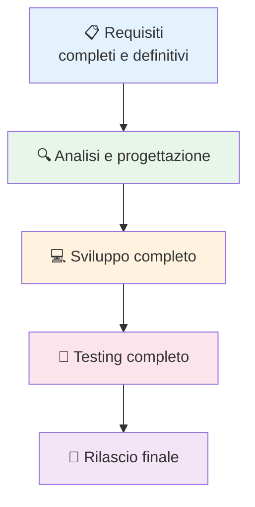
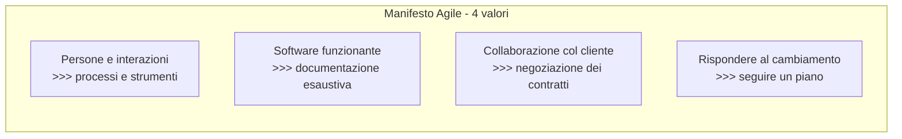
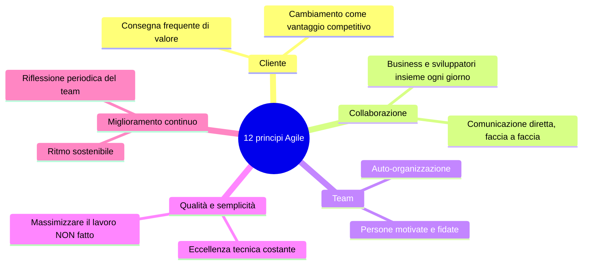
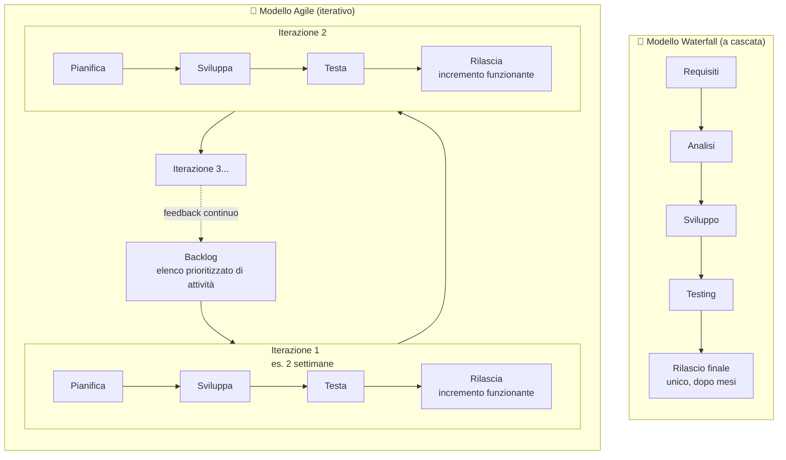

# 5. Agile


> 📄 **[Scarica questa sezione in PDF](../../pdf/05-agile.pdf)** — utile per la stampa o la lettura offline.


Nelle sezioni precedenti hai visto come nasce un software (requisiti, analisi, sviluppo, testing, rilascio, manutenzione) e come Git e GitHub permettano a più persone di lavorare insieme sullo stesso codice. Ora facciamo un passo diverso, ma altrettanto importante: non uno strumento, non una tecnologia, ma un **modo di pensare** e di organizzare il lavoro.

Si chiama **Agile**, e se lavori (o lavorerai) in un team di sviluppo software, è quasi certo che lo sentirai nominare fin dal primo giorno: "il nostro team lavora in modo agile", "facciamo Scrum", "usiamo una board Kanban". Questa sezione ti dà le basi per capire da dove viene questo termine, cosa significa davvero, e perché ha cambiato il modo in cui si costruisce il software negli ultimi 20 anni.

## 🎯 Obiettivi della sezione

Alla fine di questa sezione saprai:

- spiegare perché è nato l'Agile e da cosa si differenzia rispetto ai modelli precedenti;
- elencare e spiegare con parole tue i 4 valori del Manifesto Agile;
- riconoscere i temi principali dei 12 principi Agile, senza doverli imparare a memoria;
- descrivere cosa significa avere un "mindset agile" nel lavoro quotidiano;
- distinguere concettualmente un approccio Waterfall da un approccio Agile;
- sapere che Scrum e Kanban sono due modi concreti (framework) per applicare l'Agile.

---

## 5.1 Perché nasce l'Agile: il problema del modello a "cascata"

Per capire perché è nato l'Agile, dobbiamo prima capire cosa c'era **prima**.

Per decenni, il modo più comune di gestire un progetto software è stato il modello **Waterfall** (in italiano "a cascata"). L'idea è semplice: il progetto si divide in fasi rigide, una dopo l'altra, e si passa alla fase successiva solo quando quella precedente è **completamente** finita. Prima si raccolgono *tutti* i requisiti, poi si fa *tutta* l'analisi, poi si scrive *tutto* il codice, poi si testa *tutto*, e solo alla fine si rilascia il prodotto finito.



> 💡 **Analogia**: il Waterfall è come costruire una casa seguendo un progetto architettonico immutabile, firmato e bloccato fin dal primo giorno. Solo alla fine dei lavori, dopo mesi o anni, la famiglia entra per la prima volta nella casa finita — e solo in quel momento scopre se le misure della cucina erano davvero quelle giuste per le sue esigenze.

Il problema di questo approccio è diventato via via più evidente, soprattutto a partire dagli anni '90, quando il software ha iniziato a diventare sempre più complesso e i mercati sempre più rapidi a cambiare:

- **Il cliente vede il risultato troppo tardi.** Se il progetto dura un anno, il cliente scopre il prodotto finito dopo un anno — e nel frattempo le sue esigenze possono essere cambiate, o si accorge che aveva descritto male ciò di cui aveva davvero bisogno.
- **Cambiare idea a metà strada è costosissimo.** In un modello a cascata, tornare indietro (es. modificare un requisito durante lo sviluppo) significa spesso rifare da capo intere fasi già "chiuse".
- **I rischi si scoprono tardi.** Un problema tecnico grave, o un errore nei requisiti iniziali, viene spesso a galla solo nella fase di testing o, peggio, dopo il rilascio — quando correggerlo costa molto di più che se fosse stato scoperto all'inizio.

Negli anni '90 e nei primi anni 2000, diversi gruppi di sviluppatori (indipendenti tra loro) iniziarono a sperimentare approcci alternativi, più flessibili e incentrati sul consegnare valore al cliente in modo rapido e frequente, piuttosto che pianificare tutto in anticipo nei minimi dettagli. Nacquero così metodi con nomi come Scrum, Extreme Programming (XP), Crystal, e altri — tutti con filosofie simili ma pratiche diverse.

Nel **febbraio 2001**, 17 di questi sviluppatori si incontrarono in una località di montagna (Snowbird, Utah, USA) per discutere cosa avessero in comune i loro approcci. Da quell'incontro nacque un documento breve e diretto: il **Manifesto per lo Sviluppo Agile di Software** (*Manifesto Agile*). Non era un metodo, non era una checklist di regole: era un insieme di **valori e principi condivisi**, un vero e proprio cambio di mentalità.

---

## 5.2 Il Manifesto Agile: i 4 valori fondamentali

Il Manifesto Agile è composto, prima di tutto, da **4 valori**. Sono espressi con una struttura particolare: "preferiamo A rispetto a B", il che **non significa che B non conti**, ma che, quando bisogna scegliere, A ha la priorità.

> 💡 Testo originale (in inglese) di riferimento: [agilemanifesto.org](https://agilemanifesto.org/iso/it/manifesto.html) — esiste anche la versione ufficiale in italiano.

### 1. Persone e interazioni, più che processi e strumenti

Non significa "i processi e gli strumenti non servono" — Git, Jira, le pipeline di CI/CD sono tutti strumenti utilissimi che vedrai in questo corso. Significa che uno strumento perfetto usato da un team che non comunica bene produce risultati peggiori di un team che comunica bene con strumenti semplici.

**Esempio pratico**: se un problema di progetto emerge, un team con questo valore preferisce che due persone si parlino direttamente (anche solo con una videochiamata di 10 minuti) piuttosto che scambiarsi 15 email formali su un sistema di ticket, sperando che il messaggio arrivi comunque chiaro.

### 2. Software funzionante, più che documentazione esaustiva

Non significa "non scriviamo documentazione" — la documentazione utile (come questo stesso corso!) ha valore. Significa che l'obiettivo primario di un progetto software è **produrre qualcosa che funziona e che le persone possono usare**, non produrre migliaia di pagine di specifiche che nessuno leggerà mai o che diventeranno obsolete in due settimane.

**Esempio pratico**: a metà di uno sprint, il team può scegliere di dedicare tempo a completare una funzionalità che il cliente può già provare, invece di scrivere un documento di 40 pagine che descrive nel dettaglio come funzionerà quella stessa funzionalità.

### 3. Collaborazione con il cliente, più che negoziazione dei contratti

Non significa "i contratti non servono" — restano necessari, soprattutto in ambito aziendale. Significa che il rapporto con il cliente non dovrebbe limitarsi a "firmiamo un contratto all'inizio e ci rivediamo alla consegna finale", ma dovrebbe essere una **collaborazione continua**, con feedback frequenti durante tutto il progetto.

**Esempio pratico**: invece di consegnare il prodotto finito dopo 6 mesi e scoprire solo allora che "non era esattamente quello che intendevamo", il team mostra al cliente una versione parziale ma funzionante ogni 2 settimane, raccogliendo feedback che permettono di correggere la direzione strada per strada.

### 4. Rispondere al cambiamento, più che seguire un piano

Non significa "non pianifichiamo nulla" — pianificare resta fondamentale, e lo vedrai bene nella sezione sul Project Management. Significa che un piano fatto a inizio progetto non può prevedere tutto, e quando emergono nuove informazioni (il mercato cambia, il cliente capisce meglio cosa vuole, si scopre un vincolo tecnico imprevisto), è più intelligente **adattare il piano** che seguirlo alla lettera solo perché "era scritto così".

**Esempio pratico**: durante lo sviluppo, un concorrente lancia una funzionalità che cambia le priorità del mercato. Un team agile può rivedere il proprio backlog (l'elenco delle attività da fare) e riorganizzare le priorità già alla prossima iterazione, invece di aspettare la fine di un piano annuale immodificabile.



---

## 5.3 I 12 principi Agile: raggruppati per temi

Oltre ai 4 valori, il Manifesto elenca **12 principi** più operativi. Non serve impararli a memoria uno per uno: è molto più utile raggrupparli per temi, perché in fondo raccontano poche idee ripetute con angolazioni diverse.

### Tema 1 — Soddisfazione del cliente al centro

I principi Agile insistono sulla **consegna frequente** di valore reale al cliente, preferendo cicli di poche settimane piuttosto che consegne rare e lontane nel tempo. La priorità più alta è soddisfare il cliente attraverso consegne di valore continue e anticipate.

**Esempio pratico**: un team che sviluppa un sito di prenotazioni non aspetta di avere "tutto il sito perfetto" per farlo vedere al cliente. Consegna prima la funzionalità di ricerca, poi quella di prenotazione, poi quella di pagamento — ogni pezzo utilizzabile e verificabile appena pronto.

### Tema 2 — Collaborazione quotidiana tra le persone coinvolte

I principi sottolineano che le persone di business (chi rappresenta gli interessi del cliente/progetto) e gli sviluppatori devono lavorare **insieme ogni giorno**, non in compartimenti stagni che si parlano solo a inizio e fine progetto. Si valorizzano anche gli incontri di persona (o in videochiamata) come modo più efficace di comunicare rispetto a lunghe catene di documenti scritti.

**Esempio pratico**: è per questo motivo che la maggior parte dei team Agile fa un breve incontro giornaliero (il "daily standup", che vedrai nella sezione su Scrum): 15 minuti in cui ognuno racconta cosa ha fatto, cosa farà, e se ha ostacoli — invece di scoprire un problema solo a fine settimana leggendo un report.

### Tema 3 — Adattamento al cambiamento

Un principio fondamentale afferma che il cambiamento dei requisiti va **accolto con favore**, anche a stadi avanzati dello sviluppo, perché i processi agili permettono di sfruttarlo a vantaggio del cliente, offrendo un vantaggio competitivo. Questo è un ribaltamento radicale rispetto alla mentalità Waterfall, dove il cambiamento era visto come un problema da evitare.

**Esempio pratico**: se durante il progetto il cliente si rende conto che una funzionalità pianificata non serve più, e ne serve invece un'altra più urgente, un team agile riorganizza le priorità del proprio lavoro futuro senza dover "riaprire" un intero progetto formalmente chiuso.

### Tema 4 — Semplicità ed efficienza

Un principio recita che "la semplicità — l'arte di massimizzare la quantità di lavoro non svolto — è essenziale". In altre parole: fare solo il lavoro necessario per raggiungere l'obiettivo, evitando di costruire funzionalità complesse "che potrebbero servire un giorno" ma che nessuno ha davvero richiesto.

**Esempio pratico**: se un cliente chiede un modulo per esportare dati in PDF, un team con mentalità agile costruisce prima la funzione più semplice che risolve il problema, invece di progettare da subito un sistema di esportazione universale con 20 formati diversi che nessuno userà.

### Tema 5 — Team auto-organizzati e motivati

I principi insistono sul costruire progetti attorno a **persone motivate**, dando loro l'ambiente e il supporto di cui hanno bisogno, e fidandosi che sapranno portare a termine il lavoro. Le architetture, i requisiti e i progetti migliori emergono da **team che si auto-organizzano**, cioè che decidono internamente come dividersi il lavoro, piuttosto che ricevere ogni compito imposto dall'alto nei minimi dettagli.

**Esempio pratico**: invece che un Project Manager assegni manualmente ogni singolo task a ogni sviluppatore, il team stesso, durante la pianificazione dello sprint, decide chi si occuperà di cosa in base a competenze e disponibilità — il PM facilita il processo, non lo comanda dall'alto.

### Tema 6 — Miglioramento continuo

Un ultimo tema, altrettanto importante: a intervalli regolari, il team deve **riflettere su come diventare più efficace**, per poi mettere in pratica quanto imparato. Questo principio è il seme di quella che nella sezione su Scrum chiamerai "retrospettiva": una pratica dedicata proprio a imparare dagli errori e dai successi, iterazione dopo iterazione.

**Esempio pratico**: alla fine di ogni ciclo di lavoro (ad esempio ogni 2 settimane), il team si ferma 30-60 minuti per chiedersi: cosa è andato bene? Cosa possiamo migliorare? E prova concretamente a cambiare qualcosa nel ciclo successivo, senza aspettare la fine del progetto per correggere le proprie abitudini.



---

## 5.4 Il "mindset" Agile: più di un metodo, un modo di pensare

Una delle cose più difficili da capire per chi arriva da fuori (te compreso, oggi) è che **Agile non è una checklist di regole da seguire**. È soprattutto un **mindset**, cioè un atteggiamento mentale che guida le decisioni quotidiane del team.

Cosa significa davvero avere un mindset agile, in pratica?

- **Accettare che il piano iniziale non sarà perfetto, e va bene così.** Un team agile non cerca di prevedere ogni dettaglio a inizio progetto: sa che imparerà cose nuove strada facendo, e costruisce processi che permettono di **adattarsi** invece che resistere al cambiamento.
- **Lavorare per piccoli passi verificabili (iterare).** Invece di lavorare per mesi su qualcosa senza mai mostrarlo a nessuno, il team consegna piccoli pezzi funzionanti spesso, verifica se sono nella direzione giusta, e corregge la rotta rapidamente se serve.
- **Collaborare in modo trasparente, anche quando qualcosa va storto.** Un mindset agile preferisce dire presto "questa cosa non funziona come pensavamo" piuttosto che nasconderlo fino alla scadenza finale.
- **Puntare all'adattamento continuo, non alla perfezione del piano.** Non è un fallimento se il piano cambia: è un segnale che il team sta imparando e reagendo bene alla realtà, invece di ignorarla per "restare fedele" a un documento scritto mesi prima.
- **Concentrarsi sul valore per l'utente/cliente, non sulla semplice esecuzione di task.** La domanda guida non è solo "abbiamo completato l'attività X?", ma "questa attività ha davvero portato valore al cliente?".

> 💡 **Analogia**: pensa alla differenza tra seguire una ricetta di cucina alla lettera, ignorando che gli ospiti sono arrivati con un'ora di ritardo e i tempi di cottura non funzionano più, oppure adattarsi in corsa — magari cambiando l'ordine dei piatti — mantenendo l'obiettivo (una cena buona e godibile) più importante del rispetto rigido della procedura scritta. Il mindset agile è proprio questo: l'obiettivo (valore per il cliente) conta più della fedeltà al piano originale.

**Esempio pratico**: due team lavorano entrambi con "sprint di 2 settimane" e "daily standup" — le stesse pratiche, sulla carta identiche. Nel primo, quando a metà sprint emerge un problema imprevisto, il Product Owner e il team si fermano, ne discutono e ridefiniscono insieme le priorità. Nel secondo, il piano dello sprint resta "intoccabile" fino alla fine, anche quando è ormai chiaro che non porterà valore reale: si segue il rituale alla lettera, ma si è perso il mindset. Solo il primo dei due sta davvero applicando l'Agile — il secondo fa solo "teatro Agile".

Un errore comune, anche in aziende che si definiscono "agili", è applicare le **pratiche** (i daily standup, le board Kanban, gli sprint) senza davvero adottare il **mindset** sottostante. Il risultato è quello che nel settore si chiama scherzosamente "fare Agile senza essere agili": si seguono i rituali nella forma, ma le decisioni continuano a essere prese come in un progetto rigido e tradizionale. Il tuo compito, da futuro Project Manager, sarà anche capire questa differenza e favorire davvero il mindset, non solo il rituale.

---

## 5.5 Waterfall vs Agile: il confronto visivo

Riassumiamo visivamente la differenza principale tra i due approcci: il Waterfall procede in linea retta, fase dopo fase, con un unico rilascio alla fine; l'Agile procede per **cicli brevi e ripetuti** (spesso chiamati iterazioni o sprint), ognuno dei quali produce qualcosa di utilizzabile.



Alcune differenze chiave riassunte in tabella:

| Aspetto | Waterfall | Agile |
|---|---|---|
| **Struttura** | Fasi sequenziali, una alla volta | Cicli brevi e ripetuti (iterazioni) |
| **Quando si vede il risultato** | Solo alla fine del progetto | Ad ogni iterazione (es. ogni 2 settimane) |
| **Gestione del cambiamento** | Difficile e costosa a metà progetto | Prevista e "benvenuta" come opportunità |
| **Coinvolgimento del cliente** | Soprattutto a inizio e fine progetto | Continuo, durante tutto il progetto |
| **Documentazione** | Spesso estesa e dettagliata a priori | Leggera, quanto basta, aggiornata nel tempo |
| **Rischio scoperto** | Tardi (in fase di testing o dopo il rilascio) | Presto, a ogni iterazione |
| **Adatto a** | Progetti con requisiti molto stabili e ben noti (es. costruzioni fisiche, normative rigide) | Progetti con requisiti che possono evolvere, mercati dinamici, software |

Non significa che il Waterfall sia "sbagliato" in assoluto: in contesti dove i requisiti sono davvero stabili e immutabili (pensa a certi progetti di ingegneria civile con vincoli normativi fissi), un approccio più sequenziale può avere senso. Ma nella maggior parte dei progetti software moderni — dove i requisiti evolvono, il mercato cambia rapidamente e il feedback degli utenti è preziosissimo — l'approccio Agile si è dimostrato, negli ultimi 20 anni, molto più efficace.

---

## 5.6 Dall'Agile ai framework concreti: Scrum e Kanban

Un punto importante da chiarire: **Agile non è un metodo con regole precise da seguire passo passo**. È un insieme di valori e principi — quello che abbiamo visto finora. Per applicarlo concretamente nel lavoro di tutti i giorni, negli anni sono nati diversi **framework** (cornici operative, con ruoli, riti e artefatti specifici) che *implementano* la filosofia Agile in modo pratico.

I due framework più diffusi nel mondo dello sviluppo software — e quelli che approfondirai nelle prossime due sezioni di questo corso — sono:

- **Scrum**: un framework strutturato, basato su cicli di lavoro a tempo fisso chiamati **sprint** (tipicamente 1-4 settimane), con ruoli precisi (Scrum Master, Product Owner, Development Team) e riti definiti (sprint planning, daily standup, sprint review, retrospettiva).
- **Kanban**: un framework più fluido, basato su un flusso continuo di lavoro visualizzato su una **board** (bacheca) con colonne come "Da fare", "In corso", "Fatto", con un forte focus sulla limitazione del lavoro in corso (*Work In Progress*) per evitare colli di bottiglia.

```mermaid
flowchart TB
    M[🧭 Agile<br/>valori e principi - il "mindset"] --> S[📅 Scrum<br/>framework a sprint, ruoli e riti definiti]
    M --> K[📊 Kanban<br/>framework a flusso continuo, board visuale]
    M --> O[... altri framework<br/>es. Extreme Programming, Lean, SAFe]

    style M fill:#e3f2fd
    style S fill:#e8f5e9
    style K fill:#fff3e0
    style O fill:#f5f5f5
```

Non sono in competizione tra loro in modo netto: molti team, in realtà, usano versioni ibride (a volte chiamate "Scrumban") che mescolano elementi di entrambi. Ciò che conta è che **entrambi nascono per applicare gli stessi valori Agile** che hai visto in questa sezione: consegnare valore frequentemente, adattarsi al cambiamento, collaborare in modo trasparente, migliorare continuamente.

**Esempio pratico**: un team che sviluppa un nuovo prodotto da zero, con requisiti che cambiano spesso e la necessità di pianificare con un certo anticipo il lavoro delle prossime due settimane, troverà probabilmente più utile Scrum, con la sua cadenza regolare a sprint. Un team che si occupa soprattutto di supporto e correzione di problemi — richieste che arrivano in modo imprevedibile, una alla volta, senza un ritmo fisso — troverà invece più naturale Kanban, che non impone di pianificare in blocco cosa fare nelle prossime due settimane.

Nelle prossime due sezioni vedrai nel dettaglio come funzionano davvero, con ruoli, artefatti, riti e strumenti concreti che userai (o osserverai) nel tuo lavoro quotidiano da Junior Project Manager.

---

## 📝 Esercizi pratici

Gli esercizi che seguono ti aiutano a consolidare i concetti *teorici* di questa sezione (valori, principi, mindset, Waterfall vs Agile, scelta del framework) prima di passare alla pratica operativa di Scrum e Kanban, che approfondirai nelle prossime due sezioni.

1. **Riscrivi i 4 valori del Manifesto con un esempio tuo.** Per ciascuno dei 4 valori (5.2), scrivi un esempio concreto diverso da quelli di questa pagina — puoi prenderlo dal progetto che osservi, dalla vita universitaria o anche da un'esperienza personale (es. organizzare un evento con altre persone).
   ✅ **Come verificare**: fatti leggere i tuoi 4 esempi da un collega o dalla tua collega Scrum Master/PM e chiedi se colgono davvero il "preferiamo A rispetto a B, ma B resta importante" — non un aut-aut assoluto.

2. **Scegli 3 principi su 12 e trova un esempio "sul campo".** Tra i 6 temi visti in 5.3, scegline 3 e osserva (o chiedi a un collega di raccontarti) un episodio reale, anche piccolo, del progetto che li illustra — diverso dagli esempi di questa pagina.
   ✅ **Come verificare**: riesci a raccontare a voce, in meno di un minuto per principio e senza guardare gli appunti, sia il principio che l'esempio reale collegato?

3. **Costruisci la tua tabella Waterfall vs Agile su un caso non software.** Prendi un progetto qualsiasi che conosci bene, anche non informatico (organizzare un trasferimento, pianificare un evento, scrivere una tesi) e compila una mini-tabella con almeno 3 righe della tabella di 5.5, valutando se in quel caso specifico converrebbe un approccio più Waterfall o più Agile.
   ✅ **Come verificare**: per ogni riga hai scritto un motivo concreto (non solo "è più veloce" o "è più moderno") che giustifica la scelta in quel contesto specifico?

4. **Riconosci il "teatro Agile".** Scrivi 3-4 righe che descrivono una situazione (immaginaria o osservata) in cui un team segue le pratiche agili (sprint, daily, board) ma non il mindset — ispirandoti all'esempio pratico di 5.4 ma con un caso tuo.
   ✅ **Come verificare**: la tua descrizione indica chiaramente sia *quale pratica* viene seguita sia *quale decisione concreta* rivela che il mindset agile in realtà manca.

5. **Scrum o Kanban? Decidi per due scenari diversi.** Immagina due contesti di lavoro molto diversi tra loro (ad esempio: un team che costruisce da zero una nuova funzionalità complessa vs un team che gestisce solo richieste di supporto che arrivano senza un ritmo prevedibile) e per ciascuno indica se propenderesti più per Scrum o per Kanban, motivando con almeno 2 argomenti presi da 5.6.
   ✅ **Come verificare**: la tua motivazione fa riferimento esplicito alle caratteristiche di Scrum e Kanban descritte in questa sezione (cadenza fissa vs flusso continuo, pianificazione a blocchi vs limite di WIP), non solo a una preferenza personale.

6. **Prepara un "elevator pitch" dell'Agile.** Scrivi (o registra a voce) una spiegazione di massimo 5 frasi dell'Agile per una persona che non ha mai sentito questo termine, senza usare la parola "framework" e senza elencare i 12 principi uno per uno.
   ✅ **Come verificare**: fatti ascoltare da qualcuno non tecnico (un amico, un familiare, un collega di un altro reparto) — se in meno di 2 minuti capisce la differenza principale rispetto al "fare tutto e consegnare solo alla fine", il pitch funziona.

---

## 🔗 Collegamenti

- [6. Scrum](../06-scrum/README.md) — il framework Agile più diffuso, con sprint, ruoli e riti concreti
- [7. Kanban](../07-kanban/README.md) — il framework Agile basato su flusso continuo e board visuale
- [8. Project Management](../08-project-management/README.md) — come il tuo ruolo di Project Manager si inserisce concretamente in un contesto Agile

## 📚 Risorse

- [Manifesto Agile (versione ufficiale in italiano)](https://agilemanifesto.org/iso/it/manifesto.html)
- [I 12 principi del Manifesto Agile (italiano)](https://agilemanifesto.org/iso/it/principles.html)
- [Atlassian — What is Agile?](https://www.atlassian.com/agile)
- [Scrum.org — What is Scrum?](https://www.scrum.org/resources/what-is-scrum)
- [Atlassian — Agile vs Waterfall](https://www.atlassian.com/agile/project-management/project-management-intro)
- [Project Management Institute — What is Agile?](https://www.pmi.org/about/learn-about-pmi/what-is-agile)
