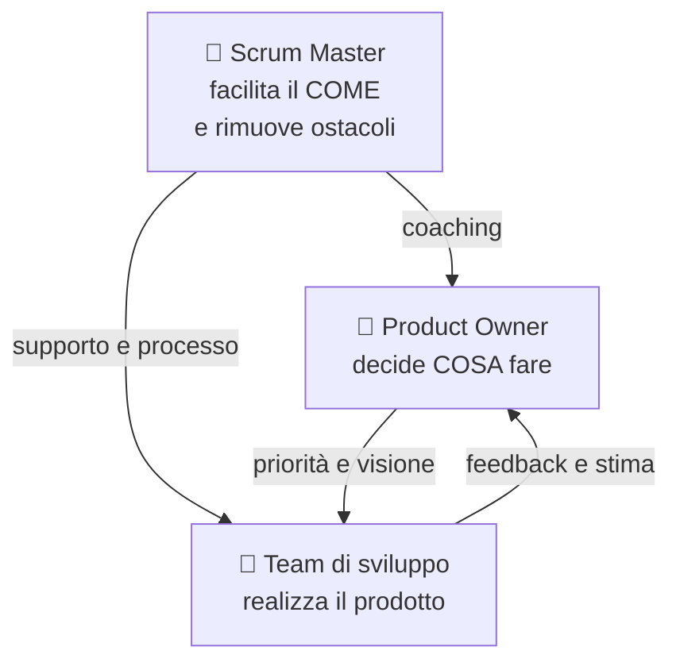
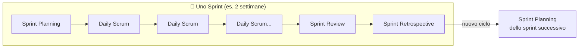
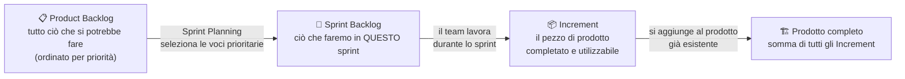

# 6. Scrum


> 📄 **[Scarica questa sezione in PDF](../../pdf/06-scrum.pdf)** — utile per la stampa o la lettura offline.


Nella sezione precedente hai scoperto l'Agile come **filosofia**: un insieme
di valori e principi (persone prima dei processi, collaborazione con il
cliente, adattamento al cambiamento, consegne frequenti). Ma una filosofia,
da sola, non ti dice cosa fare il lunedì mattina quando entri in ufficio.

Serve un **framework**, cioè un insieme di regole concrete, ruoli definiti e
riunioni con un nome e uno scopo preciso, che traduca la filosofia Agile in
pratica quotidiana. Il framework più usato al mondo per farlo si chiama
**Scrum**, ed è quello che il progetto a cui sarai affiancato utilizza (o
utilizzerà) ogni giorno.

Questa è la sezione più importante del corso per te, perché **Scrum Master**
è il ruolo che andrai a occupare. Ogni concetto che leggerai qui non è teoria
astratta: è il tuo futuro lavoro quotidiano.

> 💡 **Analogia iniziale**: se l'Agile è la filosofia "cucina leggera, con
> ingredienti freschi, adattandosi a quello che il mercato offre oggi",
> Scrum è la **ricetta strutturata** che dice esattamente quando fare la
> spesa, quanti piatti preparare, con quale squadra in cucina e quando
> assaggiare per correggere il sapore prima di servire in tavola.

## 🎯 Obiettivi della sezione

Alla fine di questa sezione saprai:

- spiegare cos'è Scrum e perché è diventato il framework Agile più diffuso;
- distinguere i tre ruoli di Scrum (Product Owner, Scrum Master, Team di
  sviluppo) e in particolare il ruolo che occuperai tu;
- descrivere i cinque eventi di Scrum (Sprint, Sprint Planning, Daily
  Scrum, Sprint Review, Sprint Retrospective): durata, partecipanti,
  obiettivo;
- distinguere i tre artefatti (Product Backlog, Sprint Backlog, Increment);
- scrivere e riconoscere una User Story;
- capire cosa sono Story Point e Velocity e perché si usano al posto delle
  ore/giorni;
- applicare i concetti di Definition of Ready e Definition of Done;
- avere un quadro concreto delle attività quotidiane di uno Scrum Master.

---

## 6.1 Cos'è Scrum e perché è ovunque

**Scrum** è un framework leggero per gestire il lavoro di sviluppo di un
prodotto in modo iterativo e incrementale. È stato formalizzato negli anni
'90 da Ken Schwaber e Jeff Sutherland (due dei firmatari del Manifesto
Agile che hai visto nella sezione precedente) e oggi è, di gran lunga, il
framework Agile più utilizzato nel mondo del software — e sempre più anche
fuori dal software (marketing, HR, persino organizzazione di eventi).

Il nome "Scrum" viene dal rugby: indica la **mischia**, la fase di gioco in
cui l'intera squadra si compatta e avanza insieme, come un blocco unico,
spingendo nella stessa direzione. Non è un caso: Scrum nasce proprio
dall'idea che un progetto complesso si affronta meglio con una squadra
compatta e auto-organizzata, piuttosto che con singoli individui che
lavorano ognuno per proprio conto secondo un piano rigido stabilito a
tavolino mesi prima.

Perché Scrum ha avuto così tanto successo? Alcuni motivi concreti:

- è **semplice da descrivere** (la Guida ufficiale a Scrum, la "Scrum
  Guide", è lunga poche decine di pagine) ma **profondo da padroneggiare**;
- fornisce una **cadenza regolare** (lo Sprint) che dà al team e agli
  stakeholder un ritmo prevedibile di consegne e verifiche;
- rende **visibile** lo stato del lavoro, riducendo le sorprese a fine
  progetto;
- si adatta bene a contesti dove i requisiti **non sono chiari al 100% fin
  dall'inizio** — che, nella pratica, è quasi sempre il caso di un progetto
  software reale.

> 💡 **Analogia**: pensa a una squadra di calcio che prepara la stagione.
> Non pianifica ogni singola azione di ogni singola partita dell'anno prima
> che inizi il campionato: pianifica una partita alla volta, si allena, gioca,
> guarda i risultati, corregge la tattica per la partita successiva. Scrum
> applica la stessa logica al lavoro di un team: pianifica "una partita alla
> volta" (lo Sprint), gioca, osserva il risultato, si adatta.

Un punto importante da ricordare: **Scrum non è un metodo per fare tutto e
subito più velocemente**. È un modo per rendere visibile e gestibile la
complessità, imparando dall'esperienza reale sprint dopo sprint, invece di
affidarsi a un piano perfetto scritto a inizio progetto che quasi certamente
si rivelerà sbagliato su qualche punto.

---

## 6.2 I tre ruoli di Scrum

Scrum definisce esattamente **tre ruoli** (nella terminologia ufficiale più
recente si chiamano "accountability", cioè "responsabilità", ma nella
pratica quotidiana si continua a parlare di ruoli). Non uno di più, non uno
di meno. Vediamoli uno per uno.



### 6.2.1 Product Owner: la voce del business

Il **Product Owner** (spesso abbreviato **PO**) è la persona responsabile
di **massimizzare il valore** del prodotto che il team sta costruendo.
In pratica, decide **cosa** il team deve realizzare e **in che ordine di
priorità**, rappresentando gli interessi del cliente, degli utenti finali e
del business.

> 💡 **Analogia**: il Product Owner è come il **capo cuoco che decide il
> menù** di un ristorante. Non è lui che cucina personalmente ogni piatto
> (questo lo fa la brigata di cucina, cioè il team di sviluppo), ma decide
> quali piatti proporre, in quale ordine introdurli nel menù, e quali
> ingredienti sono davvero prioritari da avere in cucina questa settimana.

Le responsabilità principali del Product Owner:

- gestisce e ordina per priorità il **Product Backlog** (lo vedremo tra
  poco): decide cosa viene fatto prima e cosa dopo;
- si assicura che il team capisca **perché** una funzionalità è importante,
  non solo "cosa" va costruito;
- è il punto di contatto principale con il cliente/gli stakeholder per le
  domande su requisiti e priorità;
- accetta o rifiuta il lavoro completato a fine sprint, verificando che
  soddisfi quanto richiesto.

> 📌 **Esempio pratico**: il Product Owner ha in cima al Product Backlog tre
> voci: "Aggiungere il pagamento con carta di credito", "Correggere un bug
> che blocca il login su mobile" e "Aggiungere un filtro di ricerca
> avanzata". Nella prossima Sprint Planning decide di dare priorità massima
> al bug di login (blocca utenti reali ogni giorno), poi al pagamento con
> carta (richiesto da molti clienti), lasciando il filtro di ricerca più in
> basso: non è meno utile, ma nessun cliente lo ha ancora richiesto con
> urgenza.

Un errore comune da evitare: il Product Owner **non è un manager che dà
ordini al team** su come lavorare, e non decide **come** tecnicamente
realizzare qualcosa — quella è una responsabilità del team di sviluppo. Il
PO decide le priorità di business, non l'implementazione tecnica.

### 6.2.2 Scrum Master: il facilitatore (il TUO ruolo)

Il **Scrum Master** è la persona responsabile di **far funzionare bene il
processo Scrum**: si assicura che il team capisca e applichi correttamente
la teoria, le pratiche e le regole di Scrum, e lavora attivamente per
rimuovere tutto ciò che ostacola il team.

Questo è il ruolo che tu andrai a occupare, quindi vale la pena spenderci
più tempo degli altri due.

> 💡 **Analogia**: se il Product Owner è il capo cuoco che decide il menù e
> il team di sviluppo è la brigata che cucina, lo **Scrum Master è il
> direttore di sala** — o meglio, un allenatore/coach della squadra di
> cucina. Non cucina lui i piatti, non decide il menù, ma si assicura che:
> la cucina abbia tutto il necessario per lavorare senza intoppi, che i
> tempi tra un piatto e l'altro siano rispettati, che eventuali problemi
> (un fornitore in ritardo, un forno che non funziona) vengano risolti
> rapidamente, e che la squadra migliori il proprio modo di lavorare
> service dopo service.

Punti fondamentali da capire su questo ruolo, perché generano spesso
confusione in chi inizia:

- **Lo Scrum Master non è un capo del team.** Non assegna task, non
  valuta le prestazioni individuali, non decide chi fa cosa. È un ruolo di
  **servizio**, non di autorità gerarchica.
- **Lo Scrum Master non è un Project Manager tradizionale.** Non tiene un
  piano di progetto dettagliato con scadenze imposte dall'alto, non fa
  micro-management delle attività. Il team di sviluppo si auto-organizza:
  decide da solo come distribuire il lavoro tra i suoi membri.
- **Lo Scrum Master è un servant leader** ("leader al servizio"): il suo
  potere non viene dal comandare, ma dal facilitare, proteggere e
  migliorare continuamente le condizioni di lavoro del team.

Le responsabilità concrete di uno Scrum Master, secondo la Scrum Guide,
si dividono in tre direzioni:

1. **Verso il team di sviluppo**: aiuta il team ad auto-organizzarsi, a
   restare focalizzato, a rimuovere gli impedimenti (ostacoli) che
   incontra, e facilita tutti gli eventi Scrum.
2. **Verso il Product Owner**: aiuta a gestire e comunicare in modo
   efficace il Product Backlog, aiuta a trovare tecniche per ordinare le
   priorità in modo chiaro.
3. **Verso l'organizzazione**: guida e aiuta l'azienda ad adottare Scrum
   correttamente, rimuovendo barriere organizzative che ostacolano il
   team (es. troppi meeting esterni, dipendenze non chiare da altri team,
   processi burocratici lenti).

Un impedimento (in inglese *impediment* o *blocker*) è **qualsiasi cosa che
rallenta o blocca il team**: un ambiente di test che non funziona, l'attesa
di una risposta dal cliente, un accesso non ancora concesso, un conflitto
tra due colleghi, un requisito ambiguo. Parte enorme del lavoro quotidiano
di uno Scrum Master è **individuare questi ostacoli e lavorare per
rimuoverli**, anche quando la soluzione non dipende direttamente da lui/lei
(in quel caso, il compito diventa "scalare" il problema alla persona giusta
e seguirne la risoluzione).

> 📌 **Esempio pratico**: durante il Daily Scrum, uno sviluppatore dice "sono
> bloccato da due giorni: aspetto le credenziali di accesso a un ambiente di
> test". Lo Scrum Master annota l'impedimento, non lo discute lì (per non
> allungare il daily), e subito dopo scrive al responsabile IT per
> sollecitare l'accesso, aggiornando il team il giorno seguente. Non risolve
> lui stesso il problema tecnico: si assicura che chi può risolverlo lo
> faccia in tempi rapidi.

### 6.2.3 Team di sviluppo: chi realizza il prodotto

Il **Team di sviluppo** (in inglese *Developers*, termine che nella Scrum
Guide più recente indica chiunque contribuisca a realizzare l'Increment:
programmatori, ma anche designer, tester, analisti, a seconda del contesto)
è il gruppo di persone che **trasforma le voci del Product Backlog in un
prodotto funzionante**, sprint dopo sprint.

> 💡 **Analogia**: continuando il paragone gastronomico, il team di sviluppo
> è la **brigata di cucina**: chi taglia le verdure, chi cucina la carne,
> chi impiatta. Decidono loro, internamente, come organizzarsi per
> preparare i piatti richiesti nei tempi previsti — nessuno dall'esterno gli
> dice esattamente "tu tagli la cipolla per primo, tu impiatti per
> secondo".

Caratteristiche chiave del team di sviluppo in Scrum:

- è **auto-organizzato**: decide internamente come distribuire il lavoro,
  nessuno (nemmeno lo Scrum Master) glielo impone dall'esterno;
- è **cross-funzionale**: ha, al suo interno, tutte le competenze
  necessarie per portare a termine il lavoro senza dover dipendere
  costantemente da persone esterne al team;
- è tipicamente composto da **3 a 9 persone** (indicazione tipica, non una
  regola rigida): squadre più piccole comunicano meglio, squadre troppo
  grandi diventano difficili da coordinare;
- è collettivamente responsabile della qualità del lavoro consegnato — non
  esiste "il problema è di quel singolo sviluppatore", esiste "il problema
  è del team".

> 📌 **Esempio pratico**: lo Sprint Backlog contiene una User Story che
> richiede sia lavoro di back-end che di front-end. Nessuno assegna i task
> dall'esterno: durante lo Sprint Planning i due sviluppatori competenti si
> dividono spontaneamente il lavoro ("io mi occupo dell'API, tu del
> componente grafico") e si aggiornano a vicenda nei Daily Scrum successivi,
> senza bisogno che il Product Owner o lo Scrum Master decidano chi fa
> cosa.

---

## 6.3 Gli eventi di Scrum

Scrum organizza il lavoro attorno a **cinque eventi** con una cadenza fissa
e ripetuta. Il contenitore che li racchiude tutti è lo **Sprint**.



### 6.3.1 Sprint: il contenitore di tutto

Lo **Sprint** è un periodo di tempo fisso (in inglese si dice *time-boxed*,
cioè con una durata massima non superabile) durante il quale il team lavora
per produrre un incremento di prodotto potenzialmente utilizzabile.

- **Durata tipica**: da 1 a 4 settimane, più comunemente **2 settimane**.
  La durata resta **costante** sprint dopo sprint (non si allunga "solo
  questa volta" perché il lavoro non è finito).
- **Partecipanti**: tutto il team Scrum (Product Owner, Scrum Master, Team
  di sviluppo).
- **Obiettivo**: consegnare un incremento di valore, utilizzabile e di
  qualità sufficiente, entro la fine del periodo stabilito.

> 💡 **Analogia**: lo Sprint è come una **puntata di una serie TV**: ha una
> durata fissa, racconta un pezzo di storia autoconclusivo (l'incremento di
> prodotto), e si inserisce in una stagione più ampia (il progetto). Ogni
> puntata ha un suo mini-arco narrativo (lo Sprint Goal, l'obiettivo dello
> sprint) anche se la storia complessiva continua nella puntata successiva.

Dentro ogni Sprint si svolgono, in ordine, gli altri quattro eventi: la
Sprint Planning all'inizio, i Daily Scrum ogni giorno, e la Sprint Review e
la Sprint Retrospective alla fine.

**Esempio pratico**: il progetto lavora a sprint di 2 settimane, che
iniziano sempre di lunedì. Lunedì mattina si tiene la Sprint Planning,
ogni mattina alle 9:30 il Daily Scrum, e il venerdì della seconda settimana
si tengono, in sequenza, Sprint Review e Sprint Retrospective. Il lunedì
successivo inizia già il nuovo sprint.

### 6.3.2 Sprint Planning: cosa faremo in questo sprint

La **Sprint Planning** è la riunione che apre ogni Sprint, in cui il team
decide **cosa** verrà realizzato nello sprint e, a grandi linee, **come**.

- **Durata tipica**: per uno sprint di 2 settimane, circa **2-4 ore**
  (in generale, si stima circa un'ora per ogni settimana di durata dello
  sprint).
- **Partecipanti**: tutto il team Scrum.
- **Obiettivo**: selezionare le voci più prioritarie del Product Backlog
  che il team ritiene di poter completare nello sprint, e definire lo
  **Sprint Goal** (l'obiettivo/tema principale dello sprint, in una frase).

**Come si svolge in pratica**: il Product Owner presenta le voci più in
alto nel Product Backlog (quelle a maggiore priorità) e spiega il "perché"
di ciascuna. Il team di sviluppo discute, fa domande, e stima quante di
quelle voci può realisticamente completare nello sprint, sulla base della
propria capacità (spesso guidata dalla Velocity, che vedremo più avanti).
Il risultato finale è lo **Sprint Backlog**: l'elenco delle voci scelte per
questo sprint, spesso scomposte in task più piccoli e operativi.

> 💡 **Analogia**: è come la riunione della squadra prima della partita in
> cui l'allenatore, insieme ai giocatori, decide la formazione e la
> tattica di gioco per la partita di questa settimana — non per tutto il
> campionato, solo per la prossima partita.

> 📌 **Esempio pratico**: il team ha una Velocity media di 25 punti. In
> Sprint Planning, il Product Owner presenta le prime 6 voci del Product
> Backlog (che valgono, in totale, 34 punti). Dopo discussione, il team si
> accorge che l'ultima voce (8 punti) è troppo rischiosa da completare
> insieme alle altre e la rimanda al prossimo sprint, portando l'impegno
> totale a 26 punti — vicino alla propria Velocity storica. Lo Sprint Goal
> che ne esce è: "Permettere ai clienti di completare un ordine dall'inizio
> alla fine, incluso il pagamento".

### 6.3.3 Daily Scrum: il check-in quotidiano

Il **Daily Scrum** (spesso chiamato semplicemente "il daily" o "lo
stand-up") è una breve riunione quotidiana in cui il team di sviluppo
sincronizza il proprio lavoro e pianifica le prossime 24 ore.

- **Durata tipica**: **massimo 15 minuti**, sempre alla stessa ora e nello
  stesso luogo (fisico o virtuale) per creare abitudine e ridurre attrito.
- **Partecipanti**: principalmente il team di sviluppo. Lo Scrum Master di
  solito partecipa per facilitare (soprattutto nelle prime fasi di vita di
  un team) ma non è tenuto a "guidare" la riunione: idealmente è il team a
  auto-gestirla. Il Product Owner può partecipare, ma non è obbligatorio.
- **Obiettivo**: ispezionare l'avanzamento verso lo Sprint Goal e adattare
  il piano di lavoro dei giorni successivi.

**Come si svolge in pratica**: un formato molto diffuso (anche se non è
l'unico previsto) è che ogni persona risponda brevemente a tre domande:
"cosa ho fatto ieri per lo Sprint Goal?", "cosa farò oggi?", "ci sono
ostacoli che mi bloccano?". Se emerge un impedimento (es. "sono bloccato,
aspetto una risposta dal reparto sicurezza"), **non si discute la
soluzione durante il daily** (per non farlo diventare una riunione lunga):
si segna, e se ne parla subito dopo, in un incontro più ristretto — spesso
è esattamente qui che entra in gioco lo Scrum Master, per farsi carico di
seguire e risolvere quell'ostacolo.

> 📌 **Esempio pratico** — un mini Daily Scrum:
>
> - **Marco**: "Ieri ho finito l'endpoint di login. Oggi lavoro sui test
>   automatici. Nessun blocco."
> - **Giulia**: "Ieri ho lavorato sulla pagina del profilo utente. Oggi
>   continuo, ma sono bloccata: aspetto l'accesso all'ambiente di test da
>   ieri."
> - **Ahmed**: "Ieri ho aiutato Giulia a capire un errore di
>   configurazione. Oggi riprendo la User Story sul carrello."
>
> Tutto il daily dura meno di 10 minuti. Il blocco di Giulia viene segnato
> dallo Scrum Master, che se ne occupa subito dopo, fuori dal daily.

> 💡 **Analogia**: è come il **check-in veloce dello spogliatoio a metà
> allenamento**: non si riprogetta la tattica da zero ogni giorno, ci si
> aggiorna velocemente su chi ha un problema (un infortunio, una difficoltà)
> e si aggiusta la rotta per il resto della sessione.

### 6.3.4 Sprint Review: cosa abbiamo costruito

La **Sprint Review** è la riunione di chiusura in cui il team mostra il
lavoro realizzato durante lo sprint e raccoglie feedback.

- **Durata tipica**: per uno sprint di 2 settimane, circa **1-2 ore**
  (proporzionale alla durata dello sprint, come la Planning).
- **Partecipanti**: tutto il team Scrum, più — ed è importante — gli
  **stakeholder** invitati: il cliente, altri reparti, chiunque abbia
  interesse a vedere l'avanzamento del prodotto.
- **Obiettivo**: ispezionare l'incremento realizzato, discutere cosa è
  cambiato nel contesto (mercato, priorità, vincoli) e adattare il Product
  Backlog di conseguenza.

**Come si svolge in pratica**: il team fa una **demo dal vivo** di ciò che
ha realizzato (non slide che descrivono il lavoro: il prodotto funzionante,
mostrato in azione). Gli stakeholder fanno domande, danno feedback, a volte
propongono nuove idee o cambi di priorità. Il Product Owner tiene traccia
di tutto questo per aggiornare il Product Backlog.

> 💡 **Analogia**: è come l'**assaggio finale prima di servire il piatto ai
> clienti del ristorante**: la cucina porta il piatto (l'incremento) al
> tavolo dei giudici (gli stakeholder), che lo assaggiano, commentano, e
> magari chiedono "la prossima volta, un po' meno piccante" — feedback che
> entra direttamente nel menù (Product Backlog) della prossima settimana.

> 📌 **Esempio pratico**: il team mostra dal vivo, sull'ambiente di test, il
> nuovo flusso di checkout appena completato: uno sviluppatore inserisce un
> ordine di prova davanti a tutti, mostrando ogni passaggio fino alla
> conferma. Uno stakeholder nota che manca un messaggio di errore chiaro se
> la carta di credito viene rifiutata: il Product Owner annota la richiesta
> e la aggiunge, come nuova voce, al Product Backlog per una prossima
> Sprint Planning.

Un errore comune da evitare come Scrum Master: la Sprint Review **non è
una presentazione formale con slide** preparata a parte. È una demo pratica
e informale del prodotto, pensata per generare conversazione e feedback
reale, non per "fare bella figura".

### 6.3.5 Sprint Retrospective: come possiamo lavorare meglio

La **Sprint Retrospective** (spesso chiamata solo "retro") è l'ultimo
evento dello sprint: il momento in cui il team riflette su **come** ha
lavorato (non su cosa ha costruito, quello è già stato discusso nella
Review) per trovare modi di migliorare nel prossimo sprint.

- **Durata tipica**: per uno sprint di 2 settimane, circa **1-1,5 ore**.
- **Partecipanti**: solo il team Scrum (Product Owner, Scrum Master, team
  di sviluppo) — niente stakeholder esterni, per permettere un dialogo
  aperto e sincero.
- **Obiettivo**: identificare cosa ha funzionato bene, cosa no, e definire
  **almeno un'azione concreta di miglioramento** da provare nel prossimo
  sprint.

**Come si svolge in pratica**: esistono decine di formati per condurre una
retrospettiva, ma uno dei più semplici e diffusi si chiama "Start / Stop /
Continue": ogni persona scrive su dei post-it (fisici o su una lavagna
digitale) cosa il team dovrebbe **iniziare** a fare, cosa dovrebbe
**smettere** di fare, e cosa dovrebbe **continuare** a fare così com'è. Si
raggruppano le idee simili, si discutono le più votate, e si scelgono 1-2
azioni concrete da provare nel prossimo sprint (non 15 azioni: meglio poche
e realizzabili).

> 💡 **Analogia**: è la **riunione tecnica dello staff dopo la partita**,
> a bocce ferme: non si riguarda solo il punteggio finale, si analizza
> come si è giocato, cosa ha funzionato nello schema tattico e cosa va
> corretto per la partita successiva. È il momento in cui una squadra
> migliora davvero nel tempo, partita dopo partita.

> 📌 **Esempio pratico** — risultato di una retrospettiva con il formato
> Start/Stop/Continue:
>
> - **Start** (iniziare a fare): scrivere una breve nota nella descrizione
>   di ogni Pull Request per spiegare "perché", non solo "cosa" cambia.
> - **Stop** (smettere di fare): accettare nuove richieste urgenti a metà
>   sprint senza discuterne prima con il Product Owner.
> - **Continue** (continuare a fare): il pairing tra un developer senior e
>   uno junior sulle User Story più complesse, che ha ridotto gli errori
>   nell'ultimo sprint.
>
> Il team vota le idee più sentite e sceglie una sola azione concreta da
> provare nel prossimo sprint: introdurre la nota "perché" nelle Pull
> Request.

Facilitare bene la Retrospective è una delle competenze più importanti di
uno Scrum Master: è il principale motore del **miglioramento continuo**
del team, uno dei pilastri di Scrum e dell'Agile in generale.

---

## 6.4 Gli artefatti di Scrum

Scrum definisce anche **tre artefatti**: elementi tangibili (documenti,
liste, prodotti) che rappresentano lavoro o valore, e che rendono
trasparente lo stato del progetto a chiunque li guardi.



### 6.4.1 Product Backlog: la lista completa dei desideri

Il **Product Backlog** è l'elenco completo, ordinato per priorità, di
**tutto ciò che potrebbe servire al prodotto**: nuove funzionalità,
modifiche, correzioni di bug, miglioramenti tecnici. È di proprietà e
responsabilità del **Product Owner**.

> 💡 **Analogia**: è la **lista della spesa generale di casa**, quella che
> tieni sul frigorifero e continui ad aggiornare: non compri tutto oggi,
> ma sai cosa ti serve, in ordine di urgenza (il latte è finito, serve
> subito; le tovagliette nuove possono aspettare).

> 📌 **Esempio pratico**: il Product Backlog di un progetto e-commerce
> potrebbe contenere, tra le tante voci: "Come cliente, voglio salvare più
> indirizzi di spedizione" (priorità alta, già stimata), "Come cliente,
> voglio ricevere una notifica quando il mio ordine è spedito" (priorità
> media), "Come amministratore, voglio esportare un report vendite
> mensile" (priorità bassa, ancora da approfondire). Le prime sono in cima
> e ben dettagliate, l'ultima è più in basso e resta volutamente vaga per
> ora.

Caratteristiche importanti del Product Backlog:

- è **vivo e mai completamente finito**: si aggiornano ed evolve
  continuamente, man mano che si scopre di più sul prodotto, sul mercato,
  sui bisogni degli utenti;
- è **ordinato per priorità**: le voci più importanti (quelle che il team
  affronterà prima) stanno in alto;
- le voci in alto sono di solito più **dettagliate e "pronte"** (ne
  parliamo con la Definition of Ready), mentre quelle in basso possono
  restare vaghe finché non si avvicina il momento di affrontarle — non ha
  senso dettagliare oggi qualcosa che verrà realizzato forse tra sei mesi
  e potrebbe cambiare completamente nel frattempo.

Le voci del Product Backlog sono tipicamente scritte in formato **User
Story** (le vediamo nel prossimo paragrafo).

### 6.4.2 Sprint Backlog: il piano di questo sprint

Lo **Sprint Backlog** è il sottoinsieme di voci del Product Backlog che il
team ha scelto di realizzare **in questo sprint**, insieme al piano per
realizzarle (spesso scomposte in task operativi più piccoli) e allo Sprint
Goal.

> 💡 **Analogia**: se il Product Backlog è la lista della spesa generale di
> casa, lo Sprint Backlog è la **lista della spesa di oggi**: hai scelto
> cosa comprare in questo giro, in base a quanto tempo e quanti soldi hai
> disponibili adesso.

> 📌 **Esempio pratico** — uno Sprint Backlog reale potrebbe contenere:
>
> 1. Come cliente, voglio salvare più indirizzi di spedizione nel mio
>    profilo (5 punti) — task: creare tabella database, endpoint API,
>    interfaccia utente.
> 2. Come cliente, voglio ricevere una email di conferma dopo l'acquisto
>    (3 punti) — task: template email, integrazione con servizio di invio.
> 3. Correggere il bug che duplica il prodotto nel carrello in alcuni casi
>    (2 punti) — task: riprodurre il bug, correggere, scrivere test di
>    regressione.
> 4. Come amministratore, voglio poter disattivare temporaneamente un
>    prodotto dal catalogo (3 punti) — task: nuovo campo nel database,
>    pulsante in interfaccia admin.
>
> Totale: 13 punti, coerente con la Velocity del team in quello sprint.

Di proprietà del **team di sviluppo** (non del Product Owner): è il team
che decide come organizzare il lavoro dentro lo sprint, ed è il team che
può aggiornarlo giorno per giorno (ad esempio aggiungendo un task che si
scopre necessario durante lo sprint) — sempre restando fedele allo Sprint
Goal stabilito in Planning.

### 6.4.3 Increment: il pezzo di prodotto realmente costruito

L'**Increment** è il pezzo di prodotto realmente completato durante lo
sprint: funzionante, testato, e — questo è il punto chiave — **conforme
alla Definition of Done** del team (ne parliamo tra poco).

> 💡 **Analogia**: se il prodotto finale è una casa, ogni Increment è una
> stanza completamente finita e abitabile — non un muro a metà con i cavi
> elettrici scoperti. Ogni stanza che si aggiunge deve poter essere già
> vissuta, anche se la casa nel complesso non è ancora finita.

> 📌 **Esempio pratico**: a fine sprint, la funzionalità "salvataggio di più
> indirizzi di spedizione" è conforme alla Definition of Done: codice
> scritto e revisionato, test automatici che passano, verificata
> manualmente, distribuita in ambiente di test. Questo pezzo di prodotto è
> l'Increment di quello sprint — anche se il Product Owner decide di non
> rilasciarlo subito agli utenti finali, aspettando di raggrupparlo con
> altre due funzionalità nella prossima release.

Ogni Increment si somma a tutti quelli realizzati negli sprint precedenti,
costruendo progressivamente il prodotto completo. Un punto fondamentale:
un Increment deve essere **potenzialmente utilizzabile**, anche se il
Product Owner alla fine decide di non rilasciarlo subito agli utenti finali
(magari perché si preferisce raggrupparlo con altre funzionalità in
un'unica release). "Potenzialmente utilizzabile" significa che, dal punto
di vista tecnico e qualitativo, **sarebbe già pronto per andare in
produzione**.

---

## 6.5 User Story: come si descrive un requisito in Scrum

Una **User Story** (letteralmente "storia dell'utente") è il formato più
comune per descrivere una voce del Product Backlog, scritta dal punto di
vista di chi utilizzerà quella funzionalità.

Il formato standard è:

> **Come** [tipo di utente/ruolo], **voglio** [azione/funzionalità],
> **per** [beneficio/motivo].

**Esempio concreto**:

> Come **cliente che sta effettuando un acquisto online**, voglio **poter
> salvare più indirizzi di spedizione nel mio profilo**, per **non dover
> reinserire l'indirizzo ogni volta che effettuo un nuovo ordine**.

Perché questo formato è così efficace ed è diventato uno standard:

- costringe a chiarire **chi** beneficia della funzionalità (non è la
  stessa cosa scrivere una funzionalità per un amministratore o per un
  cliente finale);
- costringe a esplicitare **il beneficio**, cioè il "perché" — che aiuta
  tutto il team a capire il valore reale, non solo il compito tecnico da
  eseguire, e permette anche soluzioni alternative se emergono durante lo
  sviluppo;
- è **breve e leggibile da chiunque**, anche da chi non ha background
  tecnico (perfetto per un contesto come il tuo).

Una User Story, di per sé, non è ancora sufficientemente dettagliata per
essere sviluppata: quasi sempre si accompagna a **criteri di accettazione**
(condizioni precise che permettono di verificare se la storia è stata
implementata correttamente). Per la storia sopra, un criterio di
accettazione potrebbe essere: *"Il cliente può salvare fino a 5 indirizzi
diversi; al momento del checkout può selezionare uno degli indirizzi salvati
da un menu a tendina."*

Le User Story più grandi vengono spesso raggruppate in **Epic** (storie
troppo grandi per essere completate in un solo sprint, che vanno scomposte
in User Story più piccole prima di poter entrare in uno sprint).

---

## 6.6 Story Point: stimare senza usare ore o giorni

Un **Story Point** è un'unità di misura **relativa** che il team usa per
stimare quanto "sforzo complessivo" richiede realizzare una User Story,
combinando insieme complessità, quantità di lavoro e incertezza/rischio.

Il punto fondamentale da capire — e su cui i neofiti si confondono spesso
— è: **i Story Point non sono ore o giorni**. Non esiste una formula fissa
del tipo "1 Story Point = 4 ore". Sono un numero **relativo**: dicono
"questa storia è più grande/complessa di quest'altra", non "questa storia
richiederà esattamente questo tempo".

> 💡 **Analogia**: pensa a come stimeresti la difficoltà di alcune scalate
> in montagna, senza sapere esattamente quanto tempo impiegherai (dipende
> dal meteo, dalla forma del giorno, da imprevisti): diresti "questa è una
> scalata facile", "questa è medio-difficile", "questa è molto impegnativa
> e rischiosa". Non stai dando un tempo in ore, stai dando una valutazione
> relativa di sforzo e difficoltà — ed è più facile e più affidabile
> essere d'accordo su "questa è più difficile di quella" che sul tempo
> esatto in minuti.

Perché il team preferisce i Story Point alle ore/giorni?

- **Le persone sono pessime a stimare il tempo assoluto** (quante volte
  hai stimato "questo esercizio mi prende 2 ore" e ne ha richieste 5?), ma
  sono molto più brave a **confrontare due cose** e dire quale è più
  grande;
- i Story Point si "liberano" dalla velocità specifica di ciascuna
  persona: una stima in ore cambia da persona a persona (un
  sviluppatore esperto ci mette 2 ore, un junior magari 6), mentre una
  stima in punti descrive la complessità del problema, indipendentemente
  da chi lo risolverà;
- riducono la falsa precisione: dire "questa storia vale 5 punti" comunica
  onestamente il livello di incertezza, mentre dire "questa storia richiede
  esattamente 13 ore" dà una falsa sensazione di precisione che quasi mai
  si rivela vera.

Per stimare, molti team usano la **sequenza di Fibonacci** (o una sua
versione semplificata): **1, 2, 3, 5, 8, 13, 21...** I numeri crescono
sempre più distanziati tra loro apposta: più una storia è grande, più
diventa difficile essere precisi, quindi ha senso avere "scalini" più
larghi (la differenza tra una storia da 1 e una da 2 punti deve essere
chiara e netta, così come la differenza tra una da 13 e una da 21).

**Esempio pratico di sessione di stima** (tecnica molto diffusa chiamata
*Planning Poker*): il team si riunisce, il Product Owner presenta una User
Story, ogni membro del team di sviluppo scieglie in privato una carta con
un numero della sequenza di Fibonacci che rappresenta la propria stima,
poi tutti scoprono le carte insieme. Se le stime sono simili (es. 5 e 8),
si prende una media o si discute brevemente e si converge. Se sono molto
diverse (es. 2 e 21), è un segnale che le persone stanno immaginando
scenari diversi: si discute finché non emerge un'intesa comune, e spesso
proprio questa discussione fa emergere dettagli o rischi nascosti nella
storia — che è, in realtà, uno dei benefici più grandi di questa tecnica,
al di là del numero finale.

Una User Story troppo grande per essere stimata con sicurezza (es. "vale
tra 40 e 100 punti, non sappiamo") è quasi sempre un segnale che va
**scomposta** in storie più piccole prima di poter entrare in uno sprint.

---

## 6.7 Velocity: quanto il team riesce a fare in uno sprint

La **Velocity** (velocità) è il numero medio di Story Point che un team
completa in uno sprint, calcolato osservando gli sprint passati.

**Esempio concreto**: se negli ultimi 4 sprint il team ha completato
rispettivamente 23, 27, 25 e 29 Story Point, la sua Velocity media è
attorno a **26 punti a sprint** (`(23+27+25+29)/4 = 26`).

> 💡 **Analogia**: è come il **ritmo medio di una maratona**: se sai che in
> allenamento riesci a coprire in media 10 km all'ora, puoi stimare con
> ragionevole affidabilità quanto tempo ti servirà per completare i 42 km
> della maratona — non con precisione assoluta (dipende dal giorno, dal
> meteo, dalla forma), ma con una stima utile per pianificare.

Perché la Velocity è utile, soprattutto per un ruolo come il tuo che dovrà
poi parlare anche di pianificazione con il team e gli stakeholder:

- permette di fare **previsioni realistiche**: se il Product Backlog
  rimanente vale circa 200 punti e la Velocity media è 26 punti a sprint,
  ci si può aspettare che il lavoro richieda circa 8 sprint (`200/26 ≈
  7,7`), un'informazione preziosa per rispondere alla classica domanda
  del cliente "quando sarà pronto?";
- aiuta il team, durante la Sprint Planning, a non caricarsi di troppo
  lavoro in uno sprint (un errore molto comune nei team giovani): se la
  Velocity media è 26, pianificare uno sprint da 45 punti è un campanello
  d'allarme;
- diventa più stabile e affidabile nel tempo, man mano che il team accumula
  storia di sprint passati — nei primi sprint di un team nuovo è normale
  che la Velocity sia molto variabile.

Un avvertimento importante da Scrum Master: **la Velocity non va mai usata
per confrontare team diversi** ("il team A fa 40 punti, il team B solo 20,
quindi il team A lavora meglio") né come metrica di performance individuale.
I Story Point sono relativi e specifici di ogni singolo team: un punto per
il team A non equivale a un punto per il team B, perché ogni team ha una
propria scala interna di riferimento. Usare la Velocity per confrontare
team, o peggio persone, è uno degli errori più dannosi che si possano fare
con questa metrica, e può spingere i team a "gonfiare" artificialmente le
stime — proteggere il team da questo uso scorretto della metrica è
anch'esso un compito dello Scrum Master.

---

## 6.8 Definition of Ready: quando una storia può entrare in sprint

La **Definition of Ready** (DoR) è un elenco di criteri condivisi dal team
che una User Story deve soddisfare **prima** di poter essere selezionata
in una Sprint Planning ed entrare in uno sprint.

> 💡 **Analogia**: è come il controllo dei documenti all'imbarco di un
> aereo: prima di salire a bordo (entrare nello sprint), il biglietto deve
> avere tutte le informazioni corrette, il documento d'identità deve essere
> valido, il bagaglio deve rispettare le regole. Se manca qualcosa, non
> sali a bordo — non perché il viaggio non sia importante, ma perché
> partire senza tutto il necessario crea problemi a metà volo.

Esempi tipici di criteri di Definition of Ready (variano da team a team,
ma un insieme comune potrebbe essere):

- la User Story è scritta secondo il formato standard (Come/Voglio/Per) ed
  è comprensibile a tutto il team;
- ha criteri di accettazione chiari e verificabili;
- è stata stimata dal team (ha un valore in Story Point);
- le eventuali dipendenze da altri team o sistemi esterni sono note e
  gestibili;
- è sufficientemente piccola da poter essere completata in un singolo
  sprint.

> 📌 **Esempio pratico**: la User Story "Come cliente, voglio pagare con
> carta di credito" arriva in Sprint Planning ma il team si accorge che non
> ha ancora criteri di accettazione chiari (cosa succede se la carta viene
> rifiutata? quali carte sono supportate?) né una stima. Non soddisfa la
> Definition of Ready: resta nel Product Backlog, il Product Owner la
> raffina con il team in una sessione di refinement, e potrà entrare in uno
> sprint successivo, quando sarà davvero "pronta".

Perché la Definition of Ready è utile: evita che il team scopra, a metà
sprint, che una storia era troppo ambigua per essere realizzata bene,
causando ritardi, rilavorazioni o discussioni infinite proprio quando
ormai il tempo dello sprint è già stato impegnato. È molto meglio scoprire
l'ambiguità **prima** che la storia entri nello sprint.

---

## 6.9 Definition of Done: quando una storia è davvero completata

La **Definition of Done** (DoD) è un elenco di criteri condivisi dal team
che stabilisce quando un pezzo di lavoro (una User Story, e più in
generale l'Increment) può essere considerato **realmente completato** — e
non solo "quasi finito" o "finito sulla carta".

> 💡 **Analogia**: è come la checklist di un pilota prima del decollo: non
> basta che l'aereo "sembri" pronto a occhio. Ci sono controlli precisi e
> non negoziabili (carburante, strumentazione, comunicazioni) che devono
> essere tutti spuntati prima di poter dire davvero "pronti al decollo".
> Saltare un controllo perché "abbiamo fretta" è esattamente il tipo di
> scorciatoia che, prima o poi, si paga cara.

Esempi tipici di criteri di Definition of Done (di nuovo, variano da team
a team e spesso si arricchiscono nel tempo):

- il codice è stato scritto e sottoposto a code review (vedi la sezione
  su Git e GitHub — spesso corrisponde a una Pull Request approvata);
- i test automatici sono stati scritti e passano;
- la funzionalità è stata verificata manualmente secondo i criteri di
  accettazione della User Story;
- la documentazione (se necessaria) è stata aggiornata;
- il codice è stato distribuito almeno in un ambiente di test/staging;
- non introduce bug noti bloccanti.

> 📌 **Esempio pratico** — la Definition of Done applicata alla User Story
> "Come cliente, voglio salvare più indirizzi di spedizione":
>
> - [x] Codice scritto e Pull Request approvata da almeno un altro
>   developer
> - [x] Test automatici scritti e superati con successo
> - [x] Funzionalità verificata manualmente rispetto ai criteri di
>   accettazione (salvare fino a 5 indirizzi, selezionarne uno al
>   checkout)
> - [x] Distribuita con successo in ambiente di test
> - [ ] Nessun bug bloccante noto
>
> Se anche un solo punto non è spuntato, la storia **non** può essere
> considerata completata: resta "in corso" fino a che tutti i controlli
> non sono superati.

Perché la Definition of Done è cruciale, e perché sarà una delle tue
responsabilità quotidiane più importanti come Scrum Master: senza una DoD
condivisa e rispettata, il team rischia di accumulare **debito tecnico
nascosto** — storie segnate come "fatte" che in realtà mancano di test, di
qualità, di rifiniture. Questo debito, prima o poi, esplode: bug in
produzione, funzionalità che si rompono al primo cambiamento, sfiducia da
parte del cliente. Uno dei compiti meno visibili ma più importanti dello
Scrum Master è proprio **vigilare che il team non "bari" sulla Definition
of Done** solo per dichiarare più storie completate in fretta.

### Definition of Ready vs. Definition of Done: non confonderle

| | Definition of Ready | Definition of Done |
|---|---|---|
| **Quando si applica** | Prima che una storia entri in sprint | Prima che una storia si consideri completata |
| **Risponde alla domanda** | "Siamo pronti a iniziare a lavorarci?" | "Abbiamo davvero finito di lavorarci?" |
| **Se non soddisfatta** | La storia resta nel Product Backlog, non entra in sprint | La storia resta "in corso", non si conta come completata |

---

## 6.10 Il flusso completo, in sintesi

Per fissare le idee, ecco come tutti i pezzi visti finora si incastrano
insieme in un ciclo che si ripete sprint dopo sprint:

```mermaid
flowchart TD
    A["Product Backlog<br/>(gestito dal Product Owner)"] -->|Sprint Planning:<br/>selezione voci pronte<br/>(Definition of Ready)| B["Sprint Backlog<br/>+ Sprint Goal"]
    B -->|il team lavora<br/>sprint (Daily Scrum ogni giorno)| C["Lavoro in corso"]
    C -->|verifica rispetto a<br/>Definition of Done| D["Increment<br/>completato e utilizzabile"]
    D -->|Sprint Review:<br/>demo e feedback stakeholder| E["Feedback e nuove priorità"]
    E -->|aggiorna| A
    D -->|Sprint Retrospective:<br/>miglioramento del processo| F["Azioni di miglioramento<br/>per il prossimo sprint"]
    F -.->|influenzano il modo<br/>di lavorare| B
```

---

## 6.11 Il ruolo dello Scrum Master nella pratica quotidiana

Chiudiamo la sezione con la parte più concreta per te: **cosa farai
davvero**, ogni settimana, una volta preso in mano questo ruolo. Ecco un
elenco realistico di attività quotidiane e ricorrenti:

- **Facilitare gli eventi Scrum**: preparare e condurre Sprint Planning,
  Daily Scrum, Sprint Review e Sprint Retrospective, assicurandoti che
  abbiano uno scopo chiaro, rispettino i tempi previsti (*time-box*) e
  producano risultati concreti (non "riunioni per riunioni").
- **Tracciare e seguire gli impedimenti**: mantenere una lista visibile
  degli ostacoli segnalati dal team (spesso emergono proprio nel Daily
  Scrum), capire chi può risolverli, seguirli fino alla chiusura, e
  segnalare a manager o altri reparti quelli che richiedono un intervento
  esterno al team.
- **Aggiornare e mantenere leggibile la board del team** (fisica o
  digitale, es. su Azure DevOps o Jira): verificare che lo stato delle
  User Story rifletta la realtà, che nulla resti "bloccato" senza che
  nessuno se ne accorga, che la board comunichi a colpo d'occhio lo stato
  reale del lavoro.
- **Vigilare sulla Definition of Done**: aiutare il team a non
  "accontentarsi" e a non dichiarare completato ciò che, in realtà, manca
  di qualche passaggio essenziale (test, review, documentazione).
- **Aiutare il Product Owner a preparare un Product Backlog "pronto"**:
  facilitare sessioni di raffinamento (*refinement*) del backlog, in cui
  le storie in alto vengono discusse, chiarite e stimate, così da essere
  pronte per la prossima Planning (Definition of Ready).
- **Proteggere il focus del team**: schermare il team da richieste esterne
  non pianificate, riunioni superflue, interruzioni che minano la
  concentrazione durante lo sprint — senza isolare il team dal mondo, ma
  facendo da filtro intelligente.
- **Monitorare metriche utili** (Velocity, numero di storie completate,
  eventuali "burndown chart" che mostrano l'avanzamento giorno per giorno
  dentro lo sprint), non per giudicare le persone, ma per aiutare il team a
  capire il proprio ritmo e migliorare le previsioni.
- **Coaching del team sull'Agile mindset**: aiutare, nel tempo, il team a
  interiorizzare i principi Agile visti nella sezione precedente, non solo
  a "eseguire" meccanicamente i rituali di Scrum.
- **Curare la comunicazione con gli stakeholder**: preparare, insieme al
  Product Owner, aggiornamenti chiari sull'avanzamento del progetto per il
  cliente e per il management, spesso appoggiandosi a strumenti come
  quelli che vedrai nella sezione sul Project Management.
- **Migliorare continuamente il processo del team**: dare seguito
  concreto alle azioni decise nelle Retrospective, verificando negli
  sprint successivi se hanno davvero funzionato, e aggiustando se non è
  così.

Un consiglio pratico per iniziare: nei primi sprint che seguirai, il tuo
obiettivo principale non è "cambiare tutto e ottimizzare subito". È
**osservare, capire le dinamiche reali del team** (chi si blocca spesso su
cosa, quali riunioni funzionano e quali sono percepite come inutili, dove
nascono davvero gli impedimenti) e solo dopo iniziare a proporre piccoli
miglioramenti, uno alla volta — esattamente come farebbe il team stesso in
una Retrospective ben condotta.

---

## 📝 Esercizi pratici

Gli esercizi seguenti servono a consolidare quanto visto in questa sezione
con qualcosa che puoi davvero fare, non solo leggere. Non serve un progetto
reale per farli: puoi usare scenari immaginari, e diversi da quelli
già proposti nel piano di studio (sezione 17) — qui l'obiettivo è
approfondire con più dettaglio, proprio perché questa è la sezione più
importante del corso per il tuo ruolo.

1. **Scrivi 3 User Story** per un'ipotetica app di noleggio di biciclette
   in condivisione (bike sharing), seguendo il formato Come/Voglio/Per, e
   aggiungi almeno un criterio di accettazione per ciascuna.
   ✅ **Come verificare**: ogni storia indica chiaramente un tipo di
   utente (non "come utente" generico, ma es. "come cliente che deve
   sbloccare una bici"), un beneficio concreto (non solo un'azione
   tecnica), e almeno un criterio di accettazione scritto in modo
   specifico e verificabile (non "deve funzionare bene").

2. **Simula una sessione di Planning Poker** con 2-3 colleghi, amici o
   familiari (non serve che siano tecnici): scegli 5 attività quotidiane
   non lavorative (es. "cucinare la cena per 6 persone", "organizzare una
   festa a sorpresa", "traslocare in una nuova casa") e stimale con la
   sequenza di Fibonacci (1, 2, 3, 5, 8, 13, 21), scoprendo le carte
   insieme e discutendo le differenze.
   ✅ **Come verificare**: hai almeno un caso in cui le stime iniziali
   erano molto diverse tra loro (es. 2 contro 13) e la discussione
   successiva ha fatto emergere un motivo concreto della differenza (non
   solo "abbiamo scelto un numero a caso").

3. **Costruisci uno Sprint Backlog di esempio**: immagina un team con
   Velocity media di 20 punti e uno sprint di 2 settimane. Scegli 4-5 User
   Story (puoi riusare quelle scritte nell'esercizio 1 o inventarne altre),
   assegna a ciascuna una stima in punti, e scrivi anche uno Sprint Goal in
   una sola frase.
   ✅ **Come verificare**: il totale dei punti scelti è vicino alla
   Velocity indicata (né troppo sopra né troppo sotto, es. tra 17 e 22
   punti), e lo Sprint Goal riassume in una frase il "tema" comune delle
   storie scelte, non un semplice elenco.

4. **Calcola una Velocity media**: un team fittizio ha completato, negli
   ultimi 5 sprint, rispettivamente 18, 22, 19, 24 e 21 Story Point. Usa
   questo numero per stimare quanti sprint servirebbero per completare un
   Product Backlog residuo di 150 punti.
   ✅ **Come verificare**: la Velocity media calcolata è 20,8 punti
   (arrotondabile a 21), e la stima è di circa 150/21 ≈ 7 sprint.

5. **Conduci una mini-retrospettiva** di circa 20 minuti con colleghi,
   amici o familiari su un'attività di gruppo recente qualsiasi (non
   lavorativa: un viaggio organizzato insieme, un progetto universitario di
   gruppo, l'organizzazione di un evento), usando il formato Start / Stop /
   Continue, e scegli una sola azione di miglioramento concreta da provare
   la prossima volta.
   ✅ **Come verificare**: alla fine hai una sola azione scritta, concreta
   e verificabile (non "comunicare meglio", ma qualcosa come "condividere
   l'itinerario su un documento condiviso almeno 3 giorni prima").

6. **Scrivi una Definition of Done di 5 punti** per un'attività non
   informatica (es. "organizzare una cena per 10 persone" o "preparare la
   presentazione per il primo giorno di lavoro"), poi verifica a fine
   attività quali punti hai davvero rispettato.
   ✅ **Come verificare**: la tua DoD ha esattamente 5 criteri verificabili
   con un sì/no (non vaghi come "tutto ok"), e a lavoro concluso sei in
   grado di dire con certezza quali hai soddisfatto e quali no.

7. **Ricostruisci un impedimento reale**: chiedi alla tua collega Scrum
   Master/PM di raccontarti un impedimento gestito di recente nel progetto
   (chi lo ha segnalato, in quale evento è emerso, chi lo ha risolto e in
   quanto tempo). Poi scrivi in 5 righe come ti saresti comportato tu, da
   Scrum Master, in quella stessa situazione.
   ✅ **Come verificare**: la tua ricostruzione indica chiaramente in
   quale evento Scrum è emerso l'impedimento (quasi sempre il Daily Scrum)
   e chi, concretamente, ha agito per rimuoverlo — non solo "il problema
   si è risolto da sé".

---

## 🔗 Collegamenti

- [7. Kanban](../07-kanban/README.md) — un altro framework Agile, spesso complementare o alternativo a Scrum
- [8. Project Management](../08-project-management/README.md) — come gli strumenti di gestione progetto si integrano con la pratica quotidiana di uno Scrum Master
- [16. Glossario](../16-glossario/README.md) — per ripassare velocemente i termini di questa sezione

## 📚 Risorse

- [Scrum Guide ufficiale (scrumguides.org)](https://scrumguides.org/)
- [Scrum.org — What is Scrum?](https://www.scrum.org/resources/what-is-scrum)
- [Atlassian — Agile Coach: cos'è Scrum](https://www.atlassian.com/agile/scrum)
