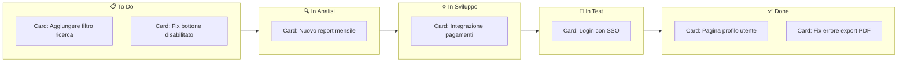
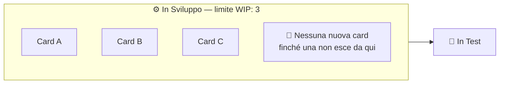
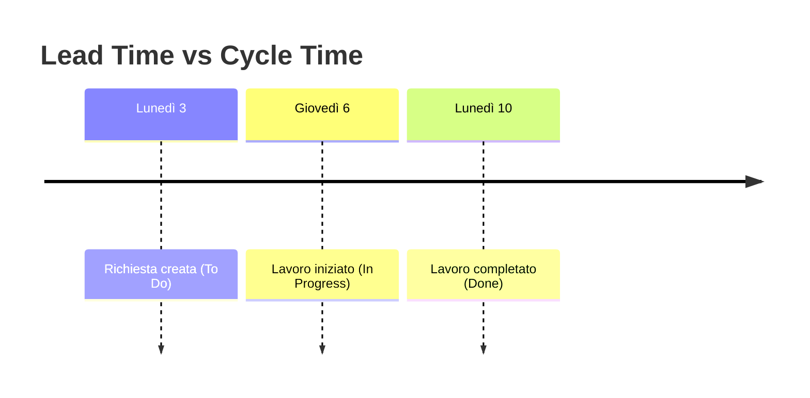
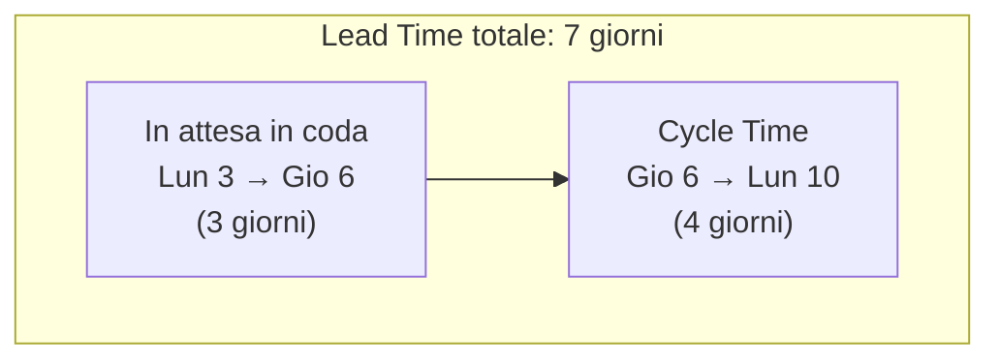
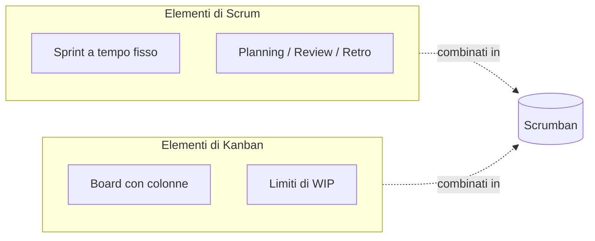

# 7. Kanban

> 📄 **[Scarica questa sezione in PDF](../../pdf/07-kanban.pdf)** — utile per la stampa o la lettura offline.

Nella sezione precedente hai visto Scrum: sprint a tempo fisso, ruoli
definiti, eventi ricorrenti (planning, daily, review, retrospettiva). Scrum
è un framework molto "strutturato". Kanban parte da un'idea diversa e più
semplice: **rendere visibile il lavoro e limitare quanto ne facciamo
contemporaneamente**, senza necessariamente imporre sprint o ruoli fissi.

Se Scrum è come organizzare il lavoro a "capitoli" di durata fissa, Kanban
è più simile a un nastro trasportatore continuo: il lavoro scorre, una voce
alla volta, dall'inizio alla fine, senza tappe temporali predefinite.

## 🎯 Obiettivi della sezione

Alla fine di questa sezione saprai:

- da dove viene il metodo Kanban e perché si chiama così;
- come è strutturata una board Kanban e cosa rappresentano colonne e card;
- cos'è il WIP (Work In Progress) e perché limitarlo migliora il flusso di
  lavoro del team;
- la differenza tra Lead Time e Cycle Time, con un esempio numerico;
- quando conviene usare Kanban invece di Scrum (o entrambi insieme).

---

## 7.1 Da dove viene Kanban

La parola **Kanban** (看板) viene dal giapponese e significa più o meno
"cartellino visivo" o "insegna". Il metodo nasce **non nel software**, ma
in fabbrica: negli anni '40-'50 **Toyota** lo introdusse nelle sue linee di
produzione automobilistica come parte del sistema di produzione "lean"
(cioè "snello", senza sprechi).

L'idea originale era molto concreta: in una linea di montaggio, ogni
reparto usava dei cartellini fisici per segnalare al reparto precedente
"ho bisogno di altri pezzi" — invece di produrre pezzi in grandi quantità
"a caso" e ammassarli in magazzino (con il rischio di produrne troppi o
troppo pochi), si produceva **solo quello che serviva, quando serviva**.
Questo riduceva sprechi, magazzini pieni di materiale inutilizzato, e
colli di bottiglia nascosti.

Decenni dopo, a partire dagli anni 2000, questa filosofia è stata adattata
al lavoro di team software (il nome più associato a questa trasposizione è
David J. Anderson). L'idea di fondo resta identica: **rendere visibile il
flusso di lavoro** e **non accumulare più lavoro "in corso" di quanto il
team riesca effettivamente a gestire**.

---

## 7.2 La board Kanban: colonne e card

Il cuore pratico di Kanban è la **board** (bacheca), divisa in **colonne**
che rappresentano le fasi che un elemento di lavoro attraversa, da quando
viene richiesto a quando è completato.

La versione più semplice ha tre colonne:

- **To Do** (da fare): lavoro non ancora iniziato;
- **In Progress** (in corso): lavoro su cui qualcuno sta lavorando ora;
- **Done** (fatto): lavoro completato.

Nella pratica reale, quasi nessun team si ferma a tre colonne: le colonne
vengono **personalizzate** per rispecchiare le fasi reali del lavoro del
team. Un esempio molto comune in un contesto software:

**To Do → In Analisi → In Sviluppo → In Test → Done**

Ogni **card** (cartellino, che riprende proprio l'idea del cartellino
giapponese originale) rappresenta un singolo elemento di lavoro: una user
story, un bug da correggere, un task tecnico. La card si sposta da sinistra
a destra sulla board, colonna dopo colonna, man mano che avanza. Ogni card
contiene tipicamente: un titolo, una breve descrizione, chi ci sta
lavorando (assegnatario), e a volte etichette o una stima di dimensione.

> 💡 **Analogia**: pensa alla board come al monitor delle partenze in un
> aeroporto. Ogni volo (card) parte da "In attesa", passa per "Imbarco in
> corso" e arriva a "Partito". A colpo d'occhio, chiunque guardi il
> monitor capisce subito lo stato di ogni volo — senza dover chiedere a
> nessuno "a che punto siamo?".

Le board Kanban possono essere fisiche (un muro con post-it) o digitali
(strumenti come Azure DevOps Boards, Trello, Jira). Nella sezione 10
vedrai come si costruisce concretamente una board Kanban dentro
Azure DevOps.

---

## 7.3 WIP: il lavoro "in corso" e i suoi limiti

**WIP** è l'acronimo di **Work In Progress**, cioè "lavoro in corso": il
numero di elementi che, in un dato momento, sono già iniziati ma non ancora
completati.

Uno dei principi cardine di Kanban è il **limite di WIP**: si stabilisce un
numero massimo di card che possono trovarsi contemporaneamente in una
determinata colonna (tipicamente le colonne di lavoro attivo, come "In
Sviluppo" o "In Test"). Se una colonna ha già raggiunto il suo limite,
**nessuno può iniziare una nuova card in quella colonna** finché non se ne
libera una completandola e facendola avanzare.

Detto così può sembrare controintuitivo: perché limitare volontariamente
quanto lavoro il team può iniziare? La risposta è che **fare tante cose
contemporaneamente, in realtà, le fa fare tutte più lentamente**.

> 💡 **Analogia**: pensa al casello di un'autostrada durante un weekend di
> esodo. Se tutte le macchine potessero entrare in autostrada
> contemporaneamente senza controllo, si formerebbe un ingorgo che
> blocca *tutti*, e alla fine le macchine arriverebbero più tardi di
> quanto arriverebbero se il casello facesse passare le auto in modo
> controllato, poche alla volta. È lo stesso principio di un **imbuto**: se
> versi il liquido troppo in fretta, l'imbuto si intasa e in realtà il
> liquido scende **più lentamente** rispetto a versarlo con un flusso
> costante e misurato.

Nel lavoro di un team succede la stessa cosa: se ognuno ha 6 task "aperti"
contemporaneamente, continua a passare da uno all'altro (context
switching), nessun task avanza davvero in fretta, e la sensazione di
"essere sempre indaffarati" nasconde il fatto che **poco viene realmente
completato**. Limitare il WIP forza il team a **finire prima di iniziare
altro**, il che in pratica fa terminare più lavoro, più velocemente, con
meno errori (perché ci si concentra su meno cose alla volta).

Un segnale tipico da Project Manager/Scrum Master: se vedi una colonna
della board costantemente "esplosa" oltre il suo limite di WIP, è un
sintomo concreto di un **collo di bottiglia** nel flusso di lavoro del
team, su cui vale la pena indagare (manca una competenza? una fase
richiede un'approvazione lenta? c'è troppa dipendenza da una sola
persona?).

---

## 7.4 Lead Time e Cycle Time

Kanban, essendo un metodo orientato al "flusso" continuo di lavoro, si
misura soprattutto con due metriche di tempo, spesso confuse tra loro ma
concettualmente diverse.

### Lead Time

Il **Lead Time** è il tempo totale che passa **dal momento in cui una
richiesta viene fatta** (la card entra nella colonna "To Do", cioè nel
backlog) **al momento in cui viene completata** (la card arriva in
"Done"). È il tempo che interessa di più a **chi ha fatto la richiesta**
(un cliente, uno stakeholder): "quanto tempo devo aspettare per avere
questa cosa?".

### Cycle Time

Il **Cycle Time** è il tempo che passa **dal momento in cui il team inizia
effettivamente a lavorarci** (la card entra in "In Progress" o "In
Analisi") **al momento in cui viene completata**. È il tempo che interessa
di più al **team**, perché misura quanto efficiente è il lavoro una volta
avviato, senza contare l'attesa in coda.

La differenza pratica è quindi il tempo di **attesa in coda**, prima che
qualcuno inizi effettivamente a lavorare sulla richiesta.

### Esempio numerico

Immagina questa card: "Aggiungere filtro di ricerca alla pagina prodotti".

- **Lunedì 3**: la richiesta viene registrata e messa in "To Do".
- **Giovedì 6**: uno sviluppatore inizia effettivamente a lavorarci
  ("In Progress").
- **Lunedì 10**: il lavoro è completato e la card arriva in "Done".

Calcoliamo:

- **Lead Time** = da lunedì 3 a lunedì 10 = **7 giorni**
- **Cycle Time** = da giovedì 6 a lunedì 10 = **4 giorni**

La differenza (3 giorni) è il tempo che la richiesta ha passato "in coda",
in attesa che qualcuno se ne occupasse.

Rappresentazione a barre, per confrontare visivamente i due intervalli:

> 💡 **Perché la distinzione conta per un Project Manager**: se il cliente
> si lamenta che "le richieste ci metton troppo ad arrivare", devi capire
> **dove** si perde tempo. Se il Cycle Time è basso ma il Lead Time è alto,
> il problema non è che il team lavora lentamente: è che le richieste
> restano troppo tempo in coda prima che qualcuno le prenda in carico.
> Sono due problemi diversi, con soluzioni diverse (il primo si risolve
> migliorando l'efficienza del team, il secondo migliorando come si
> priorizza e si smista il lavoro in arrivo).

---

## 7.5 Kanban vs Scrum: quando usare cosa

Kanban e Scrum condividono lo stesso spirito Agile (visto nella sezione 5),
ma organizzano il lavoro in modo diverso.

| | Scrum | Kanban |
|---|---|---|
| **Struttura del tempo** | A **sprint** di durata fissa (es. 2 settimane) | **Flusso continuo**, senza intervalli di tempo fissi |
| **Consegna del lavoro** | Un "pacchetto" di elementi consegnato a fine sprint | Ogni elemento viene consegnato appena è pronto |
| **Ruoli** | Ruoli definiti (Scrum Master, Product Owner, Team) | Nessun ruolo obbligatorio specifico |
| **Eventi ricorrenti** | Planning, Daily, Review, Retrospettiva | Nessun evento obbligatorio (anche se molti team fanno comunque una daily) |
| **Cosa si limita** | La quantità di lavoro pianificata per lo sprint (lo Sprint Backlog) | Il WIP, cioè quante card possono essere "in corso" in ogni momento |
| **Metriche tipiche** | Velocity (punti completati per sprint) | Lead Time, Cycle Time, Throughput |
| **Cambiamenti a metà lavoro** | Scoraggiati a metà sprint (si aspetta il prossimo) | Benvenuti in qualsiasi momento, il flusso è continuo |

**Quando usare Scrum**: quando il lavoro si presta a essere pianificato in
blocchi (sprint), il team vuole momenti regolari di revisione e
retrospettiva, e serve una cadenza predicibile per pianificare e comunicare
con gli stakeholder (es. "a fine sprint mostriamo una demo").

**Quando usare Kanban**: quando il lavoro arriva in modo **imprevedibile e
continuo**, con priorità che cambiano spesso — è il caso tipico di team di
**supporto, manutenzione, gestione incident** o di piattaforme DevOps, dove
non ha molto senso "pianificare due settimane fisse" perché una richiesta
urgente (es. un bug critico in produzione) può arrivare in qualsiasi
momento e deve poter "saltare la fila".

### Scrumban: il meglio dei due mondi

Molti team reali non scelgono in modo rigido l'uno o l'altro, ma
**combinano i due approcci**, in un ibrido informalmente chiamato
**Scrumban**: si mantiene la cadenza degli sprint e degli eventi Scrum
(planning, review, retrospettiva) per la pianificazione e la
comunicazione, ma si gestisce il lavoro **dentro** lo sprint con una board
Kanban e limiti di WIP, per governare meglio il flusso quotidiano. È un
approccio molto comune nei team che gestiscono sia nuovo sviluppo
pianificato sia richieste impreviste (bug urgenti, richieste di supporto).

---

## 7.6 Riepilogo

- Kanban nasce nella produzione industriale (Toyota, filosofia "lean") e si
  è poi adattato al lavoro dei team software.
- La **board** con le sue colonne rende visibile lo stato di ogni elemento
  di lavoro (card); le colonne possono essere personalizzate per riflettere
  il processo reale del team.
- Limitare il **WIP** (lavoro in corso) migliora il flusso complessivo:
  meno cose iniziate contemporaneamente, più cose finite rapidamente.
- **Lead Time** misura l'attesa dal punto di vista di chi richiede;
  **Cycle Time** misura l'efficienza del team una volta che il lavoro è
  iniziato.
- Scrum lavora a **sprint**, Kanban lavora a **flusso continuo**: la
  scelta dipende dal tipo di lavoro del team, e i due approcci si possono
  anche combinare (**Scrumban**).

---

## 🔗 Collegamenti

- [8. Project Management](../08-project-management/README.md) — come usare le metriche di flusso (Lead Time, Cycle Time, Throughput) per monitorare un progetto
- [10. Azure DevOps](../10-azure-devops/README.md) — come costruire e configurare concretamente una board Kanban con Azure DevOps Boards

## 📚 Risorse

- [Kanbanize — What is Kanban?](https://kanbanize.com/kanban-resources/getting-started/what-is-kanban)
- [Atlassian — Kanban](https://www.atlassian.com/agile/kanban)
- [Atlassian — Lead Time vs Cycle Time](https://www.atlassian.com/agile/project-management/lead-cycle-time)
- [Atlassian — What is WIP limit?](https://www.atlassian.com/agile/kanban/wip-limits)
- [Kanban University — What is Kanban?](https://kanban.university/kanban-guide/)
- [Scrumban — Definizione ed esempi](https://www.atlassian.com/agile/kanban/scrumban)
