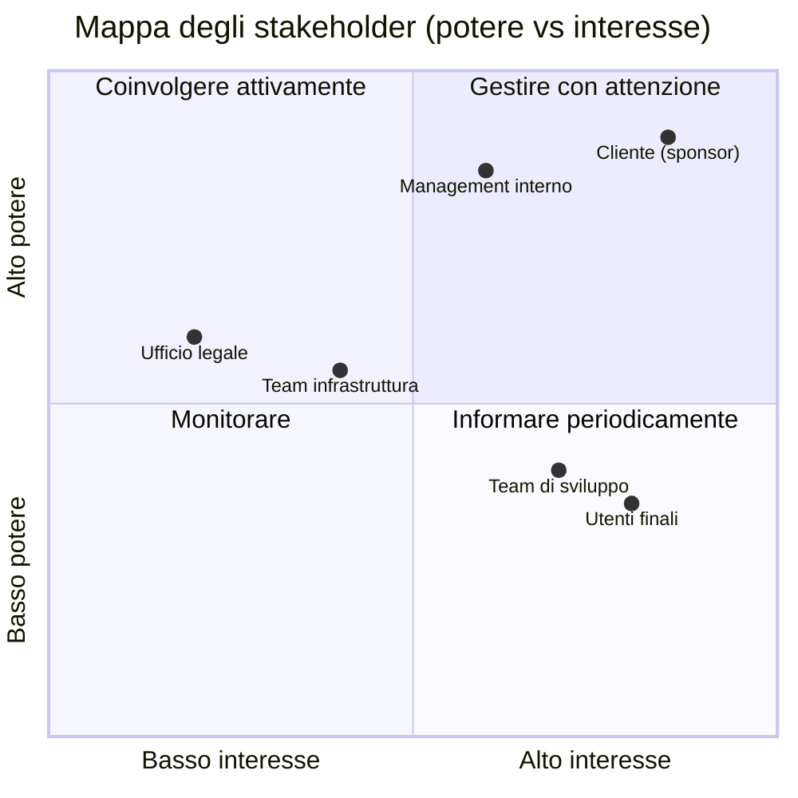
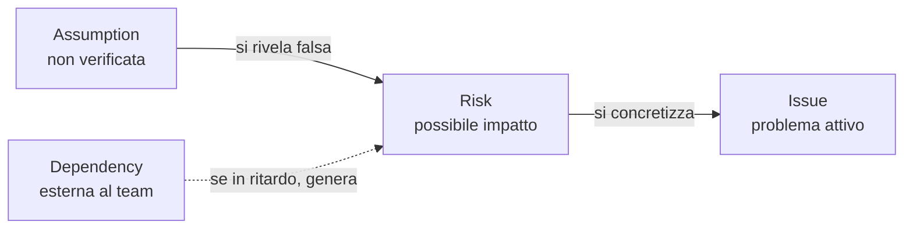
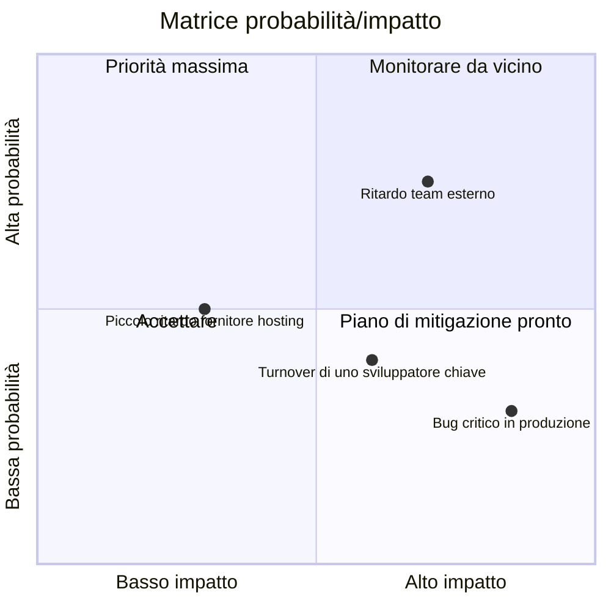
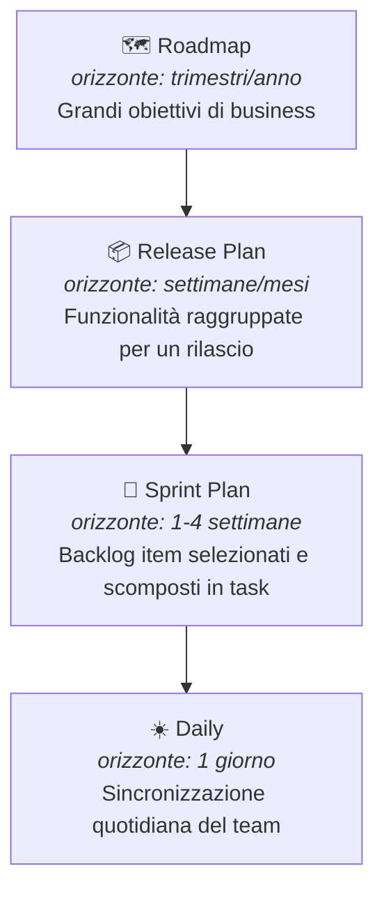
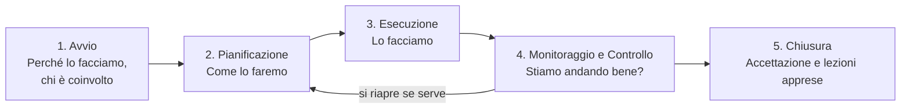
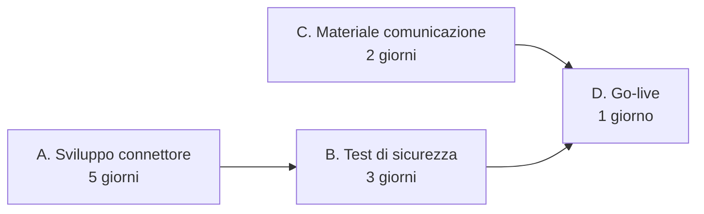

# 8. Project Management


> 📄 **[Scarica questa sezione in PDF](https://darioschioppi.github.io/corso-onboarding-devops/pdf/08-project-management.pdf)** — utile per la stampa o la lettura offline.


Hai già visto Agile, Scrum e Kanban: sai quindi **come** un team organizza
il lavoro giorno per giorno (sprint, board, colonne, cerimonie). Questa
sezione affronta un livello diverso, complementare: quello del **Project
Management**, cioè l'insieme di strumenti e pratiche che permettono di
tenere sotto controllo un progetto nel suo complesso — chi è coinvolto,
cosa può andare storto, a che punto siamo, e come lo comunichiamo a chi non
è nella daily standup ogni giorno.

Attenzione a un equivoco comune: il Project Management **non è** la
pianificazione rigida "a cascata" (Waterfall) che magari hai studiato
all'università, con Gantt chart bloccati e fasi sequenziali immutabili.

Per capire perché questo corso non torna a quel modello, vale la pena
vedere cosa succedeva davvero con Waterfall, non solo definirlo. In un
progetto a cascata tipico, i requisiti vengono **congelati mesi prima**
in un documento lungo, approvato una volta. Il team sviluppa per mesi
seguendo quel documento, senza mostrare nulla al cliente fino alla fine —
la **prima verifica reale** avviene solo alla consegna. È a quel punto che
emerge il problema: il software corrisponde esattamente al documento, ma
nel frattempo il mercato o la comprensione del problema sono cambiati, e
il cliente scopre di aver ricevuto — con grande precisione tecnica — **la
cosa sbagliata**. Non è un errore di programmazione: è un difetto
strutturale dell'aver bloccato i requisiti troppo presto e verificato
troppo tardi — l'argomento che spesso convince uno sponsor scettico a non
chiedere "un Gantt dettagliato di tutto il progetto" il primo giorno.

In un contesto Agile/DevOps, il project management convive con
l'iterazione continua e l'incertezza: si pianifica, sì, ma a più livelli e
con la consapevolezza che il piano cambierà. Il ruolo del Project Manager
(o di chi ne fa le funzioni, come uno Scrum Master "aumentato" o un Delivery
Manager) è più simile a un **navigatore che aggiorna la rotta ogni giorno**
che a un ingegnere che disegna un progetto immutabile su carta.

Anche in questa sezione useremo come filo conduttore il team di
**ShopFacile**, la piattaforma e-commerce che hai già incontrato: **Sara**
(Product Owner) sarà la voce del business tra gli stakeholder, **Luca**
(Scrum Master) seguirà da vicino processo e rischi — RAID Log, RACI,
monitoraggio — mentre **Marco**, **Giulia** e **Ahmed**, il team di
sviluppo, daranno concretezza agli esempi di KPI e reportistica.

## 🎯 Obiettivi della sezione

Alla fine di questa sezione saprai:

- identificare gli **stakeholder** di un progetto software e capire perché
  vanno mappati;
- usare un **RAID Log** per tenere traccia di rischi, assunzioni, problemi
  e dipendenze;
- leggere e costruire una **matrice RACI** per chiarire le responsabilità;
- distinguere una **milestone** da una semplice scadenza;
- valutare un **rischio** in termini di probabilità e impatto, e capire
  come si mitiga;
- capire come funziona la **pianificazione a più livelli** in un contesto
  Agile (roadmap, release plan, sprint plan);
- riconoscere gli strumenti di **monitoraggio** dell'andamento di un team
  (burndown/burnup, stand-up, dashboard);
- conoscere i principali **KPI** usati in un team Agile/DevOps;
- distinguere i diversi livelli di **reportistica**, a seconda di chi la
  legge;
- capire cosa sono il **PMI**, la certificazione **PMP** e la **PMBOK
  Guide**, e come si collocano rispetto ad Agile/Scrum;
- riconoscere i **5 process group** e le **10 knowledge area** del PMBOK,
  collegandoli agli strumenti già visti nel corso;
- scrivere un **project charter** essenziale e distinguere una **WBS**
  (scomposizione del lavoro) da un Product Backlog;
- leggere un **percorso critico (critical path)** semplice e interpretare
  le metriche base dell'**Earned Value Management** (PV, EV, AC, SPI, CPI);
- muoverti con sicurezza in un contesto **ibrido**, che unisce pratiche PMP
  e pratiche Agile, come accade in molte aziende reali.

---

## 8.1 Stakeholder: chi ha interesse nel progetto

Uno **stakeholder** (letteralmente "portatore di interesse") è **qualsiasi
persona o gruppo che può influenzare il progetto, oppure che ne è
influenzato**. Non sono solo "quelli che pagano": sono tutti quelli che, in
un modo o nell'altro, hanno voce in capitolo o subiscono le conseguenze
delle decisioni prese.

> 💡 **Analogia**: organizzare un progetto software senza mappare gli
> stakeholder è come organizzare un matrimonio pensando solo agli sposi.
> In realtà ci sono genitori che pagano parte del conto, invitati con
> esigenze alimentari particolari, il fotografo che deve essere informato
> sugli orari, il comune che deve validare i documenti. Se ignori qualcuno
> di questi soggetti, il giorno dell'evento emergono problemi che potevi
> prevedere con un minimo di mappatura.

In un progetto software tipico, gli stakeholder principali sono:

- **Il cliente** (o il committente): chi ha commissionato il progetto e ne
  finanzia lo sviluppo. Vuole vedere valore consegnato, rispetto dei tempi
  e dei costi concordati.
- **Il management** (interno all'azienda che sviluppa): responsabili di
  linea, direttori, chi deve rendere conto a sua volta di come vanno i
  progetti del team.
- **Gli utenti finali**: le persone che useranno concretamente il software
  ogni giorno. Spesso non partecipano alle decisioni, ma sono chi subisce
  più direttamente le conseguenze di scelte sbagliate (un'interfaccia
  scomoda, una funzionalità mancante).
- **Il team**: sviluppatori, tester, designer, chiunque contribuisca alla
  realizzazione. Sono stakeholder anche loro: un carico di lavoro
  insostenibile o requisiti ambigui li riguardano direttamente.
- **Altri team o reparti**: un team di sicurezza che deve validare il
  rilascio, un team di infrastruttura che gestisce i server, un ufficio
  legale che deve approvare termini contrattuali.

Una mappatura semplice, spesso usata nella pratica, classifica gli
stakeholder in base a due dimensioni: **quanto potere/influenza hanno** sul
progetto e **quanto interesse** hanno nel suo esito.



**Esempio pratico**: nel progetto ShopFacile per una nuova funzionalità di
pagamento online, il cliente/committente ha alto potere e alto interesse
(va coinvolto attivamente in ogni decisione importante) — nella pratica di
ShopFacile è **Sara**, la Product Owner, a rappresentare questa voce del
business nelle decisioni quotidiane; il team di sicurezza interno ha alto
potere ma interesse più episodico (va coinvolto nei momenti critici, come
la validazione prima del rilascio in produzione); gli utenti finali hanno
alto interesse ma poco potere diretto sulle decisioni (vanno rappresentati
tramite ricerche utente, feedback, test di usabilità).

Perché questo conta per un Junior Project Manager? Perché la causa più
comune di problemi in un progetto non è "il codice non funziona", ma
**qualcuno importante non è stato informato o coinvolto al momento giusto**.
Mappare gli stakeholder all'inizio ti evita sorprese a metà progetto — ma
sapere *chi* coinvolgere non basta se non hai anche un posto dove tracciare
*cosa* può andare storto: è il compito del RAID Log, che vediamo subito.

---

## 8.2 RAID Log: la mappa dei problemi (prima che diventino problemi)

Immagina questa situazione, capitata più volte in team come quello di
ShopFacile: solo una persona sa che il fornitore di hosting ha in programma
una manutenzione delicata — ma va in ferie senza scriverlo da nessuna
parte. Nello stesso periodo, il rilascio di una funzionalità dipende da un
fornitore esterno di pagamenti, ma nessuno ha mai tracciato formalmente
questa dipendenza né chiesto una data di conferma. Quando i due problemi
si sommano, il progetto si **ferma per due settimane**, e il team scopre
solo allora che entrambe le informazioni erano note a qualcuno, ma non
condivise né scritte da nessuna parte. È esattamente il problema che il
RAID Log esiste per prevenire.

**RAID** è un acronimo che raggruppa quattro categorie di informazioni che
un team di progetto deve tracciare costantemente:

- **R — Risks** (Rischi): eventi che *potrebbero* accadere e che, se
  accadono, avrebbero un impatto negativo sul progetto.
- **A — Assumptions** (Assunzioni): cose che stiamo dando per scontate,
  senza averle verificate al 100%, per poter procedere con la
  pianificazione.
- **I — Issues** (Problemi): cose che *sono già accadute* e stanno
  attivamente impattando il progetto ora.
- **D — Dependencies** (Dipendenze): elementi esterni al controllo diretto
  del team, di cui il progetto ha bisogno per procedere.

> 💡 **Analogia**: il RAID Log è come il cruscotto di un'automobile durante
> un lungo viaggio. Il rischio è la spia della benzina che si accende
> prima che tu resti a secco (un avviso preventivo). L'assunzione è il
> presupposto "ci sarà un distributore aperto lungo la strada" — non
> l'hai verificato, ma stai viaggiando come se fosse vero. Il problema è il
> pneumatico che si è già bucato: è già successo, va gestito subito. La
> dipendenza è il fatto che, per attraversare un ponte, devi aspettare che
> apra alle 8, che tu lo voglia o no: non lo controlli, ma ne dipendi.

Un esempio concreto di ciascuna categoria, per un progetto software reale:

| Categoria | Esempio concreto |
|---|---|
| **Risk** | "C'è il rischio che il carico di traffico previsto per il Black Friday superi la capacità attuale dei server, causando lentezza o down del sito." (non è ancora successo, ma è possibile) |
| **Assumption** | "Stiamo pianificando la release assumendo che l'ambiente di test resti disponibile per tutto il mese; non abbiamo una conferma scritta dal team infrastruttura." |
| **Issue** | "Il servizio di invio email di terze parti è down da ieri: gli utenti non ricevono le email di conferma registrazione." (è già un problema attivo, in corso) |
| **Dependency** | "Il rilascio della nuova funzionalità di pagamento dipende dall'approvazione di sicurezza da parte di un team esterno al progetto, previsto per la settimana prossima." |

Nella pratica, un RAID Log è semplicemente una tabella condivisa (spesso in
un foglio, in una board dedicata, o in una Issue "fissata" in cima al
repository GitHub del progetto), aggiornata regolarmente, con colonne tipo:
descrizione, categoria, responsabile, impatto, stato, data di apertura,
azione prevista.

Un aspetto importante da capire: le **assunzioni**, se non verificate per
tempo, diventano facilmente **rischi**; e i **rischi**, se non mitigati per
tempo, diventano **issue** attive. Il RAID Log serve proprio a intercettare
questa "scala di gravità" prima che il problema esploda a valle.



**Esempio pratico**: un estratto reale (semplificato) di RAID Log a metà
dello Sprint 6 di ShopFacile, così come potrebbe apparire in una board
condivisa con il team. In ShopFacile non esiste un Project Manager
dedicato: le responsabilità di "Tech Lead" e "Project Manager" viste in
tabella sono spesso portate avanti da **Luca**, insieme al team, accanto
al suo ruolo di Scrum Master:

| ID | Categoria | Descrizione | Responsabile | Impatto (1-5) | Stato | Aperto il |
|---|---|---|---|---|---|---|
| R-12 | Risk | Il fornitore di hosting ha comunicato una finestra di manutenzione non pianificata nella settimana del rilascio | Luca (Tech Lead) | 4 | Aperto | 03/06 |
| R-13 | Risk | Se non testiamo il carico prima del Black Friday, rischio di rallentamenti sotto picco di traffico | Giulia (Developer/QA) | 5 | In mitigazione | 05/06 |
| A-07 | Assumption | Stiamo assumendo che l'ambiente di staging resti disponibile fino a fine mese | Luca (Project Manager) | 3 | Da verificare | 01/06 |
| A-08 | Assumption | Assumiamo che Sara fornisca il feedback sul design entro 3 giorni lavorativi | Luca (Project Manager) | 2 | Da verificare | 04/06 |
| I-04 | Issue | Il servizio di invio SMS di terze parti restituisce errori 500 dal 06/06 | Marco (Sviluppatore backend) | 4 | In corso | 06/06 |
| D-05 | Dependency | Il rilascio del modulo pagamenti dipende dall'approvazione del team sicurezza, prevista per il 12/06 | Luca (Tech Lead) | 5 | In attesa | 02/06 |

Con soli 6 righe, un Project Manager junior può già farsi una domanda
utile: **quali elementi con impatto alto (4-5) non hanno ancora un'azione
di mitigazione chiara?** In questo estratto sono tre (R-13, I-04, D-05):
sono i primi tre di cui parlare nel prossimo check-in con il cliente,
prima che diventino la causa di uno slittamento non comunicato per tempo.

---

## 8.3 RACI: chi fa cosa (e chi deve solo saperlo)

Una delle domande più comuni — e più fonte di attriti — in un progetto è:
**"chi decide su questo?"** o **"a chi tocca fare questa cosa?"**. La
matrice **RACI** è uno strumento semplice per chiarirlo prima che diventi un
problema, assegnando a ogni attività uno dei quattro ruoli:

- **R — Responsible** (Esecutore): chi materialmente **fa il lavoro**.
- **A — Accountable** (Responsabile finale): chi **risponde del risultato**
  davanti a tutti — è la persona che, se qualcosa va storto, deve
  rispondere. Per ogni attività dovrebbe essercene **uno solo**, per
  evitare ambiguità.
- **C — Consulted** (Consultato): chi viene **coinvolto per un parere**
  prima che la decisione/attività sia completata, con una comunicazione a
  doppio senso (gli chiedi qualcosa, lui risponde).
- **I — Informed** (Informato): chi viene **aggiornato dopo il fatto**, con
  comunicazione a senso unico (non partecipa alla decisione, ma deve
  saperlo).

> 💡 **Analogia**: pensa a un ristorante durante il servizio. Il cameriere
> che porta il piatto al tavolo è il *Responsible*: esegue l'azione. Lo chef
> di cucina è l'*Accountable*: risponde della qualità del piatto che esce
> dalla sua cucina. Il sommelier viene *Consulted* se il cliente chiede
> un abbinamento particolare di vino. Il titolare del ristorante è
> *Informed*: alla fine della serata gli viene detto quanti coperti sono
> stati serviti, ma non ha partecipato a nessun piatto.

**Esempio pratico**: matrice RACI per l'attività "rilascio di una nuova
funzionalità in produzione" — lo stesso rilascio del modulo pagamenti
visto nel RAID Log di ShopFacile qui sopra. I ruoli della tabella restano
generici (così puoi riusarla per qualsiasi progetto), ma nel team
ShopFacile sono coperti così: Sviluppatore → **Ahmed**, Tech Lead/Project
Manager → **Luca**, QA/Tester → **Giulia**, Cliente → **Sara**, in quanto
voce del business.

| Attività | Sviluppatore | Tech Lead | Project Manager | QA / Tester | Cliente |
|---|---|---|---|---|---|
| Sviluppo del codice | **R** | C | I | I | — |
| Code review | C | **A** / R | I | I | — |
| Test della funzionalità | I | C | I | **R** | — |
| Decisione go/no-go al rilascio | I | C | **A** | C | I |
| Esecuzione del rilascio (deploy) | C | **R** | I | I | — |
| Comunicazione al cliente dell'avvenuto rilascio | I | I | **R** / A | I | **I** |

Qualche osservazione utile da tenere a mente quando costruisci una RACI:

- Per ogni riga ci dovrebbe essere **esattamente una A** (Accountable):
  se nessuno è accountable, nessuno risponde davvero del risultato; se ce
  ne sono troppe, si diluisce la responsabilità e nelle emergenze "si
  scaricano" a vicenda.
- Una stessa persona può essere sia R che A sulla stessa attività (come il
  Tech Lead nella code review, sopra), specialmente in team piccoli.
- Troppi "C" su un'attività la rendono lenta: ogni consultazione è un
  potenziale collo di bottiglia. Usa "C" solo dove il parere serve
  davvero.

Una RACI ben fatta chiarisce chi fa cosa lungo il percorso di un rilascio,
ma non dice ancora **quando** quel rilascio conta davvero per chi guarda il
progetto da fuori. È qui che entra in gioco il concetto di milestone.

---

## 8.4 Milestone: un traguardo, non una scadenza qualsiasi

Una **milestone** (pietra miliare) è un **punto significativo** nel percorso
del progetto: segna il raggiungimento di qualcosa di rilevante, non
semplicemente il passaggio di una data sul calendario.

> 💡 **Analogia**: pensa a una gara ciclistica a tappe. Ogni tappa ha
> ovviamente una data di arrivo, ma alcuni punti del percorso sono
> **traguardi volanti** o **cime di montagna**: superarli non è solo "un
> altro chilometro fatto", è un momento che tutti notano, che dà punteggio
> a parte, che segna davvero un salto di fase della corsa. Una scadenza
> qualsiasi è come un cartello chilometrico: utile per orientarsi, ma non
> cambia la narrazione della corsa. Una milestone è il traguardo di tappa.

La differenza pratica:

| | Scadenza semplice | Milestone |
|---|---|---|
| **Cosa segna** | Il completamento di un compito operativo | Il raggiungimento di un obiettivo significativo per il progetto |
| **Visibilità** | Interna al team, spesso operativa | Comunicata anche a stakeholder esterni |
| **Esempio** | "Completare la migrazione del database di test entro venerdì" | "Ambiente di test pronto e validato dal cliente" |
| **Conseguenza se manca** | Si riorganizza il lavoro della settimana | Può avere impatto su comunicazioni contrattuali, pianificazione di altri team, aspettative del cliente |

Esempi concreti di milestone in un progetto software: "fine della fase di
analisi dei requisiti", "prima release disponibile per un gruppo pilota di
utenti (beta)", "completamento dei test di sicurezza", "go-live in
produzione", "primo mese di produzione senza incidenti critici". Non sono
attività in sé, ma **traguardi** che raccontano un salto di stato del
progetto — per ShopFacile, il go-live del nuovo modulo pagamenti che
abbiamo visto nel RAID Log e nella RACI è esattamente questo tipo di
milestone: non un task tra tanti, ma un momento che Sara comunicherà
anche al di fuori del team.

In un contesto Agile, le milestone convivono bene con gli sprint: uno
sprint può contribuire a una milestone senza esaurirla, e una milestone
spesso coincide con la fine di una serie di sprint (ad esempio, la fine di
una release che raggruppa più sprint). Ma un traguardo così visibile porta
con sé anche più da perdere se qualcosa va storto lungo il percorso — ed è
proprio quello che il prossimo paragrafo insegna a gestire.

---

## 8.5 Rischio: identificare, valutare, mitigare

Un **rischio** è un evento incerto che, se si verifica, ha un impatto
(di solito negativo, anche se esistono rischi "positivi", cioè opportunità)
sul progetto. Gestire i rischi non significa eliminarli tutti — è
impossibile — ma **conoscerli in anticipo** e decidere consapevolmente cosa
fare.

Il processo tipico ha tre fasi:

1. **Identificazione**: elencare cosa potrebbe andare storto. Si fa in
   team, spesso in un momento dedicato (es. durante la pianificazione di
   una release), con tecniche semplici come il brainstorming o rivedendo i
   rischi materializzati in progetti simili passati.
2. **Valutazione**: per ogni rischio, stimare **probabilità** (quanto è
   plausibile che accada) e **impatto** (quanto danno farebbe se
   accadesse). Spesso si usa una scala semplice (basso/medio/alto) e si
   visualizza in una matrice.
3. **Mitigazione**: decidere una strategia. Le opzioni classiche sono:
   - **evitare** il rischio (cambiare approccio per non incontrarlo);
   - **ridurre** probabilità o impatto (azioni preventive);
   - **trasferire** il rischio (es. a un fornitore, con un'assicurazione
     contrattuale);
   - **accettare** il rischio consapevolmente, se il costo di mitigarlo
     supera il danno potenziale, tenendo comunque un piano B pronto.



**Esempio concreto**: "rischio di ritardo per dipendenza da un altro team" —
lo stesso rischio D-05 già anticipato nel RAID Log di ShopFacile.

- **Descrizione del rischio**: la nuova funzionalità di pagamento di
  ShopFacile richiede che il team di infrastruttura fornisca un nuovo
  ambiente sicuro entro due settimane; quel team ha già altri due progetti
  in corso.
- **Probabilità**: media-alta (il team esterno è oggettivamente
  sovraccarico, lo si vede dal loro backlog).
- **Impatto**: alto (senza quell'ambiente, il rilascio non può partire, e
  la data comunicata al cliente è a rischio).
- **Mitigazione**: **Luca** decide di chiedere una conferma scritta della
  data al team infrastruttura appena possibile (per trasformare
  l'assunzione in un impegno verificato); valuta con il team un piano B con
  un ambiente temporaneo meno performante ma disponibile prima; e si
  accorda con Sara per comunicare per tempo al cliente che esiste un
  rischio, invece di farlo scoprire a due giorni dalla scadenza.

Da notare come questo esempio collega direttamente rischio, assunzione e
dipendenza — gli stessi concetti visti nel RAID Log: non sono strumenti
separati, ma **lenti diverse sullo stesso terreno**.

---

## 8.6 Pianificazione in un contesto Agile: livelli, non un unico piano

Nel project management "a cascata" tradizionale, l'idea è pianificare tutto
in anticipo, in un unico grande piano dettagliato. In un contesto
Agile/DevOps si pianifica invece **a più livelli**, con dettaglio crescente
man mano che ci si avvicina all'esecuzione — perché sappiamo che i dettagli
lontani nel tempo cambieranno comunque, mentre quelli vicini devono essere
affidabili.

I livelli tipici, dal più generale al più operativo:

1. **Roadmap**: la visione a lungo termine (mesi/trimestri/anno), con i
   grandi temi e obiettivi di business. Non contiene dettagli tecnici, ma
   direzioni: nella roadmap di ShopFacile che Sara porta agli stakeholder
   potrebbe leggersi "nel primo trimestre miglioriamo l'esperienza di
   checkout", "nel secondo trimestre lanciamo l'app mobile".
2. **Release Plan**: un livello più concreto, che raggruppa più sprint per
   arrivare a un rilascio significativo per gli utenti o il cliente. Qui
   iniziano a comparire funzionalità specifiche e stime di massima.
3. **Sprint Plan**: il piano del singolo sprint (di solito 1-4 settimane,
   come hai visto nella sezione su Scrum), con gli elementi di backlog
   selezionati e scomposti in attività concrete.
4. **Daily**: l'allineamento quotidiano del team (la daily standup), dove
   si sincronizza il lavoro del singolo giorno rispetto all'obiettivo dello
   sprint.



Il punto chiave da capire, come futuro Project Manager: **più ti allontani
nel tempo, meno il piano deve essere dettagliato — e va bene così**. Una
roadmap troppo dettagliata è quasi sempre sbagliata (perché il futuro
lontano è incerto), mentre uno sprint plan troppo vago è inutile (perché il
team deve poter lavorare su qualcosa di concreto già domani mattina). Il
tuo compito non è "prevedere tutto", ma tenere questi livelli **coerenti
tra loro** e aggiornarli quando la realtà li smentisce.

Avere un piano a più livelli, però, non ti dice ancora se ShopFacile lo sta
effettivamente rispettando giorno per giorno: per quello serve osservare
l'andamento reale del team, non solo il piano scritto.

---

## 8.7 Monitoraggio: come si tiene traccia dell'andamento

Pianificare non basta: bisogna anche **verificare costantemente** se si sta
procedendo come previsto, per poter reagire in tempo (non a fine progetto,
quando è troppo tardi).

Gli strumenti principali di monitoraggio in un contesto Agile:

- **Daily stand-up**: il momento quotidiano (di solito 15 minuti, in
  piedi) in cui il team si sincronizza su cosa è stato fatto, cosa si farà
  e quali ostacoli ci sono. È monitoraggio "in tempo reale", fatto dal team
  per il team.
- **Burndown chart**: mostra quanto lavoro **rimane** da fare in uno
  sprint (o in una release), giorno per giorno. La linea scende verso zero
  man mano che il lavoro si completa; una linea ideale tratteggiata mostra
  dove "dovremmo essere" per finire in tempo.
- **Burnup chart**: mostra quanto lavoro **è stato completato**, rispetto
  al totale previsto — utile soprattutto se lo scope cambia durante il
  progetto (con il burnup vedi anche se il "totale" sale, mentre il
  burndown da solo può confondere un aumento di scope con un rallentamento
  del team).
- **Dashboard**: pannelli visuali (spesso in GitHub Projects, Jira, o
  simili) che aggregano lo stato del backlog, delle Pull Request aperte,
  dei risultati delle pipeline di CI/CD, in un colpo d'occhio.

Un burndown chart "sano" tende ad avvicinarsi a una linea diagonale che
scende gradualmente verso zero. Una rappresentazione testuale semplificata,
per capire visivamente la forma:

```
Lavoro rimanente (story point)
40 |*
   |  *
30 |     *  ← andamento ideale (linea dritta)
   |  ●     *
20 |     ●        *
   |        ●        *
10 |           ●         *
   |              ●          *
 0 +-----------------------------●---- 0
   Giorno: 1   2   3   4   5   6   7   8   9  10
   * = andamento ideale     ● = andamento reale del team
```

In questo esempio, il team di ShopFacile parte più lento del previsto (la
linea reale sta sopra quella ideale nei primi giorni — un possibile segnale
di rischio da discutere in stand-up), ma recupera nella seconda metà dello
sprint, chiudendo comunque a zero entro la fine. È tipicamente **Luca**, in
quanto Scrum Master, a tenere d'occhio questo burndown e la dashboard del
team ogni giorno: non guarda solo "se" la linea arriva a zero, ma **come**
ci arriva — una discesa brusca solo nell'ultimo giorno è spesso il sintomo
di lavoro "spuntato" tutto insieme a fine sprint, non di un reale progresso
quotidiano.

Questi stessi grafici che Luca osserva ogni giorno sono anche la materia
prima da cui si ricavano numeri di sintesi più stabili, utili per
confrontare uno sprint con l'altro: i KPI.

---

## 8.8 KPI: gli indicatori chiave per un team Agile/DevOps

Un **KPI** (Key Performance Indicator, indicatore chiave di prestazione) è
una misura quantitativa che aiuta a capire se le cose stanno andando bene,
senza doversi fidare solo di impressioni soggettive ("mi pare che stiamo
andando bene" non è un dato).

Alcuni KPI molto usati nei team Agile e DevOps:

| KPI | Cosa misura | Perché è utile |
|---|---|---|
| **Velocity** | Quanti story point (o elementi di backlog) il team completa in media per sprint | Aiuta a pianificare quanto lavoro inserire negli sprint futuri, in modo realistico |
| **Lead time** | Tempo totale dalla richiesta di una funzionalità (apertura dell'elemento di backlog) al suo rilascio effettivo agli utenti | Misura quanto velocemente il team trasforma un'idea in valore consegnato |
| **Cycle time** | Tempo dall'inizio effettivo del lavoro su un elemento (non dalla richiesta) al suo completamento | Più mirato del lead time: misura l'efficienza del "fare", non dell'attesa in coda |
| **Defect rate** | Numero di bug rilevati (spesso in produzione) rispetto al volume di lavoro consegnato | Segnala la qualità di quanto viene rilasciato |
| **Deployment frequency** | Quante volte si rilascia in produzione in un dato periodo | KPI tipicamente DevOps: più alta è, di solito, più il processo di rilascio è maturo e automatizzato |
| **Mean Time To Recovery (MTTR)** | Tempo medio per ripristinare il servizio dopo un incidente in produzione | Misura la resilienza del team/sistema, non solo la sua velocità |
| **Sprint goal success rate** | Percentuale di sprint in cui l'obiettivo dello sprint viene effettivamente raggiunto | Indica se la pianificazione degli sprint è realistica |

Un avvertimento importante, da futuro Project Manager: i KPI vanno usati
per **capire e migliorare il processo**, non per giudicare o "punire" le
singole persone del team (es. confrontare la velocity di due sviluppatori
diversi è quasi sempre un errore metodologico, perché la velocity dipende
dal team nel suo insieme, dalla complessità del lavoro assegnato, e non è
comparabile tra persone o addirittura tra team diversi). Usato male, un KPI
distrugge la fiducia del team; usato bene, aiuta tutti a vedere dove
migliorare.

**Esempio pratico**: confronto tra due sprint consecutivi del team di
ShopFacile, con alcuni KPI di sintesi:

| KPI | Sprint 8 | Sprint 9 | Cosa può significare |
|---|---|---|---|
| Velocity | 32 story point | 24 story point | Da solo non basta a dire se è un problema: va guardato insieme agli altri KPI |
| Lead time medio | 6 giorni | 9 giorni | Le richieste restano più tempo "in coda" prima di essere completate |
| Defect rate | 2 bug su 15 elementi consegnati | 5 bug su 11 elementi consegnati | Segnale di qualità in calo, non solo di velocità |
| Deployment frequency | 4 rilasci in produzione | 1 rilascio in produzione | Il processo di rilascio ha subito un rallentamento |
| Sprint goal success rate | Raggiunto | Non raggiunto | Conferma che qualcosa, nello sprint, non ha funzionato come previsto |

Guardando la sola velocity, si potrebbe pensare "il team ha lavorato di
meno". Ma leggendo la riga del defect rate e quella della deployment
frequency insieme, l'ipotesi più plausibile è diversa: il team ha
probabilmente **rallentato per gestire un numero maggiore di bug**,
riducendo sia la velocity che la frequenza dei rilasci. Un Project
Manager che si fermasse al primo numero (velocity in calo = "il team
lavora peggio") trarrebbe la conclusione sbagliata; guardare i KPI **come
insieme coerente**, non uno per uno isolato, è quello che permette di
fare la domanda giusta in retrospettiva: "cosa ha causato l'aumento dei
bug nello Sprint 9?", invece di "perché avete lavorato di meno?".

Questi KPI, però, restano numeri grezzi finché qualcuno non li traduce in
un messaggio comprensibile per chi non li guarda ogni giorno: è il compito
della reportistica.

---

## 8.9 Reportistica: cosa riportare, a chi, e con quale livello di dettaglio

Riportare lo stato di avanzamento è una delle attività più quotidiane di un
Project Manager, ma non tutti i report sono uguali: **il livello di
dettaglio deve adattarsi a chi lo legge**.

> 💡 **Analogia**: pensa a come racconti la tua giornata a persone diverse.
> A un collega stretto racconti ogni dettaglio tecnico di un problema che
> hai risolto. A tuo padre, la sera, dici semplicemente "giornata
> impegnativa ma è andata bene". Nessuna delle due versioni è "più vera"
> dell'altra: sono adatte a interlocutori diversi, con bisogni informativi
> diversi.

Due macro-categorie di report, con caratteristiche molto diverse:

| | Report per il management/cliente | Report operativi per il team |
|---|---|---|
| **Frequenza tipica** | Settimanale o mensile | Quotidiana o per sprint |
| **Livello di dettaglio** | Alto livello: stato generale, rischi principali, milestone raggiunte o a rischio | Dettagliato: singoli task, blocchi tecnici, chi sta facendo cosa |
| **Linguaggio** | Orientato al business, senza gergo tecnico | Tecnico, con riferimenti diretti a task, PR, ambienti |
| **Contenuto tipico** | Avanzamento % rispetto alla roadmap, KPI di sintesi, rischi da RAID Log con impatto su tempi/costi | Burndown/burnup dello sprint, stato delle Pull Request, esito delle pipeline CI/CD |
| **Obiettivo** | Dare fiducia e visibilità decisionale a chi non segue i dettagli ogni giorno | Coordinare il lavoro quotidiano e risolvere blocchi in tempo reale |

**Esempio pratico**: la stessa informazione — "il rilascio della nuova
funzionalità di pagamento di ShopFacile slitta di una settimana per un
problema di sicurezza emerso nei test" — viene comunicata in due modi
molto diversi:

- **Al cliente/management, a cura di Sara**: "Il rilascio della
  funzionalità di pagamento è posticipato di una settimana per garantire
  il rispetto degli standard di sicurezza richiesti. Non ci sono impatti
  sul budget. Nuova data prevista: [data]."
- **Al team, in stand-up o nella dashboard operativa, a cura di Luca**:
  "Il test di sicurezza automatizzato ha rilevato una vulnerabilità nella
  gestione dei token di sessione nel modulo di pagamento (vedi issue
  #128); serve un fix nel branch `fix/token-sicurezza` prima di riaprire
  la Pull Request e far ripartire la pipeline."

Stessa realtà, due livelli di risoluzione informativa. Un errore comune dei
Project Manager junior è portare al cliente il livello di dettaglio
tecnico del team (che genera confusione e ansia inutile), oppure, al
contrario, dare al team solo informazioni di alto livello (che non bastano
per lavorare). Imparare a "tradurre" tra questi due livelli è una delle
competenze più preziose del ruolo.

---

## 8.10 Il PMP e il PMBOK: che cosa sono e perché ti riguardano

> 💡 Le prossime sottosezioni sono più lunghe delle precedenti: studiale
> per **riconoscere il vocabolario** che troverai in azienda, certificazioni
> e contratti — non per applicarlo integralmente ogni giorno, dato che il
> tuo lavoro quotidiano in un team come ShopFacile resterà per lo più Agile.

Un altro pezzo di vocabolario PMI, utile appena l'azienda avrà più di un
progetto in corso, è la distinzione gerarchica tra **progetto**,
**programma** e **portfolio**. Un **progetto** è uno sforzo temporaneo con
obiettivo e fine definiti — il modulo pagamenti di ShopFacile. Un
**programma** raggruppa progetti correlati (es. pagamenti, UI del
carrello, sconti in un programma "Rifacimento checkout") perché
coordinarli genera benefici in più. Un **portfolio** è il livello più
alto: l'insieme di progetti e programmi di un'organizzazione, gestiti per
allinearli alla strategia e decidere dove investire risorse limitate. Da
Junior PM lavorerai quasi sempre sul singolo progetto, ma sapere che
qualcuno decide priorità **tra** progetti spiega perché, a volte, un
progetto in linea col piano viene comunque rallentato da una decisione
presa più in alto.

Finora hai visto strumenti singoli — RAID Log, RACI, milestone, KPI — presi
in prestito dalla pratica di progetto senza dire da dove arrivano. In
realtà molti di questi strumenti fanno parte di un corpo di conoscenza
molto più ampio e riconosciuto a livello internazionale: quello del
**PMI**, il **Project Management Institute**, l'associazione professionale
di riferimento per chi fa project management in senso tradizionale.

Perché è nato un corpo di conoscenza così formale? Il PMI nasce dal
bisogno concreto di grandi progetti di ingegneria e costruzione, che
sforavano **sistematicamente** costi e tempi previsti. Organizzazioni
diverse dovevano collaborare sullo stesso progetto e comprare servizi da
fornitori con un linguaggio diverso dal proprio: senza un vocabolario
condiviso su cosa significa "rischio" o "scope", ogni collaborazione
ripartiva da zero solo per capirsi. Codificare tutto in un'unica guida è
stata la risposta a quel problema concreto, non un esercizio accademico.

Il PMI pubblica una guida di riferimento chiamata **PMBOK Guide**
(**Project Management Body of Knowledge**, cioè "corpo di conoscenza del
project management"): non un metodo rigido da applicare uguale ovunque, ma
una raccolta organizzata di terminologia, processi e buone pratiche
riconosciute a livello globale. È un po' come un grande manuale di
riferimento — non un romanzo da leggere in ordine, ma un'enciclopedia da
consultare per trovare il vocabolario giusto per un problema di progetto.

Il PMI offre anche una certificazione professionale molto conosciuta nel
settore, il **PMP** (**Project Management Professional**). In sintesi,
senza entrare in numeri precisi che cambiano nel tempo, per ottenerla
occorre tipicamente dimostrare:

- un certo numero di **ore di esperienza pratica** nella gestione di
  progetti (l'esatta soglia varia in base al titolo di studio posseduto);
- un certo numero di **ore di formazione specifica** in project management;
- il superamento di un **esame** che verifica la conoscenza dei processi,
  delle aree di conoscenza e la capacità di applicarli a scenari pratici.

> ⚠️ **Nota prudente**: i requisiti esatti (ore minime di esperienza e di
> formazione, formato e durata dell'esame) cambiano periodicamente e
> variano in base al percorso di studi di chi si candida. Se in futuro ti
> interesserà la certificazione, verifica sempre i requisiti aggiornati
> direttamente sul sito ufficiale del PMI, non su fonti secondarie.

Un punto che genera spesso confusione, e che è importante chiarire subito:
**il PMP/PMBOK non è "l'opposto" di Agile e Scrum**. Non stai per imparare
un metodo waterfall in conflitto con tutto quello visto finora. Alcuni
elementi utili a capire perché:

- Il PMI stesso ha una certificazione dedicata all'Agile, la
  **PMI-ACP** (**Agile Certified Practitioner**), segno che riconosce
  l'approccio Agile come uno standard professionale a sé, non come una
  moda da ignorare.
- La versione più recente della guida, la **PMBOK Guide, 7th Edition**
  (pubblicata nel 2021), ha cambiato profondamente impostazione rispetto
  alle edizioni precedenti: non è più organizzata per "processi da
  eseguire in un certo ordine" (i 5 process group e le 10 knowledge area
  che vedrai nelle prossime due sottosezioni, ancora oggi il modo più
  diffuso con cui questi temi vengono insegnati e discussi), ma per **12
  principi** generali (es. "essere un guardiano diligente e rispettoso",
  "adattarsi in base al contesto") e **8 performance domain** (aree di
  prestazione, come stakeholder, pianificazione, incertezza). Entrambi i
  set sono pensati per essere applicabili sia a progetti pianificati in
  anticipo sia a progetti gestiti in modo iterativo/Agile — un segnale
  chiaro che anche il PMI riconosce che "un solo metodo per tutti i
  progetti" non è più un'idea sostenibile.
- Molte aziende reali — probabilmente anche quella per cui lavorerai — non
  scelgono "Agile puro" o "PMP puro", ma un **approccio ibrido**: usano il
  linguaggio e alcuni strumenti del PMBOK (stakeholder, rischio, budget,
  reportistica) dentro un modo di lavorare quotidiano che resta Agile
  (sprint, backlog, retrospettive).

Nel contesto di questo corso, quindi, il modo più utile di vedere il PMP e
il PMBOK non è "il metodo alternativo a Scrum", ma un **vocabolario comune
e una cassetta degli attrezzi**: tanti degli strumenti che hai già usato
con ShopFacile (RAID Log, RACI, stakeholder, KPI) sono, di fatto, pratiche
che il PMBOK descrive in modo formale — tu le hai già viste "in azione" nel
contesto Agile, ora le colleghiamo al loro nome e alla loro origine
"ufficiale".

---

## 8.11 I 5 gruppi di processi (process group)

Il primo di questi collegamenti riguarda **come si organizza il lavoro di
un progetto nel tempo**: il PMBOK (nell'impostazione più tradizionale,
quella della 6th Edition, di cui parliamo ancora perché è la più diffusa
nel vocabolario comune del settore) organizza le attività di un progetto
in **5 gruppi di processi**
(process group). Il punto da capire bene, soprattutto se il termine
"processo" ti suona come "fase rigida e sequenziale": **non sono fasi che
si susseguono una volta e basta**, ma gruppi di attività che **si
ripetono**, spesso più volte, durante la vita del progetto.

I 5 process group sono:

1. **Avvio (Initiating)**: si definisce il progetto (o una sua fase/
   iterazione) ad alto livello — obiettivi, stakeholder chiave, perché
   vale la pena farlo. È il momento del **project charter**, che vedremo
   nella prossima sottosezione.
2. **Pianificazione (Planning)**: si definisce come si raggiungeranno gli
   obiettivi — scope, tempi, costi, qualità, rischi, comunicazione. È il
   gruppo di processi più corposo nel PMBOK tradizionale.
3. **Esecuzione (Executing)**: si fa il lavoro previsto dal piano —
   sviluppo, test, coordinamento del team.
4. **Monitoraggio e Controllo (Monitoring & Controlling)**: si verifica
   l'andamento rispetto al piano e si interviene se serve — è la stessa
   logica del monitoraggio che hai visto in 8.7, formalizzata a livello di
   intero progetto.
5. **Chiusura (Closing)**: si conclude formalmente il progetto (o una sua
   fase), si verifica che il lavoro sia stato accettato, si raccolgono le
   lezioni apprese (lo vedremo in 8.19).

> 💡 **Analogia**: pensa ai process group non come alle fasi di un viaggio
> in treno (parti, viaggi, arrivi, fine), ma come ai **ruoli di un
> cruscotto d'auto durante tutto il viaggio**: c'è sempre un momento in cui
> decidi la destinazione (avvio), uno in cui scegli la strada (pianifica),
> uno in cui guidi (esecuzione), uno in cui guardi lo specchietto e il
> tachimetro (monitoraggio e controllo) — e questi quattro si alternano e
> si ripetono in continuazione, non uno alla volta e mai più. Solo quando
> parcheggi definitivamente a destinazione c'è la chiusura.

Il collegamento con ciò che già conosci è diretto: **ogni sprint di
ShopFacile contiene, in piccolo, tutti e cinque i process group**. Lo
Sprint Planning è un mini-avvio più pianificazione; i giorni di sviluppo
sono esecuzione; la Daily Scrum e il burndown sono monitoraggio e
controllo; la Sprint Review è, in un certo senso, una piccola chiusura (si
verifica cosa è stato completato) — e la Sprint Retrospective aggiunge la
raccolta delle lezioni apprese, proprio come la chiusura formale di un
progetto più grande.



**Esempio pratico**: nel progetto ShopFacile, il rilascio del modulo
pagamenti che hai già incontrato più volte in questa sezione può essere
letto con la lente dei process group: **Avvio** è il momento in cui Sara
propone l'iniziativa e se ne definisce l'obiettivo di business;
**Pianificazione** è quando Luca e il team stimano il lavoro e lo
distribuiscono su più sprint; **Esecuzione** sono gli sprint in cui Marco,
Giulia e Ahmed sviluppano e testano; **Monitoraggio e Controllo** è il
RAID Log, la RACI e il burndown che hai già visto tenere sotto controllo
l'andamento; **Chiusura** è il go-live in produzione seguito dalla
retrospettiva sul rilascio.

Sapere **quando** si lavora (i process group) non dice ancora **su cosa**
si lavora. Il PMBOK organizza anche i contenuti del project management per
temi: sono le knowledge area, ed è la mappa più utile per collegare tutto
quello che hai già imparato in questa sezione.

---

## 8.12 Le aree di conoscenza (knowledge area)

Oltre ai process group ("quando"), il PMBOK tradizionale (6th Edition)
organizza il contenuto del project management in **10 aree di conoscenza**
(knowledge area): temi trasversali che si applicano, in misura diversa,
in tutti i process group. Questa è probabilmente la tabella più importante
di questa sezione, perché **funziona da mappa**: quasi tutto quello che
hai già imparato in 8.1-8.9 trova qui il suo "cassetto" ufficiale.

| Area di conoscenza | Di cosa si occupa | Dove l'hai già vista nel corso |
|---|---|---|
| **Integrazione** (Integration Management) | Coordinare tutte le altre aree in un piano coerente; gestire le modifiche in modo controllato | 8.13, 8.17 |
| **Ambito** (Scope Management) | Definire cosa è (e cosa NON è) incluso nel progetto, ed evitare che cresca senza controllo | 8.14 (WBS e scope creep) |
| **Tempi** (Schedule Management) | Pianificare attività, dipendenze e durate nel tempo | 8.6, 8.15 |
| **Costi** (Cost Management) | Stimare, allocare e controllare il budget | 8.16 (EVM) |
| **Qualità** (Quality Management) | Garantire che il risultato soddisfi gli standard richiesti | 8.18 (lo ritroverai anche nella sezione 10 su CI/CD) |
| **Risorse** (Resource Management) | Gestire le persone e gli strumenti necessari al progetto | 8.3 |
| **Comunicazione** (Communications Management) | Decidere cosa comunicare, a chi, con quale frequenza e formato | 8.9 (reportistica) |
| **Rischi** (Risk Management) | Identificare, valutare e mitigare eventi incerti che possono impattare il progetto | 8.2, 8.5 |
| **Approvvigionamenti** (Procurement Management) | Gestire fornitori esterni e contratti | 8.18 |
| **Stakeholder** (Stakeholder Management) | Identificare e gestire le persone/gruppi con un interesse nel progetto | 8.1 |

> 💡 **Da notare**: leggendo la terza colonna, salta all'occhio che **non
> stai imparando dieci concetti nuovi**. Stai scoprendo che gli strumenti
> già usati con ShopFacile — RAID Log, RACI, reportistica, pianificazione a
> livelli — sono, con un altro nome, esattamente le knowledge area del
> PMBOK. È lo stesso terreno visto da due vocabolari diversi, non due
> materie diverse.

Un chiarimento importante sulla versione della guida: questa
organizzazione in 5 process group e 10 knowledge area è quella della
**PMBOK Guide, 6th Edition** — vedi il richiamo alla 7th Edition già fatto
in 8.10, che ha cambiato struttura ma non ha reso obsoleto questo
vocabolario, ancora il più diffuso nella pratica quotidiana.

Con questa mappa in mano, puoi ora ripartire dall'inizio del "ciclo di
vita" di un progetto secondo il PMBOK: il documento che lo fa nascere
ufficialmente, il project charter.

---

## 8.13 Il Project Charter: l'atto di nascita del progetto

Se il process group di Avvio (8.11) è il momento in cui un progetto nasce
ufficialmente, il **project charter** è il documento che lo certifica per
scritto. È, in un certo senso, l'**atto di nascita del progetto**: prima
che esista un charter approvato, formalmente il progetto non dovrebbe
nemmeno iniziare (niente budget allocato, niente team assegnato in modo
ufficiale).

Un project charter, anche in versione semplice, contiene tipicamente:

- **Obiettivi del progetto**: perché lo facciamo, cosa vogliamo ottenere.
- **Scope di alto livello**: cosa è dentro e cosa è fuori dal progetto (in
  poche righe, non nel dettaglio — quello arriva con la WBS, sezione 8.14).
- **Stakeholder chiave**: chi ha un ruolo decisivo (si collega diretto a
  8.1).
- **Budget e tempi indicativi**: un ordine di grandezza, non ancora una
  pianificazione dettagliata.
- **Sponsor**: la persona (o il gruppo) che autorizza formalmente il
  progetto e ne è responsabile finale davanti all'organizzazione.
- **Criteri di successo**: come sapremo, alla fine, se il progetto ha
  raggiunto l'obiettivo.

Il charter viene tipicamente **approvato dallo sponsor** (o da chi ha il
potere di allocare budget e risorse), non dal Project Manager stesso: chi
gestisce il progetto lo scrive (o lo redige insieme allo sponsor), ma
serve un'autorizzazione che venga "da sopra" per renderlo legittimo.

> 🛠️ **Esempio pratico**: un project charter essenziale per ShopFacile,
> per il progetto "nuovo modulo di pagamento" che hai già incontrato più
> volte in questa sezione:
>
> | Campo | Contenuto |
> |---|---|
> | **Obiettivo** | Aggiungere un nuovo metodo di pagamento (carta di credito con autenticazione forte) per ridurre gli abbandoni al checkout |
> | **Scope di alto livello** | Incluso: integrazione con il nuovo fornitore di pagamenti, test di sicurezza, rilascio in produzione. Escluso: rifacimento dell'intero flusso di checkout |
> | **Stakeholder chiave** | Sara (Product Owner/business), team sicurezza interno, fornitore esterno di pagamenti |
> | **Budget e tempi indicativi** | Circa 3 sprint, nessun costo aggiuntivo oltre l'abbonamento al servizio del fornitore |
> | **Sponsor** | Il responsabile e-commerce dell'azienda che possiede ShopFacile |
> | **Criteri di successo** | Il nuovo metodo di pagamento è disponibile in produzione, supera i test di sicurezza, e non introduce un aumento del tasso di errore al checkout |

Da notare quanto questo charter sia in realtà "leggero": non è un
documento di 40 pagine, ma un riassunto di una pagina che allinea tutti su
obiettivo, confini e responsabilità **prima** di iniziare a lavorare. Una
volta chiarito il "cosa e perché" a livello generale, il passo successivo
è scomporlo in pezzi di lavoro gestibili: è il compito della WBS.

---

## 8.14 Scope e WBS (Work Breakdown Structure)

Il charter definisce lo scope solo "a grandi linee". Il **Scope
Management** (gestione dell'ambito) si occupa di renderlo preciso e di
difenderlo nel tempo — perché il rischio più comune, in qualsiasi
progetto, è che l'ambito cresca senza controllo: si chiama **scope creep**.

> ⚠️ **Esempio concreto di scope creep**: lo sprint del team ShopFacile è
> già iniziato con un obiettivo chiaro ("integrare il nuovo metodo di
> pagamento"). A metà sprint, **Sara** chiede di aggiungere "già che ci
> siamo, mostriamo anche lo storico delle transazioni nel profilo utente".
> Presa isolatamente, la richiesta ha senso per il business — ma se viene
> accettata senza discussione, senza rivalutare tempi o rimuovere altro
> lavoro dallo sprint, è **scope creep**: lo scope cresce "di nascosto",
> mettendo a rischio l'obiettivo originale dello sprint. La risposta
> corretta non è "mai accettare nulla", ma **gestire la richiesta come una
> change request** (la vedremo in 8.17): valutarla, e decidere insieme cosa
> togliere o rimandare per farle spazio.

Lo strumento principale del PMBOK per definire lo scope in modo preciso è
la **WBS**, **Work Breakdown Structure** (struttura di scomposizione del
lavoro): una scomposizione **gerarchica** del lavoro totale del progetto in
parti sempre più piccole e gestibili, fino ad arrivare a "pacchetti di
lavoro" (work package) stimabili e assegnabili.

Un piccolo esempio di WBS per il progetto "modulo pagamenti" di ShopFacile:

```
1. Modulo pagamenti ShopFacile
   1.1 Integrazione con il fornitore esterno
       1.1.1 Configurazione ambiente di test del fornitore
       1.1.2 Sviluppo del connettore di pagamento
       1.1.3 Test di integrazione
   1.2 Sicurezza
       1.2.1 Test di sicurezza sui token di sessione
       1.2.2 Revisione del team sicurezza interno
   1.3 Interfaccia utente
       1.3.1 Schermata di scelta del metodo di pagamento
       1.3.2 Schermata di conferma pagamento
   1.4 Rilascio
       1.4.1 Deploy in ambiente di staging
       1.4.2 Go-live in produzione
       1.4.3 Monitoraggio post-rilascio
```

Una domanda che ti farai subito, arrivato a questo punto: **la WBS non è
semplicemente il Product Backlog che ho già visto in Scrum?** Sono
strumenti simili nello spirito (scomporre il lavoro), ma diversi per
natura:

| | WBS | Product Backlog |
|---|---|---|
| **Struttura** | Gerarchica, ad albero (scomposizione del *lavoro*) | Lista ordinata e piatta (elenco di *elementi* di valore) |
| **Stabilità** | Tende a essere definita presto e a cambiare poco | Cambia continuamente, per definizione (è "vivo") |
| **Unità di scomposizione** | Attività/pacchetti di lavoro (cosa va fatto) | User Story/elementi di valore (cosa vuole l'utente) |
| **Ordinamento** | Non ha un ordine di priorità intrinseco | È ordinato per priorità (in cima le cose più importanti) |
| **Chi lo definisce tipicamente** | Project Manager/team, in fase di pianificazione | Product Owner (Sara, per ShopFacile), in modo continuativo |

Nella pratica di un progetto ibrido (che vedremo meglio in 8.20), è comune
usare **entrambi**: una WBS di alto livello per capire i grandi blocchi di
lavoro e stimare budget/tempi complessivi, e un Product Backlog per la
gestione operativa e continua del lavoro sprint per sprint. Definito
**cosa** c'è da fare, il passo successivo naturale è capire **quando**:
è il territorio dello schedule e del percorso critico.

---

## 8.15 Tempi: schedule, dipendenze e critical path

Una volta scomposto il lavoro (WBS), il **Schedule Management** (gestione
dei tempi) si occupa di ordinarlo nel tempo: stimare la durata di ogni
attività, individuare le **dipendenze** tra attività (quali devono
finire prima che un'altra possa iniziare) e costruire un piano temporale.

Lo strumento visivo più classico per rappresentare questo piano è il
**diagramma di Gantt**: un grafico a barre orizzontali, una per attività,
posizionate nel tempo, che mostra a colpo d'occhio quando inizia e finisce
ciascuna attività e come si sovrappongono. È utile per avere una vista
d'insieme su progetti con attività numerose e dipendenze complesse, ma ha
un limite importante in contesto Agile: un Gantt dettagliato **presuppone
di conoscere in anticipo** durate e dipendenze precise, cosa che in un
progetto iterativo (dove backlog e priorità cambiano sprint dopo sprint)
è spesso un'illusione di precisione più che un piano realistico.

Il concetto più utile da portare a casa da questa sottosezione è quello di
**percorso critico** (critical path): la **sequenza di attività
dipendenti tra loro che determina la durata minima totale del progetto**.
Se un'attività sul percorso critico slitta, **slitta tutto il progetto**;
se un'attività fuori dal percorso critico slitta (fino a un certo limite),
il progetto nel suo complesso non ne risente.

Quel "limite" ha un nome: **float** (o **slack**), cioè quanto una singola
attività può slittare senza spostare la data finale del progetto. Le
attività sul percorso critico hanno float pari a zero, per definizione:
non hanno margine.

**Esempio semplice con ShopFacile**: immagina solo 4 attività necessarie
prima del go-live del modulo pagamenti, con le loro durate stimate e
dipendenze:

| Attività | Durata stimata | Dipende da |
|---|---|---|
| A — Sviluppo del connettore di pagamento | 5 giorni | — |
| B — Test di sicurezza | 3 giorni | A |
| C — Preparazione materiale di comunicazione per gli utenti | 2 giorni | — |
| D — Go-live in produzione | 1 giorno | B e C |



Il percorso A → B → D dura 5 + 3 + 1 = **9 giorni**. Il percorso C → D dura
2 + 1 = **3 giorni**. Il percorso più lungo (quello che determina la durata
minima del progetto) è **A → B → D, con 9 giorni**: questo è il percorso
critico. L'attività C ha 6 giorni di float: può iniziare fino a 6 giorni
più tardi (o richiedere 6 giorni in più del previsto) senza far slittare
il go-live — mentre un solo giorno di ritardo su A o su B fa slittare
l'intero progetto di un giorno.

Quando ha senso questo tipo di analisi? Quando le attività sono poche,
ben definite, con dipendenze chiare — tipicamente in progetti a scope
fisso, con una data di consegna esterna vincolante (es. una normativa, un
evento). In un contesto Agile continuo come lo sviluppo ordinario di
ShopFacile, dove il lavoro è organizzato in backlog e sprint ricorrenti
più che in un albero di attività con dipendenze rigide, il team **non
calcola un percorso critico ogni sprint**: usa piuttosto la **velocity**
(vista in 8.8) per stimare quanto lavoro completerà nei prossimi sprint.
Il percorso critico resta utile soprattutto per **eventi puntuali con una
scadenza esterna rigida** (un lancio in una data fissa, una scadenza
legale), non per il flusso continuo di lavoro sprint dopo sprint.

Sapere **quando** finirà un'attività, però, non dice ancora nulla su
un'altra domanda altrettanto cruciale per uno sponsor: quanto sta
costando, e se lo si sta facendo **al costo previsto**.

---

## 8.16 Costi e Earned Value Management (EVM)

Dopo aver pianificato i tempi (8.15), la domanda naturale successiva è
**quanto costa** e **se si sta rispettando il budget**: è il compito del
**Cost Management** (gestione dei costi), che si occupa di stimare,
allocare e controllare il budget del progetto. Il punto di partenza è la
**baseline**: il piano di riferimento (quanto lavoro dovrebbe essere
completato, a quale costo, a ogni punto nel tempo) rispetto al quale
misurare poi lo scostamento reale.

Il PMBOK propone una tecnica per misurare questo scostamento in modo
integrato (non solo "quanto abbiamo speso", ma "quanto lavoro utile
stiamo davvero producendo per quella spesa"): l'**Earned Value Management
(EVM)**, gestione del valore realizzato. Si basa su tre misure di base,
spiegate qui **senza formule complicate**, solo con il loro significato:

- **PV — Planned Value** (valore pianificato): quanto lavoro **avremmo
  dovuto** aver completato, a questo punto, secondo il piano originale —
  espresso in valore economico (es. "a questo punto dovremmo aver
  completato lavoro per 10.000 €").
- **EV — Earned Value** (valore realizzato/guadagnato): quanto lavoro
  **abbiamo davvero completato**, a questo punto, sempre espresso in
  valore economico (non quanto abbiamo speso, ma quanto lavoro *utile* è
  stato fatto).
- **AC — Actual Cost** (costo reale): quanto **abbiamo davvero speso**,
  a questo punto, per arrivare dove siamo.

Da queste tre misure si ottengono due indicatori sintetici, con una
formula semplice e un'interpretazione altrettanto semplice:

- **SPI — Schedule Performance Index** = EV / PV → misura se siamo in
  linea con i **tempi** pianificati.
- **CPI — Cost Performance Index** = EV / AC → misura se siamo in linea
  con i **costi** pianificati.

In entrambi i casi: **un valore maggiore di 1 è positivo** (stiamo
producendo più valore di quanto pianificato/speso), **un valore minore di
1 è negativo** (siamo in ritardo o stiamo spendendo più del valore
prodotto), **un valore vicino a 1 significa che siamo in linea col
piano**.

> 🛠️ **Esempio pratico numerico, con numeri tondi**: a metà del progetto
> "modulo pagamenti" di ShopFacile, il piano prevedeva di aver completato
> lavoro per un valore di **10.000 €** (PV = 10.000 €). Guardando cosa è
> stato davvero consegnato (funzionalità completate e testate), il team
> stima di aver prodotto un valore di **8.000 €** (EV = 8.000 €). I costi
> effettivamente sostenuti finora (ore del team, costi del fornitore) sono
> stati **9.000 €** (AC = 9.000 €).
>
> - **SPI = EV / PV = 8.000 / 10.000 = 0,8** → è **minore di 1**: il team
>   è **in ritardo** rispetto al piano (ha completato meno lavoro di
>   quanto previsto a questo punto).
> - **CPI = EV / AC = 8.000 / 9.000 ≈ 0,89** → è **minore di 1**: il
>   progetto sta **spendendo di più** del valore che sta producendo (per
>   ogni euro speso, sta "tornando" meno di un euro di lavoro utile).
>
> Interpretazione in linguaggio semplice, quella che porteresti a Luca e
> Sara: **il progetto è sia in ritardo sui tempi sia sopra budget rispetto
> al valore prodotto** — un doppio segnale che richiede attenzione, non
> necessariamente panico: può bastare capire *perché* (es. un imprevisto
> tecnico) e decidere un'azione correttiva, come faresti con un rischio
> nel RAID Log.

Una nota di realismo, utile da avere chiara come futuro Junior PM: in
**molti contesti Agile**, l'EVM completo (con tutte le formule e varianti
del PMBOK) **non viene usato così com'è** — è pensato per progetti con una
baseline dettagliata e stabile, che in Agile per definizione cambia sprint
dopo sprint. Restano però **utilissimi i concetti sottostanti**: avere una
baseline di riferimento (anche solo "quanti story point pensavamo di
completare in questa release") e misurare regolarmente lo **scostamento**
tra pianificato e reale è esattamente lo stesso principio che guida un
burndown/burnup chart (8.7) — solo espresso in story point invece che in
euro.

---

## 8.17 Il triplo vincolo e la gestione delle modifiche

Fin qui abbiamo trattato scope (8.14), tempi (8.15) e costi (8.16) come
tre variabili separate, ma in realtà sono profondamente collegate tra
loro: è il concetto del **triplo vincolo** (triple constraint), uno dei
concetti più citati del project management. **Ambito (scope), tempi e
costi** sono legati tra loro come i lati di un triangolo — **non puoi
cambiare uno senza che almeno un altro ne sia influenzato**, a parità di
qualità del risultato (spesso rappresentata come un quarto elemento, al
centro del triangolo, che tutti gli altri tre influenzano).

> 💡 **Analogia**: pensa a una coperta di dimensioni fisse. Se la tiri
> per coprire meglio le spalle (più scope), scoprirai i piedi (meno tempo
> disponibile o più costo, oppure qualità più bassa se la tiri senza
> aggiungere stoffa). Non esiste un modo di "tirare la coperta" che
> allunghi tutti i lati contemporaneamente senza un costo da qualche
> parte.

Il comportamento del triangolo cambia in base a **cosa è fisso** nel tuo
progetto:

- **Progetto a scope fisso** (tipico di molti progetti PMP tradizionali,
  es. una normativa da rispettare entro una data): lo scope non si
  discute, quindi se emergono imprevisti si agisce su **tempi** o
  **costi** (più persone, più tempo, o entrambi).
- **Progetto a tempo fisso** (tipico di uno sprint Scrum): la data non si
  discute (lo sprint dura quanto deciso), quindi se il lavoro non ci sta,
  si agisce sullo **scope** — si riduce cosa entra nello sprint, non si
  allunga lo sprint per farci stare tutto.

Questo è esattamente il collegamento con Agile che vale la pena
sottolineare: **in Scrum, lo scope è la variabile "elastica", mentre tempo
(la durata dello sprint) e team sono fissi**. È l'esatto opposto
dell'approccio "a scope fisso, tempi che si adattano" tipico di molta
pianificazione tradizionale — ed è anche il motivo per cui lo scope creep
(8.14) è un rischio particolarmente insidioso in Scrum: se qualcuno
aggiunge scope senza togliere nulla, e il tempo non può allungarsi, l'unica
variabile che cede silenziosamente è la qualità (corner cutting) o il
carico di lavoro sostenibile del team.

Quando una modifica a scope, tempi o costi viene proposta formalmente, il
PMBOK la chiama **change request** (richiesta di modifica): non un
cambiamento fatto "a braccio", ma una proposta che va **valutata prima di
essere applicata**, guardando l'impatto su tutti i lati del triangolo. In
progetti di dimensioni maggiori, questa valutazione passa da un **Change
Control Board (CCB)**: un piccolo gruppo (spesso sponsor, PM, rappresentanti
degli stakeholder principali) che approva o rifiuta le richieste di
modifica più significative, in modo che non sia una sola persona a
decidere unilateralmente di alterare l'ambito di un progetto già avviato.

**Esempio pratico**: torna alla richiesta di Sara vista in 8.14 (aggiungere
lo storico transazioni a metà sprint). In un progetto Agile ben gestito,
questa richiesta non viene né accettata automaticamente né respinta
seccamente: viene trattata come una piccola change request, discussa con
il team (magari in una versione informale, senza un vero e proprio Change
Control Board formale in un contesto così piccolo) — si valuta cosa
togliere dallo sprint corrente per farle spazio, oppure si conferma che
andrà nel prossimo Sprint Planning, aggiungendola al Product Backlog.
Il principio del PMBOK (valutare prima di applicare) resta identico, anche
se il "board" che decide, in ShopFacile, è semplicemente Luca e Sara
insieme, non un comitato formale.

Fin qui ambito, tempi e costi. Le altre knowledge area della tabella in
8.12 — qualità, approvvigionamenti, comunicazione — meritano solo un
completamento più breve, perché in gran parte le hai già incontrate altrove
nel corso.

---

## 8.18 Qualità, approvvigionamenti e comunicazione secondo il PMBOK

Tre aree di conoscenza del PMBOK che, a differenza di scope/tempi/costi,
non richiedono un approfondimento lungo in questa sezione: le hai già
viste (o le vedrai) altrove nel corso, e qui basta collegarle esplicitamente
al vocabolario PMP.

**Quality Management** (gestione della qualità) distingue due attività
spesso confuse:

- **Quality Assurance (QA)**: attività **preventive**, orientate al
  processo — assicurarsi che il modo in cui si lavora produca qualità "per
  costruzione" (es. standard di code review, test automatizzati previsti
  dal processo).
- **Quality Control (QC)**: attività **di verifica**, orientate al
  prodotto — controllare che il singolo risultato concreto soddisfi i
  requisiti (es. eseguire i test su una specifica funzionalità appena
  sviluppata).

In ShopFacile, questa distinzione ha un volto familiare: **Giulia**, nel
suo ruolo di Developer/QA, incarna entrambe le attività — quando definisce
insieme al team gli standard di test e code review sta facendo Quality
Assurance; quando verifica concretamente che una funzionalità superi i
test prima del rilascio sta facendo Quality Control. E i **quality gate**
della pipeline CI/CD, che hai visto (o vedrai) nella sezione 10, sono
proprio l'automazione del Quality Control: un controllo oggettivo e
ripetibile, al posto di un giudizio manuale ogni volta.

**Procurement Management** (gestione degli approvvigionamenti) riguarda i
rapporti con **fornitori esterni**: contratti, criteri di scelta,
gestione della relazione. Il caso più concreto in ShopFacile è il
**fornitore esterno del servizio di pagamento**, già incontrato più volte
in questa sezione (nel charter di 8.13, nella WBS di 8.14): non è parte
del team ShopFacile, ma il progetto dipende dal suo servizio, dai suoi
tempi di integrazione e dal contratto che regola cosa succede se qualcosa
va storto (es. livelli di servizio garantiti, SLA — Service Level
Agreement). Gestire bene questa
relazione è project management, anche se non scrivi una riga di codice.

**Communications Management** (gestione della comunicazione) è l'area che
hai già visto in dettaglio in **8.9**: un piano di comunicazione — anche
informale — dovrebbe chiarire, per ogni tipo di stakeholder, **cosa**
comunicare, **con quale frequenza**, **con quale livello di dettaglio** e
**attraverso quale canale**. Il PMBOK formalizza esattamente questo, sotto
il nome di communication management plan.

Con qualità, approvvigionamenti e comunicazione richiamati al loro posto
nel vocabolario PMBOK, resta un'ultima fase del ciclo di vita del progetto
da collegare a qualcosa che già conosci molto bene: la chiusura.

---

## 8.19 Chiusura del progetto e lessons learned

Il process group di Chiusura (8.11) non è solo "il progetto è finito,
si passa al prossimo": il PMBOK lo tratta come un momento formale, con
attività precise:

- **Accettazione del deliverable**: qualcuno con l'autorità per farlo (lo
  sponsor, il cliente) verifica esplicitamente che il risultato consegnato
  soddisfi i criteri di successo definiti nel charter (8.13) — senza questa
  accettazione formale, un progetto rischia di restare in un limbo dove
  "sembra finito" ma nessuno lo ha davvero confermato.
- **Archiviazione**: documentazione, decisioni prese, contratti chiusi
  vengono organizzati e conservati, così che chi lavorerà su un progetto
  simile in futuro possa ritrovarli.
- **Lessons learned** (lezioni apprese): un momento dedicato a chiedersi,
  collettivamente, cosa ha funzionato e cosa no durante il progetto, per
  fare meglio la prossima volta.

Ed è qui che arriva il collegamento più diretto con tutto ciò che hai già
imparato su Scrum (sezione 6): le **lessons learned del PMBOK e la Sprint
Retrospective sono, nella sostanza, lo stesso principio**, applicato con
una cadenza diversa. La Retrospective la fai alla fine di ogni sprint
(ogni 1-4 settimane); le lessons learned del PMBOK si fanno tipicamente
alla fine di un intero progetto (mesi). Non sono due tecniche diverse: è
la stessa domanda — "cosa impariamo da questa esperienza per la prossima?"
— fatta a due zoom diversi. Un team maturo, in un contesto ibrido, fa
entrambe le cose: retrospettive frequenti per correggere la rotta sprint
dopo sprint, e una revisione più ampia a fine progetto (o release) per
cogliere pattern che si notano solo su un orizzonte più lungo.

**Esempio pratico**: alla chiusura del progetto "modulo pagamenti" di
ShopFacile, oltre alla retrospettiva dell'ultimo sprint (focalizzata sugli
ultimi due settimane di lavoro), il team con Luca dedica un'ora a guardare
l'intero progetto, dal charter iniziale al go-live: cosa ha funzionato
bene (es. "coinvolgere il team sicurezza fin dall'inizio ha evitato
ritardi"), cosa ha funzionato male (es. "abbiamo sottostimato il tempo
di integrazione con il fornitore esterno di due settimane"), e cosa portare
nel prossimo progetto simile (es. "la prossima volta, chiediamo una stima
di integrazione al fornitore prima di fissare il budget nel charter").

Con l'intero ciclo di vita del progetto — dal charter alla chiusura —
ora collegato al vocabolario Agile che già conoscevi, resta una domanda di
sintesi da affrontare esplicitamente: come convivono, davvero, nella
pratica di un'azienda reale, PMP e Agile?

---

## 8.20 PMP e Agile: come convivono davvero

Hai visto, sottosezione dopo sottosezione, che quasi ogni concetto del
PMBOK ha un corrispettivo (o un parente stretto) nel vocabolario Agile già
noto. Vale la pena riassumerlo in una tabella di "traduzione", utile da
tenere a mente quando ti troverai in una riunione dove qualcuno usa termini
PMP e qualcun altro termini Scrum per parlare, in fondo, delle stesse cose:

| Termine PMP/PMBOK | Corrispettivo Agile/Scrum | Nota |
|---|---|---|
| Project Charter | Product Vision | Entrambi rispondono a "perché lo facciamo e cosa vogliamo ottenere" |
| WBS (Work Breakdown Structure) | Product Backlog | Entrambi scompongono il lavoro, ma con struttura e stabilità diverse (8.14) |
| Diagramma di Gantt | Roadmap / Release Plan | Entrambi mostrano una vista nel tempo, ma il Gantt è più rigido e dettagliato |
| Project Manager | Scrum Master + Product Owner | Nel PMBOK tradizionale un solo ruolo copre "processo" e "priorità del business"; in Scrum sono due ruoli distinti |
| Earned Value Management (SPI/CPI) | Velocity / Burndown-Burnup | Lo SPI ha un analogo ragionevole (scostamento sui tempi/quantità di lavoro); il CPI no — vedi nota sotto |
| Change Control Board | Sprint Planning / Product Owner che ri-prioritizza il backlog | Entrambi sono il "filtro" che decide se una modifica entra nel lavoro pianificato |
| Lessons Learned | Sprint Retrospective | Stesso principio, cadenza diversa (8.19) |

> ⚠️ **Attenzione a non forzare l'equivalenza**: l'analogia EVM ↔
> velocity/burndown funziona bene per lo **SPI**, perché sia lo SPI sia il
> burndown/burnup misurano uno scostamento su tempi e quantità di lavoro.
> Non funziona per il **CPI** (EV/AC): velocity e burndown non tracciano
> alcun costo, perché in un team stabile il costo per sprint è
> praticamente fisso indipendentemente dai punti completati. Il CPI, in
> Agile, semplicemente non ha un vero corrispettivo.

Va detto con chiarezza, perché è la sintesi più utile di tutta questa
sezione: **nella pratica quotidiana di molte aziende reali, non esiste
"o PMP o Agile"**. Esiste un **approccio ibrido**: si usa il linguaggio e
alcuni strumenti PMBOK per parlare con il management e per governare
budget, contratti con fornitori esterni e reportistica verso l'alto, e si
lavora concretamente in sprint, con backlog e retrospettive, per la
gestione quotidiana del team. Non è un compromesso "a metà" imperfetto: è
semplicemente il riconoscimento che strumenti diversi servono bene a scopi
diversi.

Questo, non a caso, è anche la direzione presa dal PMI stesso con la
**PMBOK Guide, 7th Edition** (2021), già introdotta in 8.10: un segnale
chiaro che anche il PMI riconosce che "un solo metodo per tutti i
progetti" non è più un'idea sostenibile.

Cosa conviene sapere, in concreto, a un Junior Project Manager (o Scrum
Master) che lavora in un team DevOps come quello di ShopFacile?

- Conoscere il **vocabolario PMP** ti permette di comunicare con manager,
  clienti o fornitori che lo usano abitualmente, senza dover "tradurre"
  ogni volta da zero.
- Gli **strumenti pratici** (RAID Log, RACI, stakeholder mapping, piano di
  comunicazione) sono utili **indipendentemente** dal metodo scelto per il
  lavoro quotidiano del team.
- Non è necessario (né sempre utile) applicare l'EVM completo o un Gantt
  dettagliato in un team Agile maturo — ma è utile **sapere cosa sono**,
  per riconoscerli quando un cliente o un altro reparto li richiede.
- Il tuo valore, come Junior PM/Scrum Master, è nella capacità di
  **muoverti tra i due mondi**: parlare "PMP" quando serve rassicurare lo
  sponsor con numeri e milestone, parlare "Agile" quando serve coordinare
  il lavoro quotidiano del team — sapendo che, sotto il vocabolario
  diverso, il problema che stai risolvendo è quasi sempre lo stesso.

### Come si decide, in pratica: predittivo, Agile o ibrido

I criteri per scegliere un approccio più predittivo o più Agile sono già
apparsi in questa sezione — nel triplo vincolo (8.17), nel percorso
critico (8.15), nell'EVM (8.16) — ma sparsi. Raccoglierli in poche domande
operative aiuta a decidere davvero, all'inizio di un progetto:

1. **Il perimetro è negoziabile, o fissato contrattualmente?** Se un
   contratto elenca esattamente cosa va consegnato, hai poco margine per lo
   scope "elastico" tipico di Scrum (8.17).
2. **Esiste una scadenza esterna non spostabile** (una normativa, un
   evento già annunciato)? In questi casi il percorso critico (8.15) resta
   utile: la data non è negoziabile.
3. **Quanto è probabile che i requisiti cambino mentre il team lavora?**
   Più il dominio è incerto (il caso tipico di ShopFacile), più ha senso
   un approccio iterativo che corregga la rotta sprint dopo sprint.
4. **Lo sponsor pretende reportistica in formato tradizionale?** Un
   cliente abituato a Gantt e SPI/CPI potrebbe richiedere quel linguaggio
   nei report verso l'alto (8.9), anche se il team lavora in Scrum.

Più le risposte spingono verso "fisso, rigido, poco cambiamento", più
senso ha un approccio predittivo; più spingono verso "flessibile,
incerto", più senso ha l'Agile. Nella pratica, gli **approcci ibridi sono
la norma, non l'eccezione**: raro trovare un progetto puramente predittivo
o puramente Agile.

---

## 8.21 Riepilogo

In questa sezione hai visto come i concetti di project management si
inseriscano in un contesto Agile/DevOps, senza contraddire ciò che hai
imparato su Scrum e Kanban, ma completandolo con una vista più ampia sul
progetto nel suo insieme:

- gli **stakeholder** ti dicono chi coinvolgere e come;
- il **RAID Log** ti dà un metodo per non farti sorprendere da rischi,
  assunzioni non verificate, problemi e dipendenze;
- la **RACI** chiarisce chi fa cosa, evitando ambiguità e conflitti;
- le **milestone** segnano i traguardi che contano davvero, distinti dalle
  scadenze operative quotidiane;
- la gestione del **rischio** ti allena a pensare in anticipo, non solo a
  reagire;
- la **pianificazione a più livelli** (roadmap, release plan, sprint plan,
  daily) convive naturalmente con l'incertezza tipica di un progetto Agile;
- il **monitoraggio** (stand-up, burndown/burnup, dashboard) ti permette di
  intercettare deviazioni mentre sono ancora piccole;
- i **KPI** ti danno numeri oggettivi su cui basare le decisioni, se usati
  con criterio;
- la **reportistica** ti insegna che comunicare bene significa adattare il
  dettaglio a chi ascolta, non ripetere sempre lo stesso messaggio.

Hai poi collegato tutto questo al vocabolario più formale e riconosciuto a
livello internazionale del **PMI**, la **PMBOK Guide** e la certificazione
**PMP**, scoprendo che non è un metodo alternativo e in conflitto con
Agile, ma una cassetta degli attrezzi con cui parlare la stessa lingua di
manager, clienti e fornitori:

- i **5 process group** (Avvio, Pianificazione, Esecuzione, Monitoraggio e
  Controllo, Chiusura) descrivono attività che si ripetono, non fasi
  rigide — e si ritrovano, in piccolo, dentro ogni sprint;
- le **10 knowledge area** del PMBOK 6 (Integrazione, Ambito, Tempi,
  Costi, Qualità, Risorse, Comunicazione, Rischi, Approvvigionamenti,
  Stakeholder) sono, di fatto, gli stessi temi già visti in questa
  sezione, solo con un nome più formale;
- il **project charter** è l'atto di nascita del progetto, la **WBS** ne
  scompone il lavoro (in modo diverso da un Product Backlog), e insieme
  raccontano il "cosa" e il "quanto" del progetto;
- **schedule, percorso critico ed Earned Value Management** offrono un
  modo per misurare tempi e costi in modo rigoroso, utile soprattutto per
  scadenze esterne fisse, anche se in Agile il loro ruolo è spesso preso
  dalla velocity e dal burndown;
- il **triplo vincolo** (ambito, tempi, costi) e le **change request**
  spiegano perché una modifica non è mai "gratis", e perché in Scrum è lo
  scope — non il tempo — la variabile che si adatta;
- **qualità, approvvigionamenti e comunicazione** completano la mappa,
  collegandosi rispettivamente ai quality gate della pipeline, ai
  fornitori esterni e alla reportistica già vista;
- la **chiusura del progetto** e le **lessons learned** sono, in fondo,
  la stessa idea della Sprint Retrospective, con una cadenza più ampia;
- l'**approccio ibrido** — usare il vocabolario PMP per governare budget e
  stakeholder, e il metodo Agile per il lavoro quotidiano del team — è la
  realtà di gran parte delle aziende in cui lavorerai.

Nelle prossime sezioni vedrai come molti di questi concetti si traducano in
strumenti concreti: la cultura DevOps (sezione 9) e piattaforme come
GitHub (già vista nella sezione 4) e la pipeline di CI/CD (sezione 10)
offrono board, dashboard, Issue e pipeline che mettono in pratica esattamente
ciò che hai visto qui — RAID Log, RACI, burndown chart e KPI diventano
funzionalità cliccabili in uno strumento reale.

---

## 📝 Esercizi pratici

Gli esercizi che seguono ti aiutano a passare dal "ho capito il concetto
leggendolo" al "saprei applicarlo su un progetto reale". Puoi farli con
carta e penna, un foglio di calcolo, o uno strumento online gratuito: lo
strumento conta meno del ragionamento che ci metti dietro.

1. **Mappa gli stakeholder di un progetto immaginario.** Scegli un
   progetto software semplice (es. "un'app per prenotare turni in
   palestra") ed elenca almeno 6 stakeholder diversi. Per ciascuno,
   assegna una posizione sulla matrice potere/interesse (come quella
   della sezione 8.1) e scrivi in una riga **come** li terresti
   aggiornati (es. "email mensile", "invito al Sprint Review",
   "coinvolgimento diretto nelle decisioni").
   ✅ **Come verificare**: se per almeno uno stakeholder non sai dire
   "cosa vuole" e "come lo tieni informato" in una frase, la mappatura
   non è ancora abbastanza concreta — torna a rileggere la sezione 8.1.

2. **Costruisci un RAID Log di 8 righe per un progetto reale o
   immaginario.** Deve contenere almeno 2 rischi, 2 assunzioni, 2 issue e
   2 dipendenze, ciascuna con una stima di impatto (scala 1-5) e un
   responsabile assegnato.
   ✅ **Come verificare**: prova a ordinare le righe per impatto
   decrescente. Se le prime tre righe della lista non hanno ancora
   un'azione di mitigazione scritta, il RAID Log è incompleto — un RAID
   Log senza azioni è solo un elenco di preoccupazioni, non uno strumento
   di gestione.

3. **Disegna una matrice RACI per un'attività che conosci.** Scegli
   un'attività diversa da quella già usata come esempio nella sezione 8.3
   (ad esempio: "pianificazione di uno sprint", "gestione di un incidente
   in produzione", "onboarding di un nuovo membro del team") e costruisci
   una tabella RACI con almeno 5 righe/attività e almeno 4 ruoli.
   ✅ **Come verificare**: conta le "A" in ogni riga. Se una riga ha zero
   A o più di una A, correggila: è l'errore più comune di chi costruisce
   una RACI per la prima volta.

4. **Calcola e interpreta due KPI su dati inventati.** Immagina un team
   che, in 4 sprint consecutivi, completa rispettivamente 28, 25, 30 e 18
   story point, con 1, 2, 1 e 6 bug rilevati in produzione nello stesso
   periodo. Calcola la velocity media dei primi tre sprint e confrontala
   con il quarto; scrivi in 3-4 righe quale ipotesi formuleresti su cosa è
   successo nel quarto sprint, motivando la risposta con i dati (non solo
   con un'impressione).
   ✅ **Come verificare**: la tua ipotesi deve citare **entrambi** i KPI
   (velocity e defect rate) insieme, non uno isolato — se la tua
   conclusione si basa solo sul calo della velocity, rileggi
   l'avvertimento sui KPI della sezione 8.8.

5. **Scrivi due versioni dello stesso aggiornamento di stato.** Pensa a
   un contrattempo plausibile in un progetto software (un bug bloccante
   trovato tardi, un ritardo di un fornitore, un test di sicurezza
   fallito) e scrivi due comunicazioni brevi (massimo 3-4 righe ciascuna):
   una per il cliente/management, una per il team in stand-up.
   ✅ **Come verificare**: fai leggere la versione "per il cliente" a
   qualcuno senza background tecnico (anche un amico non del settore): se
   non capisce cosa sta succedendo e cosa aspettarsi, è ancora troppo
   tecnica.

6. **Simula una retrospettiva sui rischi di un progetto concluso (anche
   immaginario).** Elenca 3 rischi che, con il senno di poi, si sono
   effettivamente concretizzati in issue, e per ciascuno scrivi: come lo
   avresti potuto identificare prima, e quale delle quattro strategie di
   mitigazione (evitare, ridurre, trasferire, accettare) avrebbe avuto più
   senso applicare in anticipo.
   ✅ **Come verificare**: per ogni rischio, la strategia di mitigazione
   che scegli deve essere diversa da un generico "fare più attenzione" —
   deve essere un'azione concreta e verificabile (es. "richiedere conferma
   scritta entro una data", non "stare più attenti alle dipendenze").

7. **Scrivi un mini project charter.** Scegli un progetto software
   semplice (può essere lo stesso "app per prenotare turni in palestra"
   usato nell'esercizio 1, o un progetto tuo) e compila le sei voci viste
   nella sezione 8.13 (obiettivo, scope di alto livello, stakeholder
   chiave, budget/tempi indicativi, sponsor, criteri di successo) in non
   più di una pagina.
   ✅ **Come verificare**: fai leggere solo la riga "criteri di successo" a
   qualcuno che non conosce il progetto: deve capire, da quella riga sola,
   come si misurerà se il progetto ha funzionato. Se non ci riesce, il
   criterio è troppo vago (es. "andare bene" non è un criterio verificabile).

8. **Disegna una WBS a 2 livelli.** Scegli una funzionalità software
   di media complessità (es. "sistema di recensioni prodotto" per
   ShopFacile) e scomponila in una struttura gerarchica di almeno 3 rami
   principali, ciascuno con 2-3 sotto-attività, sul modello dell'esempio
   della sezione 8.14.
   ✅ **Come verificare**: ogni "foglia" della tua WBS (l'ultimo livello di
   scomposizione) deve essere un'attività che una singola persona potrebbe
   stimare in giorni, non settimane. Se non riesci a stimarla, scomponila
   ancora.

9. **Calcola SPI e CPI su dati forniti.** Un progetto ha una PV (Planned
   Value) di 20.000 €, un EV (Earned Value) di 15.000 € e un AC (Actual
   Cost) di 18.000 €. Calcola SPI e CPI e scrivi, in 2-3 righe, cosa
   diresti a uno sponsor che ti chiede "come va il progetto?", usando
   entrambi gli indicatori.
   ✅ **Come verificare**: SPI = 15.000/20.000 = 0,75 (in ritardo sui tempi);
   CPI = 15.000/18.000 ≈ 0,83 (sopra budget rispetto al valore prodotto).
   Se la tua risposta allo sponsor cita solo uno dei due numeri, rileggi la
   sezione 8.16: i due indicatori raccontano cose diverse (tempi vs costi)
   e vanno letti insieme, come i KPI della sezione 8.8.

10. **Traduci 5 termini tra vocabolario PMP e vocabolario Agile.** Usando
    la tabella della sezione 8.20 come riferimento (ma senza guardarla
    mentre rispondi), scrivi a memoria il corrispettivo Agile di: Project
    Charter, WBS, Change Control Board, Earned Value Management, Lessons
    Learned. Per ciascuna coppia, scrivi anche una riga su **cosa cambia**
    tra i due (non solo il nome diverso).
    ✅ **Come verificare**: controlla le tue risposte con la tabella della
    sezione 8.20. Se per una coppia non riesci a scrivere "cosa cambia" (e
    ti limiti a dire che sono "la stessa cosa con un altro nome"), rileggi
    la sottosezione corrispondente: quasi sempre c'è una differenza
    concreta (es. struttura, stabilità, chi decide).

---

## 🔗 Collegamenti

- [4. Git e GitHub](../04-git-e-github/README.md) — dove Issue, Pull Request e GitHub Projects diventano gli strumenti concreti per tracciare RAID Log e dashboard
- [5. Agile](../05-agile/README.md) — i principi che spiegano perché, in un contesto Agile, lo scope è la variabile che si adatta e non il tempo
- [6. Scrum](../06-scrum/README.md) — i ruoli (Scrum Master, Product Owner) e la Sprint Retrospective che dialogano con Project Manager, sponsor e lessons learned del PMBOK
- [9. DevOps](../09-devops/README.md) — la cultura e le pratiche che rendono possibile un monitoraggio continuo e KPI come deployment frequency e MTTR
- [10. CI/CD](../10-ci-cd/README.md) — i quality gate della pipeline come automazione concreta del Quality Control visto in 8.18
- [16. Glossario](../16-glossario/README.md) — le definizioni sintetiche di RAID Log, RACI, milestone, change request e degli altri termini incontrati in questa sezione

## 📚 Risorse

- [PMI — Project Management Institute](https://www.pmi.org/)
- [PMBOK Guide — panoramica](https://www.pmi.org/pmbok-guide-standards)
- PMBOK Guide, 7th Edition (2021) — l'edizione più recente, basata su 12 principi e 8 performance domain invece dei 5 process group/10 knowledge area della 6th Edition
- PMI Standard for Project Management — lo standard incluso insieme alla PMBOK Guide 7th Edition, che ne definisce i principi generali
- Certificazione PMP (Project Management Professional) — verifica sempre i requisiti aggiornati (ore di esperienza, formazione, esame) direttamente sul sito PMI, perché cambiano periodicamente
- Certificazione PMI-ACP (Agile Certified Practitioner) — la certificazione del PMI dedicata specificamente all'Agile
- [Atlassian — Guida ai KPI Agile](https://www.atlassian.com/agile/project-management/metrics)
- [Atlassian — Cos'è un RACI Chart](https://www.atlassian.com/work-management/project-management/raci-chart)
- [Atlassian — Stakeholder analysis](https://www.atlassian.com/work-management/project-management/stakeholder-analysis)
- [Atlassian — Burndown chart](https://www.atlassian.com/agile/tutorials/burndown-charts)
- [Scrum.org — Risk Management in Scrum](https://www.scrum.org/resources/blog)
- [Axelos — PRINCE2 e RAID Log](https://www.axelos.com/certifications/propath/project-management-prince2)
