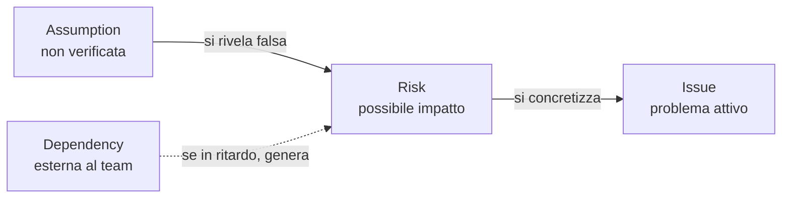
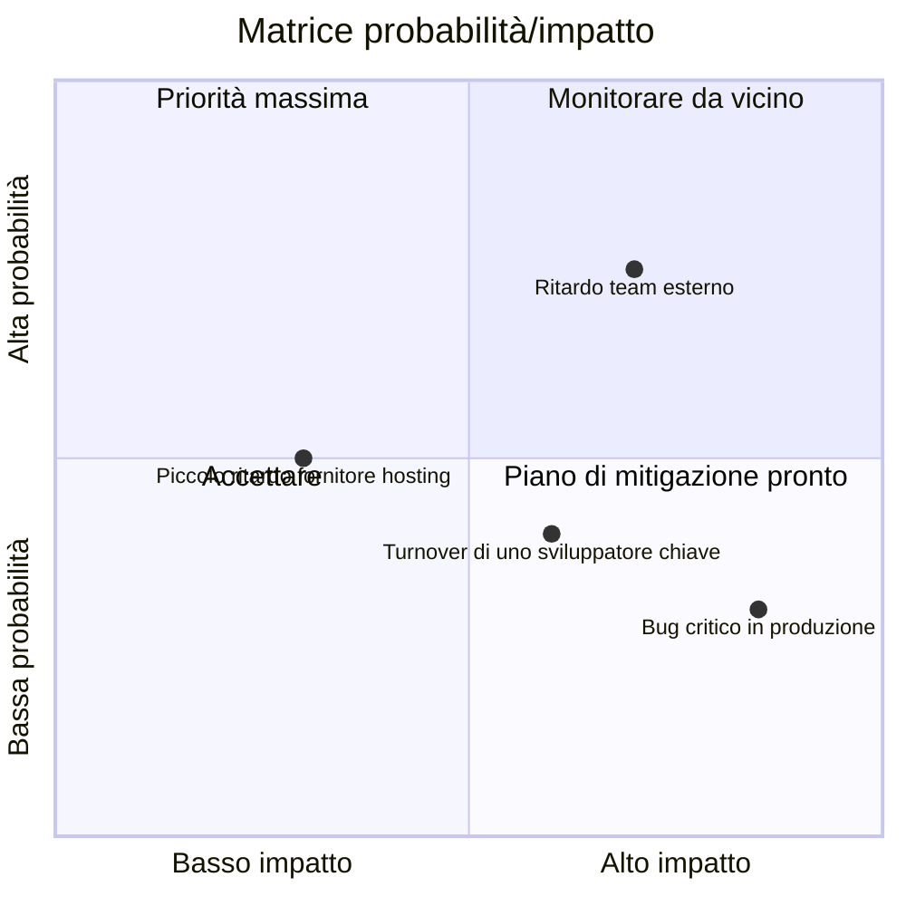
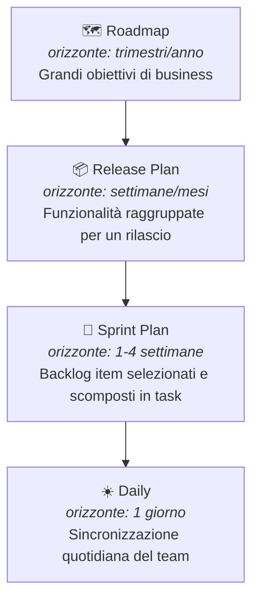

# 8. Project Management


> 📄 **[Scarica questa sezione in PDF](../../pdf/08-project-management.pdf)** — utile per la stampa o la lettura offline.


Hai già visto Agile, Scrum e Kanban: sai quindi **come** un team organizza
il lavoro giorno per giorno (sprint, board, colonne, cerimonie). Questa
sezione affronta un livello diverso, complementare: quello del **Project
Management**, cioè l'insieme di strumenti e pratiche che permettono di
tenere sotto controllo un progetto nel suo complesso — chi è coinvolto,
cosa può andare storto, a che punto siamo, e come lo comunichiamo a chi non
è nella daily standup ogni giorno.

Attenzione a un equivoco comune: il Project Management **non è** la
pianificazione rigida "a cascata" (Waterfall) che magari hai studiato
all'università, con Gantt chart bloccati e fasi sequenziali immutabili. In
un contesto Agile/DevOps, il project management convive con
l'iterazione continua e l'incertezza: si pianifica, sì, ma a più livelli e
con la consapevolezza che il piano cambierà. Il ruolo del Project Manager
(o di chi ne fa le funzioni, come uno Scrum Master "aumentato" o un Delivery
Manager) è più simile a un **navigatore che aggiorna la rotta ogni giorno**
che a un ingegnere che disegna un progetto immutabile su carta.

## 🎯 Obiettivi della sezione

Alla fine di questa sezione saprai:

- identificare gli **stakeholder** di un progetto software e capire perché
  vanno mappati;
- usare un **RAID Log** per tenere traccia di rischi, assunzioni, problemi
  e dipendenze;
- leggere e costruire una **matrice RACI** per chiarire le responsabilità;
- distinguere una **milestone** da una semplice scadenza;
- valutare un **rischio** in termini di probabilità e impatto, e capire
  come si mitiga;
- capire come funziona la **pianificazione a più livelli** in un contesto
  Agile (roadmap, release plan, sprint plan);
- riconoscere gli strumenti di **monitoraggio** dell'andamento di un team
  (burndown/burnup, stand-up, dashboard);
- conoscere i principali **KPI** usati in un team Agile/DevOps;
- distinguere i diversi livelli di **reportistica**, a seconda di chi la
  legge.

---

## 8.1 Stakeholder: chi ha interesse nel progetto

Uno **stakeholder** (letteralmente "portatore di interesse") è **qualsiasi
persona o gruppo che può influenzare il progetto, oppure che ne è
influenzato**. Non sono solo "quelli che pagano": sono tutti quelli che, in
un modo o nell'altro, hanno voce in capitolo o subiscono le conseguenze
delle decisioni prese.

> 💡 **Analogia**: organizzare un progetto software senza mappare gli
> stakeholder è come organizzare un matrimonio pensando solo agli sposi.
> In realtà ci sono genitori che pagano parte del conto, invitati con
> esigenze alimentari particolari, il fotografo che deve essere informato
> sugli orari, il comune che deve validare i documenti. Se ignori qualcuno
> di questi soggetti, il giorno dell'evento emergono problemi che potevi
> prevedere con un minimo di mappatura.

In un progetto software tipico, gli stakeholder principali sono:

- **Il cliente** (o il committente): chi ha commissionato il progetto e ne
  finanzia lo sviluppo. Vuole vedere valore consegnato, rispetto dei tempi
  e dei costi concordati.
- **Il management** (interno all'azienda che sviluppa): responsabili di
  linea, direttori, chi deve rendere conto a sua volta di come vanno i
  progetti del team.
- **Gli utenti finali**: le persone che useranno concretamente il software
  ogni giorno. Spesso non partecipano alle decisioni, ma sono chi subisce
  più direttamente le conseguenze di scelte sbagliate (un'interfaccia
  scomoda, una funzionalità mancante).
- **Il team**: sviluppatori, tester, designer, chiunque contribuisca alla
  realizzazione. Sono stakeholder anche loro: un carico di lavoro
  insostenibile o requisiti ambigui li riguardano direttamente.
- **Altri team o reparti**: un team di sicurezza che deve validare il
  rilascio, un team di infrastruttura che gestisce i server, un ufficio
  legale che deve approvare termini contrattuali.

Una mappatura semplice, spesso usata nella pratica, classifica gli
stakeholder in base a due dimensioni: **quanto potere/influenza hanno** sul
progetto e **quanto interesse** hanno nel suo esito.

```mermaid
quadrantChart
    title Mappa degli stakeholder (potere vs interesse)
    x-axis Basso interesse --> Alto interesse
    y-axis Basso potere --> Alto potere
    quadrant-1 Gestire con attenzione
    quadrant-2 Coinvolgere attivamente
    quadrant-3 Monitorare
    quadrant-4 Informare periodicamente
    Cliente (sponsor): [0.85, 0.9]
    Management interno: [0.6, 0.85]
    Utenti finali: [0.8, 0.35]
    Team di sviluppo: [0.7, 0.4]
    Team infrastruttura: [0.4, 0.55]
    Ufficio legale: [0.2, 0.6]
```

**Esempio pratico**: nel progetto per una nuova funzionalità di pagamento
online, il cliente ha alto potere e alto interesse (va coinvolto attivamente
in ogni decisione importante); il team di sicurezza interno ha alto potere
ma interesse più episodico (va coinvolto nei momenti critici, come la
validazione prima del rilascio in produzione); gli utenti finali hanno alto
interesse ma poco potere diretto sulle decisioni (vanno rappresentati
tramite ricerche utente, feedback, test di usabilità).

Perché questo conta per un Junior Project Manager? Perché la causa più
comune di problemi in un progetto non è "il codice non funziona", ma
**qualcuno importante non è stato informato o coinvolto al momento giusto**.
Mappare gli stakeholder all'inizio ti evita sorprese a metà progetto.

---

## 8.2 RAID Log: la mappa dei problemi (prima che diventino problemi)

**RAID** è un acronimo che raggruppa quattro categorie di informazioni che
un team di progetto deve tracciare costantemente:

- **R — Risks** (Rischi): eventi che *potrebbero* accadere e che, se
  accadono, avrebbero un impatto negativo sul progetto.
- **A — Assumptions** (Assunzioni): cose che stiamo dando per scontate,
  senza averle verificate al 100%, per poter procedere con la
  pianificazione.
- **I — Issues** (Problemi): cose che *sono già accadute* e stanno
  attivamente impattando il progetto ora.
- **D — Dependencies** (Dipendenze): elementi esterni al controllo diretto
  del team, di cui il progetto ha bisogno per procedere.

> 💡 **Analogia**: il RAID Log è come il cruscotto di un'automobile durante
> un lungo viaggio. Il rischio è la spia della benzina che si accende
> prima che tu resti a secco (un avviso preventivo). L'assunzione è il
> presupposto "ci sarà un distributore aperto lungo la strada" — non
> l'hai verificato, ma stai viaggiando come se fosse vero. Il problema è il
> pneumatico che si è già bucato: è già successo, va gestito subito. La
> dipendenza è il fatto che, per attraversare un ponte, devi aspettare che
> apra alle 8, che tu lo voglia o no: non lo controlli, ma ne dipendi.

Un esempio concreto di ciascuna categoria, per un progetto software reale:

| Categoria | Esempio concreto |
|---|---|
| **Risk** | "C'è il rischio che il carico di traffico previsto per il Black Friday superi la capacità attuale dei server, causando lentezza o down del sito." (non è ancora successo, ma è possibile) |
| **Assumption** | "Stiamo pianificando la release assumendo che l'ambiente di test resti disponibile per tutto il mese; non abbiamo una conferma scritta dal team infrastruttura." |
| **Issue** | "Il servizio di invio email di terze parti è down da ieri: gli utenti non ricevono le email di conferma registrazione." (è già un problema attivo, in corso) |
| **Dependency** | "Il rilascio della nuova funzionalità di pagamento dipende dall'approvazione di sicurezza da parte di un team esterno al progetto, previsto per la settimana prossima." |

Nella pratica, un RAID Log è semplicemente una tabella condivisa (spesso in
un foglio, in una board dedicata, o in strumenti come Azure DevOps, che
vedremo nella sezione 10), aggiornata regolarmente, con colonne tipo:
descrizione, categoria, responsabile, impatto, stato, data di apertura,
azione prevista.

Un aspetto importante da capire: le **assunzioni**, se non verificate per
tempo, diventano facilmente **rischi**; e i **rischi**, se non mitigati per
tempo, diventano **issue** attive. Il RAID Log serve proprio a intercettare
questa "scala di gravità" prima che il problema esploda a valle.



---

## 8.3 RACI: chi fa cosa (e chi deve solo saperlo)

Una delle domande più comuni — e più fonte di attriti — in un progetto è:
**"chi decide su questo?"** o **"a chi tocca fare questa cosa?"**. La
matrice **RACI** è uno strumento semplice per chiarirlo prima che diventi un
problema, assegnando a ogni attività uno dei quattro ruoli:

- **R — Responsible** (Esecutore): chi materialmente **fa il lavoro**.
- **A — Accountable** (Responsabile finale): chi **risponde del risultato**
  davanti a tutti — è la persona che, se qualcosa va storto, deve
  rispondere. Per ogni attività dovrebbe essercene **uno solo**, per
  evitare ambiguità.
- **C — Consulted** (Consultato): chi viene **coinvolto per un parere**
  prima che la decisione/attività sia completata, con una comunicazione a
  doppio senso (gli chiedi qualcosa, lui risponde).
- **I — Informed** (Informato): chi viene **aggiornato dopo il fatto**, con
  comunicazione a senso unico (non partecipa alla decisione, ma deve
  saperlo).

> 💡 **Analogia**: pensa a un ristorante durante il servizio. Il cameriere
> che porta il piatto al tavolo è il *Responsible*: esegue l'azione. Lo chef
> di cucina è l'*Accountable*: risponde della qualità del piatto che esce
> dalla sua cucina. Il sommelier viene *Consulted* se il cliente chiede
> un abbinamento particolare di vino. Il titolare del ristorante è
> *Informed*: alla fine della serata gli viene detto quanti coperti sono
> stati serviti, ma non ha partecipato a nessun piatto.

**Esempio pratico**: matrice RACI per l'attività "rilascio di una nuova
funzionalità in produzione".

| Attività | Sviluppatore | Tech Lead | Project Manager | QA / Tester | Cliente |
|---|---|---|---|---|---|
| Sviluppo del codice | **R** | C | I | I | — |
| Code review | C | **A** / R | I | I | — |
| Test della funzionalità | I | C | I | **R** | — |
| Decisione go/no-go al rilascio | I | C | **A** | C | I |
| Esecuzione del rilascio (deploy) | C | **R** | I | I | — |
| Comunicazione al cliente dell'avvenuto rilascio | I | I | **R** / A | I | **I** |

Qualche osservazione utile da tenere a mente quando costruisci una RACI:

- Per ogni riga ci dovrebbe essere **esattamente una A** (Accountable):
  se nessuno è accountable, nessuno risponde davvero del risultato; se ce
  ne sono troppe, si diluisce la responsabilità e nelle emergenze "si
  scaricano" a vicenda.
- Una stessa persona può essere sia R che A sulla stessa attività (come il
  Tech Lead nella code review, sopra), specialmente in team piccoli.
- Troppi "C" su un'attività la rendono lenta: ogni consultazione è un
  potenziale collo di bottiglia. Usa "C" solo dove il parere serve
  davvero.

---

## 8.4 Milestone: un traguardo, non una scadenza qualsiasi

Una **milestone** (pietra miliare) è un **punto significativo** nel percorso
del progetto: segna il raggiungimento di qualcosa di rilevante, non
semplicemente il passaggio di una data sul calendario.

> 💡 **Analogia**: pensa a una gara ciclistica a tappe. Ogni tappa ha
> ovviamente una data di arrivo, ma alcuni punti del percorso sono
> **traguardi volanti** o **cime di montagna**: superarli non è solo "un
> altro chilometro fatto", è un momento che tutti notano, che dà punteggio
> a parte, che segna davvero un salto di fase della corsa. Una scadenza
> qualsiasi è come un cartello chilometrico: utile per orientarsi, ma non
> cambia la narrazione della corsa. Una milestone è il traguardo di tappa.

La differenza pratica:

| | Scadenza semplice | Milestone |
|---|---|---|
| **Cosa segna** | Il completamento di un compito operativo | Il raggiungimento di un obiettivo significativo per il progetto |
| **Visibilità** | Interna al team, spesso operativa | Comunicata anche a stakeholder esterni |
| **Esempio** | "Completare la migrazione del database di test entro venerdì" | "Ambiente di test pronto e validato dal cliente" |
| **Conseguenza se manca** | Si riorganizza il lavoro della settimana | Può avere impatto su comunicazioni contrattuali, pianificazione di altri team, aspettative del cliente |

Esempi concreti di milestone in un progetto software: "fine della fase di
analisi dei requisiti", "prima release disponibile per un gruppo pilota di
utenti (beta)", "completamento dei test di sicurezza", "go-live in
produzione", "primo mese di produzione senza incidenti critici". Non sono
attività in sé, ma **traguardi** che raccontano un salto di stato del
progetto.

In un contesto Agile, le milestone convivono bene con gli sprint: uno
sprint può contribuire a una milestone senza esaurirla, e una milestone
spesso coincide con la fine di una serie di sprint (ad esempio, la fine di
una release che raggruppa più sprint).

---

## 8.5 Rischio: identificare, valutare, mitigare

Un **rischio** è un evento incerto che, se si verifica, ha un impatto
(di solito negativo, anche se esistono rischi "positivi", cioè opportunità)
sul progetto. Gestire i rischi non significa eliminarli tutti — è
impossibile — ma **conoscerli in anticipo** e decidere consapevolmente cosa
fare.

Il processo tipico ha tre fasi:

1. **Identificazione**: elencare cosa potrebbe andare storto. Si fa in
   team, spesso in un momento dedicato (es. durante la pianificazione di
   una release), con tecniche semplici come il brainstorming o rivedendo i
   rischi materializzati in progetti simili passati.
2. **Valutazione**: per ogni rischio, stimare **probabilità** (quanto è
   plausibile che accada) e **impatto** (quanto danno farebbe se
   accadesse). Spesso si usa una scala semplice (basso/medio/alto) e si
   visualizza in una matrice.
3. **Mitigazione**: decidere una strategia. Le opzioni classiche sono:
   - **evitare** il rischio (cambiare approccio per non incontrarlo);
   - **ridurre** probabilità o impatto (azioni preventive);
   - **trasferire** il rischio (es. a un fornitore, con un'assicurazione
     contrattuale);
   - **accettare** il rischio consapevolmente, se il costo di mitigarlo
     supera il danno potenziale, tenendo comunque un piano B pronto.



**Esempio concreto**: "rischio di ritardo per dipendenza da un altro team".

- **Descrizione del rischio**: la nuova funzionalità di pagamento richiede
  che il team di infrastruttura fornisca un nuovo ambiente sicuro entro
  due settimane; quel team ha già altri due progetti in corso.
- **Probabilità**: media-alta (il team esterno è oggettivamente
  sovraccarico, lo si vede dal loro backlog).
- **Impatto**: alto (senza quell'ambiente, il rilascio non può partire, e
  la data comunicata al cliente è a rischio).
- **Mitigazione**: si chiede una conferma scritta della data al team
  infrastruttura appena possibile (per trasformare l'assunzione in un
  impegno verificato); si valuta un piano B con un ambiente temporaneo
  meno performante ma disponibile prima; si comunica per tempo al cliente
  che esiste un rischio, invece di scoprirlo a due giorni dalla scadenza.

Da notare come questo esempio collega direttamente rischio, assunzione e
dipendenza — gli stessi concetti visti nel RAID Log: non sono strumenti
separati, ma **lenti diverse sullo stesso terreno**.

---

## 8.6 Pianificazione in un contesto Agile: livelli, non un unico piano

Nel project management "a cascata" tradizionale, l'idea è pianificare tutto
in anticipo, in un unico grande piano dettagliato. In un contesto
Agile/DevOps si pianifica invece **a più livelli**, con dettaglio crescente
man mano che ci si avvicina all'esecuzione — perché sappiamo che i dettagli
lontani nel tempo cambieranno comunque, mentre quelli vicini devono essere
affidabili.

I livelli tipici, dal più generale al più operativo:

1. **Roadmap**: la visione a lungo termine (mesi/trimestri/anno), con i
   grandi temi e obiettivi di business. Non contiene dettagli tecnici, ma
   direzioni: "nel primo trimestre miglioriamo l'esperienza di checkout",
   "nel secondo trimestre lanciamo l'app mobile".
2. **Release Plan**: un livello più concreto, che raggruppa più sprint per
   arrivare a un rilascio significativo per gli utenti o il cliente. Qui
   iniziano a comparire funzionalità specifiche e stime di massima.
3. **Sprint Plan**: il piano del singolo sprint (di solito 1-4 settimane,
   come hai visto nella sezione su Scrum), con gli elementi di backlog
   selezionati e scomposti in attività concrete.
4. **Daily**: l'allineamento quotidiano del team (la daily standup), dove
   si sincronizza il lavoro del singolo giorno rispetto all'obiettivo dello
   sprint.



Il punto chiave da capire, come futuro Project Manager: **più ti allontani
nel tempo, meno il piano deve essere dettagliato — e va bene così**. Una
roadmap troppo dettagliata è quasi sempre sbagliata (perché il futuro
lontano è incerto), mentre uno sprint plan troppo vago è inutile (perché il
team deve poter lavorare su qualcosa di concreto già domani mattina). Il
tuo compito non è "prevedere tutto", ma tenere questi livelli **coerenti
tra loro** e aggiornarli quando la realtà li smentisce.

---

## 8.7 Monitoraggio: come si tiene traccia dell'andamento

Pianificare non basta: bisogna anche **verificare costantemente** se si sta
procedendo come previsto, per poter reagire in tempo (non a fine progetto,
quando è troppo tardi).

Gli strumenti principali di monitoraggio in un contesto Agile:

- **Daily stand-up**: il momento quotidiano (di solito 15 minuti, in
  piedi) in cui il team si sincronizza su cosa è stato fatto, cosa si farà
  e quali ostacoli ci sono. È monitoraggio "in tempo reale", fatto dal team
  per il team.
- **Burndown chart**: mostra quanto lavoro **rimane** da fare in uno
  sprint (o in una release), giorno per giorno. La linea scende verso zero
  man mano che il lavoro si completa; una linea ideale tratteggiata mostra
  dove "dovremmo essere" per finire in tempo.
- **Burnup chart**: mostra quanto lavoro **è stato completato**, rispetto
  al totale previsto — utile soprattutto se lo scope cambia durante il
  progetto (con il burnup vedi anche se il "totale" sale, mentre il
  burndown da solo può confondere un aumento di scope con un rallentamento
  del team).
- **Dashboard**: pannelli visuali (spesso in Azure DevOps, Jira, o simili)
  che aggregano lo stato del backlog, delle Pull Request aperte, dei
  risultati delle pipeline di CI/CD, in un colpo d'occhio.

Un burndown chart "sano" tende ad avvicinarsi a una linea diagonale che
scende gradualmente verso zero. Una rappresentazione testuale semplificata,
per capire visivamente la forma:

```
Lavoro rimanente (story point)
40 |*
   |  *
30 |     *  ← andamento ideale (linea dritta)
   |  ●     *
20 |     ●        *
   |        ●        *
10 |           ●         *
   |              ●          *
 0 +-----------------------------●---- 0
   Giorno: 1   2   3   4   5   6   7   8   9  10
   * = andamento ideale     ● = andamento reale del team
```

In questo esempio, il team parte più lento del previsto (la linea reale sta
sopra quella ideale nei primi giorni — un possibile segnale di rischio da
discutere in stand-up), ma recupera nella seconda metà dello sprint,
chiudendo comunque a zero entro la fine. Un Project Manager non guarda solo
"se" la linea arriva a zero, ma **come** ci arriva: una discesa brusca solo
nell'ultimo giorno è spesso il sintomo di lavoro "spuntato" tutto insieme a
fine sprint, non di un reale progresso quotidiano.

---

## 8.8 KPI: gli indicatori chiave per un team Agile/DevOps

Un **KPI** (Key Performance Indicator, indicatore chiave di prestazione) è
una misura quantitativa che aiuta a capire se le cose stanno andando bene,
senza doversi fidare solo di impressioni soggettive ("mi pare che stiamo
andando bene" non è un dato).

Alcuni KPI molto usati nei team Agile e DevOps:

| KPI | Cosa misura | Perché è utile |
|---|---|---|
| **Velocity** | Quanti story point (o elementi di backlog) il team completa in media per sprint | Aiuta a pianificare quanto lavoro inserire negli sprint futuri, in modo realistico |
| **Lead time** | Tempo totale dalla richiesta di una funzionalità (apertura dell'elemento di backlog) al suo rilascio effettivo agli utenti | Misura quanto velocemente il team trasforma un'idea in valore consegnato |
| **Cycle time** | Tempo dall'inizio effettivo del lavoro su un elemento (non dalla richiesta) al suo completamento | Più mirato del lead time: misura l'efficienza del "fare", non dell'attesa in coda |
| **Defect rate** | Numero di bug rilevati (spesso in produzione) rispetto al volume di lavoro consegnato | Segnala la qualità di quanto viene rilasciato |
| **Deployment frequency** | Quante volte si rilascia in produzione in un dato periodo | KPI tipicamente DevOps: più alta è, di solito, più il processo di rilascio è maturo e automatizzato |
| **Mean Time To Recovery (MTTR)** | Tempo medio per ripristinare il servizio dopo un incidente in produzione | Misura la resilienza del team/sistema, non solo la sua velocità |
| **Sprint goal success rate** | Percentuale di sprint in cui l'obiettivo dello sprint viene effettivamente raggiunto | Indica se la pianificazione degli sprint è realistica |

Un avvertimento importante, da futuro Project Manager: i KPI vanno usati
per **capire e migliorare il processo**, non per giudicare o "punire" le
singole persone del team (es. confrontare la velocity di due sviluppatori
diversi è quasi sempre un errore metodologico, perché la velocity dipende
dal team nel suo insieme, dalla complessità del lavoro assegnato, e non è
comparabile tra persone o addirittura tra team diversi). Usato male, un KPI
distrugge la fiducia del team; usato bene, aiuta tutti a vedere dove
migliorare.

---

## 8.9 Reportistica: cosa riportare, a chi, e con quale livello di dettaglio

Riportare lo stato di avanzamento è una delle attività più quotidiane di un
Project Manager, ma non tutti i report sono uguali: **il livello di
dettaglio deve adattarsi a chi lo legge**.

> 💡 **Analogia**: pensa a come racconti la tua giornata a persone diverse.
> A un collega stretto racconti ogni dettaglio tecnico di un problema che
> hai risolto. A tuo padre, la sera, dici semplicemente "giornata
> impegnativa ma è andata bene". Nessuna delle due versioni è "più vera"
> dell'altra: sono adatte a interlocutori diversi, con bisogni informativi
> diversi.

Due macro-categorie di report, con caratteristiche molto diverse:

| | Report per il management/cliente | Report operativi per il team |
|---|---|---|
| **Frequenza tipica** | Settimanale o mensile | Quotidiana o per sprint |
| **Livello di dettaglio** | Alto livello: stato generale, rischi principali, milestone raggiunte o a rischio | Dettagliato: singoli task, blocchi tecnici, chi sta facendo cosa |
| **Linguaggio** | Orientato al business, senza gergo tecnico | Tecnico, con riferimenti diretti a task, PR, ambienti |
| **Contenuto tipico** | Avanzamento % rispetto alla roadmap, KPI di sintesi, rischi da RAID Log con impatto su tempi/costi | Burndown/burnup dello sprint, stato delle Pull Request, esito delle pipeline CI/CD |
| **Obiettivo** | Dare fiducia e visibilità decisionale a chi non segue i dettagli ogni giorno | Coordinare il lavoro quotidiano e risolvere blocchi in tempo reale |

**Esempio pratico**: la stessa informazione — "il rilascio della nuova
funzionalità di pagamento slitta di una settimana per un problema di
sicurezza emerso nei test" — viene comunicata in due modi molto diversi:

- **Al cliente/management**: "Il rilascio della funzionalità di pagamento
  è posticipato di una settimana per garantire il rispetto degli standard
  di sicurezza richiesti. Non ci sono impatti sul budget. Nuova data
  prevista: [data]."
- **Al team, in stand-up o nella dashboard operativa**: "Il test di
  sicurezza automatizzato ha rilevato una vulnerabilità nella gestione dei
  token di sessione nel modulo di pagamento (vedi issue #128); serve un
  fix nel branch `fix/token-sicurezza` prima di riaprire la Pull Request
  e far ripartire la pipeline."

Stessa realtà, due livelli di risoluzione informativa. Un errore comune dei
Project Manager junior è portare al cliente il livello di dettaglio
tecnico del team (che genera confusione e ansia inutile), oppure, al
contrario, dare al team solo informazioni di alto livello (che non bastano
per lavorare). Imparare a "tradurre" tra questi due livelli è una delle
competenze più preziose del ruolo.

---

## 8.10 Riepilogo

In questa sezione hai visto come i concetti di project management si
inseriscano in un contesto Agile/DevOps, senza contraddire ciò che hai
imparato su Scrum e Kanban, ma completandolo con una vista più ampia sul
progetto nel suo insieme:

- gli **stakeholder** ti dicono chi coinvolgere e come;
- il **RAID Log** ti dà un metodo per non farti sorprendere da rischi,
  assunzioni non verificate, problemi e dipendenze;
- la **RACI** chiarisce chi fa cosa, evitando ambiguità e conflitti;
- le **milestone** segnano i traguardi che contano davvero, distinti dalle
  scadenze operative quotidiane;
- la gestione del **rischio** ti allena a pensare in anticipo, non solo a
  reagire;
- la **pianificazione a più livelli** (roadmap, release plan, sprint plan,
  daily) convive naturalmente con l'incertezza tipica di un progetto Agile;
- il **monitoraggio** (stand-up, burndown/burnup, dashboard) ti permette di
  intercettare deviazioni mentre sono ancora piccole;
- i **KPI** ti danno numeri oggettivi su cui basare le decisioni, se usati
  con criterio;
- la **reportistica** ti insegna che comunicare bene significa adattare il
  dettaglio a chi ascolta, non ripetere sempre lo stesso messaggio.

Nelle prossime sezioni vedrai come molti di questi concetti si traducano in
strumenti concreti: la cultura DevOps (sezione 9) e la piattaforma Azure
DevOps (sezione 10) offrono board, dashboard, work item e pipeline che
mettono in pratica esattamente ciò che hai visto qui — RAID Log, RACI,
burndown chart e KPI diventano funzionalità cliccabili in uno strumento
reale.

---

## 🔗 Collegamenti

- [9. DevOps](../09-devops/README.md) — la cultura e le pratiche che rendono possibile un monitoraggio continuo e KPI come deployment frequency e MTTR
- [10. Azure DevOps](../10-azure-devops/README.md) — dove RACI, RAID Log, burndown chart e dashboard diventano strumenti concreti da usare ogni giorno

## 📚 Risorse

- [PMI — Project Management Institute](https://www.pmi.org/)
- [PMBOK Guide — panoramica](https://www.pmi.org/pmbok-guide-standards)
- [Atlassian — Guida ai KPI Agile](https://www.atlassian.com/agile/project-management/metrics)
- [Atlassian — Cos'è un RACI Chart](https://www.atlassian.com/work-management/project-management/raci-chart)
- [Atlassian — Stakeholder analysis](https://www.atlassian.com/work-management/project-management/stakeholder-analysis)
- [Atlassian — Burndown chart](https://www.atlassian.com/agile/tutorials/burndown-charts)
- [Scrum.org — Risk Management in Scrum](https://www.scrum.org/resources/blog)
- [Axelos — PRINCE2 e RAID Log](https://www.axelos.com/certifications/propath/project-management-prince2)
