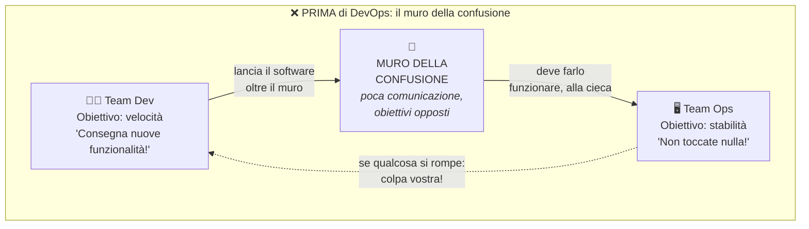
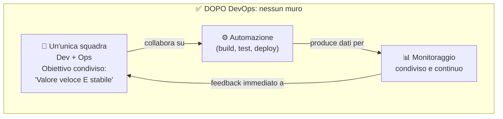
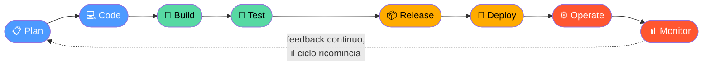
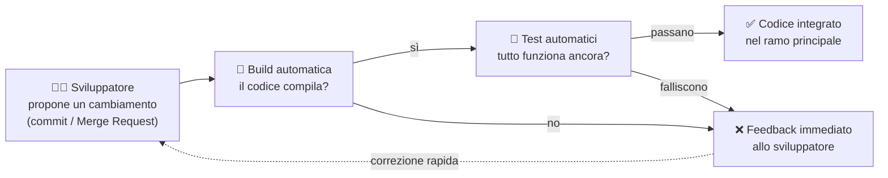
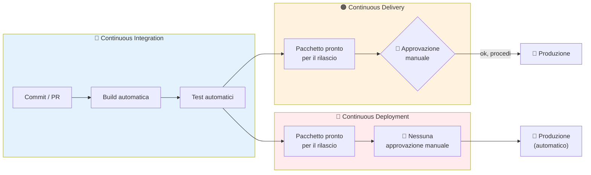
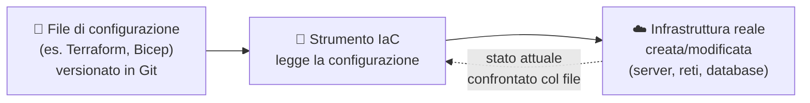
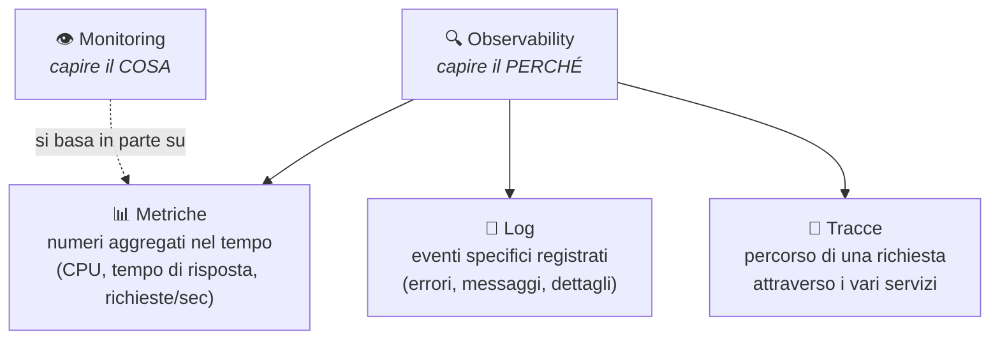

# 9. DevOps


> 📄 **[Scarica questa sezione in PDF](https://darioschioppi.github.io/corso-onboarding-devops/pdf/09-devops.pdf)** — utile per la stampa o la lettura offline.


Nelle sezioni precedenti hai imparato **come un team organizza il lavoro**
(Agile, Scrum, Kanban) e **come si tiene sotto controllo un progetto** nel
suo complesso (Project Management, con stakeholder, RAID Log, RACI, KPI).
Questa sezione affronta un tema diverso, e altrettanto centrale per il
lavoro che farai ogni giorno: **come il software, una volta scritto, arriva
davvero nelle mani degli utenti — e come ci resta, funzionando bene, nel
tempo.**

Questo è il mondo di **DevOps**. È una delle parole che sentirai
pronunciare più spesso nel tuo team, quasi sempre associata a strumenti
molto concreti (pipeline, ambienti, dashboard) che vedrai nel dettaglio
nella prossima sezione, dedicata ad Azure DevOps. Ma prima di usare gli
strumenti, devi capire **l'idea** che c'è dietro — perché DevOps, prima di
essere una piattaforma o un insieme di pratiche tecniche, è **un modo di
pensare al lavoro del team**. Se capisci bene questa sezione, tutto quello
che vedrai dopo (pipeline, ambienti, monitoraggio, sicurezza) ti sembrerà
la conseguenza naturale di un'idea semplice, non un elenco di strumenti
scollegati tra loro.

Per rendere tutto più concreto, in questa sezione useremo un unico
progetto di riferimento, che ritroverai anche nelle sezioni successive:
**ShopFacile**, una piattaforma e-commerce (catalogo prodotti, carrello,
ordini, pagamenti, sconti) sviluppata da un piccolo team interno composto,
tra gli altri, da **Marco** e **Giulia** (developer), **Ahmed** (developer
junior, in crescita), **Sara** (Product Owner) e **Luca** (Scrum Master).
Vedrai questi nomi tornare più volte: non sono persone diverse in ogni
esempio, ma lo stesso team che affronta, di volta in volta, un problema
diverso.

## 🎯 Obiettivi della sezione

Alla fine di questa sezione saprai:

- spiegare **cos'è DevOps** e perché non è "uno strumento" ma una cultura;
- raccontare **perché è nato** DevOps, partendo dal problema storico del
  "muro della confusione" tra sviluppo e infrastruttura;
- riconoscere gli elementi chiave della **cultura DevOps** (collaborazione,
  responsabilità condivisa, blameless culture) e il modello **CALMS**;
- capire perché **l'automazione** è al centro di DevOps, con esempi
  concreti;
- distinguere con precisione **Continuous Integration**, **Continuous
  Delivery** e **Continuous Deployment** — tre termini che si confondono
  facilmente, ma che indicano cose diverse;
- capire cos'è l'**Infrastructure as Code** e perché ha cambiato il modo di
  gestire server e reti;
- distinguere **monitoring**, **observability** e **logging**, tre
  attività complementari per capire lo stato di un sistema in produzione.

---

## 9.1 Cos'è DevOps: non è un tool, è una cultura

La parola **DevOps** nasce dalla fusione di due parole inglesi:

- **Dev**elopment — lo **sviluppo** del software: scrivere codice, creare
  nuove funzionalità, correggere bug.
- **Op**eration**s** — le **operazioni**: tutto ciò che serve per far
  funzionare quel software in un ambiente reale, con utenti reali —
  server, reti, database, sicurezza, backup, monitoraggio.

DevOps è quindi, letteralmente, **l'unione di questi due mondi**. Ma qui
sta il punto più importante da capire, e su cui vale la pena insistere
subito: **DevOps non è un software che si installa, non è un ruolo con la
targhetta "DevOps Engineer" sulla porta, e non è nemmeno un insieme fisso
di pipeline**. DevOps è prima di tutto **una cultura**: un modo di
organizzare le persone, i processi e (solo successivamente) gli strumenti,
in modo che chi scrive il codice e chi lo fa funzionare in produzione
lavorino **insieme**, verso lo stesso obiettivo, invece che come due
squadre separate con interessi contrapposti.

> 💡 **Analogia**: pensa a un ristorante. Se la cucina (chi cucina i piatti,
> lo "sviluppo") e la sala (chi li serve al cliente e gestisce i reclami,
> le "operazioni") lavorano come due mondi separati — la cucina si
> disinteressa di cosa succede quando il piatto arriva al tavolo, la sala
> non sa mai perché un piatto è in ritardo o come è stato preparato — il
> risultato è un servizio lento, con errori che nessuno riesce a spiegare e
> tutti scaricano sull'altro reparto. Un ristorante che funziona bene ha
> invece cucina e sala che comunicano costantemente: sanno cosa succede
> dall'altra parte, si scambiano informazioni in tempo reale, e se un
> piatto torna indietro non si accusano a vicenda, ma capiscono insieme
> cosa è andato storto per non farlo succedere di nuovo. DevOps è
> esattamente questo, applicato allo sviluppo software: fare in modo che
> "chi cucina il codice" e "chi lo serve agli utenti" lavorino come **una
> sola squadra**, non come due squadre che si passano un pacco.

Vale la pena essere ancora più precisi su un equivoco molto comune, perché
lo sentirai spesso sul lavoro: quando qualcuno dice "usiamo Azure DevOps"
o "abbiamo automatizzato con strumenti DevOps", si riferisce agli
**strumenti** che rendono più facile *applicare* la cultura DevOps (ad
esempio le pipeline di cui parleremo più avanti). Ma installare quegli
strumenti **non rende automaticamente un team "DevOps"**, così come
comprare attrezzi da falegname non fa di te un falegname. Gli strumenti
aiutano, e sono importanti — li vedrai nel dettaglio nella prossima
sezione — ma senza il cambiamento di cultura e di collaborazione, restano
scatole vuote.

Ma se DevOps è "solo" una cultura, perché è diventata così centrale nel
lavoro quotidiano di un team come quello di ShopFacile? Per rispondere
bisogna guardare al problema concreto che ha spinto a inventarla: torniamo
indietro a come lavoravano i team **prima** che DevOps esistesse.

---

## 9.2 Perché nasce DevOps: il muro della confusione

Per capire perché DevOps è diventato così importante, bisogna capire il
problema che risolve. E per capirlo, bisogna tornare a come funzionavano
(e in molte aziende funzionano ancora) i team di sviluppo e di
infrastruttura **prima** di DevOps.

### Il mondo prima di DevOps: due team, due obiettivi opposti

Tradizionalmente, in molte organizzazioni, esistevano due reparti separati,
spesso con manager diversi, obiettivi diversi e persino uffici diversi:

- Il team di **sviluppo (Dev)**, il cui obiettivo — spesso l'unico su cui
  veniva valutato — era **consegnare nuove funzionalità velocemente**. Più
  release, più funzionalità, più velocità: questo veniva premiato.
- Il team di **operazioni/infrastruttura (Ops)**, il cui obiettivo era
  **mantenere i sistemi stabili, sicuri e sempre disponibili**. Ogni
  cambiamento nei sistemi in produzione è un potenziale rischio di down: il
  loro obiettivo, spesso l'unico su cui venivano valutati, era **la
  stabilità**, non la velocità.

Il problema è evidente non appena lo si scrive esplicitamente: **questi due
obiettivi sono in tensione tra loro**. Il team di sviluppo vuole rilasciare
spesso e velocemente; il team di operazioni vuole cambiare le cose il meno
possibile, perché ogni cambiamento è un rischio per la stabilità che deve
garantire. Non è che uno dei due team avesse torto: **ciascuno stava
ottimizzando esattamente per quello su cui veniva giudicato**, ma il
risultato complessivo era un conflitto strutturale.

Questa frizione, con il tempo, ha preso un nome molto azzeccato nella
comunità tecnica: **"il muro della confusione" (wall of confusion)**. Il
team di sviluppo "lanciava" il software oltre un muro metaforico verso il
team di operazioni, che doveva farlo funzionare in produzione senza
averlo scritto, spesso senza documentazione adeguata, e senza aver preso
parte alle decisioni di progettazione. Quando qualcosa si rompeva in
produzione, ciascun team tendeva ad accusare l'altro: "il codice ha un
bug" contro "l'infrastruttura non era configurata bene" — e nessuno aveva
una visione completa per capire davvero cosa fosse successo.



### Perché questo era un problema reale (non solo "scomodo")

Questo modello creava conseguenze molto concrete, che vale la pena
elencare perché le riconoscerai facilmente in aziende che non hanno ancora
adottato una cultura DevOps:

- **Rilasci rari e rischiosi**: se rilasciare è complicato, doloroso e
  richiede il coinvolgimento manuale di tante persone, i team tendono a
  rilasciare raramente (una volta al mese, o anche meno). Ma rilasci rari
  significano rilasci **grandi**, che accumulano tanti cambiamenti insieme
  — e più cambiamenti insieme, più è probabile che qualcosa si rompa, e più
  è difficile capire *quale* cambiamento specifico ha causato il problema.
- **Colpa reciproca invece di soluzioni**: quando qualcosa andava storto in
  produzione, il tempo veniva spesso spreso a capire "di chi è la colpa"
  invece che a risolvere il problema e capire come evitarlo in futuro.
- **Comunicazione tardiva**: gli sviluppatori progettavano soluzioni senza
  sapere come sarebbero state effettivamente eseguite in produzione (quante
  risorse servono, quali vincoli di sicurezza esistono); il team
  operazioni riceveva richieste dell'ultimo minuto, senza tempo per
  prepararsi.
- **Lentezza percepita dal cliente**: il risultato finale, quello che
  conta davvero per chi ha commissionato il progetto, era che le nuove
  funzionalità richiedevano troppo tempo per arrivare davvero in mano agli
  utenti, anche quando il codice era pronto da settimane.

> 💡 Nota per un futuro Project Manager: molti dei rischi e delle issue che
> hai imparato a tracciare nel RAID Log (sezione 8) — ritardi nei rilasci,
> problemi di comunicazione tra team, dipendenze che si scoprono troppo
> tardi — sono spesso **sintomi diretti** dell'assenza di una cultura
> DevOps. Non è un caso che questi due argomenti siano collegati.

### La soluzione: eliminare il muro, non spostarlo

DevOps nasce esattamente per rispondere a questo problema, e lo fa non
"velocizzando" il lancio oltre il muro, ma **eliminando il muro stesso**.
L'idea è che sviluppo e operazioni non siano più due team separati con
obiettivi opposti, ma **un'unica squadra, con un obiettivo condiviso**:
consegnare valore agli utenti **velocemente e in modo stabile**, non l'uno
a scapito dell'altro.



Il punto chiave visualizzato nel diagramma sopra è che il flusso non è più
una linea a senso unico che "lancia" il lavoro da un team all'altro, ma un
**ciclo continuo di collaborazione e feedback**: lo stesso team che scrive
il codice si occupa (insieme, non da solo) anche di come funziona in
produzione, usa l'automazione per ridurre il rischio dei rilasci frequenti,
e riceve informazioni immediate su come il software si comporta nel mondo
reale — informazioni che tornano utili per il prossimo ciclo di sviluppo.
Vedremo nella prossima sezione (9.3) come questo ciclo si rappresenta in
modo ancora più esplicito con il celebre "simbolo a infinito" di DevOps.

---

## 9.3 Il ciclo DevOps: un percorso senza fine

Uno dei modi più famosi per rappresentare DevOps visivamente è un simbolo
a forma di **infinito (∞)**, diviso in otto fasi che si susseguono e non
finiscono mai: appena termina "Operate/Monitor", si riparte
immediatamente con "Plan" per il ciclo successivo. Questo simbolo comunica
un messaggio molto preciso: **DevOps non è un progetto con un inizio e una
fine, ma un flusso continuo**.

Le otto fasi tipiche del ciclo sono:

| Fase | Cosa succede | Chi è coinvolto principalmente |
|---|---|---|
| **Plan** | Si decide cosa costruire: requisiti, priorità, backlog (collegamento diretto con quanto visto in Agile/Scrum) | Product Owner, team, stakeholder |
| **Code** | Si scrive il codice della nuova funzionalità o della correzione | Sviluppatori |
| **Build** | Il codice viene compilato/assemblato in un pacchetto eseguibile, in modo automatico | Automazione (pipeline) |
| **Test** | Il pacchetto viene testato automaticamente (test unitari, di integrazione, talvolta di sicurezza) | Automazione + QA |
| **Release** | Il pacchetto testato viene preparato e approvato per il rilascio | Team + approvazioni |
| **Deploy** | Il pacchetto viene effettivamente installato/attivato nell'ambiente di produzione (o di test) | Automazione (pipeline) |
| **Operate** | Il sistema funziona in produzione, gestito e mantenuto | Operations / SRE |
| **Monitor** | Si osserva come si comporta il sistema in produzione, raccogliendo dati utili per il prossimo ciclo di pianificazione | Tutti, grazie a strumenti di monitoraggio |



Nota una cosa importante nella tabella e nel diagramma: le prime due fasi
(Plan, Code) corrispondono grosso modo al mondo **Dev** "classico"; le
ultime due (Operate, Monitor) al mondo **Ops** "classico". Le fasi centrali
(Build, Test, Release, Deploy) sono la "zona di confine" dove, storicamente,
si trovava il muro della confusione — ed è proprio lì che l'**automazione**
gioca il ruolo più importante, come vedremo nella prossima sezione, perché
è lì che il lavoro passa fisicamente da un mondo all'altro.

Il dettaglio da ricordare: **Monitor non è la fine del ciclo, è l'inizio
del ciclo successivo**. I dati raccolti osservando il sistema in produzione
(quanti utenti usano una funzionalità, dove si verificano errori, quali
parti sono lente) diventano input diretto per la prossima fase di Plan.
Questo è il motivo per cui il simbolo è un infinito e non una linea con un
punto di arrivo.

Conoscere le otto fasi del ciclo, però, non basta a farle funzionare bene
insieme: perché quel ciclo scorra senza attriti, serve che le persone che
lo attraversano — chi scrive il codice, chi lo gestisce in produzione —
si comportino secondo alcuni principi condivisi. È proprio a questi
principi, cioè alla cultura DevOps vera e propria, che dedichiamo il
prossimo paragrafo.

---

## 9.4 La cultura DevOps: collaborazione, responsabilità, fiducia

Abbiamo detto che DevOps è prima di tutto una cultura. Ma cosa significa
concretamente? Significa un insieme di comportamenti e valori condivisi
dal team, che si traducono in scelte quotidiane precise.

### Collaborazione, non "passaggio di consegne"

Nel modello vecchio, lo sviluppo "consegnava" al team operazioni, e la
comunicazione era spesso a senso unico e tardiva (un po' come il modello
"Informed" della RACI che hai visto nella sezione 8, applicato però a
qualcosa che avrebbe avuto bisogno di molto più coinvolgimento). Nella
cultura DevOps, sviluppo e operazioni **collaborano dall'inizio**: chi
scrive il codice pensa già a come sarà eseguito in produzione (quante
risorse servono, come si comporta sotto carico, come si può monitorare);
chi gestisce l'infrastruttura è coinvolto già nelle fasi di progettazione,
non solo quando il software è "pronto" e deve solo essere installato.

### Responsabilità condivisa: "you build it, you run it"

Una delle frasi più citate nella cultura DevOps è **"you build it, you run
it"** ("chi lo costruisce, lo gestisce anche"). Significa che il team che
scrive una funzionalità non se ne "disinteressa" una volta rilasciata: resta
coinvolto (spesso tramite turni di reperibilità, i cosiddetti *on-call*) 
anche quando quella funzionalità è in produzione e qualcosa va storto. 

> 💡 **Analogia**: è la differenza tra un ristorante dove il cuoco cucina e
> se ne va, lasciando alla sala il compito di gestire ogni reclamo su un
> piatto che non conosce nei dettagli, e un ristorante dove — se un cliente
> segnala un problema con un piatto — quel piatto torna direttamente al
> cuoco che lo ha preparato, perché è lui che ha davvero le informazioni e
> gli strumenti per capire cosa è andato storto e correggerlo.

Questo cambia gli incentivi in modo molto concreto: se sai che sarai tu (o
il tuo team) a dover gestire un problema alle tre di notte, scriverai
codice più robusto, penserai di più a come monitorarlo, e sarai più
motivato a collaborare con chi gestisce l'infrastruttura, perché non è più
"un problema di qualcun altro".

### Blameless culture: imparare dagli errori senza cercare un colpevole

Uno dei pilastri più importanti — e spesso più difficili da costruire
davvero — della cultura DevOps è la cosiddetta **blameless culture**
(cultura "senza colpa"). L'idea è semplice da enunciare ma richiede
maturità organizzativa per essere applicata davvero: **quando qualcosa va
storto (un bug critico, un'interruzione del servizio), l'obiettivo
dell'analisi che segue non è trovare "di chi è la colpa" per punirlo, ma
capire le cause reali per evitare che accada di nuovo**.

> 💡 **Analogia**: pensa alla differenza tra un'aviazione civile e un
> ambiente dove ogni errore viene punito severamente. Quando un aereo ha
> un incidente o un "quasi incidente", gli investigatori non cercano
> primariamente "chi punire": cercano di ricostruire la catena di eventi
> (un errore umano, ma anche una procedura poco chiara, uno strumento mal
> progettato, una comunicazione ambigua) per correggere il **sistema**, non
> solo la persona. Questo è uno dei motivi per cui il trasporto aereo è
> diventato via via più sicuro nel tempo: chi commette un errore in buona
> fede lo segnala subito, perché sa che verrà usato per migliorare, non per
> essere licenziato.

Nel contesto DevOps, questo si traduce in pratiche concrete come il
**post-mortem** (o *retrospettiva sull'incidente*): dopo un problema
importante in produzione, il team si riunisce per ricostruire cosa è
successo, con una linea temporale precisa, e per proporre azioni concrete
di miglioramento — senza che il documento serva a puntare il dito su una
persona specifica. Se le persone temono di essere colpevolizzate, tendono a
**nascondere i problemi o segnalarli in ritardo** — esattamente il
contrario di quello che un team DevOps efficace ha bisogno di fare.

### Il modello CALMS: cinque pilastri per riconoscere la cultura DevOps

Un modo diffuso per ricordare gli elementi fondamentali della cultura
DevOps è l'acronimo **CALMS**:

| Lettera | Pilastro | Significato |
|---|---|---|
| **C** | **Culture** (Cultura) | Collaborazione, fiducia reciproca, responsabilità condivisa tra Dev e Ops, blameless culture |
| **A** | **Automation** (Automazione) | Automatizzare compiti ripetitivi e a rischio di errore umano: build, test, deploy, provisioning dell'infrastruttura |
| **L** | **Lean** (Snellezza) | Eliminare gli sprechi nel processo: passaggi inutili, attese, lavoro in eccesso non necessario (lo stesso principio che hai visto in Kanban) |
| **M** | **Measurement** (Misurazione) | Misurare tutto ciò che conta con dati oggettivi: quanto spesso si rilascia, quanto tempo serve per riparare un guasto, quanti errori arrivano in produzione (i KPI DevOps visti nella sezione 8, come deployment frequency e MTTR) |
| **S** | **Sharing** (Condivisione) | Condividere conoscenza, strumenti, successi e insuccessi tra i team, per non ripetere gli stessi errori e non "reinventare la ruota" |

> 🛠️ **Esempio pratico**: immagina che il team di **ShopFacile** rilasci
> ancora manualmente, una volta al mese, seguendo una checklist su carta,
> senza sapere quanto tempo richieda in media risolvere un guasto.
> Applicando CALMS:
>
> - **Culture**: **Marco** (developer) e chi si occupa dell'infrastruttura
>   iniziano a partecipare alla stessa retrospettiva, invece di due
>   riunioni separate che non si parlano.
> - **Automation**: la checklist manuale viene trasformata in una pipeline
>   che esegue build, test e deploy in automatico, riducendo gli errori.
> - **Lean**: il team si rende conto che 3 dei 12 passaggi della vecchia
>   checklist non servivano più a nulla, ed erano solo un'abitudine mai
>   rimessa in discussione.
> - **Measurement**: **Luca** (Scrum Master) inizia a far misurare al team
>   la *deployment frequency* (quante volte si rilascia) e l'*MTTR* (quanto
>   tempo serve per risolvere un guasto), passando da decisioni "a
>   sensazione" a decisioni basate su dati concreti.
> - **Sharing**: la pipeline creata per il catalogo prodotti di ShopFacile
>   viene documentata da **Giulia** e riutilizzata anche per il servizio
>   ordini, invece di essere reinventata da zero.

Vale la pena notare che **la Cultura è la prima lettera, non l'ultima**: non
è un caso. Molte aziende provano a "fare DevOps" partendo dall'automazione
o dagli strumenti, saltando il lavoro culturale — e spesso falliscono,
perché installano pipeline sofisticate sopra un'organizzazione che continua
a comportarsi con la vecchia logica del "muro della confusione". Gli
strumenti amplificano una buona cultura; non la creano da soli.

Aver visto CALMS ci porta dritti a una delle sue lettere in particolare:
la **A** di Automation. È il pilastro più "tecnico" e visibile dei cinque,
ed è talmente centrale nel lavoro quotidiano del team di ShopFacile che
merita un paragrafo tutto suo.

---

## 9.5 Automazione: il motore pratico di DevOps

Se la cultura è il "perché" di DevOps, l'**automazione** è il "come" con
cui quella cultura si traduce in pratica quotidiana. L'idea di base è
semplice: **ogni compito ripetitivo, manuale e prevedibile che un umano
farebbe sempre nello stesso modo è un candidato ideale per essere
automatizzato**.

Perché è così importante automatizzare? Per tre ragioni concrete:

1. **Riduce gli errori umani.** Un essere umano che ripete lo stesso
   compito manuale centinaia di volte, prima o poi si distrae, salta un
   passaggio, digita qualcosa di sbagliato. Una macchina, se lo script è
   scritto correttamente, esegue lo stesso identico procedimento ogni
   singola volta, senza stanchezza e senza distrazioni.
2. **Velocizza il lavoro.** Un compito che a mano richiede 40 minuti (con
   passaggi da ricordare, comandi da digitare, controlli da fare
   manualmente) può essere eseguito automaticamente in pochi minuti, o
   anche secondi, liberando le persone per lavoro che richiede davvero
   giudizio umano.
3. **Rende il lavoro ripetibile e verificabile.** Uno script di
   automazione è, esso stesso, codice: può essere letto, revisionato,
   versionato con Git (esattamente come hai visto nella sezione 4), e
   quindi **si sa esattamente cosa fa**, senza doversi fidare della memoria
   di una persona su "come si faceva quella cosa".

> 💡 **Analogia**: pensa alla differenza tra lavare i piatti a mano, uno per
> uno, ogni giorno, e usare una lavastoviglie. La lavastoviglie non è
> "più intelligente" di una persona: esegue sempre la stessa sequenza di
> passaggi (acqua, detersivo, risciacquo, asciugatura), ma lo fa in modo
> costante, senza mai saltare il risciacquo per stanchezza dopo una lunga
> giornata, e libera le persone per fare altro nel frattempo. L'automazione
> nello sviluppo software è la lavastoviglie del team: non sostituisce il
> giudizio umano dove serve davvero (decidere cosa costruire, valutare un
> compromesso tra soluzioni), ma elimina la fatica ripetitiva dove non
> serve giudizio, solo costanza.

Esempi molto concreti di automazione che incontrerai nel team di
ShopFacile, e che approfondiremo nelle prossime sezioni (specialmente
nella 11, dedicata proprio a CI/CD):

- **Build automatiche**: ogni volta che **Ahmed** propone un cambiamento
  al codice del carrello, un sistema compila automaticamente il progetto,
  senza che nessuno debba farlo manualmente sul proprio computer.
- **Test automatici**: una suite di test viene eseguita automaticamente ad
  ogni cambiamento, verificando che il codice funzioni come previsto e che
  non abbia rotto nulla che funzionava prima.
- **Deploy automatici**: il pacchetto software viene installato
  automaticamente nell'ambiente giusto (test, staging, produzione), senza
  che una persona debba collegarsi manualmente a un server e copiare
  file a mano.
- **Provisioning automatico dell'infrastruttura**: la creazione di server,
  reti, database avviene tramite file di configurazione eseguiti
  automaticamente (lo vedremo nel dettaglio parlando di Infrastructure as
  Code, sezione 9.9).

Tra tutte queste forme di automazione, una in particolare merita un
paragrafo dedicato, perché è quella con cui uno sviluppatore di ShopFacile
ha a che fare più spesso di tutte: l'integrazione automatica del codice di
più persone che lavorano insieme sullo stesso progetto.

---

## 9.6 Continuous Integration (CI): integrare spesso, non alla fine

**Continuous Integration**, spesso abbreviata **CI**, è la pratica di
**integrare il codice di più sviluppatori nel ramo principale del progetto
molto frequentemente** (più volte al giorno, tipicamente), invece di
lavorare separati per settimane e unire tutto solo alla fine.

Ricorda cosa hai visto nella sezione su Git e GitLab: quando più persone
lavorano sullo stesso codice in branch diversi, unire i cambiamenti (il
*merge*) può generare conflitti. Più tempo passa tra un'integrazione e la
successiva, più il codice dei diversi sviluppatori si allontana l'uno
dall'altro, e più i conflitti che emergono al momento dell'unione sono
grandi, complicati da risolvere e rischiosi.

CI risolve questo problema imponendo una disciplina precisa: **ogni volta
che uno sviluppatore propone un cambiamento (tipicamente con un commit o
una Merge Request), un sistema automatico esegue immediatamente la build del
progetto e i test automatici**, per verificare che quel cambiamento si
integri correttamente con tutto il resto del codice, senza romperlo.

> 💡 **Analogia**: pensa alla differenza tra scrivere un libro a più mani
> aggiornando ogni giorno un documento condiviso online (dove ogni piccola
> modifica di ciascun autore viene subito vista dagli altri, e le
> incoerenze si notano immediatamente), e scrivere ciascuno il proprio
> capitolo separatamente per sei mesi, per poi provare a incollare tutto
> insieme alla fine. Nel secondo caso, è quasi garantito che i personaggi
> abbiano nomi diversi in capitoli diversi, che la timeline non torni, che
> il tono sia incoerente — e correggere tutto questo alla fine è molto più
> difficile che correggere piccole incoerenze giorno per giorno.

Il ciclo tipico di CI, ogni volta che qualcuno propone un cambiamento:



> 🛠️ **Esempio pratico**: **Ahmed** apre una Merge Request che modifica la
> funzione di calcolo dello sconto su un ordine di ShopFacile. Ecco cosa
> succede, passo per passo, in una pipeline di CI tipica (li vedrai nel
> dettaglio nella sezione 11):
>
> 1. Il codice modificato viene "caricato" (push) sul repository condiviso.
> 2. La pipeline si attiva automaticamente (il cosiddetto *trigger*), senza
>    che nessuno debba lanciarla a mano.
> 3. Viene eseguita la **build**: il codice viene compilato/assemblato. Se
>    c'è un errore di sintassi, la pipeline si ferma già qui.
> 4. Vengono eseguiti i **test automatici**: ad esempio, un test verifica
>    che "uno sconto del 10% su un ordine da 100€ dia esattamente 90€".
> 5. Se un test fallisce (magari Ahmed ha sbagliato un calcolo), la
>    pipeline segnala l'errore in pochi minuti, direttamente nella Pull
>    Request, prima che il codice venga integrato. Sarà **Giulia**, che
>    revisiona spesso queste Merge Request, ad aiutarlo a individuare il
>    problema.
> 6. Solo se build e test passano, il codice viene integrato nel ramo
>    principale — pronto per le fasi successive (Delivery o Deployment).

Il beneficio più importante di CI è il **feedback rapido**: se qualcosa non
funziona, lo sviluppatore lo scopre in pochi minuti, mentre ha ancora ben
in mente cosa ha appena scritto — non settimane dopo, quando ha già
dimenticato i dettagli di quella modifica e deve "ricordarsi" cosa aveva
fatto.

Sapere che il codice è stato integrato correttamente, però, non dice ancora
nulla su **quando** e **come** quella modifica arriverà davanti agli utenti
di ShopFacile: è qui che entrano in gioco Delivery e Deployment, i due
concetti che completiamo nel prossimo paragrafo.

---

## 9.7 Continuous Delivery e Continuous Deployment: la differenza che confonde tutti

Arriviamo a uno dei punti più importanti — e più spesso confusi da chi è
alle prime armi — di tutto il vocabolario DevOps: la differenza tra
**Continuous Delivery** e **Continuous Deployment**. Le due espressioni
si abbreviano entrambe con **CD**, iniziano con le stesse lettere, e
vengono spesso usate (erroneamente) come sinonimi. Non lo sono. Vale la
pena fissare bene questa differenza, perché la incontrerai continuamente
nel lavoro quotidiano e nella prossima sezione dedicata proprio a CI/CD.

### Continuous Delivery: sempre pronto, ma il rilascio è una decisione manuale

**Continuous Delivery** significa che, grazie all'automazione (build, test,
e tutto ciò che serve per preparare il pacchetto software), **il software è
sempre in uno stato pronto per essere rilasciato in produzione in qualsiasi
momento** — ma il rilascio effettivo in produzione richiede **un'azione
manuale, di solito un'approvazione o un click da parte di una persona**.

### Continuous Deployment: il rilascio è automatico, senza intervento umano

**Continuous Deployment** va un passo oltre: qui **anche il rilascio in
produzione avviene automaticamente**, senza bisogno di un'approvazione
manuale, non appena il codice ha superato con successo tutti i controlli
automatici (build, test, eventuali controlli di sicurezza). Nessuna persona
deve premere un bottone: se i controlli automatici passano, il codice va
in produzione da solo.

> 💡 **Analogia molto concreta**: pensa a una catena di montaggio che
> produce automaticamente dei pacchi pronti per la spedizione, testati e
> verificati.
>
> - Con **Continuous Delivery**, ogni pacco pronto viene messo su uno
>   scaffale, etichettato "pronto per la spedizione" — ma è sempre una
>   persona che decide quando e quale pacco spedire effettivamente al
>   cliente, magari aspettando il momento giusto, o un'ultima verifica
>   manuale.
> - Con **Continuous Deployment**, non c'è nessuno scaffale di attesa: non
>   appena un pacco supera i controlli di qualità automatici, un
>   corriere lo spedisce **automaticamente** al cliente, senza che nessuno
>   debba decidere nulla in quel momento.

Un'altra analogia, forse ancora più diretta per il contesto software:
pensa a un aereo pronto al decollo. Con Continuous Delivery, l'aereo è
rifornito, controllato, con l'equipaggio a bordo e pronto a partire in
qualsiasi momento — ma serve sempre il comando esplicito della torre di
controllo ("via libera al decollo") prima che parta davvero. Con
Continuous Deployment, non appena tutti i controlli pre-volo automatici
sono superati, l'aereo decolla da solo, senza aspettare quel comando
umano.

> 🛠️ **Esempio pratico**: immagina che in ShopFacile una nuova funzionalità
> ("aggiungi un filtro di ricerca per data nel catalogo") abbia appena
> superato build e test automatici.
>
> - Con **Continuous Delivery**, il pacchetto pronto resta "in attesa" e
>   **Sara** (Product Owner), insieme a un responsabile del rilascio, apre
>   la pipeline, guarda che tutto sia verde, e clicca manualmente su "Deploy
>   in produzione" — magari aspettando il momento di minor traffico sul
>   sito.
> - Con **Continuous Deployment**, non appena i test automatici passano, la
>   stessa funzionalità viene installata in produzione da sola, nel giro di
>   pochi minuti dal commit originale, senza che nessuno clicchi nulla.
>
> La differenza pratica che noterai osservando una pipeline reale (lo farai
> nella sezione 11): nel primo caso c'è uno step chiamato tipicamente
> "Approvazione" o "Gate" che aspetta un umano; nel secondo caso quello
> step semplicemente non esiste.

### Perché questa distinzione conta davvero

La scelta tra Continuous Delivery e Continuous Deployment non è solo
tecnica: è una **decisione di business e di rischio**. Alcuni contesti
(sistemi bancari, sanitari, o semplicemente prodotti dove un errore in
produzione ha un costo molto alto) preferiscono quasi sempre Continuous
Delivery, per mantenere un punto di controllo umano finale prima di
esporre gli utenti a un cambiamento. Altri contesti (ad esempio prodotti
web con rilasci molto frequenti e un basso costo di un eventuale rollback
rapido) possono permettersi Continuous Deployment, guadagnando velocità.

**Nota terminologica importante**: quando qualcuno usa genericamente
l'espressione **"CI/CD"**, di solito si riferisce all'intero flusso
automatizzato che va dall'integrazione del codice fino alla sua consegna o
al suo rilascio — e la "CD" in questo contesto può voler dire Delivery
*oppure* Deployment, a seconda del team e del progetto specifico. Per
questo, quando la precisione conta (ad esempio in una discussione tecnica
o in un documento di progetto), è sempre meglio specificare esplicitamente
quale delle due si intende.

### Uno sguardo d'insieme: CI vs Continuous Delivery vs Continuous Deployment

| | Continuous Integration (CI) | Continuous Delivery | Continuous Deployment |
|---|---|---|---|
| **Cosa succede** | Il codice viene integrato, compilato e testato automaticamente ad ogni commit/PR | Il pacchetto software è sempre pronto per il rilascio, dopo build e test automatici | Il pacchetto software viene rilasciato automaticamente in produzione |
| **Il rilascio in produzione è...** | Non è ancora in discussione a questo livello | Manuale (richiede un'azione/approvazione umana) | Automatico (nessun intervento umano) |
| **Dove avviene** | Ambiente di build/test, prima della produzione | Fino "alla porta" della produzione | Direttamente in produzione |
| **Livello di rischio percepito** | Basso: non si tocca ancora la produzione | Medio: c'è un controllo umano finale | Più alto: richiede grande fiducia nei test automatici e nel processo |
| **Frase riassuntiva** | "Ci assicuriamo che il codice di tutti funzioni insieme" | "Il software è sempre pronto, ma decidiamo noi quando" | "Il software si rilascia da solo, se supera i controlli" |



Nota come, nel diagramma, **CI è sempre presente** in entrambi gli scenari:
è la base comune. La differenza tra Continuous Delivery e Continuous
Deployment si gioca esclusivamente sull'ultimo passaggio, quello
dell'ingresso in produzione: **presenza o assenza di un'approvazione
umana**. Se ricordi solo una cosa di questa sezione, ricorda questa: CI
riguarda l'integrazione del codice; Delivery e Deployment riguardano
entrambi il rilascio, e si distinguono solo per **chi (o cosa) preme
l'ultimo bottone**.

Sia con Delivery che con Deployment, però, il codice di ShopFacile deve
comunque "atterrare" da qualche parte: su server, reti e database che
qualcuno deve aver preparato in anticipo. Il prossimo paragrafo racconta
come anche questa parte — l'infrastruttura, non solo il codice
applicativo — sia diventata "automazione", esattamente come build e test.

---

## 9.8 Infrastructure as Code (IaC): l'infrastruttura scritta come codice

Fino a qui abbiamo parlato soprattutto di codice applicativo (quello che
implementa le funzionalità). Ma un software, per funzionare, ha bisogno
anche di **infrastruttura**: server su cui essere eseguito, reti che
permettano le comunicazioni, database per salvare i dati, regole di
sicurezza che decidano chi può accedere a cosa.

Storicamente, questa infrastruttura veniva creata e configurata **a mano**:
una persona si collegava a un server, installava software, modificava
file di configurazione, cliccava su pannelli di amministrazione — un
lavoro lento, difficile da ripetere in modo identico, e soggetto a errori
umani (proprio i problemi che l'automazione, vista nella sezione 9.5,
cerca di risolvere).

**Infrastructure as Code (IaC)** applica esattamente la stessa logica del
controllo di versione del codice (Git, che hai visto nella sezione 4)
all'infrastruttura: invece di configurare server e reti manualmente,
**si scrivono file di configurazione che descrivono esattamente
l'infrastruttura desiderata**, e uno strumento automatico legge quei file
e crea (o modifica) l'infrastruttura reale in modo coerente con quanto
descritto.

> 💡 **Analogia**: pensa alla differenza tra costruire una casa
> "a memoria", decidendo ogni misura sul momento parlando a voce con gli
> operai, e costruirla seguendo un progetto architettonico scritto,
> preciso, misurabile, che può essere consultato, corretto, e — soprattutto
> — **rieseguito identico** per costruire una seconda casa uguale alla
> prima in un altro terreno. Il progetto scritto (il "codice"
> dell'infrastruttura) permette a chiunque di capire esattamente cosa è
> stato costruito, di modificarlo in modo controllato, e di ricostruirlo da
> zero in caso di disastro, senza dover "ricordare a memoria" cosa era
> stato fatto.

> 🛠️ **Esempio pratico**: ecco un estratto semplificato (sintassi
> approssimativa, solo per farti capire l'idea, non un file da eseguire
> davvero) di come potrebbe apparire un file IaC che descrive il server
> web e il database di ShopFacile:
>
> ```
> resource "server_web" {
>   nome          = "server-shopfacile-produzione"
>   dimensione    = "media" # 2 CPU, 4 GB RAM
>   sistema       = "Linux"
>   porta_aperta  = 443      # HTTPS
> }
>
> resource "database" {
>   nome          = "db-ordini-shopfacile-produzione"
>   tipo          = "PostgreSQL"
>   backup_auto   = true
>   accesso       = "solo da server_web"
> }
> ```
>
> Questo file descrive **cosa deve esistere**, non i singoli comandi per
> crearlo. Uno strumento IaC (es. Terraform) legge questo file e si occupa
> lui di creare davvero il server e il database nel cloud, con quelle
> caratteristiche esatte. Se domani serve un secondo ambiente identico per
> il collaudo, basta eseguire lo stesso file puntandolo a un ambiente
> diverso: niente configurazione manuale ripetuta a mano, niente rischio di
> "dimenticare un dettaglio" rispetto all'ambiente di produzione.

I vantaggi concreti di questo approccio:

- **Ripetibilità**: lo stesso file di configurazione produce sempre la
  stessa infrastruttura, sia che lo esegua un ingegnere esperto sia che lo
  esegua un collega alle prime armi.
- **Versionamento**: i file IaC si salvano in Git, come il codice
  applicativo — si può vedere la storia di ogni modifica, chi l'ha fatta,
  perché, e tornare indietro se necessario.
- **Revisione**: una modifica all'infrastruttura può passare per una Pull
  Request e una code review, esattamente come una modifica al codice —
  invece di essere una modifica manuale invisibile fatta da una persona su
  un server, di cui nessun altro sa nulla.
- **Velocità e scalabilità**: creare dieci ambienti di test identici, o
  ricreare rapidamente un intero ambiente dopo un disastro, diventa una
  questione di minuti, eseguendo lo stesso file, invece di settimane di
  lavoro manuale ripetitivo.

Alcuni strumenti diffusi di IaC che potresti incontrare (li vedrai citati
anche nella sezione 13 sul Cloud):

- **Terraform**: uno degli strumenti IaC più diffusi in assoluto,
  utilizzabile con diversi fornitori cloud (AWS, Azure, Google Cloud e
  altri) con un linguaggio di configurazione comune.
- **ARM Template / Bicep**: gli strumenti IaC "nativi" di Microsoft Azure,
  con Bicep pensato come evoluzione più semplice da scrivere e leggere
  rispetto agli ARM Template originali (basati su JSON).



Una volta che server e database di ShopFacile sono stati creati — a mano
o, meglio, tramite IaC — il lavoro non finisce lì: bisogna sapere, giorno
per giorno, se quell'infrastruttura e il software che ci gira sopra stanno
funzionando bene. È il compito del monitoring, che vediamo subito.

---

## 9.9 Monitoring: sapere se le cose stanno andando bene

Una volta che il software è in produzione (fase "Operate" del ciclo
DevOps), non basta "sperare che vada tutto bene": bisogna **osservarlo
attivamente**. Questo è il compito del **monitoring** (monitoraggio).

Il monitoring è l'attività di **raccogliere e osservare dati sullo stato
di un sistema in tempo reale**, per rispondere a una domanda semplice ma
fondamentale: **"è tutto ok, o c'è un problema?"**. Concretamente, significa
tenere sotto controllo indicatori come: il sito web risponde? Quanto tempo
impiega a rispondere? Il server ha ancora memoria disponibile? Ci sono
errori nei log?

> 💡 **Analogia**: il monitoring è come il cruscotto di un'automobile
> mentre guidi: la spia della temperatura del motore, l'indicatore di
> velocità, la spia della pressione delle gomme. Ti dicono, in modo
> semplice e immediato, **se qualcosa è fuori dai parametri normali** — ma
> non ti spiegano *perché* il motore si sta scaldando troppo. Per quello
> serve altro (lo vedremo con l'observability, nella prossima sezione).

Strumenti tipici di monitoring includono **dashboard** con grafici in
tempo reale, e **alert** (avvisi automatici, spesso via email, SMS o
strumenti come Slack/Teams) che si attivano quando un indicatore supera
una soglia critica — ad esempio, "il tempo di risposta del sito ha
superato i 3 secondi" o "meno del 5% di spazio disco disponibile". In
questo modo, il team di ShopFacile viene avvisato **prima** che un problema
diventi visibile agli utenti finali, o quasi contemporaneamente al primo
utente che lo nota — non ore o giorni dopo.

Il monitoring, però, ha un limite che vale la pena anticipare subito: ti
dice *che* qualcosa non va (il sito è lento), ma non sempre ti dice *perché*.
Per quel "perché" serve un concetto più ampio, che vediamo nel prossimo
paragrafo: l'observability.

---

## 9.10 Observability: capire non solo il "cosa", ma il "perché"

**Observability** (osservabilità) è un concetto più ampio del monitoring,
ed è importante distinguerlo bene, perché nel lavoro quotidiano i due
termini vengono spesso confusi.

Il monitoring, come abbiamo visto, risponde principalmente alla domanda
**"cosa sta succedendo"**: il sistema è su o giù, la CPU è alta o bassa, il
tempo di risposta è nella norma o no. È molto utile, ma ha un limite: di
solito richiede di aver **già previsto in anticipo** cosa monitorare
(hai bisogno di sapere già quale spia mettere sul cruscotto).

L'**observability** va oltre: è la **capacità di capire perché un sistema
si comporta in un certo modo**, anche di fronte a un problema che non era
stato previsto in anticipo, senza dover aggiungere nuovo codice o nuovi
strumenti di misurazione *dopo* che il problema si è già verificato. Un
sistema è "osservabile" quando, guardando i dati che già produce, un
ingegnere è in grado di **ricostruire e diagnosticare** un comportamento
anomalo, anche complesso o mai visto prima.

> 💡 **Analogia**: se il monitoring è il cruscotto dell'auto (spie
> predefinite su parametri già noti), l'observability è come avere a
> disposizione **tutti i dati del motore, del sistema elettrico e dei
> sensori**, più uno strumento diagnostico da meccanico, che ti permette —
> anche di fronte a un problema mai visto prima, per cui non esisteva una
> spia dedicata — di indagare a fondo e capire esattamente cosa sta
> succedendo e perché, ricostruendo la catena di eventi. Non ti basta
> sapere che "il motore scalda troppo" (questo te lo dice già la spia): ti
> serve poter scoprire *perché* scalda, magari per la prima volta in
> assoluto, senza dover smontare il motore alla cieca.

### I tre pilastri dell'observability

L'observability si costruisce tipicamente su tre tipi di dati
complementari, spesso chiamati i suoi "tre pilastri":

1. **Metriche (metrics)**: numeri aggregati nel tempo, come il numero di
   richieste al secondo, il tempo medio di risposta, la percentuale di CPU
   utilizzata. Sono leggere da raccogliere e ottime per grafici e alert
   (il "cosa" del monitoring).
2. **Log**: registrazioni testuali di eventi specifici avvenuti nel
   sistema (li vedremo nel dettaglio nella prossima sezione). Sono più
   dettagliati delle metriche: raccontano *cosa è successo esattamente*,
   in un dato momento, spesso con informazioni di contesto (un errore, un
   messaggio, un identificativo di richiesta).
3. **Tracce (traces)**: seguono il percorso completo di una singola
   richiesta di un utente **attraverso i diversi componenti di un sistema**
   (ad esempio: il sito web, poi un servizio di autenticazione, poi un
   database, poi un servizio di pagamento). Sono particolarmente utili nei
   sistemi complessi, composti da tanti servizi diversi che collaborano
   tra loro, per capire **in quale punto esatto della catena** si è
   verificato un ritardo o un errore.



Un modo semplice per ricordare la relazione tra i due concetti: **il
monitoring è un'attività (osservare dashboard e alert); l'observability è
una proprietà del sistema** (la sua capacità intrinseca di essere
comprensibile e diagnosticabile quando serve). Puoi fare ottimo monitoring
di un sistema poco osservabile (hai le spie giuste, ma non riesci a capire
il "perché" quando succede qualcosa di nuovo e inatteso); un sistema
davvero osservabile, invece, ti dà gli strumenti per indagare in
profondità anche su problemi che nessuno aveva previsto in anticipo.

Tra i tre pilastri dell'observability appena visti — metriche, log e
tracce — uno in particolare è così radicato nel lavoro quotidiano di un
team come quello di ShopFacile da meritare un paragrafo a sé: i log.
Vediamoli più da vicino.

---

## 9.11 Logging: la memoria degli eventi del sistema

Abbiamo già citato i log come uno dei tre pilastri dell'observability;
vale la pena approfondirli separatamente, perché il **logging** (la
pratica di produrre e gestire log) è probabilmente lo strumento di
diagnosi più antico, più diffuso e più immediato nel lavoro quotidiano di
un team tecnico.

Un **log** è, molto semplicemente, **una registrazione testuale di un
evento accaduto in un sistema**, con solitamente un timestamp (quando è
successo), un livello di gravità (informazione, avviso, errore, errore
critico) e un messaggio che descrive cosa è successo.

> 💡 **Analogia**: pensa al log come al **diario di bordo di una nave**. Il
> capitano non scrive solo "oggi tutto bene": annota eventi specifici,
> con data e ora precisa — "14:32, avvistata tempesta a nord-ovest",
> "18:05, motore sinistro rallentato per manutenzione", "22:10, rotta
> corretta di 5 gradi". Se qualcosa va storto durante il viaggio, il
> diario di bordo è il primo posto dove si va a cercare *cosa è successo,
> esattamente, e quando* — non a memoria, ma con un record scritto e
> preciso di ogni evento rilevante.

Esempio semplificato di alcune righe di log di un'applicazione web, per
darti un'idea concreta del formato:

```
2026-07-25 09:14:02 [INFO]  Utente 4821 ha effettuato il login
2026-07-25 09:14:05 [INFO]  Richiesta GET /catalogo completata in 120ms
2026-07-25 09:15:33 [WARN]  Tempo di risposta al database superiore a 500ms
2026-07-25 09:16:01 [ERROR] Pagamento fallito per ordine #98213: timeout verso il servizio esterno
2026-07-25 09:16:02 [ERROR] Impossibile inviare email di conferma: servizio SMTP non risponde
```

Da questo semplice estratto, un ingegnere può già iniziare a ricostruire
una storia: qualcosa ha iniziato a rallentare (il WARN sul database),
poco dopo un pagamento è fallito per timeout verso un servizio esterno, e
subito dopo anche l'invio email ha iniziato a fallire — indizi che
potrebbero indicare un problema di rete o di un servizio esterno condiviso,
non necessariamente un bug nel codice dell'applicazione stessa.

> 🛠️ **Esempio pratico: monitoring, observability e logging insieme in un
> incidente reale su ShopFacile**. Per capire davvero come questi tre
> concetti lavorano insieme (e non sono tre cose scollegate), segui questo
> scenario passo per passo:
>
> 1. **Monitoring** (il "cosa"): alle 09:16 un **alert** automatico avvisa
>    il team su Slack/Teams: "tempo di risposta medio del sito superiore a
>    3 secondi". La dashboard mostra una linea che sale bruscamente. Il
>    team sa *che* qualcosa non va, ma non ancora *perché*.
> 2. **Observability** (il "perché"): **Marco** guarda le **tracce** delle
>    richieste più lente e nota che il ritardo si concentra sempre nello
>    stesso punto della catena: la chiamata dal servizio ordini verso un
>    servizio esterno di pagamento. Le **metriche** confermano che è
>    proprio quel servizio esterno ad avere un tempo di risposta anomalo,
>    non il database o il resto dell'applicazione.
> 3. **Logging** (il dettaglio esatto): Marco apre i **log** dello stesso
>    intervallo di tempo — proprio quelli visti sopra — e trova la riga
>    `[ERROR] Pagamento fallito per ordine #98213: timeout verso il
>    servizio esterno`, che confirma con precisione l'orario, l'ordine
>    coinvolto e la causa tecnica esatta (un timeout).
>
> Risultato: in pochi minuti il team capisce non solo che c'era un
> problema (monitoring), ma anche dove si trovava nel sistema (observability)
> e qual era il dettaglio preciso da riportare a chi gestisce quel servizio
> esterno (logging) — senza dover indovinare nulla.

Perché il logging è così importante nel contesto DevOps:

- **Diagnosi post-incidente**: quando qualcosa va storto (collegandoci
  direttamente alla blameless culture vista nella sezione 9.4), i log sono
  spesso la prima fonte di informazione per ricostruire la sequenza esatta
  degli eventi, senza dover indovinare o fidarsi solo della memoria delle
  persone.
- **Tracciabilità**: sapere non solo *che* qualcosa è successo, ma *quando*
  esattamente, e in quale ordine rispetto ad altri eventi.
- **Base per l'automazione**: molti sistemi di alert (visti nel monitoring)
  si basano proprio sull'analisi automatica dei log — ad esempio, un
  alert che si attiva se il numero di righe con livello `ERROR` supera
  una certa soglia in pochi minuti.

Un aspetto pratico da conoscere: nei sistemi moderni, composti da tanti
servizi diversi (specialmente nei sistemi che vedrai nella sezione 12
sulle architetture software), i log di ciascun servizio vengono spesso
raccolti in un **unico sistema centralizzato**, per poterli cercare e
correlare tutti insieme, invece di dover collegarsi manualmente a decine
di server diversi per leggere ciascuno il proprio file di log locale.

Con questo, il team di ShopFacile — e tu insieme a loro — ha attraversato
tutti i concetti chiave di DevOps, dalla cultura agli strumenti concreti.
Prima di passare ad Azure DevOps, la piattaforma dove questi concetti
diventano schermate cliccabili, vale la pena fermarsi un momento a
ricapitolare il percorso fatto.

---

## 9.12 Riepilogo

Questa sezione ha introdotto DevOps non come uno strumento, ma come una
**cultura e un insieme di pratiche** che nascono per risolvere un problema
storico molto concreto: la separazione, spesso conflittuale, tra chi
sviluppa il software e chi lo gestisce in produzione.

- **DevOps** è l'unione (culturale, prima ancora che tecnica) di
  Development e Operations, per superare "il muro della confusione" tra i
  due mondi.
- Il **ciclo DevOps** (Plan-Code-Build-Test-Release-Deploy-Operate-Monitor)
  è rappresentato come un infinito, perché è un flusso continuo, non un
  progetto con inizio e fine.
- La **cultura DevOps** si basa su collaborazione, responsabilità
  condivisa ("you build it, you run it") e **blameless culture**; il
  modello **CALMS** (Culture, Automation, Lean, Measurement, Sharing)
  riassume i suoi pilastri fondamentali, con la cultura sempre al primo
  posto.
- L'**automazione** riduce errori umani e velocizza il lavoro ripetitivo:
  build, test e deploy automatici sono gli esempi più concreti.
- **Continuous Integration (CI)** integra il codice frequentemente, con
  build e test automatici ad ogni commit/PR.
- **Continuous Delivery** rende il software sempre pronto al rilascio, ma
  richiede un'approvazione umana finale; **Continuous Deployment** rilascia
  in produzione in modo completamente automatico — la differenza sta
  esattamente in quell'ultimo passaggio.
- **Infrastructure as Code** applica la logica del controllo di versione
  (Git) all'infrastruttura, rendendola ripetibile, versionata e
  revisionabile.
- **Monitoring** risponde al "cosa" (è tutto ok?); **observability** va
  oltre e permette di capire il "perché", basandosi su metriche, log e
  tracce; il **logging** è la registrazione dettagliata degli eventi,
  fondamentale per la diagnosi e la tracciabilità.

Nella prossima sezione vedrai come tutti questi concetti — pipeline CI/CD,
board di lavoro, dashboard di monitoraggio — si traducano in funzionalità
concrete e cliccabili all'interno di **Azure DevOps**, la piattaforma che
il team usa ogni giorno per metterli in pratica.

---

## 📝 Esercizi pratici

Questa è una delle sezioni più dense del corso: la teoria da sola non
basta a fissarla davvero. Prova a completare questi esercizi con calma,
magari uno al giorno, prendendoti il tempo per collegarli a esempi reali
del progetto ogni volta che puoi.

1. **Racconta il "muro della confusione" con parole tue.** Scrivi (o
   registra a voce, se preferisci) una spiegazione di 5-6 righe di cosa
   fosse il "muro della confusione" tra Dev e Ops, come se dovessi
   spiegarlo a un amico che non ha mai lavorato in ambito tecnico, usando
   un esempio diverso da quello del ristorante già visto in questa
   sezione (puoi ispirarti a qualsiasi altro contesto: un ufficio postale,
   una catena di montaggio, uno studio medico).
   ✅ **Come verificare**: fatti ascoltare/leggere la spiegazione da un
   collega non tecnico (o da un familiare): se la capisce senza fare
   domande di chiarimento, hai centrato il punto.

2. **Applica CALMS al progetto reale.** Per ciascuna delle 5 lettere di
   CALMS (Culture, Automation, Lean, Measurement, Sharing), trova un
   esempio concreto nel progetto su cui lavori — anche piccolo — che
   dimostri quel pilastro in azione. Se per una lettera non trovi nessun
   esempio, annotalo: potrebbe essere un'area di miglioramento da discutere
   con la tua collega.
   ✅ **Come verificare**: hai scritto 5 esempi (uno per lettera), ciascuno
   con un fatto specifico del progetto, non una definizione generica presa
   dal libro.

3. **Ricostruisci una pipeline CI su carta.** Prendi carta e penna e
   disegna, passo per passo (come nel diagramma della sezione 9.6), cosa
   succede da quando uno sviluppatore propone un cambiamento a quando il
   codice viene integrato nel ramo principale. Poi aggiungi, con un colore
   diverso, cosa cambierebbe se il team usasse Continuous Delivery invece
   che Continuous Deployment nello step finale.
   ✅ **Come verificare**: nel tuo schema devi avere almeno 5 step distinti
   (proposta del cambiamento, build, test, integrazione, e lo step finale
   di rilascio) e riuscire a indicare con precisione dove si trova
   "l'ultimo bottone" premuto da un umano nel caso di Continuous Delivery.

4. **Trova (o fatti mostrare) un file di Infrastructure as Code reale.**
   Chiedi a un collega developer o operations se il progetto usa IaC (ad
   esempio Terraform, Bicep o ARM Template) e fatti mostrare un file reale,
   anche solo per pochi minuti sullo schermo. Non serve capire ogni riga:
   cerca di individuare almeno una "risorsa" descritta nel file (un server,
   una rete, un database) e confrontala con l'esempio semplificato visto
   nella sezione 9.8.
   ✅ **Come verificare**: sai indicare a voce, guardando il file reale,
   almeno un pezzo di infrastruttura che descrive e a cosa serve nel
   progetto — anche con parole semplici e imprecise dal punto di vista
   tecnico.

5. **Scrivi tre righe di log realistiche.** Immagina una funzionalità
   qualsiasi del progetto (ad esempio "un utente carica un documento") e
   scrivi tre righe di log plausibili che quella funzionalità potrebbe
   generare: una di livello `INFO` per il caso normale, una di livello
   `WARN` per un caso limite (es. file grande, connessione lenta), e una di
   livello `ERROR` per un caso di fallimento. Segui il formato visto nella
   sezione 9.11 (timestamp, livello, messaggio).
   ✅ **Come verificare**: le tue tre righe hanno timestamp, livello di
   gravità corretto rispetto alla situazione descritta, e un messaggio che
   un collega — leggendolo senza altro contesto — capirebbe cosa è
   successo.

6. **Distingui monitoring da observability su un caso reale.** Chiedi a un
   collega di raccontarti un incidente reale (anche piccolo) capitato sul
   progetto. Per quell'episodio, identifica separatamente: cosa ha fatto
   scattare l'allarme iniziale (monitoring — la spia che si è accesa) e
   cosa ha permesso di capire la causa reale (observability — metriche,
   log o tracce usate per indagare). Se il collega non ricorda una
   distinzione così netta, va benissimo: è normale, e ti dà comunque
   materiale utile.
   ✅ **Come verificare**: riesci a scrivere due frasi separate — una che
   inizia con "il team si è accorto del problema perché..." (monitoring) e
   una che inizia con "il team ha capito la causa guardando..."
   (observability) — riferite allo stesso episodio reale.

7. **Simula un mini post-mortem blameless.** Pensa a un piccolo errore che
   hai fatto tu stesso di recente, anche non legato al lavoro (es. hai
   dimenticato un appuntamento, hai fatto un acquisto sbagliato online).
   Scrivi un breve "post-mortem" in stile blameless culture: cosa è
   successo (fatti, senza giudizi), quale causa reale ha portato
   all'errore (una procedura poco chiara? un'informazione mancante?), e
   un'azione concreta per evitare che si ripeta. Evita ogni frase del tipo
   "ho sbagliato perché sono stato distratto": cerca la causa nel
   "sistema" (promemoria assenti, processo poco chiaro), non solo nella
   persona.
   ✅ **Come verificare**: il tuo testo non contiene nessuna frase
   colpevolizzante verso te stesso o altri, e termina con un'azione
   concreta e verificabile (non un generico "starò più attento").

---

## 🔗 Collegamenti

- [10. Azure DevOps](../10-azure-devops/README.md) — la piattaforma dove le pratiche DevOps viste qui diventano board, pipeline e dashboard concrete
- [11. CI/CD](../11-ci-cd/README.md) — approfondimento tecnico su pipeline, Continuous Integration, Delivery e Deployment
- [13. Cloud](../13-cloud/README.md) — dove gira davvero l'infrastruttura gestita con Infrastructure as Code

## 📚 Risorse

- [AWS — Cos'è DevOps](https://aws.amazon.com/devops/what-is-devops/)
- [Atlassian — DevOps: guida completa](https://www.atlassian.com/devops)
- [Microsoft Learn — Introduzione a DevOps](https://learn.microsoft.com/it-it/devops/what-is-devops)
- [Microsoft Learn — Infrastructure as Code](https://learn.microsoft.com/it-it/devops/deliver/what-is-infrastructure-as-code)
- [Atlassian — CI/CD: guida completa](https://www.atlassian.com/continuous-delivery/continuous-integration)
