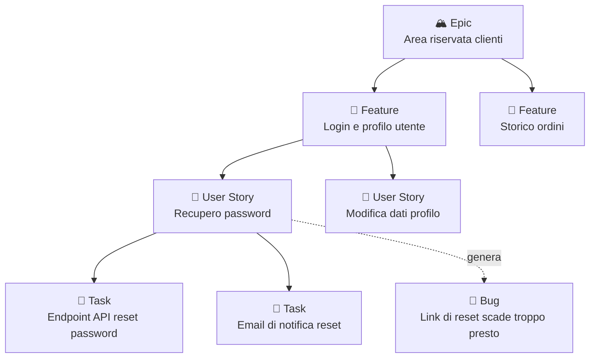
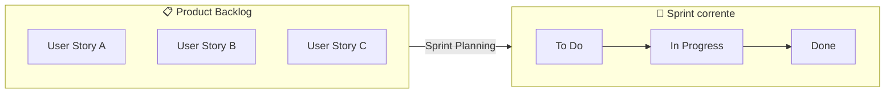
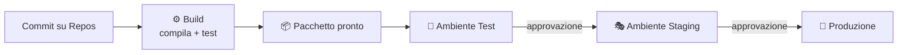
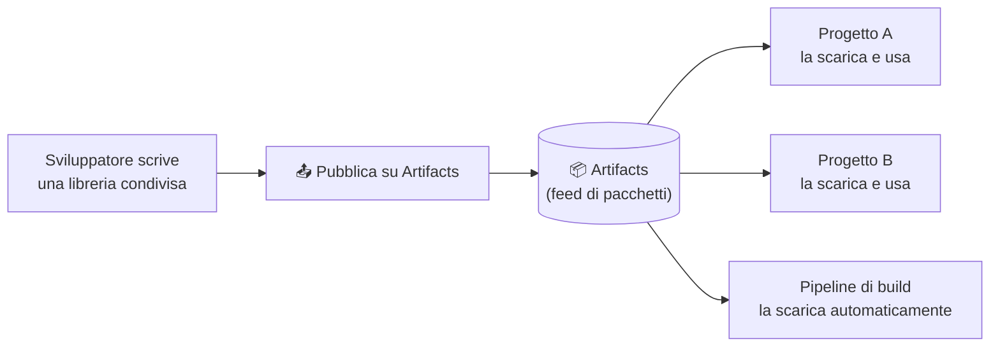
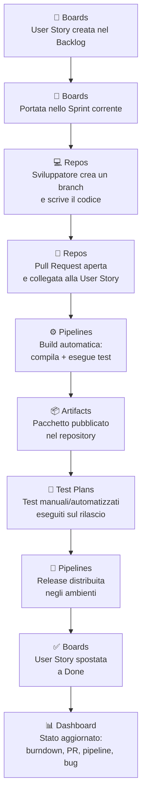

# 10. Azure DevOps


> 📄 **[Scarica questa sezione in PDF](https://darioschioppi.github.io/corso-onboarding-devops/pdf/10-azure-devops.pdf)** — utile per la stampa o la lettura offline.


Nelle sezioni precedenti hai visto tanti concetti "in teoria": cos'è una
board Kanban, come funziona uno sprint Scrum, cosa sono un repository, un
commit, una Merge Request, e cos'è la cultura DevOps. Tutti questi concetti,
nel lavoro reale, non restano sulla lavagna: vivono dentro uno **strumento**
che il team usa ogni giorno per pianificare, scrivere codice, testare e
rilasciare.

**Azure DevOps** è uno di questi strumenti — anzi, è una **suite** di
strumenti, prodotta da Microsoft, che copre l'intero ciclo di vita di un
progetto software in un unico posto. Nel progetto a cui sarai affiancato è
molto probabile che tu veda Azure DevOps aperto in una scheda del browser
per tutta la giornata: è lì che troverai i work item da seguire, il codice
del progetto, lo stato delle pipeline e i grafici da mostrare al cliente.

Questa sezione ti porta "dentro" lo strumento, collegando ogni sua parte a
ciò che hai già imparato: non sono concetti nuovi da zero, sono le stesse
idee (backlog, board, repository, pipeline) che ora vedrai **incarnate in
un prodotto specifico**.

Per rendere tutto concreto, seguiremo lo stesso progetto già incontrato
nella sezione DevOps: **ShopFacile**, la piattaforma e-commerce del team.
In questa sezione la vedremo gestita proprio dentro Azure DevOps: **Sara**
(Product Owner) inserisce requisiti e work item su Azure Boards, mentre
**Marco**, **Giulia** e **Ahmed** (i tre developer del team) li
implementano usando Repos, Pipelines e Test Plans.

## 🎯 Obiettivi della sezione

Alla fine di questa sezione saprai:

- cos'è Azure DevOps e perché è definito una suite "end-to-end";
- cosa sono i cinque moduli principali (Boards, Repos, Pipelines, Test
  Plans, Artifacts) e a cosa servono nella pratica;
- collegare ogni modulo a un concetto già visto (Scrum, Kanban, Git,
  CI/CD);
- leggere una Dashboard di progetto e capire cosa rappresentano i suoi
  widget;
- seguire il percorso end-to-end di una user story, dalla sua creazione su
  Boards fino al rilascio in produzione.

---

## 10.1 Cos'è Azure DevOps

**Azure DevOps** è una suite di strumenti Microsoft, disponibile sia come
servizio cloud (**Azure DevOps Services**) sia installabile sui server
dell'azienda (**Azure DevOps Server**, la versione "on-premises"). Il nome
non è casuale: è pensata per supportare esattamente la cultura **DevOps**
che hai visto nella sezione precedente, cioè l'unione tra sviluppo (Dev) e
operazioni (Ops) in un flusso continuo, senza muri tra "chi scrive il
codice" e "chi lo porta in produzione".

> 💡 **Analogia**: pensa a un cantiere edile in cui, invece di avere
> l'architetto in uno studio separato, i muratori in un altro cantiere, e
> chi consegna i materiali in un magazzino scollegato da tutti, esiste
> **un unico centro operativo**: lì trovi le planimetrie aggiornate (i
> requisiti), la lista dei materiali da ordinare (i pacchetti software), lo
> stato di avanzamento di ogni stanza (le board), e il registro di collaudo
> di ogni impianto (i test). Tutti guardano lo stesso posto, con la stessa
> versione delle informazioni.

Il punto di forza principale di Azure DevOps è proprio questo:
**integrazione**. Invece di usare uno strumento diverso per gestire il
backlog, un altro per il codice, un altro per le pipeline di build e un
altro ancora per i test, tutto vive in un solo posto, con collegamenti
diretti tra le parti (es. un commit può referenziare direttamente un work
item, una pipeline può aggiornare automaticamente lo stato di una user
story).

Azure DevOps è organizzato in **cinque moduli principali**, ognuno
accessibile da un menu laterale all'interno di un progetto:

| Modulo | A cosa serve, in una frase |
|---|---|
| **Boards** | Gestire il lavoro: backlog, sprint, board Kanban |
| **Repos** | Ospitare il codice sorgente (repository Git) |
| **Pipelines** | Automatizzare build, test e rilascio (CI/CD) |
| **Test Plans** | Pianificare ed eseguire test manuali e automatizzati |
| **Artifacts** | Conservare e distribuire pacchetti software |

Nei prossimi paragrafi vediamo ciascuno di questi moduli, uno per uno,
sempre collegandoli a concetti che hai già incontrato nel corso — e sempre
seguendo lo stesso progetto ShopFacile, per vedere come si muove
concretamente da un modulo all'altro.

Cominciamo dal punto da cui parte sempre il lavoro, prima ancora che
qualcuno scriva una riga di codice: **cosa c'è da fare**. È il modulo
Boards, dove Sara inserisce le richieste del cliente.

---

## 10.2 Boards: la gestione del lavoro

**Boards** è il modulo che gestisce **tutto il lavoro** del progetto: cosa
c'è da fare, chi ci sta lavorando, a che punto è. Se hai letto le sezioni
su Scrum e Kanban, qui non trovi nulla di concettualmente nuovo — trovi
esattamente quegli stessi concetti, ma implementati come schermate concrete
di uno strumento.

### Work item: l'unità base del lavoro

In Azure DevOps, ogni "elemento di lavoro" — che nelle sezioni precedenti
abbiamo chiamato genericamente "card" o "elemento del backlog" — si chiama
**work item**. Esistono diversi **tipi** di work item, organizzati in una
gerarchia che va dal più generale al più specifico:

- **Epic**: un obiettivo molto grande, che richiede mesi di lavoro e si
  scompone in più Feature (es. "Area riservata clienti").
- **Feature**: un pezzo di funzionalità consistente, che si scompone in
  più User Story (es. "Login e gestione profilo utente").
- **User Story**: una singola richiesta dal punto di vista dell'utente,
  esattamente come l'hai vista nella sezione su Scrum (es. "Come utente,
  voglio recuperare la password se la dimentico").
- **Task**: un'attività tecnica concreta necessaria per completare una
  User Story (es. "Creare l'endpoint API per il reset password").
- **Bug**: un malfunzionamento da correggere (es. "Il link di reset
  password scade dopo 1 minuto invece di 24 ore").



> 💡 **Analogia**: pensa a una gerarchia come quella di un libro. L'Epic è
> l'intero **libro** (es. "Storia dell'Europa"), la Feature è un
> **capitolo** (es. "Il Rinascimento"), la User Story è un
> **paragrafo** che racconta un evento specifico, e il Task è una singola
> **frase** che devi scrivere per completare quel paragrafo. Il Bug è come
> un errore di stampa scoperto dopo la pubblicazione, da correggere in una
> ristampa.

> 💡 **Esempio pratico**: immagina che **Sara**, la Product Owner di
> ShopFacile, riceva dal cliente la richiesta "vogliamo permettere ai
> clienti di scaricare la fattura del proprio ordine in PDF". Sara crea una
> User Story con titolo "Come cliente di ShopFacile, voglio scaricare la
> fattura del mio ordine in PDF, così da poterla archiviare", ID `#341`,
> stato `New` e una stima di 5 Story Point. Durante lo Sprint Planning il
> team aggiunge due Task collegati: `#342 Creare l'endpoint di generazione
> PDF`, assegnato a **Marco**, e `#343 Aggiungere il bottone "Scarica
> fattura" nell'interfaccia`, assegnato ad **Ahmed**. Se durante il test
> **Giulia** nota che il PDF esce senza il logo di ShopFacile, apre un nuovo
> Bug `#350`, collegato alla User Story `#341`: il collegamento tra i work
> item permette di ricostruire in ogni momento "da dove nasce" quella
> correzione, senza doverlo chiedere a voce a chi l'ha scritta.

### Backlog, Sprint Board e board Kanban

Boards offre diverse **viste** sullo stesso lavoro, a seconda di cosa ti
serve vedere:

- **Backlog**: la lista ordinata per priorità di tutte le User Story (o
  Feature) ancora da fare — è l'implementazione concreta del Product
  Backlog che hai visto nella sezione su Scrum.
- **Sprint Board**: la board che mostra il lavoro dello sprint corrente,
  organizzato in colonne di stato (es. To Do, In Progress, Done) — è dove
  il team guarda ogni giorno durante la Daily Scrum.
- **Board Kanban**: una board a flusso continuo, con colonne
  personalizzabili e limiti di WIP configurabili — è esattamente la board
  Kanban che hai visto nella sezione 7, ma cliccabile e configurabile
  direttamente nello strumento (puoi impostare il limite di WIP di una
  colonna direttamente nelle sue impostazioni).



> 💡 **Esempio pratico**: durante lo Sprint Planning (visto nella sezione
> Scrum), il team di ShopFacile seleziona alcune User Story dal Backlog —
> tra cui la `#341` sulla fattura PDF — e le "porta" nello sprint. Da quel
> momento, quelle stesse User Story appaiono sulla Sprint Board, e ogni
> Task collegato può essere spostato di colonna man mano che avanza —
> esattamente il movimento delle card che hai visto nel capitolo su Kanban,
> solo che qui avviene con un drag-and-drop del mouse.

Una volta che la User Story `#341` è entrata nello sprint, qualcuno deve
effettivamente scrivere il codice che la implementa. È il momento in cui
Marco e Ahmed passano dal guardare la board ad aprire il modulo successivo:
Repos.

---

## 10.3 Repos: il codice sorgente

**Repos** è il modulo che ospita i **repository Git** del progetto — se hai
letto la sezione 4 su Git e GitLab, qui il concetto ti sarà già familiare:
Azure DevOps Repos è, dal punto di vista di Git, praticamente equivalente a
GitLab. Sotto il cofano c'è sempre lo stesso motore (Git), cambia solo la
"concessionaria" che lo ospita.

Tutto quello che hai imparato su Git resta identico:

- si lavora con **branch**, **commit**, **merge**;
- la collaborazione passa per una richiesta di unione, che in Azure DevOps
  si chiama **Pull Request** — un nome diverso da quello usato su GitLab
  (**Merge Request**), ma esattamente lo stesso concetto;
- si possono collegare i commit e le Pull Request ai work item di Boards
  (es. scrivendo `Fixes #123` in un commit, la User Story numero 123 si
  aggiorna automaticamente).

Le differenze pratiche rispetto a GitLab sono minime e soprattutto di
**interfaccia** e di **integrazione**:

| | GitLab | Azure DevOps Repos |
|---|---|---|
| **Motore** | Git | Git |
| **Merge/Pull Request** | Sì (si chiama Merge Request) | Sì (si chiama Pull Request — stesso concetto) |
| **Issue** | Sì (modulo Issues) | Sostituito dai work item di Boards |
| **Pipeline collegata** | GitLab CI/CD | Azure Pipelines |
| **Punto di forza** | Molto diffusa anche self-hosted, forte integrazione CI/CD nativa | Integrazione nativa con Boards, Pipelines, Test Plans nello stesso prodotto |

> 💡 **Esempio pratico**: in Azure DevOps, quando **Marco** apre una Pull
> Request per unire il branch `feature/fattura-pdf` dentro `main`, la
> collega direttamente alla User Story `#341` "Fattura PDF" di ShopFacile:
> chi guarda quella User Story su Boards vede subito il link alla Pull
> Request corrispondente, e quando **Giulia** completa la revisione e la PR
> viene completata, lo stato della User Story può aggiornarsi
> automaticamente. È la stessa idea del "Closes #42" di GitLab che hai
> visto nella sezione 4, ma ancora più integrata perché Boards e Repos
> vivono nello stesso prodotto.

Il codice di Marco è ora unito nel branch principale — ma unito non
significa ancora "pronto per gli utenti". Perché quel codice diventi
davvero parte di ShopFacile in produzione, deve prima passare per build e
test automatici: è il modulo Pipelines, il prossimo che vediamo.

---

## 10.4 Pipelines: build e rilascio automatizzati

**Pipelines** è il modulo di **CI/CD** (Continuous Integration / Continuous
Delivery) di Azure DevOps: automatizza tutto ciò che deve succedere al
codice dopo che è stato scritto — compilarlo, testarlo, e distribuirlo
negli ambienti di destinazione. Approfondirai il concetto di CI/CD in
dettaglio nella sezione 11; qui ci concentriamo su come si concretizza
dentro Azure DevOps.

Una pipeline si compone tipicamente di due fasi concettuali:

- **Build**: compila il codice, esegue i test automatici, e produce un
  "pacchetto" pronto per essere distribuito (chiamato spesso *artifact* di
  build — da non confondere con il modulo Artifacts che vedremo dopo,
  anche se il concetto è collegato).
- **Release**: prende quel pacchetto e lo distribuisce nei vari ambienti
  (es. prima in un ambiente di Test, poi in Staging, infine in Produzione),
  spesso con approvazioni manuali tra un ambiente e il successivo.



### YAML pipeline vs Classic: "pipeline as code"

Azure DevOps offre due modi per definire una pipeline:

- **Classic pipeline**: si costruisce visivamente, con un editor grafico a
  "trascina e configura" i passaggi, senza scrivere codice.
- **YAML pipeline**: si definisce scrivendo un file di testo in formato
  YAML (un formato di testo semplice e leggibile, simile a un elenco
  annidato), che descrive passo per passo cosa la pipeline deve fare.

La modalità YAML è oggi quella raccomandata e più usata, perché applica un
principio chiamato **"pipeline as code"**: la definizione della pipeline
non vive in una configurazione grafica separata e "invisibile", ma è un
**file di testo salvato nel repository stesso**, insieme al codice.

> 💡 **Analogia**: pensa alla differenza tra assemblare un mobile IKEA
> seguendo solo dei disegni a mano libera che tieni in testa (pipeline
> classica: funziona, ma solo tu sai esattamente come l'hai fatto e non è
> facile ripeterlo identico) oppure seguendo il **libretto di istruzioni
> scritto**, numerato, che chiunque può leggere, modificare, versionare e
> ripetere esattamente allo stesso modo (pipeline YAML): il libretto stesso
> diventa un documento che puoi salvare, confrontare tra versioni diverse,
> e su cui puoi anche aprire una Pull Request se vuoi cambiarlo.

Un piccolo esempio illustrativo di come appare un file YAML di pipeline
(non serve che tu sappia scriverlo, solo che tu lo riconosca se lo vedi):

```yaml
trigger:
  - main

steps:
  - script: npm install
    displayName: "Installa le dipendenze"
  - script: npm test
    displayName: "Esegue i test automatici"
  - script: npm run build
    displayName: "Compila l'applicazione"
```

Il vantaggio pratico più importante di avere la pipeline "come codice": se
qualcosa nella pipeline si rompe o cambia, **si vede nella storia di Git**,
esattamente come per qualsiasi altra modifica al codice — puoi capire chi
ha cambiato cosa e quando, e volendo tornare indietro a una versione
precedente.

> 💡 **Esempio pratico**: **Marco** fa il push del commit con la sua modifica
> sul branch `main` di ShopFacile. In automatico, la pipeline si attiva
> (trigger) ed esegue in sequenza: installazione delle dipendenze,
> esecuzione dei test automatici, compilazione. Se un test fallisce, la
> pipeline si ferma e risulta "rossa" (failed): Marco riceve una notifica,
> corregge il problema e fa un nuovo commit, che fa ripartire tutta la
> sequenza da capo. Se invece tutti i passaggi vanno a buon fine, la
> pipeline è "verde" (succeeded) e il pacchetto compilato passa alla fase
> di Release: prima viene distribuito automaticamente nell'ambiente di
> Test, poi resta in attesa dell'approvazione di un responsabile prima di
> passare in Staging, e infine in Produzione — con un'ulteriore
> approvazione, perché il rilascio in Produzione è quasi sempre un
> passaggio "manuale per scelta", anche se la build è completamente
> automatica.

Prima che il pacchetto arrivi davvero in Produzione, però, c'è ancora un
controllo da fare, distinto da quello automatico appena visto: verificare
che la fattura PDF si comporti bene anche agli occhi di una persona che la
prova manualmente. È il compito del modulo Test Plans.

---

## 10.5 Test Plans: qualità e collaudo

**Test Plans** è il modulo dedicato alla gestione dei **test**, sia manuali
che automatizzati. Mentre le pipeline (visto sopra) eseguono
automaticamente test già scritti nel codice, Test Plans serve soprattutto
a organizzare e tracciare **test manuali** — cioè test eseguiti a mano da
una persona, seguendo dei passaggi definiti — insieme a una vista d'insieme
anche sui test automatizzati collegati alle pipeline.

I concetti chiave sono:

- **Test Plan**: un contenitore che raggruppa i test da eseguire per un
  determinato obiettivo (es. "Test Plan per la Release 2.3.0").
- **Test Suite**: un sotto-raggruppamento di casi di test all'interno di
  un Test Plan (es. "Suite: Login e autenticazione").
- **Test Case**: il singolo test, con **passaggi precisi** da seguire e il
  **risultato atteso** di ognuno.

> 💡 **Esempio pratico**: un Test Case per la User Story `#341` "Fattura PDF"
> di ShopFacile potrebbe essere:
> 1. Vai alla pagina "I miei ordini" e clicca "Scarica fattura".
>    **Risultato atteso**: si scarica un file PDF.
> 2. Apri il PDF scaricato.
>    **Risultato atteso**: il PDF contiene il logo di ShopFacile, i dati
>    dell'ordine e il totale corretto.
> 3. Prova a scaricare la fattura di un ordine di un altro cliente
>    modificando l'URL a mano.
>    **Risultato atteso**: l'accesso viene negato.
>
> **Giulia**, che in questo esempio esegue il test, segue questi passaggi
> uno per uno, e per ciascuno segna se il risultato osservato corrisponde a
> quello atteso (**Passed**) o no (**Failed** — che tipicamente genera
> automaticamente un nuovo work item di tipo Bug, collegato al test
> fallito, come il Bug `#350` visto al paragrafo 10.2).

> 💡 **Analogia**: pensa a un Test Plan come alla **checklist di collaudo**
> di un'automobile prima che esca dalla fabbrica: freni, luci, climatizzatore,
> ognuno con un passaggio preciso da verificare e un esito da segnare.
> Alcuni controlli li fa una macchina automaticamente (i test
> automatizzati eseguiti nella pipeline), altri richiedono ancora l'occhio
> di una persona (i test manuali di Test Plans) — ad esempio, valutare se
> un'interfaccia "si sente giusta" da usare è qualcosa che un test
> automatico difficilmente può giudicare bene.

Perché serve un modulo dedicato e non basta "provare a mano" senza
tracciare nulla? Perché tracciare i test permette di rispondere con
sicurezza a domande fondamentali per un Project Manager, come: "questa
funzionalità è stata testata prima del rilascio?", "quali test sono
falliti nell'ultima release?", "quanta copertura di test abbiamo su questa
Feature?".

Il codice della fattura PDF, ormai compilato e testato, non nasce dal
nulla: come qualsiasi altra funzionalità di ShopFacile, si appoggia a
librerie esterne e, a sua volta, può diventare una libreria riutilizzabile
da altre parti del progetto. È qui che entra in gioco il modulo Artifacts.

---

## 10.6 Artifacts: i pacchetti software

**Artifacts** è il modulo che funge da **repository di pacchetti
software**: un magazzino centrale dove si conservano librerie e componenti
di codice riutilizzabile, pronti per essere scaricati e usati da altri
progetti o da altre parti dello stesso progetto.

Per capire perché serve, fai un passo indietro: quasi nessun software si
scrive completamente da zero. Ogni progetto si appoggia a centinaia di
**pacchetti** già scritti da altri (librerie che gestiscono, ad esempio,
l'invio di email, la formattazione delle date, la validazione di form) —
esistono formati standard di pacchetto per ogni linguaggio, come **NuGet**
(per .NET), **npm** (per JavaScript) o **Maven** (per Java). Un repository
di pacchetti è il "magazzino" da cui questi pacchetti vengono scaricati e
in cui, se il team ne scrive uno riutilizzabile per uso interno, può essere
pubblicato per gli altri progetti dell'azienda.

> 💡 **Analogia**: pensa a un repository di pacchetti come alla **dispensa
> condivisa** di un ristorante con più cucine (più progetti). Invece che
> ogni cuoco (ogni team) debba coltivare da solo il proprio basilico o
> macinare la propria farina, esiste una dispensa comune con ingredienti
> pronti, etichettati con un nome e un **numero di versione** (es.
> "farina-00, versione 2.1.0"): quando serve, si preleva l'ingrediente
> giusto nella versione giusta, senza doverlo rifare da zero ogni volta.

Perché serve un repository di pacchetti **privato** (come quello offerto da
Artifacts), invece di usare solo repository pubblici come npmjs.com o
NuGet.org? Alcuni motivi molto concreti:

- pubblicare pacchetti scritti internamente (es. una libreria comune con
  le funzioni condivise tra più progetti dello stesso cliente), **senza**
  renderli pubblici su internet;
- avere il controllo su **quali versioni** dei pacchetti pubblici il team
  è autorizzato a usare (per motivi di sicurezza e stabilità);
- avere un unico posto dove tracciare **quali pacchetti e quali versioni**
  sono effettivamente in uso nel progetto.

> 💡 **Esempio pratico**: il team di ShopFacile scrive una libreria interna
> che gestisce la formattazione degli importi in euro secondo le regole del
> cliente (es. "1.234,56 €"), usata sia dal sito web sia dall'app mobile.
> Invece di copiare e incollare lo stesso codice in due repository diversi
> (con il rischio che, dopo una correzione, uno dei due resti "vecchio"),
> **Marco** pubblica la libreria come pacchetto su Artifacts con nome
> `shopfacile-formattazione-valuta`, versione `1.0.0`. Sia il sito che
> l'app la scaricano da lì come dipendenza. Quando **Ahmed** corregge un
> bug di arrotondamento, pubblica la versione `1.0.1`: ogni progetto che
> dipende dalla libreria può aggiornarsi a quella versione quando è pronto,
> senza che nessuno debba "andare a modificare a mano" il codice in più
> posti.



Boards, Repos, Pipelines, Test Plans e Artifacts producono, ogni giorno,
una quantità enorme di piccoli segnali: sprint in corso, pipeline che
passano o falliscono, bug aperti. Nessuno vuole aprire cinque moduli
diversi ogni mattina solo per farsi un'idea generale: è qui che entra in
gioco l'ultimo modulo, la Dashboard.

---

## 10.7 Dashboard: lo stato del progetto a colpo d'occhio

**Dashboard** è il modulo di **visualizzazione**: una pagina, personalizzabile,
composta da **widget** (piccoli riquadri, ciascuno con un grafico o un
numero), che mostra in tempo reale lo stato del progetto.

Alcuni widget tipici che troverai in un progetto reale:

- un grafico a **burndown** dello sprint corrente (quanto lavoro resta
  rispetto al tempo rimasto — utile per uno Scrum Master);
- il numero di **Pull Request aperte** in attesa di revisione;
- lo stato dell'ultima **pipeline** eseguita (verde = passata, rossa =
  fallita);
- un elenco dei **Bug attivi**, magari filtrati per priorità;
- il numero di **Test Case** passati/falliti nell'ultima esecuzione.

> 💡 **Analogia**: pensa alla Dashboard come al **cruscotto di un'auto**:
> non guidi guardando il motore smontato pezzo per pezzo, guardi pochi
> indicatori sintetici (velocità, livello benzina, spia dell'olio) che ti
> dicono subito se tutto va bene o se c'è qualcosa da controllare. Una
> Dashboard di Azure DevOps fa lo stesso con lo stato del progetto: non
> devi aprire ogni singolo modulo per capire come vanno le cose, un'occhiata
> alla Dashboard basta per uno stato generale.

Le Dashboard sono particolarmente utili per un **Project Manager** proprio
per questo motivo: puoi costruire (o farti costruire) una Dashboard
riassuntiva da mostrare in una riunione con il cliente, senza dover
spiegare ogni singolo dettaglio tecnico — i numeri e i grafici parlano da
soli.

> 💡 **Esempio pratico**: è lunedì mattina e devi preparare in 5 minuti un
> aggiornamento rapido per il cliente. Apri la Dashboard del progetto e
> vedi: il burndown dello sprint mostra che il team è leggermente indietro
> rispetto alla linea ideale; ci sono 3 Pull Request aperte in attesa di
> revisione da più di un giorno; l'ultima pipeline eseguita è verde
> (passata); ci sono 2 Bug attivi con priorità alta. Da questi soli quattro
> numeri, senza aprire Boards, Repos o Pipelines singolarmente, puoi già
> dire al cliente: "siamo leggermente in ritardo sullo sprint, probabilmente
> per le revisioni di codice in coda, ma la qualità del rilascio è sotto
> controllo e stiamo lavorando su due bug prioritari" — una sintesi
> corretta costruita in pochi secondi.

---

## 10.8 Il flusso end-to-end: dalla User Story alla produzione

Ecco come i cinque moduli si integrano concretamente, seguendo il percorso
di una singola User Story dall'inizio alla fine:



Ogni freccia di questo diagramma è un collegamento **automatico o
semi-automatico** tra moduli: è proprio questa catena di collegamenti che
rende Azure DevOps una suite "integrata" e non solo una collezione di
strumenti scollegati tra loro.

---

## 10.9 Mappa dei concetti: cosa hai già visto, con un altro nome

Una delle cose più utili che puoi fare, arrivato a questo punto del corso,
è collegare ogni modulo di Azure DevOps a un concetto che hai già imparato
nelle sezioni precedenti. Ecco una mappa riassuntiva:

| Concetto Azure DevOps | Concetto già visto | Sezione del corso |
|---|---|---|
| Boards → Backlog, Sprint Board | Product Backlog, Sprint Backlog | 6. Scrum |
| Boards → Board Kanban, limiti di WIP | Board Kanban, WIP | 7. Kanban |
| Work item (Epic/Feature/User Story/Task/Bug) | User Story, task, backlog item | 6. Scrum |
| Repos → repository, branch, commit, merge | Repository, branch, commit, merge | 4. Git e GitLab |
| Repos → Pull Request | Merge Request | 4. Git e GitLab |
| Pipelines | CI/CD, integrazione e distribuzione continua | 9. DevOps, 11. CI/CD |
| Pipeline YAML ("pipeline as code") | Trunk Based Development, automazione | 4. Git e GitLab, 9. DevOps |
| Test Plans | Qualità e collaudo nel ciclo di vita del software | 3. Come nasce un software |
| Artifacts | Gestione delle dipendenze/librerie di un progetto | 3. Come nasce un software |
| Dashboard → burndown | Metriche di flusso e avanzamento | 8. Project Management |

Questa tabella non è solo un ripasso: è anche il motivo per cui, se hai
capito bene le sezioni precedenti, **imparare Azure DevOps diventa molto
più semplice** — non stai imparando concetti nuovi, stai imparando dove si
trova, nello strumento, ciò che già conosci.

---

## 10.10 Riepilogo

- Azure DevOps è una suite Microsoft che copre l'intero ciclo di vita
  DevOps in un unico prodotto integrato, con cinque moduli principali.
- **Boards** gestisce il lavoro (backlog, sprint, board Kanban) attraverso
  i work item: Epic, Feature, User Story, Task, Bug.
- **Repos** ospita i repository Git del progetto, con lo stesso motore
  Git e lo stesso concetto di Pull Request (chiamato Merge Request su
  GitLab) visto nella sezione 4.
- **Pipelines** automatizza build e rilascio (CI/CD); la modalità YAML
  applica il principio di "pipeline as code", cioè la pipeline stessa
  versionata come un file di testo nel repository.
- **Test Plans** organizza e traccia test manuali e automatizzati, tramite
  Test Plan, Test Suite e Test Case.
- **Artifacts** è il magazzino condiviso dei pacchetti software (NuGet,
  npm, Maven), utile per riusare codice senza riscriverlo da zero.
- **Dashboard** mostra lo stato del progetto tramite widget configurabili,
  utile sia al team che a chi deve comunicare l'avanzamento al cliente.
- I cinque moduli sono collegati tra loro in una catena continua, dalla
  User Story sul Backlog fino al rilascio in produzione e all'aggiornamento
  della Dashboard.

---

## 📝 Esercizi pratici

1. **Mappa un work item reale.** Chiedi a un collega di mostrarti sullo
   schermo una User Story reale del progetto su Boards: annota il suo ID,
   il tipo (Epic/Feature/User Story/Task/Bug), i suoi Task collegati e il
   suo stato attuale. Poi disegna a mano la gerarchia completa (Epic →
   Feature → User Story → Task) a cui appartiene.
   ✅ **Come verificare**: se riesci a ridisegnare la gerarchia su un
   foglio senza guardare lo schermo, e a spiegare a voce cosa cambierebbe
   se quella User Story venisse spostata da "In Progress" a "Done", hai
   capito il concetto.

2. **Segui una Pull Request dall'apertura al collegamento.** Osserva (o
   fatti raccontare) una Pull Request reale del progetto: qual è il branch
   di origine e quello di destinazione, quale User Story o Task referenzia,
   chi la sta revisionando, quanti commenti ha ricevuto prima di essere
   completata.
   ✅ **Come verificare**: sai indicare, senza guardare gli appunti, dove
   su Boards si vede il collegamento a quella Pull Request e cosa succede
   allo stato della User Story quando la PR viene completata.

3. **Leggi un file YAML di pipeline reale.** Fatti mostrare (o trova tu
   stesso, se hai accesso) un file YAML di pipeline del progetto. Senza
   preoccuparti di capire ogni riga, individua: cosa fa scattare la
   pipeline (trigger), quali sono gli step principali, e se c'è un passaggio
   di test prima della build finale.
   ✅ **Come verificare**: riesci a indicare a un collega, puntando col
   dito sullo schermo, dove nel file YAML si trova il trigger e dove si
   trova lo step che esegue i test — senza dover chiedere aiuto.

4. **Ricostruisci il flusso end-to-end con un esempio a tua scelta.**
   Scegli (o inventa) una piccola funzionalità (es. "aggiungere un filtro
   di ricerca") e scrivi, passo per passo, come attraverserebbe i cinque
   moduli di Azure DevOps: da quando viene creata la User Story su Boards,
   fino a quando la Dashboard mostra lo sprint aggiornato a rilascio
   avvenuto. Usa come riferimento il diagramma della sezione 10.8.
   ✅ **Come verificare**: confronta il tuo schema con quello della sezione
   10.8 — se hai nominato tutti i moduli nell'ordine corretto e sai
   spiegare perché ogni passaggio avviene dopo il precedente, l'esercizio
   è riuscito.

5. **Costruisci una Dashboard "immaginaria".** Su un foglio (o con un tool
   gratuito di disegno), disegna una Dashboard con 4 widget a tua scelta
   che vorresti mostrare in una riunione settimanale con il cliente (es.
   burndown, PR aperte, stato pipeline, bug attivi). Per ciascun widget,
   scrivi una frase che useresti per commentarlo a voce.
   ✅ **Come verificare**: fatti guardare lo schizzo da un collega o dalla
   tua tutor e chiedi se i 4 widget scelti sarebbero davvero utili in una
   riunione reale con il cliente, oppure se ne manca uno importante (es.
   lo stato dei rischi).

6. **Compila la tabella dei collegamenti a memoria.** Senza guardare la
   tabella della sezione 10.9, prova a scrivere su un foglio, per ognuno
   dei cinque moduli (Boards, Repos, Pipelines, Test Plans, Artifacts), il
   concetto già visto nelle sezioni precedenti a cui corrisponde.
   ✅ **Come verificare**: confronta il tuo elenco con la tabella della
   sezione 10.9 — se hai indovinato almeno 4 collegamenti su 5 senza
   guardare, la mappa concettuale è solida; altrimenti, ripassa i
   collegamenti mancanti prima di andare avanti.

---

## 🔗 Collegamenti

- [11. CI/CD](../11-ci-cd/README.md) — approfondimento sui concetti di
  integrazione e distribuzione continua che stanno dietro al modulo
  Pipelines
- [13. Cloud](../13-cloud/README.md) — dove vengono effettivamente
  distribuite le applicazioni rilasciate dalle pipeline di Azure DevOps

## 📚 Risorse

- [Documentazione ufficiale di Azure DevOps](https://learn.microsoft.com/azure/devops/)
- [Azure Boards — panoramica](https://learn.microsoft.com/azure/devops/boards/)
- [Azure Repos — panoramica](https://learn.microsoft.com/azure/devops/repos/)
- [Azure Pipelines — panoramica](https://learn.microsoft.com/azure/devops/pipelines/)
- [Azure Test Plans — panoramica](https://learn.microsoft.com/azure/devops/test/)
- [Azure Artifacts — panoramica](https://learn.microsoft.com/azure/devops/artifacts/)
- [Dashboard in Azure DevOps](https://learn.microsoft.com/azure/devops/report/dashboards/)
- [Pipeline YAML — schema di riferimento](https://learn.microsoft.com/azure/devops/pipelines/yaml-schema/)
