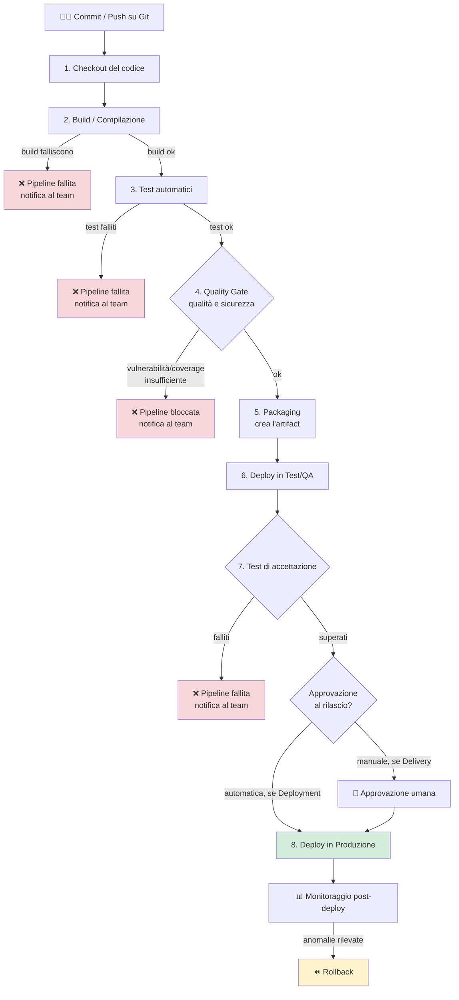
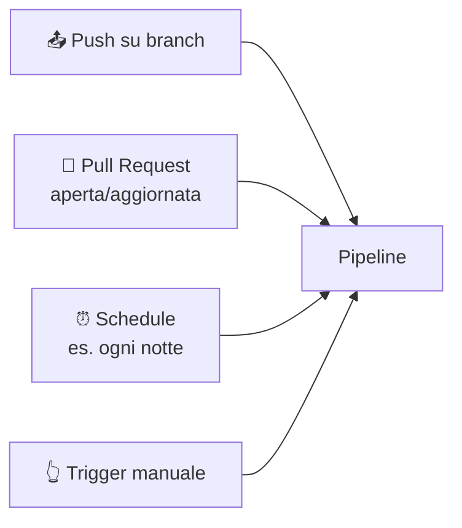
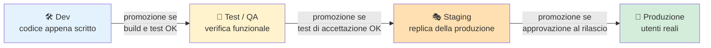
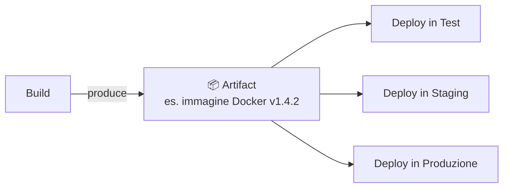
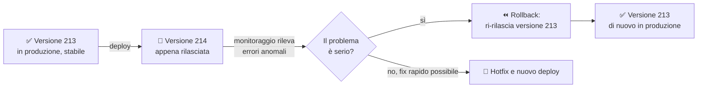
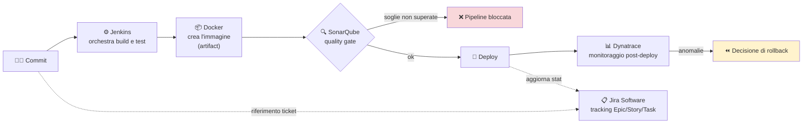

# 10. CI/CD


> 📄 **[Scarica questa sezione in PDF](https://darioschioppi.github.io/corso-onboarding-devops/pdf/10-ci-cd.pdf)** — utile per la stampa o la lettura offline.


Nella sezione DevOps hai già incontrato i concetti di **Continuous
Integration** e **Continuous Delivery/Deployment**, applicati al lavoro
quotidiano del team di **ShopFacile**: sai che servono a integrare e
rilasciare il codice in modo frequente e automatizzato, invece di
accumulare mesi di lavoro in un unico rilascio rischioso. Questa sezione
resta sullo stesso progetto, ma va un livello più in profondità: non "cosa
sono CI/CD e perché servono" (quello lo trovi in
[9. DevOps](../09-devops/README.md)), ma **come funziona davvero, passo
per passo, la pipeline** che Marco, Giulia e Ahmed usano ogni giorno per
far arrivare le loro modifiche in produzione — cioè lo strumento concreto
che rende possibile la CI/CD.

Alla fine di questa sezione, quando in una daily standup qualcuno dirà
"la pipeline è rossa sul quality gate della coverage" o "il deploy in
staging è partito ma serve l'approvazione manuale per la produzione",
capirai esattamente di cosa si sta parlando.

## 🎯 Obiettivi della sezione

Alla fine di questa sezione saprai:

- ripassare rapidamente la differenza tra Continuous Integration e
  Continuous Delivery/Deployment;
- descrivere le **fasi tipiche** di una pipeline, dal checkout del codice
  al deploy in produzione;
- riconoscere i diversi **trigger** che possono far scattare una pipeline;
- distinguere gli **ambienti** (Dev, Test/QA, Staging, Produzione) e
  capire cosa significa "promuovere" il codice tra di essi;
- capire cos'è un **artifact** e perché viaggia da una fase all'altra
  della pipeline senza essere ricostruito ogni volta;
- spiegare perché si scrive una pipeline come **codice versionato**
  (Pipeline as Code) invece di configurarla a mano da un'interfaccia
  grafica;
- leggere un semplice file YAML che definisce una pipeline;
- capire cos'è un **quality gate** e come blocca un rilascio problematico;
- descrivere cosa succede — e cosa dovrebbe succedere — quando un deploy
  va male (**rollback**);
- capire cosa sono i **feature flag** e perché separano il rilascio
  tecnico dalla decisione di business;
- riconoscere alcuni **strumenti concreti** che implementano queste fasi
  nella realtà (Jenkins, Docker, SonarQube, Dynatrace, Jira Software).

---

## 10.1 Ripasso: cosa sono CI e CD

Giusto due righe di richiamo, perché il resto della sezione si basa su
questi due concetti.

- **Continuous Integration (CI)**: ogni volta che qualcuno modifica il
  codice, quella modifica viene automaticamente **integrata** con il
  resto del progetto, **compilata** e **testata**. Lo scopo è scoprire i
  problemi di integrazione (il classico "sul mio computer funzionava")
  nel giro di minuti, non di settimane.
- **Continuous Delivery / Continuous Deployment (CD)**: una volta che il
  codice ha superato la CI, viene automaticamente **preparato per il
  rilascio** (Delivery, con un click finale umano) oppure **rilasciato
  direttamente** (Deployment, senza intervento umano), fino a produzione.

> 💡 Se questi concetti non ti sono ancora chiari al 100%, torna un
> momento alla sezione [9. DevOps](../09-devops/README.md), dove sono
> introdotti insieme al perché culturale che c'è dietro. Qui li diamo per
> acquisiti e ci concentriamo sul **meccanismo pratico**.

Il meccanismo che rende concreti questi due concetti si chiama
**pipeline**: una sequenza automatizzata di fasi che il codice attraversa,
una dopo l'altra, dal momento in cui viene scritto al momento in cui gira
davanti agli utenti reali di ShopFacile. Vediamo ora, fase per fase, come è
fatta davvero.

---

## 10.2 Anatomia di una pipeline: le fasi tipiche

Prima di guardare come funziona una pipeline, vale la pena ricordare come
rilasciava ShopFacile prima di averne una. Si andava in produzione **una
volta al mese**: Marco, Giulia e Ahmed accumulavano in media 40 modifiche
diverse, che finivano tutte in produzione **nella stessa serata**. Tre
settimane dopo l'ultimo rilascio, un cliente segnala che il totale del
carrello è sbagliato quando si applica un codice sconto. Giulia passa una
giornata intera a cercare quale, delle 40 modifiche, abbia causato il
problema: sono troppe, mescolate insieme, e i dettagli di ciò che ciascuno
aveva cambiato tre settimane prima sono già sfumati nella memoria di tutti.
Per ridurre il rischio, Luca aveva proposto di spostare il rilascio al
venerdì sera, "quando ci sono pochi utenti": il risultato era che, quando
qualcosa andava storto, era il fine settimana del team ad andarsene,
rincorrendo i problemi.

Da qui nasce l'idea centrale di questa sezione, l'esatto opposto
dell'istinto di "accumulare tutto e rilasciare quando siamo sicuri":
**integrare e rilasciare pezzi piccoli e frequenti riduce il rischio per
singola modifica** — un rilascio con 40 modifiche ha 40 possibili
colpevoli, uno con una sola modifica ne ha uno solo. È esattamente questo
principio, già visto in generale nella sezione DevOps, che una pipeline
concreta rende possibile ogni giorno.

Immagina una pipeline come una **catena di montaggio in una fabbrica**: il
"pezzo" che entra da un lato è il codice appena scritto da uno
sviluppatore, e ogni stazione della catena lo controlla, lo trasforma o lo
sposta, finché non esce dall'altra parte come un prodotto pronto all'uso,
installato e funzionante per l'utente finale. Se una stazione rileva un
difetto, il pezzo **non passa alla stazione successiva**: si ferma lì, e
qualcuno viene avvisato.

Le fasi (in inglese *stage*) più comuni, nell'ordine in cui compaiono
quasi sempre:

1. **Checkout del codice**: la pipeline scarica dal repository Git
   (GitHub e simili) esattamente la versione di codice che
   ha fatto scattare la pipeline — un commit specifico, un branch
   specifico.
2. **Build / Compilazione**: il codice sorgente viene trasformato in
   qualcosa di eseguibile (per i linguaggi compilati) o comunque
   preparato per l'esecuzione (installazione delle dipendenze, per
   linguaggi interpretati). Se il codice ha errori di sintassi o non
   compila, la pipeline si ferma già qui — è il controllo più veloce e
   più economico da fare.
3. **Test automatici**: vengono eseguiti i test scritti dal team (unit
   test, test di integrazione) per verificare che il comportamento del
   software sia quello atteso. Se anche un solo test fallisce, la
   pipeline normalmente si ferma.
4. **Analisi di qualità e sicurezza del codice**: strumenti automatici
   analizzano il codice sorgente (senza eseguirlo) per individuare
   problemi di leggibilità, complessità eccessiva, duplicazioni, e
   soprattutto **vulnerabilità di sicurezza** note (es. uso di librerie
   con falle documentate, pattern di codice pericolosi). Questa fase è
   spesso chiamata *static analysis* o *code scanning*.
5. **Packaging**: il risultato della build viene "impacchettato" in una
   forma pronta per essere distribuita e installata — un file eseguibile,
   un pacchetto installabile, un'immagine Docker (ne parliamo più avanti
   come *artifact*).
6. **Deploy in ambiente di test**: il pacchetto viene installato in un
   ambiente dedicato ai test (Test/QA), separato da quello che usano gli
   utenti reali.
7. **Test di accettazione**: test più vicini al punto di vista
   dell'utente finale (test end-to-end, test manuali di un QA, a volte
   test di performance), eseguiti sull'ambiente di test appena
   aggiornato, per confermare che il software si comporti bene in un
   ambiente "vero", non solo nella teoria dei test automatici della fase
   3.
8. **Deploy in produzione**: solo se tutte le fasi precedenti sono state
   superate, lo stesso identico pacchetto viene installato nell'ambiente
   che usano davvero gli utenti finali.



Un punto importante: **non tutte le pipeline hanno esattamente queste
otto fasi**. Un progetto piccolo può avere una pipeline con solo build e
test; un progetto più maturo, con requisiti di sicurezza stringenti, può
avere fasi aggiuntive (scansione delle dipendenze, test di carico, firma
digitale del pacchetto). Il principio, però, resta lo stesso: **fasi in
sequenza, ciascuna con la possibilità di fermare tutto se qualcosa non va
bene**.

> 🛠️ **Esempio pratico**: **Giulia** apre alle 10:03 una Pull Request con
> una modifica al calcolo di uno sconto sul carrello di ShopFacile. Alle
> 10:04 la pipeline parte da sola: il checkout del codice impiega 5
> secondi, la build 40 secondi. Al minuto 2 la fase di test automatici
> fallisce, perché uno dei test esistenti si aspettava un risultato
> diverso da quello prodotto dalla sua modifica. La pipeline si ferma
> **esattamente lì**: non arriva né alla fase di analisi di sicurezza né,
> ovviamente, al deploy. Giulia riceve una notifica automatica (email o
> messaggio nella chat del team) con il link al log del test fallito,
> corregge il codice, fa un nuovo commit sulla stessa MR e la pipeline
> riparte da capo, dal checkout.

Nell'esempio la pipeline è partita da sola, senza che Giulia dovesse
lanciarla a mano: è successo perché ha aperto la Pull Request, uno degli
eventi che possono far scattare una pipeline. Vediamo ora quali sono
questi eventi, chiamati **trigger**.

---

## 10.3 Trigger: cosa fa scattare una pipeline

Una pipeline non gira "sempre": scatta quando succede un evento
specifico, chiamato **trigger**. I trigger più comuni sono:

- **Push su un branch**: ogni volta che qualcuno invia (push) nuovi
  commit su un branch (tipicamente `main`, o un branch di feature), la
  pipeline di CI parte automaticamente per validare quel codice.
- **Apertura (o aggiornamento) di una Pull Request**: quando si apre una
  MR per proporre l'unione di un branch in un altro, la pipeline gira sul
  codice della MR *prima* che venga approvata e unita — è uno dei modi
  più efficaci per impedire che codice difettoso entri nel branch
  principale. Se aggiungi altri commit alla MR, la pipeline riparte.
- **Pianificazione a orario (schedule)**: la pipeline parte a intervalli
  regolari indipendentemente da modifiche al codice — ad esempio ogni
  notte alle 2:00, per eseguire una suite di test più lunga e completa
  che non ha senso far girare a ogni singolo commit, o per verificare che
  tutto continui a funzionare anche senza modifiche (es. dopo un
  aggiornamento di una libreria esterna).
- **Trigger manuale**: una persona avvia la pipeline a mano, cliccando un
  bottone "Run workflow" nell'interfaccia (es. GitHub Actions). È tipico
  per il deploy in produzione, dove spesso si preferisce un'azione
  deliberata di una persona autorizzata, invece che un automatismo
  completo.



**Esempio pratico**: **Marco** fa un push di alcuni commit sul branch della
sua feature per il servizio ordini di ShopFacile. Non deve avvisare
nessuno né lanciare nulla a mano: il push stesso è il trigger, e la
pipeline di CI (build + test) parte automaticamente, per dare a Marco un
feedback rapido su quel codice. Il deploy in produzione, invece, ha un
trigger manuale: anche se tutte le fasi precedenti sono andate a buon
fine, è una persona (tipicamente il Tech Lead o un ruolo di Release
Manager) che clicca "Deploy in produzione" in un momento concordato — ad
esempio non di venerdì pomeriggio, per non rischiare un weekend di
incidenti con poche persone disponibili a intervenire.

Una volta scattata la pipeline, però, il codice di Marco non resta fermo
in un solo posto: attraversa una serie di ambienti diversi, ciascuno con
un ruolo preciso. È il prossimo argomento.

---

## 10.4 Ambienti: dove "vive" il codice, fase per fase

Il codice, durante il suo percorso, non gira sempre nello stesso posto.
Attraversa diversi **ambienti**, ciascuno con uno scopo preciso:

- **Dev (Sviluppo)**: l'ambiente dove uno sviluppatore lavora e verifica
  le prime modifiche, spesso sul proprio computer o in un ambiente
  condiviso ma instabile. Qui è normale che qualcosa non funzioni: è
  lavoro in corso.
- **Test / QA**: un ambiente dedicato a verificare che il software
  funzioni correttamente, con dati simili (ma non identici) a quelli
  reali. Qui lavorano i tester (automatici e umani) prima che il codice
  vada oltre.
- **Staging**: un ambiente che riproduce **quanto più fedelmente
  possibile** la produzione (stessa configurazione, volumi di dati
  simili, stessa infrastruttura), usato come ultimo controllo prima del
  rilascio reale. Non tutti i progetti hanno uno staging separato dal
  Test/QA, ma nei progetti più maturi è una tappa distinta.
- **Produzione**: l'ambiente reale, usato dagli utenti finali. Qui ogni
  errore ha un impatto reale su persone vere.

Il concetto chiave è quello di **promozione**: lo stesso pacchetto di
codice (lo stesso artifact, vedi paragrafo successivo) viene spostato in
avanti, ambiente dopo ambiente, solo se supera i controlli previsti in
quello attuale. Non si "ricostruisce" il software per ogni ambiente: si
promuove **la stessa cosa**, testata identica in ogni tappa, per essere
sicuri che quello che finisce in produzione sia esattamente ciò che è
stato validato prima.

> 💡 **Analogia**: pensa alla selezione per una squadra sportiva
> nazionale. Un giocatore passa dalle squadre giovanili (Dev), a un
> torneo regionale di qualificazione (Test/QA), a un'amichevole contro
> una nazionale di alto livello in condizioni quasi reali (Staging), fino
> alla partita ufficiale (Produzione). Non cambi giocatore a ogni tappa:
> **lo stesso giocatore** viene promosso, se supera ogni prova, fino al
> campo che conta davvero.



Vale la pena notare, però, che avere più ambienti non è gratis: ognuno è
infrastruttura reale da creare e mantenere, con un costo che si somma a
quello della produzione. Se lo staging non riceve la stessa cura della
produzione, i due **divergono silenziosamente** nel tempo — una libreria
aggiornata solo in uno dei due — e da lì nasce il classico lamento "in
staging funzionava".

Approfondirai la configurazione pratica di questi ambienti — chi ci
accede, come si isolano, come si gestiscono le credenziali diverse per
ciascuno — nella sezione [14. Ambienti di sviluppo](../14-ambienti-di-sviluppo/README.md).

Abbiamo detto che il codice viene "promosso" da un ambiente all'altro
**senza essere ricostruito**: ma cos'è, esattamente, questa cosa che si
sposta identica da Dev a Test/QA a Staging a Produzione? È il momento di
dare un nome preciso a quel "pacco": l'artifact.

---

## 10.5 Artifact: il "pacco" che viaggia lungo la pipeline

Un **artifact** è l'output concreto e riutilizzabile prodotto da una fase
della pipeline (tipicamente dalla build/packaging), che viene poi passato
alle fasi successive **senza doverlo ricostruire ogni volta**.

Esempi concreti di artifact:

- un file eseguibile o una libreria compilata;
- un pacchetto installabile (es. uno `.zip`, un pacchetto per un
  gestore di dipendenze);
- un'**immagine Docker**, cioè un "contenitore" con dentro applicazione e
  tutto ciò che serve per farla girare, pronto per essere avviato
  identico su qualsiasi macchina;
- un report di test o di analisi di sicurezza, allegato come
  documentazione del rilascio.

Perché è importante non ricostruire il software a ogni fase? Perché se
ogni ambiente compilasse il codice da zero, potresti finire per testare
una cosa e rilasciarne un'altra leggermente diversa (magari compilata con
una versione diversa di una libreria, scaricata in un momento diverso).
L'artifact garantisce che **quello che hai testato in Test/QA è
esattamente, byte per byte, quello che finisce in produzione** — questo
principio si chiama a volte "build once, deploy many" (compila una
volta sola, rilascia molte volte).



Sappiamo ora **cosa** attraversa la pipeline (l'artifact) e **dove**
(gli ambienti). Manca un pezzo: **chi decide** l'ordine esatto di queste
fasi, e come quella decisione viene scritta e mantenuta nel tempo dal
team di ShopFacile. È qui che entra in gioco il concetto di Pipeline as
Code.

---

## 10.6 Pipeline as Code: la pipeline è codice, non un click di troppo

Nei primi anni degli strumenti di automazione, le pipeline si
configuravano quasi sempre **a mano**, da un'interfaccia grafica: si
cliccava "aggiungi fase", si compilavano campi, si salvava. Funzionava,
ma aveva problemi seri:

- **non c'era storia delle modifiche**: se qualcuno cambiava una
  configurazione e qualcosa si rompeva, non c'era modo semplice di
  vedere "chi ha cambiato cosa e quando" (lo stesso problema che risolve
  Git per il codice, visto nella sezione 4);
- **non era riutilizzabile**: replicare la stessa pipeline su un altro
  progetto significava ricliccare tutto daccapo;
- **non era rivedibile in Pull Request**: un collega non poteva fare code
  review di una configurazione grafica come farebbe su del codice.

La soluzione, oggi lo standard del settore, si chiama **Pipeline as
Code**: la definizione della pipeline (quali fasi, in che ordine, con
quali condizioni) è scritta in un **file di testo** (quasi sempre in
formato YAML), **versionato in Git insieme al codice dell'applicazione**.

I vantaggi pratici di questo approccio:

- la pipeline ha una **cronologia di modifiche** come qualsiasi altro
  file di codice (chi, quando, perché);
- le modifiche alla pipeline passano per **Pull Request e code review**,
  come qualsiasi altra modifica importante;
- la pipeline può essere **copiata e riutilizzata** facilmente su altri
  progetti simili;
- la pipeline **vive insieme al codice che testa**: se un branch richiede
  una fase diversa, quella definizione sta proprio in quel branch, non in
  una configurazione globale scollegata dal codice.

Parlare di "file YAML versionato in Git" resta astratto finché non lo si
vede scritto per intero: ecco quindi come potrebbe apparire davvero il
file che definisce la pipeline di ShopFacile.

---

## 10.7 Un esempio di pipeline in YAML

Ecco un esempio semplificato di come potrebbe apparire davvero il file
che definisce una pipeline di **GitHub Actions** con le fasi principali
viste sopra. Un file di questo tipo si chiama in genere
`.github/workflows/ci-cd.yml` e vive in quella cartella del repository
(GitHub Actions legge automaticamente ogni file YAML presente lì dentro).

```yaml
# .github/workflows/ci-cd.yml (esempio semplificato)

name: ShopFacile CI/CD

on:
  push:
    branches:
      - main
      - "feature/**"
  pull_request:
    branches:
      - main

jobs:

  build:
    runs-on: ubuntu-latest
    steps:
      - uses: actions/checkout@v4            # 1. Checkout del codice
      - name: Installa dipendenze
        run: npm install
      - name: Compilazione
        run: npm run build                    # 2. Build

  test:
    needs: build
    runs-on: ubuntu-latest
    steps:
      - uses: actions/checkout@v4
      - name: Unit test
        run: npm run test:unit                # 3. Test automatici
      - name: Analisi statica del codice
        run: npm run lint                      # 4. Analisi qualità
      - name: Scansione vulnerabilità
        uses: security-scan/action@v1          # 4. Analisi sicurezza

  package:
    needs: test
    runs-on: ubuntu-latest
    steps:
      - uses: actions/checkout@v4
      - name: Crea immagine Docker
        run: docker build -t app:${{ github.run_id }} .   # 5. Packaging
      - name: Pubblica artifact
        uses: actions/upload-artifact@v4
        with:
          name: app-image
          path: ./dist

  deploy-test:
    needs: package
    runs-on: ubuntu-latest
    environment: test                          # 6. Deploy in Test/QA
    steps:
      - name: Deploy in Test/QA
        run: ./deploy.sh test ${{ github.run_id }}

  deploy-produzione:
    needs: deploy-test
    runs-on: ubuntu-latest
    environment: produzione                    # richiede approvazione manuale
    steps:
      - name: Deploy in Produzione
        run: ./deploy.sh produzione ${{ github.run_id }}   # 8. Deploy in Produzione
```

Non preoccuparti di capire ogni singola parola chiave: quello che conta è
la **struttura**. Nota come:

- il blocco `on` in cima definisce **quando** la pipeline parte (i
  trigger visti al paragrafo 10.3): un push su `main` o su un branch di
  feature, oppure l'apertura/aggiornamento di una Pull Request verso
  `main`;
- ogni voce dentro `jobs` corrisponde a una delle fasi della catena di
  montaggio vista al paragrafo 10.2;
- `needs` collega le fasi in sequenza: un job non parte se quello da cui
  dipende non è andato a buon fine;
- l'`environment: produzione` è configurato (fuori da questo file, nelle
  impostazioni del repository su GitHub) per richiedere
  un'**approvazione manuale** prima di procedere — il trigger manuale di
  cui parlavamo sopra, applicato a un singolo job invece che a tutta la
  pipeline.

Guardando questo file, nota il job `test`: contiene non solo gli unit
test, ma anche un'analisi di qualità e sicurezza. È proprio lì, in quel
punto della pipeline, che entra in gioco uno dei controlli più importanti
per un team come quello di ShopFacile: il quality gate.

---

## 10.8 Quality Gate: i controlli che possono bloccare tutto

Un **quality gate** (letteralmente "cancello di qualità") è un punto della
pipeline in cui viene verificata una condizione precisa e misurabile: se
la condizione non è soddisfatta, la pipeline **si ferma**, e il codice non
avanza alla fase successiva — a prescindere da quanta fretta ci sia di
rilasciare.

Esempi tipici di quality gate:

| Controllo | Condizione tipica | Cosa succede se non è soddisfatta |
|---|---|---|
| **Test falliti** | Tutti i test automatici devono passare | La pipeline si ferma, il team viene notificato, il codice non prosegue |
| **Code coverage** | Es. almeno il 70-80% del codice deve essere coperto da test automatici | Se la coverage scende sotto la soglia, la pipeline si blocca (anche se i test esistenti passano) |
| **Vulnerabilità di sicurezza** | Nessuna vulnerabilità di livello "alto" o "critico" nelle dipendenze usate | Il rilascio viene bloccato finché la libreria vulnerabile non viene aggiornata o sostituita |
| **Qualità del codice** | Es. nessun nuovo problema critico introdotto (complessità eccessiva, duplicazioni) | Il rilascio viene bloccato o segnalato per revisione, secondo le regole del progetto |

> 🛠️ **Esempio pratico**: in ShopFacile, il quality gate sulla coverage è
> impostato all'80%. **Ahmed** aggiunge una nuova funzionalità di 120
> righe per il carrello ma scrive test solo per 60 di quelle righe: la
> coverage complessiva del progetto scende sotto la soglia, e la pipeline
> si ferma con un messaggio tipo `Quality gate failed: coverage 76%
> (soglia 80%)`. Ahmed non può "convincere" la pipeline con una buona
> motivazione: deve aggiungere altri test finché la percentuale non
> torna sopra soglia. **Giulia**, che segue spesso queste segnalazioni,
> lo aiuta a capire quali casi mancano di copertura — un'occasione di
> apprendimento più che un rimprovero, in linea con la blameless culture
> vista nella sezione DevOps. Solo se davvero giustificato e con
> l'approvazione di un ruolo autorizzato, il team può decidere
> consapevolmente di alzare temporaneamente l'eccezione per quel singolo
> commit, lasciando comunque una traccia scritta del perché.

> 💡 **Analogia**: un quality gate funziona come i controlli di sicurezza
> in aeroporto. Non importa quanta fretta hai di prendere il volo (di
> rilasciare in produzione): se il metal detector suona (un test fallisce,
> una vulnerabilità viene trovata), **non passi**, punto. Il gate non è
> lì per essere scortese: è lì perché le conseguenze di far salire
> qualcuno con un oggetto pericoloso a bordo (un bug critico in
> produzione) sono molto peggiori del ritardo di qualche minuto per il
> controllo.

Il valore dei quality gate non è tecnico in senso stretto: è
**organizzativo**. Sostituiscono il giudizio soggettivo ("secondo me va
bene così") con una **regola oggettiva e uguale per tutti**, applicata
automaticamente a ogni singolo rilascio, senza eccezioni "perché stavolta
ho fretta". Questo è uno dei motivi per cui i team DevOps maturi riescono
a rilasciare spesso *e* con affidabilità: i quality gate tolgono dalle
spalle delle persone la responsabilità di "ricordarsi di controllare".

Un quality gate, però, misura solo una **traccia** del valore che vuole
proteggere, non il valore stesso. Una soglia mal tarata blocca rilasci per
problemi irrilevanti; un gate che scatta troppo spesso, a torto, produce
**assuefazione** — il team smette di prendere sul serio gli allarmi,
l'esatto opposto dell'obiettivo. C'è poi un rischio più sottile: la
metrica può essere "aggirata" — scrivendo test banali solo per far salire
la percentuale di coverage. Un quality gate ben progettato richiede quindi
soglie scelte con criterio e una revisione periodica, non un numero
fissato una volta per tutte.

Ma anche superando ogni quality gate immaginabile, resta un caso che
nessun controllo automatico può eliminare del tutto: un problema che
emerge solo quando il codice è già davanti agli utenti reali di
ShopFacile. Cosa fa il team in quel momento è l'ultimo argomento di
questa parte più "operativa" della pipeline.

---

## 10.9 Rollback: cosa succede se un deploy va male comunque

Anche con tutti i quality gate del mondo, un rilascio in produzione può
comunque rivelare un problema che nessun test aveva previsto — magari per
un comportamento reale degli utenti diverso da quello simulato nei test,
o per un'interazione con un sistema esterno non riproducibile in Staging.

Il **rollback** è l'operazione di **tornare alla versione precedente**,
funzionante, il più rapidamente possibile, quando ci si accorge che il
nuovo rilascio ha introdotto un problema serio in produzione.

Alcune strategie comuni per rendere il rollback rapido e poco rischioso:

- **Mantenere l'artifact della versione precedente pronto**: proprio
  perché ogni deploy usa un artifact versionato (vedi paragrafo 10.5),
  tornare indietro spesso significa semplicemente "rilascia di nuovo
  l'artifact della versione N-1", un'operazione rapida quanto il deploy
  stesso.
  Ad esempio, per lo storico di rilasci `deploy.sh produzione 214`
  (versione attuale, con il problema), il rollback potrebbe essere
  semplicemente `deploy.sh produzione 213` (versione precedente, nota
  funzionante).
- **Deploy graduali (blue-green, canary)**: invece di sostituire
  l'intero ambiente di produzione in un colpo, si rilascia la nuova
  versione solo a una piccola parte del traffico/utenti (canary) o si
  mantengono due ambienti identici e si sposta il traffico dall'uno
  all'altro solo dopo aver verificato che tutto funzioni (blue-green). Se
  qualcosa va storto, si torna a instradare il traffico sulla versione
  precedente, con impatto minimo sugli utenti. Il prezzo di questa
  sicurezza aggiuntiva è concreto: blue-green richiede di **mantenere due
  ambienti di produzione** invece di uno (il doppio dei server attivi,
  anche se solo uno riceve traffico reale in un dato momento), e sia
  blue-green che canary richiedono un sistema di instradamento del
  traffico più complesso da configurare e da mantenere di un semplice
  "sostituisci tutto".
- **Monitoraggio post-deploy**: metriche e allarmi automatici (es. tasso
  di errore, tempi di risposta) subito dopo un deploy, per accorgersi di
  un problema in minuti e non quando arrivano le segnalazioni degli
  utenti.



> 🛠️ **Esempio pratico**: pochi minuti dopo il deploy della versione 214
> del servizio pagamenti di ShopFacile, gli alert segnalano un tasso di
> errore anomalo sugli acquisti. **Luca**, come Scrum Master, convoca al
> volo Marco e Giulia per decidere insieme: il problema è abbastanza
> serio da giustificare un rollback immediato, oppure basta un hotfix
> rapido? In questo caso decidono per il rollback: si ri-rilascia la
> versione 213, nota e stabile, mentre Marco indaga con calma sulla causa
> reale, senza la pressione di dover risolvere tutto a caldo in
> produzione.

Un punto culturale importante da portare con te come futuro Project
Manager: **un rollback non è un fallimento del team, è un successo del
processo**. Un'organizzazione che rilascia frequentemente e ha un
rollback rapido e testato è molto più sana di una che rilascia raramente
sperando che "vada tutto bene", perché quest'ultima, quando qualcosa va
storto (e prima o poi succede), non ha un piano B pronto.

Rollback e deploy graduali riguardano cosa fare **dopo** che il codice è
già in produzione. C'è però anche un modo per disinnescare il rischio
**prima** ancora che serva un rollback, separando due decisioni che finora
abbiamo trattato come una sola: quando il codice arriva in produzione, e
quando la funzionalità diventa visibile agli utenti. È il compito dei
feature flag.

---

## 10.10 Feature flag: disaccoppiare il rilascio dalla decisione di business

Immagina che **Sara**, Product Owner di ShopFacile, voglia lanciare un
nuovo filtro di ricerca solo dal lunedì prossimo, magari prima per il 10%
degli utenti. Se "rilasciare il codice" e "attivare la funzionalità"
fossero la stessa cosa, questa decisione di business finirebbe nelle mani
del team tecnico al momento del deploy.

Un **feature flag** (*feature toggle*) è un interruttore da configurazione
che decide se una funzionalità è attiva o spenta, e per chi. Il codice può
essere rilasciato già "spento", superando la pipeline come qualsiasi altra
modifica; **Sara**, senza un nuovo deploy, decide poi quando accenderlo e
per quale percentuale di utenti. Il flag **disaccoppia** così il rilascio
tecnico dalla decisione di business.

> ⚠️ Anche i feature flag costano, se non gestiti con disciplina: un flag
> introdotto per un test e mai rimosso resta nel codice a tempo indefinito,
> diventando esso stesso **debito tecnico** — va tracciato e rimosso appena
> la decisione che rappresentava è definitiva.

Fin qui abbiamo visto ogni fase, trigger e controllo della pipeline in
modo concettuale, senza legarli a un prodotto specifico. Nella pratica,
però, il team di ShopFacile usa strumenti reali per implementare ciascuna
di queste fasi: è il momento di vederli con i loro nomi.

---

## 10.11 Strumenti concreti della pipeline

Finora abbiamo parlato di fasi, trigger, ambienti e quality gate in modo
concettuale, senza legarci a un prodotto specifico. Nella pratica, ogni
fase della pipeline è quasi sempre implementata da uno strumento reale, e
sentirai questi nomi citati costantemente nelle conversazioni tecniche del
team di ShopFacile. Vediamone cinque tra i più diffusi, seguendo lo stesso
ordine in cui si passano il testimone lungo la pipeline.

### Jenkins: l'orchestratore storico della pipeline

**Jenkins** è un motore di automazione CI/CD **open source**, tra i più
storici e diffusi al mondo: orchestra l'esecuzione delle varie fasi della
pipeline (build, test, packaging, deploy) tramite **job configurabili**,
spesso definiti in un file chiamato `Jenkinsfile` — lo stesso principio di
"Pipeline as Code" visto al paragrafo 10.6, applicato a Jenkins.

È un'alternativa **self-hosted** a strumenti di CI/CD nativi come GitHub
Actions: molte aziende lo scelgono quando vogliono mantenere il pieno
controllo sull'infrastruttura di automazione, o quando hanno esigenze di
integrazione con strumenti legacy che uno strumento nativo non copre.

> 💡 **Analogia**: se GitHub Actions è la catena di montaggio già
> integrata nella fabbrica (lo stesso edificio che ospita anche il
> magazzino del codice), Jenkins è un impianto di automazione
> **indipendente**, che puoi installare dove vuoi e collegare a qualsiasi
> "magazzino" di codice (GitHub, ma anche altri), con la massima
> flessibilità di configurazione.

Una volta che Jenkins ha completato con successo build e test del
servizio ordini di ShopFacile, il risultato non può restare un file
sparso sul disco di un agente di build: serve un formato pronto per
viaggiare identico fino in produzione. È qui che il testimone passa a
Docker.

### Docker: il packaging portatile

Abbiamo già incontrato **Docker** al paragrafo 10.5, parlando di artifact:
è la tecnologia di **containerizzazione** più diffusa, che permette di
"impacchettare" un'applicazione con tutte le sue dipendenze in
un'**immagine** eseguibile identica ovunque venga avviata. Nella pipeline,
Docker interviene tipicamente nella fase di **packaging**: il codice
compilato e testato viene trasformato in un'immagine versionata (es.
`app:1.4.2`), pronta per essere distribuita e avviata identica in Test,
Staging e Produzione — lo stesso principio "build once, deploy many" già
visto.

Avere un'immagine Docker pronta, però, non significa ancora che sia
**sicuro** farla avanzare verso il deploy: prima bisogna verificare che il
codice al suo interno superi le soglie di qualità e sicurezza del
progetto. È il compito di SonarQube.

### SonarQube: il quality gate concreto

**SonarQube** è uno strumento di **analisi statica del codice** (*static
analysis*): esamina il codice sorgente senza eseguirlo, misurando
copertura dei test (coverage), complessità, duplicazioni e vulnerabilità
di sicurezza note. È, in pratica, **l'implementazione concreta del quality
gate** descritto al paragrafo 10.8: se il codice non supera le soglie
configurate (es. coverage minima, zero vulnerabilità critiche), SonarQube
segnala il fallimento e la pipeline si ferma, esattamente come
nell'esempio della coverage all'80% visto in quel paragrafo.

Superato il quality gate di SonarQube e completato il deploy, il lavoro
della pipeline non finisce lì: bisogna sapere come si comporta
l'applicazione una volta davanti agli utenti reali di ShopFacile. Questo
compito spetta a Dynatrace.

### Dynatrace: il monitoraggio che informa il rollback

**Dynatrace** è una piattaforma di **observability e monitoring**: tiene
sotto controllo l'applicazione **dopo** il deploy, in tempo reale,
rilevando anomalie di performance, errori e comportamenti sospetti in
produzione. È esattamente il tipo di "monitoraggio post-deploy" citato al
paragrafo 10.9 sul rollback: quando Dynatrace rileva un tasso di errore
anomalo dopo un rilascio, quel segnale è spesso l'innesco che porta il
team a decidere un rollback, prima ancora che arrivino segnalazioni dagli
utenti.

Tutto questo percorso — build, packaging, quality gate, monitoraggio —
risolve il problema di portare il codice in produzione in modo sicuro. Ma
resta un problema diverso, tipicamente di **Sara**, la Product Owner: una
volta approvata una richiesta di business, come risalire, settimane dopo,
a **quale codice** l'ha implementata e **quale rilascio** l'ha portata in
produzione, senza chiedere a Marco o Giulia ogni volta? Senza un
collegamento esplicito tra ticket di business e lavoro tecnico, questa
domanda diventa una caccia al tesoro. È il ruolo di Jira Software.

### Jira Software: il tracking del lavoro, collegato alla pipeline

**Jira Software** è uno strumento di **work e project tracking**,
concettualmente equivalente a **GitHub Issues/Projects** (Epic, Story,
Task che avanzano su una board). Molti team che usano GitHub per il
codice continuano a usare Jira, invece delle Issue native di GitHub, per
gestire il backlog: in questi casi è comune integrare i due strumenti,
referenziando l'ID del ticket Jira (es. `PROJ-123`) nel nome del branch o
nel messaggio di commit, così che Jira mostri automaticamente il
collegamento alla Pull Request GitHub corrispondente, e chi guarda il
ticket veda subito a che punto è il lavoro tecnico collegato — risolvendo
esattamente il problema di tracciabilità di cui parlavamo sopra.

### Come si incastrano nella pipeline



| Tool | A cosa serve | Fase della pipeline |
|---|---|---|
| **Jenkins** | Motore di automazione CI/CD, orchestra l'intera pipeline tramite job/Jenkinsfile | Orchestrazione end-to-end |
| **Docker** | Containerizzazione: impacchetta l'app e le dipendenze in un'immagine portatile | Packaging / artifact |
| **SonarQube** | Analisi statica del codice: coverage, complessità, vulnerabilità | Quality gate |
| **Dynatrace** | Observability/monitoring in tempo reale dell'applicazione in produzione | Monitoraggio post-deploy / rollback |
| **Jira Software** | Work e project tracking (Epic/Story/Task), integrato con MR e commit | Trasversale, collegato al codice |

Non serve che tu sappia configurare nessuno di questi strumenti: quello
che conta, nel tuo ruolo, è riconoscerli quando li senti nominare e sapere
a quale fase della pipeline (o del lavoro del team) corrispondono, per
seguire con consapevolezza le conversazioni tecniche e capire, ad esempio,
perché "il rilascio è bloccato dal quality gate di SonarQube" o "Dynatrace
ha segnalato un'anomalia, stiamo valutando il rollback".

Un'ultima cosa da non dare per scontata: questa catena di strumenti non si
mantiene da sola. Qualcuno deve tenere aggiornato il file YAML della
pipeline, decidere se alzare o abbassare una soglia di SonarQube, aggiornare
le regole di Dynatrace. È lavoro vero, non manutenzione invisibile: va
stimato e inserito nel backlog, come qualsiasi altra attività di sviluppo.

---

## 10.12 Riepilogo

In questa sezione hai visto, con più dettaglio pratico rispetto alla
sezione DevOps, come funziona davvero una pipeline di CI/CD:

- una pipeline è una **sequenza di fasi** (checkout, build, test, analisi
  qualità/sicurezza, packaging, deploy in test, test di accettazione,
  deploy in produzione), ciascuna in grado di fermare tutto se qualcosa
  non va;
- scatta grazie a **trigger** diversi: push, Pull Request, pianificazione
  a orario, o avvio manuale;
- il codice si muove attraverso **ambienti** (Dev, Test/QA, Staging,
  Produzione) tramite un processo di **promozione**, senza essere
  ricostruito a ogni passaggio;
- l'**artifact** è il pacchetto concreto (un eseguibile, un'immagine
  Docker...) che viaggia identico da una fase all'altra;
- scrivere la pipeline come **Pipeline as Code** (un file YAML
  versionato) porta gli stessi benefici che Git porta al codice:
  storia, revisione, riuso;
- i **quality gate** trasformano il controllo di qualità da giudizio
  soggettivo a regola automatica e oggettiva;
- il **rollback** è il piano B necessario quando, nonostante tutti i
  controlli, qualcosa va comunque storto in produzione;
- i **feature flag** separano il momento in cui il codice arriva in
  produzione da quello in cui una funzionalità diventa visibile agli
  utenti, spostando quella decisione verso il business;
- strumenti concreti come **Jenkins**, **Docker**, **SonarQube**,
  **Dynatrace** e **Jira Software** implementano queste fasi nella
  realtà — ma non si mantengono da sole: la manutenzione di pipeline e
  quality gate è lavoro da pianificare, non magia.

Nelle prossime sezioni vedrai come questi concetti si intreccino con le
scelte di **architettura software** (sezione 11) e con l'infrastruttura
**cloud** (sezione 12) su cui le pipeline effettivamente rilasciano il
codice.

---

## 📝 Esercizi pratici

Gli esercizi che segui qui sotto ti chiedono di **osservare, leggere e
provare a ragionare** su una pipeline reale, non di scriverne una da
zero: l'obiettivo di questa fase è riconoscere sul campo i concetti visti
in questa sezione, non ancora configurare strumenti in autonomia.

1. **Disegna lo schema di una pipeline reale.** Chiedi a un developer o
   al Tech Lead di mostrarti (anche solo a schermo) l'ultima esecuzione
   di una pipeline nel progetto. Disegna su un foglio le fasi che vedi
   davvero (non quelle "da manuale"): quali ci sono, quali non ci sono,
   in che ordine.
   ✅ **Come verificare**: mostra il tuo schizzo a chi te l'ha fatta
   vedere e chiedi "manca qualcosa o ho capito bene l'ordine?" — se la
   risposta è "esatto", hai capito la struttura.
2. **Trova i trigger reali del progetto.** Fatti mostrare (o trova da
   solo, se hai accesso) il file YAML della pipeline principale e
   individua il blocco che definisce i trigger (push, PR, schedule,
   manuale). Scrivi in una riga, con parole tue, quando scatta la
   pipeline di CI e quando invece scatta il deploy in produzione.
   ✅ **Come verificare**: chiedi a un collega di confermare che la tua
   descrizione corrisponde al comportamento reale che ha osservato lui
   nei giorni scorsi.
3. **Leggi un file YAML di pipeline senza aiuto.** Prendi l'esempio YAML
   del paragrafo 10.7 (o, meglio, un estratto reale e semplice del
   progetto, se riesci a farti mostrare i primi 20-30 righe di un file di
   pipeline) e, senza guardare le spiegazioni, prova a rispondere a
   voce alta: "quanti job ci sono? qual è la dipendenza tra il primo e
   il secondo? cosa fa scattare l'intero workflow?".
   ✅ **Come verificare**: rileggi la tua risposta confrontandola con il
   file — se hai individuato correttamente il blocco `on`, il numero di
   `jobs` e almeno un `needs`, hai capito la struttura di base.
4. **Simula un quality gate che blocca un rilascio.** Immagina (per
   iscritto, in 4-5 righe) uno scenario concreto — diverso da quelli già
   visti in questa sezione — in cui un quality gate blocca una pipeline:
   scegli tu il controllo (test falliti, coverage, vulnerabilità, qualità
   del codice), descrivi cosa succede e chi dovrebbe essere avvisato.
   ✅ **Come verificare**: fai leggere il tuo scenario a un collega
   developer o QA e chiedigli se, secondo la sua esperienza, è realistico
   e se la pipeline nel progetto reagirebbe davvero così.
5. **Ricostruisci un rollback a parole.** Chiedi a un collega se
   nel progetto è mai capitato un rollback (anche piccolo) e fatti
   raccontare cosa è successo: cosa ha fatto scattare l'allarme, quanto
   tempo è passato tra il deploy e l'accorgersi del problema, come si è
   tornati alla versione precedente. Scrivi la sequenza in 4-6 passaggi.
   ✅ **Come verificare**: la tua sequenza deve contenere almeno un
   momento di "rilevazione del problema" e un momento di "ripristino
   della versione precedente" — se manca uno dei due, richiedi il
   dettaglio mancante e completa lo schema.
6. **Distingui Delivery da Deployment nel progetto.** Osservando (o
   chiedendo) come funziona davvero il rilascio in produzione nel
   progetto, stabilisci se si tratta di Continuous Delivery (con
   approvazione manuale finale) o Continuous Deployment (automatico fino
   in produzione), e spiega in 2-3 righe **perché**, secondo te, il team
   ha scelto quell'approccio per quell'ambiente specifico.
   ✅ **Come verificare**: confronta la tua conclusione con quanto ti
   conferma la tua collega Scrum Master/PM o un Tech Lead — se coincide,
   hai capito la differenza pratica tra i due concetti, non solo la
   definizione teorica.
7. **Riconosci gli strumenti concreti del progetto.** Chiedi a un
   developer o al Tech Lead quali strumenti concreti, tra quelli visti al
   paragrafo 10.11 (o eventuali equivalenti), usa davvero il progetto per
   orchestrare la pipeline, fare code quality e monitorare la produzione.
   Per ciascuno che ti viene citato, scrivi a quale fase della pipeline
   corrisponde.
   ✅ **Come verificare**: confronta il tuo elenco con la tabella del
   paragrafo 10.11 — se hai assegnato correttamente ogni strumento
   citato alla fase giusta, hai capito il collegamento tra teoria e
   strumenti reali.

---

## 🔗 Collegamenti

- [11. Architetture software](../11-architetture-software/README.md) — come è organizzato il software che la pipeline compila, testa e rilascia
- [12. Cloud](../12-cloud/README.md) — dove "vivono" fisicamente gli ambienti di Dev, Test, Staging e Produzione su cui la pipeline effettua il deploy

## 📚 Risorse

- [Microsoft Learn — Continuous integration e continuous delivery](https://learn.microsoft.com/it-it/devops/deliver/what-is-continuous-delivery)
- [GitHub Docs — Documentazione su GitHub Actions](https://docs.github.com/actions)
- [GitHub Docs — Sintassi del workflow per GitHub Actions](https://docs.github.com/actions/using-workflows/workflow-syntax-for-github-actions)
- [Jenkins — Documentazione ufficiale](https://www.jenkins.io/doc/)
- [Docker Docs — What is a container image](https://docs.docker.com/get-started/docker-concepts/the-basics/what-is-an-image/)
- [SonarQube — Documentazione ufficiale](https://docs.sonarsource.com/sonarqube-server/)
- [Dynatrace — Cos'è l'observability](https://www.dynatrace.com/platform/observability/)
- [Atlassian — Jira Software, panoramica](https://www.atlassian.com/software/jira)
- [Atlassian — Continuous integration vs continuous delivery vs continuous deployment](https://www.atlassian.com/continuous-delivery/principles/continuous-integration-vs-delivery-vs-deployment)
- [Martin Fowler — Continuous Delivery](https://martinfowler.com/bliki/ContinuousDelivery.html)
