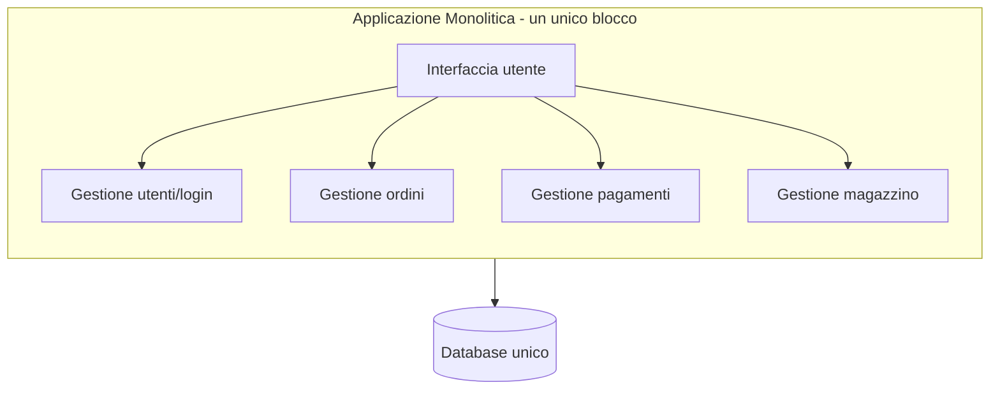
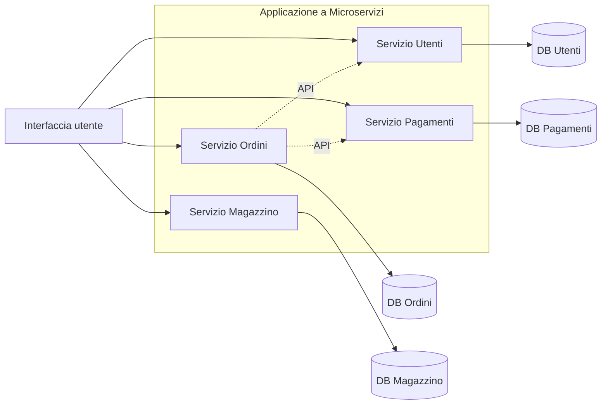
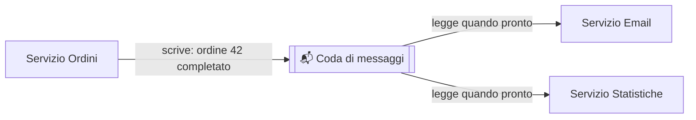
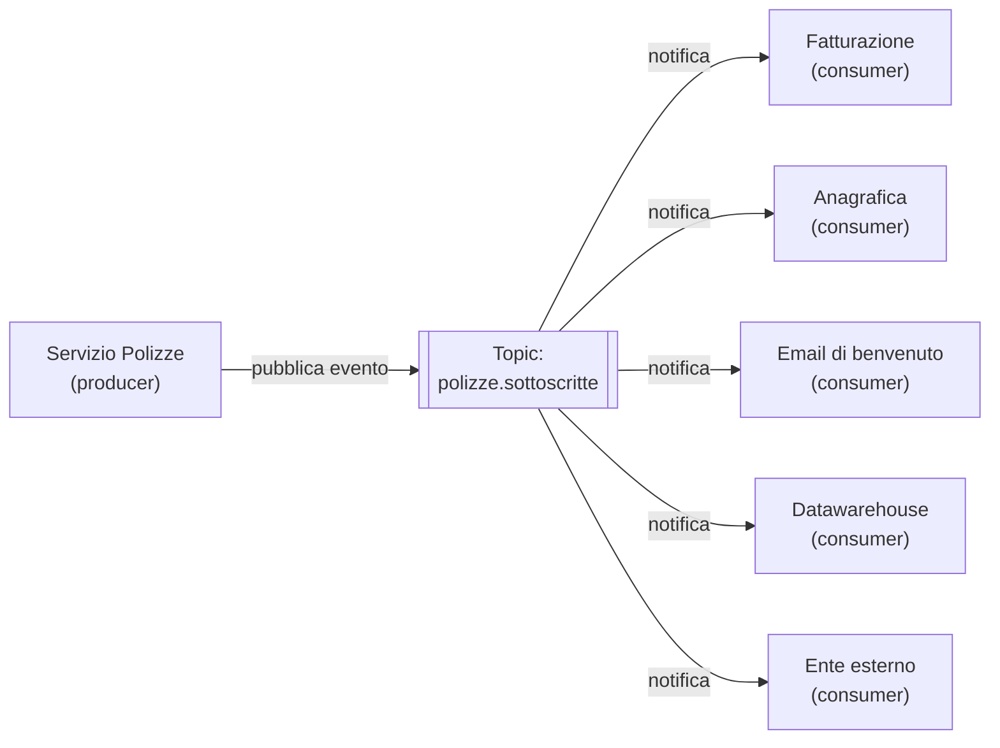
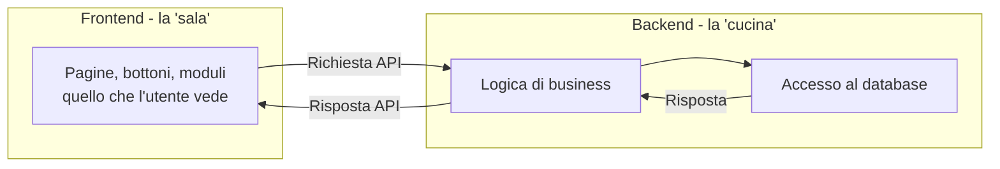
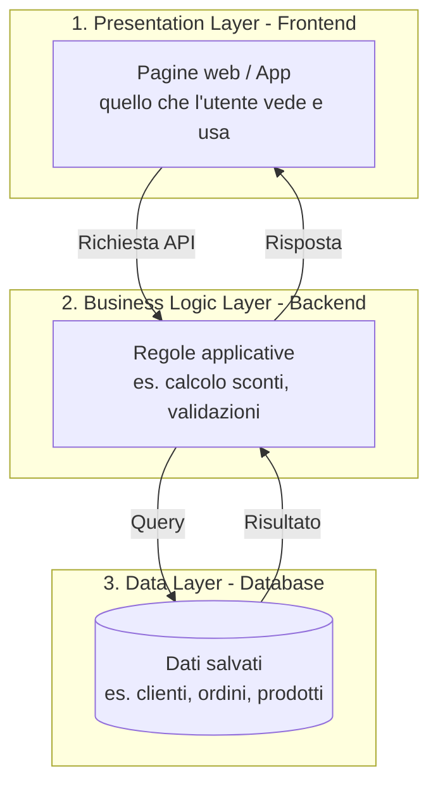

# 11. Architetture software


> 📄 **[Scarica questa sezione in PDF](https://darioschioppi.github.io/corso-onboarding-devops/pdf/11-architetture-software.pdf)** — utile per la stampa o la lettura offline.


Nella sezione 2 (Fondamenti di informatica) hai già incontrato i mattoncini
di base: API, REST, database, container. In questa sezione facciamo un passo
in più: vediamo come questi mattoncini vengono **combinati insieme** per
costruire il software di cui il tuo team si occupa — e lo facciamo seguendo
di nuovo **ShopFacile**, la piattaforma e-commerce già incontrata nelle
sezioni DevOps e CI/CD, con **Marco** nel ruolo di chi discute
spesso le scelte infrastrutturali e architetturali del progetto.

Non ti serve saper progettare un'architettura software — è il lavoro degli
sviluppatori e degli architetti. Ti serve invece **capire a grandi linee come
è "fatto" il software**, per poter:

- capire perché certe attività richiedono più tempo di altre ("aggiungere
  questa funzionalità è complicato perché tocca tre servizi diversi");
- dialogare con il team usando le parole giuste ("frontend", "backend",
  "microservizio", "database");
- capire meglio certe scelte tecniche quando vengono discusse in retrospettiva
  o in fase di stima.

## 🎯 Obiettivi della sezione

Al termine di questa sezione saprai:

- distinguere un'architettura monolitica da un'architettura a microservizi,
  e spiegarne pro e contro;
- capire la differenza tra frontend e backend;
- capire cos'è il modello client-server e l'architettura a 3 livelli;
- avere un'idea di base di come comunicano i vari "pezzi" di un software
  (API/REST e code di messaggi);
- capire cos'è un'**Event-Driven Architecture** e distinguere un evento
  da un comando;
- sapere cos'è il "serverless" e quando viene usato.

---

## 11.1 Cos'è un'architettura software

Quando si costruisce una casa, prima di posare un mattone si disegna una
**pianta**: dove va la cucina, dove il bagno, come sono collegate le stanze,
dove passano i tubi dell'acqua e i cavi elettrici. Quella pianta è
l'"architettura" della casa: definisce come sono organizzati e collegati i
suoi pezzi.

L'**architettura software** è la stessa cosa applicata a un programma: è il
modo in cui le sue diverse parti (chi mostra le pagine, chi elabora i dati,
chi li salva) sono organizzate e come comunicano tra loro.

Come per una casa, non esiste un'unica pianta giusta per tutti i casi: una
villetta e un grattacielo hanno esigenze diverse e richiedono progetti
diversi. Lo stesso vale per il software: la scelta dell'architettura dipende
dalle dimensioni del progetto, dal numero di utenti, dal team disponibile e
da quanto velocemente deve poter crescere.

Anche ShopFacile, come ogni software, ha dovuto affrontare questa scelta fin
dall'inizio. Vediamo le due "piante" più comuni tra cui il team ha dovuto
decidere: il monolite e i microservizi.

---

## 11.2 Architettura Monolitica

Un'architettura **monolitica** (dal greco "un unico blocco di pietra") è
quella in cui **tutto il software è scritto e distribuito come un unico
blocco unito**: la parte che gestisce gli utenti, quella che gestisce gli
ordini, quella che gestisce i pagamenti, quella che parla con il database...
tutto vive nello stesso progetto, viene compilato insieme e viene eseguito
come un unico programma.

### Analogia: il grande magazzino unico

Pensa a un **grande magazzino** che vende di tutto sotto lo stesso tetto:
abbigliamento, elettronica, alimentari, arredamento. C'è un'unica cassa
centrale, un unico sistema di gestione del magazzino, un'unica squadra di
addetti che, in teoria, potrebbe occuparsi di qualsiasi reparto. È comodo da
costruire all'inizio (un solo edificio, una sola gestione), ma se un giorno
vuoi ampliare solo il reparto elettronica, devi comunque intervenire
sull'intero edificio, e se va in tilt il sistema di cassa centrale, si ferma
la vendita in **tutti** i reparti contemporaneamente.



### Pro del monolite

- **Semplice da avviare**: all'inizio di un progetto, con un team piccolo, è
  molto più rapido costruire e mandare in produzione un blocco unico.
- **Meno complessità operativa**: un solo "pacchetto" da distribuire, un solo
  ambiente da monitorare, meno pezzi che possono comunicare male tra loro.
- **Più facile da testare end-to-end**, perché tutto il flusso vive nello
  stesso posto.

### Contro del monolite

- **Difficile da scalare in modo selettivo**: se solo una parte del software
  è sotto carico (es. tanti utenti che fanno ricerche), non puoi "potenziare"
  solo quella parte: devi duplicare l'intero blocco, anche le parti che non ne
  hanno bisogno.
- **Un problema in una parte può bloccare tutto**: un bug o un
  sovraccarico in un singolo componente rischia di far cadere l'intera
  applicazione, non solo quella funzionalità.
- **Rilasci più lenti e rischiosi al crescere delle dimensioni**: con tanti
  sviluppatori che lavorano sullo stesso blocco di codice, ogni rilascio
  richiede di testare e distribuire **tutto** insieme, anche se hai
  modificato solo un piccolo pezzo.
- **Difficile far crescere tanti team in parallelo** senza che si "pestino i
  piedi" a vicenda sullo stesso codice.

**Esempio pratico**: un lunedì, **Marco**, **Giulia** e **Ahmed** arrivano
tutti e tre con una modifica pronta e indipendente — ma ShopFacile è un
unico blocco, quindi esiste **un solo rilascio possibile** che le contiene
tutte insieme. Se il test automatico sulla modifica di Giulia fallisce
all'ultimo momento, il rilascio si ferma: anche le modifiche di Marco e
Ahmed, già pronte da ore, restano bloccate con lei, benché il loro lavoro
non abbia nulla in comune col suo. Il costo del monolite non è solo
"ricompilare e rilasciare **l'intera applicazione**": è soprattutto **far
aspettare le persone** l'una per colpa delle altre — un costo che,
all'inizio, il team accettava volentieri in cambio della semplicità.

> 💡 **Per confronto**: non tutti i software devono necessariamente evolvere
> oltre il monolite. Un gestionale interno per l'ufficio commerciale, usato
> da poche decine di persone e senza picchi di traffico, può restare un
> monolite per anni senza alcun problema: la scelta dipende dal contesto, non
> è "il monolite è superato". Lo vedremo tra poco parlando di quando ha
> davvero senso cambiare.

Con il tempo, però, ShopFacile è cresciuto: più utenti, più developer nel
team, più traffico concentrato su alcune funzionalità (il catalogo durante
i saldi, i pagamenti durante il Black Friday). È qui che il monolite ha
iniziato a mostrare i suoi limiti, ed è qui che entra in scena l'architettura
alternativa: i microservizi.

---

## 11.3 Architettura a Microservizi

Un'architettura a **microservizi** divide il software in tanti **piccoli
servizi indipendenti**, ciascuno responsabile di **una sola area** (es. "il
servizio che gestisce gli utenti", "il servizio che gestisce i pagamenti",
"il servizio che gestisce il magazzino"). Ogni servizio ha il suo codice, a
volte il suo database, e viene distribuito e aggiornato **separatamente**
dagli altri. I servizi comunicano tra loro tramite API (esattamente quelle
che hai visto nella sezione 2) o tramite code di messaggi (le vediamo a
breve).

### Analogia: tanti piccoli negozi specializzati

Rispetto al grande magazzino unico, immagina ora una **via dello shopping**
con tanti piccoli negozi specializzati: la libreria, il negozio di
elettronica, il fruttivendolo. Ogni negozio ha la sua cassa, il suo
personale, i suoi orari, la sua gestione del magazzino, ed è **indipendente**
dagli altri: se il fruttivendolo chiude per ferie, la libreria continua a
vendere libri senza problemi. Se un giorno la libreria diventa
particolarmente famosa e affollata, il proprietario può assumere più
commessi solo lì, senza dover potenziare anche gli altri negozi. In
compenso, se un cliente vuole comprare un libro E della frutta, deve andare
in due negozi diversi (cioè: serve più "coordinamento" tra i pezzi).



### Pro dei microservizi

- **Scalabilità selettiva**: puoi potenziare solo il servizio sotto carico
  (es. più istanze del servizio Ordini durante il Black Friday), senza
  toccare gli altri.
- **Rilasci indipendenti**: puoi aggiornare il servizio Pagamenti senza
  dover rilasciare (e rischiare di rompere) il servizio Magazzino.
- **Team più autonomi**: team diversi possono lavorare su servizi diversi in
  parallelo, con meno conflitti e meno dipendenze reciproche.
- **Guasto isolato**: se un servizio ha un problema, in teoria gli altri
  possono continuare a funzionare (non sempre in pratica, ma è l'obiettivo).
- **Libertà tecnologica**: ogni servizio può, in teoria, usare il linguaggio
  o il database più adatto al suo compito specifico.

### Contro dei microservizi

- **Complessità operativa molto più alta**: ora ci sono tanti "pezzi" da
  distribuire, monitorare, far comunicare correttamente tra loro. Serve
  un'infrastruttura DevOps solida (vedi sezione 9) per gestirla bene.
- **Comunicazione tra servizi da progettare con cura**: se il servizio A
  chiama il servizio B che chiama il servizio C, e uno di questi è lento o
  irraggiungibile, il problema si propaga.
- **Più difficile da debuggare**: un errore può nascere dall'interazione tra
  più servizi, ed è un costo aggiuntivo che richiede di investire proprio
  negli strumenti di monitoraggio già visti nella sezione 9 (log
  centralizzati, dashboard, allarmi) — senza di essi, capire quale servizio
  ha causato il problema può richiedere ore anziché minuti.
- **Richiede un team più maturo** su temi come CI/CD, containerizzazione e
  monitoraggio, perché la complessità operativa cresce parecchio.

**Esempio pratico**: **Marco** e il resto del team decidono di scomporre
ShopFacile in microservizi: il catalogo prodotti diventa un servizio
separato, con il suo repository e la sua pipeline di rilascio (quella vista
nella sezione 10). Se il team vuole aggiungere un nuovo filtro di ricerca
nel catalogo, rilascia **solo quel servizio**: i pagamenti e la gestione
ordini continuano a funzionare esattamente come prima, senza bisogno di
essere ritestati o rilasciati di nuovo.

### Il prezzo pagato: quando la rete si mette in mezzo

Qualche settimana dopo la scomposizione, un cliente segnala un ordine
risultato pagato ma mai registrato come completato. **Giulia** indaga: il
servizio Pagamenti ha confermato l'incasso, ma il messaggio verso il
servizio Ordini si è perso per un timeout di rete. Nel vecchio monolite
questo **non poteva accadere**: pagamento e ordine erano un'unica
operazione sullo stesso database, o riuscivano entrambe o fallivano
entrambe. Ora, con due servizi che si parlano via rete, una delle due
operazioni può andare a buon fine e l'altra no — un problema chiamato
**transazione distribuita**: un'operazione che deve avere successo su più
servizi insieme, ma che la rete può "spezzare" a metà.

I microservizi non eliminano la complessità: la **spostano** dal codice
(dove un unico database garantiva tutto o niente) alla rete (dove serve
gestire esplicitamente messaggi persi, in ritardo o duplicati). Per il tuo
ruolo, la conseguenza è concreta: una modifica che coinvolge la
comunicazione tra servizi può costare più del previsto in stima, per la
gestione di errori e casi limite che nel monolite non esistevano.

### Quando ha senso passare da monolite a microservizi

Non è vero che i microservizi sono "sempre meglio". Anzi: molti progetti,
soprattutto agli inizi, **partono volutamente come monolite**, proprio come
ha fatto ShopFacile, perché è più rapido e il team è piccolo. Il passaggio a
microservizi ha senso quando succede una o più di queste cose — ed è
esattamente il ragionamento che Marco ha portato al team di ShopFacile:

- il team è cresciuto molto e più squadre lavorano sullo stesso codice,
  intralciandosi a vicenda;
- alcune parti del sistema hanno bisogno di scalare molto più di altre (es.
  il catalogo prodotti di ShopFacile riceve 100 volte più traffico della
  gestione fatture);
- i rilasci del monolite sono diventati lenti, rischiosi e "tutto o nulla";
- il codice è diventato talmente grande e intrecciato che anche piccole
  modifiche richiedono di toccare (e ritestare) mezza applicazione.

Una buona regola pratica che sentirai spesso: **"non iniziare con i
microservizi"**. Molte aziende, incluse alcune molto famose nel settore
tech, sono partite da un monolite e sono passate ai microservizi solo quando
la crescita lo ha reso necessario — non il contrario. Un gestionale interno
per l'ufficio commerciale, usato da poche decine di persone senza picchi di
traffico, è un controesempio utile: probabilmente non incontrerà mai nessuna
di queste quattro condizioni, e restare monolite per lui è la scelta giusta,
non un ritardo da recuperare.

### Monolite vs Microservizi: la tabella di confronto

| Aspetto | Monolite | Microservizi |
|---|---|---|
| Velocità di partenza di un progetto | Alta: si parte rapidamente | Più bassa: serve progettare i confini tra servizi e l'infrastruttura |
| Scalabilità | Si scala tutto insieme, anche le parti che non servono | Si scala solo il servizio che ne ha bisogno |
| Complessità operativa (deploy, monitoraggio) | Bassa: un solo blocco da gestire | Alta: tanti servizi da distribuire, far comunicare, monitorare |
| Rilasci | Un rilascio unico, tocca tutto il sistema | Rilasci indipendenti per singolo servizio |
| Isolamento dei guasti | Basso: un problema può bloccare tutto | Più alto: un servizio può fallire senza fermare tutti gli altri |
| Autonomia dei team | Bassa: più team sullo stesso codice si intralciano | Alta: ogni team può gestire i propri servizi |
| Adatto a | Progetti piccoli/medi, team piccoli, fasi iniziali (MVP) | Progetti grandi, molti team, esigenze di scalabilità differenziate |

### Un effetto collaterale: la Legge di Conway

Un'osservazione nota come **Legge di Conway**: la struttura del software
che un'azienda costruisce tende a **rispecchiare la struttura del team**
che lo costruisce — e vale anche il contrario. Quando il team di ShopFacile
decide di scomporre il software per dominio (catalogo, ordini, pagamenti),
prima o poi sente il bisogno di riorganizzare anche le **persone** in
squadre allineate a quei domini. Per un PM o uno Scrum Master, una scelta
architetturale non resta quindi confinata al codice: può tradursi in nuovi
ruoli, responsabilità e meccanismi di coordinamento tra team che prima
erano un tutt'uno.

---

## 11.4 Come comunicano i componenti

Nel momento in cui ShopFacile è diventato un insieme di servizi separati
(catalogo, ordini, pagamenti, magazzino), è emersa una domanda nuova: come
fanno questi servizi a scambiarsi informazioni tra loro? Sia nel monolite
(tra i suoi moduli interni) che, soprattutto, nei microservizi (tra servizi
separati), i vari "pezzi" del software devono comunicare. Ci sono
principalmente due modalità.

### Comunicazione sincrona: API e REST

Il modo più comune è quello che hai già visto nella sezione 2: un componente
fa una **richiesta** a un altro tramite un'**API**, tipicamente in stile
**REST**, e resta in attesa della **risposta** prima di andare avanti — un
po' come una telefonata: fai la domanda e resti in linea aspettando la
risposta, prima di riprendere quello che stavi facendo.

Questo funziona benissimo per molti casi ("dammi i dati di questo cliente",
"verifica se questo pagamento è andato a buon fine"), ma ha un limite: se il
servizio che deve rispondere è lento o irraggiungibile, chi ha fatto la
richiesta resta bloccato ad aspettare.

**Esempio pratico**: il frontend di ShopFacile vuole mostrare i dettagli di
un ordine al cliente. Fa una richiesta HTTP di tipo GET a un'API REST del
backend, e resta in attesa della risposta:

Richiesta:

```
GET /api/ordini/42
```

Risposta (dopo pochi millisecondi):

```json
{
  "id": 42,
  "cliente": "ACME S.r.l.",
  "stato": "in consegna",
  "totale": 129.90
}
```

Finché il backend non risponde, il frontend resta "in attesa" — esattamente
come nell'analogia della telefonata — prima di poter mostrare questi dati a
schermo.

Questo tipo di comunicazione, però, non è adatto a tutto: se il servizio
Ordini di ShopFacile dovesse restare "in attesa" ogni volta che avvisa il
servizio Email di inviare una conferma, un rallentamento della posta
elettronica bloccherebbe anche la conferma dell'ordine. Per questi casi
serve un modo diverso di comunicare: la comunicazione asincrona.

### Comunicazione asincrona: le code di messaggi

Per certi casi è più comodo **non restare in attesa** di una risposta
immediata, ma semplicemente "lasciare un messaggio" che qualcun altro
leggerà quando potrà. È qui che entrano in gioco le **code di messaggi**
(*message queue*), uno strumento tipico della comunicazione **asincrona**.

#### Analogia: la cassetta della posta

Pensa alla differenza tra una telefonata e una **cassetta della posta**:

- con la telefonata (comunicazione sincrona/API) chiami qualcuno e resti in
  attesa che risponda subito, in tempo reale;
- con una lettera lasciata nella cassetta della posta (comunicazione
  asincrona/coda di messaggi) **scrivi il messaggio e vai avanti con le tue
  cose**: non resti lì ad aspettare. Il destinatario, quando ha tempo, apre
  la cassetta, legge il messaggio e agisce di conseguenza. Se il destinatario
  in questo momento non è in casa, il messaggio resta comunque nella
  cassetta ad aspettarlo, senza perdersi.

Esempio pratico: quando un cliente completa un ordine su ShopFacile, il
servizio Ordini non chiama direttamente e "in diretta" il servizio Email per
inviare la conferma. Invece, scrive un messaggio del tipo "ordine 42
completato" in una coda; il servizio Email (quando è pronto, magari qualche
secondo dopo) legge quel messaggio dalla coda e invia l'email. Se il
servizio Email in quel momento è sovraccarico o temporaneamente fermo, il
messaggio resta comunque in coda, e verrà elaborato appena il servizio torna
disponibile — non si perde nulla.



Questo approccio è molto usato quando un evento (es. "ordine completato")
deve essere notificato a **più** servizi interessati, senza che il servizio
che genera l'evento debba conoscerli tutti o aspettare che rispondano tutti.

Perché serve uno strumento dedicato invece di scrivere i messaggi in una
tabella del database? Perché una coda vera e propria garantisce la
**consegna** anche se il destinatario era offline, **ritenta
automaticamente** se il primo tentativo fallisce, e permette a ciascun
servizio di leggere al proprio ritmo, senza che un consumatore lento
accumuli lavoro per gli altri. Esempi: **RabbitMQ**, **Azure Service Bus**,
**Kafka**.

| | Comunicazione sincrona (API/REST) | Comunicazione asincrona (coda di messaggi) |
|---|---|---|
| Analogia | Telefonata | Cassetta della posta |
| Chi chiama resta in attesa? | Sì, della risposta | No, va avanti |
| Adatta a | Richieste che servono "subito" (es. leggere dati) | Notifiche/eventi che possono essere elaborati "quando capita" |
| Rischio se il destinatario è lento/offline | Chi chiama resta bloccato o riceve un errore | Il messaggio resta in coda, nessuna perdita |

---

## 11.5 Event-Driven Architecture: reagire invece di chiedere

Cambiamo per un momento esempio, restando nel contesto assicurativo in cui
lavori davvero: quando un cliente sottoscrive una polizza, non succede solo
una cosa: ne succedono sette. Va emesso il documento di polizza, va
incassato il primo premio, va aggiornata l'anagrafica del cliente, va
avvisato l'agente che ha curato la vendita, va alimentato il datawarehouse
per le statistiche, va spedita l'email di benvenuto, e va comunicata la
sottoscrizione a un ente esterno per gli obblighi di legge. Il servizio che
registra la polizza le chiama tutte e sette, una dopo l'altra, come nella
comunicazione sincrona vista al paragrafo precedente: **Ahmed** ci ha
messo tre giorni a scrivere quelle sette chiamate, con tutta la gestione
degli errori che ciascuna richiede.

Il problema arriva dopo, quando il codice è già in produzione. Se il
sistema del datawarehouse è lento, il cliente resta davanti a una
rotellina di caricamento per una cosa che, dal suo punto di vista, non gli
serve a niente: sta solo aspettando che una statistica interna venga
aggiornata. Se l'invio all'ente esterno è temporaneamente giù, la
sottoscrizione **fallisce del tutto** — anche se la polizza, in realtà, è
perfettamente valida e il premio è stato incassato. E ogni volta che il
business chiede di aggiungere un ottavo destinatario (un nuovo report, un
nuovo partner da avvisare), bisogna modificare e ritestare il servizio più
critico dell'intera azienda: quello che vende le polizze.

**Marco** lo riassume a **Luca** in una frase che vale l'intera
sottosezione: *"il problema non è quello che facciamo, è chi deve
saperlo"*. Il servizio Polizze non dovrebbe essere lui a doversi ricordare
di tutti e sette gli interessati, uno per uno, e a restare in attesa che
ciascuno gli risponda.

### Il capovolgimento: dichiarare un fatto, non impartire ordini

L'architettura **event-driven** (guidata dagli eventi) capovolge il
problema. Invece che il servizio Polizze *chieda* a sette sistemi di fare
qualcosa, dichiara semplicemente che **è accaduto un fatto**: "polizza
88471 sottoscritta". Chi è interessato a quel fatto **reagisce** per conto
proprio, senza che il servizio Polizze debba saperlo, aspettarlo o
richiamarlo.

Vale la pena fermarsi su questa distinzione, perché è il cuore di tutto il
resto:

- un **comando** è un ordine diretto al futuro, verso un destinatario
  preciso: "Servizio Email, invia questa conferma". Chi lo riceve può
  rifiutarlo o fallirlo, e chi lo manda normalmente se ne aspetta un
  esito.
- un **evento** è un fatto accaduto al passato, e per definizione
  **immutabile**: "la polizza è stata sottoscritta". Non è indirizzato a
  nessuno in particolare, non richiede una risposta, e non può essere
  "rifiutato" — è già successo.

Chi pubblica un evento si chiama **producer** (o *publisher*); chi lo
riceve e reagisce si chiama **consumer** (o *subscriber*). Il meccanismo
con cui i due si incontrano si chiama **pub/sub** (*publish/subscribe*,
pubblica/sottoscrivi): il producer pubblica l'evento su un canale
dedicato, chiamato **topic** ("polizze.sottoscritte"), e ogni consumer
interessato si sottoscrive a quel topic per riceverne una copia. A fare da
intermediario tra producer e consumer c'è un **broker**: il software che
riceve gli eventi pubblicati e li distribuisce a tutti i sottoscrittori.
Non è un componente nuovo da imparare: l'infrastruttura è esattamente
quella già vista al paragrafo 11.4 a proposito delle code di messaggi —
RabbitMQ, Azure Service Bus, Kafka. Cambia il modo di usarla: non un
messaggio per un singolo destinatario noto, ma un evento per un numero
qualsiasi di sottoscrittori, anche futuri.



### Il beneficio: disaccoppiamento, prima organizzativo che tecnico

Con questo schema, aggiungere un ottavo consumatore (un nuovo report per
un nuovo partner commerciale) significa scrivere un nuovo consumer che si
sottoscrive al topic già esistente — **senza toccare** il servizio
Polizze, senza rimetterlo in test, e senza dover chiedere una finestra di
rilascio sul sistema più critico dell'azienda. Questo si chiama
**disaccoppiamento**, ed è il vantaggio principale del pattern: per un PM
non è (solo) un beneficio tecnico, è un beneficio **organizzativo**. Il
team che gestisce le polizze non deve più coordinarsi con ogni altro team
ogni volta che qualcuno ha bisogno di sapere qualcosa in più — si aggancia
qui la Legge di Conway vista al paragrafo 11.3: se i team restano
indipendenti anche nel modo in cui i loro sistemi comunicano, l'architettura
a eventi è spesso ciò che rende quell'indipendenza possibile davvero,
invece che solo desiderata sulla carta.

> 💡 Sentirai talvolta due nomi più avanzati legati a questo mondo:
> **event sourcing** (salvare la storia di un'entità come sequenza di
> eventi accaduti, invece che il suo solo stato attuale) e **CQRS**
> (*Command Query Responsibility Segregation*, separare i percorsi di
> scrittura e lettura dei dati). Non ti servono a questo livello: è
> sufficiente riconoscere i nomi quando li senti nominare, per non
> confonderli con l'event-driven "di base" appena visto.

### Il prezzo: cosa si perde rispetto a una catena di chiamate

Il disaccoppiamento non è gratuito. Quattro conseguenze concrete, e reali:

- **Il flusso non si legge più in un posto solo.** Nessuno può aprire il
  codice del servizio Polizze e vedere, in ordine, "cosa succede dopo una
  sottoscrizione": succede in cinque punti diversi del sistema, ciascuno
  scritto da un team diverso. Per ricostruire la sequenza serve il
  **tracciamento distribuito** visto nella sezione 9 (le tracce che
  seguono una richiesta attraverso più servizi) — senza quello strumento,
  capire "chi ha reagito e quando" a un singolo evento richiede una
  caccia al tesoro tra i log di sistemi diversi.
- **L'ordine di arrivo non è garantito, e un evento può arrivare due
  volte.** Se la rete o il broker hanno un intoppo, un consumer può
  ricevere lo stesso evento due volte. Se il consumer che incassa il
  premio non se ne accorge, il cliente si trova il premio scalato due
  volte dal conto. La protezione si chiama **idempotenza**: progettare il
  consumer in modo che elaborare lo stesso evento due volte produca lo
  stesso risultato di elaborarlo una volta sola (es. controllare prima "ho
  già incassato questo premio?" invece di incassarlo incondizionatamente).
- **La coerenza è eventuale, non immediata.** Subito dopo la
  sottoscrizione, il cliente può già vedere la sua polizza attiva
  nell'area clienti, mentre l'app dell'agente non l'ha ancora ricevuta,
  perché il suo consumer non ha ancora elaborato l'evento — magari sono
  passati solo due secondi, ma in quei due secondi i due sistemi
  "raccontano" cose diverse. Questa **coerenza eventuale** (*eventual
  consistency*) non è un bug da correggere: è una caratteristica del
  pattern che il business deve **accettare consapevolmente**, decidendo
  per quali processi è tollerabile e per quali no.
- **Il debug richiede strumenti diversi.** Non basta più riprodurre una
  chiamata e guardare la risposta: serve poter ricostruire, evento per
  evento, chi ha pubblicato cosa e chi ha reagito come — di nuovo,
  observability e tracciamento distribuito, non un debugger tradizionale.

Il criterio per scegliere tra i due mondi resta quello visto al paragrafo
11.4, solo più affilato: comunicazione **sincrona** quando chi chiama ha
bisogno della risposta per decidere cosa fare subito dopo (es. "il
pagamento è andato a buon fine? allora mostro la conferma"); comunicazione
**a eventi** quando chi pubblica sta semplicemente informando che
qualcosa è successo, senza bisogno di sapere chi reagirà né come.

---

## 11.6 Frontend vs Backend

Finora abbiamo parlato di come i servizi di ShopFacile comunicano **tra
loro**. Ma c'è un'altra comunicazione altrettanto importante: quella tra il
sistema e la persona che lo usa, cioè il cliente che naviga il sito. Per
capirla, serve distinguere due grandi parti presenti in ogni applicazione
web o mobile (un sito di e-commerce come ShopFacile, un'app bancaria, un
gestionale aziendale): **frontend** e **backend**.

- il **frontend** è tutto ciò che l'utente vede e con cui interagisce
  direttamente: pagine, bottoni, moduli da compilare, grafici. È la parte
  che "gira" nel browser o nell'app sul telefono dell'utente;
- il **backend** è la parte che l'utente non vede: elabora la logica di
  business ("questo sconto si applica solo se il carrello supera 50€"),
  gestisce l'accesso al database, si occupa della sicurezza, e risponde alle
  richieste che arrivano dal frontend.

### Analogia: il ristorante, sala vs cucina

Pensa a un ristorante:

- la **sala** (i tavoli, i camerieri, il menù che vedi) è il **frontend**:
  è quello che tu, cliente, vedi e con cui interagisci direttamente. Ordini
  un piatto guardando il menù, il cameriere prende nota;
- la **cucina** è il **backend**: è dove avviene il vero lavoro (cucinare il
  piatto, gestire le scorte, applicare la ricetta), ma tu, seduto al tavolo,
  non la vedi. Interagisci con essa solo indirettamente, tramite il
  cameriere (che, come abbiamo visto nella sezione 2, è un po' come l'API).

Un frontend curato ma con un backend debole è come un ristorante con una
sala elegantissima ma una cucina che sbaglia sempre gli ordini: l'esperienza
finale ne risente comunque. Vale anche il contrario: un backend eccellente
con un frontend confuso farà comunque fatica a piacere ai clienti.



**Esempio pratico**: quando clicchi il pulsante "Conferma ordine" su
ShopFacile, il **frontend** (il bottone che hai cliccato) invia una
richiesta al **backend** con i dati del carrello; il backend verifica che i
prodotti siano disponibili, calcola il totale applicando eventuali sconti,
salva l'ordine nel database e restituisce al frontend una risposta ("ordine
confermato, numero 42"), che il frontend traduce in un messaggio di conferma
a schermo. Tu, da cliente, vedi solo l'ultimo passaggio: tutto il resto
avviene "in cucina".

Nel team sentirai spesso parlare di "sviluppatori frontend" e "sviluppatori
backend" (o "full-stack", chi lavora su entrambi): sono specializzazioni
diverse, con linguaggi e strumenti spesso diversi, anche se lavorano sullo
stesso prodotto finale.

Detto così, "frontend" e "backend" sembrano semplicemente due metà dello
stesso programma. In realtà, quasi sempre, girano fisicamente in due posti
diversi e comunicano attraverso una rete: è il momento di guardare a questo
rapporto con il nome più tecnico che porta, il modello client-server.

---

## 11.7 Client-Server: il concetto base

Hai già incontrato questo concetto nella sezione 2 parlando di HTTP: il
modello **client-server** è l'idea di base secondo cui esiste un **client**
(chi fa richieste, es. il tuo browser) e un **server** (chi riceve la
richiesta, la elabora e risponde, es. il computer che ospita l'applicazione).

È utile ricordarlo qui perché frontend e backend, di fatto, **spesso
corrispondono** a client e server: il frontend che gira nel tuo browser è il
client, il backend che gira su un server (fisico, virtuale, o un container
in cloud) è il server. Non è una regola matematica assoluta — esistono
architetture più sofisticate — ma per il 90% dei casi che incontrerai
questa corrispondenza è un buon punto di partenza mentale.

**Esempio pratico**: quando apri ShopFacile sul telefono, l'app stessa (che
gira sul tuo telefono) è il **client**: fa una richiesta ("dammi i dettagli
del mio ultimo ordine") a un **server** remoto di ShopFacile, che elabora la
richiesta e restituisce il dato. Se chiudi l'app, il server continua a
funzionare tranquillamente per tutti gli altri clienti: il client è "usa e
getta", il server resta sempre lì, pronto a rispondere a nuove richieste.

> 💡 **Per confronto**: lo stesso schema vale, identico, per un'app di home
> banking: l'app sul telefono è il client, il server remoto della banca è il
> server. Cambia il contesto (acquisti contro conto corrente), non la
> struttura client-server sottostante.

Sappiamo quindi che un client parla con un server, e che dentro quel server
convivono frontend e backend. Ma **dentro il backend stesso**, come sono
organizzati presentazione, logica di business e dati? Un modo diffuso di
rispondere a questa domanda è l'architettura a 3 livelli.

---

## 11.8 Architettura a 3 livelli

Un modo molto comune, semplice e diffuso di organizzare un'applicazione,
soprattutto nei sistemi gestionali "classici", è l'**architettura a 3
livelli** (in inglese *3-tier architecture*). Divide il software in tre
strati, ciascuno con una responsabilità precisa:

1. **Presentation layer** (livello di presentazione): è il frontend, quello
   che l'utente vede e usa;
2. **Business logic layer** (livello di logica di business): è il backend,
   dove vengono applicate le regole ("uno sconto si applica solo se...",
   "un ordine non può essere spedito se non è stato pagato...");
3. **Data layer** (livello dei dati): è il database, dove i dati vengono
   effettivamente salvati e recuperati.

L'idea chiave è che **ogni livello parla solo con quello adiacente**: il
livello di presentazione non accede mai direttamente al database, ma passa
sempre dal livello di logica di business, che fa da "filtro" e applica le
regole necessarie prima di leggere o scrivere i dati.

Questa regola evita un problema concreto: se l'interfaccia accedesse
direttamente al database, le regole di business ("lo sconto si applica
solo se...") finirebbero duplicate in più punti (pagina web, app mobile,
un'esportazione dati) — e il giorno in cui una regola cambia, il rischio è
che qualcuno aggiorni una copia e si scordi le altre, senza che nessuno
sappia più **dove sta la verità**.

### Analogia

Pensa di nuovo al ristorante, ma con un passaggio in più: tu (client) parli
solo con il cameriere (presentation layer), il cameriere porta l'ordine allo
chef (business logic layer), che decide come preparare il piatto secondo la
ricetta e le regole della cucina, e solo lo chef accede alla **dispensa**
(data layer) per prendere gli ingredienti. Tu non entri mai direttamente
nella dispensa: passi sempre dallo chef, che sa quali regole rispettare
(es. "questo piatto non si può preparare se manca un ingrediente
fondamentale").



Questo schema a 3 livelli è alla base di moltissime applicazioni aziendali
"tradizionali" (gestionali, portali interni, applicazioni web classiche), e
puoi ritrovarlo sia dentro un monolite (i tre livelli vivono nello stesso
blocco di codice) sia distribuito su più microservizi (ogni servizio ha
comunque, internamente, una sua piccola struttura a livelli) — come nel
caso del servizio Ordini di ShopFacile.

**Esempio pratico**: nel servizio Ordini di ShopFacile, che applica uno
sconto del 10% agli ordini superiori a 100€, il livello di presentazione
mostra semplicemente il totale finale nel carrello; il livello di logica di
business è quello che **decide** se lo sconto si applica o no, facendo il
calcolo; il livello dati è quello che, a fine ordine, salva il totale
scontato nel database. Se un giorno la regola cambia (es. lo sconto diventa
15%), basta modificare il livello di logica di business: la presentazione e
il database non vengono toccati. Lo stesso identico schema, del resto, è
alla base anche di un gestionale aziendale "classico" per l'ufficio
commerciale: cambia il dominio (sconti sugli ordini contro preventivi e
fatture), non la struttura a tre livelli.

Dopo monolite, microservizi, comunicazione e 3 livelli, resta un ultimo modo
di organizzare il codice, agli antipodi rispetto al server "sempre acceso"
che abbiamo dato per scontato finora: il serverless.

---

## 11.9 Un accenno al Serverless

Finora abbiamo parlato di software che gira su server (fisici, virtuali, o
container) che devono restare **sempre attivi**, pronti a rispondere in
qualsiasi momento. Il modello **serverless** ("senza server", anche se in
realtà un server c'è sempre, solo che non te ne devi occupare tu) propone
un'idea diversa: scrivi piccole **funzioni** che vengono eseguite dal
fornitore cloud **solo quando servono**, e vengono "spente" subito dopo.

### Analogia: il taxi vs l'auto di proprietà

Gestire un server tradizionale è un po' come avere un'**auto di proprietà**:
la paghi (e la mantieni) sempre, anche quando è parcheggiata e non la usi. Il
serverless è più come prendere un **taxi**: lo chiami solo quando ti serve
uno spostamento, paghi solo per quella corsa, e non devi preoccuparti di
manutenzione, parcheggio o assicurazione quando non lo stai usando.

Esempio pratico: in ShopFacile, quando un cliente carica la foto di un
prodotto reso da segnalare, una funzione serverless si attiva solo in quel
momento, per ridimensionare l'immagine automaticamente in diverse
dimensioni, e poi si "spegne" fino al prossimo caricamento. Non serve
tenere un server acceso 24 ore su 24 in attesa che qualcuno carichi una
foto — a differenza del servizio Ordini o Pagamenti, che devono restare
sempre pronti a rispondere.

Vantaggi principali: si paga solo per l'uso effettivo (nessun costo per il
tempo "di inattività"), e non serve gestire manualmente l'infrastruttura
sottostante (il fornitore cloud se ne occupa). Lo svantaggio principale è che
non è adatto a tutti i casi: per applicazioni che devono rispondere
istantaneamente e in modo continuo, o che richiedono elaborazioni molto
lunghe, il modello serverless può introdurre piccoli ritardi ("tempo di
avvio a freddo") o limiti di durata.

Esempi di servizi serverless che sentirai citare: **Azure Functions**, **AWS
Lambda**. Ne riparleremo con più dettaglio nella sezione 12 (Cloud).

Con questo abbiamo attraversato tutte le scelte architetturali principali
che il team di ShopFacile ha dovuto affrontare, da "un blocco unico o tanti
servizi?" fino a "serve un server sempre acceso o basta una funzione al
bisogno?". Prima di passare al Cloud, fermiamoci un momento a riepilogare.

---

## 11.10 Riepilogo: cosa ti serve ricordare

Non devi memorizzare ogni dettaglio di questa sezione. Ti basta portarti via
questi concetti chiave, che ti aiuteranno a capire meglio le conversazioni
tecniche del team:

- **Monolite**: un unico blocco di codice. Semplice all'inizio, difficile da
  scalare selettivamente e da far crescere con tanti team.
- **Microservizi**: tanti servizi piccoli e indipendenti. Più scalabili e
  flessibili, ma più complessi da gestire operativamente.
- **API/REST** (comunicazione sincrona, "telefonata") e **code di messaggi**
  (comunicazione asincrona, "cassetta della posta") sono i due modi
  principali con cui i componenti di un software comunicano tra loro.
- **Event-Driven Architecture**: invece di chiamare direttamente chi deve
  fare qualcosa, un servizio pubblica un **evento** (un fatto accaduto) su
  un **topic**, e chi è interessato (**consumer**) reagisce in autonomia,
  senza che chi pubblica (**producer**) debba conoscerlo — un
  **disaccoppiamento** organizzativo, non solo tecnico, che ha un prezzo:
  coerenza eventuale, idempotenza da gestire, debug più complesso.
- **Frontend** (sala) e **Backend** (cucina): la parte visibile all'utente e
  quella che elabora la logica e i dati.
- **Client-Server**: chi fa la richiesta (client) e chi la elabora (server).
- **Architettura a 3 livelli**: Presentazione → Logica di business → Dati,
  ognuno responsabile del proprio compito.
- **Serverless**: funzioni eseguite solo quando servono, senza gestire un
  server sempre attivo — come un taxi rispetto a un'auto di proprietà.

Quando il team discute di "spacchettare il monolite", "aggiungere un
servizio", "usare una coda per questo evento" o "spostare questa funzione su
serverless", ora avrai gli strumenti concettuali per seguire la
conversazione e fare le domande giuste.

---

## ✅ Checklist di autoverifica

- Sapresti spiegare la differenza tra monolite e microservizi con
  un'analogia tua?
- Sai indicare almeno due vantaggi e due svantaggi dei microservizi?
- Sapresti spiegare quando ha senso passare da monolite a microservizi?
- Sai spiegare la differenza tra comunicazione sincrona e asincrona, con
  l'analogia della telefonata e della cassetta della posta?
- Sai spiegare la differenza tra un comando e un evento, e perché è il
  cuore dell'architettura event-driven?
- Sai indicare almeno due trade-off concreti dell'architettura a eventi
  (es. coerenza eventuale, idempotenza)?
- Sai spiegare la differenza tra frontend e backend con l'analogia del
  ristorante?
- Sai descrivere i tre livelli dell'architettura a 3 livelli?
- Sai spiegare, a grandi linee, cos'è il serverless e quando può essere
  utile?

---

## 📝 Esercizi pratici

1. **Disegna l'architettura di un'app che usi tutti i giorni.** Scegli
   un'app che conosci bene (es. un'app di food delivery, di messaggistica o
   di home banking) e disegna a mano uno schema con frontend, backend e
   database, provando a immaginare se sia più vicina a un monolite o a un
   sistema a microservizi.
   ✅ **Come verificare**: se riesci a indicare almeno tre "pezzi" separati
   (es. "app sul telefono", "server che elabora i pagamenti", "database
   degli utenti") e a spiegare a voce come comunicano tra loro, hai centrato
   l'esercizio.

2. **Scrivi una richiesta e una risposta API "a mano".** Scegli una
   funzionalità semplice (es. "ottieni il profilo di un utente") e scrivi tu
   stesso, come nell'esempio pratico di questa sezione, una richiesta
   GET/POST semplificata e la relativa risposta in formato JSON, con almeno
   3-4 campi.
   ✅ **Come verificare**: fai leggere quello che hai scritto a un developer
   del team e chiedi se il formato "assomiglia" a una vera richiesta/risposta
   API che usano nel progetto.

3. **Trasforma un'operazione sincrona in asincrona.** Pensa a un'operazione
   che oggi, nella tua esperienza quotidiana (non necessariamente software),
   richiede un'attesa "in linea" (es. una telefonata al call center) e
   descrivi come diventerebbe se fosse gestita con una coda di messaggi
   (es. lasciare un messaggio in segreteria che verrà richiamato quando c'è
   disponibilità).
   ✅ **Come verificare**: la tua descrizione deve contenere chiaramente chi
   "scrive" il messaggio, dove viene "depositato" e chi lo "legge" più
   tardi, senza che nessuno resti bloccato ad aspettare.

4. **Distingui un comando da un evento.** Prendi tre frasi che potresti
   sentire in una daily standup del tuo progetto (es. "invia la mail di
   conferma", "l'ordine è stato pagato", "aggiorna il saldo del cliente")
   e classifica ciascuna come comando o come evento, spiegando perché.
   ✅ **Come verificare**: per ogni frase, sai indicare se è diretta a un
   destinatario preciso e richiede un'azione futura (comando) o descrive
   un fatto già accaduto che qualcuno può scegliere di ignorare o reagire
   (evento) — se confondi le due categorie su più di una frase, rileggi la
   distinzione al paragrafo 11.5.

5. **Intervista un developer sull'architettura del progetto.** Chiedi a un
   collega developer se il progetto su cui lavori è organizzato come
   monolite, come microservizi, o come una via di mezzo, e fatti indicare un
   esempio concreto di comunicazione tra due componenti (API, coda di
   messaggi o evento pub/sub).
   ✅ **Come verificare**: dopo la chiacchierata, sapresti riassumere in 3-4
   frasi, senza guardare appunti, "come è fatto" il software del progetto e
   quali pezzi lo compongono.

6. **Compila la tabella di confronto con un esempio reale.** Riprendi la
   tabella "Monolite vs Microservizi" della sezione 11.3 e, per ogni riga,
   scrivi a fianco un esempio concreto (reale o immaginario) legato al
   contesto del tuo progetto.
   ✅ **Come verificare**: condividi la tabella compilata con la tua collega
   Scrum Master/PM e chiedile se gli esempi che hai scelto sono plausibili
   per un progetto reale.

7. **Individua un caso d'uso serverless.** Pensa a una funzionalità che, nel
   progetto o in un'app che usi, viene eseguita "una tantum" e su richiesta
   (es. generazione di un PDF, invio di una notifica, ridimensionamento di
   un'immagine) e spiega perché potrebbe essere un buon candidato per il
   modello serverless, oppure perché no.
   ✅ **Come verificare**: la tua spiegazione deve menzionare esplicitamente
   il criterio "si attiva solo quando serve, poi si spegne" e collegarlo al
   caso d'uso scelto.

---

## 🔗 Collegamenti

- [9. DevOps](../09-devops/README.md) — dove trovi observability, tracciamento distribuito e logging, gli strumenti che servono a seguire un flusso event-driven distribuito su più servizi
- [12. Cloud](../12-cloud/README.md) — dove vedremo come queste architetture vengono effettivamente eseguite su infrastrutture cloud come Azure o AWS
- [13. Sicurezza](../13-sicurezza/README.md) — dove vedremo come proteggere questi componenti e le comunicazioni tra di essi

## 📚 Risorse

- [Microsoft Learn – Architetture dei microservizi](https://learn.microsoft.com/it-it/dotnet/architecture/microservices/) — guida approfondita (in italiano) su monolite vs microservizi
- [Martin Fowler – Microservices](https://martinfowler.com/articles/microservices.html) — l'articolo di riferimento sul tema, uno dei più citati nel settore
- [Martin Fowler – MonolithFirst](https://martinfowler.com/bliki/MonolithFirst.html) — perché spesso ha senso partire da un monolite prima di passare ai microservizi
- [Microsoft Learn – Event-driven architecture style](https://learn.microsoft.com/it-it/azure/architecture/guide/architecture-styles/event-driven) — introduzione al pattern event-driven e ai suoi trade-off
- [Martin Fowler – What do you mean by Event-Driven?](https://martinfowler.com/articles/201701-event-driven.html) — chiarisce le diverse sfumature del termine "event-driven", incluso il confronto con event sourcing e CQRS
- [Microsoft Learn – Cos'è il serverless computing](https://azure.microsoft.com/it-it/resources/cloud-computing-dictionary/what-is-serverless-computing) — introduzione al modello serverless
- [Microsoft Learn – Message queue e comunicazione asincrona](https://learn.microsoft.com/en-us/azure/architecture/patterns/async-request-reply) — approfondimento sui pattern di comunicazione asincrona
- [Documentazione ufficiale RabbitMQ – Concetti base](https://www.rabbitmq.com/tutorials) — introduzione pratica alle code di messaggi
