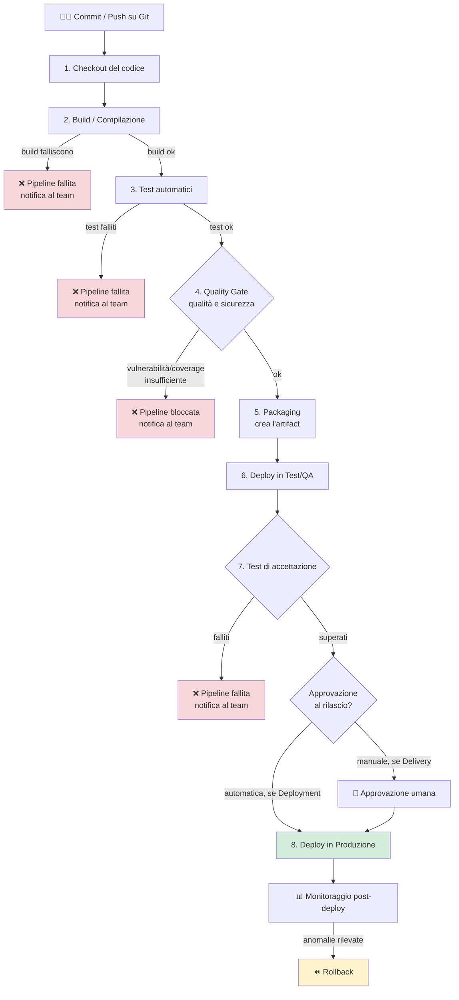
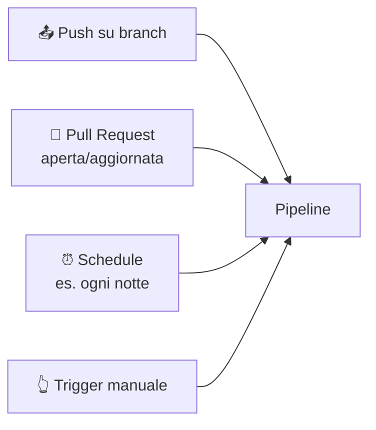
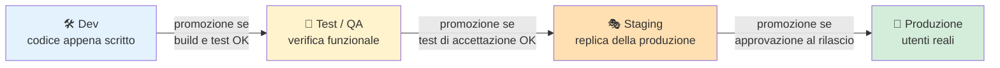
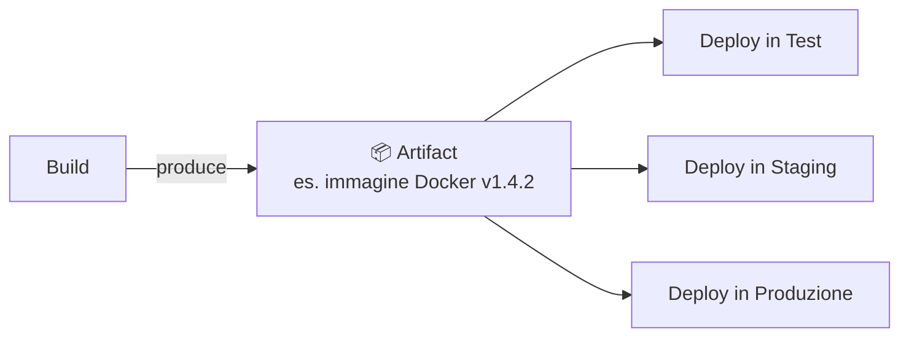
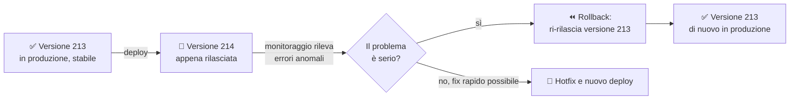

# 11. CI/CD


> 📄 **[Scarica questa sezione in PDF](../../pdf/11-ci-cd.pdf)** — utile per la stampa o la lettura offline.


Nella sezione DevOps hai già incontrato i concetti di **Continuous
Integration** e **Continuous Delivery/Deployment**: sai che servono a
integrare e rilasciare il codice in modo frequente e automatizzato, invece
di accumulare mesi di lavoro in un unico rilascio rischioso. Questa
sezione va un livello più in profondità: non "cosa sono CI/CD e perché
servono" (quello lo trovi in [9. DevOps](../09-devops/README.md)), ma
**come funziona davvero, passo per passo, una pipeline** — cioè lo
strumento concreto che rende possibile la CI/CD.

Alla fine di questa sezione, quando in una daily standup qualcuno dirà
"la pipeline è rossa sul quality gate della coverage" o "il deploy in
staging è partito ma serve l'approvazione manuale per la produzione",
capirai esattamente di cosa si sta parlando.

## 🎯 Obiettivi della sezione

Alla fine di questa sezione saprai:

- ripassare rapidamente la differenza tra Continuous Integration e
  Continuous Delivery/Deployment;
- descrivere le **fasi tipiche** di una pipeline, dal checkout del codice
  al deploy in produzione;
- riconoscere i diversi **trigger** che possono far scattare una pipeline;
- distinguere gli **ambienti** (Dev, Test/QA, Staging, Produzione) e
  capire cosa significa "promuovere" il codice tra di essi;
- capire cos'è un **artifact** e perché viaggia da una fase all'altra
  della pipeline senza essere ricostruito ogni volta;
- spiegare perché si scrive una pipeline come **codice versionato**
  (Pipeline as Code) invece di configurarla a mano da un'interfaccia
  grafica;
- leggere un semplice file YAML che definisce una pipeline;
- capire cos'è un **quality gate** e come blocca un rilascio problematico;
- descrivere cosa succede — e cosa dovrebbe succedere — quando un deploy
  va male (**rollback**).

---

## 11.1 Ripasso: cosa sono CI e CD

Giusto due righe di richiamo, perché il resto della sezione si basa su
questi due concetti.

- **Continuous Integration (CI)**: ogni volta che qualcuno modifica il
  codice, quella modifica viene automaticamente **integrata** con il
  resto del progetto, **compilata** e **testata**. Lo scopo è scoprire i
  problemi di integrazione (il classico "sul mio computer funzionava")
  nel giro di minuti, non di settimane.
- **Continuous Delivery / Continuous Deployment (CD)**: una volta che il
  codice ha superato la CI, viene automaticamente **preparato per il
  rilascio** (Delivery, con un click finale umano) oppure **rilasciato
  direttamente** (Deployment, senza intervento umano), fino a produzione.

> 💡 Se questi concetti non ti sono ancora chiari al 100%, torna un
> momento alla sezione [9. DevOps](../09-devops/README.md), dove sono
> introdotti insieme al perché culturale che c'è dietro. Qui li diamo per
> acquisiti e ci concentriamo sul **meccanismo pratico**.

Il meccanismo che rende concreti questi due concetti si chiama
**pipeline**: una sequenza automatizzata di fasi che il codice attraversa,
una dopo l'altra, dal momento in cui viene scritto al momento in cui gira
davanti agli utenti reali.

---

## 11.2 Anatomia di una pipeline: le fasi tipiche

Immagina una pipeline come una **catena di montaggio in una fabbrica**: il
"pezzo" che entra da un lato è il codice appena scritto da uno
sviluppatore, e ogni stazione della catena lo controlla, lo trasforma o lo
sposta, finché non esce dall'altra parte come un prodotto pronto all'uso,
installato e funzionante per l'utente finale. Se una stazione rileva un
difetto, il pezzo **non passa alla stazione successiva**: si ferma lì, e
qualcuno viene avvisato.

Le fasi (in inglese *stage*) più comuni, nell'ordine in cui compaiono
quasi sempre:

1. **Checkout del codice**: la pipeline scarica dal repository Git
   (GitHub, Azure DevOps Repos...) esattamente la versione di codice che
   ha fatto scattare la pipeline — un commit specifico, un branch
   specifico.
2. **Build / Compilazione**: il codice sorgente viene trasformato in
   qualcosa di eseguibile (per i linguaggi compilati) o comunque
   preparato per l'esecuzione (installazione delle dipendenze, per
   linguaggi interpretati). Se il codice ha errori di sintassi o non
   compila, la pipeline si ferma già qui — è il controllo più veloce e
   più economico da fare.
3. **Test automatici**: vengono eseguiti i test scritti dal team (unit
   test, test di integrazione) per verificare che il comportamento del
   software sia quello atteso. Se anche un solo test fallisce, la
   pipeline normalmente si ferma.
4. **Analisi di qualità e sicurezza del codice**: strumenti automatici
   analizzano il codice sorgente (senza eseguirlo) per individuare
   problemi di leggibilità, complessità eccessiva, duplicazioni, e
   soprattutto **vulnerabilità di sicurezza** note (es. uso di librerie
   con falle documentate, pattern di codice pericolosi). Questa fase è
   spesso chiamata *static analysis* o *code scanning*.
5. **Packaging**: il risultato della build viene "impacchettato" in una
   forma pronta per essere distribuita e installata — un file eseguibile,
   un pacchetto installabile, un'immagine Docker (ne parliamo più avanti
   come *artifact*).
6. **Deploy in ambiente di test**: il pacchetto viene installato in un
   ambiente dedicato ai test (Test/QA), separato da quello che usano gli
   utenti reali.
7. **Test di accettazione**: test più vicini al punto di vista
   dell'utente finale (test end-to-end, test manuali di un QA, a volte
   test di performance), eseguiti sull'ambiente di test appena
   aggiornato, per confermare che il software si comporti bene in un
   ambiente "vero", non solo nella teoria dei test automatici della fase
   3.
8. **Deploy in produzione**: solo se tutte le fasi precedenti sono state
   superate, lo stesso identico pacchetto viene installato nell'ambiente
   che usano davvero gli utenti finali.



Un punto importante: **non tutte le pipeline hanno esattamente queste
otto fasi**. Un progetto piccolo può avere una pipeline con solo build e
test; un progetto più maturo, con requisiti di sicurezza stringenti, può
avere fasi aggiuntive (scansione delle dipendenze, test di carico, firma
digitale del pacchetto). Il principio, però, resta lo stesso: **fasi in
sequenza, ciascuna con la possibilità di fermare tutto se qualcosa non va
bene**.

> 🛠️ **Esempio pratico**: una developer del team, chiamiamola Giulia,
> apre alle 10:03 una Pull Request con una modifica al calcolo di uno
> sconto. Alle 10:04 la pipeline parte da sola: il checkout del codice
> impiega 5 secondi, la build 40 secondi. Al minuto 2 la fase di test
> automatici fallisce, perché uno dei test esistenti si aspettava un
> risultato diverso da quello prodotto dalla modifica di Giulia. La
> pipeline si ferma **esattamente lì**: non arriva né alla fase di
> analisi di sicurezza né, ovviamente, al deploy. Giulia riceve una
> notifica automatica (email o messaggio nella chat del team) con il
> link al log del test fallito, corregge il codice, fa un nuovo commit
> sulla stessa PR e la pipeline riparte da capo, dal checkout.

---

## 11.3 Trigger: cosa fa scattare una pipeline

Una pipeline non gira "sempre": scatta quando succede un evento
specifico, chiamato **trigger**. I trigger più comuni sono:

- **Push su un branch**: ogni volta che qualcuno invia (push) nuovi
  commit su un branch (tipicamente `main`, o un branch di feature), la
  pipeline di CI parte automaticamente per validare quel codice.
- **Apertura (o aggiornamento) di una Pull Request**: quando si apre una
  PR per proporre l'unione di un branch in un altro, la pipeline gira sul
  codice della PR *prima* che venga approvata e unita — è uno dei modi
  più efficaci per impedire che codice difettoso entri nel branch
  principale. Se aggiungi altri commit alla PR, la pipeline riparte.
- **Pianificazione a orario (schedule)**: la pipeline parte a intervalli
  regolari indipendentemente da modifiche al codice — ad esempio ogni
  notte alle 2:00, per eseguire una suite di test più lunga e completa
  che non ha senso far girare a ogni singolo commit, o per verificare che
  tutto continui a funzionare anche senza modifiche (es. dopo un
  aggiornamento di una libreria esterna).
- **Trigger manuale**: una persona avvia la pipeline a mano, cliccando un
  bottone "Run pipeline" nell'interfaccia (es. Azure DevOps, GitHub
  Actions). È tipico per il deploy in produzione, dove spesso si preferisce
  un'azione deliberata di una persona autorizzata, invece che un
  automatismo completo.



**Esempio pratico**: nel progetto, la pipeline di CI (build + test) parte
automaticamente a ogni push e a ogni aggiornamento di una Pull Request,
per dare un feedback rapido allo sviluppatore. Il deploy in produzione,
invece, ha un trigger manuale: anche se tutte le fasi precedenti sono
andate a buon fine, è una persona (tipicamente il Tech Lead o un ruolo di
Release Manager) che clicca "Deploy in produzione" in un momento
concordato — ad esempio non di venerdì pomeriggio, per non rischiare un
weekend di incidenti con poche persone disponibili a intervenire.

---

## 11.4 Ambienti: dove "vive" il codice, fase per fase

Il codice, durante il suo percorso, non gira sempre nello stesso posto.
Attraversa diversi **ambienti**, ciascuno con uno scopo preciso:

- **Dev (Sviluppo)**: l'ambiente dove uno sviluppatore lavora e verifica
  le prime modifiche, spesso sul proprio computer o in un ambiente
  condiviso ma instabile. Qui è normale che qualcosa non funzioni: è
  lavoro in corso.
- **Test / QA**: un ambiente dedicato a verificare che il software
  funzioni correttamente, con dati simili (ma non identici) a quelli
  reali. Qui lavorano i tester (automatici e umani) prima che il codice
  vada oltre.
- **Staging**: un ambiente che riproduce **quanto più fedelmente
  possibile** la produzione (stessa configurazione, volumi di dati
  simili, stessa infrastruttura), usato come ultimo controllo prima del
  rilascio reale. Non tutti i progetti hanno uno staging separato dal
  Test/QA, ma nei progetti più maturi è una tappa distinta.
- **Produzione**: l'ambiente reale, usato dagli utenti finali. Qui ogni
  errore ha un impatto reale su persone vere.

Il concetto chiave è quello di **promozione**: lo stesso pacchetto di
codice (lo stesso artifact, vedi paragrafo successivo) viene spostato in
avanti, ambiente dopo ambiente, solo se supera i controlli previsti in
quello attuale. Non si "ricostruisce" il software per ogni ambiente: si
promuove **la stessa cosa**, testata identica in ogni tappa, per essere
sicuri che quello che finisce in produzione sia esattamente ciò che è
stato validato prima.

> 💡 **Analogia**: pensa alla selezione per una squadra sportiva
> nazionale. Un giocatore passa dalle squadre giovanili (Dev), a un
> torneo regionale di qualificazione (Test/QA), a un'amichevole contro
> una nazionale di alto livello in condizioni quasi reali (Staging), fino
> alla partita ufficiale (Produzione). Non cambi giocatore a ogni tappa:
> **lo stesso giocatore** viene promosso, se supera ogni prova, fino al
> campo che conta davvero.



Approfondirai la configurazione pratica di questi ambienti — chi ci
accede, come si isolano, come si gestiscono le credenziali diverse per
ciascuno — nella sezione [15. Ambienti di sviluppo](../15-ambienti-di-sviluppo/README.md).

---

## 11.5 Artifact: il "pacco" che viaggia lungo la pipeline

Un **artifact** è l'output concreto e riutilizzabile prodotto da una fase
della pipeline (tipicamente dalla build/packaging), che viene poi passato
alle fasi successive **senza doverlo ricostruire ogni volta**.

Esempi concreti di artifact:

- un file eseguibile o una libreria compilata;
- un pacchetto installabile (es. uno `.zip`, un pacchetto per un
  gestore di dipendenze);
- un'**immagine Docker**, cioè un "contenitore" con dentro applicazione e
  tutto ciò che serve per farla girare, pronto per essere avviato
  identico su qualsiasi macchina;
- un report di test o di analisi di sicurezza, allegato come
  documentazione del rilascio.

Perché è importante non ricostruire il software a ogni fase? Perché se
ogni ambiente compilasse il codice da zero, potresti finire per testare
una cosa e rilasciarne un'altra leggermente diversa (magari compilata con
una versione diversa di una libreria, scaricata in un momento diverso).
L'artifact garantisce che **quello che hai testato in Test/QA è
esattamente, byte per byte, quello che finisce in produzione** — questo
principio si chiama a volte "build once, deploy many" (compila una
volta sola, rilascia molte volte).



---

## 11.6 Pipeline as Code: la pipeline è codice, non un click di troppo

Nei primi anni degli strumenti di automazione, le pipeline si
configuravano quasi sempre **a mano**, da un'interfaccia grafica: si
cliccava "aggiungi fase", si compilavano campi, si salvava. Funzionava,
ma aveva problemi seri:

- **non c'era storia delle modifiche**: se qualcuno cambiava una
  configurazione e qualcosa si rompeva, non c'era modo semplice di
  vedere "chi ha cambiato cosa e quando" (lo stesso problema che risolve
  Git per il codice, visto nella sezione 4);
- **non era riutilizzabile**: replicare la stessa pipeline su un altro
  progetto significava ricliccare tutto daccapo;
- **non era rivedibile in Pull Request**: un collega non poteva fare code
  review di una configurazione grafica come farebbe su del codice.

La soluzione, oggi lo standard del settore, si chiama **Pipeline as
Code**: la definizione della pipeline (quali fasi, in che ordine, con
quali condizioni) è scritta in un **file di testo** (quasi sempre in
formato YAML), **versionato in Git insieme al codice dell'applicazione**.

I vantaggi pratici di questo approccio:

- la pipeline ha una **cronologia di modifiche** come qualsiasi altro
  file di codice (chi, quando, perché);
- le modifiche alla pipeline passano per **Pull Request e code review**,
  come qualsiasi altra modifica importante;
- la pipeline può essere **copiata e riutilizzata** facilmente su altri
  progetti simili;
- la pipeline **vive insieme al codice che testa**: se un branch richiede
  una fase diversa, quella definizione sta proprio in quel branch, non in
  una configurazione globale scollegata dal codice.

---

## 11.7 Un esempio di pipeline in YAML

Ecco un esempio semplificato (pseudo-YAML leggibile, non legato a uno
strumento specifico) di come potrebbe apparire il file che definisce una
pipeline con le fasi principali viste sopra. In Azure DevOps un file di
questo tipo si chiama in genere `azure-pipelines.yml`; in GitHub Actions,
un file dentro `.github/workflows/`.

```yaml
# azure-pipelines.yml (esempio semplificato)

trigger:
  branches:
    include:
      - main
      - "feature/*"

pr:
  branches:
    include:
      - main

stages:

  - stage: Build
    jobs:
      - job: CompilaEdEsegue
        steps:
          - checkout: self                     # 1. Checkout del codice
          - script: npm install
            displayName: "Installa dipendenze"
          - script: npm run build               # 2. Build
            displayName: "Compilazione"

  - stage: Test
    dependsOn: Build
    jobs:
      - job: TestAutomatici
        steps:
          - script: npm run test:unit           # 3. Test automatici
            displayName: "Unit test"
          - script: npm run lint                # 4. Analisi qualità
            displayName: "Analisi statica del codice"
          - task: SecurityScan@1                # 4. Analisi sicurezza
            displayName: "Scansione vulnerabilità"

  - stage: Package
    dependsOn: Test
    jobs:
      - job: CreaArtifact
        steps:
          - script: docker build -t app:$(Build.BuildId) .   # 5. Packaging
            displayName: "Crea immagine Docker"
          - publish: $(Build.ArtifactStagingDirectory)
            artifact: app-image

  - stage: DeployTest
    dependsOn: Package
    jobs:
      - deployment: DeployInTest                # 6. Deploy in Test/QA
        environment: test
        strategy:
          runOnce:
            deploy:
              steps:
                - script: ./deploy.sh test $(Build.BuildId)

  - stage: DeployProduzione
    dependsOn: DeployTest
    condition: succeeded()
    jobs:
      - deployment: DeployInProduzione          # 8. Deploy in Produzione
        environment: produzione                 # richiede approvazione manuale
        strategy:
          runOnce:
            deploy:
              steps:
                - script: ./deploy.sh produzione $(Build.BuildId)
```

Non preoccuparti di capire ogni singola parola chiave: quello che conta è
la **struttura**. Nota come:

- il blocco `trigger` e `pr` in cima definisce **quando** la pipeline
  parte (i trigger visti al paragrafo 11.3);
- ogni `stage` corrisponde a una delle fasi della catena di montaggio
  vista al paragrafo 11.2;
- `dependsOn` collega le fasi in sequenza: uno stage non parte se quello
  precedente non è andato a buon fine;
- l'ambiente `produzione` è configurato (fuori da questo file, nelle
  impostazioni dello strumento) per richiedere un'**approvazione manuale**
  prima di procedere — il trigger manuale di cui parlavamo sopra, applicato
  a un singolo stage invece che a tutta la pipeline.

---

## 11.8 Quality Gate: i controlli che possono bloccare tutto

Un **quality gate** (letteralmente "cancello di qualità") è un punto della
pipeline in cui viene verificata una condizione precisa e misurabile: se
la condizione non è soddisfatta, la pipeline **si ferma**, e il codice non
avanza alla fase successiva — a prescindere da quanta fretta ci sia di
rilasciare.

Esempi tipici di quality gate:

| Controllo | Condizione tipica | Cosa succede se non è soddisfatta |
|---|---|---|
| **Test falliti** | Tutti i test automatici devono passare | La pipeline si ferma, il team viene notificato, il codice non prosegue |
| **Code coverage** | Es. almeno il 70-80% del codice deve essere coperto da test automatici | Se la coverage scende sotto la soglia, la pipeline si blocca (anche se i test esistenti passano) |
| **Vulnerabilità di sicurezza** | Nessuna vulnerabilità di livello "alto" o "critico" nelle dipendenze usate | Il rilascio viene bloccato finché la libreria vulnerabile non viene aggiornata o sostituita |
| **Qualità del codice** | Es. nessun nuovo problema critico introdotto (complessità eccessiva, duplicazioni) | Il rilascio viene bloccato o segnalato per revisione, secondo le regole del progetto |

> 🛠️ **Esempio pratico**: nel progetto, il quality gate sulla coverage è
> impostato all'80%. Un developer aggiunge una nuova funzionalità di 120
> righe ma scrive test solo per 60 di quelle righe: la coverage
> complessiva del progetto scende sotto la soglia, e la pipeline si
> ferma con un messaggio tipo `Quality gate failed: coverage 76% (soglia
> 80%)`. Il developer non può "convincere" la pipeline con una buona
> motivazione: deve aggiungere altri test finché la percentuale non
> torna sopra soglia, oppure — solo se davvero giustificato e con
> l'approvazione di un ruolo autorizzato — il team decide consapevolmente
> di alzare temporaneamente l'eccezione per quel singolo commit,
> lasciando comunque una traccia scritta del perché.

> 💡 **Analogia**: un quality gate funziona come i controlli di sicurezza
> in aeroporto. Non importa quanta fretta hai di prendere il volo (di
> rilasciare in produzione): se il metal detector suona (un test fallisce,
> una vulnerabilità viene trovata), **non passi**, punto. Il gate non è
> lì per essere scortese: è lì perché le conseguenze di far salire
> qualcuno con un oggetto pericoloso a bordo (un bug critico in
> produzione) sono molto peggiori del ritardo di qualche minuto per il
> controllo.

Il valore dei quality gate non è tecnico in senso stretto: è
**organizzativo**. Sostituiscono il giudizio soggettivo ("secondo me va
bene così") con una **regola oggettiva e uguale per tutti**, applicata
automaticamente a ogni singolo rilascio, senza eccezioni "perché stavolta
ho fretta". Questo è uno dei motivi per cui i team DevOps maturi riescono
a rilasciare spesso *e* con affidabilità: i quality gate tolgono dalle
spalle delle persone la responsabilità di "ricordarsi di controllare".

---

## 11.9 Rollback: cosa succede se un deploy va male comunque

Anche con tutti i quality gate del mondo, un rilascio in produzione può
comunque rivelare un problema che nessun test aveva previsto — magari per
un comportamento reale degli utenti diverso da quello simulato nei test,
o per un'interazione con un sistema esterno non riproducibile in Staging.

Il **rollback** è l'operazione di **tornare alla versione precedente**,
funzionante, il più rapidamente possibile, quando ci si accorge che il
nuovo rilascio ha introdotto un problema serio in produzione.

Alcune strategie comuni per rendere il rollback rapido e poco rischioso:

- **Mantenere l'artifact della versione precedente pronto**: proprio
  perché ogni deploy usa un artifact versionato (vedi paragrafo 11.5),
  tornare indietro spesso significa semplicemente "rilascia di nuovo
  l'artifact della versione N-1", un'operazione rapida quanto il deploy
  stesso.
  Ad esempio, per lo storico di rilasci `deploy.sh produzione 214`
  (versione attuale, con il problema), il rollback potrebbe essere
  semplicemente `deploy.sh produzione 213` (versione precedente, nota
  funzionante).
- **Deploy graduali (blue-green, canary)**: invece di sostituire
  l'intero ambiente di produzione in un colpo, si rilascia la nuova
  versione solo a una piccola parte del traffico/utenti (canary) o si
  mantengono due ambienti identici e si sposta il traffico dall'uno
  all'altro solo dopo aver verificato che tutto funzioni (blue-green). Se
  qualcosa va storto, si torna a instradare il traffico sulla versione
  precedente, con impatto minimo sugli utenti.
- **Monitoraggio post-deploy**: metriche e allarmi automatici (es. tasso
  di errore, tempi di risposta) subito dopo un deploy, per accorgersi di
  un problema in minuti e non quando arrivano le segnalazioni degli
  utenti.



Un punto culturale importante da portare con te come futuro Project
Manager: **un rollback non è un fallimento del team, è un successo del
processo**. Un'organizzazione che rilascia frequentemente e ha un
rollback rapido e testato è molto più sana di una che rilascia raramente
sperando che "vada tutto bene", perché quest'ultima, quando qualcosa va
storto (e prima o poi succede), non ha un piano B pronto.

---

## 11.10 Riepilogo

In questa sezione hai visto, con più dettaglio pratico rispetto alla
sezione DevOps, come funziona davvero una pipeline di CI/CD:

- una pipeline è una **sequenza di fasi** (checkout, build, test, analisi
  qualità/sicurezza, packaging, deploy in test, test di accettazione,
  deploy in produzione), ciascuna in grado di fermare tutto se qualcosa
  non va;
- scatta grazie a **trigger** diversi: push, Pull Request, pianificazione
  a orario, o avvio manuale;
- il codice si muove attraverso **ambienti** (Dev, Test/QA, Staging,
  Produzione) tramite un processo di **promozione**, senza essere
  ricostruito a ogni passaggio;
- l'**artifact** è il pacchetto concreto (un eseguibile, un'immagine
  Docker...) che viaggia identico da una fase all'altra;
- scrivere la pipeline come **Pipeline as Code** (un file YAML
  versionato) porta gli stessi benefici che Git porta al codice:
  storia, revisione, riuso;
- i **quality gate** trasformano il controllo di qualità da giudizio
  soggettivo a regola automatica e oggettiva;
- il **rollback** è il piano B necessario quando, nonostante tutti i
  controlli, qualcosa va comunque storto in produzione.

Nelle prossime sezioni vedrai come questi concetti si intreccino con le
scelte di **architettura software** (sezione 12) e con l'infrastruttura
**cloud** (sezione 13) su cui le pipeline effettivamente rilasciano il
codice.

---

## 📝 Esercizi pratici

Gli esercizi che segui qui sotto ti chiedono di **osservare, leggere e
provare a ragionare** su una pipeline reale, non di scriverne una da
zero: l'obiettivo di questa fase è riconoscere sul campo i concetti visti
in questa sezione, non ancora configurare strumenti in autonomia.

1. **Disegna lo schema di una pipeline reale.** Chiedi a un developer o
   al Tech Lead di mostrarti (anche solo a schermo) l'ultima esecuzione
   di una pipeline nel progetto. Disegna su un foglio le fasi che vedi
   davvero (non quelle "da manuale"): quali ci sono, quali non ci sono,
   in che ordine.
   ✅ **Come verificare**: mostra il tuo schizzo a chi te l'ha fatta
   vedere e chiedi "manca qualcosa o ho capito bene l'ordine?" — se la
   risposta è "esatto", hai capito la struttura.
2. **Trova i trigger reali del progetto.** Fatti mostrare (o trova da
   solo, se hai accesso) il file YAML della pipeline principale e
   individua il blocco che definisce i trigger (push, PR, schedule,
   manuale). Scrivi in una riga, con parole tue, quando scatta la
   pipeline di CI e quando invece scatta il deploy in produzione.
   ✅ **Come verificare**: chiedi a un collega di confermare che la tua
   descrizione corrisponde al comportamento reale che ha osservato lui
   nei giorni scorsi.
3. **Leggi un file YAML di pipeline senza aiuto.** Prendi l'esempio YAML
   del paragrafo 11.7 (o, meglio, un estratto reale e semplice del
   progetto, se riesci a farti mostrare i primi 20-30 righe di un file di
   pipeline) e, senza guardare le spiegazioni, prova a rispondere a
   voce alta: "quanti stage ci sono? qual è la dipendenza tra il primo e
   il secondo? cosa fa scattare l'intera pipeline?".
   ✅ **Come verificare**: rileggi la tua risposta confrontandola con il
   file — se hai individuato correttamente `trigger`/`pr`, il numero di
   `stage` e almeno un `dependsOn`, hai capito la struttura di base.
4. **Simula un quality gate che blocca un rilascio.** Immagina (per
   iscritto, in 4-5 righe) uno scenario concreto — diverso da quelli già
   visti in questa sezione — in cui un quality gate blocca una pipeline:
   scegli tu il controllo (test falliti, coverage, vulnerabilità, qualità
   del codice), descrivi cosa succede e chi dovrebbe essere avvisato.
   ✅ **Come verificare**: fai leggere il tuo scenario a un collega
   developer o QA e chiedigli se, secondo la sua esperienza, è realistico
   e se la pipeline nel progetto reagirebbe davvero così.
5. **Ricostruisci un rollback a parole.** Chiedi a un collega se
   nel progetto è mai capitato un rollback (anche piccolo) e fatti
   raccontare cosa è successo: cosa ha fatto scattare l'allarme, quanto
   tempo è passato tra il deploy e l'accorgersi del problema, come si è
   tornati alla versione precedente. Scrivi la sequenza in 4-6 passaggi.
   ✅ **Come verificare**: la tua sequenza deve contenere almeno un
   momento di "rilevazione del problema" e un momento di "ripristino
   della versione precedente" — se manca uno dei due, richiedi il
   dettaglio mancante e completa lo schema.
6. **Distingui Delivery da Deployment nel progetto.** Osservando (o
   chiedendo) come funziona davvero il rilascio in produzione nel
   progetto, stabilisci se si tratta di Continuous Delivery (con
   approvazione manuale finale) o Continuous Deployment (automatico fino
   in produzione), e spiega in 2-3 righe **perché**, secondo te, il team
   ha scelto quell'approccio per quell'ambiente specifico.
   ✅ **Come verificare**: confronta la tua conclusione con quanto ti
   conferma la tua collega Scrum Master/PM o un Tech Lead — se coincide,
   hai capito la differenza pratica tra i due concetti, non solo la
   definizione teorica.

---

## 🔗 Collegamenti

- [12. Architetture software](../12-architetture-software/README.md) — come è organizzato il software che la pipeline compila, testa e rilascia
- [13. Cloud](../13-cloud/README.md) — dove "vivono" fisicamente gli ambienti di Dev, Test, Staging e Produzione su cui la pipeline effettua il deploy

## 📚 Risorse

- [Microsoft Learn — Continuous integration e continuous delivery](https://learn.microsoft.com/it-it/devops/deliver/what-is-continuous-delivery)
- [Microsoft Learn — Azure Pipelines, key concepts](https://learn.microsoft.com/it-it/azure/devops/pipelines/get-started/key-pipelines-concepts)
- [Microsoft Learn — YAML schema reference per Azure Pipelines](https://learn.microsoft.com/it-it/azure/devops/pipelines/yaml-schema/pipeline)
- [GitHub Docs — Understanding GitHub Actions](https://docs.github.com/actions/learn-github-actions/understanding-github-actions)
- [GitHub Docs — Workflow syntax for GitHub Actions](https://docs.github.com/actions/using-workflows/workflow-syntax-for-github-actions)
- [Atlassian — Continuous integration vs continuous delivery vs continuous deployment](https://www.atlassian.com/continuous-delivery/principles/continuous-integration-vs-delivery-vs-deployment)
- [Martin Fowler — Continuous Delivery](https://martinfowler.com/bliki/ContinuousDelivery.html)
- [Docker Docs — What is a container image](https://docs.docker.com/get-started/docker-concepts/the-basics/what-is-an-image/)
