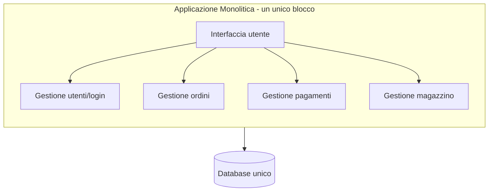
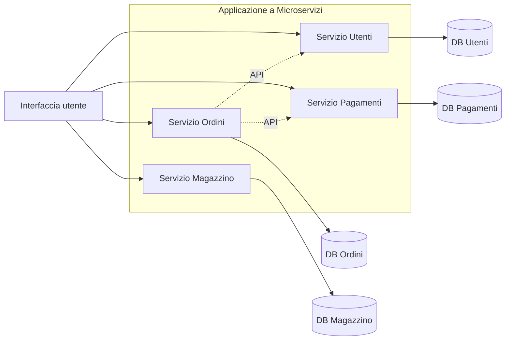
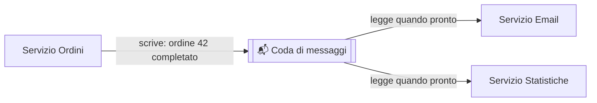
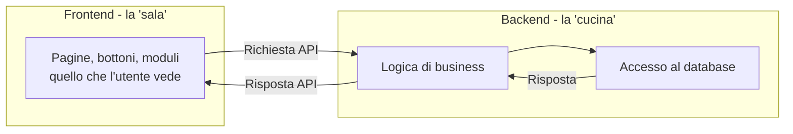
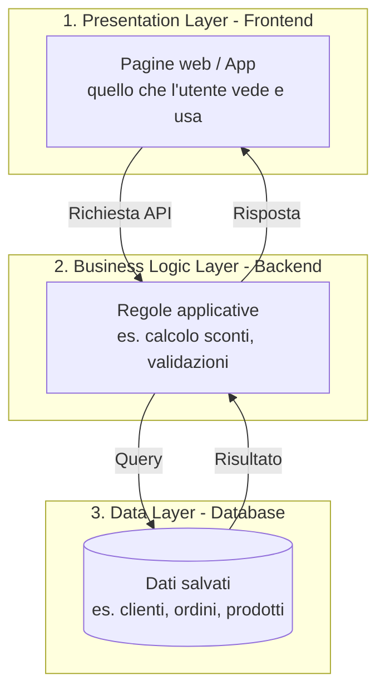

# 12. Architetture software

Nella sezione 2 (Fondamenti di informatica) hai già incontrato i mattoncini
di base: API, REST, database, container. In questa sezione facciamo un passo
in più: vediamo come questi mattoncini vengono **combinati insieme** per
costruire il software di cui il tuo team si occupa.

Non ti serve saper progettare un'architettura software — è il lavoro degli
sviluppatori e degli architetti. Ti serve invece **capire a grandi linee come
è "fatto" il software**, per poter:

- capire perché certe attività richiedono più tempo di altre ("aggiungere
  questa funzionalità è complicato perché tocca tre servizi diversi");
- dialogare con il team usando le parole giuste ("frontend", "backend",
  "microservizio", "database");
- capire meglio certe scelte tecniche quando vengono discusse in retrospettiva
  o in fase di stima.

## 🎯 Obiettivi della sezione

Al termine di questa sezione saprai:

- distinguere un'architettura monolitica da un'architettura a microservizi,
  e spiegarne pro e contro;
- capire la differenza tra frontend e backend;
- capire cos'è il modello client-server e l'architettura a 3 livelli;
- avere un'idea di base di come comunicano i vari "pezzi" di un software
  (API/REST e code di messaggi);
- sapere cos'è il "serverless" e quando viene usato.

---

## 12.1 Cos'è un'architettura software

Quando si costruisce una casa, prima di posare un mattone si disegna una
**pianta**: dove va la cucina, dove il bagno, come sono collegate le stanze,
dove passano i tubi dell'acqua e i cavi elettrici. Quella pianta è
l'"architettura" della casa: definisce come sono organizzati e collegati i
suoi pezzi.

L'**architettura software** è la stessa cosa applicata a un programma: è il
modo in cui le sue diverse parti (chi mostra le pagine, chi elabora i dati,
chi li salva) sono organizzate e come comunicano tra loro.

Come per una casa, non esiste un'unica pianta giusta per tutti i casi: una
villetta e un grattacielo hanno esigenze diverse e richiedono progetti
diversi. Lo stesso vale per il software: la scelta dell'architettura dipende
dalle dimensioni del progetto, dal numero di utenti, dal team disponibile e
da quanto velocemente deve poter crescere.

---

## 12.2 Architettura Monolitica

Un'architettura **monolitica** (dal greco "un unico blocco di pietra") è
quella in cui **tutto il software è scritto e distribuito come un unico
blocco unito**: la parte che gestisce gli utenti, quella che gestisce gli
ordini, quella che gestisce i pagamenti, quella che parla con il database...
tutto vive nello stesso progetto, viene compilato insieme e viene eseguito
come un unico programma.

### Analogia: il grande magazzino unico

Pensa a un **grande magazzino** che vende di tutto sotto lo stesso tetto:
abbigliamento, elettronica, alimentari, arredamento. C'è un'unica cassa
centrale, un unico sistema di gestione del magazzino, un'unica squadra di
addetti che, in teoria, potrebbe occuparsi di qualsiasi reparto. È comodo da
costruire all'inizio (un solo edificio, una sola gestione), ma se un giorno
vuoi ampliare solo il reparto elettronica, devi comunque intervenire
sull'intero edificio, e se va in tilt il sistema di cassa centrale, si ferma
la vendita in **tutti** i reparti contemporaneamente.

### Pro del monolite

- **Semplice da avviare**: all'inizio di un progetto, con un team piccolo, è
  molto più rapido costruire e mandare in produzione un blocco unico.
- **Meno complessità operativa**: un solo "pacchetto" da distribuire, un solo
  ambiente da monitorare, meno pezzi che possono comunicare male tra loro.
- **Più facile da testare end-to-end**, perché tutto il flusso vive nello
  stesso posto.

### Contro del monolite

- **Difficile da scalare in modo selettivo**: se solo una parte del software
  è sotto carico (es. tanti utenti che fanno ricerche), non puoi "potenziare"
  solo quella parte: devi duplicare l'intero blocco, anche le parti che non ne
  hanno bisogno.
- **Un problema in una parte può bloccare tutto**: un bug o un
  sovraccarico in un singolo componente rischia di far cadere l'intera
  applicazione, non solo quella funzionalità.
- **Rilasci più lenti e rischiosi al crescere delle dimensioni**: con tanti
  sviluppatori che lavorano sullo stesso blocco di codice, ogni rilascio
  richiede di testare e distribuire **tutto** insieme, anche se hai
  modificato solo un piccolo pezzo.
- **Difficile far crescere tanti team in parallelo** senza che si "pestino i
  piedi" a vicenda sullo stesso codice.

---

## 12.3 Architettura a Microservizi

Un'architettura a **microservizi** divide il software in tanti **piccoli
servizi indipendenti**, ciascuno responsabile di **una sola area** (es. "il
servizio che gestisce gli utenti", "il servizio che gestisce i pagamenti",
"il servizio che gestisce il magazzino"). Ogni servizio ha il suo codice, a
volte il suo database, e viene distribuito e aggiornato **separatamente**
dagli altri. I servizi comunicano tra loro tramite API (esattamente quelle
che hai visto nella sezione 2) o tramite code di messaggi (le vediamo a
breve).

### Analogia: tanti piccoli negozi specializzati

Rispetto al grande magazzino unico, immagina ora una **via dello shopping**
con tanti piccoli negozi specializzati: la libreria, il negozio di
elettronica, il fruttivendolo. Ogni negozio ha la sua cassa, il suo
personale, i suoi orari, la sua gestione del magazzino, ed è **indipendente**
dagli altri: se il fruttivendolo chiude per ferie, la libreria continua a
vendere libri senza problemi. Se un giorno la libreria diventa
particolarmente famosa e affollata, il proprietario può assumere più
commessi solo lì, senza dover potenziare anche gli altri negozi. In
compenso, se un cliente vuole comprare un libro E della frutta, deve andare
in due negozi diversi (cioè: serve più "coordinamento" tra i pezzi).

### Pro dei microservizi

- **Scalabilità selettiva**: puoi potenziare solo il servizio sotto carico
  (es. più istanze del servizio Ordini durante il Black Friday), senza
  toccare gli altri.
- **Rilasci indipendenti**: puoi aggiornare il servizio Pagamenti senza
  dover rilasciare (e rischiare di rompere) il servizio Magazzino.
- **Team più autonomi**: team diversi possono lavorare su servizi diversi in
  parallelo, con meno conflitti e meno dipendenze reciproche.
- **Guasto isolato**: se un servizio ha un problema, in teoria gli altri
  possono continuare a funzionare (non sempre in pratica, ma è l'obiettivo).
- **Libertà tecnologica**: ogni servizio può, in teoria, usare il linguaggio
  o il database più adatto al suo compito specifico.

### Contro dei microservizi

- **Complessità operativa molto più alta**: ora ci sono tanti "pezzi" da
  distribuire, monitorare, far comunicare correttamente tra loro. Serve
  un'infrastruttura DevOps solida (vedi sezione 9) per gestirla bene.
- **Comunicazione tra servizi da progettare con cura**: se il servizio A
  chiama il servizio B che chiama il servizio C, e uno di questi è lento o
  irraggiungibile, il problema si propaga.
- **Più difficile da debuggare**: un errore può nascere dall'interazione tra
  più servizi, e "seguire il filo" del problema è più complesso che in un
  monolite.
- **Richiede un team più maturo** su temi come CI/CD, containerizzazione e
  monitoraggio, perché la complessità operativa cresce parecchio.

### Quando ha senso passare da monolite a microservizi

Non è vero che i microservizi sono "sempre meglio". Anzi: molti progetti,
soprattutto agli inizi, **partono volutamente come monolite**, perché è più
rapido e il team è piccolo. Il passaggio a microservizi ha senso quando
succede una o più di queste cose:

- il team è cresciuto molto e più squadre lavorano sullo stesso codice,
  intralciandosi a vicenda;
- alcune parti del sistema hanno bisogno di scalare molto più di altre (es.
  il motore di ricerca prodotti riceve 100 volte più traffico della gestione
  fatture);
- i rilasci del monolite sono diventati lenti, rischiosi e "tutto o nulla";
- il codice è diventato talmente grande e intrecciato che anche piccole
  modifiche richiedono di toccare (e ritestare) mezza applicazione.

Una buona regola pratica che sentirai spesso: **"non iniziare con i
microservizi"**. Molte aziende, incluse alcune molto famose nel settore
tech, sono partite da un monolite e sono passate ai microservizi solo quando
la crescita lo ha reso necessario — non il contrario.

### Monolite vs Microservizi: la tabella di confronto

| Aspetto | Monolite | Microservizi |
|---|---|---|
| Velocità di partenza di un progetto | Alta: si parte rapidamente | Più bassa: serve progettare i confini tra servizi e l'infrastruttura |
| Scalabilità | Si scala tutto insieme, anche le parti che non servono | Si scala solo il servizio che ne ha bisogno |
| Complessità operativa (deploy, monitoraggio) | Bassa: un solo blocco da gestire | Alta: tanti servizi da distribuire, far comunicare, monitorare |
| Rilasci | Un rilascio unico, tocca tutto il sistema | Rilasci indipendenti per singolo servizio |
| Isolamento dei guasti | Basso: un problema può bloccare tutto | Più alto: un servizio può fallire senza fermare tutti gli altri |
| Autonomia dei team | Bassa: più team sullo stesso codice si intralciano | Alta: ogni team può gestire i propri servizi |
| Adatto a | Progetti piccoli/medi, team piccoli, fasi iniziali (MVP) | Progetti grandi, molti team, esigenze di scalabilità differenziate |

---

## 12.4 Come comunicano i componenti

Sia nel monolite (tra i suoi moduli interni) che, soprattutto, nei
microservizi (tra servizi separati), i vari "pezzi" del software devono
scambiarsi informazioni. Ci sono principalmente due modalità.

### Comunicazione sincrona: API e REST

Il modo più comune è quello che hai già visto nella sezione 2: un componente
fa una **richiesta** a un altro tramite un'**API**, tipicamente in stile
**REST**, e resta in attesa della **risposta** prima di andare avanti — un
po' come una telefonata: fai la domanda e resti in linea aspettando la
risposta, prima di riprendere quello che stavi facendo.

Questo funziona benissimo per molti casi ("dammi i dati di questo cliente",
"verifica se questo pagamento è andato a buon fine"), ma ha un limite: se il
servizio che deve rispondere è lento o irraggiungibile, chi ha fatto la
richiesta resta bloccato ad aspettare.

### Comunicazione asincrona: le code di messaggi

Per certi casi è più comodo **non restare in attesa** di una risposta
immediata, ma semplicemente "lasciare un messaggio" che qualcun altro
leggerà quando potrà. È qui che entrano in gioco le **code di messaggi**
(*message queue*), uno strumento tipico della comunicazione **asincrona**.

#### Analogia: la cassetta della posta

Pensa alla differenza tra una telefonata e una **cassetta della posta**:

- con la telefonata (comunicazione sincrona/API) chiami qualcuno e resti in
  attesa che risponda subito, in tempo reale;
- con una lettera lasciata nella cassetta della posta (comunicazione
  asincrona/coda di messaggi) **scrivi il messaggio e vai avanti con le tue
  cose**: non resti lì ad aspettare. Il destinatario, quando ha tempo, apre
  la cassetta, legge il messaggio e agisce di conseguenza. Se il destinatario
  in questo momento non è in casa, il messaggio resta comunque nella
  cassetta ad aspettarlo, senza perdersi.

Esempio pratico: quando un cliente completa un ordine su un e-commerce, il
servizio Ordini potrebbe non chiamare direttamente e "in diretta" il servizio
Email per inviare la conferma. Invece, scrive un messaggio del tipo "ordine
42 completato" in una coda; il servizio Email (quando è pronto, magari
qualche secondo dopo) legge quel messaggio dalla coda e invia l'email. Se il
servizio Email in quel momento è sovraccarico o temporaneamente fermo, il
messaggio resta comunque in coda, e verrà elaborato appena il servizio torna
disponibile — non si perde nulla.

Questo approccio è molto usato quando un evento (es. "ordine completato")
deve essere notificato a **più** servizi interessati, senza che il servizio
che genera l'evento debba conoscerli tutti o aspettare che rispondano tutti.
Esempi di strumenti che sentirai citare per questo scopo: **RabbitMQ**,
**Azure Service Bus**, **Kafka**.

| | Comunicazione sincrona (API/REST) | Comunicazione asincrona (coda di messaggi) |
|---|---|---|
| Analogia | Telefonata | Cassetta della posta |
| Chi chiama resta in attesa? | Sì, della risposta | No, va avanti |
| Adatta a | Richieste che servono "subito" (es. leggere dati) | Notifiche/eventi che possono essere elaborati "quando capita" |
| Rischio se il destinatario è lento/offline | Chi chiama resta bloccato o riceve un errore | Il messaggio resta in coda, nessuna perdita |

---

## 12.5 Frontend vs Backend

Ogni applicazione web o mobile che usi (un sito di e-commerce, un'app
bancaria, un gestionale aziendale) è divisa, concettualmente, in due grandi
parti: **frontend** e **backend**.

- il **frontend** è tutto ciò che l'utente vede e con cui interagisce
  direttamente: pagine, bottoni, moduli da compilare, grafici. È la parte
  che "gira" nel browser o nell'app sul telefono dell'utente;
- il **backend** è la parte che l'utente non vede: elabora la logica di
  business ("questo sconto si applica solo se il carrello supera 50€"),
  gestisce l'accesso al database, si occupa della sicurezza, e risponde alle
  richieste che arrivano dal frontend.

### Analogia: il ristorante, sala vs cucina

Pensa a un ristorante:

- la **sala** (i tavoli, i camerieri, il menù che vedi) è il **frontend**:
  è quello che tu, cliente, vedi e con cui interagisci direttamente. Ordini
  un piatto guardando il menù, il cameriere prende nota;
- la **cucina** è il **backend**: è dove avviene il vero lavoro (cucinare il
  piatto, gestire le scorte, applicare la ricetta), ma tu, seduto al tavolo,
  non la vedi. Interagisci con essa solo indirettamente, tramite il
  cameriere (che, come abbiamo visto nella sezione 2, è un po' come l'API).

Un frontend curato ma con un backend debole è come un ristorante con una
sala elegantissima ma una cucina che sbaglia sempre gli ordini: l'esperienza
finale ne risente comunque. Vale anche il contrario: un backend eccellente
con un frontend confuso farà comunque fatica a piacere ai clienti.

Nel team sentirai spesso parlare di "sviluppatori frontend" e "sviluppatori
backend" (o "full-stack", chi lavora su entrambi): sono specializzazioni
diverse, con linguaggi e strumenti spesso diversi, anche se lavorano sullo
stesso prodotto finale.

---

## 12.6 Client-Server: il concetto base

Hai già incontrato questo concetto nella sezione 2 parlando di HTTP: il
modello **client-server** è l'idea di base secondo cui esiste un **client**
(chi fa richieste, es. il tuo browser) e un **server** (chi riceve la
richiesta, la elabora e risponde, es. il computer che ospita l'applicazione).

È utile ricordarlo qui perché frontend e backend, di fatto, **spesso
corrispondono** a client e server: il frontend che gira nel tuo browser è il
client, il backend che gira su un server (fisico, virtuale, o un container
in cloud) è il server. Non è una regola matematica assoluta — esistono
architetture più sofisticate — ma per il 90% dei casi che incontrerai
questa corrispondenza è un buon punto di partenza mentale.

---

## 12.7 Architettura a 3 livelli

Un modo molto comune, semplice e diffuso di organizzare un'applicazione,
soprattutto nei sistemi gestionali "classici", è l'**architettura a 3
livelli** (in inglese *3-tier architecture*). Divide il software in tre
strati, ciascuno con una responsabilità precisa:

1. **Presentation layer** (livello di presentazione): è il frontend, quello
   che l'utente vede e usa;
2. **Business logic layer** (livello di logica di business): è il backend,
   dove vengono applicate le regole ("uno sconto si applica solo se...",
   "un ordine non può essere spedito se non è stato pagato...");
3. **Data layer** (livello dei dati): è il database, dove i dati vengono
   effettivamente salvati e recuperati.

L'idea chiave è che **ogni livello parla solo con quello adiacente**: il
livello di presentazione non accede mai direttamente al database, ma passa
sempre dal livello di logica di business, che fa da "filtro" e applica le
regole necessarie prima di leggere o scrivere i dati.

### Analogia

Pensa di nuovo al ristorante, ma con un passaggio in più: tu (client) parli
solo con il cameriere (presentation layer), il cameriere porta l'ordine allo
chef (business logic layer), che decide come preparare il piatto secondo la
ricetta e le regole della cucina, e solo lo chef accede alla **dispensa**
(data layer) per prendere gli ingredienti. Tu non entri mai direttamente
nella dispensa: passi sempre dallo chef, che sa quali regole rispettare
(es. "questo piatto non si può preparare se manca un ingrediente
fondamentale").

Questo schema a 3 livelli è alla base di moltissime applicazioni aziendali
"tradizionali" (gestionali, portali interni, applicazioni web classiche), e
puoi ritrovarlo sia dentro un monolite (i tre livelli vivono nello stesso
blocco di codice) sia distribuito su più microservizi (ogni servizio ha
comunque, internamente, una sua piccola struttura a livelli).

---

## 12.8 Un accenno al Serverless

Finora abbiamo parlato di software che gira su server (fisici, virtuali, o
container) che devono restare **sempre attivi**, pronti a rispondere in
qualsiasi momento. Il modello **serverless** ("senza server", anche se in
realtà un server c'è sempre, solo che non te ne devi occupare tu) propone
un'idea diversa: scrivi piccole **funzioni** che vengono eseguite dal
fornitore cloud **solo quando servono**, e vengono "spente" subito dopo.

### Analogia: il taxi vs l'auto di proprietà

Gestire un server tradizionale è un po' come avere un'**auto di proprietà**:
la paghi (e la mantieni) sempre, anche quando è parcheggiata e non la usi. Il
serverless è più come prendere un **taxi**: lo chiami solo quando ti serve
uno spostamento, paghi solo per quella corsa, e non devi preoccuparti di
manutenzione, parcheggio o assicurazione quando non lo stai usando.

Esempio pratico: una funzione serverless che si attiva solo quando un utente
carica una foto sul sito, per ridimensionarla automaticamente in diverse
dimensioni, e poi si "spegne" fino alla prossima foto caricata. Non serve
tenere un server acceso 24 ore su 24 in attesa che qualcuno carichi una
foto.

Vantaggi principali: si paga solo per l'uso effettivo (nessun costo per il
tempo "di inattività"), e non serve gestire manualmente l'infrastruttura
sottostante (il fornitore cloud se ne occupa). Lo svantaggio principale è che
non è adatto a tutti i casi: per applicazioni che devono rispondere
istantaneamente e in modo continuo, o che richiedono elaborazioni molto
lunghe, il modello serverless può introdurre piccoli ritardi ("tempo di
avvio a freddo") o limiti di durata.

Esempi di servizi serverless che sentirai citare: **Azure Functions**, **AWS
Lambda**. Ne riparleremo con più dettaglio nella sezione 13 (Cloud).

---

## 12.9 Riepilogo: cosa ti serve ricordare

Non devi memorizzare ogni dettaglio di questa sezione. Ti basta portarti via
questi concetti chiave, che ti aiuteranno a capire meglio le conversazioni
tecniche del team:

- **Monolite**: un unico blocco di codice. Semplice all'inizio, difficile da
  scalare selettivamente e da far crescere con tanti team.
- **Microservizi**: tanti servizi piccoli e indipendenti. Più scalabili e
  flessibili, ma più complessi da gestire operativamente.
- **API/REST** (comunicazione sincrona, "telefonata") e **code di messaggi**
  (comunicazione asincrona, "cassetta della posta") sono i due modi
  principali con cui i componenti di un software comunicano tra loro.
- **Frontend** (sala) e **Backend** (cucina): la parte visibile all'utente e
  quella che elabora la logica e i dati.
- **Client-Server**: chi fa la richiesta (client) e chi la elabora (server).
- **Architettura a 3 livelli**: Presentazione → Logica di business → Dati,
  ognuno responsabile del proprio compito.
- **Serverless**: funzioni eseguite solo quando servono, senza gestire un
  server sempre attivo — come un taxi rispetto a un'auto di proprietà.

Quando il team discute di "spacchettare il monolite", "aggiungere un
servizio", "usare una coda per questo evento" o "spostare questa funzione su
serverless", ora avrai gli strumenti concettuali per seguire la
conversazione e fare le domande giuste.

---

## ✅ Checklist di autoverifica

- Sapresti spiegare la differenza tra monolite e microservizi con
  un'analogia tua?
- Sai indicare almeno due vantaggi e due svantaggi dei microservizi?
- Sapresti spiegare quando ha senso passare da monolite a microservizi?
- Sai spiegare la differenza tra comunicazione sincrona e asincrona, con
  l'analogia della telefonata e della cassetta della posta?
- Sai spiegare la differenza tra frontend e backend con l'analogia del
  ristorante?
- Sai descrivere i tre livelli dell'architettura a 3 livelli?
- Sai spiegare, a grandi linee, cos'è il serverless e quando può essere
  utile?

---

## 🔗 Collegamenti

- [13. Cloud](../13-cloud/README.md) — dove vedremo come queste architetture vengono effettivamente eseguite su infrastrutture cloud come Azure o AWS
- [14. Sicurezza](../14-sicurezza/README.md) — dove vedremo come proteggere questi componenti e le comunicazioni tra di essi

## 📚 Risorse

- [Microsoft Learn – Architetture dei microservizi](https://learn.microsoft.com/it-it/dotnet/architecture/microservices/) — guida approfondita (in italiano) su monolite vs microservizi
- [Martin Fowler – Microservices](https://martinfowler.com/articles/microservices.html) — l'articolo di riferimento sul tema, uno dei più citati nel settore
- [Martin Fowler – MonolithFirst](https://martinfowler.com/bliki/MonolithFirst.html) — perché spesso ha senso partire da un monolite prima di passare ai microservizi
- [Microsoft Learn – Cos'è il serverless computing](https://azure.microsoft.com/it-it/resources/cloud-computing-dictionary/what-is-serverless-computing) — introduzione al modello serverless
- [Microsoft Learn – Message queue e comunicazione asincrona](https://learn.microsoft.com/en-us/azure/architecture/patterns/async-request-reply) — approfondimento sui pattern di comunicazione asincrona
- [Documentazione ufficiale RabbitMQ – Concetti base](https://www.rabbitmq.com/tutorials) — introduzione pratica alle code di messaggi
