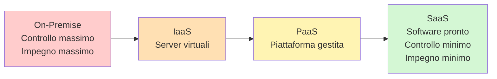
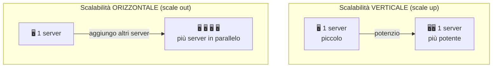

# 12. Cloud

> 📄 **[Scarica questa sezione in PDF](https://darioschioppi.github.io/corso-onboarding-devops/pdf/12-cloud.pdf)** — utile per la stampa o la lettura offline.

Nella sezione precedente hai visto come è "fatto" un software: monolite o
microservizi, frontend e backend, database, code di messaggi. Ora facciamo un
passo ulteriore e ci chiediamo: **dove vive fisicamente tutto questo?** Su
quali macchine viene eseguito il codice? Dove sono salvati i dati?

La risposta, oggi, nella grande maggioranza dei casi è: **nel cloud**. In
questa sezione capirai cosa significa davvero questa parola (che spesso viene
usata in modo vago, quasi magico), quali sono i principali modelli con cui si
"affitta" il cloud, e come si chiamano i pezzi principali di Azure e AWS, i
due grandi fornitori che incontrerai più spesso lavorando in ambito DevOps.

## 🎯 Obiettivi della sezione

Al termine di questa sezione saprai:

- spiegare cos'è il cloud computing con parole tue, senza tecnicismi;
- distinguere IaaS, PaaS e SaaS e sapere chi gestisce cosa in ciascun modello;
- riconoscere i nomi dei principali servizi Azure e i loro equivalenti AWS;
- capire cosa significano scalabilità verticale/orizzontale, pay-as-you-go,
  regioni e alta disponibilità.

---

## 12.1 Cos'è il cloud computing

Immagina di dover organizzare una cena per 50 persone. Hai due opzioni:

1. Comprare pentole, forni, piatti, tavoli e sedie per 50 persone, tenerli in
   un magazzino tutto l'anno e usarli una volta ogni tanto.
2. Affittare una sala da un catering: paghi solo per l'evento, usi le loro
   attrezzature, e quando hai finito non devi più pensarci.

Per decenni, le aziende che avevano bisogno di far girare un software hanno
fatto la scelta (1) — ed è esattamente quello che ha fatto per anni
**ShopFacile**, la piattaforma di e-commerce (catalogo prodotti, carrello,
ordini, pagamenti) che useremo come filo conduttore di questa sezione:
compravano server fisici, li installavano in una stanza climatizzata (la
"sala server"), pagavano tecnici per manutenerli, e se il software cresceva
dovevano comprare altri server. Se il software calava di utilizzo, quei
server restavano lì, comprati e pagati, a fare poco.

Il momento in cui questo problema si è sentito davvero, in ShopFacile, è
stato un dicembre di qualche anno fa. Le vendite di Natale erano già partite,
il traffico sul sito cresceva di giorno in giorno, e il server esistente
faticava a starci dietro: le pagine si caricavano lente, il checkout a
volte si bloccava per qualche secondo nei momenti di punta. Il team ha
ordinato subito un server aggiuntivo — ma il fornitore ha risposto che
sarebbe arrivato **tra sei settimane**. Sei settimane dopo, i saldi di
Natale erano finiti da un pezzo: il nuovo server sarebbe arrivato giusto in
tempo per l'unico periodo dell'anno in cui il traffico, e quindi la
capacità di calcolo in più, valeva davvero qualcosa. È esattamente il
problema che la scelta (2) — pagare solo per quello che serve, quando
serve — avrebbe potuto evitare.

Il **cloud computing** è la scelta (2) applicata all'informatica: invece di
possedere e gestire tu i server fisici, **usi via internet i server e le
risorse informatiche di qualcun altro** (un "provider cloud" come Microsoft,
Amazon o Google), pagando solo per quello che usi e quando lo usi.

> **Analogia**: possedere un data center è come costruirsi una casa da zero —
> devi comprare il terreno, costruire le fondamenta, tirare su i muri,
> allacciare le utenze. Usare il cloud è come **affittare un appartamento già
> arredato**: entri, usi quello che c'è, e quando ti serve una stanza in più
> la aggiungi (o la togli) senza dover ristrutturare un edificio.

In pratica, quando ShopFacile "mette il software sul cloud" significa che il
codice, il database degli ordini e i file (immagini dei prodotti, fatture)
non girano più su un server fisico di proprietà dell'azienda dentro il suo
ufficio, ma su server che appartengono a un provider cloud, distribuiti in
enormi data center in giro per il mondo, ai quali si accede via internet.

Questo cambia radicalmente il modo di lavorare:

- non serve comprare hardware in anticipo "per sicurezza": si aggiungono
  risorse quando servono, in pochi minuti;
- non serve occuparsi di manutenzione fisica (cambiare un disco rotto,
  sostituire un alimentatore): è il provider che ci pensa;
- si paga in base al consumo, non un costo fisso indipendentemente dall'uso.

> **Esempio pratico**: Marco, che in ShopFacile si occupa spesso di
> infrastruttura, guida la migrazione: il vecchio server fisico che ospitava
> il catalogo prodotti e il database degli ordini viene spento, e lo stesso
> software torna a girare — senza essere riscritto — su risorse affittate da
> un provider cloud. Il giorno dei saldi, quando il traffico su ShopFacile
> quadruplica, il team non deve più sperare che il server fisico regga:
> basta aggiungere risorse a richiesta e poi rilasciarle.

---

## 12.2 I tre modelli principali: IaaS, PaaS, SaaS

Migrare ShopFacile sul cloud non è stata una scelta "tutto o niente": Marco
ha dovuto decidere, pezzo per pezzo dell'infrastruttura, **quanta
responsabilità di gestione lasciare al provider e quanta tenersi**. Non
tutto il cloud è uguale: quando "affitti" qualcosa dal cloud, puoi
affittare **più o meno responsabilità**. Il modo più semplice per capirlo è
pensare a come si può abitare in un posto: puoi comprare un terreno e
costruire tu la casa, puoi affittare un appartamento arredato, oppure puoi
prenotare una stanza d'hotel con servizio completo.

Nel mondo cloud questi tre livelli si chiamano **IaaS**, **PaaS** e **SaaS**.

### 12.2.1 IaaS — Infrastructure as Service

**IaaS** significa "infrastruttura come servizio". Il provider ti affitta
l'**infrastruttura grezza**: server virtuali, spazio di archiviazione (dischi
virtuali) e rete. Tutto il resto — sistema operativo, aggiornamenti,
programmi installati, sicurezza a livello di software — è **compito tuo**.

> **Analogia**: è come affittare un **terreno con già lo scheletro di un
> edificio** (fondamenta, struttura portante, allacci alla rete elettrica e
> idrica). Il proprietario ti garantisce che lo scheletro sta in piedi e che
> l'elettricità arriva. Ma le pareti interne, gli impianti, l'arredamento e
> le tinteggiature te li fai tu.

Esempio concreto: una **macchina virtuale** su Azure o AWS. Il provider ti dà
un computer virtuale con una certa potenza di calcolo, ma sei tu a installare
il sistema operativo, gli aggiornamenti di sicurezza, il software applicativo
e a occuparti della configurazione.

Chi usa IaaS: chi ha bisogno di massimo controllo e flessibilità, o deve
migrare software esistente pensato per girare su server "tradizionali" senza
riscriverlo.

> **Esempio pratico**: Marco deve spostare sul cloud il vecchio motore di
> generazione delle fatture di ShopFacile, pensato per girare su un server
> Windows in ufficio, senza riscriverlo. La soluzione è creare una macchina
> virtuale IaaS: si installa lo stesso sistema operativo, si copiano gli
> stessi file, si configurano le stesse porte di rete. Non cambia una riga
> di codice. Il vantaggio non è "meno lavoro da fare" ma "niente hardware da
> comprare e mantenere": se la macchina virtuale si rivela sottodimensionata
> durante un picco di ordini, in pochi minuti Marco ne aumenta la potenza
> (CPU, RAM) dal pannello di controllo del provider, invece di aspettare
> settimane per un nuovo server fisico.

### 12.2.2 PaaS — Platform as Service

Se con la fattura Marco ha scelto di portarsi dietro anche il sistema
operativo da gestire, per il catalogo prodotti di ShopFacile — la parte
dell'applicazione che cambia più spesso — il team preferisce liberarsi
anche di quel livello: entra in scena il PaaS.

**PaaS** significa "piattaforma come servizio". Il provider ti affitta anche
**la piattaforma** su cui far girare il software: sistema operativo,
ambiente di esecuzione (runtime), database già pronti e gestiti. Tu ti devi
occupare solo di scrivere e distribuire il tuo codice.

> **Analogia**: è l'**appartamento già arredato**. Non devi costruire i muri
> né comprare i mobili: trovi tutto pronto, incluse le utenze allacciate. Ti
> devi solo preoccupare di viverci, cioè — nel caso del software — di
> scrivere e pubblicare il codice della tua applicazione.

Esempio concreto: **Azure App Service**, dove carichi il codice della tua
applicazione web e il provider si occupa di far girare il sistema operativo,
il runtime (per esempio .NET o Node.js), gli aggiornamenti di sicurezza e la
scalabilità di base. Oppure un database gestito come **Azure SQL Database**,
dove non devi installare né amministrare tu il motore del database: esiste
già, pronto all'uso, e il provider si occupa di backup, patch e affidabilità.

Chi usa PaaS: la maggior parte dei team che sviluppano applicazioni moderne,
perché permette di concentrarsi sul codice senza perdere tempo a gestire
server e sistemi operativi.

> **Esempio pratico**: Ahmed finisce di scrivere una nuova funzionalità per
> il catalogo prodotti di ShopFacile (i filtri di ricerca per categoria). Con
> un servizio PaaS, pubblica il codice (spesso con un comando o con la
> pipeline vista nella sezione 10) e in pochi minuti la nuova versione è
> online, raggiungibile via browser, senza che nessuno debba configurare un
> sistema operativo, aprire porte di rete o installare un runtime a mano. In
> parallelo, i dati del catalogo vivono in un database gestito: nessuno del
> team deve occuparsi di installare il motore del database, programmare i
> backup notturni o applicare le patch di sicurezza — il provider lo fa in
> automatico, e se qualcosa va storto è possibile ripristinare un backup
> recente con pochi clic.

### 12.2.3 SaaS — Software as Service

Con IaaS e PaaS, il team di ShopFacile ha comunque scritto e distribuito
codice proprio. C'è però un terzo livello, ancora più delegato, che il team
usa ogni giorno senza nemmeno pensarci: quello del software già pronto.

**SaaS** significa "software come servizio". Qui non affitti infrastruttura
né piattaforma: **usi direttamente un software già finito**, di solito via
browser, senza installare nulla e senza sapere (né doverti preoccupare di)
dove e come girano i server dietro.

> **Analogia**: è l'**hotel a servizio completo**. Non ti preoccupi di
> struttura, arredamento, pulizie o lenzuola: prenoti la stanza, entri, e
> tutto è già pronto per essere usato. Il tuo unico compito è vivere la tua
> vacanza (cioè usare il software per il tuo lavoro).

Esempi concreti che usi già ogni giorno: **Gmail** o **Outlook** (posta
elettronica), **Office 365** o **Google Workspace** (documenti e foglio di
calcolo), **Salesforce** (gestione clienti), lo stesso **GitHub** che usi
per il codice e le pipeline del progetto, o **Slack**/**Teams** per la
comunicazione. In tutti questi casi apri un browser, accedi con le tue
credenziali, e il software è già lì, funzionante, aggiornato, senza che tu
debba installare o gestire nulla.

Chi usa SaaS: chiunque abbia bisogno di una funzionalità (email, CRM,
gestione progetti) senza voler sviluppare o mantenere il software che la
fornisce.

> **Esempio pratico**: il team di ShopFacile ha bisogno di gestire il
> backlog, le pipeline e i repository del progetto. Nessuno "installa"
> GitHub su un server: Sara e Luca si registrano, aprono il browser,
> accedono con le proprie credenziali e il servizio è già lì, pronto all'uso
> e aggiornato dal provider senza che il team debba fare nulla. Lo stesso
> vale per la posta elettronica aziendale o per lo strumento di
> videochiamata usato nei daily: sono tutti software "già finiti", usati
> così come sono, senza che qualcuno in ShopFacile ne debba gestire
> l'infrastruttura sottostante.

---

## 12.3 Confronto: chi gestisce cosa

Ora che Marco ha usato tutti e tre i livelli su pezzi diversi
dell'infrastruttura di ShopFacile, conviene vedere in un colpo d'occhio come
si posizionano l'uno rispetto all'altro. La differenza chiave tra IaaS, PaaS
e SaaS è **quanta responsabilità di
gestione resta al cliente e quanta passa al provider cloud**. Più si sale da
IaaS verso SaaS, meno cose deve gestire il cliente (ma meno controllo ha).

La tabella seguente è il modo più chiaro per vedere la "torta delle
responsabilità": ogni riga è uno strato tecnico, e la cella indica **chi**
se ne occupa.

| Livello / Strato          | On-Premise (server proprio) | IaaS | PaaS | SaaS |
|----------------------------|:---:|:---:|:---:|:---:|
| Applicazioni               | 🧑 Cliente | 🧑 Cliente | 🧑 Cliente | ☁️ Provider |
| Dati                        | 🧑 Cliente | 🧑 Cliente | 🧑 Cliente | 🧑 Cliente* |
| Runtime (linguaggio, librerie) | 🧑 Cliente | 🧑 Cliente | ☁️ Provider | ☁️ Provider |
| Middleware                 | 🧑 Cliente | 🧑 Cliente | ☁️ Provider | ☁️ Provider |
| Sistema operativo           | 🧑 Cliente | 🧑 Cliente | ☁️ Provider | ☁️ Provider |
| Virtualizzazione            | 🧑 Cliente | ☁️ Provider | ☁️ Provider | ☁️ Provider |
| Server (hardware fisico)    | 🧑 Cliente | ☁️ Provider | ☁️ Provider | ☁️ Provider |
| Storage (fisico)            | 🧑 Cliente | ☁️ Provider | ☁️ Provider | ☁️ Provider |
| Rete (fisica)               | 🧑 Cliente | ☁️ Provider | ☁️ Provider | ☁️ Provider |

\* *anche in SaaS i dati che inserisci nel software (es. le tue email, i tuoi
documenti) restano "tuoi": il provider li custodisce e li protegge, ma il
contenuto è di tua responsabilità (es. non condividere per errore un file
sensibile).*

Questo "meno controllo diretto" ha un rovescio concreto. Se un servizio
PaaS o SaaS ha un malfunzionamento, o cambia comportamento con un
aggiornamento non richiesto, il team di ShopFacile **non può intervenire
direttamente**: può solo aprire una segnalazione al provider, aspettare che
risolva dal suo lato, e comunicare la situazione al cliente. È il prezzo di
non doversi occupare della gestione quotidiana.

In sintesi, salendo da IaaS a SaaS **deleghi progressivamente più lavoro
operativo al provider**, in cambio di **meno controllo diretto** su come le
cose sono configurate. Non esiste un livello "migliore" in assoluto: la
scelta dipende da quanto controllo serve rispetto a quanta comodità si vuole.

---

## 12.4 Azure: panoramica generale

Visti i tre modelli in astratto, è utile sapere anche su quale provider
concreto ShopFacile li ha effettivamente implementati. **Microsoft Azure** è
la piattaforma cloud di Microsoft, ed è quella che incontrerai più spesso in
questo corso e nel lavoro quotidiano, dato che il team vi ha migrato la
propria infrastruttura. Azure offre centinaia di servizi; qui vediamo solo
i concetti principali, giusto per riconoscerli quando li sentirai
nominare.

- **Macchine virtuali (Virtual Machines)** — il servizio IaaS di base: un
  server virtuale su cui installare qualsiasi sistema operativo e software,
  esattamente come faresti su un computer fisico.
- **Azure App Service** — il servizio PaaS per pubblicare applicazioni web e
  API senza gestire server o sistemi operativi: carichi il codice, Azure fa
  girare tutto il resto.
- **Database gestiti** (es. **Azure SQL Database**, **Cosmos DB**) — database
  pronti all'uso, con backup automatici, aggiornamenti e scalabilità gestiti
  dal provider: non devi installare né amministrare tu il motore del
  database.
- **Storage** (es. **Azure Blob Storage**) — spazio per salvare file, backup,
  immagini, documenti: una specie di "grande armadio" accessibile via
  internet, pensato per grandi quantità di dati.
- **Azure Kubernetes Service (AKS)** — servizio gestito per eseguire
  container orchestrati con Kubernetes (concetto già visto nella sezione 2),
  senza dover installare e configurare Kubernetes da zero.

Non serve memorizzare questi nomi: basta sapere che esistono e a cosa
servono a grandi linee, così quando il team dice "l'abbiamo messo su App
Service" o "i dati sono su Blob Storage" saprai di cosa si sta parlando.

---

## 12.5 AWS: la principale alternativa

ShopFacile ha scelto Azure, ma non è l'unico provider possibile: se un giorno
il progetto dovesse integrarsi con un partner che usa un altro fornitore, o
valutare un cambio, è utile riconoscere subito i nomi equivalenti. **Amazon
Web Services (AWS)** è il principale concorrente di Azure (ed è storicamente
il pioniere del cloud computing su larga scala). Alcuni progetti o clienti
usano AWS invece di (o insieme ad) Azure, quindi è utile riconoscere i nomi
equivalenti:

| Concetto                     | Azure               | AWS                  |
|-------------------------------|---------------------|----------------------|
| Macchine virtuali (IaaS)      | Virtual Machines    | EC2                  |
| Piattaforma per applicazioni web (PaaS) | App Service | Elastic Beanstalk    |
| Storage di file/oggetti       | Blob Storage        | S3                   |
| Database relazionale gestito  | Azure SQL Database  | RDS                  |
| Container orchestrati         | AKS                 | EKS                  |
| Funzioni serverless           | Azure Functions     | Lambda               |

Il concetto importante da portarti via non è il nome preciso di ogni
servizio, ma il fatto che **i grandi provider cloud offrono tutti gli stessi
tipi di servizio**, solo con nomi diversi. Una volta capito il concetto (es.
"storage per file"), riconoscere l'equivalente su un altro provider è
semplice.

C'è però un motivo per cui "cambiare provider" è più difficile di quanto
sembri: si chiama **lock-in**. Più un progetto usa servizi **specifici** di
un provider (non solo una macchina virtuale generica, ma funzionalità
disponibili solo su Azure), più costa — in tempo, denaro, rischio —
migrare altrove in futuro. Non è un divieto: è un costo da metter sul
tavolo consapevolmente prima di scegliere, non da scoprire dopo. Alcune
aziende usano **più provider contemporaneamente** (multi-cloud) per
ridurre questa dipendenza, ma il prezzo è una complessità operativa che si
moltiplica.

---

## 12.6 Scalabilità: verticale vs orizzontale

Che si scelga Azure o AWS, il motivo per cui Marco ha spinto per il cloud fin
dall'inizio ha un nome preciso: la scalabilità. Uno dei grandi vantaggi del
cloud è la **scalabilità**: la capacità di
adattare le risorse informatiche disponibili in base a quanto ne serve in un
dato momento, in modo rapido.

Esistono due modi per scalare:

- **Scalabilità verticale** ("scale up"): dare **più risorse alla stessa
  macchina** (più potenza di calcolo, più memoria). È come sostituire il
  motore di un'auto con uno più potente: la stessa auto va più veloce, ma
  c'è un limite a quanto puoi potenziarla.
- **Scalabilità orizzontale** ("scale out"): aggiungere **più macchine** che
  lavorano in parallelo, distribuendo il carico tra loro. È come aggiungere
  più corsie a un'autostrada: non rendi ogni auto più veloce, ma fai passare
  più traffico complessivamente.

Nel cloud, la scalabilità orizzontale è particolarmente potente perché si
possono aggiungere (o togliere) macchine in pochi minuti, spesso in modo
**automatico** in base al traffico reale — esattamente il caso di ShopFacile
durante i saldi, con più macchine durante il picco e meno durante la notte.
Questo sarebbe quasi impossibile con server fisici di proprietà, dove
comprare un nuovo server richiede settimane.

---

## 12.7 Pay-as-you-go: paghi solo quello che usi

Poter scalare su e giù in pochi minuti sarebbe un vantaggio a metà se si
continuasse comunque a pagare come prima, a prescindere dall'uso: il pezzo
che completa il quadro è il modo in cui il cloud fa pagare quelle risorse.
Il modello di pagamento tipico del cloud si chiama **pay-as-you-go** ("paga
in base a quanto usi"), ed è probabilmente il cambiamento più concreto
rispetto al vecchio modo di gestire l'infrastruttura.

> **Analogia**: è come la bolletta della luce o dell'acqua: non paghi una
> cifra fissa indipendentemente da quanto consumi, ma in base ai consumi
> effettivi (kWh usati, litri consumati). Se un mese consumi meno, paghi
> meno.

Nel cloud questo significa, per esempio, che se hai una macchina virtuale
attiva 3 ore al giorno, paghi solo per quelle 3 ore (e non per le 24). Se il
sito di ShopFacile ha un picco di traffico per una settimana di saldi e poi
torna normale, il team può scalare su e poi tornare giù, pagando solo per il
periodo di picco.

Questo modello è molto diverso dall'acquisto di un server fisico, dove il
costo è quasi tutto "anticipato" (compri il server, che poi resta tuo per
anni, usato o no).

> **Per confronto**: il pay-as-you-go non è automaticamente più economico —
> dipende da quanto il carico **varia**. Con un carico costante e
> prevedibile tutto l'anno, senza picchi, una macchina di proprietà usata
> al massimo può costare **meno**, nel tempo, di una macchina cloud sempre
> accesa e pagata a consumo. Il cloud conviene davvero quando il carico
> **varia** (scali su e giù pagando solo i picchi, come nei saldi di
> ShopFacile) o quando serve **partire subito** senza investimento
> iniziale. È per questo che molte aziende adottano una scelta **ibrida**:
> carichi stabili su infrastruttura propria, carichi variabili sul cloud.

### Il costo cloud come voce di budget da monitorare

Un costo che **varia** in base all'uso è più difficile da controllare di un
costo fisso. Con un budget di progetto "classico" (sezione 8) la cifra è
nota in anticipo; con il cloud, la fattura di un mese può crescere
silenziosamente — una macchina dimenticata accesa, un picco non previsto —
senza che nessuno se ne accorga finché non arriva il conto. Per questo un
team maturo imposta **allarmi di spesa** e **attribuisce i costi ai
progetti giusti**. La disciplina che si occupa di gestire e ottimizzare la
spesa cloud si chiama **FinOps** (Finance + Operations): non serve
diventarne esperti, ma sapere che esiste spiega perché il costo cloud
compare come voce di controllo ricorrente al pari degli altri indicatori.

---

## 12.8 Regioni, data center e alta disponibilità

Pagare solo per quello che si usa presuppone che ci sia sempre qualcosa da
usare: se ShopFacile fosse ospitata in un solo data center e quello avesse un
guasto, tutto il pay-as-you-go del mondo non servirebbe a nulla mentre il
sito è offline. È qui che entrano in gioco regioni e data center multipli.
I provider cloud non hanno un solo, enorme data center: ne hanno **decine**,
sparsi in tutto il mondo, organizzati in **regioni** (per esempio "Europa
occidentale", "Stati Uniti orientali", "Asia sud-orientale"). Ogni regione
contiene a sua volta più data center fisicamente separati.

Questo ha due vantaggi principali:

- **Vicinanza geografica**: puoi far girare il tuo software in una regione
  vicina ai tuoi utenti, così le pagine si caricano più velocemente (meno
  distanza = meno tempo di viaggio dei dati) — per questo ShopFacile, che
  vende soprattutto in Italia, gira su una regione Azure in Europa
  occidentale.
- **Alta disponibilità**: se un data center ha un problema (es. un guasto
  elettrico), il software può continuare a funzionare perché è distribuito
  su più data center o più regioni. È come avere due farmacie in città
  invece di una sola: se una chiude per un imprevisto, l'altra resta aperta
  e il servizio continua.

Non serve approfondire i dettagli tecnici dell'alta disponibilità in questa
fase: basta sapere che è uno dei motivi per cui le grandi aziende scelgono il
cloud invece di un singolo server fisico in un singolo posto — meno rischio
di interruzioni del servizio.

---

Con questo, il percorso di ShopFacile dal server in ufficio a un'infrastruttura
cloud distribuita su più data center è completo: riassumiamo i concetti
principali visti lungo la strada.

## 12.9 Riepilogo: cosa ti serve ricordare

- **Cloud computing**: usare risorse informatiche (server, storage, rete) di
  qualcun altro via internet, invece di possedere e gestire hardware
  proprio — come affittare un appartamento invece di costruirsi una casa.
- **IaaS**: affitti l'infrastruttura grezza (server virtuali, storage, rete);
  gestisci tu sistema operativo e software.
- **PaaS**: affitti anche la piattaforma (OS, runtime, database gestiti); ti
  concentri solo sul codice.
- **SaaS**: usi un software finito via browser (Gmail, Office 365,
  Salesforce); non gestisci nulla sotto.
- Più sali da IaaS a SaaS, meno responsabilità di gestione hai (e meno
  controllo).
- **Azure** (Microsoft) e **AWS** (Amazon) sono i due principali provider
  cloud: offrono gli stessi tipi di servizi con nomi diversi (es. Virtual
  Machines/EC2, App Service/Elastic Beanstalk, Blob Storage/S3).
- **Scalabilità verticale**: più risorse alla stessa macchina. **Scalabilità
  orizzontale**: più macchine in parallelo.
- **Pay-as-you-go**: paghi in base al consumo reale, come una bolletta.
- **Regioni e data center**: i provider distribuiscono le loro
  infrastrutture in tutto il mondo, garantendo vicinanza agli utenti e
  **alta disponibilità** (continuità del servizio anche in caso di guasti
  locali).

---

## ✅ Checklist di autoverifica

- Sapresti spiegare cos'è il cloud computing con un'analogia tua?
- Sai distinguere IaaS, PaaS e SaaS e dire, per ciascuno, cosa gestisce il
  cliente e cosa il provider?
- Sapresti nominare almeno due servizi Azure e i loro equivalenti AWS?
- Sai spiegare la differenza tra scalabilità verticale e orizzontale?
- Sai spiegare cosa significa "pay-as-you-go" con un esempio concreto?
- Sai spiegare perché avere più regioni/data center aiuta l'alta
  disponibilità?

---

## 📝 Esercizi pratici

1. **Mappa il progetto sul modello IaaS/PaaS/SaaS.** Chiedi a un collega
   developer o operations quali servizi cloud usa il progetto e prova a
   classificarli come IaaS, PaaS o SaaS (es. "usiamo una macchina virtuale
   per X" è IaaS, "il sito web gira su un servizio di hosting gestito" è
   PaaS). Scrivi la lista su un foglio o in un documento.
   ✅ **Come verificare**: mostra la tua classificazione alla tua collega
   Scrum Master/PM o al developer che hai intervistato e fatti confermare se
   hai classificato correttamente almeno 3 servizi su 4.

2. **Costruisci la tua "torta delle responsabilità".** Senza guardare la
   tabella della sezione 12.3, ridisegna a mano su un foglio le righe
   Applicazioni/Dati/Runtime/Sistema operativo/Server e prova a compilare le
   colonne On-Premise, IaaS, PaaS, SaaS indicando chi gestisce cosa.
   ✅ **Come verificare**: confronta il tuo schema con la tabella originale
   nella sezione 12.3; se hai più di due celle diverse, rileggi la sezione
   12.3 prima di andare avanti.

3. **Traduci Azure in AWS (e viceversa).** Prendi 4 servizi Azure a caso tra
   quelli citati nella sezione 12.4 (es. Virtual Machines, App Service, Blob
   Storage, AKS) e scrivi a memoria il loro equivalente AWS, senza guardare
   la tabella della sezione 12.5. Poi controlla.
   ✅ **Come verificare**: hai indovinato almeno 3 corrispondenze su 4 senza
   guardare la tabella.

4. **Scalabilità verticale o orizzontale?** Pensa a tre scenari reali (es.
   "il sito del progetto ha un picco di traffico durante una campagna
   marketing", "un singolo processo di calcolo è troppo lento", "un servizio
   deve restare disponibile anche se una macchina si guasta") e per ciascuno
   decidi se serve scalabilità verticale, orizzontale, o entrambe,
   motivando la scelta a voce alta o per scritto.
   ✅ **Come verificare**: chiedi a un collega tecnico di ascoltare/leggere
   le tue tre risposte e dirti se il ragionamento (non necessariamente la
   soluzione tecnica esatta) è sensato.

5. **Calcola un pay-as-you-go semplificato.** Immagina una macchina virtuale
   che costa 0,10 € all'ora. Calcola quanto costerebbe tenerla attiva 24
   ore su 24 per un mese, e quanto costerebbe invece tenerla attiva solo 8
   ore al giorno nei giorni lavorativi. Confronta i due numeri.
   ✅ **Come verificare**: il secondo scenario deve costare meno di un terzo
   del primo; se il conto non torna, rileggi la sezione 12.7 sul concetto di
   pagamento a consumo.

6. **Individua le regioni del progetto reale.** Chiedi a un collega
   developer o a chi si occupa dell'infrastruttura in quale regione (o
   regioni) cloud gira il progetto, e se è previsto un meccanismo di
   ripristino in caso di guasto di un data center (anche solo "sappiamo che
   esiste un piano B" è una risposta valida a questo livello).
   ✅ **Come verificare**: sai rispondere, in una frase, alla domanda "cosa
   succederebbe se il data center principale del progetto avesse un
   problema per un giorno?" basandoti su quello che hai scoperto.

---

## 🔗 Collegamenti

- [13. Sicurezza](../13-sicurezza/README.md) — dove vedremo come proteggere i dati e i sistemi che girano su queste infrastrutture cloud
- [14. Ambienti di sviluppo](../14-ambienti-di-sviluppo/README.md) — dove vedremo come sviluppo, test e produzione si organizzano concretamente, spesso proprio su infrastrutture cloud come quelle viste qui

## 📚 Risorse

- [Microsoft Azure – Cos'è il cloud computing](https://azure.microsoft.com/it-it/resources/cloud-computing-dictionary/what-is-cloud-computing) — introduzione ufficiale ai concetti base del cloud
- [Microsoft Learn – Modelli di cloud computing: IaaS, PaaS, SaaS](https://learn.microsoft.com/it-it/azure/cloud-adoption-framework/) — panoramica dei modelli di servizio cloud
- [AWS – What is Cloud Computing?](https://aws.amazon.com/what-is-cloud-computing/) — la spiegazione ufficiale di Amazon Web Services
- [AWS – Tipi di cloud computing](https://aws.amazon.com/types-of-cloud-computing/) — approfondimento su IaaS, PaaS e SaaS lato AWS
- [Microsoft Learn – Panoramica dei servizi Azure](https://learn.microsoft.com/it-it/azure/?product=popular) — elenco dei servizi Azure più usati
