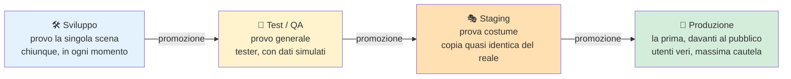
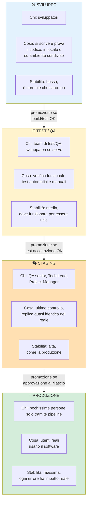
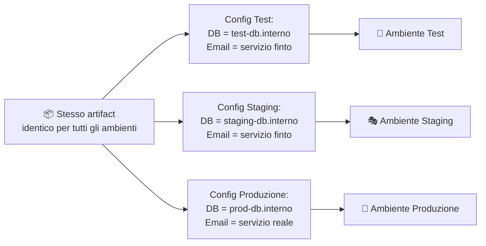

# 14. Ambienti di sviluppo

> 📄 **[Scarica questa sezione in PDF](https://darioschioppi.github.io/corso-onboarding-devops/pdf/14-ambienti-di-sviluppo.pdf)** — utile per la stampa o la lettura offline.

Nella sezione [10. CI/CD](../10-ci-cd/README.md) hai già incontrato il
concetto di **ambiente**: sai che il codice non passa direttamente dal
computer di uno sviluppatore agli utenti finali, ma attraversa diverse
"tappe" (Dev, Test/QA, Staging, Produzione) prima di arrivare al
traguardo. In questa sezione ci fermiamo su ciascuna di queste tappe,
una per una, per capire **cosa succede davvero dentro ognuna di esse**,
chi ci lavora, che dati si usano e perché la disciplina attorno a questo
tema è tutt'altro che un dettaglio tecnico secondario. Seguiremo, tappa
per tappa, un unico bug reale del carrello di ShopFacile: vedrai lo stesso
identico problema attraversare le quattro tappe, dalla scrivania di
Marco fino alla produzione.

## 🎯 Obiettivi della sezione

Alla fine di questa sezione saprai:

- spiegare perché non si testa mai direttamente in produzione;
- descrivere lo scopo specifico di ognuno dei quattro ambienti tipici
  (Dev, Test/QA, Staging, Produzione);
- capire perché gli ambienti devono essere quanto più simili possibile
  tra loro, ed evitare il classico "funziona sul mio computer";
- distinguere dati di test da dati reali, e sapere perché non si usano
  mai dati sensibili reali fuori da produzione;
- capire cos'è una configurazione per ambiente (es. l'indirizzo di un
  database diverso per ogni ambiente);
- descrivere perché l'accesso alla produzione è, di norma, molto più
  restrittivo di quello agli altri ambienti.

---

## 14.1 Perché servire diversi ambienti: la "prova costume"

Immagina uno spettacolo teatrale che debutta davanti al pubblico pagante
la prima serata, senza mai aver fatto una prova. Nessun regista
serio lo farebbe: prima ci sono le **provo generali**, poi la **prova
costume** (con luci, scenografia e costumi veri, ma senza pubblico), e
solo alla fine la **prima** davanti agli spettatori. Ogni tappa serve a
scoprire un problema diverso — un attore che sbaglia una battuta, un
cambio scena troppo lento, un microfono che non funziona — in un
contesto dove sbagliare **non costa nulla**, invece di scoprirlo in
diretta con il pubblico in sala.

Il software funziona esattamente allo stesso modo. **Non si testa mai
direttamente in produzione** per un motivo semplicissimo: in produzione
ci sono utenti reali, che stanno usando il software per lavorare,
comprare, prenotare, pagare. Se un test fallisce lì, l'"errore" non è
un rigo rosso in un log: è un utente che perde dei dati, una transazione
che non va a buon fine, un cliente che chiama il servizio assistenza
arrabbiato.

Per questo si costruisce una **catena di ambienti**, ciascuno con un
livello crescente di somiglianza alla produzione e un livello crescente
di cautela richiesta, esattamente come le prove di uno spettacolo prima
del debutto.

---

## 14.2 Ambiente di Sviluppo (Dev)

L'ambiente di **Sviluppo** è dove nasce il codice. Ogni sviluppatore
scrive e prova le proprie modifiche, quasi sempre in due modalità
complementari:

- **In locale**, sul proprio computer: l'applicazione gira dentro il
  suo portatile, con dati finti creati al momento, senza toccare nulla
  di condiviso con il resto del team.
- **In un ambiente Dev condiviso**, in cloud: una versione
  dell'applicazione sempre aggiornata con l'ultimo codice del branch
  principale, usata per verificare che le proprie modifiche funzionino
  anche insieme a quelle degli altri, prima ancora di arrivare al
  Test/QA.

**Chi ci accede**: gli sviluppatori, in modo ampio e informale.

**Cosa succede qui**: è normale — anzi previsto — che qualcosa non
funzioni. È lavoro in corso, come una scena provata da capo più volte
prima di essere pronta. Non c'è alcun tipo di garanzia di stabilità:
l'ambiente Dev può "rompersi" più volte al giorno senza che questo sia
un problema per nessuno fuori dal team di sviluppo.

> 🛠️ **Esempio pratico**: Marco deve correggere un bug del carrello di
> ShopFacile: quando un cliente applica un codice sconto, il totale
> mostrato a video non tiene conto dell'IVA ricalcolata, e risulta più
> basso di quanto dovrebbe. Scrive il codice della correzione e lo prova
> prima **in locale**, sul suo computer, con dati completamente inventati
> (un carrello finto con prodotti fittizi e un codice sconto di prova).
> Quando è abbastanza sicuro del risultato, pusha il proprio branch: la
> stessa modifica viene automaticamente distribuita anche nell'**ambiente
> Dev condiviso** in cloud, dove i colleghi possono verificare che
> funzioni insieme al resto dell'applicazione, ancora prima che Marco
> apra la Pull Request.

---

## 14.3 Ambiente di Test / QA

Una volta che la correzione di Marco supera i controlli automatici della
pipeline (build, unit test, analisi di qualità — visti nella sezione
CI/CD), viene **promossa** nell'ambiente di **Test/QA** (Quality
Assurance, ovvero "garanzia di qualità").

Qui il software viene verificato in modo più realistico:

- test automatici più ampi (test di integrazione, test end-to-end);
- verifiche manuali da parte del team di test, che prova il software
  come farebbe un utente, cercando deliberatamente di romperlo;
- prime verifiche di casi limite: cosa succede se inserisco un valore
  strano, se clicco due volte sullo stesso bottone, se la connessione si
  interrompe a metà di un'operazione.

**Chi ci accede**: il team di test/QA, gli sviluppatori per investigare
eventuali segnalazioni, occasionalmente il Project Manager per una
demo interna.

**Cosa succede qui**: si scopre e si corregge la maggior parte dei
problemi funzionali, **prima** che possano avvicinarsi anche solo
lontanamente agli utenti reali. Se qualcosa non funziona, il codice
**non viene promosso** oltre: torna in Sviluppo per essere corretto.

> 🛠️ **Esempio pratico**: la correzione di Marco al totale del carrello
> supera la build e i test automatici della pipeline, e viene promossa in
> Test/QA. Qui Giulia prova deliberatamente a "romperla": applica due
> codici sconto diversi allo stesso carrello, prova uno sconto su un
> prodotto già scontato di suo, svuota il carrello a metà del ricalcolo.
> Scopre che, combinando due sconti insieme, il totale torna a essere
> sbagliato in un modo nuovo: apre una segnalazione, e il codice
> **torna** in Sviluppo per la correzione, prima di poter proseguire
> oltre.

---

## 14.4 Ambiente di Staging (Pre-produzione)

Superato anche il secondo giro di test, la correzione del carrello è
pronta per un controllo ancora più realistico, in un ambiente che assomiglia
quanto più possibile alla produzione vera. Lo **Staging** (a volte
chiamato Pre-produzione) è l'ambiente pensato
per essere **quanto più fedele possibile alla produzione**: stessa
configurazione di infrastruttura, stesso tipo di database, volumi di
dati paragonabili, stesse integrazioni con sistemi esterni (per quanto
possibile in modo sicuro). È la "prova costume": tutto è allestito come
sarà la sera del debutto, ma senza pubblico pagante in sala.

Qui si eseguono gli ultimi controlli prima del rilascio reale:

- test di accettazione finali, spesso con il coinvolgimento di chi ha
  richiesto la funzionalità (il Project Manager, un referente del
  progetto);
- a volte test di performance/carico, per verificare che l'applicazione
  regga un numero di utenti realistico;
- verifica che il processo di deploy stesso funzioni senza sorprese,
  proprio perché l'ambiente è configurato come la produzione.

**Chi ci accede**: team di test/QA, sviluppatori senior o Tech Lead,
Project Manager per l'ultima validazione, in modo più controllato
rispetto al Test/QA.

**Cosa succede qui**: se qualcosa emerge in Staging che non era emerso
prima, è un segnale importante — spesso significa che Test/QA non era
sufficientemente simile alla produzione, ed è un'occasione per
migliorare quell'ambiente. Non tutti i progetti hanno uno Staging
separato dal Test/QA: nei progetti più piccoli le due cose a volte
coincidono, ma nei progetti maturi restano due tappe distinte, con scopi
diversi.

> 🛠️ **Esempio pratico**: la correzione al totale del carrello, dopo aver
> superato il Test/QA, viene promossa in Staging. Qui il volume di dati
> è paragonabile a quello reale (migliaia di ordini storici anonimizzati,
> non le tre righe di prova usate in Test), e l'infrastruttura è
> configurata esattamente come in produzione. Sara, come Product Owner
> che aveva segnalato il problema arrivato dai clienti, prova il flusso
> completo end-to-end — carrello, sconto, checkout — prima di dare
> l'ultima validazione. Ahmed segue il test insieme a lei: è il primo bug
> che vede attraversare tutte le tappe fino a qui, ed è un buon modo per
> imparare cosa cambia da un ambiente all'altro. Solo a questo punto il
> rilascio in produzione può essere pianificato.

---

## 14.5 Ambiente di Produzione

Dopo Dev, Test/QA e Staging, resta un'ultima tappa, quella in cui il bug
del carrello incontra finalmente i clienti veri di ShopFacile. La
**Produzione** è l'ambiente reale, quello che usano davvero gli
utenti finali — che siano dipendenti del cliente, clienti finali di un
servizio, o cittadini che usano un servizio pubblico. È la "prima"
davanti al pubblico pagante.

Qui la parola d'ordine è **massima cautela**:

- ogni deploy segue i quality gate e, tipicamente, un'approvazione
  manuale (vista nella sezione CI/CD);
- ogni modifica è monitorata attentamente subito dopo il rilascio
  (metriche di errore, tempi di risposta);
- esiste sempre un piano di rollback pronto, nel caso qualcosa vada
  storto nonostante tutti i controlli precedenti.

**Chi ci accede**: un numero molto ristretto di persone, quasi sempre
solo tramite strumenti e processi automatizzati (la pipeline stessa),
raramente con accesso manuale diretto — approfondiremo il perché nel
paragrafo 15.10.

**Cosa succede qui**: ogni errore ha un impatto reale su persone vere.
Non è più "lavoro in corso": è il prodotto finito, in uso.

> 🛠️ **Esempio pratico — il percorso completo di una modifica**: seguiamo
> l'intero viaggio della correzione al totale del carrello, dal commit
> alla produzione:
>
> 1. **Dev**: Marco corregge il calcolo dell'IVA con lo sconto applicato e
>    lo prova in locale, poi pusha il branch: la pipeline fa build e unit
>    test con esito positivo.
> 2. **Test/QA**: la modifica viene promossa automaticamente. Giulia
>    riprova esattamente lo scenario dei due sconti combinati, più altri
>    casi limite: questa volta tutto funziona come previsto. Promozione
>    approvata.
> 3. **Staging**: la stessa modifica (lo stesso identico pacchetto, non
>    una ricompilazione) viene distribuita in un ambiente identico alla
>    produzione. Sara verifica il flusso end-to-end con dati realistici e
>    dà l'ultima validazione.
> 4. **Produzione**: dopo un'approvazione manuale del Release Manager, la
>    pipeline distribuisce la modifica ai clienti reali, fuori
>    dall'orario di punta. Nei minuti successivi, il team monitora le
>    metriche di errore: se qualcosa andasse storto, è pronto un piano di
>    rollback.
>
> Da notare: è **lo stesso pacchetto** che attraversa tutte le tappe,
> non una versione "ricostruita" ambiente per ambiente — esattamente il
> principio "build once, deploy many" che vedrai nel paragrafo 15.7.

---

## 14.6 I quattro ambienti, fase per fase

Il viaggio della correzione al carrello, visto passo per passo nel box
precedente, si può anche osservare "da fermo", guardando in un unico
schema chi lavora in ciascuna tappa e cosa cambia tra l'una e l'altra. Il
diagramma seguente riprende e amplia quello già visto nella sezione
CI/CD, aggiungendo per ciascun ambiente **chi vi accede** e **cosa
succede concretamente**.

---

## 14.7 "Funziona sul mio computer": perché gli ambienti devono somigliarsi

Il percorso della correzione al carrello ha funzionato senza sorprese
proprio perché Dev, Test/QA, Staging e Produzione si somigliano il più
possibile. Vediamo perché questa somiglianza non è un dettaglio, ma il
punto centrale di tutta la catena. Hai forse già sentito la battuta
"funziona sul mio computer" — è la
scusa (semi-seria) di uno sviluppatore quando qualcosa non funziona in
un altro ambiente. Il problema reale dietro la battuta è che **se gli
ambienti sono troppo diversi tra loro**, un test superato in uno di essi
non garantisce nulla sugli altri:

- una versione diversa di una libreria installata;
- un sistema operativo diverso;
- variabili di configurazione mancanti o diverse;
- un database con una struttura leggermente diversa.

La soluzione moderna è duplice: da un lato l'uso di **container** (visti
nella sezione DevOps/CI-CD, es. immagini Docker), che pacchettizzano
l'applicazione con tutto ciò che le serve per girare identica ovunque;
dall'altro, il principio già incontrato nella sezione CI/CD di
**"build once, deploy many"** — si compila e pacchettizza il software
**una sola volta**, e lo stesso identico artifact viene promosso, senza
modifiche, da un ambiente all'altro. In questo modo, se qualcosa
funziona in Staging, è ragionevole aspettarsi che funzioni anche in
Produzione, perché tecnicamente **è lo stesso identico pacchetto**, non
una ricostruzione "simile".

Più gli ambienti sono simili, meno sorprese si trovano man mano che si
avanza nella catena — ed è per questo che lo Staging, in particolare, è
tenuto quanto più possibile identico alla Produzione.

> 🛠️ **Esempio pratico**: in ShopFacile, ogni volta che una modifica passa
> la fase di build in pipeline, viene generato un **unico** artifact
> (es. un'immagine container con un numero di versione, tipo
> `shopfacile-carrello:1.42.0`). Quello stesso artifact — non uno
> ricostruito da capo — viene distribuito in Test/QA, poi in Staging, poi
> in Produzione. Se in Staging l'immagine `1.42.0` funziona correttamente,
> il team sa che in Produzione girerà **esattamente lo stesso codice, con
> le stesse dipendenze**: non resta da chiedersi "avranno usato la stessa
> versione di libreria X?", perché la domanda non ha nemmeno senso — è
> letteralmente lo stesso file.

---

## 14.8 Dati di test vs dati reali

Sapere che l'artifact è sempre lo stesso risolve il problema del codice,
ma resta un'altra domanda: se il codice è identico, i dati che usa devono
esserlo altrettanto? Qui la risposta cambia radicalmente. Un punto spesso
sottovalutato da chi arriva da fuori dal settore: **gli
ambienti di Sviluppo e Test/QA non usano mai dati reali degli utenti**.

Perché? Perché i dati reali possono contenere informazioni sensibili:
nomi, indirizzi, numeri di documento, dati di pagamento, informazioni
sanitarie. Usarli fuori da un ambiente protetto come la Produzione
significherebe esporli a un numero molto più ampio di persone (tutto il
team di sviluppo e test) e a controlli di sicurezza tipicamente meno
stringenti — un rischio enorme di violazione della privacy, oltre che,
in molti contesti, una vera e propria violazione di legge.

Per questo si usano invece:

- **dati sintetici**: generati appositamente, plausibili ma inventati
  (nomi, indirizzi ed email finti ma verosimili);
- **dati anonimizzati o pseudonimizzati**: partono da dati reali, ma
  privati di ogni elemento che permetterebbe di risalire a una persona
  specifica.

Questo tema è collegato a doppio filo con quanto visto nella sezione
[13. Sicurezza](../13-sicurezza/README.md): la protezione dei dati
personali non è solo una questione di "chi può leggerli in produzione",
ma anche di "dove questi dati non devono mai nemmeno arrivare".

---

## 14.9 Configurazioni per ambiente

Dati diversi non bastano da soli: se lo stesso artifact deve girare su
dati e infrastrutture diverse in ogni ambiente, deve anche sapere in
quale ambiente si trova in un dato momento. Lo stesso identico artifact
(lo stesso pacchetto di codice) deve
comportarsi in modo leggermente diverso a seconda dell'ambiente in cui
gira: in Test deve collegarsi al database di test, in Produzione al
database di produzione; in Test può usare un servizio di invio email
"finto" che non spedisce nulla, in Produzione deve usare il servizio
vero.

La soluzione **non è modificare il codice** per ogni ambiente (violerebbe
il principio "build once, deploy many" visto sopra), ma usare delle
**variabili di configurazione** (o variabili d'ambiente): valori esterni
al codice, forniti al momento dell'avvio, che dicono all'applicazione
"in questo momento stai girando in Test, quindi usa questo indirizzo di
database" oppure "stai girando in Produzione, quindi usa quest'altro".

Le credenziali (password, chiavi di accesso) che fanno parte di queste
configurazioni non vengono mai scritte nel codice: sono gestite tramite
strumenti dedicati (es. un "vault" di segreti), collegandosi ancora al
tema della sicurezza approfondito nella sezione dedicata.

> 🛠️ **Esempio pratico**: ShopFacile deve inviare un'email di conferma
> quando un ordine viene completato. In Test/QA, la variabile di
> configurazione `EMAIL_SERVICE_URL` punta a un servizio "finto" che si
> limita a registrare in un log "avrei inviato questa email", senza
> spedire nulla per davvero — utile per verificare che il codice tenti
> l'invio, senza intasare le caselle di posta di nessuno con conferme
> d'ordine finte. In Produzione, la stessa identica variabile punta
> invece al servizio email reale, quello che avvisa davvero il cliente.
> Il codice che gestisce l'invio non cambia di una riga tra i due
> ambienti: cambia solo il valore di quella variabile.

---

## 14.10 Chi ha accesso a quali ambienti

Hai visto chi lavora in ciascun ambiente lungo il percorso del bug del
carrello: Marco in Dev, Giulia in Test/QA, Sara e Ahmed in Staging, un
numero ristretto di persone in Produzione. Questo schema non è casuale,
ma segue una regola precisa. L'accesso agli ambienti segue un principio
semplice: **più un ambiente è
vicino agli utenti reali, più l'accesso è restrittivo**. Non è
burocrazia fine a se stessa: è la stessa logica per cui non chiunque può
entrare backstage la sera della prima, mentre durante le prove chiunque
del cast può girare liberamente per il teatro.

- **Sviluppo**: accesso ampio, quasi tutto il team tecnico.
- **Test/QA**: accesso al team di test/QA e agli sviluppatori, più
  limitato di Dev.
- **Staging**: accesso più ristretto, tipicamente ruoli senior
  (Tech Lead, QA lead) e il Project Manager per le validazioni finali.
- **Produzione**: accesso **molto** ristretto — spesso solo tramite la
  pipeline automatizzata stessa, con un numero minimo di persone
  autorizzate ad accedere manualmente in casi eccezionali (es.
  un'emergenza), e ogni accesso manuale tipicamente registrato e
  tracciato.

## 📊 Confronto tra i quattro ambienti

| Ambiente | Scopo | Chi lo usa | Tipo di dati | Stabilità richiesta | Frequenza di aggiornamento |
|---|---|---|---|---|---|
| **Sviluppo (Dev)** | Scrivere e provare codice nuovo | Sviluppatori | Dati finti, creati al momento | Bassa: è normale che si rompa | Molto alta, più volte al giorno |
| **Test / QA** | Verificare funzionalmente il software | Team di test/QA, sviluppatori | Dati sintetici o anonimizzati, simili ai reali | Media: deve funzionare per essere utile | Alta, ad ogni promozione dalla CI |
| **Staging (Pre-produzione)** | Ultimo controllo prima del rilascio reale | QA senior, Tech Lead, Project Manager | Dati anonimizzati, volumi simili al reale | Alta: quasi come la produzione | Media, prima di ogni rilascio |
| **Produzione** | Uso reale da parte degli utenti finali | Utenti finali; accesso tecnico molto limitato | Dati reali e sensibili | Massima: ogni errore ha impatto reale | Bassa/controllata, solo rilasci approvati |

---

## 14.11 Riepilogo

Il bug del carrello di ShopFacile ci ha accompagnato da Marco in Dev fino
al rilascio in Produzione: riassumiamo i concetti principali visti lungo
il percorso. In questa sezione hai approfondito il concetto di ambiente già
incontrato nella sezione CI/CD:

- non si testa mai direttamente in produzione: si passa attraverso
  Sviluppo, Test/QA e Staging, come le prove prima di uno spettacolo
  dal vivo;
- ogni ambiente ha un pubblico e uno scopo diversi, con un livello di
  cautela e stabilità crescente man mano che ci si avvicina alla
  produzione;
- gli ambienti devono somigliarsi quanto più possibile tra loro, per
  evitare il problema del "funziona sul mio computer";
- non si usano mai dati reali e sensibili fuori dall'ambiente di
  produzione, per motivi di sicurezza e privacy;
- lo stesso pacchetto di codice cambia comportamento tra ambienti grazie
  a **variabili di configurazione**, non a modifiche del codice stesso;
- l'accesso agli ambienti è tanto più restrittivo quanto più ci si
  avvicina alla produzione.

---

## 📝 Esercizi pratici

1. **Mappa gli ambienti del progetto.** Con l'aiuto di un collega
   developer o del Tech Lead, scopri quanti e quali ambienti esistono
   davvero nel progetto (Dev, Test, Staging, Prod, o eventuali nomi
   diversi usati internamente) e scrivili in ordine, con una riga di
   descrizione per ciascuno.
   ✅ **Come verificare**: sai disegnare, senza guardare gli appunti, la
   sequenza di ambienti del progetto con una freccia di "promozione" tra
   l'uno e l'altro, proprio come nei diagrammi di questa sezione.

2. **Segui una modifica reale attraverso gli ambienti.** Chiedi a uno
   sviluppatore di mostrarti (anche solo a schermo, senza dover
   intervenire) l'ultima modifica che ha promosso da Dev fino a
   Produzione: in quale ambiente si trova adesso, cosa ha superato per
   arrivare lì, cosa manca prima della produzione (se non è già
   arrivata).
   ✅ **Come verificare**: sai raccontare a voce, in meno di due minuti,
   il percorso di quella specifica modifica citando ogni ambiente
   attraversato e cosa è stato verificato in ciascuno.

3. **Trova le variabili di configurazione per ambiente.** Chiedi a un
   developer di farti vedere (anche solo a schermo) dove sono definite
   le variabili di configurazione che cambiano tra un ambiente e l'altro
   nel progetto (es. l'indirizzo del database, l'URL di un servizio
   esterno). Non serve capire ogni dettaglio tecnico: l'obiettivo è
   vedere con i tuoi occhi che esistono e dove vivono.
   ✅ **Come verificare**: sai indicare almeno due valori di
   configurazione che cambiano tra Test/QA e Produzione nel progetto,
   senza però conoscere (né dover conoscere) le password o i segreti
   veri.

4. **Distingui i dati usati nei diversi ambienti.** Chiedi al team se e
   come vengono generati o anonimizzati i dati usati in Test/QA e in
   Staging nel progetto (dati sintetici generati da uno script? dati
   reali anonimizzati? un mix?).
   ✅ **Come verificare**: sai spiegare a un collega non tecnico perché
   non si può semplicemente "copiare" il database di produzione dentro
   l'ambiente di Test così com'è, citando almeno un rischio concreto.

5. **Osserva chi può fare cosa, dove.** Confronta la tabella di accesso
   agli ambienti vista nel paragrafo 15.10 con la situazione reale del
   progetto: chi ha accesso diretto a Dev? Chi può promuovere codice in
   Staging? Chi (o cosa, es. solo la pipeline) può rilasciare in
   Produzione?
   ✅ **Come verificare**: sai indicare, per ciascuno dei quattro
   ambienti, almeno un ruolo del progetto che vi ha accesso e uno che
   invece **non** ce l'ha, spiegando perché.

6. **Simula un rollback.** Chiedi a un collega operations o Tech Lead di
   raccontarti (anche solo a parole, con un esempio ipotetico o reale se
   ce n'è uno) cosa succederebbe se, subito dopo un rilascio in
   Produzione, le metriche di errore iniziassero a salire in modo
   anomalo: chi se ne accorge, chi decide il rollback, quanto tempo
   richiede tipicamente tornare alla versione precedente.
   ✅ **Come verificare**: sai descrivere, passo per passo, la sequenza
   di azioni tra "qualcosa va storto in produzione" e "il sistema torna
   stabile", indicando almeno un ruolo coinvolto in ogni passo.

---

## 🔗 Collegamenti

- [10. CI/CD](../10-ci-cd/README.md) — come la pipeline promuove il codice tra questi stessi ambienti
- [16. Glossario](../16-glossario/README.md) — definizioni rapide di Dev, Staging, Produzione e termini correlati

## 📚 Risorse

- [GitHub Docs — Usare gli ambienti per il deployment](https://docs.github.com/actions/deployment/targeting-different-environments/using-environments-for-deployment)
- [Atlassian — What is a staging environment](https://www.atlassian.com/continuous-delivery/software-testing/what-is-staging-environment)
- [Martin Fowler — Bliki: DeploymentEnvironment](https://martinfowler.com/bliki/DeploymentEnvironment.html)
- [OWASP — Data Protection e ambienti non di produzione](https://owasp.org/www-project-top-ten/)
- [12 Factor App — Config](https://12factor.net/config)
