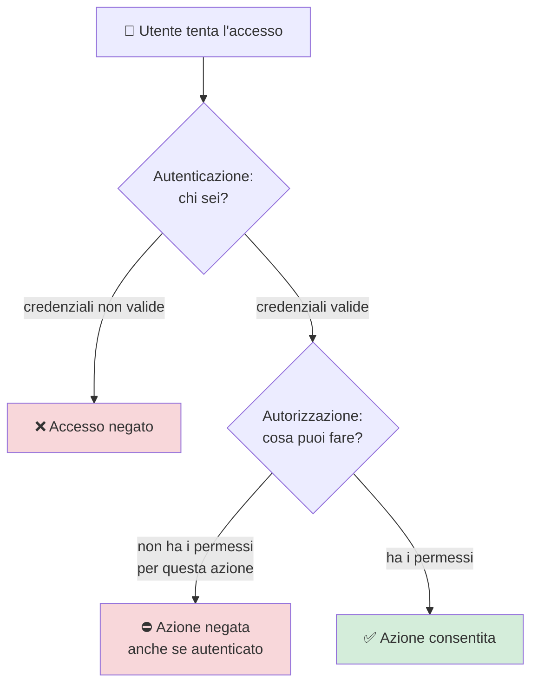
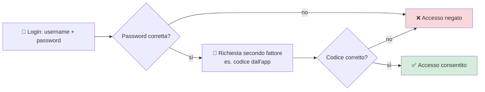
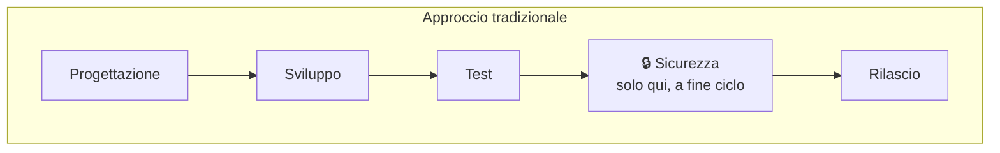
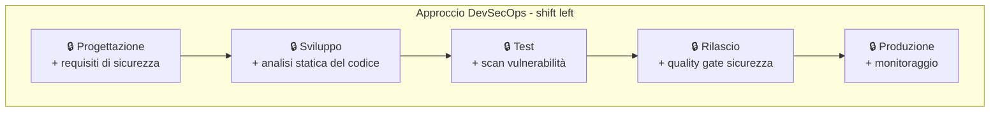
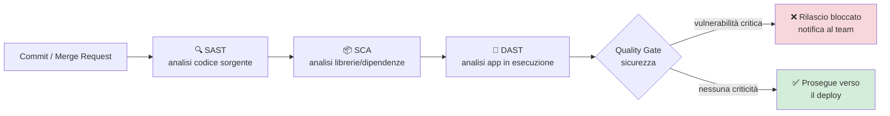

# 14. Sicurezza


> 📄 **[Scarica questa sezione in PDF](https://darioschioppi.github.io/corso-onboarding-devops/pdf/14-sicurezza.pdf)** — utile per la stampa o la lettura offline.


Fin qui hai visto come il codice viene scritto, integrato, testato e
rilasciato attraverso una pipeline (sezione 11), come viene organizzato in
architetture e servizi (sezione 12), e dove "vive" fisicamente
nell'infrastruttura cloud (sezione 13). Manca un ultimo ingrediente, che non
è un passaggio in più nel processo ma una **lente che attraversa tutti i
passaggi precedenti**: la sicurezza informatica.

Non ti aspettare in questa sezione un corso da esperto di cybersecurity: non
è il tuo ruolo, e non deve diventarlo. L'obiettivo è più modesto e insieme
molto concreto: darti il vocabolario e i concetti di base per **capire di
cosa parla il team** quando dice "abbiamo trovato una vulnerabilità critica,
il rilascio è bloccato" o "dobbiamo attivare l'MFA per l'accesso
all'ambiente di produzione", e per **valutare correttamente il peso** di
questi temi quando pianifichi il lavoro, parli con il cliente o scrivi un
contratto.

## 🎯 Obiettivi della sezione

Al termine di questa sezione saprai:

- spiegare perché la sicurezza informatica non è "un problema tecnico" ma
  riguarda anche costi, reputazione, contratti e conformità legale;
- distinguere **autenticazione** e **autorizzazione**;
- descrivere le buone pratiche di base su password e **autenticazione a più
  fattori (MFA)**;
- ricollegare HTTPS e crittografia a quanto già visto nei Fondamenti di
  informatica, con un'idea semplice di cosa significhi "dato cifrato";
- riconoscere, a grandi linee, cosa sono vulnerabilità comuni come SQL
  Injection e Cross-Site Scripting (XSS), e perché esistono;
- sapere cos'è la **OWASP Top 10** e a cosa serve come riferimento di
  settore;
- capire cos'è il **DevSecOps** e il principio dello **"shift left"** della
  sicurezza;
- capire come gli scan di sicurezza automatici si inseriscono nella pipeline
  CI/CD già vista nella sezione 11;
- spiegare, a livello base, perché il **GDPR** e la protezione dei dati
  personali riguardano anche il tuo lavoro di PM;
- capire perché **backup e disaster recovery** sono parte della sicurezza,
  non un tema separato.

---

## 14.1 Perché la sicurezza riguarda anche un PM, non solo i tecnici

Prova a pensarla così: la sicurezza informatica è come **l'impianto
antincendio di un edificio**. Non lo vedi quasi mai in azione, ci speri di
non doverlo mai usare, e nessuno pianifica una giornata di lavoro pensando
all'impianto antincendio. Ma se manca, o è mal progettato, il giorno in cui
succede qualcosa **le conseguenze sono enormemente più gravi** di quanto
sarebbe costato prevenirle.

Per un Project Manager o uno Scrum Master, un incidente di sicurezza non è
"un bug in più da segnare sul backlog": ha impatti che riconoscerai
immediatamente come "roba tua":

- **Costi diretti**: fermare un servizio compromesso, investigare cosa è
  successo, correggere la falla, spesso richiede ore o giorni di lavoro
  imprevisto di più persone del team, sottratte a quanto era pianificato
  nello sprint.
- **Reputazione**: un cliente che scopre che i dati dei suoi utenti sono
  stati esposti perde fiducia nel progetto e in chi lo ha realizzato — una
  fiducia che si ricostruisce molto più lentamente di quanto si perda.
- **Contratti**: molti contratti con i clienti includono clausole precise
  su sicurezza e gestione dei dati (a volte chiamate SLA di sicurezza o
  requisiti di compliance). Non rispettarle può voler dire penali
  economiche o, nei casi più seri, la fine della collaborazione.
- **Conformità legale**: normative come il GDPR (che vedremo al paragrafo
  14.8) impongono obblighi precisi sulla protezione dei dati personali, con
  sanzioni concrete in caso di violazione.

Il punto chiave da portare con te: **la sicurezza è un requisito del
progetto, esattamente come una funzionalità richiesta dal cliente** — non
un "optional" che si aggiunge se resta tempo a fine sprint. Un PM che tratta
la sicurezza come priorità fin dalla pianificazione fa risparmiare
tempo, denaro e problemi seri più avanti.

**Esempio pratico**: durante la pianificazione di una nuova funzionalità
che permette agli utenti di caricare documenti, il team si accorge che
serve anche configurare i permessi di accesso a quei file e cifrare il
canale di upload. Se il PM inserisce questo lavoro nella stima dello sprint
fin dall'inizio (come farebbe con qualsiasi altro requisito), il rilascio
resta nei tempi. Se invece la sicurezza viene "ricordata" solo a fine
sprint, il rilascio slitta e il team lavora sotto pressione per rimettersi
in pari — lo stesso lavoro, fatto più tardi, costa di più.

---

## 14.2 Autenticazione vs Autorizzazione

Sono due concetti che si sentono nominare quasi sempre insieme, e che
vengono facilmente confusi — ma rispondono a due domande diverse:

- **Autenticazione** risponde alla domanda: **"Chi sei?"**. È il processo
  con cui un sistema verifica che tu sia davvero chi dici di essere
  (tipicamente inserendo username e password, o mostrando un altro tipo di
  "prova d'identità").
- **Autorizzazione** risponde alla domanda: **"Cosa puoi fare, ora che
  sappiamo chi sei?"**. È il processo con cui il sistema decide a quali
  risorse o funzionalità hai accesso.

### Analogia: il cinema

Immagina di andare al cinema:

- Alla biglietteria mostri il tuo **biglietto**: la persona alla cassa
  verifica che sia un biglietto valido per lo spettacolo di oggi. Questa è
  l'**autenticazione**: hai dimostrato di essere una persona con diritto a
  entrare.
- Una volta dentro, il biglietto indica anche **quale posto** puoi
  occupare — Sala 3, fila D, posto 12. Non puoi sederti dove vuoi, né
  entrare nella sala riservata a un altro film. Questa è
  l'**autorizzazione**: definisce esattamente cosa puoi fare, anche se sei
  già stato ammesso.

Puoi essere autenticato correttamente (il tuo biglietto è vero) ma non
autorizzato a fare una certa cosa (entrare nella Sala 5, dove è in
programmazione un altro film). Sono due controlli **distinti e
sequenziali**: prima si stabilisce chi sei, poi cosa puoi fare.



**Esempio pratico nel progetto**: un membro del team può autenticarsi
correttamente sulla piattaforma Azure DevOps (sa la password, entra), ma
essere autorizzato solo a **leggere** il codice di un certo repository e
non a **modificare** le impostazioni della pipeline di produzione — quel
permesso è riservato, ad esempio, al Tech Lead. Due sviluppatori autenticati
sulla stessa piattaforma possono avere autorizzazioni completamente diverse.

---

## 14.3 Password, credenziali e MFA: le buone pratiche di base

La stragrande maggioranza degli incidenti di sicurezza non nasce da
tecniche sofisticate da film di spionaggio, ma da **credenziali debitamente
rubate o indovinate**: password troppo semplici, riutilizzate ovunque, o
condivise con troppa disinvoltura.

Qualche buona pratica base, valida per te e per chiunque nel team:

- **Password forti e uniche**: una password lunga (idealmente 12+
  caratteri), non riconducibile a informazioni personali facilmente
  reperibili (data di nascita, nome del cane), e **diversa per ogni
  servizio**. Se un servizio viene compromesso e la password è riusata
  altrove, il danno si moltiplica.
- **Gestori di password (password manager)**: strumenti come quelli
  aziendali forniti dall'IT (o soluzioni diffuse come Bitwarden, 1Password)
  generano e ricordano password complesse per ogni servizio, così non devi
  memorizzarle tu né riusarle. È molto più sicuro affidarsi a uno di questi
  strumenti che scrivere le password su un file di testo o, peggio, su un
  post-it.
- **Autenticazione a più fattori (MFA - Multi-Factor Authentication)**:
  oltre alla password (qualcosa che sai), il sistema richiede una seconda
  "prova", ad esempio un codice generato da un'app sul telefono o
  un'impronta digitale (qualcosa che hai o che sei). Anche se qualcuno
  scoprisse la tua password, senza il secondo fattore non potrebbe entrare.

> 💡 **Analogia**: la password è come la chiave di casa. L'MFA è come
> avere, oltre alla chiave, anche un citofono con telecamera che chiede
> conferma prima di far entrare qualcuno — anche se ha copiato la chiave,
> senza quella seconda verifica non entra.



Nel progetto, è molto probabile che l'accesso a strumenti sensibili (Azure
DevOps, ambiente cloud, VPN aziendale) richieda l'MFA per policy aziendale:
se ti viene chiesto di installare un'app di autenticazione sul telefono per
lavoro, ora sai perché.

**Esempio pratico**: immagina che la password di un membro del team venga
scoperta perché usata anche su un altro servizio online violato in passato
(è più comune di quanto sembri: succede quando la stessa password viene
riusata su più siti). Chi ha ottenuto quella password prova ad accedere ad
Azure DevOps con quelle credenziali. Senza MFA, entrerebbe subito. Con
l'MFA attivo, il sistema chiede anche il codice generato dall'app sul
telefono di quella persona: l'attaccante non lo ha, e l'accesso viene
bloccato. Questo è esattamente il motivo per cui, dopo un data breach di
un servizio terzo, la prima raccomandazione è sempre "cambia la password e
verifica che l'MFA sia attivo", non solo la prima.

---

## 14.4 HTTPS e crittografia: un richiamo veloce

Nella sezione [2. Fondamenti di informatica](../02-fondamenti-informatica/README.md)
hai già visto la differenza tra HTTP e HTTPS: HTTPS **cifra** i dati
scambiati tra client e server, in modo che chi li intercettasse lungo il
tragitto non possa leggerli.

Qui aggiungiamo solo un tassello: cosa significa concretamente "dato
cifrato"?

**Cifrare** un dato significa trasformarlo, tramite un algoritmo
matematico e una "chiave" segreta, in una sequenza illeggibile per chiunque
non possieda la chiave giusta per invertire la trasformazione
(**decifrare**). Un esempio semplicissimo, giocattolo, solo per l'idea:

```
Testo originale:   CIAO
Regola di cifratura: sposta ogni lettera di 3 posizioni nell'alfabeto
Testo cifrato:      FLDR
```

Chi intercetta "FLDR" senza conoscere la regola ("sposta di 3 posizioni")
non ha modo semplice di capire che il messaggio originale era "CIAO". Gli
algoritmi usati davvero da HTTPS sono incomparabilmente più complessi e
robusti di questo esempio — è solo per rendere intuitiva l'idea di
"trasformare un dato leggibile in uno illeggibile, con una chiave che serve
per tornare indietro".

Due momenti in cui i dati vanno protetti, entrambi importanti:

- **Dati "in transito"**: mentre viaggiano in rete tra client e server —
  è il ruolo di HTTPS, già visto.
- **Dati "a riposo"** (*at rest*): mentre sono salvati su un disco, in un
  database, in un backup. Anche questi vanno spesso cifrati, perché se
  qualcuno accede fisicamente o illegittimamente a quel disco, senza la
  chiave i dati restano illeggibili.

Non avrai bisogno di implementare crittografia, ma è utile sapere che
quando un cliente chiede "i nostri dati sono cifrati?", la risposta
completa riguarda **sia** il transito (HTTPS) **sia** il salvataggio (a
riposo).

**Esempio pratico**: un utente compila un modulo con i propri dati
personali su un sito web e li invia. Se il sito usa HTTPS, quei dati
viaggiano cifrati dal browser dell'utente al server — anche se qualcuno
intercettasse il traffico di rete (ad esempio su un Wi-Fi pubblico non
sicuro), leggerebbe solo una sequenza illeggibile. Una volta arrivati al
server, quei dati vengono salvati in un database: se anche il database è
configurato per cifrare i dati "a riposo", chi eventualmente accedesse
senza autorizzazione al disco fisico del server (un furto, una copia
illegittima del backup) troverebbe comunque dati illeggibili senza la
chiave giusta. Le due protezioni sono indipendenti: un sito può avere
HTTPS ma un database non cifrato, o viceversa — un cliente attento chiede
entrambe.

---

## 14.5 Vulnerabilità comuni: perché il codice va "testato" anche per la sicurezza

Una **vulnerabilità** è un errore o una debolezza nel software che
qualcuno con intenzioni malevole (un *attaccante*) può sfruttare per fare
qualcosa che non dovrebbe poter fare: leggere dati che non gli
appartengono, modificarli, bloccare un servizio.

Non serve conoscere i dettagli tecnici di come si sfruttano, ma è utile
sapere che **esistono**, che hanno nomi ricorrenti, e che è per questo che
il codice va controllato anche dal punto di vista della sicurezza, non solo
della correttezza funzionale. Due esempi molto citati:

- **SQL Injection**: succede quando un'applicazione inserisce, senza i
  controlli giusti, un testo scritto dall'utente direttamente dentro una
  query verso il database (quelle query SQL viste nella sezione 2). Se
  l'utente scrive, in un campo di ricerca, non un nome ma un pezzo di
  comando SQL "camuffato", e l'applicazione non lo riconosce come
  pericoloso, quel comando può finire per essere eseguito sul database —
  ad esempio per leggere dati che non dovrebbe vedere.
- **Cross-Site Scripting (XSS)**: succede quando un'applicazione web
  mostra, senza i controlli giusti, un testo scritto da un utente
  (es. un commento, un messaggio) direttamente dentro la pagina vista da
  altri utenti. Se quel testo contiene in realtà un piccolo "programma"
  camuffato da testo normale, il browser di chi legge quella pagina può
  finire per eseguirlo — ad esempio per rubare dati della sessione di
  quell'altro utente.

> 💡 **Analogia semplice**: pensa a un modulo di iscrizione dove il campo
> "Nome" dovrebbe contenere solo... un nome. Se il sistema si fida
> ciecamente di quello che scrivi e non controlla mai cosa c'è davvero
> scritto lì dentro, qualcuno potrebbe scrivere, invece del suo nome,
> un'istruzione nascosta — e se il sistema la esegue senza accorgersene, il
> "modulo" è diventato una porta d'accesso indesiderata.

Il punto per te, come PM, non è saper riconoscere queste vulnerabilità nel
codice — è sapere che **esistono categorie note e ricorrenti** di errori di
questo tipo, e che per questo il codice va **testato anche per la
sicurezza**, con strumenti dedicati, esattamente come si testa la
correttezza funzionale con i test automatici visti nella sezione 11.

---

## 14.6 OWASP Top 10: il riferimento standard del settore

Con il tempo, la community internazionale della sicurezza informatica ha
raccolto e catalogato le vulnerabilità più comuni e più pericolose che
colpiscono le applicazioni web, mantenendo una lista aggiornata
periodicamente: la **OWASP Top 10**.

**OWASP** (Open Worldwide Application Security Project) è
un'organizzazione internazionale, non a scopo di lucro, dedicata a
migliorare la sicurezza del software. La sua **Top 10** è probabilmente il
documento più citato al mondo in questo ambito: una classifica delle
categorie di vulnerabilità più critiche e più frequenti nelle applicazioni
web (di cui SQL Injection e XSS, visti sopra, sono esempi storici).

Non devi memorizzare l'elenco né conoscerne i dettagli tecnici. Quello che
ti serve sapere è:

- è un **riferimento riconosciuto a livello mondiale**: quando un cliente,
  in un contratto o in un audit, chiede che l'applicazione sia "conforme
  alla OWASP Top 10" o che sia stato eseguito un "test basato sulla OWASP
  Top 10", sta chiedendo che il software sia stato verificato contro
  questo elenco di rischi noti;
  
- gli strumenti automatici di analisi di sicurezza che vedrai nella
  pipeline (paragrafo 14.8) fanno spesso riferimento esplicito a queste
  categorie;
- è aggiornata periodicamente, perché le tecniche di attacco e le
  tecnologie usate nel software cambiano nel tempo.

Sapere che questo standard esiste ti permette di seguire una conversazione
tecnica sulla sicurezza senza perderti, e di capire perché in una gara
d'appalto o in un capitolato può comparire esplicitamente il riferimento a
OWASP.

**Esempio pratico**: il cliente di un progetto chiede, in fase di
capitolato, che prima del rilascio in produzione venga eseguito un
"penetration test basato sulla OWASP Top 10". In pratica, un team di
sicurezza (interno o esterno) prova a verificare, categoria per categoria
di quella lista, se l'applicazione presenta debolezze note — ad esempio,
controlla se è vulnerabile a SQL Injection o XSS (visti sopra), se gestisce
correttamente l'autenticazione, se espone informazioni che non dovrebbe.
Il risultato è un report con eventuali criticità trovate, classificate per
gravità: è esattamente il tipo di documento che un PM può dover presentare
al cliente come prova che il software è stato verificato secondo uno
standard riconosciuto, non "a occhio".

---

## 14.7 DevSecOps: la sicurezza fin dall'inizio ("shift left")

Nella sezione [9. DevOps](../09-devops/README.md) hai visto come la cultura
DevOps abbatta il muro tra chi scrive il software e chi lo mette in
produzione, integrando i due mondi in un unico flusso continuo. Il
**DevSecOps** estende esattamente la stessa logica alla sicurezza: la "Sec"
(Security) non è più una fase separata, affidata a un team diverso, che
interviene solo alla fine, poco prima del rilascio — è **integrata in ogni
fase** del processo di sviluppo, fin dall'inizio.

Questo principio si chiama **"shift left"** (letteralmente "spostare a
sinistra"): se disegni il processo di sviluppo come una linea temporale che
va da sinistra (progettazione) a destra (produzione), storicamente i
controlli di sicurezza avvenivano quasi solo a destra, poco prima del
rilascio — quando un problema trovato è già molto costoso da correggere,
perché magari richiede di rivedere scelte di progettazione fatte mesi
prima. Il DevSecOps **sposta quei controlli verso sinistra**, il più
presto possibile nel processo.





Perché conviene? Perché **correggere un problema di sicurezza costa
sempre meno, più presto lo si scopre** — esattamente come per i bug
funzionali: un errore di progettazione trovato durante la stesura dei
requisiti costa una discussione; lo stesso errore scoperto in produzione,
con dati reali di utenti reali già esposti, può costare giorni di lavoro
d'emergenza, comunicazioni al cliente e, potenzialmente, obblighi legali di
notifica (ne parliamo al paragrafo 14.9).

Per un PM/Scrum Master, il DevSecOps si traduce concretamente in domande
da porsi già in fase di pianificazione, non solo a rilascio imminente:
"questa nuova funzionalità gestisce dati sensibili?", "abbiamo previsto
tempo per la revisione di sicurezza?", "il quality gate di sicurezza è
configurato sulla pipeline di questo progetto?".

---

## 14.8 Scan di sicurezza nella pipeline CI/CD

Nella sezione [11. CI/CD](../11-ci-cd/README.md) hai già incontrato,
nella fase "Analisi di qualità e sicurezza del codice" e nella tabella dei
quality gate, l'idea che la pipeline includa controlli automatici di
sicurezza. Qui rendiamo quel concetto un po' più concreto.

Gli strumenti di scan automatico più comuni, integrati direttamente nella
pipeline, verificano cose diverse:

- **Analisi statica del codice (SAST - Static Application Security
  Testing)**: analizza il codice sorgente, senza eseguirlo, cercando
  pattern noti di vulnerabilità (es. un punto dove un dato dell'utente
  finisce, senza controlli, dentro una query SQL — il rischio di SQL
  Injection visto al paragrafo 14.5).
- **Analisi delle dipendenze (SCA - Software Composition Analysis)**:
  quasi nessun software è scritto completamente da zero — si usano
  librerie esterne (open source o commerciali). Questi strumenti
  controllano se una delle librerie usate ha vulnerabilità **note e
  pubblicamente documentate**, e segnalano se serve aggiornarla.
- **Analisi dinamica (DAST - Dynamic Application Security Testing)**:
  a differenza del SAST, prova ad "attaccare" l'applicazione realmente in
  esecuzione (tipicamente in un ambiente di test), simulando alcune delle
  tecniche di un vero attaccante, per vedere come si comporta davvero.

Il risultato di questi scan si traduce, come già visto nella sezione 11, in
un **quality gate**: se viene trovata una vulnerabilità sopra una certa
soglia di gravità (tipicamente "alta" o "critica"), la pipeline si ferma e
il rilascio viene bloccato finché il problema non viene risolto — non è
diverso, nel meccanismo, da un test funzionale che fallisce.



Il vantaggio di questi scan automatici, rispetto a una revisione manuale
occasionale, è lo stesso visto per i test automatici in generale:
**ripetibilità e velocità**. Ogni singolo commit viene controllato,
sempre, senza dipendere dalla memoria o dalla disponibilità di una persona
che "se ne ricordi".

---

## 14.9 GDPR e privacy dei dati: un accenno essenziale

Il **GDPR** (General Data Protection Regulation, "Regolamento Generale
sulla Protezione dei Dati") è la normativa europea che disciplina come le
aziende devono trattare i **dati personali** delle persone (nomi, email,
indirizzi, dati di navigazione, e molto altro).

Non è un tema puramente etico ("è giusto proteggere i dati delle persone"),
è un **obbligo legale**, con conseguenze concrete in caso di violazione:
sanzioni economiche (che possono essere molto rilevanti), obbligo di
comunicare la violazione alle autorità competenti e, spesso, agli stessi
utenti coinvolti entro tempi stretti, oltre al danno reputazionale già
visto al paragrafo 14.1.

Per il tuo ruolo, alcuni concetti base sufficienti per orientarti:

- se un progetto raccoglie o gestisce dati di persone (utenti, dipendenti,
  clienti), quei dati vanno protetti con misure tecniche adeguate (accessi
  controllati, cifratura, backup sicuri — tutti concetti già visti in
  questa sezione);
- va raccolto solo il dato **necessario** allo scopo dichiarato (principio
  di "minimizzazione"), non "tutto quello che si può raccogliere";
- una violazione di dati personali (un cosiddetto **data breach**) ha
  obblighi di notifica precisi, con scadenze temporali stringenti;
- molti progetti prevedono un ruolo o un referente per la protezione dei
  dati (in alcuni contesti, un DPO - Data Protection Officer) da coinvolgere
  quando una funzionalità tratta dati personali in modo nuovo.

Non ti verrà chiesto di diventare un esperto legale di GDPR, ma è utile
riconoscere quando una richiesta del cliente o una funzionalità del
progetto **tocca dati personali**, per sapere che in quei casi il tema
sicurezza/privacy va coinvolto fin dalla pianificazione, non aggiunto a
posteriori.

**Esempio pratico**: il team riceve una richiesta di funzionalità che
prevede di salvare, per ogni utente, anche il numero di telefono e la
posizione geografica approssimativa. Sono entrambi dati personali secondo
il GDPR. Un PM attento, in fase di pianificazione, si pone (e pone al
team) alcune domande prima di stimare lo sprint: "questo dato è davvero
necessario per la funzionalità, o stiamo raccogliendo più del dovuto?",
"chi avrà accesso a questo dato una volta salvato?", "per quanto tempo lo
conserviamo?". Se invece la funzionalità viene sviluppata e rilasciata
senza porsi queste domande, e in seguito si scopre un accesso non
autorizzato a quei dati, il progetto si trova davanti a un data breach da
notificare formalmente, con tempi stretti e conseguenze reali — non un
semplice bug da correggere alla prossima release.

---

## 14.10 Backup e disaster recovery: il piano B quando qualcosa va storto

Chiudiamo con un tema che a volte viene percepito come "amministrativo" ma
è parte integrante della sicurezza: cosa succede se, nonostante tutte le
precauzioni, qualcosa va comunque storto — un guasto hardware, un errore
umano che cancella dati per sbaglio, o un attacco che compromette un
sistema.

- **Backup**: una copia dei dati, salvata separatamente (spesso in un
  luogo fisicamente diverso), che permette di recuperare le informazioni
  se l'originale viene perso o danneggiato. Un backup che non viene mai
  testato — cioè non si è mai provato davvero a ripristinarlo — è un falso
  senso di sicurezza: l'unico backup di cui ci si può davvero fidare è
  quello che si è verificato essere effettivamente ripristinabile.
- **Disaster Recovery (DR)**: il piano più ampio, non limitato ai soli
  dati, per far ripartire un intero sistema/servizio dopo un evento grave
  (un guasto importante, un disastro naturale che colpisce un data center,
  un attacco su larga scala), nel modo più rapido possibile.

> 💡 **Analogia**: il backup è come la copia delle chiavi di casa lasciata
> a un vicino di fiducia: se perdi le tue, non resti fuori. Il disaster
> recovery è come avere un piano intero per la tua famiglia in caso la
> casa diventi inabitabile — dove andare, cosa portare, chi contattare —
> non basta la copia delle chiavi se la casa stessa non esiste più.

Due metriche che il team può citare parlando di DR, utili da riconoscere:

- **RTO (Recovery Time Objective)**: quanto tempo, al massimo, ci si può
  permettere che il servizio resti fermo prima di essere ripristinato.
- **RPO (Recovery Point Objective)**: quanti dati, al massimo, ci si può
  permettere di perdere (misurato in tempo — es. "non più di 1 ora di
  dati persi") in caso di ripristino da backup.

Per un PM, sapere che backup e DR non sono un dettaglio tecnico invisibile
ma **una scelta con un costo e un livello di rischio accettato** è
importante: un cliente che chiede "in quanto tempo torniamo operativi se
tutto si ferma?" sta facendo una domanda di business legittima, a cui il
team tecnico deve poter rispondere con numeri concreti (gli RTO/RPO
concordati), non con un generico "dovremmo farcela".

**Esempio pratico**: il database di produzione di un progetto subisce un
guasto e diventa inaccessibile alle 14:00 di un giorno lavorativo. Se il
progetto ha concordato un RTO di 2 ore, il team ha l'obiettivo di
ripristinare il servizio entro le 16:00. Se l'RPO concordato è di 1 ora, e
l'ultimo backup automatico risale alle 13:30, il team sa già, prima
ancora di iniziare il ripristino, che andranno persi al massimo 30 minuti
di dati recenti — un'informazione che il PM può comunicare subito al
cliente, invece di scoprirlo a ripristino concluso. Senza questi numeri
concordati in anticipo, la stessa situazione genera solo incertezza e
domande a cui nessuno sa rispondere con precisione.

---

## 14.11 Riepilogo

In questa sezione hai visto i concetti di base della sicurezza informatica
utili al tuo ruolo di PM/Scrum Master:

- la sicurezza non è solo un tema tecnico: ha impatti diretti su costi,
  reputazione, contratti e conformità legale;
- **autenticazione** (chi sei) e **autorizzazione** (cosa puoi fare) sono
  due controlli distinti e sequenziali;
- password forti, gestori di password e **MFA** sono le difese di base
  contro il tipo di incidente più comune: il furto di credenziali;
- **HTTPS** cifra i dati in transito; i dati "a riposo" (salvati) vanno
  cifrati a loro volta;
- vulnerabilità come **SQL Injection** e **XSS** sono categorie note e
  ricorrenti di errori nel codice, motivo per cui il software va testato
  anche dal punto di vista della sicurezza;
- la **OWASP Top 10** è il riferimento standard del settore per le
  vulnerabilità più critiche nelle applicazioni web;
- il **DevSecOps** integra la sicurezza fin dall'inizio del processo di
  sviluppo, con il principio dello **"shift left"**;
- gli **scan di sicurezza automatici** (SAST, SCA, DAST) si inseriscono
  nella pipeline CI/CD come quality gate, esattamente come i test
  funzionali;
- il **GDPR** impone obblighi legali precisi sulla protezione dei dati
  personali, con conseguenze concrete in caso di violazione;
- **backup e disaster recovery** sono il piano B necessario quando,
  nonostante tutte le precauzioni, qualcosa va comunque storto.

Nella prossima sezione vedrai come questi concetti si traducono in scelte
concrete di configurazione degli ambienti di sviluppo, test, staging e
produzione.

---

## ✅ Checklist di autoverifica

Prima di passare alla sezione successiva, prova a rispondere (anche solo a
voce, o scrivendo due righe) a queste domande:

- Sai spiegare la differenza tra autenticazione e autorizzazione con
  l'analogia del cinema?
- Sai spiegare a cosa serve l'MFA e perché rafforza la sola password?
- Sai spiegare, con parole tue, cosa significa "dato cifrato"?
- Sapresti spiegare a un collega non tecnico perché il codice va testato
  anche per la sicurezza, non solo per la correttezza funzionale?
- Sai spiegare cos'è la OWASP Top 10 e perché viene citata nei contratti?
- Sai spiegare il principio dello "shift left" nel DevSecOps?
- Sai collegare gli scan SAST/SCA/DAST al concetto di quality gate visto
  nella sezione CI/CD?
- Sai spiegare perché il GDPR riguarda anche le scelte di un PM, non solo
  i legali?
- Sai spiegare la differenza tra backup e disaster recovery?

---

## 📝 Esercizi pratici

1. **Mappa autenticazione/autorizzazione sul progetto**: chiedi a un
   collega developer come funziona il login nell'applicazione del progetto
   e quali ruoli/permessi esistono (es. "utente base", "amministratore").
   Disegna uno schema semplice (anche a mano) con almeno due ruoli diversi
   e cosa ciascuno può o non può fare.
   ✅ **Come verificare**: sei in grado di indicare almeno un'azione che un
   ruolo può fare e un altro no, usando esempi reali del progetto (non
   inventati) e senza confondere "chi è" con "cosa può fare".

2. **Controlla l'MFA sui tuoi strumenti di lavoro**: verifica se hai
   l'autenticazione a più fattori attiva su tutti gli strumenti che usi per
   lavoro (email aziendale, Azure DevOps, VPN). Se manca su qualcuno,
   attivala (o chiedi all'IT come fare).
   ✅ **Come verificare**: puoi elencare, per ogni strumento di lavoro che
   usi, se l'MFA è attiva sì/no, e sai spiegare a un collega perché è
   importante che lo sia anche se la password è "forte".

3. **Riconosci una vulnerabilità in un caso pratico**: leggi la
   descrizione di una vulnerabilità reale (puoi cercarne una recente sul
   sito OWASP o in una news di settore, senza bisogno di capirne i
   dettagli tecnici) e prova a classificarla: assomiglia più a una SQL
   Injection, a una XSS, o a un'altra categoria? Scrivi due righe su cosa
   avrebbe potuto fare un attaccante se quella vulnerabilità non fosse
   stata corretta.
   ✅ **Come verificare**: sai spiegare, con parole tue e senza gergo
   tecnico eccessivo, cosa rischiava di succedere e perché "testare anche
   per la sicurezza" avrebbe potuto prevenirlo.

4. **Trova gli scan di sicurezza nella pipeline reale**: chiedi a un
   collega (developer o DevOps engineer) di farti vedere, nella pipeline
   CI/CD del progetto, dove sono configurati gli scan di sicurezza (SAST,
   SCA, o eventualmente DAST) e cosa succede quando trovano una
   vulnerabilità critica.
   ✅ **Come verificare**: sai indicare in quale fase della pipeline si
   trova ciascun tipo di scan, e sai descrivere concretamente cosa vede il
   team quando un quality gate di sicurezza blocca un rilascio (una
   notifica? un'email? il rilascio che semplicemente non parte?).

5. **Simula una richiesta del cliente sul GDPR**: immagina che il cliente
   chieda "per quanto tempo conservate i dati personali degli utenti dopo
   che chiudono l'account, e chi può accedervi?". Prova a scrivere, in 5-6
   righe, come struttureresti la risposta (anche senza conoscere i dettagli
   tecnici esatti del progetto — l'obiettivo è la struttura del
   ragionamento, non il dato preciso).
   ✅ **Come verificare**: la tua risposta tocca sia l'aspetto tecnico
   (dove e come sono protetti i dati) sia l'aspetto di processo (chi
   decide i tempi di conservazione, chi ha accesso), e non promette nulla
   che non puoi verificare con il team.

6. **Chiedi RTO e RPO reali del progetto**: chiedi alla tua collega
   Scrum Master/PM o a un membro del team operations quali sono, se
   definiti, l'RTO e l'RPO concordati per l'ambiente di produzione del
   progetto (anche se la risposta è "non sono ancora stati definiti
   formalmente" — è comunque un'informazione utile).
   ✅ **Come verificare**: sai riportare a un collega, con le tue parole,
   cosa significano quei due numeri specifici (non la definizione
   generica del libro) applicati al contesto reale del progetto.

---

## 🔗 Collegamenti

- [15. Ambienti di sviluppo](../15-ambienti-di-sviluppo/README.md) — come si configurano in pratica accessi, credenziali e isolamento tra Dev, Test, Staging e Produzione
- [16. Glossario](../16-glossario/README.md) — per ripassare rapidamente ogni termine visto in questa sezione

## 📚 Risorse

- [OWASP Top 10](https://owasp.org/www-project-top-ten/) — la classifica ufficiale delle vulnerabilità più critiche per le applicazioni web
- [OWASP Foundation — sito ufficiale](https://owasp.org/) — panoramica su progetti, guide e risorse gratuite in ambito sicurezza applicativa
- [NCSC (National Cyber Security Centre, UK) — Cyber security basics](https://www.ncsc.gov.uk/section/advice-guidance/all-topics) — guide pratiche e accessibili su password, MFA e igiene informatica di base
- [Microsoft Learn — Security concepts](https://learn.microsoft.com/en-us/security/zero-trust/zero-trust-overview) — introduzione ai principi moderni di sicurezza (Zero Trust) applicati al cloud
- [Microsoft Learn — Cos'è il DevSecOps](https://learn.microsoft.com/it-it/devops/operate/security-in-devops) — approfondimento su come la sicurezza si integra nel ciclo DevOps
- [Garante per la protezione dei dati personali — Cos'è il GDPR](https://www.garanteprivacy.it/regolamentoue) — riferimento istituzionale italiano sul regolamento europeo
