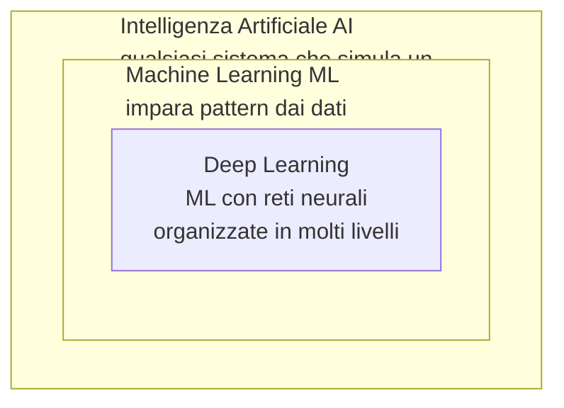
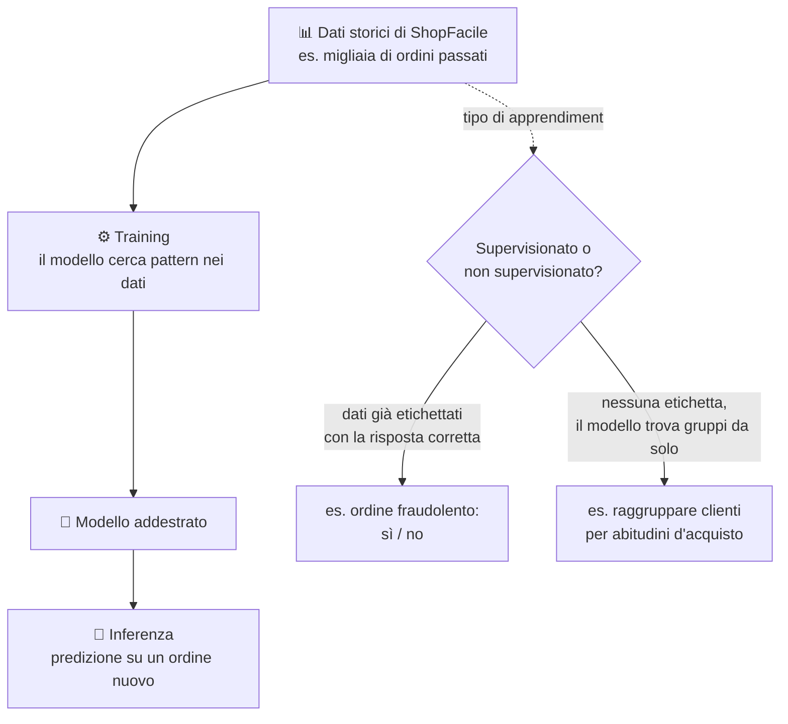
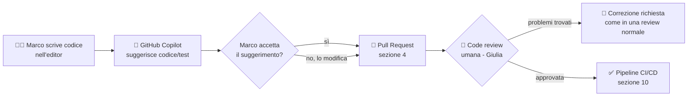
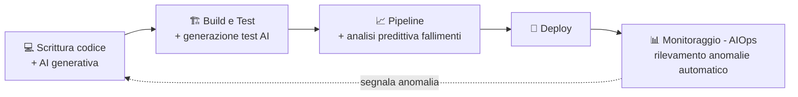
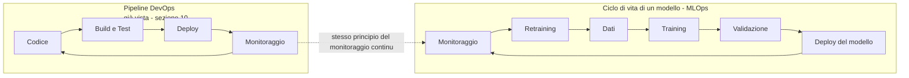

# 15. Intelligenza artificiale

> 📄 **[Scarica questa sezione in PDF](https://darioschioppi.github.io/corso-onboarding-devops/pdf/15-intelligenza-artificiale.pdf)** — utile per la stampa o la lettura offline.

Nella sezione [14. Ambienti di sviluppo](../14-ambienti-di-sviluppo/README.md)
hai seguito un bug del carrello di ShopFacile passo per passo, da Dev fino a
Produzione, e hai visto quante persone e quanti controlli intervengono lungo
il percorso: Marco che scrive il codice, Giulia che lo revisiona e lo testa,
la pipeline che lo promuove da un ambiente all'altro. Negli ultimi anni, in
quello stesso percorso, si è affacciato un nuovo tipo di "collaboratore": non
una persona, non uno strumento che esegue regole fisse, ma un software che
**suggerisce** codice, **riformula** testi, **riassume** riunioni — a volte
con risultati sorprendenti, a volte sbagliando con altrettanta sicurezza.
Questa sezione ti dà il vocabolario e lo spirito critico per lavorare bene al
fianco di questi strumenti, senza subirli né idealizzarli.

Non troverai qui un corso di data science: niente formule, niente matematica.
L'obiettivo è che tu, come Junior Project Manager/Scrum Master, sappia **di
cosa parla il team** quando dice "ho usato Copilot per generare i test" o "il
modello di rilevamento anomalie ha segnalato un picco strano", e che tu stessa
o tu stesso sappia usare questi strumenti nel tuo lavoro quotidiano con
consapevolezza dei loro limiti.

## 🎯 Obiettivi della sezione

Alla fine di questa sezione saprai:

- distinguere **intelligenza artificiale (AI)**, **machine learning (ML)** e
  **deep learning** come cerchi via via più piccoli, non come sinonimi
  intercambiabili;
- spiegare la differenza tra un software tradizionale (regole scritte da un
  umano) e un modello addestrato (che impara pattern dai dati);
- descrivere cosa significano **training** e **inferenza**, e la differenza
  tra apprendimento **supervisionato** e **non supervisionato**;
- riconoscere il concetto di **overfitting** con un'analogia semplice;
- spiegare cos'è un **LLM (Large Language Model)**, cosa vuol dire "AI
  generativa" e perché un modello può **"allucinare"** (inventare
  informazioni false in modo plausibile);
- riconoscere come l'AI si inserisce negli strumenti di sviluppo (es.
  **GitHub Copilot**) e perché il codice generato va comunque revisionato;
- riconoscere il termine **AIOps** e capire dove l'AI si inserisce nel ciclo
  di vita DevOps già visto nella sezione 9 e nella sezione 10;
- individuare almeno cinque usi concreti dell'AI nel lavoro quotidiano di un
  PM/Scrum Master, e i relativi limiti;
- riconoscere i principali **rischi** (allucinazioni, bias, privacy,
  proprietà intellettuale, dipendenza eccessiva) e collegarli a quanto già
  visto nella sezione 13 sulla sicurezza;
- avere un'idea di base di cosa sia **MLOps** e perché un modello, a
  differenza del software tradizionale, può **degradare nel tempo**;
- applicare qualche regola pratica di buon senso quando usi uno strumento di
  AI generativa nel tuo lavoro.

---

## 15.1 Cos'è l'intelligenza artificiale, in parole semplici

Il codice che hai seguito nella sezione 14, dal computer di Marco alla
produzione, era scritto da una persona: ogni istruzione, ogni condizione "se
succede X allora fai Y", è stata pensata e digitata da un umano. Questo è
sempre stato, storicamente, il modo in cui si costruisce software. Ma esiste
un'altra strada, radicalmente diversa, ed è da lì che dobbiamo partire per
capire di cosa parliamo in questa sezione.

**Intelligenza Artificiale (AI - Artificial Intelligence)** è un termine
molto ampio: indica qualsiasi sistema informatico capace di svolgere compiti
che, se li facesse una persona, diremmo che richiedono "intelligenza" —
riconoscere un'immagine, capire una frase, prendere una decisione in base a
dati incerti. Dentro questo termine ampio esistono approcci molto diversi tra
loro, e per orientarti ti servono soprattutto due sotto-categorie:

- **Machine Learning (ML)**, in italiano "apprendimento automatico": un
  approccio all'AI in cui il sistema non segue regole scritte a mano da un
  programmatore, ma **impara pattern a partire da grandi quantità di dati**.
  Invece di scrivere "se l'importo dell'ordine è superiore a 1000 euro e
  l'indirizzo di spedizione è diverso da quello di fatturazione, segnala come
  sospetto", si mostrano al sistema migliaia di ordini passati, alcuni
  fraudolenti e altri no, e si lascia che sia il sistema a trovare da solo le
  caratteristiche che li distinguono.
- **Deep Learning**: un sotto-insieme del machine learning che usa un tipo
  particolare di modello, le **reti neurali**, organizzate in molti "strati"
  (da cui *deep*, profondo). È l'approccio dietro ai risultati più
  sorprendenti degli ultimi anni, incluso il riconoscimento di immagini e i
  modelli di linguaggio che vedremo al paragrafo 15.3.

Il punto da fissare bene: **AI, ML e deep learning non sono sinonimi**, sono
**cerchi concentrici**, uno dentro l'altro. Ogni rete neurale di deep learning
è anche machine learning, ed è anche AI — ma non ogni sistema di AI è machine
learning (esistono sistemi di AI più vecchi, basati su regole logiche scritte
a mano, che nessuno chiamerebbe machine learning), e non ogni modello di
machine learning è deep learning (esistono tecniche di ML più semplici, che
non usano reti neurali).

> 💡 **Analogia**: pensa a "veicolo", "automobile" e "auto elettrica". Ogni
> auto elettrica è un'automobile, ed è anche un veicolo — ma non ogni veicolo
> è un'automobile (una bicicletta è un veicolo, non un'automobile), e non ogni
> automobile è elettrica. Allo stesso modo, ogni rete di deep learning è
> machine learning ed è AI, ma non tutta l'AI è machine learning, e non tutto
> il machine learning è deep learning.

La differenza di fondo con il software "tradizionale" visto nelle sezioni
precedenti del corso è quindi questa: un programma tradizionale esegue
**esattamente** le regole che un umano ha scritto, senza modificarle mai da
solo; un modello di machine learning **cambia il proprio comportamento in
base ai dati** che gli vengono mostrati durante una fase chiamata training —
il vero cuore del machine learning, ed è il prossimo argomento.

---

## 15.2 Machine learning: come "impara" un modello

Abbiamo detto che un modello di machine learning impara pattern dai dati
invece di seguire regole scritte a mano. Ma cosa significa, in pratica,
"imparare"? Il processo si divide in due fasi ben distinte, che è utile
imparare a riconoscere per nome.

- **Training (addestramento)**: si mostrano al modello grandi quantità di
  **dati di addestramento** (in inglese *training data*), e un algoritmo
  aggiusta progressivamente il modello finché non riconosce bene i pattern
  presenti in quei dati. È una fase che richiede tempo e potenza di calcolo,
  e avviene **prima** che il modello venga usato davvero.
- **Inferenza (o predizione)**: una volta addestrato, il modello viene
  utilizzato su **dati nuovi**, mai visti durante il training, per produrre
  un risultato — una predizione, una classificazione, un testo generato.
  L'inferenza è rapida e avviene ogni volta che il modello viene usato "sul
  campo".

Dentro il training, esistono due modalità principali, entrambe utili da
riconoscere per nome:

- **Apprendimento supervisionato**: i dati di addestramento sono già
  **etichettati** con la risposta corretta. Esempio ShopFacile: si mostrano
  al modello migliaia di ordini passati, ciascuno già marcato come
  "fraudolento" o "regolare" da un'analisi umana precedente; il modello
  impara quali caratteristiche (importo, orario, indirizzo di spedizione
  diverso da quello di fatturazione...) sono associate a un ordine
  fraudolento, per poi valutare autonomamente un ordine nuovo, mai visto
  prima.
- **Apprendimento non supervisionato**: i dati **non** hanno un'etichetta
  corretta predefinita; il modello cerca da solo strutture o somiglianze.
  Esempio ShopFacile: si forniscono al modello i dati di acquisto di tutti i
  clienti, senza dire in anticipo "questo cliente appartiene al gruppo A", e
  il modello raggruppa da solo i clienti con abitudini simili (chi compra
  spesso articoli scontati, chi acquista solo prodotti premium, chi acquista
  raramente ma con carrelli molto pieni) — un raggruppamento che il team
  marketing di ShopFacile può poi usare per proporre promozioni diverse a
  gruppi diversi.

Un problema molto comune, e importante da riconoscere per nome, è
l'**overfitting**: succede quando un modello, durante il training, impara "a
memoria" i dati di addestramento nei minimi dettagli, invece di imparare i
pattern generali che servono davvero. Il risultato è un modello che
funziona in modo impressionante sui dati che ha già visto, ma va male su dati
nuovi, mai incontrati prima.

> 💡 **Analogia**: pensa a due studenti che si preparano per un esame di
> matematica usando gli stessi identici esercizi svolti in classe. Il primo
> studente **capisce il metodo** per risolvere quel tipo di problema, e
> all'esame, davanti a un esercizio leggermente diverso, se la cava bene. Il
> secondo studente **memorizza a memoria** i numeri e i passaggi esatti degli
> esercizi visti, senza capire il perché: se l'esame contiene esercizi
> identici a quelli di classe, sembra bravissimo, ma davanti a un problema
> anche solo leggermente diverso non sa cosa fare. Il secondo studente ha
> fatto "overfitting" sugli esercizi di classe: ha imparato quei dati
> specifici, non il metodo generale.

Sapere che questo problema esiste ti è utile soprattutto per un motivo
pratico: quando un collega dice "il modello va benissimo sui dati di test ma
in produzione si comporta male", overfitting è spesso la prima ipotesi da
considerare — non un bug nel senso tradizionale, ma un modello che ha
imparato le cose sbagliate.

I modelli visti finora imparano un compito **specifico e circoscritto**:
prevedere una frode, raggruppare clienti. Negli ultimi anni, però, una
categoria di modelli ha preso una strada molto diversa: modelli generici,
capaci di generare testo su qualsiasi argomento. È il momento di parlare di
AI generativa e dei suoi protagonisti più discussi, gli LLM.

---

## 15.3 AI generativa e LLM: cosa sono, e perché "sbagliano" in un modo particolare

A differenza dei modelli visti al paragrafo precedente, pensati per un
compito preciso (fraudolento sì/no, gruppo A o B), un **LLM (Large Language
Model, "modello linguistico di grandi dimensioni")** è un modello addestrato
su enormi quantità di testo, capace di **generare** testo nuovo, coerente e
plausibile, su praticamente qualsiasi argomento. Per questo si parla di **AI
generativa**: non classifica o predice un'etichetta, ma **produce** contenuto
nuovo — testo, ma anche codice, immagini, audio, secondo lo stesso principio.

Il modo in cui interagisci con un LLM è tramite un **prompt**: il testo che
scrivi per chiedere qualcosa al modello (una domanda, un'istruzione, una
richiesta di riformulazione). Il modello elabora il tuo prompt insieme a
quello che ha "detto" o "letto" fino a quel momento nella stessa conversazione
— il cosiddetto **contesto** — e genera una risposta parola per parola (più
precisamente, **token** per token: un token è un pezzetto di testo, a volte
una parola intera, a volte solo una parte di parola, l'unità minima con cui
il modello lavora davvero).

Questo contesto, però, non è infinito: ogni modello ha una capacità massima
di testo che riesce a "tenere a mente" in una conversazione, chiamata
**finestra di contesto** (in inglese *context window*). È un po' come un
tavolo di lavoro di dimensioni fisse: se la conversazione si allunga troppo,
a un certo punto le parti più vecchie iniziano a "cadere dal tavolo" per
fare spazio a quelle nuove, e il modello può sembrare che abbia
"dimenticato" cose che gli avevi detto all'inizio — non per distrazione, ma
perché quella parte non è più materialmente dentro la finestra che sta
elaborando.

Il punto più importante, e più facile da fraintendere, è **come** un LLM
genera quella risposta: **non consulta un database di fatti verificati**, e
**non "sa" nulla** nel senso in cui lo sa una persona. Un LLM, in modo molto
semplificato, **predice quale sequenza di parole sia statisticamente
plausibile** come continuazione del testo che ha davanti, sulla base di tutti
i pattern linguistici visti durante il training — non predice quale sequenza
sia **vera**. Plausibile e vero, spesso, coincidono: un testo corretto tende
anche a "suonare" come la continuazione più naturale. Ma sono due proprietà
diverse, e nulla garantisce che coincidano sempre — ed è qui che nasce il
problema più noto degli LLM: dalla scioltezza e sicurezza di una risposta non
si può dedurre che sia corretta.

Le **allucinazioni** sono il fenomeno per cui un LLM genera informazioni
**false**, ma espresse con la stessa sicurezza e la stessa fluidità di
un'informazione vera: un nome di funzione che non esiste in una libreria
reale, una citazione mai scritta, una statistica inventata. Non è un
"errore di battitura" del modello: è una conseguenza diretta di **come**
funziona un LLM — genera la continuazione più plausibile, non la
continuazione verificata.

> ⚠️ **Da ricordare sempre**: un LLM non ha un modo interno di distinguere
> "questo lo so per certo" da "questo mi sembra plausibile ma non lo sono".
> Genera entrambe le cose con lo stesso tono sicuro. La responsabilità di
> verificare resta sempre di chi legge la risposta.

> 🛠️ **Esempio pratico**: **Sara**, come Product Owner, chiede a un
> assistente AI generativa di generare una prima bozza di descrizione della
> funzionalità "salvataggio indirizzi multipli" di ShopFacile, da usare come
> punto di partenza per il backlog. Il testo prodotto è chiaro e ben
> strutturato, e descrive anche un dettaglio specifico: che ShopFacile
> "supporta già la selezione automatica dell'indirizzo più vicino al
> magazzino più conveniente". Sara, prima di inserire quella descrizione nel
> backlog, la confronta con Marco e Giulia — e scopre che quella funzionalità
> non esiste affatto nel prodotto reale: il modello l'ha generata perché
> **plausibile** per un e-commerce, non perché **vera** per ShopFacile. Se
> Sara l'avesse copiata così com'è nel backlog, il team avrebbe rischiato di
> considerare come requisito esistente qualcosa che va invece progettato da
> zero.

Questi modelli generano testo su qualsiasi argomento — e uno degli argomenti
su cui si sono rivelati sorprendentemente efficaci è, non a caso, il codice
sorgente stesso: è per questo che negli ultimi anni sono arrivati dentro gli
strumenti di sviluppo che Marco, Giulia e Ahmed usano ogni giorno.

---

## 15.4 AI negli strumenti di sviluppo: cosa cambia per Marco, Giulia e Ahmed

Se un LLM può generare testo plausibile su qualsiasi argomento, e il codice
sorgente è anch'esso un tipo di testo (con una sintassi molto più rigida di
una lingua naturale, ma testo), è comprensibile che gli stessi modelli si
siano rivelati molto efficaci anche nel generare codice. È così che l'AI è
entrata concretamente nell'ambiente di lavoro del team di ShopFacile, dentro
lo stesso editor di codice e lo stesso GitHub che hai già incontrato nella
sezione 4.

L'esempio più noto e concreto è **GitHub Copilot**: un assistente AI
integrato nell'editor di codice, che osserva quello che lo sviluppatore sta
scrivendo (e il resto del progetto) e propone in tempo reale:

- **completamento del codice**: mentre Marco scrive una funzione, Copilot
  suggerisce il resto della riga o dell'intero blocco, sulla base di pattern
  simili visti durante il proprio addestramento;
- **generazione di test**: a partire da una funzione già scritta, propone
  una bozza di unit test che ne verifica il comportamento — un aiuto
  concreto per Ahmed, spesso alle prese con la scrittura di test da zero;
- **spiegazione di codice legacy**: davanti a una porzione di codice vecchia
  e poco documentata (capita spesso nei progetti maturi come ShopFacile),
  può proporre una spiegazione in linguaggio naturale di cosa fa quel
  codice, utile come punto di partenza per orientarsi;
- **supporto alla code review**: può segnalare pattern sospetti o proporre
  commenti di revisione, come un primo filtro prima che intervenga
  l'occhio umano di Giulia.

Il punto centrale da portare con te, e che vale la pena ripetere con la
stessa fermezza usata per le allucinazioni: **il codice generato o suggerito
da un'AI va comunque revisionato**, esattamente come qualsiasi altro codice
scritto da una persona. Non perché l'AI sia "cattiva", ma perché può generare
codice che sembra corretto e compila, ma contiene un bug logico, una
dimenticanza di un caso limite, o addirittura una vulnerabilità di sicurezza
(gli stessi tipi di errore visti nella sezione 13, come una query costruita in
modo non sicuro). La Pull Request e la code review viste nella sezione 4, e i
quality gate della pipeline CI/CD visti nella sezione 10, restano gli stessi,
identici filtri — semplicemente, ora una parte del codice che arriva a quei
filtri può essere stata scritta con l'assistenza di un modello, non solo
digitata riga per riga da una persona.

> 🛠️ **Esempio pratico**: **Ahmed** usa Copilot per generare rapidamente una
> funzione che calcola lo sconto totale su un carrello con più codici
> promozionali applicati insieme. Il suggerimento compila, i test che Ahmed
> scrive per i casi "normali" passano. Durante la code review, però,
> **Giulia** nota che il codice non gestisce il caso di due codici
> promozionali reciprocamente incompatibili (es. uno sconto percentuale e uno
> a importo fisso che non dovrebbero sommarsi) — un caso limite che Copilot non aveva "pensato" perché nel suo
> addestramento non aveva un contesto specifico sulle regole di business di
> ShopFacile. La Pull Request viene corretta prima di essere unita: la
> revisione umana ha fatto esattamente il lavoro per cui esiste.

Il codice non è l'unico terreno su cui l'AI si è inserita nel lavoro del
team: da un compito puntuale dentro l'editor di uno sviluppatore, gli stessi
principi si applicano oggi a un raggio più ampio, quello dell'intero ciclo di
vita DevOps.

---

## 15.5 AI nel ciclo di vita DevOps: dall'idea al monitoraggio

Copilot, visto al paragrafo precedente, interviene in un punto molto preciso
del lavoro: mentre il codice viene scritto. Ma il ciclo DevOps visto nella
sezione 9 e nella sezione 10 è molto più lungo di quel singolo momento — e
l'AI, con logiche simili, si è progressivamente inserita in più punti di
quel ciclo, non solo nella scrittura del codice.

Alcuni esempi concreti, seguendo l'ordine con cui li incontreresti lungo la
pipeline:

- **Generazione di codice e test**: oltre al completamento visto sopra,
  strumenti di AI possono generare intere bozze di funzioni o suite di test
  a partire da una descrizione in linguaggio naturale del comportamento
  desiderato.
- **Analisi predittiva dei fallimenti della pipeline**: alcuni strumenti,
  osservando lo storico delle esecuzioni passate di una pipeline, possono
  segnalare in anticipo che una certa modifica ha una probabilità più alta
  del solito di far fallire i test, sulla base di pattern simili osservati
  in passato.
- **Rilevamento di anomalie nel monitoraggio**: hai già incontrato, nella
  sezione 10, **Dynatrace** come piattaforma di observability che segnala
  comportamenti anomali dopo un deploy. Molte piattaforme di monitoraggio
  moderne usano proprio tecniche di machine learning per stabilire, in modo
  automatico, cosa sia "normale" per una determinata metrica e cosa sia
  invece un'**anomalia** da segnalare — un compito che, fatto a mano
  guardando grafici, richiederebbe moltissimo tempo umano e occhio molto
  allenato.
- **Assistenza nella documentazione e nei ticket**: generazione di bozze di
  documentazione tecnica, riformulazione di un ticket scritto in modo confuso
  in una descrizione più chiara, sintesi di log di errore lunghi e
  difficili da leggere in poche righe comprensibili.

Il termine con cui sentirai riassumere tutto questo, in una parola, è
**AIOps** (Artificial Intelligence for IT Operations): l'uso di tecniche di AI
e machine learning per rendere più efficienti le attività operative di
gestione e monitoraggio dei sistemi IT — la stessa area di cui parlano
monitoring, observability e logging visti nella sezione 9, ma con un livello
di automazione ulteriore, capace di riconoscere pattern che sarebbe
impraticabile individuare guardando i dati a occhio.

Non serve che tu sappia configurare nessuno di questi strumenti: quello che
conta è riconoscere l'AIOps come un'evoluzione naturale del monitoring e
dell'observability già visti, non come un argomento completamente separato —
e riconoscere che l'AI, in questo ambito, lavora più spesso in affiancamento a
strumenti già noti (come Dynatrace) che come strumento a sé stante.

Fin qui abbiamo guardato il lavoro tecnico del team. Ma anche il tuo lavoro,
come Junior PM/Scrum Master, viene toccato da questi stessi strumenti — ed è
un argomento che merita attenzione particolare, perché è quello più vicino al
tuo ruolo quotidiano.

---

## 15.6 AI nel lavoro di un Project Manager / Scrum Master

Fin qui l'AI ha toccato soprattutto il lavoro tecnico di Marco, Giulia e
Ahmed. Ma gli stessi strumenti di AI generativa visti al paragrafo 15.3 sono
altrettanto utili — con la stessa cautela sulle allucinazioni — nel lavoro
quotidiano di chi, come te, si occuperà di coordinamento, pianificazione e
comunicazione. Alcuni usi concreti che è probabile tu stessa o tu stesso
sperimenti presto:

- **Stesura e riformulazione di user story**: partire da un'idea grezza di
  Sara ("i clienti vogliono salvare più indirizzi di spedizione") e chiedere
  a uno strumento AI di proporre una prima bozza in formato user story
  ("Come cliente registrato, voglio poter salvare più indirizzi di
  spedizione, così da scegliere rapidamente quello giusto al checkout"), da
  rivedere e correggere con il team, non da usare tale e quale.
- **Sintesi di riunioni**: a partire dalla trascrizione (o dagli appunti
  grezzi) di una retrospettiva o di una daily standup, generare un riassunto
  con i punti principali e le azioni decise, da verificare comunque contro
  quanto realmente detto.
- **Supporto alla stima**: analizzare lo storico di user story simili già
  completate in passato per suggerire un ordine di grandezza di stima — un
  aiuto, non una sostituzione del giudizio del team durante il Planning
  Poker visto nella sezione 6.
- **Bozze di documentazione e report**: generare una prima versione di un
  report di sprint, di una nota di rilascio, di un aggiornamento di stato
  per il cliente, che tu poi correggi, verifichi e personalizzi con i dati
  reali del progetto.
- **Analisi di feedback utenti**: a partire da decine o centinaia di
  recensioni o segnalazioni dei clienti di ShopFacile, individuare i temi
  ricorrenti (es. "molti utenti si lamentano dei tempi di consegna") più
  rapidamente di una lettura manuale una per una.

> 🛠️ **Esempio pratico**: dopo una Sprint Review particolarmente densa,
> **Luca** usa un assistente AI per generare una prima sintesi degli
> argomenti discussi a partire dai suoi appunti sparsi. Il risultato è un
> testo ben organizzato, con punti elenco chiari — ma nella sintesi compare
> anche una frase su una decisione relativa al budget che in realtà **non è
> mai stata presa** in quella riunione: probabilmente il modello ha
> "confuso" un'osservazione informale con una decisione formale. Luca,
> prima di condividere la sintesi con il team e con Sara, la rilegge
> confrontandola con i suoi appunti originali, e corregge quel punto. Se
> l'avesse condivisa senza verificarla, quella falsa decisione avrebbe
> potuto generare confusione seria nelle settimane successive.

Questi usi sono concretamente utili, ma hanno limiti altrettanto concreti che
è importante avere chiari fin da subito:

- **La responsabilità della decisione resta sempre umana.** Un'AI può
  proporre una stima, un riassunto, una bozza — ma la decisione finale (quale
  stima accettare, cosa comunicare al cliente, come dare priorità al
  backlog) resta un giudizio del team e del PM/Scrum Master, non del
  modello.
- **L'AI non conosce il contesto aziendale specifico di ShopFacile**: non sa
  quali accordi commerciali esistono con quel cliente, quali sensibilità
  politiche interne al team vanno gestite con cura, quali promesse sono già
  state fatte in una riunione precedente non riportata da nessuna parte.
  Un testo generato può essere linguisticamente perfetto e comunque
  sbagliato nel merito.
- **Attenzione a delegare la comunicazione con gli stakeholder.** Usare l'AI
  per una prima bozza di un messaggio a un cliente è utile; inviare quel
  messaggio senza rileggerlo e senza personalizzarlo con la conoscenza reale
  della relazione con quel cliente è un rischio concreto — un tono sbagliato
  o un'imprecisione in una comunicazione ufficiale hanno un costo di
  reputazione reale, come già visto per gli incidenti di sicurezza nella
  sezione 13.

Questi limiti — allucinazioni, mancanza di contesto, rischio di delega
eccessiva — non sono solo un problema del tuo ruolo: sono parte di un
insieme più ampio di rischi che riguardano l'uso dell'AI in qualsiasi
contesto professionale, ed è utile vederli insieme, in modo più sistematico.

---

## 15.7 Rischi, limiti e uso responsabile

Abbiamo incontrato, sezione dopo paragrafo, diversi limiti dell'AI: le
allucinazioni (paragrafo 15.3), la mancanza di contesto aziendale (paragrafo
15.6), la necessità di revisione umana del codice (paragrafo 15.4). È il
momento di raccoglierli in un quadro unico, insieme ad altri rischi che non
abbiamo ancora nominato, perché sono proprio quelli su cui un PM/Scrum Master
viene più spesso interpellato.

- **Allucinazioni** (già viste al paragrafo 15.3): informazioni false
  generate con sicurezza. Vanno sempre verificate, specialmente prima di
  usarle in documenti ufficiali o comunicazioni al cliente.
- **Bias nei dati**: se i dati usati per addestrare un modello contengono
  squilibri o pregiudizi (ad esempio, dati storici che riflettono decisioni
  passate non del tutto imparziali), il modello tende a **riprodurre e
  a volte amplificare** quegli squilibri nelle proprie predizioni, senza
  "saperlo" e senza intenzione. Un modello che decide, ad esempio, quali
  candidature dare priorità in un processo di selezione, addestrato su dati
  storici sbilanciati, può riprodurre quello sbilanciamento nelle nuove
  decisioni.
- **Privacy e riservatezza**: questo è il punto più delicato e più
  operativo per il tuo lavoro quotidiano. **Non bisogna mai incollare
  codice proprietario di ShopFacile, dati dei clienti o informazioni
  riservate del progetto dentro strumenti di AI pubblici** che non siano
  esplicitamente approvati e configurati dall'azienda per quell'uso. Quel
  testo, una volta inviato a un servizio esterno, esce dal perimetro di
  controllo del progetto — esattamente il tipo di rischio già affrontato
  nella sezione [13. Sicurezza](../13-sicurezza/README.md) parlando di
  **GDPR** (General Data Protection Regulation, "Regolamento Generale sulla
  Protezione dei Dati") e protezione dei dati personali: se un prompt contiene per errore
  il nome, l'email o l'indirizzo di un cliente reale di ShopFacile, quello è
  un trattamento di dati personali che può violare gli stessi obblighi già
  visti in quella sezione.
- **Proprietà intellettuale del codice generato**: chi è "l'autore" di una
  funzione generata da un'AI, addestrata su enormi quantità di codice
  altrui? È un tema legale ancora in evoluzione e diverso da un paese
  all'altro, che non spetta a te risolvere da sola o da solo, ma è utile
  sapere che esiste: alcune aziende, per questo motivo, regolano con policy
  interne precise quali strumenti di AI generativa di codice si possono
  usare e come.
- **Dipendenza eccessiva**: affidarsi sempre e comunque all'AI, senza mai
  verificare, allena progressivamente le persone a **non verificare più
  nulla** — con il rischio concreto, per una persona alle prime esperienze
  come Ahmed, di **non imparare davvero** un concetto perché ha sempre
  delegato la parte difficile a un suggerimento generato, senza capire il
  "perché" dietro quel codice.

> ⚠️ **Nota prudente**: l'Unione Europea ha adottato un regolamento
> specifico sull'intelligenza artificiale, comunemente chiamato **AI Act**,
> che introduce obblighi diversi in base al livello di rischio di un
> determinato uso dell'AI, con un'applicazione che procede in modo
> progressivo nel tempo. Non ti serve conoscerne gli articoli né le date
> esatte di entrata in vigore delle diverse parti — quello che conta è
> sapere che **esiste un quadro normativo europeo specifico sull'AI**, in
> continua evoluzione, e che se il tuo progetto usa l'AI in modi che
> toccano dati personali o decisioni che impattano le persone, è un tema da
> portare all'attenzione di chi si occupa di conformità legale nel progetto,
> non da gestire "a intuito".

> 🛠️ **Esempio pratico**: **Ahmed**, per farsi aiutare a risolvere un bug
> difficile nel modulo pagamenti, sta per incollare in un assistente AI
> pubblico un blocco di codice che contiene, tra le righe, anche una chiave
> di configurazione dell'ambiente di produzione e un frammento di dati reali
> di un ordine di test. **Marco**, che nota lo screen mentre passa vicino
> alla scrivania, lo ferma in tempo: quella chiave, una volta inviata a un
> servizio esterno, non è più sotto il controllo di ShopFacile. Insieme
> puliscono il codice da qualsiasi informazione sensibile o reale prima di
> chiedere aiuto all'AI — lo stesso principio di "minimizzazione" già visto
> nella sezione 13 a proposito del GDPR, applicato qui ai prompt.

Il filo comune di tutti questi rischi è lo stesso: l'AI è uno strumento
potente ma **non responsabile** delle proprie conclusioni — la responsabilità
resta sempre di chi la usa e di chi decide sulla base di quello che produce.

---

## 15.8 MLOps: come si porta un modello in produzione, in sintesi

I rischi visti al paragrafo precedente riguardano soprattutto l'uso di
modelli già pronti, spesso costruiti da altre aziende. Ma se il team di
ShopFacile decidesse di costruire un proprio modello (ad esempio, quello per
il rilevamento delle frodi visto al paragrafo 15.2), quel modello avrebbe un
ciclo di vita tutto suo, diverso da quello del software tradizionale — e vale
la pena conoscerne l'esistenza, anche solo a grandi linee.

Il ciclo di vita di un modello di machine learning segue, molto
semplificando, questi passaggi: **dati → training → validazione → deploy →
monitoraggio → retraining**. Il nome che il settore ha dato a questa
disciplina è **MLOps (Machine Learning Operations)**: il "cugino" del
**DevOps** già visto nella sezione 9, applicato non al software tradizionale
ma al ciclo di vita dei modelli.

Le somiglianze con il DevOps sono volute: entrambi i cicli puntano
all'automazione, alla ripetibilità e al monitoraggio continuo dopo il
rilascio. Ma c'è una differenza importante da conoscere, perché non ha un
equivalente diretto nel software tradizionale: i modelli **degradano nel
tempo**, un fenomeno chiamato **data drift**. Un modello addestrato sui
comportamenti d'acquisto dei clienti di ShopFacile in un certo periodo può
diventare progressivamente meno accurato se le abitudini dei clienti
cambiano — una nuova categoria di prodotti molto richiesta, un cambiamento
nei metodi di pagamento preferiti, un evento eccezionale come una promozione
molto aggressiva che altera temporaneamente i pattern normali. Il software
tradizionale, una volta funzionante e non modificato, continua a fare
esattamente la stessa cosa per sempre; un modello, anche senza che nessuno
tocchi una riga di codice, può iniziare a **sbagliare di più** semplicemente
perché la realtà che deve prevedere è cambiata rispetto a quando è stato
addestrato. Per questo il ciclo MLOps prevede un passaggio di
**retraining**: ri-addestrare periodicamente il modello su dati più recenti,
per tenerlo aggiornato alla realtà attuale.

Non avrai bisogno di configurare né gestire un ciclo MLOps, ma se in una
conversazione tecnica senti dire "le performance del modello anti-frode sono
scese, probabilmente serve un retraining", ora sai esattamente a cosa ci si
riferisce e perché non è semplicemente "un bug da correggere".

---

## 15.9 Come usarla bene nel quotidiano

Dopo aver visto potenzialità, usi concreti e rischi, resta una domanda molto
pratica: come ti comporti tu, ogni giorno, quando apri uno strumento di AI
generativa per un compito reale del tuo lavoro? Qualche regola di buon senso,
coerente con tutto quello visto in questa sezione, ti aiuta a usarla bene
senza subirne i limiti.

> 📋 **Regole pratiche per un uso responsabile dell'AI generativa**
>
> 1. **Dai contesto nel prompt.** Un'AI generativa non conosce il progetto
>    ShopFacile, i suoi accordi commerciali o le decisioni prese la settimana
>    scorsa: più contesto utile (e non riservato) fornisci nella richiesta,
>    più la risposta sarà pertinente — ma senza mai includere dati sensibili
>    o proprietari, come visto al paragrafo 15.7. In una conversazione molto
>    lunga, ricorda anche il limite della finestra di contesto visto al
>    paragrafo 15.3: se l'assistente sembra aver "dimenticato" qualcosa
>    detto all'inizio, spesso basta ripeterlo brevemente nel prompt.
> 2. **Chiedi di spiegare, non solo di fare.** Chiedere "spiegami perché
>    questa user story è formulata così" invece di limitarti ad accettare il
>    testo generato ti aiuta a imparare e a verificare che il ragionamento
>    dietro la risposta abbia senso, non solo il risultato finale.
> 3. **Verifica sempre le informazioni fattuali.** Numeri, nomi, citazioni,
>    riferimenti normativi: qualsiasi dato verificabile generato da un'AI va
>    controllato su una fonte affidabile prima di usarlo in un documento
>    ufficiale o in una comunicazione — le allucinazioni del paragrafo 15.3
>    non sono un caso raro, sono un comportamento possibile in ogni risposta.
> 4. **Trattala come un collega esperto ma smemorato, che a volte inventa —
>    non come un oracolo.** È un'analogia utile da tenere sempre a mente: un
>    collega con moltissima esperienza generale, capace di darti ottimi
>    spunti e bozze rapide, ma che non conosce la storia specifica del
>    progetto e che, quando non sa una risposta, a volte la inventa con
>    sicurezza invece di dire "non lo so".
> 5. **Non smettere di imparare delegando tutto.** Specialmente se sei
>    ancora agli inizi, come Ahmed nel suo percorso di crescita, usa l'AI
>    per accelerare compiti che sai già fare o che stai imparando a fare, non
>    per evitare di imparare a farli.

Queste cinque regole non richiedono competenze tecniche: sono, in fondo, la
stessa forma di pensiero critico che hai già praticato in altre sezioni del
corso — verificare prima di fidarti ciecamente, capire il "perché" oltre al
"cosa", e ricordare sempre chi ha davvero la responsabilità della decisione
finale.

---

## 15.10 Riepilogo

In questa sezione hai visto come l'intelligenza artificiale si inserisce nel
lavoro quotidiano di un team come quello di ShopFacile, e in particolare nel
tuo ruolo di Junior PM/Scrum Master:

- **AI**, **machine learning** e **deep learning** sono cerchi concentrici,
  non sinonimi: un modello di machine learning impara pattern dai dati
  invece di seguire regole scritte a mano;
- il ciclo **training → inferenza** è il cuore del machine learning, con
  apprendimento **supervisionato** (dati etichettati) e **non
  supervisionato** (nessuna etichetta); l'**overfitting** è il rischio di
  un modello che "impara a memoria" invece di generalizzare;
- gli **LLM** e l'**AI generativa** producono testo (o codice) plausibile
  predicendo la continuazione più probabile, non consultando una base di
  fatti verificati — da qui il rischio delle **allucinazioni**;
- strumenti come **GitHub Copilot** assistono Marco, Giulia e Ahmed nella
  scrittura di codice e test, ma il codice generato **va sempre revisionato**
  come qualsiasi altro, tramite Pull Request, code review e quality gate;
- l'AI si inserisce in più punti del ciclo DevOps (generazione di codice e
  test, analisi predittiva dei fallimenti, rilevamento anomalie), un'area
  spesso riassunta con il termine **AIOps**;
- per un PM/Scrum Master, l'AI è utile per user story, sintesi di riunioni,
  supporto alla stima e bozze di documentazione — ma la **responsabilità
  della decisione resta sempre umana**;
- i rischi principali sono allucinazioni, **bias**, **privacy** (mai dati
  proprietari o dei clienti in strumenti pubblici, in linea con il GDPR
  visto nella sezione 13), proprietà intellettuale del codice generato e
  dipendenza eccessiva; l'**AI Act** europeo è il quadro normativo di
  riferimento, ancora in evoluzione;
- **MLOps** è il ciclo di vita di un modello (dati → training → validazione
  → deploy → monitoraggio → retraining), il "cugino" del DevOps; i modelli
  possono **degradare nel tempo** (data drift), a differenza del software
  tradizionale;
- usare bene l'AI nel quotidiano significa dare contesto, verificare i
  fatti, chiedere spiegazioni e trattarla come un collega esperto ma
  smemorato — non come un oracolo infallibile.

Hai ormai incontrato, sezione dopo sezione, un numero considerevole di
termini nuovi — da questa sezione in particolare AI, ML, LLM, MLOps, AIOps —
oltre a tutti quelli delle sezioni precedenti. Nella prossima sezione trovi
esattamente lo strumento pensato per non doverli ricordare tutti a memoria: il
[16. Glossario](../16-glossario/README.md), un dizionario consultabile in
ogni momento del tuo percorso.

---

## ✅ Checklist di autoverifica

Prima di passare alla sezione successiva, prova a rispondere (anche solo a
voce, o scrivendo due righe) a queste domande:

- Sai spiegare, con l'analogia dei cerchi concentrici, la differenza tra AI,
  machine learning e deep learning?
- Sai spiegare la differenza tra training e inferenza, e tra apprendimento
  supervisionato e non supervisionato, con esempi ShopFacile?
- Sai spiegare cos'è l'overfitting con l'analogia dello studente?
- Sai spiegare perché un LLM può "allucinare", collegandolo a come genera
  davvero il testo?
- Sai spiegare perché il codice generato da uno strumento come GitHub
  Copilot va comunque revisionato, e da chi/come?
- Sai spiegare cos'è l'AIOps e a quale area del DevOps si collega?
- Sai indicare almeno tre usi concreti dell'AI nel lavoro di un PM/Scrum
  Master e i relativi limiti?
- Sai spiegare perché non si devono incollare dati riservati o dei clienti
  in strumenti di AI pubblici, collegandolo al GDPR visto nella sezione 13?
- Sai spiegare cos'è MLOps e perché un modello può degradare nel tempo?
- Sapresti elencare almeno tre delle regole pratiche viste al paragrafo
  15.9 per un uso responsabile dell'AI?

---

## 📝 Esercizi pratici

1. **Distingui AI, ML e deep learning con parole tue.** Scrivi tre frasi
   brevi, una per termine, usando un esempio diverso da quelli visti in
   questa sezione (può essere di vita quotidiana, non necessariamente di
   ShopFacile).
   ✅ **Come verificare**: fai leggere le tue tre frasi a un collega
   (developer o non) e chiedi se, secondo lui, hai reso chiaro che sono
   cerchi via via più piccoli, non sinonimi intercambiabili.

2. **Prova un assistente AI generativa e caccia un'allucinazione.** Usa uno
   strumento di AI generativa che hai già a disposizione (es. quello
   fornito dalla tua azienda, se esiste una policy che lo consente) e
   chiedi qualcosa su un argomento che conosci bene, di cui puoi verificare
   la risposta con certezza. Confronta la risposta con quello che sai per
   certo.
   ✅ **Come verificare**: se trovi anche un solo piccolo dettaglio non
   corretto (o se non ne trovi, ma hai comunque verificato con attenzione
   ogni affermazione controllabile), hai fatto l'esercizio nel modo giusto:
   l'obiettivo è l'abitudine a verificare, non necessariamente "trovare
   l'errore".

3. **Rifletti su un caso di privacy.** Immagina (per iscritto, in 4-5
   righe) una situazione concreta in cui saresti tentata o tentato di
   incollare qualcosa di riservato in uno strumento di AI pubblico per farti
   aiutare più in fretta (un pezzo di codice con una chiave, un'email di un
   cliente, un contratto). Scrivi come gestiresti la stessa richiesta senza
   violare la riservatezza.
   ✅ **Come verificare**: la tua alternativa non deve rinunciare
   all'obiettivo (farti aiutare), ma deve eliminare o anonimizzare
   l'informazione sensibile prima di condividerla con lo strumento.

4. **Scrivi una user story con e senza AI, e confrontale.** Prendi un'idea
   grezza (anche inventata, es. "i clienti vogliono poter annullare un
   ordine entro un'ora dall'acquisto") e scrivi tu stessa/tu stesso una
   prima versione in formato user story; poi chiedi a un assistente AI di
   farne una versione sua a partire dalla stessa idea grezza. Confronta le
   due.
   ✅ **Come verificare**: individua almeno una differenza concreta tra le
   due versioni (chiarezza, completezza, criteri di accettazione mancanti)
   e scrivi quale delle due, secondo te, useresti davvero nel backlog e
   perché.

5. **Riconosci un caso di overfitting o data drift raccontato a parole.**
   Chiedi a un developer o data scientist del tuo team (se ne avete uno) se
   è mai capitato un caso in cui un modello si comportava bene "in teoria"
   ma male "nella realtà", o un modello che ha iniziato a sbagliare di più
   con il tempo. Fatti raccontare cosa è successo.
   ✅ **Come verificare**: sai indicare se il caso raccontato assomiglia più
   a un overfitting (male su dati nuovi fin da subito) o a un data drift
   (bene all'inizio, peggio con il tempo), spiegando la differenza con
   parole tue.

6. **Trova un uso reale di AI nel tuo team o progetto.** Chiedi a un
   collega se nel progetto viene usato uno strumento di AI (per il codice,
   per il monitoraggio, per la documentazione) e a quale fase del lavoro si
   collega tra quelle viste in questa sezione.
   ✅ **Come verificare**: sai spiegare a un'altra persona, in due frasi,
   cosa fa concretamente quello strumento nel progetto e quale controllo
   umano esiste ancora su quel risultato (revisione, approvazione,
   verifica).

7. **Applica le cinque regole del paragrafo 15.9 a un caso concreto.**
   Pensa alla prossima volta che useresti (o hai usato) un'AI generativa
   per un compito reale del tuo lavoro, e ripassa mentalmente le cinque
   regole pratiche: quali hai già seguito, quali no?
   ✅ **Come verificare**: individua almeno una regola che, guardando
   indietro, non avevi seguito, e scrivi in una riga cosa faresti diversamente
   la prossima volta.

---

## 🔗 Collegamenti

- [2. Fondamenti di informatica](../02-fondamenti-informatica/README.md) — API, JSON e i concetti tecnici di base su cui si appoggiano molti strumenti di AI
- [4. Git e GitHub](../04-git-e-github/README.md) — Pull Request e code review, i controlli umani che restano invariati anche quando il codice è generato con assistenza AI
- [9. DevOps](../09-devops/README.md) — il ciclo DevOps di cui MLOps e AIOps sono, rispettivamente, il "cugino" e l'estensione
- [10. CI/CD](../10-ci-cd/README.md) — la pipeline e i quality gate che verificano anche il codice generato con assistenza AI
- [13. Sicurezza](../13-sicurezza/README.md) — GDPR, privacy e protezione dei dati, temi centrali quando si usano strumenti di AI pubblici
- [16. Glossario](../16-glossario/README.md) — per ripassare rapidamente ogni termine visto in questa sezione

## 📚 Risorse

- [GitHub Copilot — panoramica ufficiale](https://github.com/features/copilot)
- [GitHub Docs — Documentazione su GitHub Copilot](https://docs.github.com/copilot)
- [DeepLearning.AI — corsi introduttivi su AI e machine learning](https://www.deeplearning.ai)
- [Commissione Europea — Strategia europea per l'intelligenza artificiale](https://digital-strategy.ec.europa.eu/en/policies/european-approach-artificial-intelligence)
- [OWASP — Top 10 per applicazioni basate su LLM](https://owasp.org/www-project-top-10-for-large-language-model-applications/)
