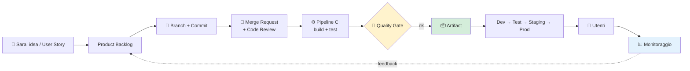

# 16. Glossario

> 📄 **[Scarica questa sezione in PDF](https://darioschioppi.github.io/corso-onboarding-devops/pdf/16-glossario.pdf)** — utile per la stampa o la lettura offline.

Questo glossario raccoglie in un unico posto tutti i termini incontrati nel corso, dai concetti base di informatica fino alla sicurezza e agli ambienti di produzione. Le voci sono in **ordine alfabetico rigoroso** (gli acronimi come CI, CPU o KPI sono ordinati per le lettere dell'acronimo stesso, non per il nome per esteso), così puoi usarlo come un vero dizionario: se leggi un termine che non ricordi mentre studi una sezione, torna qui, cercalo e poi eventualmente segui il rimando "→ approfondito nella sezione X" per tornare al capitolo che lo spiega con esempi e contesto completo.

Non serve leggerlo tutto d'un fiato: è pensato per essere consultato, non studiato in ordine. Buona consultazione.

---

## 🗺️ Mappa dei concetti: come si collegano

Questo glossario ha due viste, da usare per scopi diversi: la mappa qui sotto ti mostra **come i termini si concatenano tra loro**, raggruppati per famiglia tematica, mentre l'elenco alfabetico che segue resta il dizionario da consultare voce per voce quando ti serve una definizione precisa. Le definizioni non si ripetono qui: sotto trovi solo i **collegamenti**.

### Le basi tecniche
Tutto parte dal **Computer**: un insieme di componenti hardware in cui la **CPU** esegue le istruzioni usando la **RAM** come memoria di lavoro temporanea e il **Disco** come memoria permanente, organizzata in cartelle e file grazie al **File System**. Il **Sistema Operativo** fa da intermediario tra questo hardware e i programmi, e ogni programma in esecuzione diventa un **Processo**, a sua volta eventualmente suddiviso in più **Thread** che lavorano in parallelo. Su questa base tecnica gira tutto il resto: dal browser di un cliente di ShopFacile al server che elabora i suoi ordini.

### Come le applicazioni comunicano
Il modello **Client-Server** descrive chi chiede (client) e chi risponde (server); per farlo, i due capi si scambiano dati attraverso una **Rete**, seguendo le regole del **TCP/IP** e, nello specifico del web, del protocollo **HTTP** (o della sua versione cifrata **HTTPS**). Prima ancora di parlarsi, il client deve sapere *dove* si trova il server: è compito del **DNS** tradurre un nome leggibile in un indirizzo. Una volta stabilita la comunicazione, i programmi si scambiano informazioni tramite una **API**, spesso progettata secondo lo stile **REST** e con i dati serializzati in **JSON** (o, più raramente oggi, **XML**).

### Come si struttura un'applicazione
Un'applicazione divide le proprie responsabilità tra **Frontend** (quello che l'utente vede) e **Backend** (la logica e i dati che l'utente non vede); quest'ultimo può essere organizzato come un unico **Monolite** oppure spezzato in **Microservizi** indipendenti che comunicano tra loro, a volte tramite una **Message Queue** invece che con chiamate dirette. Un'alternativa a gestire server propri è il modello **Serverless**, dove il codice viene eseguito solo su richiesta.

### Dove vivono i dati
I dati di ShopFacile si salvano in un **Database relazionale**, interrogabile con **SQL**, oppure in un **Database NoSQL** quando la struttura dei dati è più flessibile o i volumi molto grandi: la scelta tra i due dipende dalla forma dei dati (es. il catalogo prodotti rispetto ai log delle sessioni carrello).

### Come si scrive e si versiona il codice
Tutto il codice vive in un **Repository**, la cui storia è fatta di **Commit** successivi, ciascuno registrato su un **Branch** dedicato per non toccare il codice principale durante lo sviluppo. Quando una modifica è pronta, si apre una **Merge Request**: qui il team fa **Code Review** prima di eseguire il **Merge** che la unisce definitivamente. Un punto del repository può poi essere marcato con un **Tag**, tipicamente per identificare una **Release**, seguendo una convenzione di **Versioning** come il **Semantic Versioning**. Il modo in cui i branch vengono organizzati nel tempo segue un modello come il **Git Flow** oppure, all'opposto, il **Trunk Based Development**; un problema scoperto lungo il percorso viene tracciato come **Issue**.

### Come nasce e cresce un prodotto
Tutto comincia dai **Requisiti (funzionali e non funzionali)** che descrivono cosa deve fare il software: da lì nasce una **User Story** che lo racconta dal punto di vista dell'utente, oppure, se il lavoro è troppo grande per uno sprint, un **Epic** che raggruppa più User Story. Ogni User Story diventa una **Feature** una volta realizzata, oppure genera un **Bug** se qualcosa non funziona come previsto. Tutto questo percorso, dalla richiesta iniziale alla manutenzione, è descritto dal **Ciclo di vita del software**.

### Come si organizza il lavoro
Il **Manifesto Agile** e il **Mindset Agile** superano il **Waterfall** tradizionale con due framework operativi concreti. Nello Scrum, il **Product Owner** cura il **Product Backlog**, da cui il team seleziona in **Sprint Planning** le voci dello **Sprint Backlog** per ogni **Sprint**, sincronizzandosi nel **Daily Scrum** e chiudendo con la **Sprint Review** e la **Sprint Retrospective**; il risultato è un **Increment** che rispetta la **Definition of Done (DoD)** (ed è entrato in sprint solo se soddisfaceva la **Definition of Ready (DoR)**), mentre lo **Scrum Master** facilita tutto questo. Nel Kanban lo stesso lavoro scorre su una **Board Kanban** con il **WIP (Work In Progress)** limitato per colonna, misurato in **Lead Time** e **Cycle Time** (lo **Scrumban** mescola i due mondi); gli **Story Point** e la **Velocity** quantificano la capacità del team di Luca, mentre **KPI**, **Milestone**, **RACI**, **RAID Log**, il **Rischio** e gli **Stakeholder**, insieme a **Burndown Chart** e **Burnup Chart**, tengono sotto controllo l'andamento del progetto nel suo complesso.

### Come il codice arriva agli utenti
Quando una Merge Request supera la Code Review ed entra nel branch principale, un **Trigger** avvia la **Pipeline**: build, test e poi il **Quality Gate**, il controllo automatico che blocca l'avanzamento se la qualità non basta. Se tutto va bene, la pipeline produce un **Artifact (build)** che viene promosso dall'**Ambiente di Sviluppo** all'**Ambiente di Test/QA**, poi allo **Staging** e infine alla **Produzione** tramite il **Deploy/Rilascio**; le pratiche di **CI (Continuous Integration)** e **Continuous Delivery**/**Continuous Deployment** sono ciò che rende questo percorso frequente e automatico invece che manuale e raro. Se qualcosa va storto dopo il rilascio, il **Rollback** riporta rapidamente alla versione precedente.

### Dove gira il software
Un Artifact, per essere eseguito ovunque allo stesso modo, viene spesso pacchettizzato in un **Container** tramite **Docker**, e quando i container sono troppi da gestire a mano entra in gioco **Kubernetes**, che li orchestra automaticamente. Un'alternativa più tradizionale è la **Virtual Machine (VM)**, che simula un intero computer; la capacità di questi ambienti di gestire più carico segue i due modi descritti da **Scalabilità verticale e orizzontale**. Tutto questo gira su infrastrutture cloud offerte secondo tre livelli di responsabilità crescente per il fornitore — **IaaS**, **PaaS** e **SaaS** — quasi sempre pagate a consumo con il modello **Pay-as-you-go**.

### Come si tiene tutto in piedi e sicuro
Una volta in produzione, il **Monitoring** osserva lo stato del sistema e il **Logging** ne registra gli eventi; l'**Observability** va oltre entrambi, aiutando a capire *perché* qualcosa non funziona, non solo *cosa*. Sul fronte sicurezza, l'**Autenticazione** verifica chi sei e l'**Autorizzazione** stabilisce cosa puoi fare, spesso rafforzate da **MFA (autenticazione a più fattori)**; le vulnerabilità più comuni sono catalogate da **OWASP**, mentre il **GDPR** impone regole precise sul trattamento dei dati personali degli utenti di ShopFacile. Il **DevSecOps** integra questi controlli di sicurezza direttamente nella pipeline, invece di lasciarli come verifica finale isolata.

### La cultura che tiene insieme tutto
Il **DevOps** è la cornice culturale che tiene insieme tutti i fili visti sopra: il **CALMS** ne riassume i cinque pilastri, mentre la **Cultura DevOps** descrive concretamente cosa cambia nel modo di lavorare quotidiano di un team come quello di ShopFacile, fino a pratiche come l'**IaC (Infrastructure as Code)** che trattano l'infrastruttura come se fosse codice, versionabile e revisionabile come qualsiasi Merge Request.

### Azure DevOps: stessi concetti, altri nomi
Se lavori con GitLab, **Merge Request**, **Issue** e **Pipeline** sono i nomi che conosci; su Azure DevOps lo stesso lavoro passa attraverso **Repos (Azure DevOps)** (dove la Merge Request si chiama "Pull Request"), **Boards (Azure DevOps)** (dove ogni **Work Item** — una **User Story**, un **Bug** o un **Epic** — avanza su una board) e **Pipelines (Azure DevOps)**. Gli **Artifacts (Azure DevOps)** sono il servizio che conserva i pacchetti software, da non confondere con l'**Artifact (build)** generico prodotto da qualsiasi pipeline; i **Test Plans (Azure DevOps)** infine gestiscono i test manuali ed esplorativi. Conoscere questa corrispondenza ti evita di pensare che siano concetti diversi solo perché cambia lo strumento.

### Il percorso end-to-end in un unico schema

---

### Ambiente di Sviluppo
L'ambiente (development environment) in cui gli sviluppatori scrivono e provano il codice per la prima volta, di solito sul proprio computer o in uno spazio dedicato non visibile agli utenti finali. È il primo "gradino" prima che il codice arrivi al Test/QA, allo Staging e infine alla Produzione. → approfondito nella sezione 15 (Ambienti di sviluppo).

### Ambiente di Test/QA
Un ambiente separato da quello di sviluppo, usato per verificare (Quality Assurance) che una funzionalità funzioni correttamente prima di mostrarla a chiunque altro. Qui si eseguono i test manuali e automatici in condizioni più simili a quelle reali. → approfondito nella sezione 15 (Ambienti di sviluppo). Si collega a: **Ambiente di Sviluppo** (che lo precede) e **Staging** (che ne consegue, prima della Produzione).

### API
Sigla di Application Programming Interface: è un insieme di regole che permette a due programmi di "parlarsi" e scambiarsi informazioni, senza che uno debba conoscere i dettagli interni dell'altro. Pensala come un menu di un ristorante: tu scegli una voce (una richiesta) e la cucina (il sistema) ti restituisce il piatto (la risposta). → approfondito nella sezione 2 (Fondamenti di informatica).

### Artifact (build)
Il "prodotto finito" generato da una pipeline dopo aver compilato e testato il codice: ad esempio un file eseguibile, un pacchetto installabile o un'immagine Docker pronta per essere distribuita. È diverso dagli Artifacts di Azure DevOps, che sono il servizio usato per conservarlo. → approfondito nella sezione 11 (CI/CD). Si collega a: **Pipeline** (che lo produce) e **Deploy/Rilascio** (che lo installa, identico, in ogni ambiente).

### Artifacts (Azure DevOps)
Il servizio di Azure DevOps dedicato a creare, conservare e condividere i pacchetti software (le librerie o i componenti riutilizzabili) usati dai progetti del team. → approfondito nella sezione 10 (Azure DevOps).

### Autenticazione
Il processo con cui un sistema verifica che tu sia davvero chi dici di essere, tipicamente chiedendo username e password (authentication). È il primo passo della sicurezza: prima si verifica l'identità, poi si decide cosa quella identità può fare. → approfondito nella sezione 14 (Sicurezza).

### Autorizzazione
Il processo che stabilisce, dopo che sei stato riconosciuto (autenticazione), a quali risorse puoi accedere e quali azioni puoi compiere (authorization). Esempio: essere autenticati come dipendenti non significa automaticamente poter modificare i dati contabili dell'azienda. → approfondito nella sezione 14 (Sicurezza).

### Backend
La parte "dietro le quinte" di un'applicazione: server, database e logica di business che l'utente non vede direttamente, ma che elabora le richieste e restituisce i risultati al Frontend. → approfondito nella sezione 12 (Architetture software).

### Board Kanban
Una lavagna (fisica o digitale) divisa in colonne — tipicamente "Da fare", "In corso", "Fatto" — che rende visibile lo stato di avanzamento di ogni attività del team con dei cartellini (le card). → approfondito nella sezione 7 (Kanban).

### Boards (Azure DevOps)
Il servizio di Azure DevOps che offre board Kanban, backlog e strumenti per pianificare e monitorare il lavoro del team, gestendo gli Work Item. → approfondito nella sezione 10 (Azure DevOps).

### Branch
Una "linea di sviluppo" separata all'interno di un repository Git, che permette di lavorare su una modifica senza toccare il codice principale finché non è pronta. → approfondito nella sezione 4 (Git e GitLab). Si collega a: **Repository** (che lo contiene) e **Merge Request** (che ne propone l'unione al codice principale).

### Branching
La pratica di creare e gestire più Branch per isolare il lavoro su funzionalità diverse, permettendo a più persone di lavorare in parallelo senza intralciarsi. → approfondito nella sezione 3 (Come nasce un software).

### Bug
Un errore nel software che produce un comportamento diverso da quello previsto: dal termine inglese per "insetto", nato da un aneddoto storico legato a un vero insetto trovato in un computer degli anni '40. → approfondito nella sezione 3 (Come nasce un software).

### Burndown Chart
Un grafico che mostra quanto lavoro **resta** da fare in uno Sprint (o in un progetto) man mano che passano i giorni: la linea idealmente "scende" verso lo zero. → approfondito nella sezione 8 (Project Management).

### Burnup Chart
Un grafico simile al Burndown Chart, ma che mostra il lavoro **già completato** che "sale" verso il totale previsto, rendendo più facile notare se l'ambito del progetto (lo scope) cresce nel tempo. → approfondito nella sezione 8 (Project Management).

### CALMS
Un acronimo (Culture, Automation, Lean, Measurement, Sharing) che riassume i cinque pilastri della cultura DevOps: cultura collaborativa, automazione, approccio lean, misurazione dei risultati e condivisione della conoscenza. → approfondito nella sezione 9 (DevOps).

### CI (Continuous Integration)
La pratica di integrare frequentemente (più volte al giorno) il proprio codice con quello del resto del team, verificando automaticamente con dei test che tutto continui a funzionare insieme. → approfondito nella sezione 9 (DevOps) e nella sezione 11 (CI/CD). Si collega a: **Pipeline** (il meccanismo che la rende concreta) e **Quality Gate** (il controllo che ne verifica l'esito).

### Ciclo di vita del software
L'insieme delle fasi che un software attraversa dalla sua nascita alla sua "pensione": analisi dei requisiti, progettazione, sviluppo, test, rilascio e manutenzione (software development lifecycle). → approfondito nella sezione 3 (Come nasce un software).

### Client-Server
Un modello architetturale in cui un programma "client" (ad esempio il tuo browser) richiede informazioni o servizi a un programma "server", che risponde elaborando la richiesta. → approfondito nella sezione 12 (Architetture software).

### Code Review
La pratica di far leggere e commentare il proprio codice a un collega prima di unirlo al progetto principale, per individuare errori, migliorare la qualità e condividere conoscenza nel team. → approfondito nella sezione 3 (Come nasce un software). Si collega a: **Merge Request** (che la richiede) e **Merge** (l'operazione che la conclude, una volta approvata).

### Commit
Uno "scatto fotografico" delle modifiche fatte al codice in un preciso momento, salvato nella storia del repository con un messaggio che ne descrive il contenuto. → approfondito nella sezione 4 (Git e GitLab). Si collega a: **Branch** (su cui viene registrato) e **Merge Request** (che raccoglie una serie di commit da integrare).

### Computer
Una macchina capace di eseguire istruzioni (programmi) per elaborare dati: è composta da componenti hardware (come CPU e RAM) che collaborano seguendo le indicazioni del software. → approfondito nella sezione 2 (Fondamenti di informatica).

### Container
Un "pacchetto" leggero e isolato che contiene un'applicazione insieme a tutto ciò che le serve per funzionare (librerie, configurazioni), così da poterla eseguire in modo identico su qualsiasi computer. Docker è la tecnologia più usata per crearli. → approfondito nella sezione 2 (Fondamenti di informatica). Si collega a: **Docker** (lo strumento più diffuso per crearli) e **Kubernetes** (che li orchestra su larga scala).

### Continuous Delivery
La pratica che assicura che il software, dopo aver superato tutti i test automatici, sia sempre pronto per essere rilasciato in produzione in qualsiasi momento, anche se il rilascio finale resta una decisione manuale. → approfondito nella sezione 9 (DevOps). Si collega a: **CI (Continuous Integration)** (che la precede nel percorso verso il rilascio) e **Deploy/Rilascio** (l'operazione finale, qui ancora decisa manualmente).

### Continuous Deployment
Un'evoluzione della Continuous Delivery in cui ogni modifica che supera i test viene rilasciata automaticamente in produzione, senza intervento manuale. → approfondito nella sezione 9 (DevOps). Si collega a: **Continuous Delivery** (di cui è l'evoluzione automatica) e **Deploy/Rilascio** (che qui avviene senza intervento umano).

### CPU
Sigla di Central Processing Unit, il "cervello" del computer: il componente che esegue materialmente le istruzioni dei programmi, facendo calcoli a velocità elevatissima. → approfondito nella sezione 2 (Fondamenti di informatica).

### Cultura DevOps
Un modo di lavorare che abbatte le barriere tra chi sviluppa il software (Dev) e chi lo gestisce in produzione (Ops), promuovendo collaborazione, responsabilità condivisa e automazione. → approfondito nella sezione 9 (DevOps).

### Cycle Time
Il tempo che intercorre dal momento in cui il team **inizia effettivamente a lavorare** su un'attività al momento in cui la completa. È una misura più "interna" del Lead Time. → approfondito nella sezione 7 (Kanban).

### Daily Scrum
Un breve incontro quotidiano (di solito 15 minuti) in cui il team Scrum sincronizza il lavoro, condivide progressi e segnala eventuali ostacoli. → approfondito nella sezione 6 (Scrum).

### Database NoSQL
Un database che non organizza i dati in tabelle rigide come quelli relazionali, ma in formati più flessibili (documenti, chiavi-valore, grafi), utile quando i dati cambiano forma spesso o servono grandi volumi. → approfondito nella sezione 2 (Fondamenti di informatica).

### Database relazionale
Un database che organizza i dati in tabelle collegate tra loro tramite relazioni, un po' come fogli Excel che si richiamano a vicenda; si interroga con il linguaggio SQL. → approfondito nella sezione 2 (Fondamenti di informatica).

### Definition of Done (DoD)
L'elenco condiviso di criteri che un'attività deve soddisfare per essere considerata davvero "completata" (ad esempio: codice scritto, testato, revisionato e documentato), evitando ambiguità nel team. → approfondito nella sezione 6 (Scrum).

### Definition of Ready (DoR)
L'elenco di criteri che una User Story deve soddisfare prima di poter essere accettata in uno Sprint (ad esempio: requisiti chiari, stima fatta, dipendenze note). → approfondito nella sezione 6 (Scrum).

### Deploy/Rilascio
L'operazione di rendere disponibile una nuova versione del software agli utenti, spostandola dall'ambiente in cui è stata sviluppata e testata a quello di produzione. → approfondito nella sezione 3 (Come nasce un software). Si collega a: **Artifact (build)** (ciò che viene effettivamente distribuito) e **Rollback** (l'operazione da compiere se il rilascio va male).

### DevOps
La fusione tra "Development" (sviluppo) e "Operations" (gestione dei sistemi): un approccio che unisce persone, processi e strumenti per rilasciare software in modo più rapido, frequente e affidabile. → approfondito nella sezione 9 (DevOps). Si collega a: **CALMS** (che ne riassume i pilastri) e **CI (Continuous Integration)** (una delle pratiche concrete che lo realizzano).

### DevSecOps
Un'estensione del DevOps che integra la sicurezza (Security) in ogni fase del ciclo di vita del software, invece di considerarla solo un controllo finale prima del rilascio. → approfondito nella sezione 14 (Sicurezza).

### Disco
Il componente del computer dove i dati vengono salvati in modo permanente (anche da spento), a differenza della RAM che perde i dati quando il computer si spegne. → approfondito nella sezione 2 (Fondamenti di informatica).

### DNS
Sigla di Domain Name System: il "elenco telefonico" di internet, che traduce nomi di siti facili da ricordare (come esempio.it) negli indirizzi numerici (IP) che i computer usano davvero per comunicare. → approfondito nella sezione 2 (Fondamenti di informatica).

### Docker
Lo strumento più diffuso per creare, eseguire e distribuire Container, cioè applicazioni "pacchettizzate" insieme a tutto ciò che serve loro per funzionare ovunque nello stesso modo. → approfondito nella sezione 2 (Fondamenti di informatica). Si collega a: **Container** (ciò che crea e distribuisce) e **Artifact (build)** (un'immagine Docker è uno dei formati più comuni di artifact).

### Epic
Un'attività molto grande, che raggruppa più User Story o Work Item legati a un unico obiettivo di ampio respiro, troppo estesa per essere completata in un singolo Sprint. → approfondito nella sezione 10 (Azure DevOps).

### Feature
Una funzionalità del software: una caratteristica o capacità concreta che l'utente può usare (ad esempio "possibilità di esportare un report in PDF"). → approfondito nella sezione 3 (Come nasce un software).

### File System
Il modo in cui un sistema operativo organizza e conserva i file su un disco, tramite cartelle e nomi, permettendo di ritrovarli e gestirli facilmente. → approfondito nella sezione 2 (Fondamenti di informatica).

### Frontend
La parte di un'applicazione con cui l'utente interagisce direttamente: l'interfaccia visibile (pagine web, schermate, pulsanti), che comunica con il Backend per mostrare e inviare informazioni. → approfondito nella sezione 12 (Architetture software).

### GDPR
Il Regolamento Generale sulla Protezione dei Dati (General Data Protection Regulation), la legge europea che stabilisce come le aziende devono raccogliere, trattare e proteggere i dati personali delle persone. → approfondito nella sezione 14 (Sicurezza).

### Git Flow
Un modello ben definito di organizzazione dei Branch in Git, con rami dedicati per lo sviluppo, le funzionalità, i rilasci e le correzioni urgenti, utile in progetti con rilasci pianificati e meno frequenti. → approfondito nella sezione 4 (Git e GitLab).

### HTTP
Sigla di HyperText Transfer Protocol: il linguaggio con cui il browser e i siti web si scambiano informazioni su internet, ad esempio quando richiedi una pagina web. → approfondito nella sezione 2 (Fondamenti di informatica).

### HTTPS
La versione sicura e cifrata di HTTP (la "S" sta per Secure), che protegge le informazioni scambiate tra browser e sito web da occhi indiscreti, oggi usata praticamente ovunque. → approfondito nella sezione 2 (Fondamenti di informatica).

### IaaS
Sigla di Infrastructure as a Service: un modello cloud in cui il fornitore ti dà "solo" server, storage e rete virtuali, e sei tu a occuparti di sistema operativo, applicazioni e configurazioni. → approfondito nella sezione 13 (Cloud).

### IaC (Infrastructure as Code)
La pratica di descrivere l'infrastruttura informatica (server, reti, configurazioni) tramite file di testo/codice invece che configurandola manualmente, così da poterla creare, versionare e ripetere in modo automatico e affidabile. → approfondito nella sezione 9 (DevOps).

### Increment
Il risultato concreto e utilizzabile prodotto durante uno Sprint: la somma di tutte le User Story completate, che si aggiunge a quanto già costruito nei Sprint precedenti. → approfondito nella sezione 6 (Scrum).

### Issue
Una "segnalazione" aperta in un repository (su GitLab o Azure DevOps) per tracciare un bug, una richiesta di funzionalità o qualsiasi attività da discutere e risolvere. → approfondito nella sezione 4 (Git e GitLab).

### JSON
Sigla di JavaScript Object Notation: un formato di testo semplice e leggibile usato moltissimo per scambiare dati tra programmi, ad esempio nelle risposte delle API. → approfondito nella sezione 2 (Fondamenti di informatica).

### KPI
Sigla di Key Performance Indicator: un indicatore numerico che misura quanto bene un progetto o un'attività sta raggiungendo i propri obiettivi (ad esempio il tempo medio di risposta a un cliente). → approfondito nella sezione 8 (Project Management).

### Kubernetes
Uno strumento che gestisce automaticamente grandi quantità di Container in produzione: li avvia, li riavvia se si bloccano, li distribuisce su più macchine e ne regola il numero in base al carico. → approfondito nella sezione 2 (Fondamenti di informatica).

### Lead Time
Il tempo totale che intercorre dal momento in cui un'attività viene **richiesta** al momento in cui viene **consegnata**, includendo anche l'attesa prima che il lavoro inizi davvero. → approfondito nella sezione 7 (Kanban).

### Logging
La pratica di registrare in modo continuo gli eventi che accadono in un sistema (errori, richieste, azioni) in file o strumenti dedicati, utile per capire cosa è successo quando qualcosa va storto. → approfondito nella sezione 9 (DevOps).

### Manifesto Agile
Il documento pubblicato nel 2001 da un gruppo di sviluppatori che definisce i valori e i principi alla base dell'approccio Agile, come privilegiare le persone e la collaborazione rispetto a processi rigidi e documentazione eccessiva. → approfondito nella sezione 5 (Agile).

### Merge
L'operazione con cui le modifiche fatte su un Branch vengono riunite (unite) al codice principale o a un altro branch. → approfondito nella sezione 3 (Come nasce un software).

### Merge Request
Una richiesta formale di unire le proprie modifiche di codice (spesso su un Branch) al codice principale, che di solito viene prima discussa e revisionata dal team (Code Review) prima di essere accettata. Su Azure DevOps lo stesso concetto si chiama "Pull Request" (abbreviata PR). → approfondito nella sezione 3 (Come nasce un software). Si collega a: **Branch** (che la genera) e **Code Review** (che ne consegue, prima dell'approvazione).

### Message Queue
Un sistema che permette a diverse parti di un'applicazione di scambiarsi messaggi senza dover comunicare direttamente e nello stesso istante: un componente "deposita" un messaggio in una coda e un altro lo legge quando è pronto. → approfondito nella sezione 12 (Architetture software).

### MFA (autenticazione a più fattori)
Un metodo di sicurezza che richiede più di una prova d'identità per accedere a un sistema (ad esempio password più codice ricevuto sul telefono), rendendo molto più difficile un accesso non autorizzato anche se la password viene scoperta. → approfondito nella sezione 14 (Sicurezza).

### Microservizi
Un'architettura software in cui un'applicazione è divisa in tanti piccoli servizi indipendenti, ciascuno responsabile di una funzione specifica, che comunicano tra loro (spesso via API), invece di essere un unico grande blocco di codice. → approfondito nella sezione 12 (Architetture software).

### Milestone
Un punto di controllo significativo in un progetto, che segna il completamento di una fase importante o il raggiungimento di un obiettivo intermedio. → approfondito nella sezione 8 (Project Management).

### Mindset Agile
L'atteggiamento mentale alla base di Agile: adattarsi al cambiamento, imparare dagli errori, collaborare con il cliente e migliorare continuamente, più che l'applicazione meccanica di regole e strumenti. → approfondito nella sezione 5 (Agile).

### Monitoring
L'attività di osservare costantemente lo stato di un sistema (uso della CPU, tempi di risposta, errori) per accorgersi rapidamente se qualcosa non funziona come dovrebbe. → approfondito nella sezione 9 (DevOps).

### Monolite
Un'architettura software in cui tutta l'applicazione è costruita come un unico grande blocco di codice, con tutte le funzionalità interdipendenti tra loro, contrapposta ai Microservizi. → approfondito nella sezione 12 (Architetture software).

### Observability
La capacità di capire **cosa sta succedendo dentro** un sistema complesso osservandolo dall'esterno, combinando log, metriche e tracce; va oltre il semplice Monitoring perché aiuta a capire anche il "perché" di un problema, non solo il "cosa". → approfondito nella sezione 9 (DevOps).

### OWASP
Sigla di Open Web Application Security Project: un'organizzazione che pubblica risorse gratuite (come la celebre lista "OWASP Top 10") sulle vulnerabilità di sicurezza più comuni nelle applicazioni web. → approfondito nella sezione 14 (Sicurezza).

### PaaS
Sigla di Platform as a Service: un modello cloud in cui il fornitore gestisce anche il sistema operativo e gli strumenti di base, lasciandoti concentrare solo sullo sviluppo e sulla gestione della tua applicazione. → approfondito nella sezione 13 (Cloud).

### Pay-as-you-go
Un modello di costo cloud in cui paghi solo per le risorse effettivamente usate (come una bolletta elettrica), invece di acquistare in anticipo hardware costoso che magari resterà sottoutilizzato. → approfondito nella sezione 13 (Cloud).

### Pipeline
Una sequenza automatizzata di passaggi (compilare, testare, rilasciare) che il codice attraversa dal momento in cui viene scritto a quando arriva agli utenti, senza interventi manuali ripetitivi. → approfondito nella sezione 11 (CI/CD). Si collega a: **Trigger** (l'evento che ne fa scattare l'avvio) e **Artifact (build)** (il prodotto finale che genera).

### Pipeline as Code
La pratica di definire i passaggi di una pipeline in un file di testo versionato insieme al codice, invece che configurarla a mano tramite un'interfaccia grafica, così da poterla tracciare e riutilizzare facilmente. → approfondito nella sezione 11 (CI/CD).

### Pipelines (Azure DevOps)
Il servizio di Azure DevOps che permette di creare pipeline di Continuous Integration e Continuous Delivery per compilare, testare e rilasciare automaticamente le applicazioni. → approfondito nella sezione 10 (Azure DevOps).

### Processo
Un programma in esecuzione sul computer, con la propria area di memoria dedicata: quando apri un'applicazione, il sistema operativo crea un processo per farla funzionare. → approfondito nella sezione 2 (Fondamenti di informatica).

### Product Backlog
L'elenco ordinato di tutto ciò che potrebbe essere fatto su un prodotto: funzionalità, correzioni, miglioramenti. È gestito dal Product Owner e cambia continuamente in base alle priorità. → approfondito nella sezione 6 (Scrum). Si collega a: **Product Owner** (che lo gestisce) e **Sprint Backlog** (il sottoinsieme selezionato per lo sprint corrente).

### Product Owner
La persona responsabile di definire cosa deve essere costruito e in quale ordine di priorità, rappresentando la voce del cliente e degli utenti all'interno del team Scrum. → approfondito nella sezione 6 (Scrum).

### Produzione
L'ambiente "vero", quello effettivamente usato dagli utenti finali del software; è l'ultimo gradino dopo Sviluppo, Test/QA e Staging, e qui gli errori hanno un impatto reale. → approfondito nella sezione 15 (Ambienti di sviluppo).

### Quality Gate
Un controllo automatico inserito in una pipeline che blocca l'avanzamento del rilascio se certi criteri di qualità non sono soddisfatti (ad esempio troppi errori nei test o problemi di sicurezza rilevati). → approfondito nella sezione 11 (CI/CD). Si collega a: **CI (Continuous Integration)** (di cui è parte integrante) e **Artifact (build)** (che viene generato solo se il gate viene superato).

### RACI
Una matrice usata in Project Management per chiarire i ruoli in un'attività: chi è Responsible (la esegue), chi è Accountable (ne risponde), chi va Consultato e chi va solo Informato. → approfondito nella sezione 8 (Project Management).

### RAID Log
Un registro che il project manager tiene per tracciare Risks (rischi), Assumptions (assunzioni), Issues (problemi) e Dependencies (dipendenze) di un progetto, per avere sempre sotto controllo i punti critici. → approfondito nella sezione 8 (Project Management).

### RAM
Sigla di Random Access Memory: la memoria "di lavoro" del computer, veloce ma temporanea, che perde i dati quando il computer viene spento — a differenza del Disco. → approfondito nella sezione 2 (Fondamenti di informatica).

### Release
Una versione del software resa disponibile agli utenti, spesso accompagnata da un elenco delle novità e delle correzioni incluse rispetto alla versione precedente. → approfondito nella sezione 4 (Git e GitLab).

### Repos (Azure DevOps)
Il servizio di Azure DevOps che ospita i repository Git del progetto, permettendo al team di gestire il codice, i Branch e le Pull Request (l'equivalente della Merge Request di GitLab). → approfondito nella sezione 10 (Azure DevOps).

### Repository
Lo "spazio" (cartella speciale) dove Git conserva tutto il codice di un progetto insieme alla sua intera storia di modifiche (Commit). → approfondito nella sezione 4 (Git e GitLab). Si collega a: **Commit** (che ne costituisce la storia) e **Branch** (che ne organizza lo sviluppo in parallelo).

### Requisiti (funzionali e non funzionali)
Le caratteristiche che un software deve avere: i requisiti funzionali descrivono **cosa** il sistema deve fare (es. "l'utente può resettare la password"), quelli non funzionali descrivono **come** deve farlo (es. velocità, sicurezza, disponibilità). → approfondito nella sezione 3 (Come nasce un software).

### REST
Uno stile molto diffuso per progettare API web, basato su regole semplici e standard (come l'uso di HTTP) che rendono i servizi facili da capire, usare e collegare tra loro. → approfondito nella sezione 2 (Fondamenti di informatica).

### Rete
Un insieme di computer e dispositivi collegati tra loro per scambiarsi dati e comunicare, dalla piccola rete di un ufficio fino a internet, la rete di reti più grande al mondo. → approfondito nella sezione 2 (Fondamenti di informatica).

### Rischio
Un evento incerto che, se si verifica, può avere un impatto positivo o (più spesso) negativo su un progetto; identificarlo e pianificarne la gestione è uno dei compiti principali del project manager. → approfondito nella sezione 8 (Project Management).

### Rollback
L'operazione di tornare indietro a una versione precedente e funzionante del software dopo che un rilascio ha causato problemi in produzione. → approfondito nella sezione 11 (CI/CD). Si collega a: **Deploy/Rilascio** (l'operazione precedente, che a volte va corretta) e **Monitoring** (che ne segnala spesso la necessità).

### SaaS
Sigla di Software as a Service: un modello cloud in cui usi direttamente un'applicazione già pronta tramite browser (come una webmail), senza doverti preoccupare di server, installazioni o aggiornamenti. → approfondito nella sezione 13 (Cloud).

### Scalabilità verticale e orizzontale
La capacità di un sistema di gestire più carico di lavoro: la scalabilità verticale significa potenziare la singola macchina (più CPU, più RAM), quella orizzontale significa aggiungere più macchine che si dividono il lavoro. → approfondito nella sezione 13 (Cloud).

### Scrum Master
La persona che facilita l'applicazione di Scrum nel team, rimuove gli ostacoli che intralciano il lavoro e protegge il team da interferenze esterne, senza dare ordini diretti su cosa fare. → approfondito nella sezione 6 (Scrum).

### Scrumban
Un approccio ibrido che combina elementi di Scrum (come i ruoli e le cerimonie) con elementi di Kanban (come il flusso continuo e i limiti di WIP), utile per team che vogliono più struttura di Kanban ma più flessibilità di Scrum. → approfondito nella sezione 7 (Kanban).

### Semantic Versioning
Una convenzione per numerare le versioni del software nel formato MAJOR.MINOR.PATCH (es. 2.4.1), dove ogni numero comunica il tipo di cambiamento avvenuto rispetto alla versione precedente. → approfondito nella sezione 3 (Come nasce un software).

### Serverless
Un modello cloud in cui scrivi solo il codice della funzione che ti serve e il fornitore si occupa di tutto il resto (server, scalabilità, manutenzione), facendoti pagare solo per l'effettivo utilizzo. → approfondito nella sezione 12 (Architetture software).

### Sistema Operativo
Il software di base che gestisce le risorse del computer (CPU, RAM, Disco) e permette a te e alle altre applicazioni di usarle, facendo da intermediario tra hardware e programmi. Esempi: Windows, macOS, Linux. → approfondito nella sezione 2 (Fondamenti di informatica).

### Sprint
Un periodo di tempo fisso e breve (di solito 1-4 settimane) durante il quale il team Scrum lavora per completare un insieme di attività scelte dal Product Backlog, prodotto poi come Increment. → approfondito nella sezione 6 (Scrum). Si collega a: **Product Backlog** (da cui trae le attività) e **Increment** (il risultato concreto che produce).

### Sprint Backlog
L'elenco delle attività selezionate dal Product Backlog che il team si impegna a completare durante lo Sprint corrente. → approfondito nella sezione 6 (Scrum).

### Sprint Planning
L'incontro all'inizio di ogni Sprint in cui il team decide cosa realizzare, selezionando le voci dal Product Backlog e definendo come portarle a termine. → approfondito nella sezione 6 (Scrum).

### Sprint Retrospective
L'incontro alla fine di ogni Sprint in cui il team riflette su come ha lavorato (non su cosa ha costruito) per individuare cosa migliorare nel prossimo Sprint. → approfondito nella sezione 6 (Scrum).

### Sprint Review
L'incontro alla fine di ogni Sprint in cui il team mostra agli stakeholder ciò che ha completato, raccogliendo feedback utile per i prossimi passi. → approfondito nella sezione 6 (Scrum).

### SQL
Sigla di Structured Query Language: il linguaggio usato per "interrogare" un Database relazionale, ad esempio per chiedere, aggiungere o modificare dati nelle tabelle. → approfondito nella sezione 2 (Fondamenti di informatica).

### Staging
Un ambiente che replica il più possibile le condizioni reali della Produzione, usato come ultima verifica prima del rilascio definitivo agli utenti. → approfondito nella sezione 15 (Ambienti di sviluppo).

### Stakeholder
Qualsiasi persona o gruppo che ha un interesse nel progetto o ne è influenzato: può essere un cliente, un utente finale, un manager o un membro del team. → approfondito nella sezione 8 (Project Management).

### Story Point
Un'unità di misura relativa (non temporale) usata per stimare quanto sia complessa una User Story rispetto alle altre, tenendo conto di difficoltà, incertezza e quantità di lavoro. → approfondito nella sezione 6 (Scrum).

### Tag
Un'etichetta che Git può assegnare a un Commit specifico, tipicamente per marcare un punto importante come una Release (es. "v2.4.1"). → approfondito nella sezione 4 (Git e GitLab).

### TCP/IP
La famiglia di regole (protocolli) che permette ai computer di tutto il mondo di scambiarsi dati su internet in modo ordinato e affidabile, anche passando per reti diverse. → approfondito nella sezione 2 (Fondamenti di informatica).

### Test Plans (Azure DevOps)
Il servizio di Azure DevOps dedicato a pianificare, organizzare ed eseguire i test manuali ed esplorativi su un'applicazione. → approfondito nella sezione 10 (Azure DevOps).

### Thread
Una "sotto-unità" di un Processo che può eseguire istruzioni in modo indipendente; più thread nello stesso processo permettono a un programma di fare più cose contemporaneamente in modo più efficiente. → approfondito nella sezione 2 (Fondamenti di informatica).

### Trigger
L'evento che fa scattare automaticamente l'avvio di una Pipeline, ad esempio un nuovo Commit su un branch o l'apertura di una Merge Request. → approfondito nella sezione 11 (CI/CD).

### Trunk Based Development
Una pratica in cui tutti gli sviluppatori integrano il proprio codice molto frequentemente su un unico ramo principale (il "trunk"), evitando Branch di lunga durata e favorendo una forte automazione dei test. → approfondito nella sezione 4 (Git e GitLab).

### User Story
Una breve descrizione di una funzionalità scritta dal punto di vista dell'utente, spesso nel formato "Come [ruolo], voglio [obiettivo], per [beneficio]", usata per catturare i requisiti in modo semplice e centrato sulle persone. → approfondito nella sezione 6 (Scrum). Si collega a: **Requisiti (funzionali e non funzionali)** (da cui spesso nasce) e **Product Backlog** (dove viene inserita in attesa di essere pianificata).

### Velocity
La quantità media di Story Point che un team Scrum riesce a completare in uno Sprint, misurata negli Sprint passati e usata per stimare quanto lavoro pianificare in futuro. → approfondito nella sezione 6 (Scrum).

### Versioning
La pratica di assegnare un numero o un'etichetta univoca a ogni versione del software, per poter distinguere, confrontare e tornare a versioni precedenti quando necessario. → approfondito nella sezione 3 (Come nasce un software).

### Virtual Machine (VM)
Un "computer dentro il computer": un ambiente simulato dal software che si comporta come una macchina indipendente, con proprio sistema operativo, pur condividendo l'hardware fisico con altre VM. → approfondito nella sezione 2 (Fondamenti di informatica).

### Waterfall
Un approccio tradizionale alla gestione dei progetti in cui le fasi (analisi, progettazione, sviluppo, test, rilascio) si susseguono in modo lineare e sequenziale, una dopo l'altra, a differenza dell'iteratività di Agile. → approfondito nella sezione 5 (Agile).

### WIP (Work In Progress)
Il numero di attività che sono attualmente "in corso" in una Board Kanban; limitare il WIP (fissando un tetto massimo per colonna) aiuta il team a concentrarsi e a completare il lavoro più rapidamente invece di iniziarne troppo in parallelo. → approfondito nella sezione 7 (Kanban).

### Work Item
L'unità base di lavoro tracciata in Azure DevOps Boards: può essere una User Story, un Bug, un'attività (Task) o un Epic, a seconda del tipo. → approfondito nella sezione 10 (Azure DevOps).

### XML
Sigla di eXtensible Markup Language: un formato di testo, più "verboso" di JSON, usato per organizzare e scambiare dati tramite tag simili a quelli dell'HTML. → approfondito nella sezione 2 (Fondamenti di informatica).

---

## 🔗 Collegamenti

- [17. Piano di studio](../17-piano-di-studio/README.md) — un percorso suggerito per ripassare tutti questi concetti in modo organico

## 📚 Risorse

- [Glossario Agile Alliance](https://www.agilealliance.org/agile101/agile-glossary/) — glossario dei termini Agile e Scrum (in inglese)
- [Microsoft Learn — Glossario Azure](https://learn.microsoft.com/it-it/azure/architecture/glossary) — terminologia cloud e DevOps
- [Wikipedia — Glossario di informatica](https://it.wikipedia.org/wiki/Categoria:Terminologia_informatica) — per approfondire i termini di base
