# 17. Piano di studio

> 📄 **[Scarica questa sezione in PDF](https://darioschioppi.github.io/corso-onboarding-devops/pdf/17-piano-di-studio.pdf)** — utile per la stampa o la lettura offline.

Le sezioni da 1 a 15 di questo corso contengono tutto il materiale teorico e pratico che ti serve. Questa sezione risponde a una domanda diversa e molto concreta: **in che ordine e con quale ritmo studiarlo, in 2-3 mesi, mentre affianchi la tua collega Scrum Master/PM sul progetto?**

Il piano che segue copre **8 settimane**. Non è un vincolo rigido: è una traccia pensata per darti un ritmo sostenibile, evitare di sentirti sopraffatto dalla quantità di argomenti nuovi (specialmente nelle prime due settimane, le più dense dal punto di vista tecnico) e assicurarti che, settimana dopo settimana, tu costruisca le competenze nell'ordine in cui ti serviranno davvero sul campo.

## Come usare questo piano

- **È un percorso, non una gara.** Le ore indicate per ogni settimana (in media 6-10 ore) sono una stima per un neolaureato senza background informatico che studia part-time, in parallelo all'affiancamento quotidiano sul progetto. Se una settimana ti serve più tempo — è normalissimo, soprattutto per le sezioni 2 e 9, che sono le più dense — **rallenta**. È molto meglio arrivare alla settimana 8 con basi solide che aver "letto tutto" senza averlo capito.
- **Le settimane si possono spostare, non solo comprimere.** Se il progetto ti mette in un contesto reale prima del previsto (es. partecipi a un Sprint Planning già alla settimana 2), va benissimo anticipare la lettura della sezione corrispondente: il piano è una guida, il contesto reale è il miglior maestro che hai.
- **Il check-in con la tua collega è la parte più importante del piano**, non un'aggiunta facoltativa. Ogni settimana prevede almeno un momento di confronto (15-30 minuti bastano) in cui le racconti cosa hai capito, le fai le domande che ti sono rimaste in sospeso e — soprattutto — collega la teoria che hai letto a un esempio concreto del progetto ("quello che ho letto sulle user story, corrisponde a come scriviamo le card sul backlog?"). Senza questo passaggio, il rischio è restare con una conoscenza da manuale che non si aggancia mai alla pratica quotidiana.
- **Gli esercizi pratici non sono opzionali.** Leggere una sezione ti dà il vocabolario; l'esercizio è quello che lo trasforma in competenza. Se salti gli esercizi per fare prima, arriverai alla fine del percorso con parole difficili ma poca sicurezza nell'usarle.
- **Il Glossario (sezione 16) è il tuo compagno silenzioso per tutte le 8 settimane.** Ogni volta che incontri un termine che non ricordi — anche uno già visto — torna lì. Non è un segno di scarsa preparazione: è esattamente lo scopo per cui esiste.
- **Non aspettarti di "sapere tutto" alla settimana 8.** L'obiettivo del piano è darti l'autonomia per affiancare e poi sostituire la tua collega con sicurezza sulle basi, non farti diventare un esperto DevOps in due mesi. Il resto lo imparerai sul campo, con la sezione 19 (Risorse online) e la sezione 18 (Libri consigliati) a disposizione per gli approfondimenti che vorrai fare più avanti.

---

## Vista d'insieme del percorso

```mermaid
gantt
    title Piano di studio — 8 settimane di onboarding
    dateFormat  X
    axisFormat  Sett. %d

    section Fondamenta
    Introduzione + Fondamenti informatica :s1, 0, 1w
    Come nasce un software + Git/GitLab   :s2, after s1, 1w

    section Modo di lavorare del team
    Agile + Scrum                          :s3, after s2, 1w
    Kanban + Project Management            :s4, after s3, 1w

    section Piattaforma DevOps
    DevOps (cultura, CI/CD, IaC, monitoring) :s5, after s4, 1w
    Azure DevOps + CI/CD in dettaglio        :s6, after s5, 1w

    section Contesto tecnico e trasversale
    Architetture + Cloud + Sicurezza + Ambienti :s7, after s6, 1w

    section Consolidamento
    Ripasso generale + libri + risorse + autovalutazione :s8, after s7, 1w
```

Il percorso segue una logica a blocchi progressivi: prima il **linguaggio di base** del software (settimane 1-2), poi **il modo in cui il team si organizza** per lavorare (settimane 3-4), poi **gli strumenti e i processi specifici** della piattaforma DevOps che gestirai (settimane 5-6), poi il **contesto tecnico e trasversale** che ti serve per capire le decisioni del team (settimana 7), e infine un momento di **consolidamento** (settimana 8) prima di sentirti pronto/a a camminare sempre più da solo/a.

---

## Settimana 1 — Le fondamenta: come funziona un computer, come nasce un software

| | |
|---|---|
| **Argomenti** | [Sezione 1 — Introduzione](../01-introduzione/README.md) · [Sezione 2 — Fondamenti di informatica](../02-fondamenti-informatica/README.md) |
| **Tempo stimato** | 8-10 ore (la sezione 2 è la più densa dell'intero corso: CPU, RAM, rete, database, container, Docker, Kubernetes — non sentirti in colpa se ti serve più tempo) |

**Esercizi pratici**

1. Fatti installare (o installa da solo/a, se hai i permessi) Docker Desktop sul tuo computer e prova a lanciare un container di esempio (es. `docker run hello-world`), anche senza capire ogni dettaglio: l'obiettivo è vedere con i tuoi occhi cos'è un container prima di studiarlo in teoria.
2. Chiedi a un collega developer di mostrarti, per 15 minuti, come si collegano tra loro un'applicazione, un database e un server nel progetto (anche solo a parole, con un disegno su una lavagna o su un foglio): non serve capire il codice, serve vedere la "geografia" del sistema.
3. Disegna a mano (anche su carta) uno schizzo con client, server, database e rete, usando le tue parole per etichettare ogni pezzo.

**Obiettivi di apprendimento**

Al termine della settimana devi saper spiegare a parole tue, senza usare il manuale:

- cosa fanno CPU e RAM e perché sono diverse;
- cos'è un indirizzo IP e a cosa serve una rete;
- cos'è un database e perché serve rispetto a "un file con dentro i dati";
- cos'è un container e in cosa differisce da una macchina virtuale;
- a cosa serve, in generale, Kubernetes (senza ancora sapere usarlo).

**Verifica finale della settimana**

Sai spiegare a un amico non tecnico, in meno di due minuti, la differenza tra un container e una macchina virtuale, usando un'analogia (ad esempio quella degli appartamenti in un condominio vista nella sezione 2)?

---

## Settimana 2 — Come nasce un software e il controllo di versione con Git

| | |
|---|---|
| **Argomenti** | [Sezione 3 — Come nasce un software](../03-come-nasce-un-software/README.md) · [Sezione 4 — Git e GitLab](../04-git-e-gitlab/README.md) |
| **Tempo stimato** | 7-9 ore (la sezione 4 richiede pratica al computer, non solo lettura) |

**Esercizi pratici**

1. Crea un account GitLab (se non lo hai già) e crea un repository di prova personale, anche vuoto.
2. Clona un repository di esempio (puoi usare uno dei tuoi o uno pubblico semplice) sul tuo computer con `git clone`.
3. Crea un nuovo branch, modifica un file (anche solo il README), fai un commit e apri una **merge request fittizia** verso il branch principale del tuo repository di prova.
4. Chiedi a un developer del team di farti vedere, sullo schermo, una vera merge request aperta sul progetto: osserva come è strutturata la descrizione, chi la revisiona, quali commenti riceve.
5. Prova a spiegare a voce, senza guardare gli appunti, cosa succede "dietro le quinte" quando fai un commit.

**Obiettivi di apprendimento**

Al termine della settimana devi saper:

- descrivere le fasi principali del ciclo di vita di un software (analisi, progettazione, sviluppo, test, rilascio, manutenzione);
- distinguere un bug da una richiesta di nuova funzionalità;
- spiegare cosa sono repository, commit, branch e merge request;
- distinguere concettualmente Git Flow e Trunk Based Development (anche solo a grandi linee, senza padroneggiarli).

**Verifica finale della settimana**

Sai disegnare su un foglio il percorso di una modifica al codice, dal branch alla merge request fino al merge sul branch principale, spiegando ogni passaggio?

---

## Settimana 3 — Agile e Scrum: il mindset e il framework che il team usa ogni giorno

| | |
|---|---|
| **Argomenti** | [Sezione 5 — Agile](../05-agile/README.md) · [Sezione 6 — Scrum](../06-scrum/README.md) |
| **Tempo stimato** | 8-10 ore (la sezione 6 è la più importante del corso per il tuo ruolo: prendila con calma) |

**Esercizi pratici**

1. Partecipa come **osservatore** a uno Sprint Planning e a una Daily Scrum del team, senza intervenire: prendi appunti su chi parla, cosa viene deciso, quanto dura ogni evento rispetto a quanto previsto dalla teoria.
2. Scrivi 3 user story per una feature immaginaria (ad esempio "un'app per prenotare una sala riunioni"), seguendo il formato "Come [utente], voglio [obiettivo], così che [beneficio]", con relativi criteri di accettazione.
3. Prova a stimare le 3 user story che hai scritto con la scala di Story Point di Fibonacci (1, 2, 3, 5, 8...), motivando a voce alta perché hai scelto quel valore.
4. Confronta con la tua collega la Definition of Ready e la Definition of Done reali del progetto: sono scritte da qualche parte? Coincidono con quello che hai letto in teoria?

**Obiettivi di apprendimento**

Al termine della settimana devi saper:

- riassumere i 4 valori e i 12 principi del Manifesto Agile con parole tue;
- elencare e descrivere i tre ruoli di Scrum (Product Owner, Scrum Master, Team di sviluppo);
- descrivere i cinque eventi di Scrum (Sprint, Sprint Planning, Daily Scrum, Sprint Review, Sprint Retrospective) con durata e obiettivo di ciascuno;
- distinguere i tre artefatti (Product Backlog, Sprint Backlog, Increment);
- scrivere una user story ben formata e spiegare a cosa servono Story Point e Definition of Ready/Done.

**Verifica finale della settimana**

Sai spiegare, senza guardare gli appunti, a cosa serve ciascuno dei cinque eventi di Scrum e cosa succederebbe al team se uno di essi venisse eliminato?

---

## Settimana 4 — Kanban e Project Management: un altro modo di visualizzare il lavoro, e come si tiene sotto controllo un progetto

| | |
|---|---|
| **Argomenti** | [Sezione 7 — Kanban](../07-kanban/README.md) · [Sezione 8 — Project Management](../08-project-management/README.md) |
| **Tempo stimato** | 6-8 ore |

**Esercizi pratici**

1. Osserva la board del team (Kanban o Scrum board che sia) e identifica le colonne, i limiti di WIP (Work In Progress) se presenti, e chiedi a un collega di spiegarti come si sposta una card da una colonna all'altra.
2. Crea, anche solo su carta o con un tool gratuito online, una board Kanban di prova con 5 card immaginarie e sposta manualmente una card lungo le colonne, calcolando a mano un ipotetico lead time e cycle time.
3. Costruisci una tabella RACI di esempio (anche minimale, 4-5 righe) per un piccolo progetto immaginario, assegnando ruoli Responsible, Accountable, Consulted, Informed.
4. Chiedi alla tua collega di farti vedere un report o una dashboard reale del progetto (burndown, RAID log, o simili) e provate insieme a leggerla.

**Obiettivi di apprendimento**

Al termine della settimana devi saper:

- descrivere la struttura di una board Kanban e a cosa serve il limite di WIP;
- distinguere lead time e cycle time;
- spiegare cos'è un RAID log e a cosa serve una matrice RACI;
- descrivere almeno due KPI tipici di un progetto software e leggere un report/dashboard di base.

**Verifica finale della settimana**

Sai spiegare a parole tue la differenza tra Sprint (Scrum) e flusso continuo (Kanban)? In quale scenario useresti l'uno o l'altro?

---

## Settimana 5 — DevOps: la cultura e i concetti che uniscono sviluppo e operations

| | |
|---|---|
| **Argomenti** | [Sezione 9 — DevOps](../09-devops/README.md) |
| **Tempo stimato** | 8-10 ore (sezione densa e centrale: cultura, CI/CD concettuale, Infrastructure as Code, monitoring/observability — vale la pena dedicarle un'intera settimana da sola) |

**Esercizi pratici**

1. Chiedi a un membro del team (developer o operations) di raccontarti, con parole semplici, un episodio concreto in cui l'automazione (una pipeline, un test automatico) ha evitato un problema in produzione: raccogli l'aneddoto, aiuta più di dieci definizioni.
2. Osserva, anche solo guardando lo schermo di un collega, una dashboard di monitoring reale del progetto: prova a distinguere cosa mostra il "monitoring" (è tutto ok?) da cosa servirebbe per fare "observability" (perché non va?).
3. Scrivi in 5 righe, con parole tue, cosa significa "you build it, you run it" e perché cambia il modo in cui un team lavora rispetto al modello tradizionale sviluppo/operations separati.
4. Prova a spiegare il modello CALMS (Culture, Automation, Lean, Measurement, Sharing) usando un esempio del progetto per ciascuna delle 5 lettere.

**Obiettivi di apprendimento**

Al termine della settimana devi saper:

- spiegare cos'è la cultura DevOps e perché nasce come risposta al conflitto storico tra Dev e Ops;
- descrivere il modello CALMS;
- distinguere concettualmente Continuous Integration, Continuous Delivery e Continuous Deployment;
- spiegare cos'è l'Infrastructure as Code e perché è utile;
- distinguere monitoring, observability e logging.

**Verifica finale della settimana**

Sai spiegare a parole tue la differenza tra Continuous Delivery e Continuous Deployment, indicando esattamente dove sta il confine tra i due?

---

## Settimana 6 — Azure DevOps e CI/CD in dettaglio: dalla teoria alla pipeline reale

| | |
|---|---|
| **Argomenti** | [Sezione 10 — Azure DevOps](../10-azure-devops/README.md) · [Sezione 11 — CI/CD](../11-ci-cd/README.md) |
| **Tempo stimato** | 8-10 ore |

**Esercizi pratici**

1. Fatti fare un tour guidato (30-45 minuti) di Azure DevOps sul progetto reale da un collega: Boards, Repos, Pipelines, Test Plans, Artifacts — anche solo "a vista", senza toccare nulla la prima volta.
2. Osserva una pipeline CI/CD reale del progetto in esecuzione (o la sua ultima esecuzione registrata) e **disegna uno schema** di come funziona: trigger, fasi (build, test, deploy), ambienti coinvolti, eventuali quality gate.
3. Trova nel progetto un file di pipeline YAML (o fattelo mostrare) e prova a identificare, senza capire ogni riga, dove sono definiti trigger, stage e job.
4. Chiedi cosa succede quando una pipeline "si rompe" (fallisce un quality gate, un test): chi viene notificato, cosa succede al rilascio.

**Obiettivi di apprendimento**

Al termine della settimana devi saper:

- descrivere i cinque servizi principali di Azure DevOps e a cosa serve ciascuno;
- descrivere le fasi tipiche di una pipeline CI/CD (checkout, build, test, pubblicazione artifact, deploy);
- spiegare cosa fa scattare (trigger) una pipeline;
- spiegare cos'è un quality gate e perché può bloccare un rilascio;
- leggere, a grandi linee, la struttura di un file YAML di pipeline.

**Verifica finale della settimana**

Sai descrivere le fasi di una pipeline CI/CD del progetto, dal commit del developer fino al rilascio, indicando dove potrebbe fermarsi se qualcosa va storto?

---

## Settimana 7 — Il contesto tecnico e trasversale: architetture, cloud, sicurezza, ambienti

| | |
|---|---|
| **Argomenti** | [Sezione 12 — Architetture software](../12-architetture-software/README.md) · [Sezione 13 — Cloud](../13-cloud/README.md) · [Sezione 14 — Sicurezza](../14-sicurezza/README.md) · [Sezione 15 — Ambienti di sviluppo](../15-ambienti-di-sviluppo/README.md) |
| **Tempo stimato** | 8-10 ore (quattro sezioni più brevi, ma trasversali: prova a leggerle collegandole sempre al progetto reale) |

**Esercizi pratici**

1. Fatti spiegare da un developer se l'architettura del progetto è più vicina a un monolite o a dei microservizi, e chiedi un esempio concreto di come frontend e backend comunicano.
2. Individua, con l'aiuto di un collega, quale provider cloud usa il progetto (Azure, AWS o altro) e quali servizi principali (IaaS, PaaS, SaaS) sono in uso — anche solo i nomi, senza approfondire ogni dettaglio tecnico.
3. Chiedi come funzionano autenticazione e autorizzazione nell'applicazione del progetto (login, ruoli, permessi) e prova a mappare i concetti visti nella sezione 14 su questo esempio reale.
4. Ricostruisci, con l'aiuto della tua collega, la sequenza reale degli ambienti del progetto (Dev, Test, Staging, Prod o equivalenti) e chi/cosa decide quando il codice passa da uno all'altro.

**Obiettivi di apprendimento**

Al termine della settimana devi saper:

- distinguere monolite e microservizi, e frontend e backend;
- distinguere IaaS, PaaS e SaaS con un esempio ciascuno;
- spiegare la differenza tra autenticazione e autorizzazione, e cos'è il DevSecOps;
- descrivere a cosa serve ciascun ambiente (Dev, Test, Staging, Prod) nella catena di rilascio del progetto.

**Verifica finale della settimana**

Sai spiegare, usando il progetto come esempio, perché il codice passa attraverso più ambienti prima di arrivare in produzione, e cosa si rischierebbe saltando uno di questi passaggi?

---

## Settimana 8 — Consolidamento: ripasso generale, autovalutazione e prossimi passi

| | |
|---|---|
| **Argomenti** | Ripasso trasversale delle sezioni 1-15, con il supporto di [Sezione 16 — Glossario](../16-glossario/README.md) · [Sezione 18 — Libri consigliati](../18-libri-consigliati/README.md) · [Sezione 19 — Risorse online](../19-risorse-online/README.md) |
| **Tempo stimato** | 6-8 ore, distribuite tra ripasso e un colloquio conclusivo con la tua collega |

**Esercizi pratici**

1. Scorri il Glossario (sezione 16) da cima a fondo, senza fretta: segna i termini che non ricordi al 100% e torna alla sezione corrispondente per un rapido ripasso mirato.
2. Prepara una "mappa mentale" (anche a mano, su un foglio) che collega i temi principali del corso: Agile → Scrum/Kanban → Project Management → DevOps → Azure DevOps/CI/CD → Cloud/Sicurezza. Non deve essere perfetta, deve aiutarti a vedere le connessioni.
3. Fissa un colloquio conclusivo di 45-60 minuti con la tua collega Scrum Master/PM in cui **tu** guidi la conversazione: racconta con parole tue come funziona il progetto, dal punto di vista di processo (Scrum/Kanban) e di piattaforma (Azure DevOps, pipeline, ambienti). Fatti correggere dove serve.
4. Scegli, guardando la sezione 18, un libro che approfondirai nei mesi successivi (non serve leggerlo entro questa settimana: è un impegno per dopo).
5. Salva nei preferiti 3-4 risorse online dalla sezione 19 che userai come riferimento rapido nel lavoro quotidiano.

**Obiettivi di apprendimento**

Al termine della settimana devi saper:

- ricostruire una visione d'insieme di tutto il corso, collegando i temi delle diverse sezioni tra loro;
- usare il Glossario come strumento di consultazione rapida senza più bisogno di "studiarlo";
- muoverti con sicurezza nella conversazione quotidiana del team, sia sul piano di processo che su quello tecnico di base;
- riconoscere quali aree richiederanno ancora approfondimento nei mesi successivi (e sapere dove trovare le risorse per farlo).

**Verifica finale della settimana**

Se dovessi spiegare in 5 minuti a un/una nuovo/a collega, arrivato/a oggi, "come funziona questo progetto" — dal processo di lavoro del team alla piattaforma tecnica che lo supporta — ci riusciresti senza guardare gli appunti? Se la risposta è "quasi", individua i due punti più deboli e torna sulle sezioni corrispondenti.

---

## Tabella riepilogativa delle 8 settimane

| Settimana | Argomenti | Tempo stimato | Focus dell'esercizio pratico |
|---|---|---|---|
| 1 | [Introduzione](../01-introduzione/README.md) · [Fondamenti di informatica](../02-fondamenti-informatica/README.md) | 8-10 ore | Docker in locale, schema client/server/DB |
| 2 | [Come nasce un software](../03-come-nasce-un-software/README.md) · [Git e GitLab](../04-git-e-gitlab/README.md) | 7-9 ore | Repository, branch e merge request fittizia su GitLab |
| 3 | [Agile](../05-agile/README.md) · [Scrum](../06-scrum/README.md) | 8-10 ore | Osservazione Sprint Planning/Daily, scrittura di 3 user story |
| 4 | [Kanban](../07-kanban/README.md) · [Project Management](../08-project-management/README.md) | 6-8 ore | Board Kanban di prova, tabella RACI di esempio |
| 5 | [DevOps](../09-devops/README.md) | 8-10 ore | Osservazione dashboard di monitoring, modello CALMS applicato al progetto |
| 6 | [Azure DevOps](../10-azure-devops/README.md) · [CI/CD](../11-ci-cd/README.md) | 8-10 ore | Osservazione pipeline reale e disegno dello schema |
| 7 | [Architetture software](../12-architetture-software/README.md) · [Cloud](../13-cloud/README.md) · [Sicurezza](../14-sicurezza/README.md) · [Ambienti di sviluppo](../15-ambienti-di-sviluppo/README.md) | 8-10 ore | Mappatura architettura, cloud provider e ambienti reali del progetto |
| 8 | Ripasso generale · [Glossario](../16-glossario/README.md) · [Libri](../18-libri-consigliati/README.md) · [Risorse online](../19-risorse-online/README.md) | 6-8 ore | Mappa mentale finale e colloquio conclusivo con la collega |

---

## 🔗 Collegamenti

- [18. Libri consigliati](../18-libri-consigliati/README.md) — approfondimenti da leggere con calma dopo aver completato le 8 settimane
- [19. Risorse online](../19-risorse-online/README.md) — materiali di consultazione rapida da usare durante e dopo il piano di studio

## 📚 Risorse

- [Learning How to Learn (Coursera, Barbara Oakley)](https://www.coursera.org/learn/learning-how-to-learn) — corso gratuito molto pratico su tecniche di apprendimento efficace, utile per organizzare meglio lo studio in 8 settimane
- [Cal Newport — Come studiare in modo efficace](https://www.calnewport.com/blog/) — riflessioni pratiche su concentrazione, ripasso attivo e gestione del tempo di studio
- [Atlassian — Guida per i nuovi Scrum Master](https://www.atlassian.com/agile/scrum/scrum-master) — utile come lettura di rinforzo trasversale durante tutto il percorso, in particolare nelle settimane 3-4
