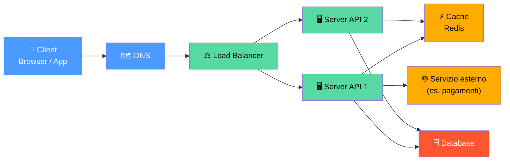
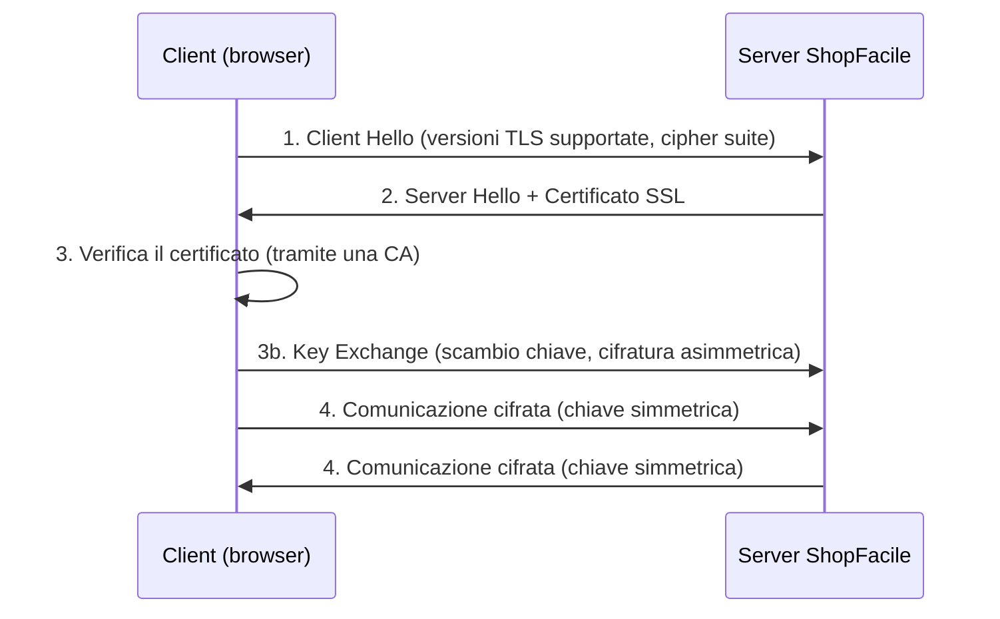
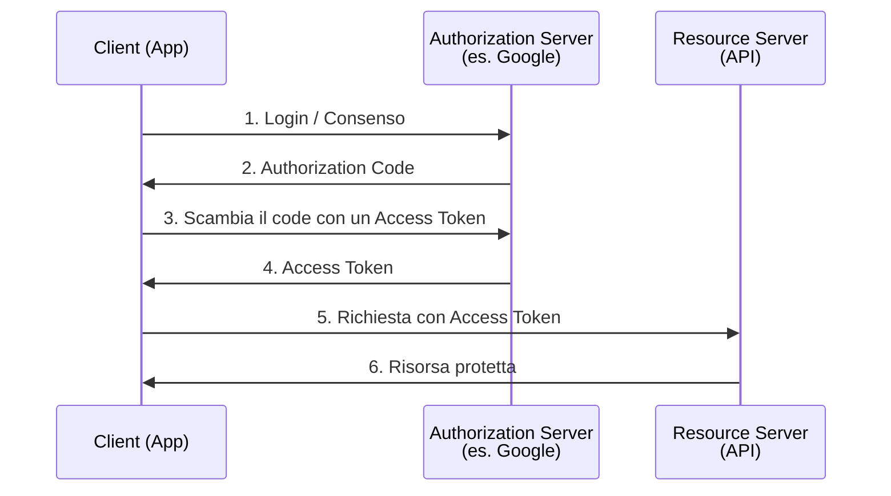
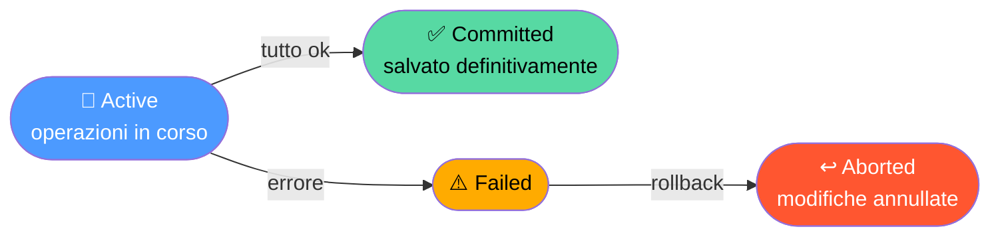
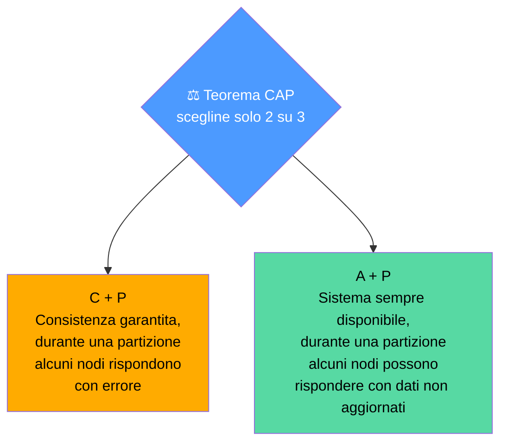
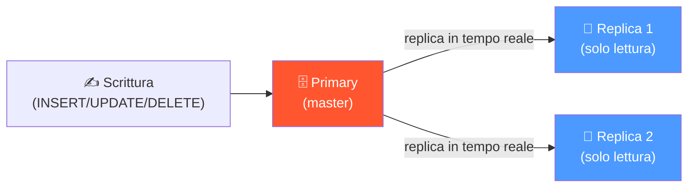
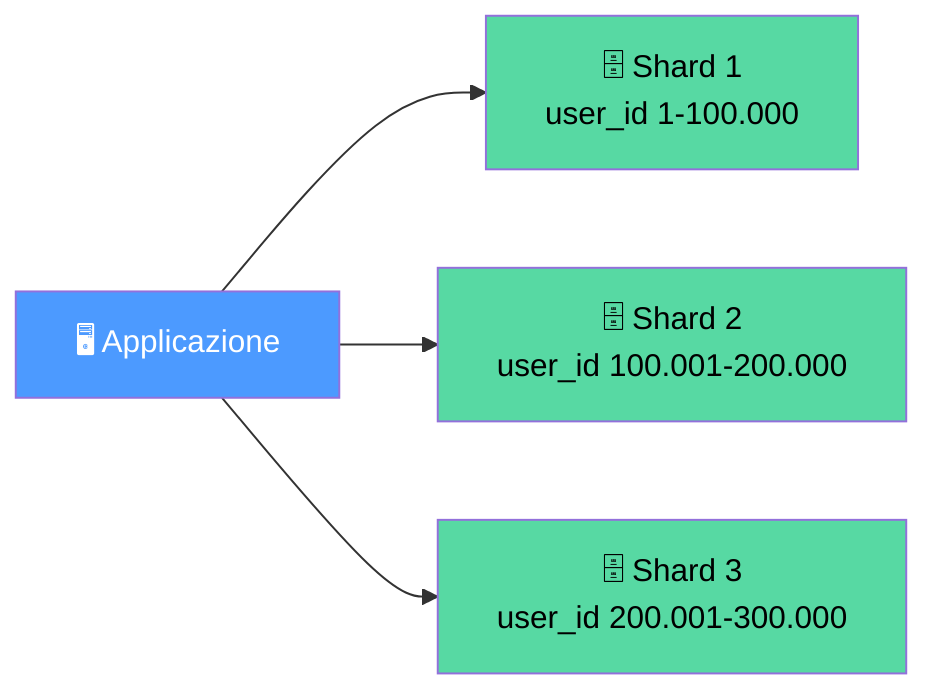
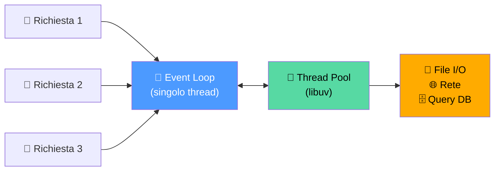
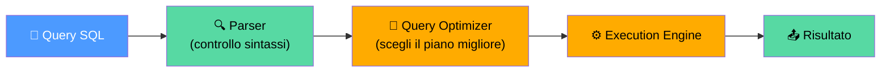

# 20. Backend Engineering Avanzato


> 📄 **[Scarica questa sezione in PDF](https://darioschioppi.github.io/corso-onboarding-devops/pdf/20-backend-engineering.pdf)** — utile per la stampa o la lettura offline.


Nella sezione [2 (Fondamenti di informatica)](../02-fondamenti-informatica/README.md)
hai visto le basi: cos'è HTTP, cos'è un'API, come funziona in linea di
massima un database relazionale. Nella sezione [13 (Sicurezza)](../13-sicurezza/README.md)
hai visto la differenza tra autenticazione e autorizzazione, e il ruolo dei
token. Questa sezione riprende esattamente da lì e **va più a fondo**: è un
approfondimento pensato per il momento in cui, seduto in una revisione
tecnica o in una discussione su una stima, senti termini come "sharding",
"idempotenza di un endpoint", "isolation level" o "cache-aside" e vuoi
capire non solo cosa significano, ma **perché il team li discute e quali
trade-off si nascondono dietro ciascuna scelta**.

Non ti verrà chiesto di scrivere questo codice. Ma capire *perché* Marco
insiste per aggiungere un indice prima di rilasciare una funzionalità,
perché Giulia propone di introdurre una cache invece di "semplicemente
scalare il server", o perché una certa modifica al database richiede una
transazione e non due semplici scritture separate, ti renderà un
interlocutore molto più efficace nelle discussioni tecniche — e ti aiuterà
a stimare meglio il rischio reale di un cambiamento, non solo la sua
dimensione in righe di codice.

Come sempre, restiamo su **ShopFacile**: la stessa piattaforma e-commerce
con Marco e Giulia (developer), Ahmed (developer junior, in crescita),
Sara (Product Owner) e Luca (Scrum Master).

## 🎯 Obiettivi della sezione

Alla fine di questa sezione saprai:

- descrivere l'architettura di un sistema backend "in profondità", dal
  client fino al database, includendo load balancer, cache e servizi
  esterni;
- spiegare cosa succede davvero durante un handshake TLS (HTTPS) e perché
  rende una connessione sicura;
- distinguere sessioni server-side e **JWT**, e ricostruire un flusso
  **OAuth 2.0** completo con i suoi attori;
- riconoscere una API REST progettata bene da una progettata male, secondo
  una checklist concreta (versioning, paginazione, errori, idempotenza);
- spiegare le proprietà **ACID** di una transazione e collegarle a un caso
  reale (es. un trasferimento di saldo);
- distinguere i principali **livelli di isolamento** di una transazione e
  i problemi di concorrenza che prevengono (dirty read, lost update,
  phantom read);
- spiegare il **teorema CAP** e usarlo per motivare la scelta tra database
  relazionale e NoSQL;
- distinguere **replication** e **sharding** come due strategie di scaling
  complementari, non intercambiabili;
- descrivere le principali strategie di **caching** (cache-aside,
  write-through, write-behind) e i problemi di invalidazione che portano
  con sé;
- spiegare, a grandi linee, come Node.js gestisce migliaia di richieste
  concorrenti con un solo thread (event loop);
- riconoscere le cause più comuni di una query lenta e sapere cosa chiedere
  a un developer che dice "il problema è nel database".

---

## 20.1 Architettura di un sistema backend, in profondità

Nella sezione 2 hai visto client, server e database come tre blocchi
separati. Nella realtà, tra il client e il database si interpone quasi
sempre una catena più lunga di componenti, ciascuno con un compito preciso.
Vale la pena vederla per intero almeno una volta, perché ogni "anello"
della catena è un punto dove qualcosa può rallentare o rompersi — e sapere
dove si trova ciascun anello ti aiuta a seguire una diagnosi tecnica senza
perderti.



Il pezzo nuovo rispetto alla sezione 2 è il **Load Balancer**
(bilanciatore di carico): un componente che riceve tutte le richieste in
arrivo e le distribuisce su più server applicativi identici (`Server API
1`, `Server API 2`, ...), invece di farle gestire a un unico server. Questo
risolve due problemi insieme: se un server va sotto carico o si guasta, il
traffico continua a fluire sugli altri; e se il traffico cresce, basta
aggiungere un altro server dietro lo stesso bilanciatore (è esattamente la
**scalabilità orizzontale** già vista nel glossario) senza toccare il
codice dell'applicazione.

> 💡 **Analogia**: il load balancer è come il maître di un ristorante molto
> frequentato: non cucina lui stesso, ma decide a quale dei cuochi
> disponibili (i server) assegnare ogni nuovo ordine (richiesta) che entra,
> in modo che nessun cuoco resti sovraccarico mentre un altro è a mani
> vuote.

Perché questa catena funzioni davvero, però, il modello **Stateless**
visto nella sezione 2 non è un dettaglio elegante: è una condizione
necessaria. Se un server API salvasse "in memoria" i dati della sessione
di un cliente, e il load balancer inviasse la richiesta successiva di
quello stesso cliente a un server diverso, quel server non saprebbe nulla
di lui. Per questo, come vedremo nel paragrafo 20.3, i sistemi moderni
tendono a spostare lo stato fuori dal server applicativo — in un database,
in una cache condivisa o in un token che il client stesso porta con sé a
ogni richiesta.

---

## 20.2 Dentro una richiesta HTTPS: il TLS handshake

Sai già, dalla sezione 2, che HTTPS è "HTTP cifrato" e che vedi il
lucchetto 🔒 nel browser quando è attivo. Vale la pena vedere **cosa
succede davvero**, in pochi passaggi, prima che il primo byte di dati
venga scambiato — è una delle domande più frequenti nei colloqui tecnici
di backend, ed è un buon esempio di come un sistema apparentemente
"istantaneo" (clicchi un link e la pagina compare) in realtà nasconde una
piccola negoziazione a più fasi.



Il punto chiave, che spiega anche perché HTTPS non è "gratis" in termini
di performance: la prima fase (passi 1-3b) usa **crittografia
asimmetrica** — più robusta, ma più lenta — solo per concordare in
sicurezza una chiave condivisa; una volta stabilita quella chiave, tutto il
resto della comunicazione (passo 4, che dura per l'intera sessione) passa a
**crittografia simmetrica**, molto più rapida. È un compromesso deliberato:
usare la parte costosa solo per il minimo indispensabile, la parte
economica per tutto il resto.

Il **certificato SSL** che il server presenta al passo 2 è firmato da una
**Autorità di Certificazione (CA)** riconosciuta: è quello che permette al
browser di verificare al passo 3 che sta davvero parlando con
`shopfacile.it` e non con un impostore che si finge tale (un attacco noto
come *man-in-the-middle*). Se il certificato è scaduto o non è firmato da
una CA fidata, il browser mostra l'avviso "connessione non sicura" che
avrai visto capitare qualche volta.

> 🛠️ **Esempio pratico**: durante un audit, il team scopre che il
> certificato SSL di un sottodominio interno di ShopFacile scadrà tra tre
> giorni. Ahmed lo rinnova in tempo grazie a un allarme di monitoraggio
> (sezione 9.9) impostato apposta per i certificati in scadenza — senza
> quell'allarme, alla scadenza tutti i clienti che visitano quel
> sottodominio vedrebbero un errore di sicurezza nel browser, anche se il
> resto del sito continuerebbe a funzionare perfettamente.

---

## 20.3 Autenticazione stateless: sessioni, JWT e OAuth 2.0 in pratica

Nella sezione 13 hai visto la differenza tra autenticazione, autorizzazione
e token in generale. Qui vediamo **come si costruisce concretamente** un
sistema di autenticazione stateless, e perché è diventato lo standard per
API e app mobile.

### Sessione server-side vs JWT

Il modo "classico" di gestire il login è la **sessione**: dopo
l'autenticazione, il server crea un record (in memoria o in un database)
che dice "l'utente 42 è loggato", e restituisce al browser un identificatore
di sessione (di solito in un cookie). Ad ogni richiesta successiva, il
server consulta quel record per sapere chi sta parlando.

Il **JWT (JSON Web Token)** rovescia l'approccio: invece di far ricordare
al server chi sei, il server ti consegna un token **autocontenuto** — i
dati sull'identità stanno dentro il token stesso, firmato in modo che il
server possa verificarne l'autenticità senza dover consultare nulla.

| | Sessione server-side | JWT |
|---|---|---|
| Dove vive lo stato | Sul server (o in un database condiviso) | Sul client, dentro il token |
| Scalabilità | Richiede uno store di sessioni condiviso tra i server | Naturalmente compatibile con più server dietro un load balancer |
| Revoca immediata | Facile: basta eliminare il record | Difficile: il token resta valido finché non scade |
| Caso d'uso tipico | App web tradizionali, server-rendered | API, app mobile, architetture a microservizi |

Un **JWT** è composto da tre parti separate da un punto:
`header.payload.signature`. L'header dichiara l'algoritmo di firma
usato; il payload contiene i dati (es. id utente, ruolo, scadenza); la
firma è calcolata cifrando le prime due parti con una chiave segreta nota
solo al server — è quella firma che rende impossibile, per chi intercetta
il token, modificarne il contenuto (es. cambiare `"role": "user"` in
`"role": "admin"`) senza che il server se ne accorga alla verifica
successiva.

> 💡 **Analogia**: una sessione server-side è come un braccialetto di un
> evento con solo un numero stampato sopra — chi controlla l'ingresso deve
> consultare una lista per sapere a chi appartiene quel numero. Un JWT è
> come un biglietto che ha già scritto sopra, in modo inalterabile
> (sigillato), "ingresso VIP, valido fino alle 23:00": chi lo controlla
> legge direttamente il biglietto, senza consultare nessuna lista — ma se
> lo perdi, chiunque lo trovi può usarlo fino a quell'orario.

Proprio per questo, la scadenza (`exp`) di un JWT va tenuta **breve**
(minuti, non giorni): è l'unico argine reale contro un token rubato, dato
che non può essere "disattivato" a metà strada come una sessione. La
pratica comune è accompagnare un JWT a vita breve con un **refresh token**
a vita più lunga, che il client usa solo per richiederne uno nuovo quando
quello corrente scade, senza dover richiedere di nuovo username e password
ogni volta.

### OAuth 2.0: delegare un accesso senza cedere la password

La sezione 13 ha già introdotto OAuth come "il meccanismo dietro al
pulsante accedi con Google". Vediamone il flusso completo, con i suoi tre
attori:



Nota che l'app (`Client`) non vede **mai** la password dell'utente: la
inserisce direttamente sulla pagina dell'`Authorization Server` (es.
Google), che al termine restituisce solo un `Access Token` con permessi
**limitati e revocabili** (es. "leggi solo l'email e il nome") — esattamente
la definizione di delega che hai già incontrato nel glossario.

> 🛠️ **Esempio pratico**: ShopFacile integra un pulsante "accedi con
> Google". Sara chiede: "e se un cliente stacca l'accesso da Google, cosa
> succede sul nostro sito?" Marco spiega che l'access token concesso a
> ShopFacile smette di funzionare alla prima richiesta successiva a quella
> revoca — è proprio quel meccanismo di delega revocabile a rendere
> sicura l'integrazione: ShopFacile non ha mai avuto la password del
> cliente da "dimenticare".

---

## 20.4 Progettare una API REST che invecchia bene

Nella sezione 2 hai visto lo stile REST e i verbi HTTP. Qui vediamo alcune
regole pratiche che distinguono una API REST progettata con cura da una
scritta "di corsa" — regole che diventano costose da correggere una volta
che clienti esterni si sono già integrati con l'API.

### Idempotenza: perché conta davvero

Un'operazione è **idempotente** se eseguirla più volte con lo stesso input
produce lo stesso risultato di eseguirla una volta sola. Non è un dettaglio
accademico: è la proprietà che rende sicuro **ritentare** una richiesta
quando la risposta si è persa per un problema di rete (il client non sa se
il server ha effettivamente elaborato la richiesta o no).

| Verbo | Idempotente? | Perché |
|---|---|---|
| `GET` | Sì | Legge, non modifica nulla |
| `PUT` | Sì | "Imposta questa risorsa a questo stato": ripeterlo produce lo stesso stato finale |
| `DELETE` | Sì | Dopo la prima cancellazione, le successive non cambiano nulla (la risorsa è già assente) |
| `POST` | No | Ogni chiamata crea una nuova risorsa: ripeterla crea duplicati |
| `PATCH` | Di solito no | Dipende dall'operazione: "incrementa di 1" non è idempotente, "imposta il campo X a Y" lo è |

> 🛠️ **Esempio pratico**: un cliente di ShopFacile clicca "Conferma
> ordine", la connessione si interrompe per un attimo e il browser
> ritenta automaticamente la stessa richiesta `POST /ordini`. Senza
> precauzioni, il cliente si ritrova con **due ordini identici** addebitati.
> Per questo Giulia introduce una **idempotency key**: il client genera un
> identificatore univoco per quel tentativo di ordine e lo manda
> nell'header della richiesta; se il server vede due richieste con la
> stessa chiave, la seconda restituisce semplicemente il risultato già
> calcolato la prima volta, senza creare un secondo ordine.

### Versionamento, paginazione, errori

La sezione 2 ha già introdotto OpenAPI come "contratto" tra team. Una API
che deve convivere a lungo con client esterni ha bisogno di altre tre
convenzioni, sempre concordate in anticipo:

- **Versionamento** (già visto nel glossario in forma generale): tipicamente
  nell'URL (`/api/v1/ordini`), così una modifica che rompe la
  compatibilità (rimuovere un campo, cambiarne il significato) può
  convivere temporaneamente con la versione precedente, invece di rompere
  di colpo tutti i client esistenti.
- **Paginazione**: restituire migliaia di righe in un'unica risposta
  `GET /api/ordini` è impraticabile. Le due tecniche principali sono la
  **paginazione a offset** (`?page=2&limit=20`, semplice ma lenta su
  dataset molto grandi, perché il database deve comunque scorrere tutte le
  righe saltate) e la **paginazione a cursore** (`?after=id_ultimo_visto`,
  più efficiente su grandi volumi, perché il database può partire
  direttamente da quel punto).
- **Formato degli errori**: un'API ben progettata restituisce errori in un
  formato **coerente e prevedibile** (stesso schema JSON per ogni errore,
  con un codice, un messaggio leggibile e magari un campo che indica quale
  campo della richiesta ha fallito la validazione), non un testo libero
  diverso a ogni endpoint.

> 💡 **Trade-off**: aggiungere versionamento fin dal primo giorno sembra
> un costo "prematuro" quando l'API ha ancora un solo cliente (magari
> l'app stessa di ShopFacile). Ma il costo di introdurlo *dopo*, quando
> già esistono client esterni in produzione che si aspettano l'URL senza
> versione, è enormemente più alto: richiede coordinare un cambiamento con
> ogni consumatore dell'API, non solo modificare il proprio codice.

---

## 20.5 Transazioni e proprietà ACID

Hai già incontrato SQL e le tabelle nella sezione 2. Ora affrontiamo un
concetto che diventa cruciale ogni volta che un'operazione tocca **più di
una riga, o più di una tabella, che devono cambiare insieme o non
cambiare affatto**.

Una **transazione** è una sequenza di operazioni sul database trattata
come **un'unica unità di lavoro**: o tutte le operazioni hanno successo
(`COMMIT`), o nessuna viene applicata (`ROLLBACK`) — non esiste una via di
mezzo dove solo metà delle operazioni sono state salvate.

```sql
BEGIN;
UPDATE conti SET saldo = saldo - 1000 WHERE id = 1;  -- addebito
UPDATE conti SET saldo = saldo + 1000 WHERE id = 2;  -- accredito
COMMIT;  -- se qualcosa va storto: ROLLBACK;
```

> 💡 **Analogia**: pensa a un trasferimento di denaro come a due persone
> che si scambiano una busta con dei soldi. Se una lascia cadere la busta
> a metà passaggio, non puoi lasciare che una persona abbia "già dato" e
> l'altra non abbia "ancora ricevuto": la transazione garantisce che
> l'intero scambio avvenga, oppure che sia come se non fosse mai
> cominciato — nessuno stato intermedio è ammesso.

Le proprietà che ogni transazione deve garantire si chiamano **ACID**:

| Proprietà | Cosa garantisce | Esempio ShopFacile |
|---|---|---|
| **Atomicity** (atomicità) | Tutto o nulla | L'addebito e l'accredito avvengono insieme, o nessuno dei due |
| **Consistency** (coerenza) | Il database resta in uno stato valido | Il saldo non può mai diventare negativo, se esiste quel vincolo |
| **Isolation** (isolamento) | Transazioni concorrenti non si "vedono" a metà strada | Due clienti che prenotano l'ultimo posto disponibile non finiscono entrambi per "vincerlo" |
| **Durability** (durabilità) | Una volta confermata, la modifica resta anche dopo un crash | Un ordine confermato non "svanisce" se il server si riavvia un secondo dopo |

Le transazioni passano per **stati** ben definiti:



---

## 20.6 Isolamento e concorrenza: cosa può andare storto tra due transazioni

La proprietà di **Isolation** vista sopra non è un interruttore
tutto-o-nulla: i database offrono diversi **livelli di isolamento**, ognuno
con un compromesso diverso tra correttezza e velocità. Per capire perché
servono, guardiamo prima **cosa può andare storto** quando due transazioni
girano nello stesso momento sugli stessi dati:

| Problema | Cosa succede | Esempio |
|---|---|---|
| **Dirty read** (lettura sporca) | Una transazione legge dati scritti da un'altra transazione **non ancora confermata** | T1 legge un saldo che T2 ha modificato ma poi annulla con ROLLBACK |
| **Non-repeatable read** (lettura non ripetibile) | La stessa query, eseguita due volte nella stessa transazione, restituisce risultati diversi | T1 legge il prezzo di un prodotto due volte e ottiene due valori diversi, perché T2 lo ha modificato nel frattempo |
| **Phantom read** (lettura fantasma) | Una query che seleziona un intervallo di righe restituisce righe diverse se ripetuta, perché nel frattempo ne sono state inserite di nuove | T1 conta gli ordini di oggi due volte, T2 ne inserisce uno in mezzo, il secondo conteggio è più alto |
| **Lost update** (aggiornamento perso) | Due transazioni leggono lo stesso valore, lo modificano entrambe, e l'ultima sovrascrive silenziosamente il lavoro della prima | Due operatori aggiornano lo stock dello stesso prodotto contemporaneamente: l'ultimo "vince", il primo aggiornamento sparisce senza errori |

I livelli di isolamento standard, dal più permissivo (rapido, ma più
rischioso) al più rigoroso (sicuro, ma più lento):

| Livello | Dirty read | Non-repeatable read | Phantom read | Note |
|---|---|---|---|---|
| **Read Uncommitted** | Possibile | Possibile | Possibile | Raramente usato in pratica |
| **Read Committed** | Evitato | Possibile | Possibile | Predefinito in PostgreSQL e SQL Server |
| **Repeatable Read** | Evitato | Evitato | Possibile | Predefinito in MySQL (InnoDB) |
| **Serializable** | Evitato | Evitato | Evitato | Massima coerenza, ma più lento e con più blocchi |

### Come i database moderni riducono il costo dell'isolamento: MVCC

Il modo più semplice per garantire l'isolamento sarebbe **bloccare** i dati
ogni volta che qualcuno li sta modificando (**locking pessimistico**): chi
vuole leggere deve aspettare che chi scrive finisca. Funziona, ma penalizza
la concorrenza — molte letture restano in coda dietro poche scritture.

La maggior parte dei database moderni (PostgreSQL, MySQL InnoDB) usa invece
il **MVCC (Multi-Version Concurrency Control)**: quando una riga viene
modificata, il database non la sovrascrive subito, ma mantiene **più
versioni** della stessa riga contemporaneamente. Chi sta leggendo continua
a vedere la versione coerente con l'inizio della propria transazione,
mentre chi scrive lavora su una nuova versione — **i lettori non bloccano
gli scrittori, e viceversa**. È il motivo per cui, in pratica, un database
moderno riesce a gestire moltissime letture concorrenti senza che
rallentino a vicenda con le scritture in corso.

> 💡 **Trade-off**: MVCC non è gratuito — mantenere più versioni della
> stessa riga richiede spazio e un processo periodico (in PostgreSQL si
> chiama *vacuum*) che elimina le versioni ormai inutili. Un database che
> non viene mai "pulito" accumula versioni vecchie e finisce, paradossalmente,
> a rallentare per lo stesso motivo che doveva risolvere.

---

## 20.7 NoSQL e il teorema CAP

La sezione 2 ha introdotto i database NoSQL come alternativa ai
relazionali quando i dati sono meno strutturati o i volumi molto grandi.
Il motivo tecnico per cui esistono famiglie di database così diverse tra
loro è riassunto da un teorema fondamentale per chi progetta sistemi
distribuiti.

Il **teorema CAP** afferma che, in un sistema distribuito (dati sparsi su
più macchine collegate in rete), è possibile garantire **solo due delle
tre proprietà seguenti allo stesso tempo**:

- **Consistency (C)**: ogni nodo del sistema vede sempre gli stessi dati,
  nello stesso istante;
- **Availability (A)**: il sistema resta sempre disponibile a rispondere,
  anche se qualcosa va storto;
- **Partition Tolerance (P)**: il sistema continua a funzionare anche se
  la rete tra i nodi si interrompe temporaneamente (una "partizione").



Nota che la **Partition Tolerance** non è davvero opzionale in un sistema
reale distribuito su più macchine o data center: le reti si interrompono,
è un fatto della vita, non una scelta di design. La scelta pratica che un
team fa davvero è quindi tra **C+P** e **A+P**:

| Scelta | Comportamento durante un problema di rete | Esempi |
|---|---|---|
| **C + P** (Consistenza) | Alcuni nodi rispondono con un errore, piuttosto che con un dato potenzialmente non aggiornato | MongoDB (configurazione predefinita) |
| **A + P** (Disponibilità) | Il sistema risponde sempre, anche con dati leggermente non aggiornati (coerenza eventuale) | Cassandra, DynamoDB |

> 🛠️ **Esempio pratico**: Sara chiede perché il carrello di ShopFacile usa
> un database diverso (orientato a disponibilità) rispetto al sistema di
> pagamento (orientato a consistenza). Marco spiega: se il carrello
> risponde per un istante con un dato leggermente vecchio durante un
> problema di rete, il peggio che succede è che un cliente veda un
> articolo che ha già rimosso — fastidioso, non grave. Se invece il
> sistema di pagamento "inventasse" un saldo per restare sempre
> disponibile, il rischio è addebitare due volte la stessa carta: lì la
> consistenza vale più della disponibilità, sempre.

Questo spiega anche la riga della sezione 2 su "**Transazioni**: Forte
supporto ACID (SQL) / Consistenza eventuale, spesso BASE (NoSQL)": **BASE**
(Basically Available, Soft state, Eventually consistent) è, in un certo
senso, l'opposto filosofico di ACID — un compromesso deliberato in favore
della disponibilità e della scalabilità, accettando che i dati possano
essere temporaneamente non sincronizzati tra i nodi.

---

## 20.8 Scalare un database: replication e sharding

Quando un singolo database non basta più — troppe letture, troppe
scritture, o troppi dati per una sola macchina — esistono due strategie
distinte, spesso confuse tra loro ma complementari.

### Replication: copie per scalare le letture

La **replication** mantiene **più copie identiche** dello stesso database:
un nodo **primario** (o master) gestisce tutte le scritture, e le propaga
automaticamente a uno o più nodi **replica** (o slave), che gestiscono le
letture.



Il beneficio è duplice: le letture (spesso la maggioranza del traffico su
un e-commerce come ShopFacile: catalogo, ricerche, dettagli prodotto) si
distribuiscono su più macchine, e se il primario si guasta, una replica può
essere promossa rapidamente al suo posto, garantendo alta disponibilità.

> 💡 **Trade-off**: la propagazione dalla primary alle replica richiede un
> istante, non è mai istantanea. Se un cliente aggiorna il proprio
> indirizzo e la pagina successiva legge da una replica che non ha ancora
> ricevuto quella modifica, potrebbe vedere per una frazione di secondo il
> vecchio indirizzo. È lo stesso concetto di "coerenza eventuale" visto a
> proposito del teorema CAP, applicato qui a un database relazionale
> "normale".

### Sharding: dividere i dati per scalare le scritture

Il **sharding** (o partizionamento orizzontale) affronta un problema
diverso: quando i **dati stessi** sono troppo grandi o le **scritture**
troppo frequenti per una singola macchina, anche con più repliche in
lettura. La soluzione è dividere i dati in porzioni indipendenti (**shard**),
distribuite su macchine diverse, in base a una **chiave di sharding** (es.
`user_id`).



| | Replication | Sharding |
|---|---|---|
| Problema che risolve | Troppe **letture** | Troppi **dati** o troppe **scritture** |
| Cosa contiene ogni nodo | L'intero database, in copia | Solo una porzione dei dati |
| Complessità | Relativamente semplice da introdurre | Più complessa: query che toccano più shard, ribilanciamento se una chiave cresce troppo |
| Si possono combinare? | Sì: ogni shard può a sua volta avere le proprie repliche | — |

> 🛠️ **Esempio pratico**: ShopFacile cresce e il database ordini diventa
> troppo grande per una macchina sola. Il team valuta di shardare per
> `region` (area geografica) invece che per `user_id`: significa che tutti
> gli ordini di una stessa area finiscono sullo stesso shard, il che rende
> semplici i report regionali ma rischia di sovraccaricare lo shard
> dell'area più popolosa in modo squilibrato rispetto agli altri — la
> scelta della chiave di sharding, come spesso accade, è un compromesso
> senza soluzione perfetta, solo trade-off diversi da valutare rispetto ai
> pattern di accesso reali.

---

## 20.9 Caching: velocità in cambio di un problema nuovo

Aggiungere una cache è probabilmente la singola modifica più efficace per
velocizzare un sistema che legge spesso gli stessi dati — ma introduce un
problema nuovo, spesso riassunto dalla battuta (vera, non solo umoristica)
che l'invalidazione della cache è "uno dei due problemi difficili
dell'informatica".


Questo pattern si chiama **cache-aside** (o *lazy loading*): l'applicazione
controlla prima la cache; se il dato c'è (**cache hit**), lo restituisce
immediatamente, senza toccare il database; se non c'è (**cache miss**), lo
recupera dal database, lo salva in cache per la prossima volta, e solo
allora risponde. È lo schema più diffuso perché è semplice e "fallisce
bene": se la cache non è disponibile, il sistema continua a funzionare
appoggiandosi al database, solo più lentamente.

Esistono strategie alternative, ciascuna con un trade-off diverso:

| Strategia | Come funziona | Trade-off |
|---|---|---|
| **Cache-aside** | L'app scrive nel DB, la cache si popola solo alla prima lettura successiva | Il primo accesso dopo una modifica è sempre un cache miss |
| **Write-through** | Ogni scrittura aggiorna cache e database insieme, nella stessa operazione | Sempre coerente, ma ogni scrittura è più lenta |
| **Write-behind** (write-back) | Si scrive subito in cache, e nel database in modo asincrono, dopo | Scritture molto rapide, ma rischio di perdere dati se la cache si guasta prima che il database venga aggiornato |

### Il problema vero: l'invalidazione

Una volta che un dato è in cache, cosa succede quando quel dato **cambia**
nel database? Se la cache non viene aggiornata o rimossa, il client
continua a ricevere un dato **vecchio** — un bug particolarmente insidioso
perché "sembra funzionare" (il sistema risponde, velocemente, solo con il
dato sbagliato). Le tecniche principali:

- **TTL (Time To Live)**: ogni voce in cache scade automaticamente dopo un
  tempo prefissato — semplice, ma per quella finestra di tempo il dato può
  essere non aggiornato;
- **Invalidazione esplicita**: quando il dato cambia nel database, il
  codice stesso rimuove (o aggiorna) la voce corrispondente in cache;
- **Basata su eventi**: un cambiamento pubblica un evento (collegandosi a
  quanto visto sull'architettura event-driven nella sezione 11) che un
  consumer usa per invalidare la cache, anche in altri servizi che non
  hanno scritto direttamente quel dato.

> 💡 **Analogia**: la cache è come un foglietto con gli appunti delle
> risposte più richieste, tenuto a portata di mano sulla scrivania invece
> che nell'archivio in fondo al corridoio (il database). È velocissimo da
> consultare — ma se qualcuno aggiorna l'informazione nell'archivio e
> nessuno aggiorna anche il foglietto, chi consulta il foglietto continua a
> dare la risposta vecchia, con piena sicurezza di avere ragione.

Quando la cache si riempie, un'ultima decisione riguarda **cosa buttare
via** per far spazio a dati nuovi (**eviction policy**): le più comuni sono
**LRU** (*Least Recently Used*, elimina ciò che non viene consultato da più
tempo) e **LFU** (*Least Frequently Used*, elimina ciò che viene consultato
meno spesso in assoluto) — Redis, la cache in-memory più diffusa, supporta
entrambe le politiche in configurazione.

---

## 20.10 Concorrenza nel backend: thread, processi ed event loop

Un server backend reale gestisce **migliaia di richieste al secondo**, non
una alla volta. Come questo sia possibile dipende dal modello di
concorrenza scelto dal linguaggio o dal framework — e cambia
sostanzialmente il modo in cui un problema di performance va diagnosticato.

### Processo vs Thread

| | Processo | Thread |
|---|---|---|
| Definizione | Programma indipendente, con propria memoria | Unità di esecuzione più leggera, dentro un processo |
| Memoria | Separata da ogni altro processo | Condivisa con gli altri thread dello stesso processo |
| Isolamento | Alto: se un processo va in crash, gli altri non ne sono toccati | Basso: un crash di un thread può travolgere l'intero processo |
| Costo di creazione | Più lento | Più rapido |

### Concorrenza vs parallelismo

Sono due parole spesso confuse, ma indicano cose diverse: la
**concorrenza** significa gestire più attività **senza che debbano
avanzare necessariamente nello stesso istante** (es. un solo core che
alterna rapidamente tra più richieste); il **parallelismo** significa farle
avanzare **davvero nello stesso istante**, su core diversi. Un server può
essere concorrente senza essere parallelo.

### L'event loop: come Node.js gestisce migliaia di richieste con un thread

Node.js (uno dei linguaggi elencati nella sezione 2 tra le tecnologie
backend comuni) adotta un modello particolare: un **singolo thread
principale** che non blocca mai in attesa di un'operazione lenta (lettura
da disco, chiamata di rete, query al database). Quando una di queste
operazioni viene richiesta, il thread principale la delega a un **thread
pool** interno e continua immediatamente a occuparsi di altre richieste;
quando l'operazione lenta finisce, il suo risultato rientra nel flusso
principale tramite una **callback**.



> 💡 **Analogia**: pensa a un solo cameriere (l'event loop) che gestisce
> molti tavoli. Non resta impalato al tavolo 3 aspettando che la cucina
> finisca un piatto: prende l'ordine, lo passa in cucina (il thread pool)
> e va immediatamente a servire il tavolo 4. Quando il piatto del tavolo 3
> è pronto, la cucina lo avvisa e lui lo porta — un solo cameriere può
> servire molti tavoli, a patto che non debba **mai** restare fermo ad
> aspettare.

Il rovescio della medaglia: se qualcuno scrive per errore del codice che
**blocca** quell'unico thread principale (es. un calcolo molto pesante
eseguito in modo sincrono), **tutte** le altre richieste restano in coda
fino a quando quel calcolo non finisce — è uno degli errori più comuni e
più dannosi in un'applicazione Node.js, ed è il motivo per cui si insiste
tanto su operazioni asincrone (`async`/`await`) per ogni cosa lenta.

### Race condition: il problema della concorrenza vera

Quando più thread (o processi) **accedono e modificano lo stesso dato
condiviso contemporaneamente**, senza coordinamento, si crea una **race
condition**:

```
int contatore = 0;
// Thread 1: contatore++;
// Thread 2: contatore++;
// Il valore finale può essere 1 invece di 2, se le due operazioni
// si sovrappongono nel momento sbagliato
```

La soluzione classica è un **lock** (o mutex): un meccanismo che garantisce
che, in un dato momento, solo un thread alla volta possa accedere a quella
porzione di codice condivisa (la "sezione critica"). Un **read-write lock**
è una variante più permissiva: permette a molti thread di leggere insieme,
ma richiede accesso esclusivo per chi scrive — utile quando le letture sono
molto più frequenti delle scritture, come spesso accade in un catalogo
prodotti.

---

## 20.11 Query optimization: come una query lenta diventa rapida

Quando un developer del team dice "questa pagina è lenta perché la query
sotto è lenta", ecco cosa succede davvero, e cosa si può fare.

### Come viene eseguita una query



Il pezzo interessante è il **Query Optimizer**: prima di eseguire
davvero la query, il database valuta più modi possibili di eseguirla (con
o senza un certo indice, in che ordine unire le tabelle) e stima quale
sarà il più rapido, basandosi su statistiche interne sui dati. Il comando
`EXPLAIN` (visto nella sezione 2 a proposito degli indici) mostra
esattamente **quale piano** ha scelto — è lo strumento numero uno per
capire perché una query è lenta, prima ancora di modificare qualcosa.

### Le cause più comuni di una query lenta

- **Full table scan**: il database legge **tutta** la tabella riga per
  riga perché non esiste un indice utile sulla colonna del `WHERE` — su
  una tabella da poche migliaia di righe non si nota, su una da milioni
  diventa il primo sospetto;
- **Indici mancanti o sbagliati** su colonne usate spesso in `WHERE`,
  `JOIN` o `ORDER BY`;
- **`SELECT *`** quando servono solo 2-3 colonne: si trasferiscono e si
  elaborano dati inutili;
- **Funzioni applicate a colonne indicizzate** nel `WHERE` (es.
  `WHERE YEAR(data) = 2026`): impediscono al database di usare l'indice su
  `data`, anche se esiste — la versione corretta confronta direttamente
  l'intervallo di date (`WHERE data >= '2026-01-01' AND data < '2027-01-01'`);
- **Paginazione a offset molto alto** (`LIMIT 20 OFFSET 500000`): il
  database deve comunque scorrere le prime 500.000 righe scartate — è
  proprio il motivo per cui la paginazione a cursore, vista al paragrafo
  20.4, è preferibile su dataset grandi.

> 🛠️ **Esempio pratico**: Ahmed nota che la pagina "i miei ordini" di
> ShopFacile è diventata lenta dopo che il catalogo clienti è cresciuto.
> Esegue `EXPLAIN` sulla query e scopre che il piano di esecuzione mostra
> `type: ALL` (full table scan) sulla colonna `user_id` della tabella
> ordini: non esiste nessun indice su quella colonna, quindi ogni volta
> il database scorre l'intera tabella per trovare gli ordini di un
> cliente. Crea l'indice (`CREATE INDEX idx_orders_user_id ON
> ordini(user_id)`) e il tempo di risposta scende da secondi a
> millisecondi — un cambiamento piccolo, ma con un impatto enorme,
> esattamente il tipo di intervento che vale la pena chiedere per primo
> quando qualcuno segnala "il database è lento".

> 💡 **Trade-off**: un indice non è mai "gratis". Accelera le letture, ma
> ogni scrittura (`INSERT`/`UPDATE`/`DELETE`) deve aggiornare anche tutti
> gli indici esistenti su quella tabella — troppi indici su una tabella
> con scritture frequenti possono rallentarle sensibilmente. È un
> equilibrio da valutare caso per caso, non una regola "più indici, sempre
> meglio".

---

## 20.12 Checklist finale: un'API pronta per la produzione

Riprendendo tutti i fili di questa sezione, ecco una checklist pratica che
un team maturo verifica prima di considerare un'API davvero pronta per
essere usata da altri (non solo "funziona sul mio computer"):

1. **Nomi ed endpoint coerenti**: nomi al plurale, sostantivi non verbi
   (`/ordini`, non `/creaOrdine`), maiuscole/minuscole consistenti.
2. **Verbi e status HTTP corretti**: `POST` per creare, `GET` per leggere,
   `404` quando la risorsa non esiste, `401`/`403` quando manca
   autenticazione/autorizzazione — non tutto ridotto a `200` con un campo
   `"success": false` dentro il corpo.
3. **Autenticazione e autorizzazione** implementate (paragrafo 20.3),
   sempre su HTTPS (paragrafo 20.2).
4. **Validazione dell'input** lato server, non solo lato client (che un
   utente può bypassare facilmente).
5. **Idempotenza** garantita dove serve (paragrafo 20.4), specialmente su
   operazioni economicamente sensibili come pagamenti e ordini.
6. **Paginazione** su ogni endpoint che può restituire liste grandi.
7. **Versionamento** pianificato fin dal primo rilascio pubblico, anche se
   sembra prematuro.
8. **Rate limiting**: un limite al numero di richieste che un singolo
   client può fare in un intervallo di tempo, per evitare abusi o un
   singolo client "affamato" che degrada il servizio per tutti gli altri.
9. **Documentazione** con OpenAPI/Swagger (sezione 2), mantenuta allineata
   al comportamento reale.
10. **Monitoraggio e log** (sezione 9) su ogni endpoint critico, per
    scoprire i problemi prima che li segnalino gli utenti.

---

## 20.13 Riepilogo

- Un sistema backend reale è una catena di componenti — DNS, load
  balancer, server applicativi, cache, database, servizi esterni — non un
  singolo blocco; il modello **stateless** è ciò che rende possibile
  distribuire il traffico su più server senza problemi.
- **HTTPS** stabilisce un canale sicuro tramite un handshake TLS che
  negozia una chiave condivisa usando crittografia asimmetrica solo
  all'inizio, per poi passare a crittografia simmetrica, più rapida, per
  tutta la sessione.
- Le **sessioni server-side** mantengono lo stato sul server; i **JWT**
  spostano lo stato, firmato e verificabile, sul client — una scelta
  architetturale con conseguenze dirette su scalabilità e revocabilità.
  **OAuth 2.0** permette di delegare un accesso limitato senza mai cedere
  la password.
- Una API REST "che invecchia bene" ha idempotenza dove serve,
  versionamento, paginazione ed errori coerenti pensati fin dal principio,
  non aggiunti in fretta quando è già troppo tardi.
- Le **transazioni** garantiscono le proprietà **ACID**; i **livelli di
  isolamento** governano quali problemi di concorrenza (dirty read, lost
  update, phantom read...) sono ammessi in cambio di maggiore velocità; il
  **MVCC** è la tecnica con cui i database moderni riducono il costo
  dell'isolamento senza bloccare tutto.
- Il **teorema CAP** spiega perché database diversi fanno scelte diverse
  tra consistenza e disponibilità durante un problema di rete — ed è la
  base razionale per scegliere tra SQL e NoSQL, non una moda tecnologica.
- **Replication** scala le letture con copie dei dati; **sharding** scala
  scritture e volumi dividendo i dati stessi: sono strategie complementari,
  non alternative.
- Il **caching** (cache-aside, write-through, write-behind) accelera un
  sistema, ma introduce il problema dell'invalidazione — spesso la parte
  più difficile, non la parte più "furba" del pattern.
- Il modello a **event loop** (Node.js) gestisce moltissime richieste
  concorrenti con un solo thread, a patto che nessuna operazione lo
  blocchi; le **race condition** nascono quando thread diversi modificano
  dati condivisi senza coordinamento, e si prevengono con lock e strutture
  dati pensate per la concorrenza.
- La maggior parte delle **query lente** ha una causa individuabile con
  `EXPLAIN`: indici mancanti, full table scan, funzioni su colonne
  indicizzate, paginazione a offset molto alto — quasi sempre risolvibile
  senza riscrivere l'applicazione.

Con questa sezione hai completato il ponte tra i concetti di base visti
nella sezione 2 e le decisioni architetturali reali che il team di
ShopFacile discute ogni settimana. Non serve saper scrivere questo codice
da solo — ma la prossima volta che qualcuno propone "aggiungiamo una
cache" o "dobbiamo shardare il database", saprai esattamente quale
domanda fare per capire se è la scelta giusta.

---

## 📝 Esercizi pratici

1. **Ricostruisci la catena di una richiesta.** Disegna a mano lo schema
   della sezione 20.1 (client → DNS → load balancer → server → database)
   e aggiungi, con un colore diverso, dove inseriresti una cache — a
   monte o a valle del load balancer, e perché.
   ✅ **Come verificare**: il tuo schema ha almeno 5 "anelli" distinti e
   sai spiegare a voce, senza guardare gli appunti, cosa succederebbe se
   uno qualsiasi di essi si guastasse.

2. **Racconta il TLS handshake con parole tue.** Spiega a un collega non
   tecnico, in 4-5 frasi, perché HTTPS richiede uno "scambio di
   presentazioni" prima di iniziare a parlare, usando un'analogia diversa
   da quella della busta sigillata già vista in questa sezione.
   ✅ **Come verificara**: chi ti ascolta riesce a spiegarti a sua volta,
   con parole proprie, perché la prima parte della connessione è "più
   lenta" della seconda.

3. **Sessione o JWT?** Per tre scenari diversi — (a) un sito web
   tradizionale con login, (b) un'app mobile che parla con un'API, (c) un
   sistema di microservizi interni — decidi se useresti sessioni
   server-side o JWT, motivando la scelta con almeno un criterio della
   tabella del paragrafo 20.3 (non solo "perché è più moderno").
   ✅ **Come verificare**: per ciascuno dei tre scenari la tua
   motivazione cita esplicitamente scalabilità o revocabilità, non solo
   una preferenza generica.

4. **Trova un endpoint non idempotente nel tuo progetto reale.** Chiedi a
   un developer del team se esiste (o è mai esistito) un bug legato a una
   richiesta duplicata (doppio ordine, doppio pagamento, doppia email) e
   fatti raccontare come è stato risolto.
   ✅ **Come verificare**: sai riassumere in una frase se la soluzione
   trovata dal team corrisponde a una idempotency key, un controllo lato
   database, o un altro meccanismo — e la differenza fra questi approcci.

5. **Applica ACID a un caso non bancario.** Pensa a un'operazione del tuo
   progetto che tocca più tabelle insieme (non necessariamente denaro:
   es. "cancella un utente e tutti i suoi ordini") e spiega, proprietà per
   proprietà, cosa garantirebbe l'atomicità, la coerenza, l'isolamento e
   la durabilità in quel caso specifico.
   ✅ **Come verificare**: per ogni lettera di ACID hai scritto una frase
   specifica al tuo esempio, non la definizione generica del paragrafo
   20.5.

6. **Riconosci un problema di concorrenza.** Rileggi le quattro righe della
   tabella al paragrafo 20.6 (dirty read, non-repeatable read, phantom
   read, lost update) e inventa un piccolo scenario di ShopFacile (o del
   tuo progetto) per ciascuno, diverso da quelli già scritti nella
   sezione.
   ✅ **Come verificare**: i tuoi quattro scenari sono tra loro
   distinguibili — se due si somigliano troppo, probabilmente hai confuso
   due dei quattro problemi.

7. **CAP theorem, in una frase.** Scegli due sistemi che usi ogni giorno
   (es. un'app di messaggistica e l'home banking) e per ciascuno decidi
   se, a tuo giudizio, privilegia consistenza o disponibilità, spiegando
   il "cosa succederebbe se sbagliasse" per ciascuna delle due scelte.
   ✅ **Come verificare**: la tua spiegazione per ognuno dei due sistemi
   fa riferimento a una conseguenza concreta (es. "vedo un messaggio in
   ritardo" vs "vedo un saldo sbagliato"), non solo al nome della
   proprietà.

8. **Replication o sharding?** Per tre problemi diversi — (a) troppe
   letture sul catalogo prodotti, (b) un'unica tabella ordini troppo
   grande per una macchina, (c) un picco di traffico solo durante il
   Black Friday — indica quale delle due strategie (o entrambe) userebbe
   ShopFacile, motivando con il criterio della tabella al paragrafo 20.8.
   ✅ **Come verificare**: per il caso (c) hai considerato che potrebbe
   non richiedere né l'una né l'altra, ma semplicemente più server
   applicativi dietro il load balancer — non ogni problema di scala è un
   problema di database.

9. **Progetta una cache-key.** Per un endpoint `GET /api/prodotti/{id}` di
   ShopFacile, scrivi una chiave di cache sensata (seguendo l'esempio
   "buono vs cattivo" del materiale di questa sezione) e stabilisci un TTL
   plausibile, motivando la scelta in base a quanto spesso pensi che il
   prezzo o la disponibilità di un prodotto possano cambiare.
   ✅ **Come verificare**: la tua chiave include l'id del prodotto (non è
   generica come `dati` o `temp`) e il TTL scelto è accompagnato da una
   motivazione, non un numero a caso.

10. **Diagnostica una query lenta (esercizio guidato).** Chiedi a un
    developer del team di mostrarti, anche solo per 10 minuti, l'output di
    un `EXPLAIN` su una query reale del progetto (lenta o no) e fatti
    indicare il valore della colonna `type`/`rows` corrispondente.
    ✅ **Come verificare**: sai indicare, a parole tue, se quella query
    sta usando un indice o facendo una scansione completa della tabella,
    guardando l'output che ti è stato mostrato.

---

## 🔗 Collegamenti

- [2. Fondamenti di informatica](../02-fondamenti-informatica/README.md) — le basi di HTTP, DNS, API, REST, SQL e JOIN su cui questa sezione costruisce
- [11. Architetture software](../11-architetture-software/README.md) — monolite, microservizi ed event-driven architecture, il contesto in cui vivono le scelte di caching e scaling viste qui
- [13. Sicurezza](../13-sicurezza/README.md) — autenticazione, autorizzazione, token, OAuth e OpenID Connect nella loro forma generale
- [16. Glossario](../16-glossario/README.md) — tutti i termini di questa sezione, in ordine alfabetico

## 📚 Risorse

- [MDN Web Docs — HTTP](https://developer.mozilla.org/it/docs/Web/HTTP) — riferimento completo su protocollo HTTP, metodi e status code
- [jwt.io — Introduzione ai JSON Web Token](https://jwt.io/introduction) — spiegazione interattiva della struttura di un JWT
- [OAuth.net — Introduzione a OAuth 2.0](https://oauth.net/2/) — documentazione ufficiale del protocollo
- [PostgreSQL — Livelli di isolamento delle transazioni](https://www.postgresql.org/docs/current/transaction-iso.html) — documentazione ufficiale, con esempi concreti dei problemi di concorrenza
- [Martin Kleppmann — Designing Data-Intensive Applications](https://dataintensive.net/) — il libro di riferimento su database distribuiti, CAP theorem, replication e sharding
- [Redis — Documentazione sulle strategie di caching](https://redis.io/docs/latest/develop/) — pattern di caching ed eviction policy
- [Node.js — Event Loop, spiegato ufficialmente](https://nodejs.org/en/learn/asynchronous-work/event-loop-timers-and-nexttick) — come funziona davvero l'event loop
- [Use The Index, Luke! — Guida agli indici SQL](https://use-the-index-luke.com/) — guida pratica, indipendente dal database, su indici e query optimization
- [Microsoft REST API Guidelines](https://github.com/microsoft/api-guidelines) — linee guida concrete per progettare API REST solide
